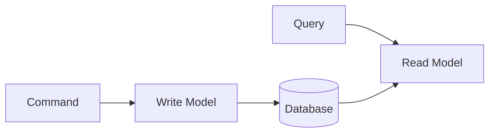

# DDD Glossary

A compilation of core Domain-Driven Design terminology.

## Strategic Design

### Bounded Context

**Definition:** An explicit boundary within which a specific domain model applies and maintains consistency

**Characteristics:**
- The same term can have different meanings in different Contexts
- Each Context has its own independent model
- Typically one team manages one Context

**Example:**
- "Product" in Sales Context = price, promotions
- "Product" in Inventory Context = quantity, warehouse location

---

### Context Mapping

**Definition:** Defining the relationships and integration methods between Bounded Contexts

**Key Patterns:**

| Pattern | Description | When to Use |
|---------|-------------|-------------|
| **Shared Kernel** | Two Contexts share part of the model | Close collaboration needed |
| **Customer-Supplier** | Supplier provides API, consumer uses it | Clear dependency relationship |
| **Conformist** | Consumer follows supplier's model as-is | No negotiating power |
| **Anti-Corruption Layer** | Translation layer to convert external models | Legacy integration |
| **Open Host Service** | Expose standard API | Multiple consumers |
| **Published Language** | Use standard data format | Event integration |

---

### Ubiquitous Language

**Definition:** A common language shared between developers and domain experts

**Characteristics:**
- Same terminology used in code, documentation, and conversations
- Each Context can have its own language
- Defined and managed through a glossary

**Practice:**
```
Business term: "Confirm an order"
Code: order.confirm()
Test: @Test void order_confirmation_changes_status_to_CONFIRMED()
```

---

### Core Domain

**Definition:** The domain that provides core competitive advantage to the business

**Characteristics:**
- Contains the most important and complex business logic
- Should be handled by the best developers
- Should not be outsourced

---

### Supporting Domain

**Definition:** A domain that supports the Core Domain but is not core itself

**Characteristics:**
- Necessary for business but not a differentiator
- Can use external solutions
- Examples: User authentication, notifications

---

### Generic Domain

**Definition:** A domain commonly needed across all businesses

**Characteristics:**
- Can purchase/use standard solutions
- Examples: Email, payment gateways

---

## Tactical Design

### Entity

**Definition:** A domain object distinguished by a unique Identity

**Characteristics:**
- Remains the same object even when state changes
- Has a lifecycle (creation → modification → deletion)
- Equality determined by identifier

```java
// Equality determined by identifier
@Override
public boolean equals(Object o) {
    if (!(o instanceof Order order)) return false;
    return id.equals(order.id);
}
```

---

### Value Object

**Definition:** An immutable object whose equality is determined by its attribute values

**Characteristics:**
- Immutable
- Same object if all attributes are equal
- Provides only side-effect-free methods
- Self-validates

```java
public record Money(BigDecimal amount, Currency currency) {
    public Money add(Money other) {
        return new Money(amount.add(other.amount), currency);
    }
}
```

---

### Aggregate

**Definition:** A cluster of associated objects treated as a unit for data changes

**Characteristics:**
- Access only through Aggregate Root
- One transaction = one Aggregate
- Protects true invariants

**Design Principles:**
1. Keep small
2. Reference other Aggregates only by ID
3. Eventual consistency outside boundaries

---

### Aggregate Root

**Definition:** The Entity that serves as the entry point to an Aggregate

**Responsibilities:**
- Single point of contact with the outside
- Ensures internal Aggregate consistency
- Publishes domain events

```java
public class Order extends AggregateRoot<OrderId> {
    private List<OrderLine> orderLines;

    public void addOrderLine(OrderLine line) {
        // Validate invariant
        validateMaxLines();
        orderLines.add(line);
        recalculateTotal();
    }
}
```

---

### Repository

**Definition:** An interface that abstracts the persistence of an Aggregate

**Characteristics:**
- Only Aggregate Roots have Repositories
- Behaves like a collection
- Interface in domain layer, implementation in infrastructure

```java
// Domain layer
public interface OrderRepository {
    Order save(Order order);
    Optional<Order> findById(OrderId id);
}

// Infrastructure layer
@Repository
public class JpaOrderRepository implements OrderRepository { }
```

---

### Domain Service

**Definition:** A service containing domain logic that doesn't belong to a specific Entity

**When to Use:**
- Operations spanning multiple Aggregates
- Domain logic requiring external services
- Logic difficult to attribute to an Entity's responsibility

```java
@DomainService
public class DiscountCalculator {
    public Money calculate(Order order, Customer customer) {
        // Requires information from multiple Aggregates
    }
}
```

---

### Domain Event

**Definition:** A business-meaningful occurrence that happened in the domain

**Characteristics:**
- Named in past tense (OrderConfirmed)
- Immutable
- Includes timestamp
- Contains all necessary information

```java
public class OrderConfirmedEvent extends DomainEvent {
    private final OrderId orderId;
    private final LocalDateTime confirmedAt;
}
```

---

### Factory

**Definition:** Encapsulates complex Aggregate creation logic

**When to Use:**
- Complex creation logic
- When other service lookups are needed
- Multiple creation methods exist

---

### Application Service

**Definition:** A service that orchestrates use cases

**Characteristics:**
- Manages transactions
- Coordinates between domain objects
- Contains no domain logic

```java
@Service
@Transactional
public class OrderService {
    public OrderId createOrder(CreateOrderCommand command) {
        Order order = Order.create(...);  // Delegate to domain
        return orderRepository.save(order).getId();
    }
}
```

---

## Architecture Patterns

### Layered Architecture

```
┌─────────────────────────┐
│   Interfaces (API)      │
├─────────────────────────┤
│   Application           │
├─────────────────────────┤
│   Domain                │
├─────────────────────────┤
│   Infrastructure        │
└─────────────────────────┘
```

**Dependency Rule:** Dependencies flow only downward

---

### Hexagonal Architecture

**Also known as:** Ports and Adapters

**Structure:**
- Port: Interface (defined by domain)
- Adapter: Implementation (provided by infrastructure)

```
           ┌─────────────┐
           │   Domain    │
           │  (Hexagon)  │
           └─────────────┘
          ↑               ↑
         Port            Port
          ↓               ↓
    ┌─────────┐     ┌──────────┐
    │ Adapter │     │ Adapter  │
    │ (Web)   │     │ (DB)     │
    └─────────┘     └──────────┘
```

---

### CQRS (Command Query Responsibility Segregation)

**Definition:** Separating the models for commands (writes) and queries (reads)



**Benefits:**
- Each can be optimized independently
- Improved query performance
- Separation of complexity

---

### Event Sourcing

**Definition:** Storing events instead of state and deriving state from events

```
Event Stream:
[OrderCreated] → [OrderLineAdded] → [OrderConfirmed]
                           ↓
              Current State = Result of replaying events
```

**Benefits:**
- Complete audit trail
- Time travel possible
- Well-suited for event-driven integration

---

## Next Steps

- [References](../references/) - Books, articles, presentations
