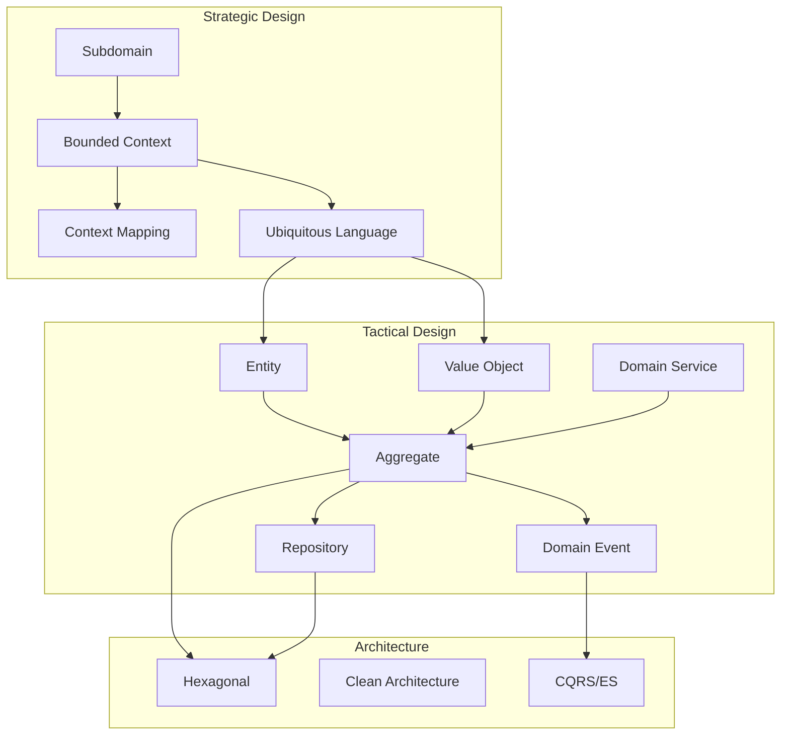

A deep dive into DDD's strategic and tactical design patterns.

## Learning Path

```mermaid
flowchart LR
    A[Strategic Design] --> B[Tactical Design]
    B --> C[Aggregate Deep Dive]
    C --> D[Domain Events]
    D --> E[Architecture]
    E --> F[CQRS]
    F --> G[Testing Strategy]
    G --> H[Anti-Patterns]

    style A fill:#fff3e0
    style B fill:#e8f5e9
    style C fill:#e1f5fe
    style D fill:#fce4ec
    style E fill:#f3e5f5
    style F fill:#e0f2f1
    style G fill:#fff8e1
    style H fill:#ffebee
```

## Table of Contents

### Design Patterns

1. [Strategic Design](strategic-design/) - Subdomain, Bounded Context, Context Mapping, Ubiquitous Language
2. [Tactical Design](tactical-design/) - Entity, Value Object, Repository, Domain Service, Specification
3. [Aggregate Deep Dive](aggregate/) - Aggregate Design Principles, Transaction Boundaries, Size Decisions
4. [Domain Events](domain-events/) - Event-Driven Architecture, Event Sourcing

### Architecture

5. [Architecture Patterns](architecture/) - Hexagonal, Clean Architecture, Onion Architecture
6. [CQRS](cqrs/) - Command Query Responsibility Segregation

### Quality

7. [Testing Strategy](testing/) - Domain Model Testing, Integration Testing, E2E
8. [Anti-Patterns and Pitfalls](anti-patterns/) - Common Mistakes and Solutions

## Concept Relationships

