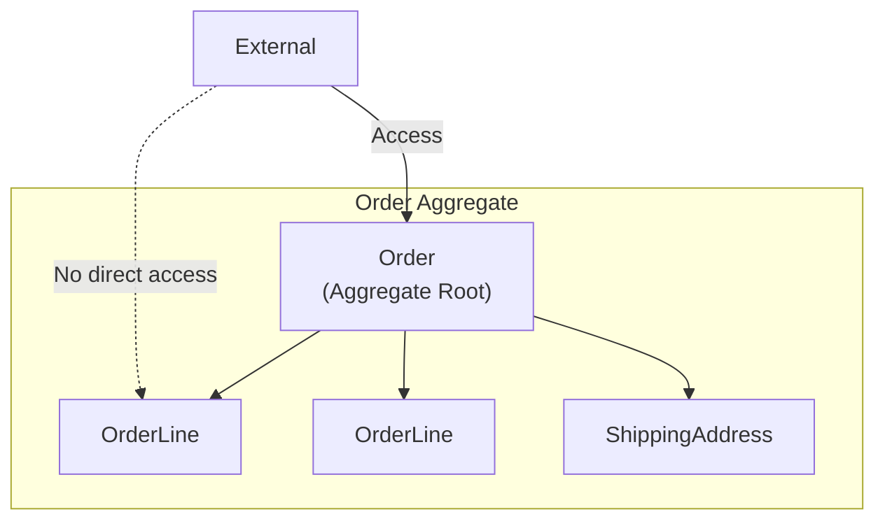
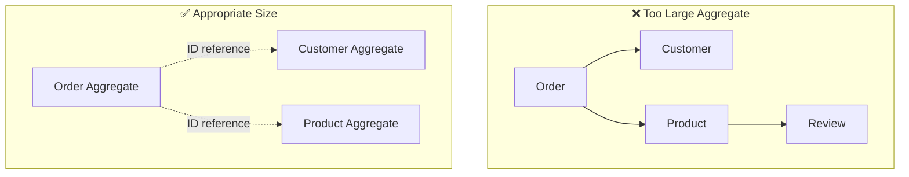
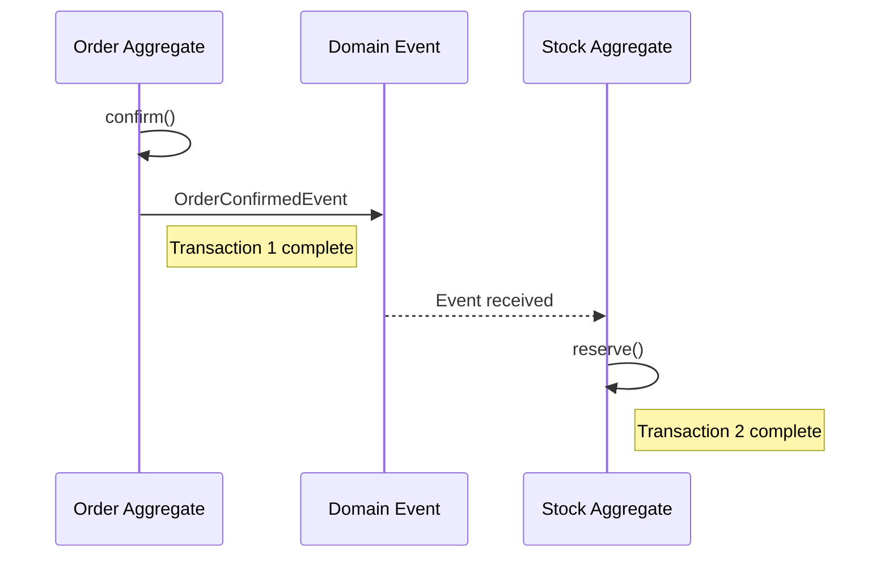
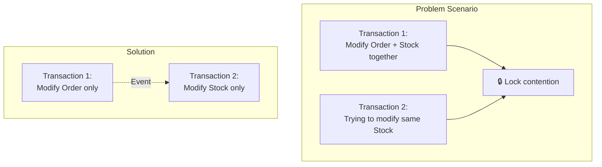

# Aggregate Deep Dive

A comprehensive look at Aggregate design principles, transaction boundaries, and practical patterns.

> **Common Imports for examples in this page:**
> ```java
> import java.util.List;
> import java.util.ArrayList;
> import java.util.Collections;
> import java.time.LocalDateTime;
> ```

## What is an Aggregate?

An **Aggregate** is a cluster of related objects treated as a unit for data changes.



### Core Components

| Element | Role | Example |
|---------|------|---------|
| **Aggregate Root** | Single point of contact with outside, ensures consistency | Order |
| **Internal Entity** | Accessed only through Root | OrderLine |
| **Value Object** | Immutable attribute values | ShippingAddress, Money |

## Design Principles

### Principle 1: Protect True Invariants

An **invariant** is a business rule that must always be true.

```java
public class Order {
    private List<OrderLine> orderLines;
    private Money totalAmount;
    private OrderStatus status;

    // Invariant: Order must not have empty items
    public void removeOrderLine(OrderLineId lineId) {
        if (orderLines.size() <= 1) {
            throw new BusinessRuleViolationException(
                "Order must have at least 1 item"
            );
        }
        orderLines.removeIf(line -> line.getId().equals(lineId));
        recalculateTotal();  // Invariant: Total is always current
    }

    // Invariant: Total equals sum of order lines
    private void recalculateTotal() {
        this.totalAmount = orderLines.stream()
            .map(OrderLine::getAmount)
            .reduce(Money.ZERO, Money::add);
    }
}
```

### Principle 2: Design Small Aggregates



**Why keep them small:**
- Reduce transaction scope → Less concurrency conflicts
- Reduce memory usage
- Minimize change impact

### Principle 3: Reference Other Aggregates by ID Only

```java
// ❌ Direct object reference
public class Order {
    private Customer customer;  // Direct reference to Customer Aggregate
    private List<Product> products;  // Direct reference to Product Aggregate
}

// ✅ Reference by ID
public class Order {
    private CustomerId customerId;  // Store ID only
    private List<OrderLine> orderLines;  // OrderLine contains ProductId internally
}

public record OrderLine(
    OrderLineId id,
    ProductId productId,  // Reference by ID
    String productName,   // Copy needed information
    Money price,
    int quantity
) {}
```

### Principle 4: Use Eventual Consistency Outside Boundaries



```java
// Order Aggregate
public class Order {
    public void confirm() {
        this.status = OrderStatus.CONFIRMED;
        // Only publish event, inventory handled in separate transaction
        registerEvent(new OrderConfirmedEvent(this.id, this.orderLines));
    }
}

// Stock Aggregate (separate transaction)
@Component
public class StockEventHandler {

    private final StockRepository stockRepository;

    // Note: @EventListener executes synchronously in same transaction
    // For separate transaction, configure as below
    @TransactionalEventListener(phase = TransactionPhase.AFTER_COMMIT)
    @Transactional(propagation = Propagation.REQUIRES_NEW)
    public void handle(OrderConfirmedEvent event) {
        for (OrderLineInfo line : event.getOrderLines()) {
            Stock stock = stockRepository.findByProductId(line.getProductId());
            stock.reserve(line.getQuantity());
            stockRepository.save(stock);
        }
    }
}
```

## Transaction Boundaries

### One Transaction = One Aggregate

```java
// ✅ Correct pattern: Modify only one Aggregate
@Transactional
public void confirmOrder(OrderId orderId) {
    Order order = orderRepository.findById(orderId)
        .orElseThrow(() -> new OrderNotFoundException(orderId));

    order.confirm();  // Only modify Order Aggregate

    orderRepository.save(order);
    // Use events to trigger changes in other Aggregates
}

// ❌ Wrong pattern: Modify multiple Aggregates simultaneously
@Transactional
public void confirmOrder(OrderId orderId) {
    Order order = orderRepository.findById(orderId).orElseThrow();
    order.confirm();

    // Modifying other Aggregates in same transaction - avoid this
    for (OrderLine line : order.getOrderLines()) {
        Stock stock = stockRepository.findByProductId(line.getProductId());
        stock.reserve(line.getQuantity());  // Modifying Stock Aggregate
    }
}
```

### Why Separate?



## Summary

| Concept | Description |
|---------|-------------|
| **Aggregate** | Cluster of objects treated as a unit |
| **Aggregate Root** | Single entry point ensuring consistency |
| **Design Small** | Reduce transaction scope and conflicts |
| **ID Reference** | Reference other Aggregates by ID only |
| **Eventual Consistency** | Use events for cross-Aggregate changes |

## Next Steps

- [Aggregate Patterns](../aggregate-patterns/) - Implementation patterns, anti-patterns, and decision guides
- [Domain Events](../domain-events/) - Event-based integration
