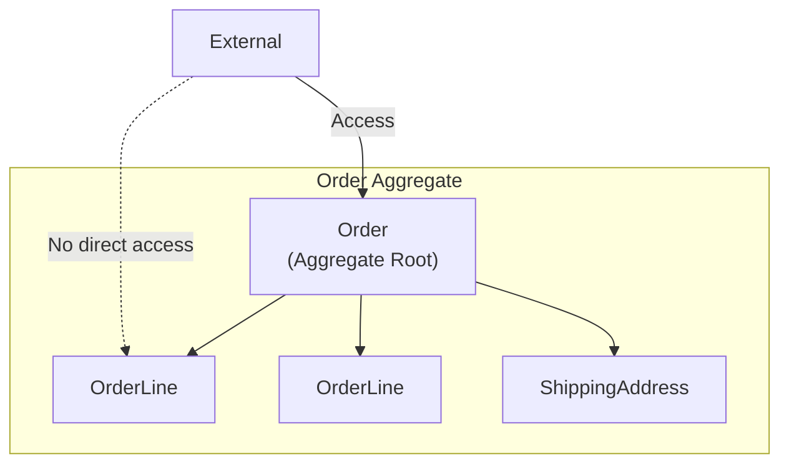
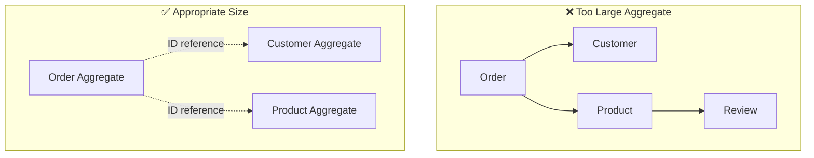
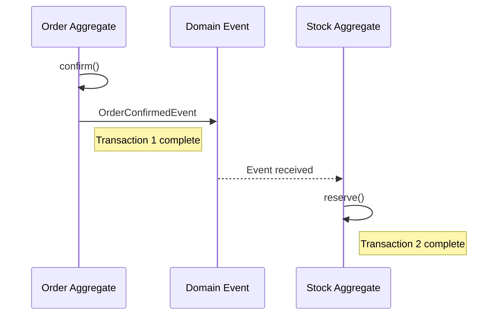
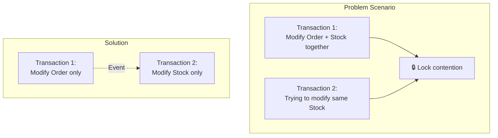
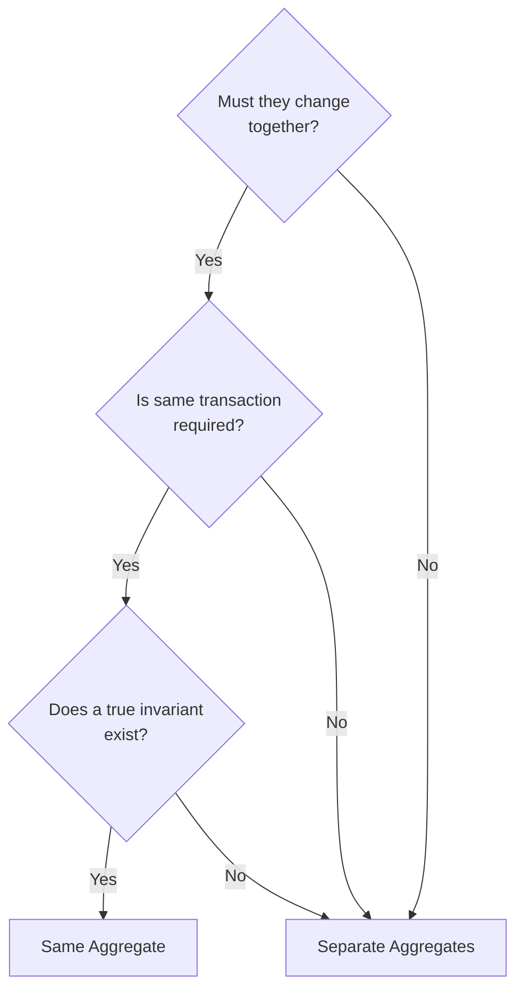

# Aggregate Deep Dive

A comprehensive look at Aggregate design principles, transaction boundaries, and practical patterns.

## What is an Aggregate?

An **Aggregate** is a cluster of related objects treated as a unit for data changes.



### Core Components

| Element | Role | Example |
|---------|------|---------|
| **Aggregate Root** | Single point of contact with outside, ensures consistency | Order |
| **Internal Entity** | Accessed only through Root | OrderLine |
| **Value Object** | Immutable attribute values | ShippingAddress, Money |

## Design Principles

### Principle 1: Protect True Invariants

An **invariant** is a business rule that must always be true.

```java
public class Order {
    private List<OrderLine> orderLines;
    private Money totalAmount;
    private OrderStatus status;

    // Invariant: Order must not have empty items
    public void removeOrderLine(OrderLineId lineId) {
        if (orderLines.size() <= 1) {
            throw new BusinessRuleViolationException(
                "Order must have at least 1 item"
            );
        }
        orderLines.removeIf(line -> line.getId().equals(lineId));
        recalculateTotal();  // Invariant: Total is always current
    }

    // Invariant: Total equals sum of order lines
    private void recalculateTotal() {
        this.totalAmount = orderLines.stream()
            .map(OrderLine::getAmount)
            .reduce(Money.ZERO, Money::add);
    }
}
```

### Principle 2: Design Small Aggregates



**Why keep them small:**
- Reduce transaction scope → Less concurrency conflicts
- Reduce memory usage
- Minimize change impact

### Principle 3: Reference Other Aggregates by ID Only

```java
// ❌ Direct object reference
public class Order {
    private Customer customer;  // Direct reference to Customer Aggregate
    private List<Product> products;  // Direct reference to Product Aggregate
}

// ✅ Reference by ID
public class Order {
    private CustomerId customerId;  // Store ID only
    private List<OrderLine> orderLines;  // OrderLine contains ProductId internally
}

public record OrderLine(
    OrderLineId id,
    ProductId productId,  // Reference by ID
    String productName,   // Copy needed information
    Money price,
    int quantity
) {}
```

### Principle 4: Use Eventual Consistency Outside Boundaries



```java
// Order Aggregate
public class Order {
    public void confirm() {
        this.status = OrderStatus.CONFIRMED;
        // Only publish event, inventory handled in separate transaction
        registerEvent(new OrderConfirmedEvent(this.id, this.orderLines));
    }
}

// Stock Aggregate (separate transaction)
@Component
public class StockEventHandler {

    private final StockRepository stockRepository;

    // Note: @EventListener executes synchronously in same transaction
    // For separate transaction, configure as below
    @TransactionalEventListener(phase = TransactionPhase.AFTER_COMMIT)
    @Transactional(propagation = Propagation.REQUIRES_NEW)
    public void handle(OrderConfirmedEvent event) {
        for (OrderLineInfo line : event.getOrderLines()) {
            Stock stock = stockRepository.findByProductId(line.getProductId());
            stock.reserve(line.getQuantity());
            stockRepository.save(stock);
        }
    }
}
```

## Transaction Boundaries

### One Transaction = One Aggregate

```java
// ✅ Correct pattern: Modify only one Aggregate
@Transactional
public void confirmOrder(OrderId orderId) {
    Order order = orderRepository.findById(orderId)
        .orElseThrow(() -> new OrderNotFoundException(orderId));

    order.confirm();  // Only modify Order Aggregate

    orderRepository.save(order);
    // Use events to trigger changes in other Aggregates
}

// ❌ Wrong pattern: Modify multiple Aggregates simultaneously
@Transactional
public void confirmOrder(OrderId orderId) {
    Order order = orderRepository.findById(orderId).orElseThrow();
    order.confirm();

    // Modifying other Aggregates in same transaction - avoid this
    for (OrderLine line : order.getOrderLines()) {
        Stock stock = stockRepository.findByProductId(line.getProductId());
        stock.reserve(line.getQuantity());  // Modifying Stock Aggregate
    }
}
```

### Why Separate?



## Aggregate Root Design

### All Changes Through Root

```java
public class Order {
    private List<OrderLine> orderLines;

    // ✅ Add internal objects through root
    public void addOrderLine(ProductId productId, String name, Money price, int qty) {
        validateCanModify();

        OrderLine newLine = new OrderLine(
            OrderLineId.generate(),
            productId,
            name,
            price,
            qty
        );
        this.orderLines.add(newLine);
        recalculateTotal();
    }

    // ✅ Modify internal objects through root
    public void changeQuantity(OrderLineId lineId, int newQuantity) {
        validateCanModify();

        OrderLine line = findOrderLine(lineId);
        line.changeQuantity(newQuantity);  // Allow changes only internally
        recalculateTotal();
    }

    // Don't expose internal objects directly
    public List<OrderLine> getOrderLines() {
        return Collections.unmodifiableList(orderLines);
    }
}
```

### Invariant Validation

```java
public class Order {
    private static final int MAX_ORDER_LINES = 100;
    private static final Money MAX_ORDER_AMOUNT = Money.won(10_000_000);

    public void addOrderLine(OrderLine line) {
        // Invariant 1: Limit number of order items
        if (orderLines.size() >= MAX_ORDER_LINES) {
            throw new TooManyOrderLinesException(MAX_ORDER_LINES);
        }

        orderLines.add(line);
        recalculateTotal();

        // Invariant 2: Maximum order amount limit
        if (totalAmount.isGreaterThan(MAX_ORDER_AMOUNT)) {
            orderLines.remove(line);  // Rollback
            recalculateTotal();
            throw new OrderAmountExceededException(MAX_ORDER_AMOUNT);
        }
    }
}
```

## Practical Patterns

### Pattern 1: Optimistic Locking

```java
@Entity
public class OrderEntity {
    @Id
    private String id;

    @Version  // Optimistic locking
    private Long version;

    // ...
}
```

```java
// Exception thrown on concurrent modification
try {
    order.confirm();
    orderRepository.save(order);
} catch (OptimisticLockingFailureException e) {
    // Retry logic
    throw new ConcurrentModificationException("Order was modified elsewhere");
}
```

### Pattern 2: Aggregate Reconstitution

```java
public class Order {
    // Reconstitute from stored state (Factory pattern)
    public static Order reconstitute(
        OrderId id,
        CustomerId customerId,
        OrderStatus status,
        List<OrderLine> orderLines,
        ShippingAddress address,
        LocalDateTime createdAt
    ) {
        Order order = new Order();
        order.id = id;
        order.customerId = customerId;
        order.status = status;
        order.orderLines = new ArrayList<>(orderLines);
        order.shippingAddress = address;
        order.createdAt = createdAt;
        return order;
    }

    // Create new
    public static Order create(CustomerId customerId, List<OrderLine> orderLines) {
        Order order = new Order();
        order.id = OrderId.generate();
        order.customerId = customerId;
        order.status = OrderStatus.PENDING;
        order.orderLines = new ArrayList<>(orderLines);
        order.createdAt = LocalDateTime.now();

        order.registerEvent(new OrderCreatedEvent(order.id));
        return order;
    }
}
```

### Pattern 3: Domain Event Collection

```java
public abstract class AggregateRoot {
    private final List<DomainEvent> domainEvents = new ArrayList<>();

    protected void registerEvent(DomainEvent event) {
        domainEvents.add(event);
    }

    public List<DomainEvent> getDomainEvents() {
        return Collections.unmodifiableList(domainEvents);
    }

    public void clearDomainEvents() {
        domainEvents.clear();
    }
}

public class Order extends AggregateRoot {

    public void confirm() {
        this.status = OrderStatus.CONFIRMED;
        registerEvent(new OrderConfirmedEvent(this.id));
    }

    public void cancel(CancellationReason reason) {
        this.status = OrderStatus.CANCELLED;
        registerEvent(new OrderCancelledEvent(this.id, reason));
    }
}
```

### Pattern 4: Event Publishing in Repository

```java
@Repository
public class JpaOrderRepository implements OrderRepository {

    private final OrderJpaRepository jpaRepository;
    private final ApplicationEventPublisher eventPublisher;

    @Override
    public Order save(Order order) {
        OrderEntity entity = toEntity(order);
        jpaRepository.save(entity);

        // Publish events after save
        order.getDomainEvents().forEach(eventPublisher::publishEvent);
        order.clearDomainEvents();

        return order;
    }
}
```

## Aggregate Boundary Decision Guide

### Question Checklist



### Example: Order and Payment

```
Question: Should Order and Payment be the same Aggregate?

1. Must they change together?
   → Payment can't exist without Order, but Order persists even if payment fails
   → No

2. Is same transaction required?
   → Payment involves external PG, many failures/retries
   → Safer to separate
   → No

3. Does a true invariant exist?
   → "Order amount = Payment amount" can be eventually consistent
   → No

Conclusion: Separate Aggregates
```

```java
// Separate Aggregates
public class Order {
    private OrderId id;
    private PaymentId paymentId;  // Reference by ID only
    private PaymentStatus paymentStatus;  // Copy of status
}

public class Payment {
    private PaymentId id;
    private OrderId orderId;  // Reference by ID only
    private Money amount;
    private PaymentStatus status;
}
```

## Anti-Patterns

### 1. God Aggregate

```java
// ❌ Massive Aggregate containing everything
public class Order {
    private Customer customer;  // Entire Customer
    private List<Product> products;  // Entire Product
    private Payment payment;  // Entire Payment
    private Shipment shipment;  // Entire Shipment
    // Transaction scope is too wide
}
```

### 2. Anemic Aggregate

```java
// ❌ Aggregate with no logic
public class Order {
    private OrderId id;
    private OrderStatus status;

    // Only getter/setter exists
    public OrderStatus getStatus() { return status; }
    public void setStatus(OrderStatus status) { this.status = status; }
}

// Logic scattered in service
public class OrderService {
    public void confirm(Order order) {
        if (order.getStatus() == OrderStatus.PENDING) {
            order.setStatus(OrderStatus.CONFIRMED);
        }
    }
}
```

## Next Steps

- [Domain Events](../domain-events/) - Event-based integration
