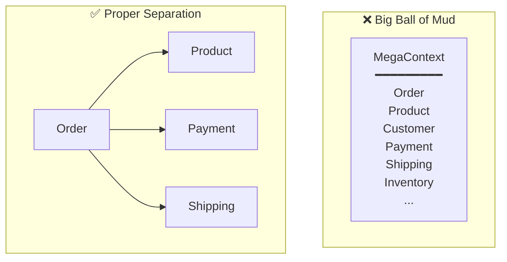
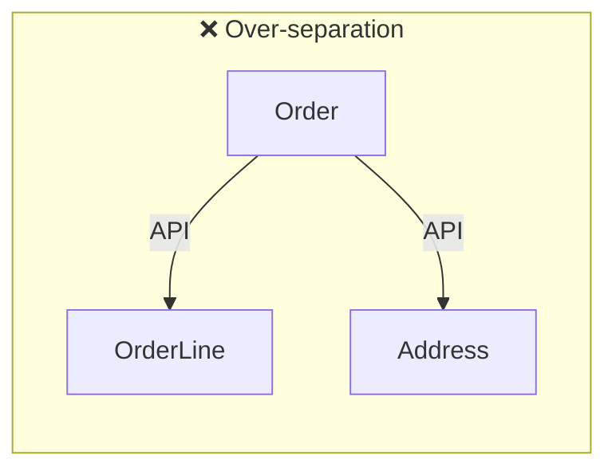

# DDD Anti-Patterns and Pitfalls

Common mistakes made when applying DDD and their solutions.

## Strategic Design Anti-Patterns

### 1. Big Ball of Mud Context

**Problem:** Making everything into one huge Bounded Context



**Symptoms:**
- All teams modify the same codebase
- Large deployment needed for small changes
- Same terms used confusingly

**Solutions:**
```
1. Find linguistic boundaries: Term conflict points = Context boundaries
2. Consider team boundaries: Different teams = Different Contexts
3. Gradual separation: Start from the clearest boundaries
```

---

### 2. Context Too Small

**Problem:** Too fine-grained separation increases integration costs



**Symptoms:**
- Multiple service calls for simple features
- Complex transaction management
- Network overhead

**Solutions:**
```
Context separation criteria:
- Can it be deployed independently?
- Is it owned by a different team?
- Does it have a different lifecycle?

If any answer is No, keep in the same Context
```

---

### 3. Ignoring Ubiquitous Language

**Problem:** Writing code with technical terms only, without domain terms

```java
// ❌ Technical terms
public class OrderManager {
    public void updateStatus(Long id, int status) {
        // status: 0=pending, 1=confirmed, 2=shipped, 9=cancelled
    }
}

// ✅ Domain terms
public class Order {
    public void confirm() { }
    public void ship(TrackingNumber trackingNumber) { }
    public void cancel(CancellationReason reason) { }
}
```

**Solutions:**
```
1. Create glossary with domain experts
2. Use same terms in code, tests, and documentation
3. Validate terms in code reviews
```

## Tactical Design Anti-Patterns

### 4. Anemic Domain Model

**Problem:** Entity has only data, no logic

```java
// ❌ Anemic Model
public class Order {
    private Long id;
    private String status;
    private LocalDateTime confirmedAt;

    // Only getter/setter
    public String getStatus() { return status; }
    public void setStatus(String status) { this.status = status; }
}

// Logic scattered in service
public class OrderService {
    public void confirmOrder(Long orderId) {
        Order order = repository.findById(orderId);
        if (order.getStatus().equals("PENDING")) {
            order.setStatus("CONFIRMED");
            order.setConfirmedAt(LocalDateTime.now());
            // Business rules here...
        }
        repository.save(order);
    }
}
```

```java
// ✅ Rich Domain Model
public class Order {
    private OrderId id;
    private OrderStatus status;
    private LocalDateTime confirmedAt;

    public void confirm() {
        validateConfirmable();
        this.status = OrderStatus.CONFIRMED;
        this.confirmedAt = LocalDateTime.now();
        registerEvent(new OrderConfirmedEvent(this));
    }

    private void validateConfirmable() {
        if (this.status != OrderStatus.PENDING) {
            throw new IllegalOrderStateException(
                "Can only confirm from PENDING state. Current: " + this.status
            );
        }
    }
}

// Service only orchestrates flow
public class OrderService {
    public void confirmOrder(OrderId orderId) {
        Order order = repository.findById(orderId).orElseThrow();
        order.confirm();  // Delegate to domain
        repository.save(order);
    }
}
```

**Diagnostic checklist:**
```
[ ] Does Entity have setters? → Replace with behavior methods
[ ] Does Service validate state with if-else? → Move to Entity
[ ] Are business rules in Service? → Move to domain
```

---

### 5. God Aggregate

**Problem:** Massive Aggregate containing too much

```java
// ❌ God Aggregate
public class Order {
    private OrderId id;
    private Customer customer;        // Entire Customer Aggregate
    private List<Product> products;   // Entire Product Aggregate
    private Payment payment;          // Entire Payment Aggregate
    private Shipment shipment;        // Entire Shipment Aggregate
}
```

**Problems:**
- Transaction scope too wide
- Frequent concurrency conflicts
- Performance degradation

```java
// ✅ Appropriate size
public class Order {
    private OrderId id;
    private CustomerId customerId;      // Reference by ID
    private List<OrderLine> orderLines; // Only true internal entities
    private ShippingAddress address;    // Value Object
}

public class OrderLine {
    private OrderLineId id;
    private ProductId productId;        // Reference by ID
    private String productName;         // Copy only needed info
    private Money price;
    private int quantity;
}
```

---

### 6. Ignoring Aggregate Boundaries

**Problem:** Modifying multiple Aggregates in one transaction

```java
// ❌ Modifying multiple Aggregates simultaneously
@Transactional
public void confirmOrder(OrderId orderId) {
    Order order = orderRepository.findById(orderId);
    order.confirm();

    // Modifying other Aggregates in same transaction - avoid!
    for (OrderLine line : order.getOrderLines()) {
        Stock stock = stockRepository.findByProductId(line.getProductId());
        stock.reserve(line.getQuantity());
        stockRepository.save(stock);
    }

    Customer customer = customerRepository.findById(order.getCustomerId());
    customer.addPoints(order.getTotalAmount().multiply(0.01));
    customerRepository.save(customer);

    orderRepository.save(order);
}
```

```java
// ✅ Separate with events
@Transactional
public void confirmOrder(OrderId orderId) {
    Order order = orderRepository.findById(orderId);
    order.confirm();  // Publishes OrderConfirmedEvent
    orderRepository.save(order);
}

// Handle in separate transaction
@Component
public class StockEventHandler {
    @TransactionalEventListener(phase = TransactionPhase.AFTER_COMMIT)
    @Transactional(propagation = Propagation.REQUIRES_NEW)
    public void on(OrderConfirmedEvent event) {
        for (OrderLineSnapshot line : event.getOrderLines()) {
            Stock stock = stockRepository.findByProductId(line.productId());
            stock.reserve(line.quantity());
            stockRepository.save(stock);
        }
    }
}
```

---

### 7. Primitive Obsession

**Problem:** Representing domain concepts with primitive types

```java
// ❌ Primitive Obsession
public class Order {
    private String orderId;          // Just String
    private String customerId;       // Just String
    private String email;            // Just String
    private int totalAmount;         // Just int
    private String status;           // Just String
}

public void createOrder(String customerId, String email, int amount) {
    // Swapping customerId and email causes no compile error!
}
```

```java
// ✅ Using Value Objects
public class Order {
    private OrderId id;
    private CustomerId customerId;
    private Email email;
    private Money totalAmount;
    private OrderStatus status;
}

// Type validation at compile time
public void createOrder(CustomerId customerId, Email email, Money amount) {
    // Different types cause compile error
}

// Value Object protects domain rules
public record Email(String value) {
    public Email {
        if (!value.matches("^[\\w.-]+@[\\w.-]+\\.[a-zA-Z]{2,}$")) {
            throw new InvalidEmailException(value);
        }
    }
}
```

---

### 8. Smart UI Anti-Pattern

**Problem:** Business logic in UI/Controller

```java
// ❌ Business logic in Controller
@RestController
public class OrderController {

    @PostMapping("/orders/{id}/confirm")
    public ResponseEntity<?> confirmOrder(@PathVariable Long id) {
        Order order = repository.findById(id);

        // Business rules validation in Controller
        if (!order.getStatus().equals("PENDING")) {
            return ResponseEntity.badRequest().body("Already confirmed order");
        }

        if (order.getTotalAmount() > 1000000) {
            // Additional validation for high-value orders
            if (!fraudService.check(order)) {
                return ResponseEntity.badRequest().body("Fraud suspected");
            }
        }

        order.setStatus("CONFIRMED");
        repository.save(order);
        return ResponseEntity.ok().build();
    }
}
```

```java
// ✅ Logic in domain
@RestController
public class OrderController {

    private final ConfirmOrderUseCase confirmOrderUseCase;

    @PostMapping("/orders/{id}/confirm")
    public ResponseEntity<?> confirmOrder(@PathVariable String id) {
        confirmOrderUseCase.confirm(OrderId.of(id));
        return ResponseEntity.ok().build();
    }
}

// Domain
public class Order {
    public void confirm(FraudChecker fraudChecker) {
        validateConfirmable();
        validateFraud(fraudChecker);
        this.status = OrderStatus.CONFIRMED;
    }

    private void validateConfirmable() {
        if (this.status != OrderStatus.PENDING) {
            throw new IllegalOrderStateException("...");
        }
    }

    private void validateFraud(FraudChecker fraudChecker) {
        if (isHighValue() && !fraudChecker.isSafe(this)) {
            throw new FraudSuspectedException(this.id);
        }
    }
}
```

## Architecture Anti-Patterns

### 9. Domain Dependency Pollution

**Problem:** Domain depends on infrastructure

```java
// ❌ Domain depends on JPA
@Entity
@Table(name = "orders")
public class Order {
    @Id @GeneratedValue
    private Long id;

    @OneToMany(cascade = CascadeType.ALL)
    private List<OrderLine> orderLines;

    @Transient  // JPA ignore
    private List<DomainEvent> events;
}
```

```java
// ✅ Pure domain
// Domain Layer
public class Order {
    private OrderId id;
    private List<OrderLine> orderLines;
    private List<DomainEvent> events;
}

// Infrastructure Layer
@Entity
@Table(name = "orders")
public class OrderEntity {
    @Id
    private String id;

    @OneToMany(cascade = CascadeType.ALL)
    private List<OrderLineEntity> orderLines;
}

// Mapper converts
@Component
public class OrderMapper {
    public OrderEntity toEntity(Order order) { ... }
    public Order toDomain(OrderEntity entity) { ... }
}
```

---

### 10. Repository Implementation Leakage

**Problem:** Repository implementation details exposed to domain

```java
// ❌ JPA implementation leakage
public interface OrderRepository extends JpaRepository<Order, Long> {
    // JPA features exposed directly
    // findAll(), save(), saveAll(), etc.
}

// JPA methods used directly in domain
orderRepository.saveAll(orders);
orderRepository.flush();
```

```java
// ✅ Domain Repository interface
// Domain Layer
public interface OrderRepository {
    Order save(Order order);
    Optional<Order> findById(OrderId id);
    List<Order> findByCustomerId(CustomerId customerId);
}

// Infrastructure Layer
@Repository
public class JpaOrderRepository implements OrderRepository {
    private final OrderJpaRepository jpaRepository;

    @Override
    public Order save(Order order) {
        OrderEntity entity = mapper.toEntity(order);
        return mapper.toDomain(jpaRepository.save(entity));
    }
}

interface OrderJpaRepository extends JpaRepository<OrderEntity, String> {
    // JPA features only exist here
}
```

## CQRS Anti-Patterns

### 11. Excessive CQRS

**Problem:** Applying CQRS to simple CRUD

```java
// ❌ Complex CQRS for simple queries
public class UserQueryService {
    public UserView getUser(String userId) {
        // Building separate Read Model and Projector for simple queries
    }
}

// ✅ Choose based on complexity
public class UserService {
    public User getUser(UserId id) {
        return userRepository.findById(id).orElseThrow();
    }
}
```

**CQRS application criteria:**
```
[ ] Are query and command models significantly different?
[ ] Is query performance optimization needed?
[ ] Is complex search/reporting needed?

If none are Yes, simple model is sufficient
```

---

### 12. Ignoring Sync Failures

**Problem:** No handling for Read Model sync failures

```java
// ❌ Data inconsistency on failure
@EventListener
public void on(OrderConfirmedEvent event) {
    OrderView view = viewRepository.findById(event.getOrderId());
    view.setStatus("CONFIRMED");  // What if this fails?
    viewRepository.save(view);
}
```

```java
// ✅ Failure handling with retry
@Component
public class OrderViewProjector {

    private final FailedEventStore failedEventStore;

    @KafkaListener(topics = "order-events")
    @Retryable(maxAttempts = 3, backoff = @Backoff(delay = 1000))
    public void handle(DomainEvent event) {
        try {
            project(event);
        } catch (Exception e) {
            // Save on retry failure
            failedEventStore.save(event, e);
            throw e;
        }
    }

    // Manual reprocessing of failed events
    @Scheduled(fixedDelay = 60000)
    public void retryFailedEvents() {
        failedEventStore.findAll().forEach(this::retry);
    }
}
```

## Solution Checklist

### Before Project Start

```
[ ] Created glossary with domain experts?
[ ] Classified Core/Supporting/Generic Domains?
[ ] Defined Bounded Context boundaries?
[ ] Decided integration approach between Contexts?
```

### When Writing Code

```
[ ] Does Entity have behavior (methods)?
[ ] Actively using Value Objects?
[ ] Are Aggregate boundaries appropriate?
[ ] Domain not depending on infrastructure?
```

### During Code Review

```
[ ] Using business terminology?
[ ] Is logic in domain?
[ ] Modifying only one Aggregate per transaction?
[ ] Do tests verify domain rules?
```

## Next Steps

- [Examples](../../examples/) - Implementing with correct patterns
- [Glossary](../../appendix/glossary/) - DDD terminology reference
