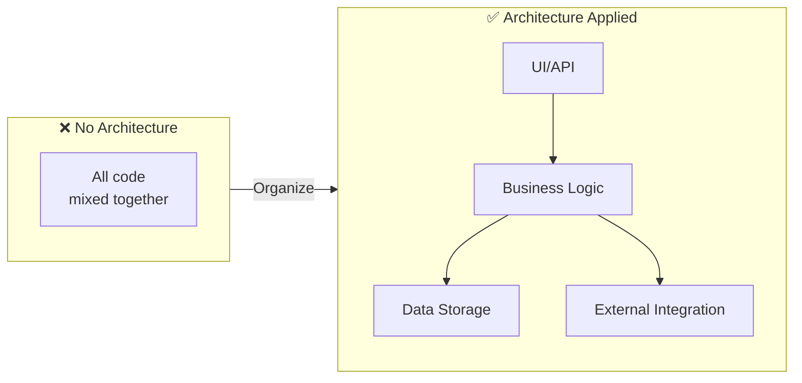
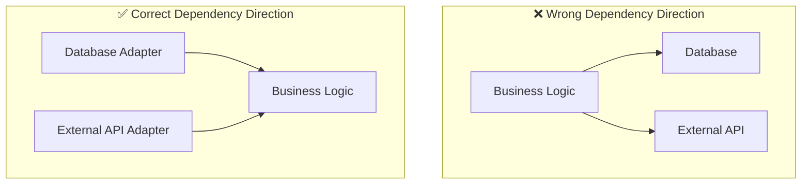
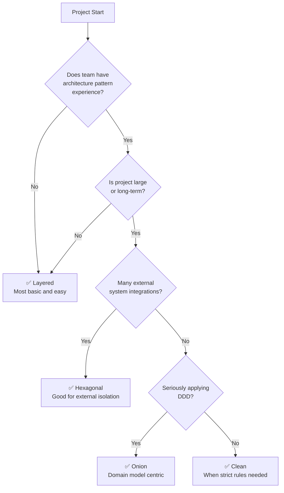
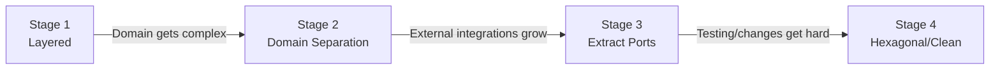

# Architecture Patterns

Exploring architecture patterns for effectively implementing DDD.

## Why Do We Need Architecture Patterns?

### The Problem with Spaghetti Code

When starting a project, having all code in one place might be okay. But what happens as the project grows?

```java
// ❌ Common problems in real projects
@RestController
public class OrderController {

    @Autowired
    private JdbcTemplate jdbcTemplate;

    @PostMapping("/orders")
    public String createOrder(@RequestBody Map<String, Object> request) {
        // 1. Input validation (in Controller?)
        String customerId = (String) request.get("customerId");
        if (customerId == null) {
            return "Customer ID required";
        }

        // 2. Business logic (in Controller?)
        double total = 0;
        List<Map> items = (List<Map>) request.get("items");
        for (Map item : items) {
            total += (Double) item.get("price") * (Integer) item.get("quantity");
        }

        // 3. Discount calculation (here too?)
        if (total > 1000) {
            total = total * 0.9;
        }

        // 4. Direct database access (in Controller!)
        jdbcTemplate.update(
            "INSERT INTO orders (customer_id, total) VALUES (?, ?)",
            customerId, total
        );

        // 5. Even external API calls...
        restTemplate.postForObject("http://payment-service/pay", ...);

        return "Order complete";
    }
}
```

Problems with this code:

| Problem | Result |
|---------|--------|
| **Everything is mixed** | Hard to find what does what |
| **Untestable** | Can't test without DB, external API |
| **Risky changes** | Modify one place → bugs elsewhere |
| **Not reusable** | Copy/paste when same logic needed elsewhere |
| **Hard to collaborate** | Conflicts when multiple people modify |

### Purpose of Architecture



**Using architecture patterns:**

1. **Separation of concerns** - Each part handles one role
2. **Easier testing** - Can test business logic separately
3. **Easier changes** - Changing database doesn't affect business logic
4. **Enables collaboration** - Team members can work on different parts

### Core Principle: Dependency Direction

All architecture patterns share a common principle:

```
💡 Business logic (domain) depends on nothing
```



**Why do it this way?**

- Business logic is most important and rarely changes
- Database or external APIs can change (MySQL → PostgreSQL, REST → gRPC)
- If important things depend on less important things, when less important things change, important things must change too

---

## Architecture Patterns at a Glance

### 4 Major Patterns

```mermaid
flowchart TB
    subgraph Layered["Layered"]
        L1["Presentation"]
        L2["Application"]
        L3["Domain"]
        L4["Infrastructure"]
        L1 --> L2 --> L3 --> L4
    end

    subgraph Hex["Hexagonal"]
        H1["Adapter"]
        H2["Port"]
        H3["Core"]
        H1 --> H2 --> H3
    end

    subgraph Clean["Clean"]
        C1["Framework"]
        C2["Adapter"]
        C3["Use Case"]
        C4["Entity"]
        C1 --> C2 --> C3 --> C4
    end

    subgraph Onion["Onion"]
        O1["Infrastructure"]
        O2["Application"]
        O3["Domain Service"]
        O4["Domain Model"]
        O1 --> O2 --> O3 --> O4
    end
```



### Pattern Comparison

| Pattern | Core Concept | Difficulty | Best For |
|---------|--------------|------------|----------|
| **[Layered](./layered-architecture/)** | Top-down 4 layers | ⭐ Easy | Getting started, simple projects |
| **[Hexagonal](./hexagonal-architecture/)** | Isolate external with Port and Adapter | ⭐⭐ Medium | Projects with many external integrations |
| **[Clean](./clean-architecture/)** | Strict dependency rules | ⭐⭐⭐ Hard | Large, long-term projects |
| **[Onion](./onion-architecture/)** | Domain model centric | ⭐⭐ Medium | DDD projects |

### Which Pattern to Choose?



### Practical Advice


**💡 Start with Layered if you're new**

**Working code** comes before perfect architecture. Starting with Layered and evolving progressively as needed is realistic.


| Situation | Recommended Pattern | Reason |
|-----------|---------------------|--------|
| Startup, MVP | Layered | Fast development is priority |
| Complex business logic | Hexagonal or Onion | Need to protect domain |
| Microservices | Hexagonal | Fits well with service boundaries |
| Large team | Clean | Clear rules for collaboration |
| Legacy integration | Hexagonal | Isolate legacy with ACL |

---

## Progressive Evolution Path

No need to apply complex architecture from the start:



**Signals for Stage 1 → 2:**
- "Should this logic be in the Controller?" questions arise
- Copy-pasting same logic across Controllers

**Signals for Stage 2 → 3:**
- "Changing database means modifying domain too"
- Hard to write tests (due to external dependencies)

**Signals for Stage 3 → 4:**
- Team grows, need clear rules
- Need investment for long-term maintenance

---

## Detailed Guides

See detailed content for each architecture pattern below:

1. **[Layered Architecture](./layered-architecture/)** - The most basic 4-layer structure
2. **[Hexagonal Architecture](./hexagonal-architecture/)** - Isolate external with Port and Adapter
3. **[Clean Architecture](./clean-architecture/)** - Strict dependency rules with concentric circles
4. **[Onion Architecture](./onion-architecture/)** - Domain model centric onion structure

---

## Next Steps

- [CQRS](../cqrs/) - Pattern for separating read and write
- [Anti-Patterns](../anti-patterns/) - Common mistakes to avoid
