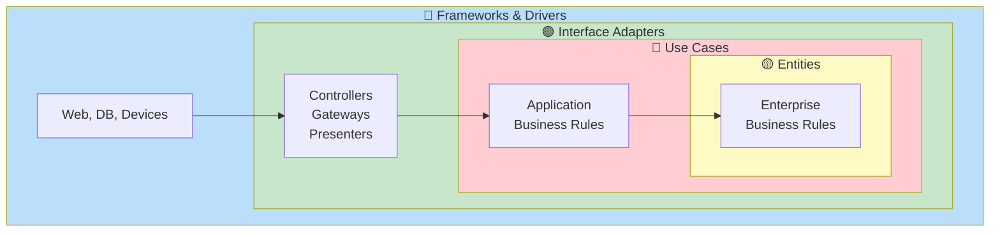

# Clean Architecture

Proposed by Uncle Bob (Robert C. Martin) in 2012. The core is strictly following the **dependency rule**.

## One-Line Summary

> **Dependencies always point inward**



## The Dependency Rule

```
📌 Inner circles know nothing about outer circles
```

```java
// ❌ Rule violation: Entity knows Framework
@Entity  // JPA annotation!
public class Order {
    @Id
    private Long id;
}

// ✅ Rule followed: Pure Entity
public class Order {
    private OrderId id;
    private Money totalAmount;

    public void confirm() {
        // Pure business logic only
    }
}
```

## 4 Layers

### 1. Entities 🟡 (Innermost)

Core business rules shared across the enterprise.

```java
public class Order {
    private OrderId id;
    private OrderStatus status;
    private Money totalAmount;

    public void confirm() {
        validateCanConfirm();
        this.status = OrderStatus.CONFIRMED;
    }

    public boolean isVipOrder() {
        return totalAmount.isGreaterThan(Money.of(1_000_000));
    }
}
```

### 2. Use Cases 🔴

Application-specific business rules.

```java
public interface CreateOrderUseCase {
    CreateOrderOutput execute(CreateOrderInput input);
}

public class CreateOrderInteractor implements CreateOrderUseCase {
    private final OrderRepository orderRepository;
    private final InventoryGateway inventoryGateway;

    @Override
    public CreateOrderOutput execute(CreateOrderInput input) {
        // Check inventory
        for (OrderLineInput line : input.lines()) {
            if (!inventoryGateway.checkAvailability(line.productId(), line.quantity())) {
                throw new InsufficientInventoryException(line.productId());
            }
        }

        // Create Entity
        Order order = Order.create(CustomerId.of(input.customerId()), toOrderLines(input.lines()));

        // Save
        orderRepository.save(order);

        return new CreateOrderOutput(order.getId().getValue(), order.getStatus().name());
    }
}
```

### 3. Interface Adapters 🟢

Data conversion between Use Case format and external format.

```java
@RestController
public class OrderController {
    private final CreateOrderUseCase createOrderUseCase;

    @PostMapping("/api/orders")
    public ResponseEntity<OrderResponse> createOrder(@RequestBody CreateOrderRequest request) {
        // HTTP Request → Use Case Input
        CreateOrderInput input = new CreateOrderInput(request.customerId(), request.items());

        // Execute Use Case
        CreateOrderOutput output = createOrderUseCase.execute(input);

        // Use Case Output → HTTP Response
        return ResponseEntity.status(HttpStatus.CREATED)
            .body(new OrderResponse(output.orderId(), output.status()));
    }
}
```

### 4. Frameworks & Drivers 🔵 (Outermost)

External tools - can be swapped anytime.

```java
@Configuration
public class OrderConfig {
    @Bean
    public CreateOrderUseCase createOrderUseCase(OrderRepository repo, InventoryGateway gateway) {
        return new CreateOrderInteractor(repo, gateway);
    }
}

@Entity
@Table(name = "orders")
public class JpaOrderEntity {
    @Id
    private String id;
    private String status;
}
```

## Package Structure

```
com.example.order/
├── entity/                    # 🟡 Entities
│   ├── Order.java
│   └── Money.java
├── usecase/                   # 🔴 Use Cases
│   ├── port/in/
│   │   └── CreateOrderUseCase.java
│   ├── port/out/
│   │   └── OrderRepository.java
│   └── interactor/
│       └── CreateOrderInteractor.java
├── adapter/                   # 🟢 Interface Adapters
│   ├── controller/
│   │   └── OrderController.java
│   └── gateway/
│       └── JpaOrderRepository.java
└── framework/                 # 🔵 Frameworks
    ├── config/
    └── persistence/
        └── JpaOrderEntity.java
```

## Common Mistakes

```java
// ❌ Entity with Framework code
@Entity
public class Order { ... }

// ❌ Use Case knows HTTP
public class CreateOrderInteractor {
    public ResponseEntity<?> execute(HttpServletRequest request) { ... }
}

// ❌ Interactor directly uses implementation
public class CreateOrderInteractor {
    private final JpaOrderRepository repository;  // Concrete class!
}
```

## When to Use

- ✅ Large, long-term projects
- ✅ Multiple teams collaborating
- ✅ Complex business logic
- ❌ Small projects (overkill)
- ❌ Simple CRUD apps

## Next Steps

- [Onion Architecture](../onion-architecture/)
- [CQRS](../cqrs/)
