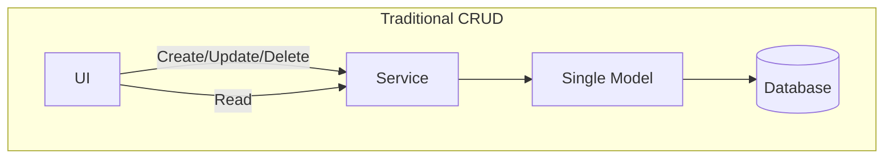
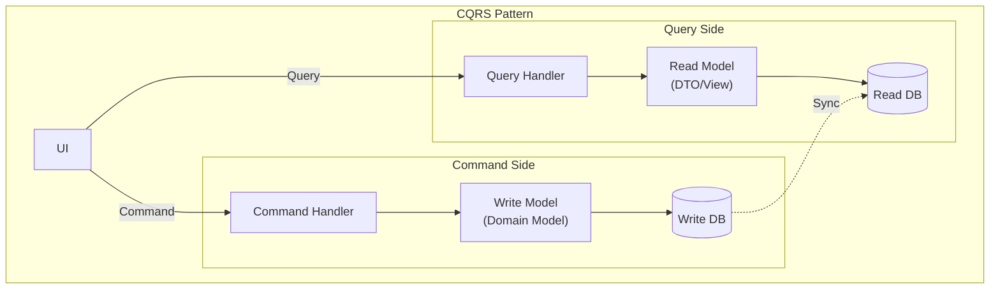
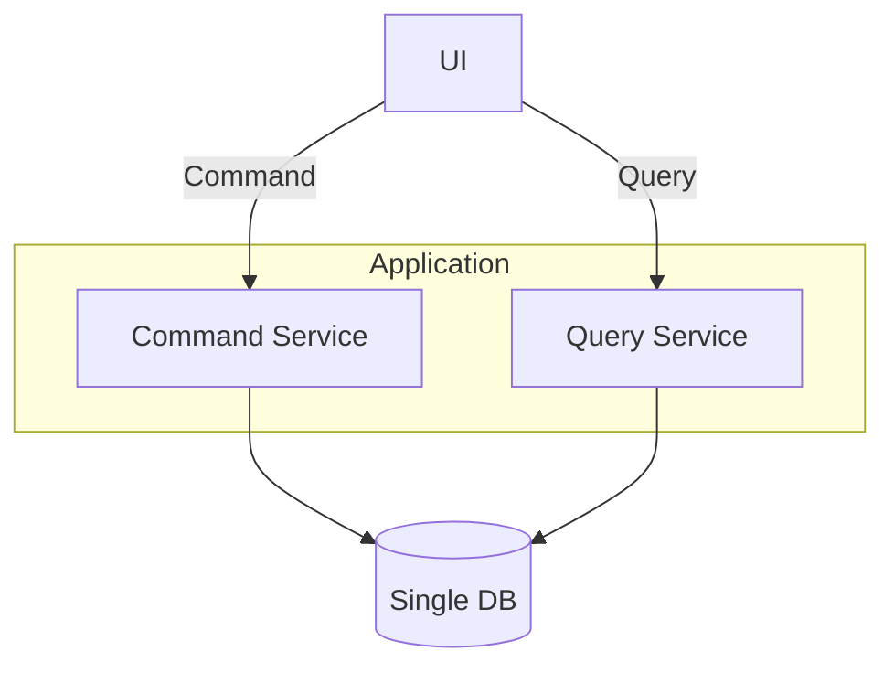
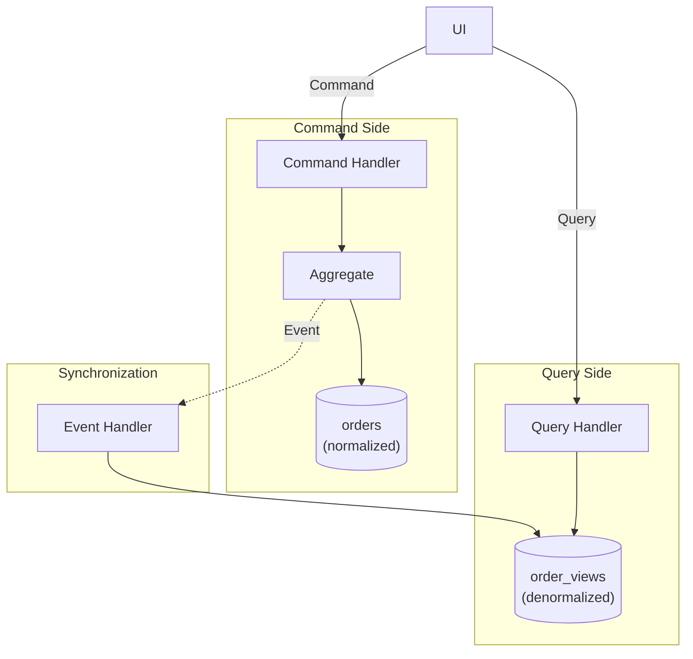
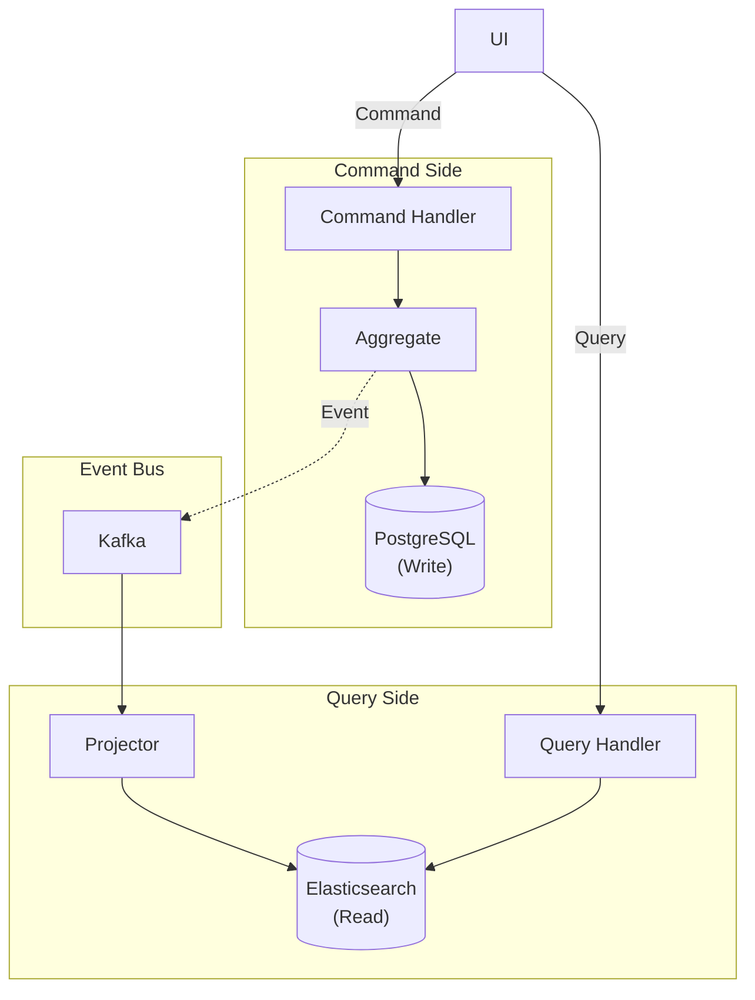
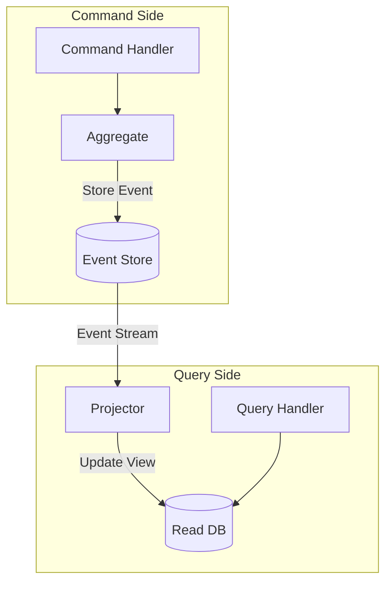
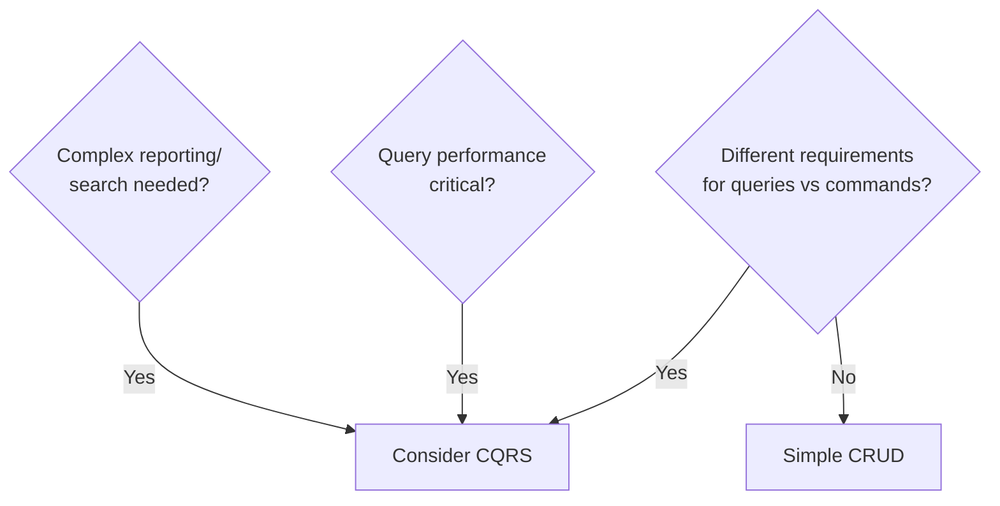

# CQRS (Command Query Responsibility Segregation)

A pattern that separates command (write) and query (read) responsibilities.

## Why CQRS?

### Limitations of Traditional CRUD



**Problems:**
- Domain model gets polluted for complex queries
- Different optimization requirements for queries vs commands
- Difficult to scale

### CQRS Structure



## Implementation Levels

### Level 1: Single DB, Code Separation

The simplest form.



```java
// Command Service - Uses Domain Model
@Service
@Transactional
public class OrderCommandService {

    private final OrderRepository orderRepository;

    public OrderId createOrder(CreateOrderCommand command) {
        Order order = Order.create(
            command.getCustomerId(),
            command.getOrderLines()
        );
        return orderRepository.save(order).getId();
    }

    public void confirmOrder(ConfirmOrderCommand command) {
        Order order = orderRepository.findById(command.getOrderId())
            .orElseThrow();
        order.confirm();
        orderRepository.save(order);
    }
}

// Query Service - Direct DTO Query
@Service
@Transactional(readOnly = true)
public class OrderQueryService {

    private final OrderQueryRepository queryRepository;

    public OrderDetailView getOrderDetail(String orderId) {
        return queryRepository.findOrderDetailById(orderId)
            .orElseThrow(() -> new OrderNotFoundException(orderId));
    }

    public Page<OrderSummaryView> getOrderList(OrderSearchCriteria criteria, Pageable pageable) {
        return queryRepository.searchOrders(criteria, pageable);
    }
}

// Query-only Repository
public interface OrderQueryRepository {

    @Query("""
        SELECT new com.example.order.query.OrderDetailView(
            o.id, o.status, o.totalAmount, o.createdAt,
            c.name, c.email
        )
        FROM OrderEntity o
        JOIN o.customer c
        WHERE o.id = :orderId
        """)
    Optional<OrderDetailView> findOrderDetailById(@Param("orderId") String orderId);

    @Query("""
        SELECT new com.example.order.query.OrderSummaryView(
            o.id, o.status, o.totalAmount, o.createdAt
        )
        FROM OrderEntity o
        WHERE (:status IS NULL OR o.status = :status)
        AND (:customerId IS NULL OR o.customerId = :customerId)
        """)
    Page<OrderSummaryView> searchOrders(
        @Param("status") OrderStatus status,
        @Param("customerId") String customerId,
        Pageable pageable
    );
}

// Query Result DTOs
public record OrderDetailView(
    String orderId,
    String status,
    BigDecimal totalAmount,
    LocalDateTime createdAt,
    String customerName,
    String customerEmail
) {}

public record OrderSummaryView(
    String orderId,
    String status,
    BigDecimal totalAmount,
    LocalDateTime createdAt
) {}
```

### Level 2: Separate Read Model

Uses query-only tables/views.



```java
// Write Side: Domain Event Publishing
public class Order extends AggregateRoot<OrderId> {

    public void confirm() {
        this.status = OrderStatus.CONFIRMED;
        registerEvent(new OrderConfirmedEvent(
            this.id,
            this.customerId,
            this.totalAmount,
            LocalDateTime.now()
        ));
    }
}

// Read Model Synchronization
@Component
public class OrderViewProjector {

    private final OrderViewRepository viewRepository;

    @TransactionalEventListener
    public void on(OrderCreatedEvent event) {
        OrderView view = new OrderView();
        view.setOrderId(event.getOrderId().getValue());
        view.setCustomerId(event.getCustomerId().getValue());
        view.setStatus("PENDING");
        view.setTotalAmount(event.getTotalAmount().amount());
        view.setCreatedAt(event.getCreatedAt());
        viewRepository.save(view);
    }

    @TransactionalEventListener
    public void on(OrderConfirmedEvent event) {
        OrderView view = viewRepository.findById(event.getOrderId().getValue())
            .orElseThrow();
        view.setStatus("CONFIRMED");
        view.setConfirmedAt(event.getConfirmedAt());
        viewRepository.save(view);
    }

    @TransactionalEventListener
    public void on(OrderCancelledEvent event) {
        OrderView view = viewRepository.findById(event.getOrderId().getValue())
            .orElseThrow();
        view.setStatus("CANCELLED");
        view.setCancelledAt(event.getCancelledAt());
        view.setCancellationReason(event.getReason());
        viewRepository.save(view);
    }
}

// Read Model Entity (Denormalized)
@Entity
@Table(name = "order_views")
public class OrderView {
    @Id
    private String orderId;
    private String customerId;
    private String customerName;     // Denormalized: No Customer table join needed
    private String customerEmail;    // Denormalized
    private String status;
    private BigDecimal totalAmount;
    private LocalDateTime createdAt;
    private LocalDateTime confirmedAt;
    private LocalDateTime cancelledAt;
    private String cancellationReason;
    private int itemCount;           // Denormalized: Aggregate value
}

// Query becomes simple
@Service
public class OrderQueryService {

    private final OrderViewRepository viewRepository;

    public OrderView getOrder(String orderId) {
        return viewRepository.findById(orderId).orElseThrow();
    }

    public Page<OrderView> searchOrders(String customerId, String status, Pageable pageable) {
        return viewRepository.findByCustomerIdAndStatus(customerId, status, pageable);
    }
}
```

### Level 3: Separate Databases

Uses completely different databases.



```java
// Event Publishing (Kafka)
@Component
public class OrderEventPublisher {

    private final KafkaTemplate<String, DomainEvent> kafkaTemplate;

    @TransactionalEventListener(phase = TransactionPhase.AFTER_COMMIT)
    public void publishToKafka(OrderConfirmedEvent event) {
        kafkaTemplate.send("order-events", event.getOrderId().getValue(), event);
    }
}

// Read Side: Elasticsearch Projector
@Component
public class ElasticsearchOrderProjector {

    private final ElasticsearchOperations elasticsearchOperations;

    @KafkaListener(topics = "order-events", groupId = "order-view-projector")
    public void handle(DomainEvent event) {
        if (event instanceof OrderCreatedEvent e) {
            OrderDocument doc = new OrderDocument();
            doc.setOrderId(e.getOrderId().getValue());
            doc.setCustomerId(e.getCustomerId().getValue());
            doc.setStatus("PENDING");
            doc.setTotalAmount(e.getTotalAmount().amount());
            doc.setCreatedAt(e.getCreatedAt());
            elasticsearchOperations.save(doc);
        } else if (event instanceof OrderConfirmedEvent e) {
            OrderDocument doc = elasticsearchOperations.get(
                e.getOrderId().getValue(), OrderDocument.class);
            doc.setStatus("CONFIRMED");
            doc.setConfirmedAt(e.getConfirmedAt());
            elasticsearchOperations.save(doc);
        }
    }
}

// Read Model: Elasticsearch Document
@Document(indexName = "orders")
public class OrderDocument {
    @Id
    private String orderId;
    private String customerId;
    private String customerName;
    private String status;
    private BigDecimal totalAmount;
    private LocalDateTime createdAt;
    private LocalDateTime confirmedAt;
    // Full-text search fields
    private String searchableText;
}

// Query Service: Using Elasticsearch
@Service
public class OrderQueryService {

    private final ElasticsearchOperations elasticsearchOperations;

    public SearchHits<OrderDocument> search(String keyword, String status, Pageable pageable) {
        Query query = NativeQuery.builder()
            .withQuery(q -> q
                .bool(b -> b
                    .must(m -> m.match(t -> t.field("searchableText").query(keyword)))
                    .filter(f -> f.term(t -> t.field("status").value(status)))
                )
            )
            .withPageable(pageable)
            .build();

        return elasticsearchOperations.search(query, OrderDocument.class);
    }
}
```

## CQRS + Event Sourcing

CQRS is often used together with Event Sourcing.



```java
// Event Store
public interface OrderEventStore {
    void append(OrderId orderId, List<DomainEvent> events, long expectedVersion);
    List<DomainEvent> getEvents(OrderId orderId);
}

// Command Handler with Event Sourcing
@Service
public class OrderCommandHandler {

    private final OrderEventStore eventStore;

    public void handle(ConfirmOrderCommand command) {
        // 1. Restore Aggregate from event stream
        List<DomainEvent> events = eventStore.getEvents(command.getOrderId());
        Order order = Order.fromEvents(events);

        // 2. Execute command
        order.confirm();

        // 3. Save new events
        eventStore.append(
            command.getOrderId(),
            order.getDomainEvents(),
            events.size()  // Optimistic concurrency
        );
    }
}

// Aggregate: Restore from events
public class Order {

    public static Order fromEvents(List<DomainEvent> events) {
        Order order = new Order();
        for (DomainEvent event : events) {
            order.apply(event);
        }
        return order;
    }

    private void apply(DomainEvent event) {
        if (event instanceof OrderCreatedEvent e) {
            this.id = e.getOrderId();
            this.customerId = e.getCustomerId();
            this.status = OrderStatus.PENDING;
        } else if (event instanceof OrderConfirmedEvent e) {
            this.status = OrderStatus.CONFIRMED;
            this.confirmedAt = e.getConfirmedAt();
        }
        // ...
    }
}
```

## Practical Guide

### When to Use CQRS?



### Good Fit for CQRS

| Situation | Reason |
|-----------|--------|
| **Complex domain** | Keep Write model pure |
| **Query performance critical** | Can optimize Read model |
| **Various query patterns** | Create purpose-specific Read models |
| **Event-driven architecture** | Natural fit with Event Sourcing |

### CQRS is Overkill When

| Situation | Reason |
|-----------|--------|
| **Simple CRUD** | Only adds complexity |
| **Immediate consistency required** | Eventual consistency delay issues |
| **Small projects** | Over-engineering |

### Cautions

**1. Eventual Consistency**

```java
// Query immediately after Command may return stale data
orderCommandService.confirmOrder(orderId);
// Sync delay!
OrderView view = orderQueryService.getOrder(orderId);
// view.status might still be PENDING
```

**Solutions:**
- Optimistic updates in UI
- Include result in Command response
- Real-time sync via WebSocket

**2. Sync Failures**

```java
@Component
public class OrderViewProjector {

    private final OrderViewRepository viewRepository;
    private final FailedEventRepository failedEventRepository;

    @KafkaListener(topics = "order-events")
    public void handle(DomainEvent event) {
        try {
            project(event);
        } catch (Exception e) {
            // Save failed event for reprocessing
            failedEventRepository.save(new FailedEvent(event, e.getMessage()));
            throw e;  // Propagate for retry
        }
    }
}
```

## Controller Design

```java
// Command Controller
@RestController
@RequestMapping("/api/orders")
public class OrderCommandController {

    private final OrderCommandService commandService;

    @PostMapping
    public ResponseEntity<CreateOrderResponse> createOrder(@RequestBody CreateOrderRequest request) {
        OrderId orderId = commandService.createOrder(request.toCommand());
        return ResponseEntity.created(URI.create("/api/orders/" + orderId))
            .body(new CreateOrderResponse(orderId.getValue()));
    }

    @PostMapping("/{orderId}/confirm")
    public ResponseEntity<Void> confirmOrder(@PathVariable String orderId) {
        commandService.confirmOrder(new ConfirmOrderCommand(OrderId.of(orderId)));
        return ResponseEntity.ok().build();
    }
}

// Query Controller
@RestController
@RequestMapping("/api/orders")
public class OrderQueryController {

    private final OrderQueryService queryService;

    @GetMapping("/{orderId}")
    public ResponseEntity<OrderDetailView> getOrder(@PathVariable String orderId) {
        return ResponseEntity.ok(queryService.getOrderDetail(orderId));
    }

    @GetMapping
    public ResponseEntity<Page<OrderSummaryView>> searchOrders(
        @RequestParam(required = false) String customerId,
        @RequestParam(required = false) OrderStatus status,
        Pageable pageable
    ) {
        return ResponseEntity.ok(queryService.searchOrders(customerId, status, pageable));
    }
}
```

## Next Steps

- [Testing Strategy](../testing/) - Testing CQRS systems
- [Anti-Patterns](../anti-patterns/) - Common CQRS mistakes
