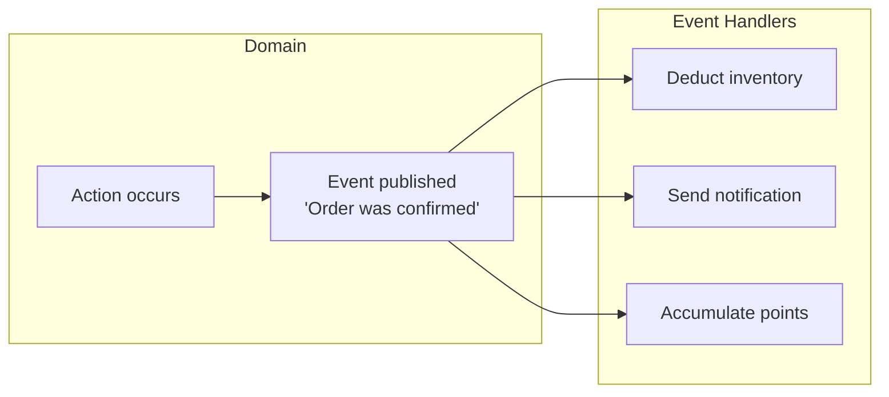
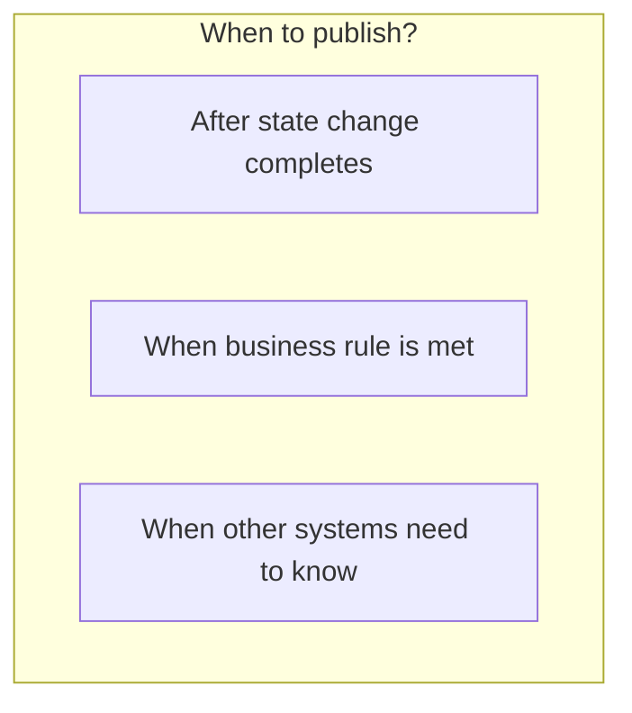
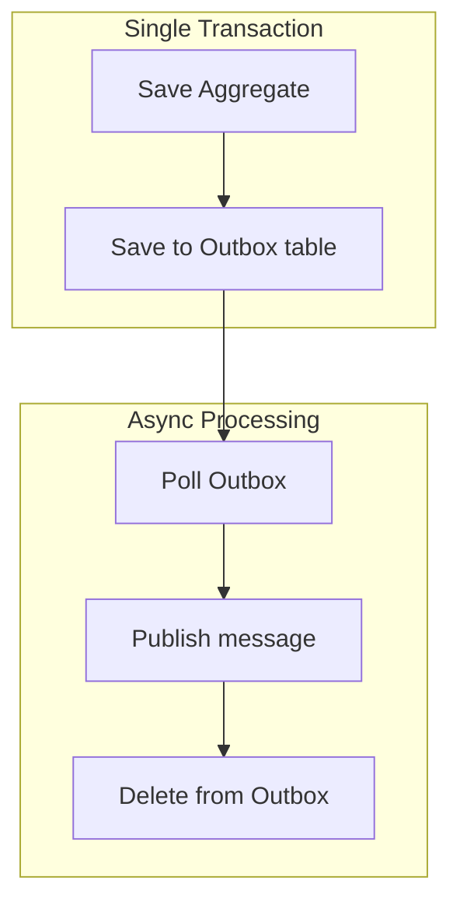
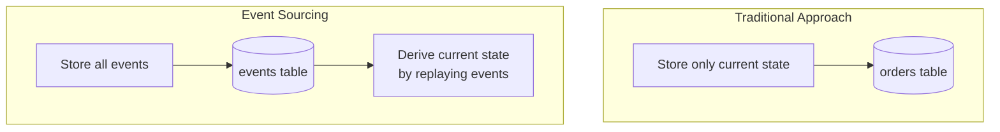

# Domain Events

How to express and utilize important occurrences in the domain as events.

> **Common Imports for examples in this page:**
> ```java
> import java.time.Instant;
> import java.time.LocalDateTime;
> import java.util.UUID;
> import java.util.List;
> import java.util.ArrayList;
> import java.util.Collections;
> import org.springframework.context.ApplicationEventPublisher;
> import org.springframework.transaction.event.TransactionalEventListener;
> import org.springframework.transaction.event.TransactionPhase;
> import org.springframework.scheduling.annotation.Async;
> ```

## What are Domain Events?

**Domain Events** are **business-meaningful occurrences** that domain experts care about.



### Characteristics

| Property | Description | Example |
|----------|-------------|---------|
| **Past tense naming** | Something that already happened | OrderConfirmed (O), ConfirmOrder (X) |
| **Immutability** | Cannot change after publishing | Event data is readonly |
| **Self-contained** | Contains necessary information | orderId, timestamp, related data |

## Event Design

### Basic Structure

```java
public abstract class DomainEvent {
    private final String eventId;
    private final Instant occurredAt;

    protected DomainEvent() {
        this.eventId = UUID.randomUUID().toString();
        this.occurredAt = Instant.now();
    }

    public String getEventId() {
        return eventId;
    }

    public Instant getOccurredAt() {
        return occurredAt;
    }
}
```

### Concrete Event Definition

```java
public class OrderConfirmedEvent extends DomainEvent {
    private final OrderId orderId;
    private final CustomerId customerId;
    private final Money totalAmount;
    private final List<OrderLineSnapshot> orderLines;

    public OrderConfirmedEvent(Order order) {
        super();
        this.orderId = order.getId();
        this.customerId = order.getCustomerId();
        this.totalAmount = order.getTotalAmount();
        this.orderLines = order.getOrderLines().stream()
            .map(OrderLineSnapshot::from)
            .toList();
    }

    // Getters...

    // Event-specific snapshot (immutable)
    public record OrderLineSnapshot(
        ProductId productId,
        String productName,
        int quantity,
        Money amount
    ) {
        public static OrderLineSnapshot from(OrderLine line) {
            return new OrderLineSnapshot(
                line.getProductId(),
                line.getProductName(),
                line.getQuantity(),
                line.getAmount()
            );
        }
    }
}
```

### When to Publish Events



```java
public class Order extends AggregateRoot {

    public void confirm() {
        validateConfirmable();

        this.status = OrderStatus.CONFIRMED;
        this.confirmedAt = LocalDateTime.now();

        // Register event after state change
        registerEvent(new OrderConfirmedEvent(this));
    }

    public void ship(TrackingNumber trackingNumber) {
        validateShippable();

        this.status = OrderStatus.SHIPPED;
        this.trackingNumber = trackingNumber;

        registerEvent(new OrderShippedEvent(this.id, trackingNumber));
    }

    public void cancel(CancellationReason reason) {
        validateCancellable();

        this.status = OrderStatus.CANCELLED;
        this.cancelledAt = LocalDateTime.now();
        this.cancellationReason = reason;

        registerEvent(new OrderCancelledEvent(this.id, reason));
    }
}
```

## Event Publishing Implementation

### Method 1: Spring ApplicationEvent

```java
// Aggregate Root base class
public abstract class AggregateRoot {
    @Transient
    private final List<DomainEvent> domainEvents = new ArrayList<>();

    protected void registerEvent(DomainEvent event) {
        domainEvents.add(event);
    }

    public List<DomainEvent> getDomainEvents() {
        return Collections.unmodifiableList(domainEvents);
    }

    public void clearDomainEvents() {
        domainEvents.clear();
    }
}

// Publish from Repository on save
@Repository
public class JpaOrderRepository implements OrderRepository {
    private final OrderJpaRepository jpaRepository;
    private final ApplicationEventPublisher eventPublisher;

    @Override
    public Order save(Order order) {
        OrderEntity entity = mapper.toEntity(order);
        jpaRepository.save(entity);

        // Publish events after successful save
        order.getDomainEvents().forEach(eventPublisher::publishEvent);
        order.clearDomainEvents();

        return order;
    }
}
```

### Method 2: Spring Data's @DomainEvents

```java
@Entity
public class OrderEntity extends AbstractAggregateRoot<OrderEntity> {

    public void confirm() {
        this.status = OrderStatus.CONFIRMED;

        // Method from AbstractAggregateRoot
        registerEvent(new OrderConfirmedEvent(this.id));
    }
}

// Events automatically published when Repository save() is called
```

### Method 3: Transactional Outbox Pattern

A pattern for reliable event publishing.



```java
// Outbox entity
@Entity
@Table(name = "outbox_events")
public class OutboxEvent {
    @Id
    private String id;
    private String aggregateType;
    private String aggregateId;
    private String eventType;
    private String payload;  // JSON
    private Instant createdAt;
    private boolean published;
}

// Save to Outbox when saving
@Transactional
public void confirmOrder(OrderId orderId) {
    Order order = orderRepository.findById(orderId).orElseThrow();
    order.confirm();

    orderRepository.save(order);

    // Save to Outbox in same transaction
    OutboxEvent outbox = OutboxEvent.builder()
        .aggregateType("Order")
        .aggregateId(orderId.getValue())
        .eventType("OrderConfirmed")
        .payload(toJson(new OrderConfirmedEvent(order)))
        .build();
    outboxRepository.save(outbox);
}

// Separate scheduler polls Outbox and publishes to Kafka
@Scheduled(fixedDelay = 1000)
public void publishOutboxEvents() {
    List<OutboxEvent> events = outboxRepository.findUnpublished();
    for (OutboxEvent event : events) {
        kafkaTemplate.send("domain-events", event.getPayload());
        event.markAsPublished();
        outboxRepository.save(event);
    }
}
```

## Event Handling

### Synchronous Handling (Same Transaction)

```java
@Component
public class OrderEventHandler {

    // BEFORE_COMMIT: Executes just before transaction commit
    // Note: Handler exception rolls back the transaction
    @TransactionalEventListener(phase = TransactionPhase.BEFORE_COMMIT)
    public void handleOrderConfirmed(OrderConfirmedEvent event) {
        // Logic that must succeed with order confirmation
        // Transaction rolls back on failure
        auditService.recordConfirmation(event.getOrderId());
    }
}
```

**TransactionPhase Selection Guide:**

| Phase | Execution Timing | On Handler Failure | Use Case |
|-------|-----------------|-------------------|----------|
| **BEFORE_COMMIT** | Just before commit | Full rollback | Required follow-up tasks |
| **AFTER_COMMIT** | After commit complete | Cannot rollback | Notifications, external integration |
| **AFTER_ROLLBACK** | After rollback | - | Compensating transactions |

### Asynchronous Handling (Separate Transaction)

```java
@Component
public class NotificationEventHandler {

    // Async processing after transaction commit
    @Async
    @TransactionalEventListener(phase = TransactionPhase.AFTER_COMMIT)
    public void handleOrderConfirmed(OrderConfirmedEvent event) {
        // Send notification (doesn't affect order on failure)
        notificationService.sendOrderConfirmation(
            event.getCustomerId(),
            event.getOrderId()
        );
    }
}
```

### Event Processing via Kafka

```java
// Event publishing
@Component
public class OrderEventPublisher {
    private final KafkaTemplate<String, OrderEvent> kafkaTemplate;

    @TransactionalEventListener(phase = TransactionPhase.AFTER_COMMIT)
    public void publishToKafka(OrderConfirmedEvent event) {
        kafkaTemplate.send(
            "order-events",
            event.getOrderId().getValue(),  // Key: Order guarantee
            toKafkaEvent(event)
        );
    }
}

// Event consumption
@Component
public class InventoryEventConsumer {

    @KafkaListener(topics = "order-events", groupId = "inventory-service")
    public void handleOrderEvent(ConsumerRecord<String, OrderEvent> record) {
        OrderEvent event = record.value();

        if ("OrderConfirmed".equals(event.getType())) {
            // Deduct inventory
            inventoryService.reserveStock(event.getOrderLines());
        }
    }
}
```

## Event Design Guide

### Information to Include in Events

```java
// ❌ Too little information
public class OrderConfirmedEvent {
    private OrderId orderId;  // ID alone requires additional queries
}

// ❌ Too much information
public class OrderConfirmedEvent {
    private Order order;  // Includes entire Aggregate
}

// ✅ Appropriate information
public class OrderConfirmedEvent {
    private OrderId orderId;
    private CustomerId customerId;
    private Money totalAmount;
    private List<OrderLineSnapshot> orderLines;  // Necessary snapshot
    private Instant confirmedAt;
}
```

### Event Version Management

```java
// Event with version
public class OrderConfirmedEventV2 extends DomainEvent {
    private static final int VERSION = 2;

    private OrderId orderId;
    private CustomerId customerId;
    private Money totalAmount;
    private ShippingAddress shippingAddress;  // Added in V2

    // Conversion for backward compatibility
    public OrderConfirmedEventV1 toV1() {
        return new OrderConfirmedEventV1(orderId, customerId, totalAmount);
    }
}
```

## Event Sourcing

A pattern that uses events as the source of state.



```java
// Reconstruct Aggregate from events
public class Order {
    private OrderId id;
    private OrderStatus status;
    private List<OrderLine> orderLines;

    // Reconstruct from event stream
    public static Order fromEvents(List<DomainEvent> events) {
        Order order = new Order();
        for (DomainEvent event : events) {
            order.apply(event);
        }
        return order;
    }

    private void apply(DomainEvent event) {
        if (event instanceof OrderCreatedEvent e) {
            this.id = e.getOrderId();
            this.status = OrderStatus.PENDING;
            this.orderLines = new ArrayList<>(e.getOrderLines());
        } else if (event instanceof OrderConfirmedEvent e) {
            this.status = OrderStatus.CONFIRMED;
        } else if (event instanceof OrderCancelledEvent e) {
            this.status = OrderStatus.CANCELLED;
        }
    }
}

// Event Store
public interface OrderEventStore {
    void append(OrderId orderId, DomainEvent event);
    List<DomainEvent> getEvents(OrderId orderId);
}

// Repository
public class EventSourcedOrderRepository implements OrderRepository {
    private final OrderEventStore eventStore;

    @Override
    public Optional<Order> findById(OrderId id) {
        List<DomainEvent> events = eventStore.getEvents(id);
        if (events.isEmpty()) {
            return Optional.empty();
        }
        return Optional.of(Order.fromEvents(events));
    }

    @Override
    public Order save(Order order) {
        for (DomainEvent event : order.getDomainEvents()) {
            eventStore.append(order.getId(), event);
        }
        order.clearDomainEvents();
        return order;
    }
}
```

### Event Sourcing Pros and Cons

| Pros | Cons |
|------|------|
| Complete audit trail | Increased complexity |
| Time travel (reconstruct past states) | Event schema evolution challenges |
| Suited for event-driven integration | Query performance (CQRS needed) |

## Practical Tips

### 1. Event Naming Convention

```
- Use past tense: OrderConfirmed, PaymentCompleted
- Use domain terms: OrderShipped (O), OrderStatusChangedToShipped (X)
- Clear prefix: Order + Confirmed = OrderConfirmed
```

### 2. Idempotency Handling

```java
@Component
public class PaymentEventHandler {
    private final ProcessedEventRepository processedEvents;

    @KafkaListener(topics = "order-events")
    public void handle(OrderConfirmedEvent event) {
        // Check if event was already processed
        if (processedEvents.exists(event.getEventId())) {
            log.info("Already processed event: {}", event.getEventId());
            return;
        }

        // Process business logic
        paymentService.requestPayment(event);

        // Record as processed
        processedEvents.save(event.getEventId());
    }
}
```

### 3. Failure Handling

```java
@Component
public class StockEventHandler {

    @RetryableTopic(
        attempts = "3",
        backoff = @Backoff(delay = 1000, multiplier = 2)
    )
    @KafkaListener(topics = "order-events")
    public void handle(OrderConfirmedEvent event) {
        // After 3 retries, failure moves to DLT
        stockService.reserve(event.getOrderLines());
    }

    @DltHandler
    public void handleDlt(OrderConfirmedEvent event) {
        // Dead Letter Topic handling
        alertService.notifyStockReservationFailed(event);
    }
}
```

## Next Steps

- [Hands-on Examples](../../examples/) - Building an order domain with Spring Boot
