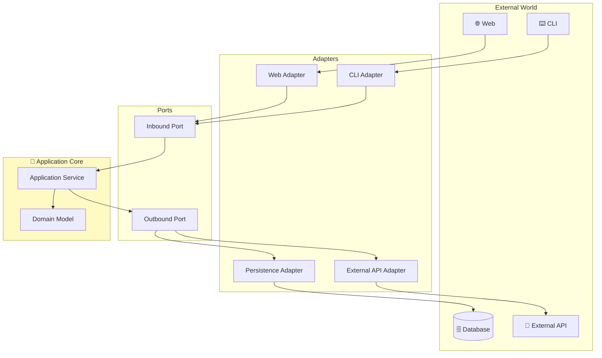

# Hexagonal Architecture

Also called the **Ports and Adapters** pattern. An architecture that completely isolates the application core from the external world.

## One-Line Summary

> **Application is inside the hexagon, external connections via Port and Adapter**



---

## Core Concepts

### 1. Port = Interface

```java
// Inbound Port: "Call me like this"
public interface CreateOrderUseCase {
    OrderId createOrder(CreateOrderCommand command);
}

// Outbound Port: "I need this capability"
public interface SaveOrderPort {
    void save(Order order);
}
```

### 2. Adapter = Implementation

```java
// Driving Adapter: External → Application
@RestController
public class OrderController {
    private final CreateOrderUseCase createOrderUseCase;

    @PostMapping("/orders")
    public ResponseEntity<String> createOrder(@RequestBody OrderRequest request) {
        OrderId orderId = createOrderUseCase.createOrder(request.toCommand());
        return ResponseEntity.ok(orderId.getValue());
    }
}

// Driven Adapter: Application → External
@Repository
public class OrderPersistenceAdapter implements SaveOrderPort {
    private final OrderJpaRepository jpaRepository;

    @Override
    public void save(Order order) {
        OrderEntity entity = OrderMapper.toEntity(order);
        jpaRepository.save(entity);
    }
}
```

### 3. Application Service

```java
@Service
@Transactional
public class OrderService implements CreateOrderUseCase {

    private final SaveOrderPort saveOrderPort;
    private final CheckInventoryPort inventoryPort;

    @Override
    public OrderId createOrder(CreateOrderCommand command) {
        // Check inventory
        for (OrderLineCommand line : command.getLines()) {
            if (!inventoryPort.isAvailable(line.getProductId(), line.getQuantity())) {
                throw new InsufficientInventoryException(line.getProductId());
            }
        }

        // Create order (Domain Logic)
        Order order = Order.create(command.getCustomerId(), command.toOrderLines());

        // Save (Outbound Port)
        saveOrderPort.save(order);

        return order.getId();
    }
}
```

## Package Structure

```
com.example.order/
├── adapter/
│   ├── in/web/
│   │   └── OrderController.java
│   └── out/persistence/
│       └── OrderPersistenceAdapter.java
├── application/
│   ├── port/in/
│   │   └── CreateOrderUseCase.java
│   ├── port/out/
│   │   └── SaveOrderPort.java
│   └── service/
│       └── OrderService.java
└── domain/
    ├── Order.java
    └── OrderId.java
```

## Benefits

| Benefit | Description |
|---------|-------------|
| **Easy Testing** | Just mock Ports |
| **Technology Swap** | Change Adapter without touching core |
| **External Isolation** | Core doesn't know about external systems |

## When to Use

- ✅ Many external integrations
- ✅ Microservices
- ✅ Need technology flexibility
- ❌ Simple CRUD apps
- ❌ Small projects

## Next Steps

- [Clean Architecture](../clean-architecture/)
- [Onion Architecture](../onion-architecture/)
