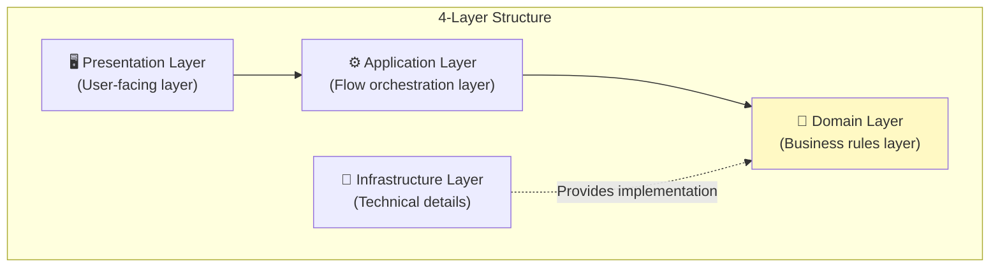
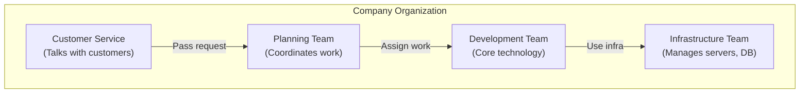
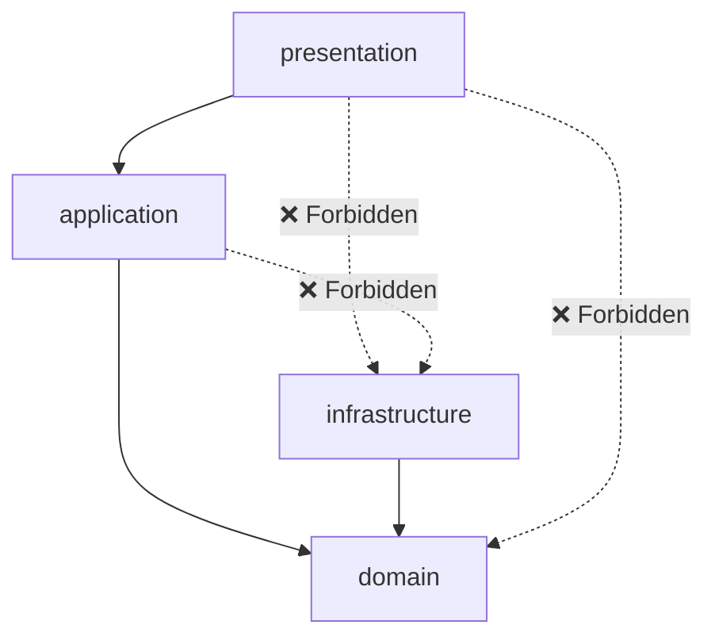
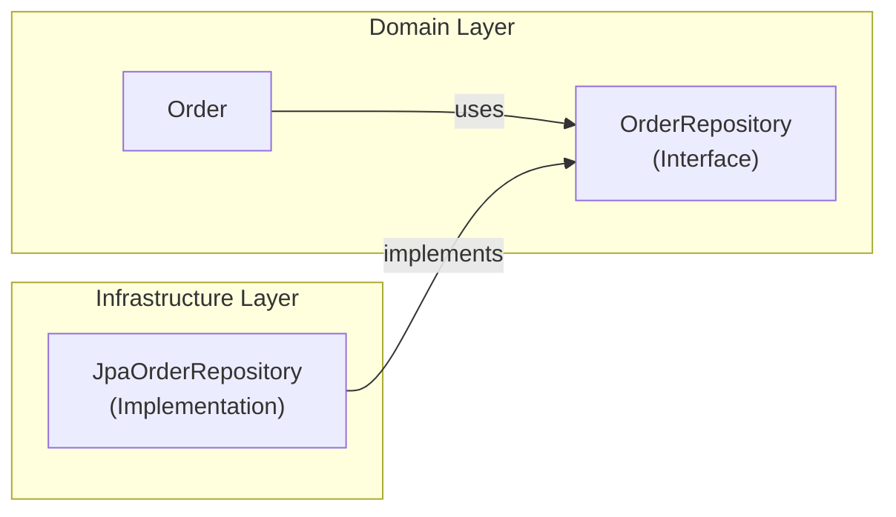
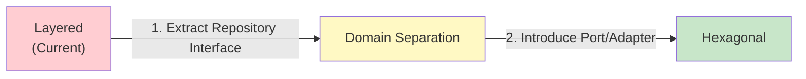

# Layered Architecture

The most basic and widely used architecture pattern. **Start here if you're learning architecture for the first time.**

## One-Line Summary

> **Divide code into 4 layers and call only from top to bottom**



---

## Why Divide into Layers?

### Analogy: Company Organization

Think about how a company works:



- **Customer Service** identifies what customers want
- **Planning Team** coordinates the order of processing
- **Development Team** does actual feature development
- **Infrastructure Team** manages servers, DBs, etc.

Each team focusing on their role makes things efficient, right? Software is the same.

---

## Detailed Explanation of 4 Layers

### 1. Presentation Layer

**Role:** Interface for user communication

```
User ←→ [Presentation Layer] ←→ Rest of system
```

What this layer does:
- Receive user input (HTTP requests, form inputs)
- Show results to users (JSON responses, HTML pages)
- Validate input format ("Is this a valid email format?")

```java
// Presentation Layer example: Controller
@RestController
@RequestMapping("/api/orders")
public class OrderController {

    private final OrderService orderService;  // Calls Application Layer

    // Receive user request
    @PostMapping
    public ResponseEntity<OrderResponse> createOrder(
            @Valid @RequestBody CreateOrderRequest request) {

        // 1. Pass request data to Application Layer
        OrderDto result = orderService.createOrder(
            request.getCustomerId(),
            request.getItems()
        );

        // 2. Return result to user
        return ResponseEntity.ok(OrderResponse.from(result));
    }

    @GetMapping("/{orderId}")
    public ResponseEntity<OrderResponse> getOrder(@PathVariable String orderId) {
        OrderDto order = orderService.getOrder(orderId);
        return ResponseEntity.ok(OrderResponse.from(order));
    }
}

// Request/Response objects (DTO)
public record CreateOrderRequest(
    String customerId,
    List<OrderItemRequest> items
) {}

public record OrderResponse(
    String orderId,
    String status,
    BigDecimal totalAmount
) {
    public static OrderResponse from(OrderDto dto) {
        return new OrderResponse(dto.orderId(), dto.status(), dto.totalAmount());
    }
}
```


**Common Mistake: Business logic in Presentation**

```java
// ❌ Wrong: Discount calculation in Controller
@PostMapping
public ResponseEntity<OrderResponse> createOrder(...) {
    // This logic shouldn't be here!
    if (request.getTotalAmount() > 1000) {
        request.setDiscount(0.1);  // 10% discount
    }
}
```

Business logic should be in the Domain Layer.


---

### 2. Application Layer

**Role:** Conductor orchestrating workflow

What this layer does:
- Decide what order to process things
- Manage transactions
- Combine Domain Layer objects

**Important:** Application Layer decides **"what"** to do, and leaves **"how"** to Domain.

```java
// Application Layer example: Service
@Service
@Transactional  // Transaction management here
public class OrderService {

    private final OrderRepository orderRepository;
    private final CustomerRepository customerRepository;
    private final PaymentService paymentService;
    private final NotificationService notificationService;

    // Orchestrate order creation "flow"
    public OrderDto createOrder(String customerId, List<OrderItemDto> items) {

        // 1. Find customer
        Customer customer = customerRepository.findById(customerId)
            .orElseThrow(() -> new CustomerNotFoundException(customerId));

        // 2. Create order (business logic inside Order object)
        Order order = Order.create(customer.getId(), toOrderLines(items));

        // 3. Save
        orderRepository.save(order);

        // 4. Send notification
        notificationService.sendOrderCreatedNotification(order);

        // 5. Return result
        return OrderDto.from(order);
    }

    // Order confirmation "flow"
    public void confirmOrder(String orderId) {
        // 1. Find order
        Order order = orderRepository.findById(orderId)
            .orElseThrow(() -> new OrderNotFoundException(orderId));

        // 2. Process payment
        paymentService.processPayment(order.getTotalAmount());

        // 3. Confirm order (business logic inside Order)
        order.confirm();

        // 4. Save
        orderRepository.save(order);
    }
}
```


**Application vs Domain Difference**

```java
// Application Layer: "Flow" orchestration
public void confirmOrder(String orderId) {
    Order order = orderRepository.findById(orderId);
    paymentService.processPayment(order.getTotalAmount());
    order.confirm();  // Asks Domain to "confirm"
    orderRepository.save(order);
}

// Domain Layer: "Rule" application
public class Order {
    public void confirm() {
        // Business rule: Can only confirm from PENDING state
        if (this.status != OrderStatus.PENDING) {
            throw new IllegalStateException("Cannot confirm in this state");
        }
        this.status = OrderStatus.CONFIRMED;
    }
}
```


---

### 3. Domain Layer

**Role:** Heart of business rules ❤️

The most important layer. This is where "real business logic" lives.

What this layer does:
- Express business rules ("VIP customers get 10% discount")
- Maintain data consistency ("Order amount must be 0 or more")
- Express domain concepts (Order, Customer, Product)

```java
// Domain Layer example: Entity
public class Order {
    private OrderId id;
    private CustomerId customerId;
    private List<OrderLine> orderLines;
    private OrderStatus status;
    private Money totalAmount;

    // Creation method: Apply business rules
    public static Order create(CustomerId customerId, List<OrderLine> lines) {
        // Rule: Order must have at least 1 item
        if (lines.isEmpty()) {
            throw new IllegalArgumentException("Order requires at least 1 item");
        }

        Order order = new Order();
        order.id = OrderId.generate();
        order.customerId = customerId;
        order.orderLines = new ArrayList<>(lines);
        order.status = OrderStatus.PENDING;
        order.calculateTotal();

        return order;
    }

    // Business logic: Add item
    public void addItem(OrderLine line) {
        // Rule: Can only add items in PENDING state
        validateModifiable();

        // Rule: Same product increases quantity
        orderLines.stream()
            .filter(existing -> existing.isSameProduct(line))
            .findFirst()
            .ifPresentOrElse(
                existing -> existing.increaseQuantity(line.getQuantity()),
                () -> orderLines.add(line)
            );

        calculateTotal();
    }

    // Business logic: Confirm order
    public void confirm() {
        // Rule: Can only confirm from PENDING state
        if (this.status != OrderStatus.PENDING) {
            throw new IllegalStateException(
                "Cannot confirm order. Current state: " + status
            );
        }

        // Rule: Check minimum order amount
        if (this.totalAmount.isLessThan(Money.of(10))) {
            throw new IllegalStateException("Minimum order amount is $10");
        }

        this.status = OrderStatus.CONFIRMED;
    }

    // Business logic: Cancel order
    public void cancel() {
        // Rule: Cannot cancel after shipping started
        if (this.status == OrderStatus.SHIPPED) {
            throw new IllegalStateException("Cannot cancel shipped orders");
        }

        this.status = OrderStatus.CANCELLED;
    }

    // Internal logic
    private void calculateTotal() {
        this.totalAmount = orderLines.stream()
            .map(OrderLine::getAmount)
            .reduce(Money.ZERO, Money::add);
    }

    private void validateModifiable() {
        if (this.status != OrderStatus.PENDING) {
            throw new IllegalStateException("Cannot modify in this state");
        }
    }
}
```

```java
// Domain Layer: Value Object
public record Money(BigDecimal amount) {

    public static final Money ZERO = new Money(BigDecimal.ZERO);

    public Money {
        // Invariant: Amount must be 0 or more
        if (amount.compareTo(BigDecimal.ZERO) < 0) {
            throw new IllegalArgumentException("Amount must be 0 or greater");
        }
    }

    public static Money of(long amount) {
        return new Money(BigDecimal.valueOf(amount));
    }

    public Money add(Money other) {
        return new Money(this.amount.add(other.amount));
    }

    public Money multiply(int quantity) {
        return new Money(this.amount.multiply(BigDecimal.valueOf(quantity)));
    }

    public boolean isLessThan(Money other) {
        return this.amount.compareTo(other.amount) < 0;
    }
}
```


**Common Mistake: Anemic Domain**

```java
// ❌ Wrong: Entity with no logic, just data
public class Order {
    private String id;
    private String status;
    private BigDecimal total;

    // Only getter, setter...
    public String getStatus() { return status; }
    public void setStatus(String status) { this.status = status; }
}

// Logic is in Service
public class OrderService {
    public void confirm(Order order) {
        if (order.getStatus().equals("PENDING")) {
            order.setStatus("CONFIRMED");  // Don't do this!
        }
    }
}
```

Business logic should be inside the Entity!


---

### 4. Infrastructure Layer

**Role:** Handle technical details

What this layer does:
- Database access (JPA, MyBatis)
- External API calls (REST Client)
- Message sending (Kafka, Email)
- File storage

```java
// Infrastructure Layer: Repository implementation
@Repository
public class JpaOrderRepository implements OrderRepository {

    private final OrderJpaRepository jpaRepository;  // Spring Data JPA
    private final OrderMapper mapper;

    @Override
    public void save(Order order) {
        // Domain → JPA Entity conversion
        OrderEntity entity = mapper.toEntity(order);
        jpaRepository.save(entity);
    }

    @Override
    public Optional<Order> findById(OrderId id) {
        // JPA Entity → Domain conversion
        return jpaRepository.findById(id.getValue())
            .map(mapper::toDomain);
    }
}

// JPA Entity (Infrastructure only)
@Entity
@Table(name = "orders")
public class OrderEntity {
    @Id
    private String id;
    private String customerId;
    private String status;
    private BigDecimal totalAmount;

    @OneToMany(mappedBy = "order", cascade = CascadeType.ALL)
    private List<OrderLineEntity> orderLines;

    // getter, setter (used only in Infrastructure)
}
```

```java
// Infrastructure Layer: External API integration
@Component
public class PaymentGatewayClient implements PaymentService {

    private final RestTemplate restTemplate;

    @Override
    public PaymentResult processPayment(Money amount) {
        PaymentRequest request = new PaymentRequest(amount.getAmount());

        ResponseEntity<PaymentResponse> response = restTemplate.postForEntity(
            "https://payment-api.example.com/pay",
            request,
            PaymentResponse.class
        );

        return toPaymentResult(response.getBody());
    }
}
```

---

## Package Structure

### Basic Structure

```
com.example.order/
├── presentation/              # Presentation Layer
│   ├── OrderController.java
│   ├── CreateOrderRequest.java
│   └── OrderResponse.java
│
├── application/               # Application Layer
│   ├── OrderService.java
│   └── OrderDto.java
│
├── domain/                    # Domain Layer
│   ├── Order.java
│   ├── OrderLine.java
│   ├── OrderId.java
│   ├── OrderStatus.java
│   ├── Money.java
│   └── OrderRepository.java   # Interface (implementation in Infrastructure)
│
└── infrastructure/            # Infrastructure Layer
    ├── persistence/
    │   ├── JpaOrderRepository.java
    │   ├── OrderEntity.java
    │   └── OrderMapper.java
    └── external/
        └── PaymentGatewayClient.java
```

### Dependency Direction



**Core Rules:**
- Depend only from top to bottom
- Domain depends on nothing
- Infrastructure implements Domain interfaces

---

## Dependency Inversion (DIP)

"Domain doesn't depend on Infrastructure" might sound strange. How can we use Repository without depending on it?

### The Secret: Interfaces



```java
// Domain Layer: Define interface
public interface OrderRepository {
    void save(Order order);
    Optional<Order> findById(OrderId id);
}

// Domain Layer: Service uses only interface
@Service
public class OrderService {
    private final OrderRepository orderRepository;  // Interface type

    public void createOrder(...) {
        orderRepository.save(order);  // Doesn't know concrete implementation
    }
}

// Infrastructure Layer: Implement interface
@Repository
public class JpaOrderRepository implements OrderRepository {
    // Implement using JPA
}
```

**This way:**
- Domain only needs to know `OrderRepository` interface
- Can swap JPA for MyBatis without changing Domain code
- Can use fake (Mock) Repository for testing

---

## Pros and Cons of Layered

### Advantages

| Advantage | Description |
|-----------|-------------|
| **Easy to understand** | Intuitive top→bottom flow |
| **Clear roles** | What each layer does is obvious |
| **Quick start** | Can apply immediately without complex setup |
| **Team collaboration** | "You do Controller, I do Service" division possible |

### Disadvantages

| Disadvantage | Description |
|--------------|-------------|
| **Forces layer traversal** | Even simple queries go through all layers |
| **Technology dependency** | Infrastructure changes can affect Domain |
| **Testing difficulties** | Hard to test without Mocks |

---

## Common Mistakes

### 1. Skipping Layers

```java
// ❌ Controller directly accesses Repository
@RestController
public class OrderController {
    @Autowired
    private OrderRepository orderRepository;  // Skips Application Layer!

    @GetMapping("/{id}")
    public Order getOrder(@PathVariable String id) {
        return orderRepository.findById(id);  // Returns directly without validation/conversion
    }
}
```

```java
// ✅ Correct: Go through Application Layer
@RestController
public class OrderController {
    private final OrderService orderService;  // Application Layer

    @GetMapping("/{id}")
    public OrderResponse getOrder(@PathVariable String id) {
        OrderDto dto = orderService.getOrder(id);  // Through Service
        return OrderResponse.from(dto);
    }
}
```

### 2. Technical Code in Domain

```java
// ❌ JPA annotations in Domain Entity
@Entity
@Table(name = "orders")
public class Order {
    @Id
    @GeneratedValue
    private Long id;

    @OneToMany(cascade = CascadeType.ALL)
    private List<OrderLine> lines;
}
```

To keep pure Domain model, create separate Entity in Infrastructure.

### 3. Circular Dependencies

```java
// ❌ Circular dependency
// OrderService → PaymentService → OrderService

@Service
public class OrderService {
    private final PaymentService paymentService;
}

@Service
public class PaymentService {
    private final OrderService orderService;  // Circular!
}
```

```java
// ✅ Solve with events
@Service
public class OrderService {
    private final EventPublisher eventPublisher;

    public void confirmOrder(String orderId) {
        // ...
        eventPublisher.publish(new OrderConfirmedEvent(order));
    }
}

@Component
public class PaymentEventHandler {
    @EventListener
    public void onOrderConfirmed(OrderConfirmedEvent event) {
        // Process payment
    }
}
```

---

## Testing Strategy

### 1. Domain Layer Test (Easiest)

Test pure logic without external dependencies:

```java
class OrderTest {

    @Test
    void totalAmountIsCalculatedOnCreation() {
        // Given
        List<OrderLine> lines = List.of(
            new OrderLine(ProductId.of("P1"), 2, Money.of(100)),
            new OrderLine(ProductId.of("P2"), 1, Money.of(50))
        );

        // When
        Order order = Order.create(CustomerId.of("C1"), lines);

        // Then
        assertThat(order.getTotalAmount()).isEqualTo(Money.of(250));
    }

    @Test
    void canOnlyConfirmFromPendingState() {
        Order order = createPendingOrder();

        order.confirm();

        assertThat(order.getStatus()).isEqualTo(OrderStatus.CONFIRMED);
    }

    @Test
    void cannotCancelShippedOrder() {
        Order order = createShippedOrder();

        assertThrows(IllegalStateException.class, () -> order.cancel());
    }
}
```

### 2. Application Layer Test (Using Mock)

```java
@ExtendWith(MockitoExtension.class)
class OrderServiceTest {

    @Mock
    private OrderRepository orderRepository;

    @Mock
    private NotificationService notificationService;

    @InjectMocks
    private OrderService orderService;

    @Test
    void createOrderSuccess() {
        // Given
        String customerId = "customer-1";
        List<OrderItemDto> items = List.of(
            new OrderItemDto("product-1", 2, 100)
        );

        // When
        OrderDto result = orderService.createOrder(customerId, items);

        // Then
        verify(orderRepository).save(any(Order.class));
        verify(notificationService).sendOrderCreatedNotification(any());
        assertThat(result.orderId()).isNotNull();
    }
}
```

### 3. Infrastructure Layer Test (Integration Test)

```java
@DataJpaTest
class JpaOrderRepositoryTest {

    @Autowired
    private OrderJpaRepository jpaRepository;

    private JpaOrderRepository repository;

    @BeforeEach
    void setUp() {
        repository = new JpaOrderRepository(jpaRepository, new OrderMapper());
    }

    @Test
    void saveAndFindOrder() {
        // Given
        Order order = createTestOrder();

        // When
        repository.save(order);
        Optional<Order> found = repository.findById(order.getId());

        // Then
        assertThat(found).isPresent();
        assertThat(found.get().getId()).isEqualTo(order.getId());
    }
}
```

---

## When to Use Layered?

### Suitable Cases

- ✅ Early project stages
- ✅ Team with little architecture pattern experience
- ✅ Simple business logic
- ✅ Need for rapid development

### Unsuitable Cases

- ❌ Many external system integrations → Consider [Hexagonal](../hexagonal-architecture/)
- ❌ Complex domain logic → Consider [Onion](../onion-architecture/)
- ❌ Large team, long-term project → Consider [Clean](../clean-architecture/)

---

## Evolving to Next Stage

Once familiar with Layered, you can progress to more advanced patterns as needed:



**Step 1: Move Repository Interface to Domain**
```java
// Before: Was in Infrastructure
// After: Move to Domain
package com.example.domain;

public interface OrderRepository {
    void save(Order order);
    Optional<Order> findById(OrderId id);
}
```

**Step 2: Abstract more external integrations as Interfaces**

Going through this process naturally evolves into Hexagonal Architecture.

---

## Next Steps

- [Hexagonal Architecture](../hexagonal-architecture/) - Isolate external with Port and Adapter
- [Clean Architecture](../clean-architecture/) - Strict dependency rules
- [Onion Architecture](../onion-architecture/) - Domain model centric
