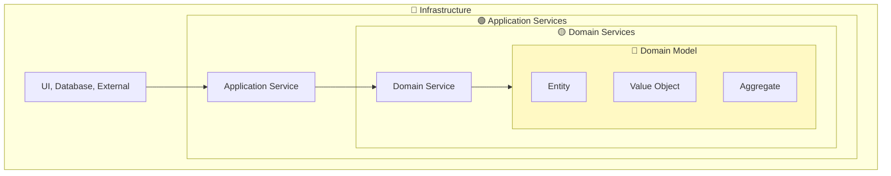

# Onion Architecture

Proposed by Jeffrey Palermo in 2008. Places **Domain Model at the center**, wrapped in layers like an onion.

## One-Line Summary

> **Domain Model is king. Everything else serves the domain.**



## 4 Layers

### 1. Domain Model 💎 (Innermost)

Core business concepts and rules.

```java
// Entity
public class Order {
    private final OrderId id;
    private CustomerId customerId;
    private List<OrderLine> orderLines;
    private OrderStatus status;

    public static Order create(CustomerId customerId, List<OrderLine> lines) {
        if (lines.isEmpty()) {
            throw new EmptyOrderException();
        }
        Order order = new Order(OrderId.generate());
        order.customerId = customerId;
        order.orderLines = new ArrayList<>(lines);
        order.status = OrderStatus.PENDING;
        return order;
    }

    public void confirm() {
        validateCanConfirm();
        this.status = OrderStatus.CONFIRMED;
    }
}

// Value Object
public record Money(BigDecimal amount, Currency currency) {
    public Money {
        if (amount.compareTo(BigDecimal.ZERO) < 0) {
            throw new NegativeAmountException();
        }
    }

    public Money add(Money other) {
        validateSameCurrency(other);
        return new Money(amount.add(other.amount), currency);
    }
}
```

### 2. Domain Services 🟡

Logic combining multiple domain objects.

```java
public class PricingService {
    public Money calculateFinalPrice(Order order, Customer customer, DiscountPolicy policy) {
        Money basePrice = order.getTotalAmount();
        Percentage discount = policy.getDiscountFor(customer.getGrade());
        return basePrice.applyDiscount(discount);
    }
}

// Repository interfaces live here
public interface OrderRepository {
    Order save(Order order);
    Optional<Order> findById(OrderId id);
}
```

### 3. Application Services 🟢

Orchestrates use case workflows.

```java
@Service
@Transactional
public class OrderApplicationService {

    private final OrderRepository orderRepository;
    private final PricingService pricingService;
    private final PaymentService paymentService;
    private final EventPublisher eventPublisher;

    public OrderDto createOrder(CreateOrderCommand command) {
        // 1. Find customer
        Customer customer = customerRepository.findById(command.customerId()).orElseThrow();

        // 2. Create order (Domain Model)
        Order order = Order.create(customer.getId(), command.toOrderLines());

        // 3. Calculate price (Domain Service)
        Money finalPrice = pricingService.calculateFinalPrice(order, customer, DiscountPolicy.standard());
        order.applyDiscount(finalPrice);

        // 4. Save
        Order saved = orderRepository.save(order);

        // 5. Publish event
        eventPublisher.publish(new OrderCreatedEvent(saved));

        return OrderDto.from(saved);
    }
}
```

### 4. Infrastructure 🔵 (Outermost)

Technical details: UI, Database, External APIs.

```java
// Controller
@RestController
public class OrderController {
    private final OrderApplicationService orderService;

    @PostMapping("/api/orders")
    public ResponseEntity<OrderResponse> createOrder(@RequestBody CreateOrderRequest request) {
        OrderDto result = orderService.createOrder(request.toCommand());
        return ResponseEntity.status(HttpStatus.CREATED).body(OrderResponse.from(result));
    }
}

// Repository Implementation
@Repository
public class JpaOrderRepository implements OrderRepository {
    private final OrderJpaRepository jpaRepository;
    private final OrderMapper mapper;

    @Override
    public Order save(Order order) {
        OrderEntity entity = mapper.toEntity(order);
        OrderEntity saved = jpaRepository.save(entity);
        return mapper.toDomain(saved);
    }
}
```

## Package Structure

```
com.example.order/
├── domain/                    # 💎 + 🟡 Domain Layer
│   ├── model/
│   │   ├── Order.java
│   │   ├── OrderLine.java
│   │   └── Money.java
│   ├── service/
│   │   └── PricingService.java
│   └── repository/
│       └── OrderRepository.java
├── application/               # 🟢 Application Services
│   ├── service/
│   │   └── OrderApplicationService.java
│   └── dto/
│       └── OrderDto.java
└── infrastructure/            # 🔵 Infrastructure
    ├── web/
    │   └── OrderController.java
    └── persistence/
        └── JpaOrderRepository.java
```

## Comparison with Other Architectures

| Aspect | Clean | Hexagonal | Onion |
|--------|-------|-----------|-------|
| **Center** | Entity | Core | Domain Model |
| **Emphasis** | Dependency rule | External isolation | Domain purity |
| **Domain Service** | Part of Entity | Not explicit | Separate layer |
| **DDD Friendly** | Medium | High | Highest |

## Common Mistakes

```java
// ❌ Domain with Infrastructure code
@Entity
public class Order { ... }

// ❌ Business logic in Application Service
@Service
public class OrderApplicationService {
    public void confirmOrder(OrderId orderId) {
        Order order = orderRepository.findById(orderId).orElseThrow();
        if (order.getStatus().equals("PENDING")) {  // Logic should be in Order!
            order.setStatus("CONFIRMED");
        }
    }
}

// ✅ Correct: Delegate to Domain
public void confirmOrder(OrderId orderId) {
    Order order = orderRepository.findById(orderId).orElseThrow();
    order.confirm();  // Domain handles the logic
    orderRepository.save(order);
}
```

## When to Use

- ✅ DDD projects with complex domains
- ✅ Collaborating with domain experts
- ✅ Long-term maintenance projects
- ❌ Simple CRUD apps
- ❌ Teams new to DDD → Start with [Layered](../layered-architecture/)

## Next Steps

- [CQRS](../cqrs/)
- [Testing Strategy](../testing/)
