# Strategic Design

High-level design for deciding how to divide and integrate complex domains.

## Overview

Strategic design is the process of drawing **"the big picture"**:

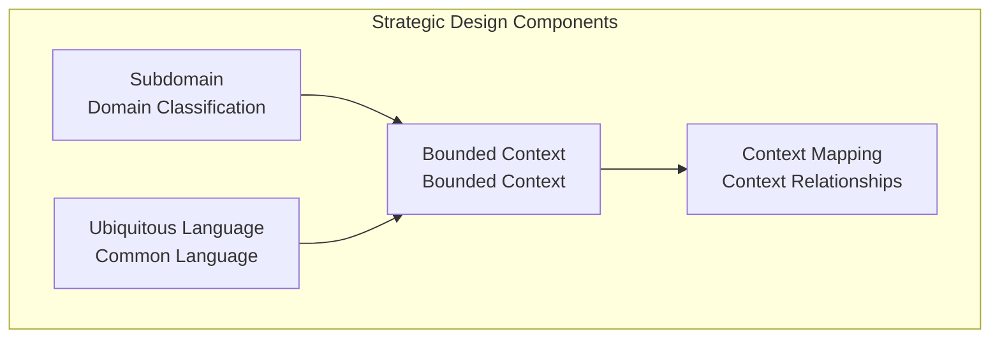

| Component | Question | Output |
|-----------|----------|--------|
| **Subdomain** | What is core to the business? | Domain classification |
| **Ubiquitous Language** | What language will we communicate in? | Glossary |
| **Bounded Context** | How do we divide the system? | Context boundaries |
| **Context Mapping** | How do systems integrate? | Integration strategy |

## Subdomain

### Concept

Classify the business domain by **importance and characteristics**.

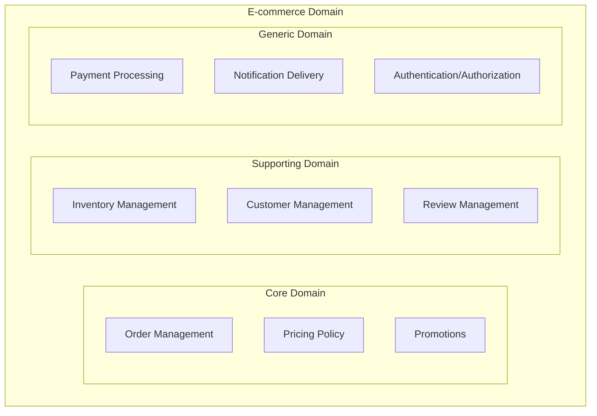

### Subdomain Types

| Type | Characteristics | Investment | Example |
|------|----------------|------------|---------|
| **Core Domain** | Core business competency | Top priority, best developers | Delivery app's dispatch algorithm |
| **Supporting Domain** | Supports core but not differentiating | Adequate investment | Inventory management, customer management |
| **Generic Domain** | Common to all businesses | Use external solutions | Payment, authentication, email |

### Real-World Example: Coupang

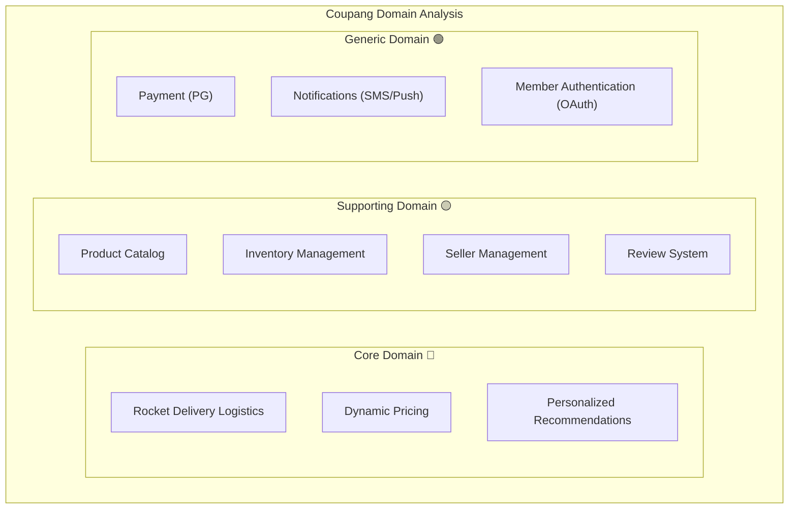

**Analysis:**
- **Core:** Rocket delivery, pricing algorithm, recommendations → Build in-house, assign best talent
- **Supporting:** Catalog, inventory → Build in-house at practical level
- **Generic:** Payment, notifications → Integrate external services

### Subdomain Identification Guide

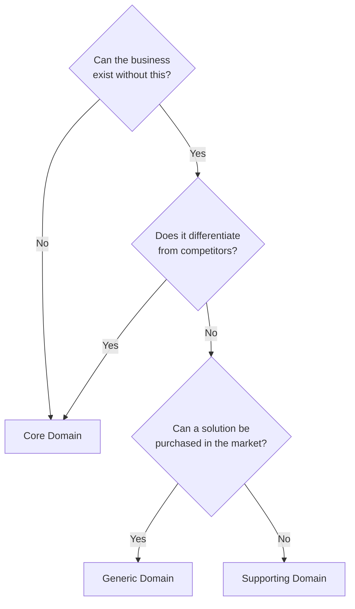

## Ubiquitous Language

### Why is it needed?

Misunderstandings occur when developers and business experts use different terminology.

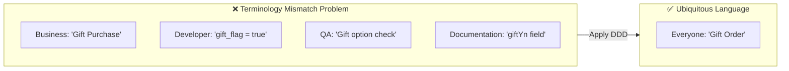

### How to Write a Glossary

**1. Nouns (Entity, Value Object)**

| Term | Definition | Code | Synonyms/Confusion |
|------|------------|------|-------------------|
| Order | A request created by a customer to purchase products | `Order` | Purchase, order |
| Order Line | Individual product and quantity within an order | `OrderLine` | Order item, detail |
| Shipping Address | Address where products will be delivered | `ShippingAddress` | Delivery address, destination |
| Money | Currency unit including currency and amount | `Money` | Price, cost |

**2. Verbs (Actions, Commands)**

| Term | Definition | Code | Preconditions | Result |
|------|------------|------|---------------|--------|
| Create Order | Creates a new order | `Order.create()` | Valid products, customer | Order created |
| Confirm Order | Changes order to processing status | `order.confirm()` | PENDING status | CONFIRMED status, inventory deducted |
| Cancel Order | Changes order to cancelled status | `order.cancel()` | PENDING/CONFIRMED | CANCELLED status, inventory restored |

**3. Events (Past occurrences)**

| Term | Definition | Code | Follow-up Actions |
|------|------------|------|-------------------|
| Order Created | The fact that a new order was created | `OrderCreatedEvent` | Reserve inventory, send notification |
| Order Confirmed | The fact that an order was confirmed | `OrderConfirmedEvent` | Request payment, start packing |
| Order Cancelled | The fact that an order was cancelled | `OrderCancelledEvent` | Restore inventory, refund |

### Reflecting in Code

```java
// ❌ Technical terms, abbreviations used
public class OrdSvc {
    public void updOrdSts(Long ordId, int sts) {
        OrdEntity ord = ordRepo.findById(ordId);
        ord.setSts(sts);
        ordRepo.save(ord);
    }
}

// ✅ Business terminology used
public class OrderService {
    public void confirmOrder(OrderId orderId) {
        Order order = orderRepository.findById(orderId);
        order.confirm();  // "Confirm the order"
        orderRepository.save(order);
    }

    public void cancelOrder(OrderId orderId, CancellationReason reason) {
        Order order = orderRepository.findById(orderId);
        order.cancel(reason);  // "Cancel the order"
        orderRepository.save(order);
    }
}
```

### Same Language in Tests

```java
@Nested
@DisplayName("Order Confirmation")
class OrderConfirmation {

    @Test
    @DisplayName("Confirming a pending order changes status to CONFIRMED")
    void pendingOrderConfirmationSuccess() {
        // given: When there is a pending order
        Order pendingOrder = createPendingOrder();

        // when: When the order is confirmed
        pendingOrder.confirm();

        // then: Status becomes CONFIRMED
        assertThat(pendingOrder.getStatus()).isEqualTo(OrderStatus.CONFIRMED);
    }

    @Test
    @DisplayName("An already confirmed order cannot be confirmed again")
    void alreadyConfirmedOrderCannotBeReconfirmed() {
        // given: An already confirmed order
        Order confirmedOrder = createConfirmedOrder();

        // when & then: Exception thrown when confirming again
        assertThatThrownBy(() -> confirmedOrder.confirm())
            .isInstanceOf(OrderCannotBeConfirmedException.class)
            .hasMessageContaining("already confirmed");
    }
}
```

## Bounded Context

### Concept

A Bounded Context is **an explicit boundary where a specific domain model applies**.

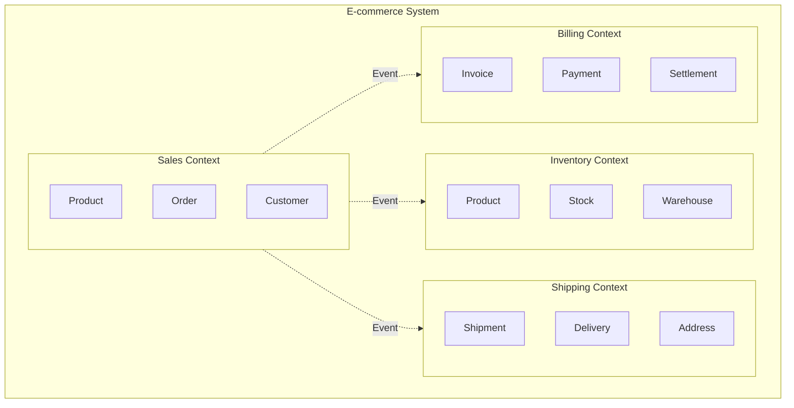

### Same Term, Different Meaning (Homonyms)

**"Customer"** has different meanings in each Context:

```java
// Customer in Sales Context
// "Who is ordering?"
public class Customer {
    private CustomerId id;
    private String name;
    private Email email;
    private MembershipGrade grade;  // VIP, Gold, Silver
    private Money availablePoints;

    public Money getDiscount(Order order) {
        return grade.calculateDiscount(order.getTotalAmount());
    }
}

// Customer in Shipping Context (Recipient)
// "Who is receiving?"
public class Recipient {
    private String name;
    private PhoneNumber phone;
    private Address address;
    private DeliveryPreference preference;  // Door, Security desk

    public boolean canReceiveAt(TimeSlot slot) {
        return preference.isAvailable(slot);
    }
}

// Customer in Billing Context (Payer)
// "Who is paying?"
public class Payer {
    private String name;
    private TaxId taxId;
    private BillingAddress billingAddress;
    private List<PaymentMethod> paymentMethods;

    public boolean requiresTaxInvoice() {
        return taxId != null;
    }
}
```

### How to Identify Bounded Contexts

**1. Linguistic Clues**

```
"The customer..." → Which customer? Buyer? Recipient? Payer?
"The product..." → Which product? Sales product? Inventory item? Shipping item?
"The order..." → Which order? Sales order? Shipping instruction? Delivery request?
```

**2. Organizational Clues**

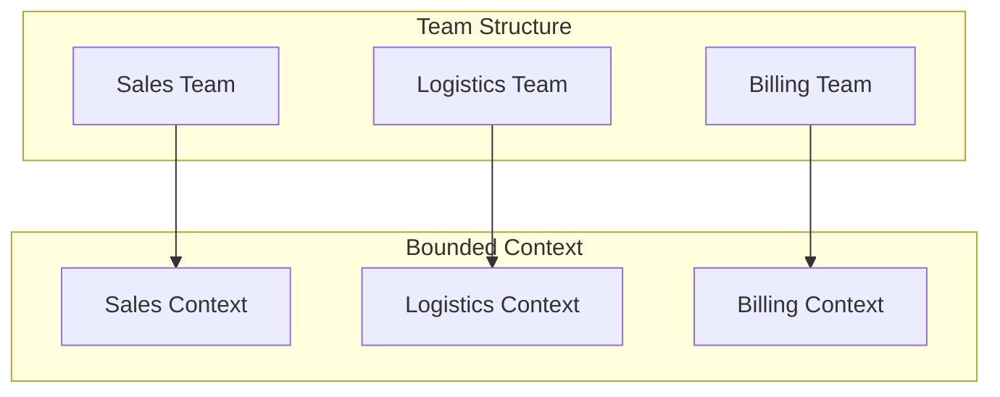

**Conway's Law:** "System structure follows organizational structure"

**3. Business Process Clues**

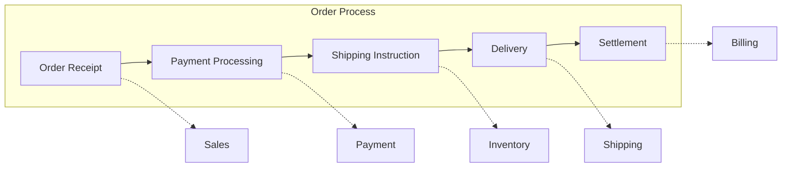

### Context Boundary Decision Checklist

```
✅ Should be grouped in the same Context:
- [ ] Strong transactional consistency is required
- [ ] Same team is responsible
- [ ] Same language (terminology) is used
- [ ] Must be deployed together

❌ Should be separated into different Contexts:
- [ ] Same term is used with different meanings
- [ ] Different teams are responsible
- [ ] Can be changed/deployed independently
- [ ] Eventual consistency is sufficient
```

## Context Mapping

### Concept

Defines relationships and integration methods between Contexts.

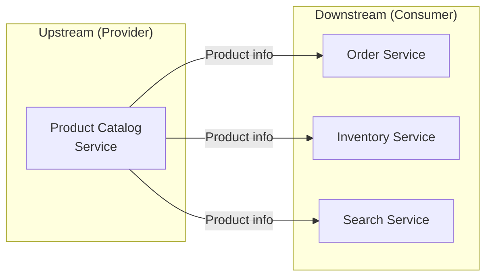

### Integration Patterns in Detail

#### 1. Partnership

Two teams **work closely together** on integration.

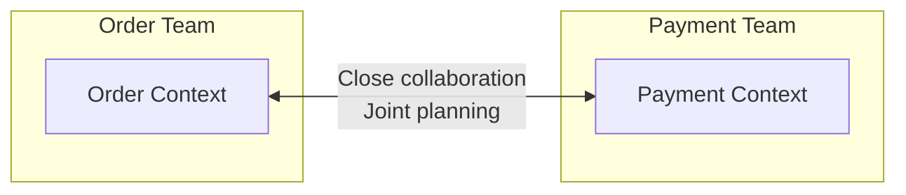

**Characteristics:**
- Both teams coordinate on API changes
- Regular integration meetings
- Joint testing

**Suitable for:**
- Different services within the same product team
- Strong dependencies

---

#### 2. Shared Kernel

Two Contexts **share some models**.

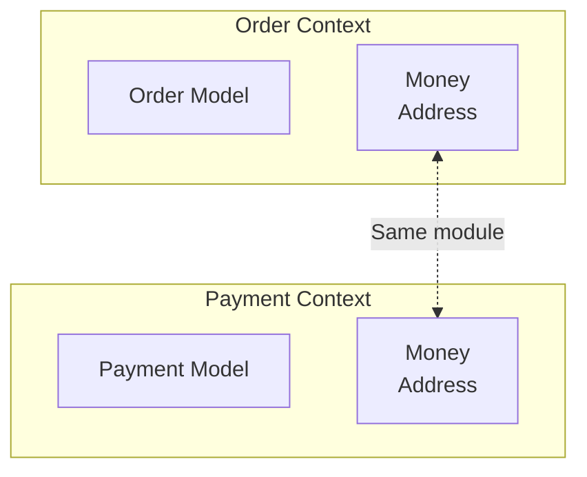

```java
// shared-kernel module
public record Money(BigDecimal amount, Currency currency) {
    public Money add(Money other) {
        validateSameCurrency(other);
        return new Money(this.amount.add(other.amount), this.currency);
    }
}

public record Address(String zipCode, String city, String street, String detail) {
    public String fullAddress() {
        return String.format("(%s) %s %s %s", zipCode, city, street, detail);
    }
}
```

**Pros:** Eliminates duplication, consistency
**Cons:** Changes affect both sides, increased coupling

**Suitable for:**
- Truly identical concepts (Money, Address, etc.)
- Stable models that rarely change

---

#### 3. Customer-Supplier

Upstream provides the API, Downstream consumes it.

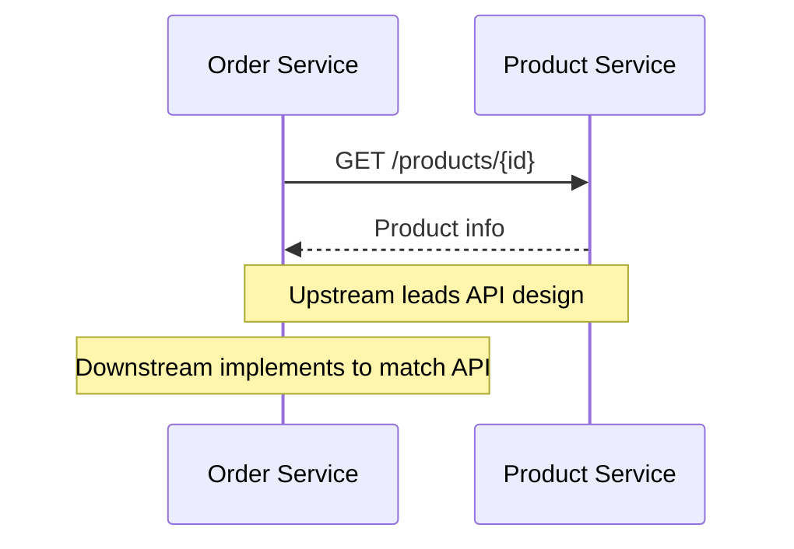

```java
// Downstream: Product Service Client
@FeignClient(name = "product-service")
public interface ProductServiceClient {

    @GetMapping("/products/{id}")
    ProductResponse getProduct(@PathVariable String id);

    @GetMapping("/products")
    List<ProductResponse> getProducts(@RequestParam List<String> ids);
}

// Usage in Downstream
@Service
public class OrderService {
    private final ProductServiceClient productClient;

    public Order createOrder(CreateOrderCommand command) {
        // Query product info from Upstream
        ProductResponse product = productClient.getProduct(command.getProductId());

        // Convert to Downstream model for use
        OrderLine orderLine = OrderLine.create(
            ProductId.of(product.id()),
            product.name(),
            Money.of(product.price()),
            command.getQuantity()
        );

        return Order.create(command.getCustomerId(), List.of(orderLine));
    }
}
```

**Roles:**
- **Upstream:** Provides API, notifies Downstream of changes
- **Downstream:** Consumes API, communicates requirements

---

#### 4. Conformist

Downstream **follows the Upstream model as-is**.

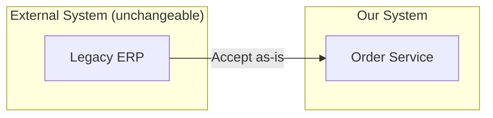

**Characteristics:**
- Uses Upstream model without transformation
- Dependent on Upstream changes

**Suitable for:**
- External systems (unchangeable)
- No negotiating power
- Simple integrations

---

#### 5. Anti-Corruption Layer (ACL)

A **translation layer** prevents external models from corrupting internal ones.

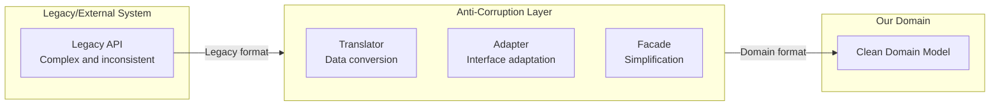

```java
// Legacy system response (unchangeable)
public class LegacyOrderResponse {
    private String ord_no;           // Different naming
    private int sts_cd;              // Magic numbers (0=pending, 1=confirmed, 9=cancelled)
    private String cust_nm;          // Abbreviations
    private long ord_amt;            // Amount as number
    private String dlv_addr1;        // Address1
    private String dlv_addr2;        // Address2
    private String rcv_nm;           // Recipient
    private String rcv_tel;          // Phone
}

// Anti-Corruption Layer: Translator
@Component
public class LegacyOrderTranslator {

    public Order translate(LegacyOrderResponse legacy) {
        return Order.reconstitute(
            OrderId.of(legacy.getOrd_no()),
            translateStatus(legacy.getSts_cd()),
            translateCustomer(legacy),
            translateShippingAddress(legacy),
            Money.won(legacy.getOrd_amt())
        );
    }

    private OrderStatus translateStatus(int statusCode) {
        return switch (statusCode) {
            case 0 -> OrderStatus.PENDING;
            case 1 -> OrderStatus.CONFIRMED;
            case 2 -> OrderStatus.SHIPPED;
            case 3 -> OrderStatus.DELIVERED;
            case 9 -> OrderStatus.CANCELLED;
            default -> throw new UnknownLegacyStatusException(statusCode);
        };
    }

    private ShippingAddress translateShippingAddress(LegacyOrderResponse legacy) {
        return new ShippingAddress(
            extractZipCode(legacy.getDlv_addr1()),
            extractCity(legacy.getDlv_addr1()),
            legacy.getDlv_addr1(),
            legacy.getDlv_addr2(),
            legacy.getRcv_nm(),
            formatPhoneNumber(legacy.getRcv_tel())
        );
    }
}

// Adapter: Repository implementation
@Repository
public class LegacyOrderAdapter implements OrderReader {
    private final LegacyOrderClient legacyClient;
    private final LegacyOrderTranslator translator;

    @Override
    public Optional<Order> findById(OrderId id) {
        try {
            LegacyOrderResponse response = legacyClient.getOrder(id.getValue());
            return Optional.of(translator.translate(response));
        } catch (LegacyNotFoundException e) {
            return Optional.empty();
        }
    }
}
```

**Pros:** Protects internal model, isolated from legacy changes
**Cons:** Additional complexity, performance overhead

---

#### 6. Open Host Service + Published Language

Integration through **standardized API and data formats**.

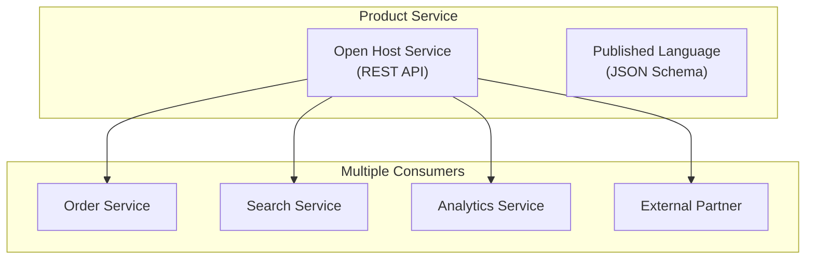

```json
// Published Language: Standardized event schema
{
  "$schema": "https://json-schema.org/draft/2020-12/schema",
  "title": "OrderConfirmedEvent",
  "type": "object",
  "properties": {
    "eventId": { "type": "string", "format": "uuid" },
    "eventType": { "const": "ORDER_CONFIRMED" },
    "occurredAt": { "type": "string", "format": "date-time" },
    "payload": {
      "type": "object",
      "properties": {
        "orderId": { "type": "string" },
        "customerId": { "type": "string" },
        "totalAmount": {
          "type": "object",
          "properties": {
            "amount": { "type": "number" },
            "currency": { "type": "string" }
          }
        },
        "orderLines": {
          "type": "array",
          "items": {
            "type": "object",
            "properties": {
              "productId": { "type": "string" },
              "quantity": { "type": "integer" }
            }
          }
        }
      }
    }
  }
}
```

---

#### 7. Separate Ways

**Implement separately** without integration.

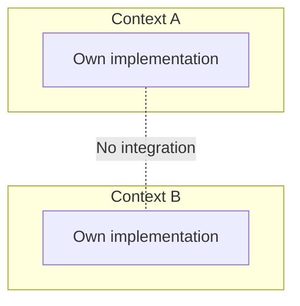

**Suitable for:**
- Integration cost > Duplication cost
- Simple functionality
- Different requirements

### Context Map Example: E-commerce

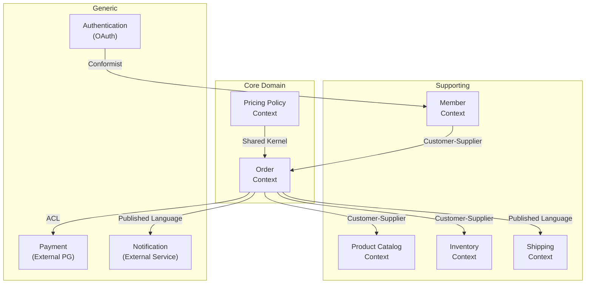

| Relationship | Description |
|--------------|-------------|
| **ORDER → CATALOG** | Query product info when creating order |
| **ORDER → INV** | Check/deduct inventory when confirming order |
| **ORDER → PAY** | External PG integration, protected by ACL |
| **ORDER → SHIP, NOTI** | Loose coupling via events |
| **PRICE ↔ ORDER** | Share pricing calculation logic (Shared Kernel) |

## EventStorming for Strategic Design

### What is EventStorming?

A workshop technique where domain experts and developers **come together** to explore the domain.

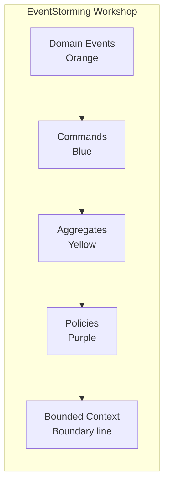

### EventStorming Results

```
┌─────────────────────────────────────────────────────────────────┐
│                          Order Context                          │
│  ┌──────────┐    ┌──────────┐    ┌──────────┐    ┌──────────┐  │
│  │ Create   │ => │ Order    │ => │ Confirm  │ => │ Order    │  │
│  │ Order    │    │          │    │ Order    │    │          │  │
│  │ Requested│    │(Aggregate│    │ Requested│    │(Aggregate│  │
│  │ (Command)│    │          │    │(Command) │    │          │  │
│  └──────────┘    └──────────┘    └──────────┘    └──────────┘  │
│        │              │               │               │         │
│        ▼              ▼               ▼               ▼         │
│  ┌──────────┐    ┌──────────┐    ┌──────────┐    ┌──────────┐  │
│  │ Order    │    │ Check    │    │ Order    │    │ Request  │  │
│  │ Created  │    │ Inventory│    │ Confirmed│    │ Payment  │  │
│  │ (Event)  │    │ (Policy) │    │ (Event)  │    │ (Policy) │  │
│  └──────────┘    └──────────┘    └──────────┘    └──────────┘  │
└─────────────────────────────────────────────────────────────────┘
                              │
                              ▼
┌─────────────────────────────────────────────────────────────────┐
│                        Inventory Context                        │
│  ┌──────────┐    ┌──────────┐    ┌──────────┐                  │
│  │ Deduct   │ => │ Stock    │ => │ Inventory│                  │
│  │ Inventory│    │          │    │ Deducted │                  │
│  │ Requested│    │(Aggregate│    │ (Event)  │                  │
│  │ (Command)│    │          │    │          │                  │
│  └──────────┘    └──────────┘    └──────────┘                  │
└─────────────────────────────────────────────────────────────────┘
```

## Next Steps

- [Tactical Design](../tactical-design/) - Entity, Value Object, Aggregate patterns
- [Architecture](../architecture/) - Hexagonal, Clean Architecture
