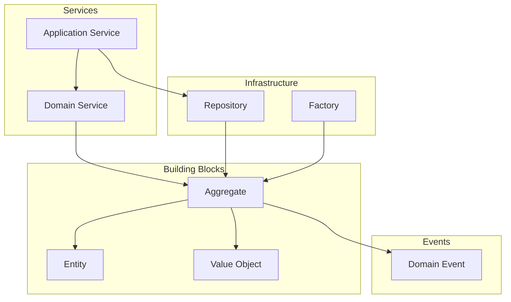
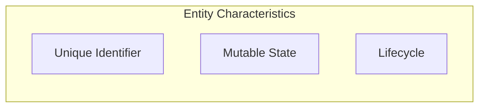
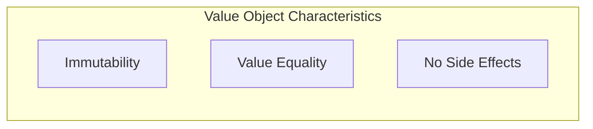
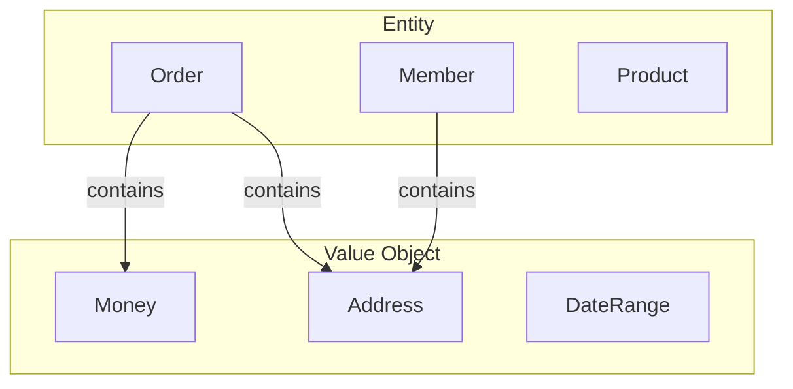
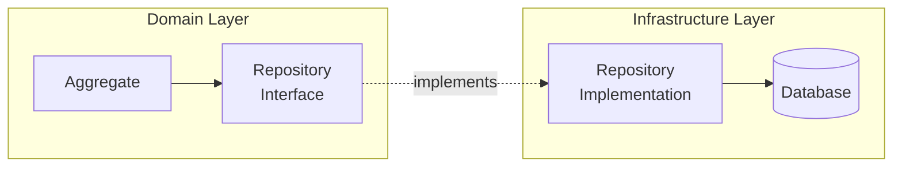
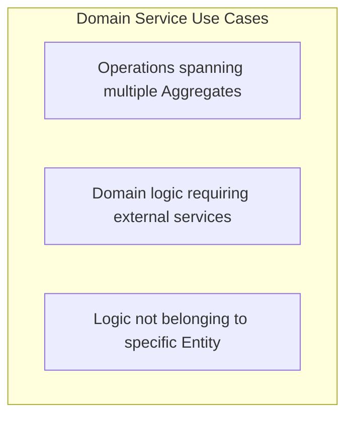
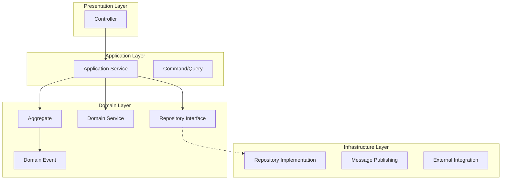
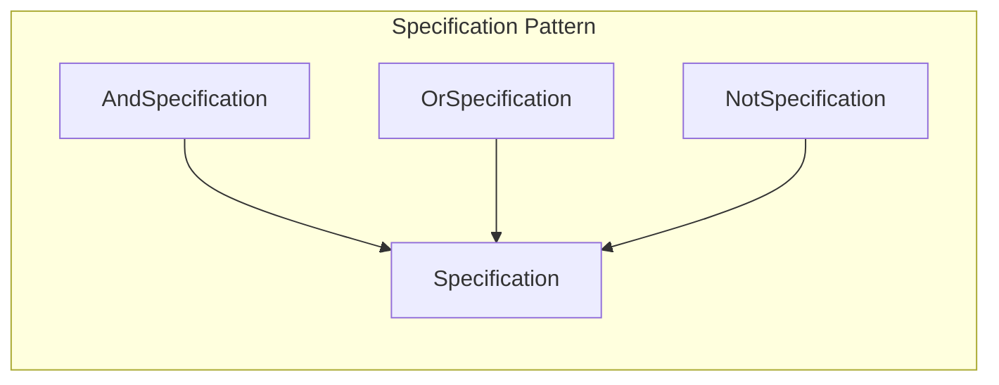
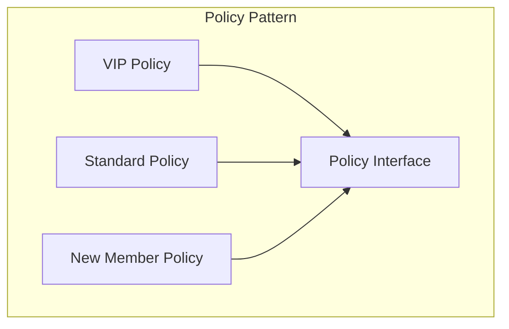
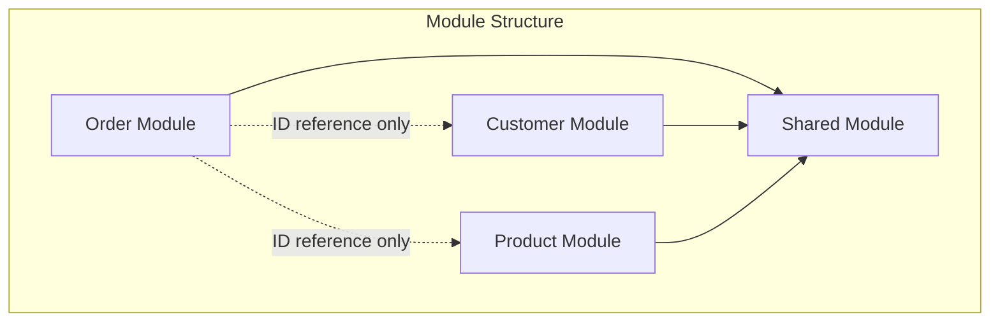

# Tactical Design

Concrete patterns for implementing domain models.

## Tactical Design Elements Overview



## Entity

### Definition

A domain object distinguished by its **identity**.



### Characteristics

| Property | Description | Example |
|----------|-------------|---------|
| **Identity** | Distinguished by unique identifier | OrderId, MemberId |
| **Mutability** | State can change | Order status: PENDING → CONFIRMED |
| **Lifecycle** | Has creation, modification, deletion cycle | Member signup → activity → withdrawal |

### Implementation Example

```java
public class Order {
    private final OrderId id;  // Identity - immutable
    private OrderStatus status;  // State - mutable
    private final CustomerId customerId;
    private ShippingAddress shippingAddress;  // Can be changed
    private final List<OrderLine> orderLines;
    private final LocalDateTime createdAt;

    // Identity-based equality
    @Override
    public boolean equals(Object o) {
        if (this == o) return true;
        if (!(o instanceof Order order)) return false;
        return id.equals(order.id);  // Compare by ID only
    }

    @Override
    public int hashCode() {
        return Objects.hash(id);
    }

    // Business behavior
    public void confirm() {
        validateConfirmable();
        this.status = OrderStatus.CONFIRMED;
        registerEvent(new OrderConfirmedEvent(this.id));
    }

    public void changeShippingAddress(ShippingAddress newAddress) {
        validateAddressChangeable();
        this.shippingAddress = newAddress;
        registerEvent(new ShippingAddressChangedEvent(this.id, newAddress));
    }

    private void validateConfirmable() {
        if (this.status != OrderStatus.PENDING) {
            throw new IllegalOrderStateException(
                "Order can only be confirmed when PENDING. Current: " + this.status
            );
        }
    }
}
```

### Identifier Design

```java
// ✅ Domain Identifier (recommended)
public record OrderId(String value) {
    public OrderId {
        Objects.requireNonNull(value, "OrderId cannot be null");
        if (value.isBlank()) {
            throw new IllegalArgumentException("OrderId cannot be empty");
        }
    }

    public static OrderId generate() {
        return new OrderId("ORD-" + UUID.randomUUID().toString().substring(0, 8));
    }

    public static OrderId of(String value) {
        return new OrderId(value);
    }
}

// Usage
Order order = new Order(OrderId.generate(), customerId, orderLines);
```

## Value Object

### Definition

An immutable object whose equality is determined by its **attribute values**.



### Characteristics

| Property | Description | Example |
|----------|-------------|---------|
| **Immutability** | Cannot change after creation | Money(1000, USD) |
| **Value Equality** | Equal if all attributes are the same | $1000 == $1000 |
| **Self-Contained** | Self-validates on creation | Amount cannot be negative |

### Implementation Example

```java
// Money Value Object
public record Money(BigDecimal amount, Currency currency) {

    // Validation on creation
    public Money {
        Objects.requireNonNull(amount, "Amount is required");
        Objects.requireNonNull(currency, "Currency is required");
        if (amount.compareTo(BigDecimal.ZERO) < 0) {
            throw new IllegalArgumentException("Amount must be 0 or greater");
        }
    }

    // Factory method
    public static Money usd(long amount) {
        return new Money(BigDecimal.valueOf(amount), Currency.USD);
    }

    public static Money ZERO = new Money(BigDecimal.ZERO, Currency.USD);

    // Immutable operations - return new object
    public Money add(Money other) {
        validateSameCurrency(other);
        return new Money(this.amount.add(other.amount), this.currency);
    }

    public Money multiply(int quantity) {
        return new Money(this.amount.multiply(BigDecimal.valueOf(quantity)), this.currency);
    }

    public boolean isGreaterThan(Money other) {
        validateSameCurrency(other);
        return this.amount.compareTo(other.amount) > 0;
    }

    private void validateSameCurrency(Money other) {
        if (!this.currency.equals(other.currency)) {
            throw new CurrencyMismatchException(this.currency, other.currency);
        }
    }
}
```

```java
// Address Value Object
public record Address(
    String zipCode,
    String city,
    String street,
    String detail
) {
    public Address {
        Objects.requireNonNull(zipCode, "Zip code is required");
        Objects.requireNonNull(city, "City is required");
        Objects.requireNonNull(street, "Street is required");

        if (!zipCode.matches("\\d{5}")) {
            throw new InvalidAddressException("Zip code must be 5 digits");
        }
    }

    public String fullAddress() {
        return String.format("(%s) %s %s %s", zipCode, city, street, detail);
    }
}
```

### Entity vs Value Object



| Aspect | Entity | Value Object |
|--------|--------|--------------|
| **Equality** | Compare by ID | Compare by all attributes |
| **Mutability** | Mutable | Immutable |
| **Lifecycle** | Independent | Dependent on Entity |
| **Example** | Order, Member | Money, Address |

### What Should Be Value Objects

```java
// ❌ Primitive Obsession
public class Order {
    private String orderId;        // Just String
    private int totalAmount;       // Just int
    private String customerEmail;  // Just String
}

// ✅ Using Value Objects
public class Order {
    private OrderId id;            // Domain identifier
    private Money totalAmount;     // Money VO
    private Email customerEmail;   // Email VO
}
```

## Repository

### Definition

An interface that **abstracts persistence** for Aggregates.



### Interface Design

```java
// Located in Domain Layer
public interface OrderRepository {

    // Save
    Order save(Order order);

    // Find
    Optional<Order> findById(OrderId id);

    // Domain-specific queries
    List<Order> findByCustomerId(CustomerId customerId);

    List<Order> findPendingOrdersOlderThan(LocalDateTime dateTime);

    // Delete (soft delete recommended)
    void delete(Order order);

    // Existence check
    boolean existsById(OrderId id);
}
```

### Implementation

```java
// Located in Infrastructure Layer
@Repository
public class JpaOrderRepository implements OrderRepository {

    private final OrderJpaRepository jpaRepository;
    private final OrderMapper mapper;

    @Override
    public Order save(Order order) {
        OrderEntity entity = mapper.toEntity(order);
        OrderEntity saved = jpaRepository.save(entity);
        return mapper.toDomain(saved);
    }

    @Override
    public Optional<Order> findById(OrderId id) {
        return jpaRepository.findById(id.getValue())
            .map(mapper::toDomain);
    }

    @Override
    public List<Order> findPendingOrdersOlderThan(LocalDateTime dateTime) {
        return jpaRepository.findByStatusAndCreatedAtBefore(
                OrderStatus.PENDING, dateTime)
            .stream()
            .map(mapper::toDomain)
            .toList();
    }
}
```

### Repository Design Principles

1. **Only Aggregate Roots have Repositories**

```java
// ✅ Only Aggregate Root (Order) has Repository
interface OrderRepository {
    Order save(Order order);
}

// ❌ Internal Aggregate objects don't have Repository
// interface OrderLineRepository { ... }  // Wrong design
```

2. **Acts like a Collection**

```java
// Like adding to a collection
orderRepository.save(order);

// Like finding in a collection
Order order = orderRepository.findById(orderId)
    .orElseThrow(() -> new OrderNotFoundException(orderId));
```

## Domain Service

### When to Use?

Contains **domain logic** that doesn't belong to a specific Entity or Value Object.



### Example 1: Discount Calculation

```java
// When discount policy considers multiple factors
@DomainService
public class DiscountCalculator {

    private final MemberGradeReader memberGradeReader;
    private final PromotionReader promotionReader;

    public Money calculateDiscount(Order order, CustomerId customerId) {
        MemberGrade grade = memberGradeReader.getGrade(customerId);
        List<Promotion> promotions = promotionReader.getActivePromotions();

        Money gradeDiscount = calculateGradeDiscount(order, grade);
        Money promotionDiscount = calculatePromotionDiscount(order, promotions);

        return gradeDiscount.add(promotionDiscount);
    }

    private Money calculateGradeDiscount(Order order, MemberGrade grade) {
        return order.getTotalAmount().multiply(grade.getDiscountRate());
    }

    private Money calculatePromotionDiscount(Order order, List<Promotion> promotions) {
        return promotions.stream()
            .filter(p -> p.isApplicableTo(order))
            .map(p -> p.calculateDiscount(order))
            .reduce(Money.ZERO, Money::add);
    }
}
```

### Example 2: Stock Validation

```java
@DomainService
public class StockValidator {

    private final StockReader stockReader;

    public void validateStock(Order order) {
        for (OrderLine line : order.getOrderLines()) {
            Stock stock = stockReader.getStock(line.getProductId());

            if (!stock.isAvailable(line.getQuantity())) {
                throw new InsufficientStockException(
                    line.getProductId(),
                    line.getQuantity(),
                    stock.getAvailableQuantity()
                );
            }
        }
    }
}
```

### Domain Service vs Application Service

```java
// Domain Service: Domain logic
@DomainService
public class OrderValidator {
    public void validate(Order order) {
        // Pure domain rule validation
    }
}

// Application Service: Use case orchestration
@Service
@Transactional
public class OrderApplicationService {

    private final OrderRepository orderRepository;
    private final OrderValidator orderValidator;  // Uses Domain Service
    private final EventPublisher eventPublisher;

    public OrderId createOrder(CreateOrderCommand command) {
        // 1. Create domain object
        Order order = Order.create(command.getCustomerId(), command.getOrderLines());

        // 2. Validate with Domain Service
        orderValidator.validate(order);

        // 3. Save
        Order saved = orderRepository.save(order);

        // 4. Publish events
        eventPublisher.publish(saved.getDomainEvents());

        return saved.getId();
    }
}
```

| Aspect | Domain Service | Application Service |
|--------|---------------|---------------------|
| **Location** | Domain Layer | Application Layer |
| **Role** | Domain logic | Use case orchestration |
| **Transaction** | Unaware | Manages |
| **Dependencies** | Domain objects only | Domain + Infrastructure |

## Factory

### When to Use?

**Encapsulates creation logic** when Aggregate creation is complex.

```java
// Simple case: static factory method
public class Order {
    public static Order create(CustomerId customerId, List<OrderLine> lines) {
        return new Order(OrderId.generate(), customerId, lines);
    }
}

// Complex case: Factory class
@Component
public class OrderFactory {

    private final CustomerReader customerReader;
    private final ProductReader productReader;

    public Order create(CreateOrderCommand command) {
        // Validate customer
        Customer customer = customerReader.getCustomer(command.getCustomerId());
        customer.validateCanOrder();

        // Create order lines
        List<OrderLine> orderLines = command.getItems().stream()
            .map(this::createOrderLine)
            .toList();

        // Create order
        return Order.create(
            customer.getId(),
            orderLines,
            customer.getDefaultShippingAddress()
        );
    }

    private OrderLine createOrderLine(OrderItemRequest request) {
        Product product = productReader.getProduct(request.getProductId());
        return OrderLine.create(
            product.getId(),
            product.getName(),
            product.getPrice(),
            request.getQuantity()
        );
    }
}
```

## Layer Structure



## Specification Pattern

### Definition

A pattern that **encapsulates business rules as objects** for reusability.



### Basic Implementation

```java
// Specification interface
public interface Specification<T> {
    boolean isSatisfiedBy(T candidate);

    default Specification<T> and(Specification<T> other) {
        return new AndSpecification<>(this, other);
    }

    default Specification<T> or(Specification<T> other) {
        return new OrSpecification<>(this, other);
    }

    default Specification<T> not() {
        return new NotSpecification<>(this);
    }
}

// Composite Specifications
public class AndSpecification<T> implements Specification<T> {
    private final Specification<T> first;
    private final Specification<T> second;

    public AndSpecification(Specification<T> first, Specification<T> second) {
        this.first = first;
        this.second = second;
    }

    @Override
    public boolean isSatisfiedBy(T candidate) {
        return first.isSatisfiedBy(candidate) && second.isSatisfiedBy(candidate);
    }
}

public class OrSpecification<T> implements Specification<T> {
    private final Specification<T> first;
    private final Specification<T> second;

    public OrSpecification(Specification<T> first, Specification<T> second) {
        this.first = first;
        this.second = second;
    }

    @Override
    public boolean isSatisfiedBy(T candidate) {
        return first.isSatisfiedBy(candidate) || second.isSatisfiedBy(candidate);
    }
}

public class NotSpecification<T> implements Specification<T> {
    private final Specification<T> spec;

    public NotSpecification(Specification<T> spec) {
        this.spec = spec;
    }

    @Override
    public boolean isSatisfiedBy(T candidate) {
        return !spec.isSatisfiedBy(candidate);
    }
}
```

### Order Domain Example

```java
// Concrete Order Specifications
public class OrderSpecifications {

    // Minimum amount validation
    public static Specification<Order> hasMinimumAmount(Money minimum) {
        return order -> order.getTotalAmount().isGreaterThanOrEqual(minimum);
    }

    // Status validation
    public static Specification<Order> hasStatus(OrderStatus status) {
        return order -> order.getStatus() == status;
    }

    // Can be confirmed
    public static Specification<Order> isConfirmable() {
        return hasStatus(OrderStatus.PENDING)
            .and(hasMinimumAmount(Money.usd(100)));
    }

    // Can be cancelled
    public static Specification<Order> isCancellable() {
        return hasStatus(OrderStatus.PENDING)
            .or(hasStatus(OrderStatus.CONFIRMED));
    }

    // Can be shipped
    public static Specification<Order> isShippable() {
        return hasStatus(OrderStatus.CONFIRMED)
            .and(order -> order.hasValidShippingAddress())
            .and(order -> !order.getOrderLines().isEmpty());
    }
}

// Usage
public class Order {

    public void confirm() {
        if (!OrderSpecifications.isConfirmable().isSatisfiedBy(this)) {
            throw new OrderCannotBeConfirmedException(this.id);
        }
        this.status = OrderStatus.CONFIRMED;
        registerEvent(new OrderConfirmedEvent(this.id));
    }

    public void cancel(CancellationReason reason) {
        if (!OrderSpecifications.isCancellable().isSatisfiedBy(this)) {
            throw new OrderCannotBeCancelledException(this.id, this.status);
        }
        this.status = OrderStatus.CANCELLED;
        this.cancellationReason = reason;
        registerEvent(new OrderCancelledEvent(this.id, reason));
    }
}
```

### Using with Repository

```java
// JPA Specification (Spring Data JPA)
public class OrderJpaSpecifications {

    public static org.springframework.data.jpa.domain.Specification<OrderEntity>
            hasStatus(OrderStatus status) {
        return (root, query, cb) ->
            cb.equal(root.get("status"), status);
    }

    public static org.springframework.data.jpa.domain.Specification<OrderEntity>
            hasMinimumAmount(Money minimum) {
        return (root, query, cb) ->
            cb.greaterThanOrEqualTo(root.get("totalAmount"), minimum.amount());
    }

    public static org.springframework.data.jpa.domain.Specification<OrderEntity>
            createdBetween(LocalDateTime start, LocalDateTime end) {
        return (root, query, cb) ->
            cb.between(root.get("createdAt"), start, end);
    }

    public static org.springframework.data.jpa.domain.Specification<OrderEntity>
            belongsToCustomer(CustomerId customerId) {
        return (root, query, cb) ->
            cb.equal(root.get("customerId"), customerId.getValue());
    }
}

// Use in Repository
@Repository
public class JpaOrderRepository implements OrderRepository {

    private final OrderJpaRepository jpaRepository;

    @Override
    public List<Order> findConfirmableOrders() {
        var spec = OrderJpaSpecifications.hasStatus(OrderStatus.PENDING)
            .and(OrderJpaSpecifications.hasMinimumAmount(Money.usd(100)));

        return jpaRepository.findAll(spec).stream()
            .map(mapper::toDomain)
            .toList();
    }
}
```

### Benefits of Specification Pattern

| Benefit | Description |
|---------|-------------|
| **Reusability** | Reuse business rules in multiple places |
| **Readability** | Express complex conditions clearly |
| **Testability** | Test each rule independently |
| **Composability** | Build complex rules with and, or, not |

---

## Policy Pattern

### Definition

A pattern that **separates business policies into independent objects** making them replaceable.



### Discount Policy Example

```java
// Discount policy interface
public interface DiscountPolicy {
    Money calculateDiscount(Order order, Customer customer);
    boolean isApplicable(Order order, Customer customer);
}

// VIP discount policy
public class VipDiscountPolicy implements DiscountPolicy {
    private static final BigDecimal DISCOUNT_RATE = new BigDecimal("0.10");

    @Override
    public boolean isApplicable(Order order, Customer customer) {
        return customer.getGrade() == CustomerGrade.VIP;
    }

    @Override
    public Money calculateDiscount(Order order, Customer customer) {
        return order.getTotalAmount().multiply(DISCOUNT_RATE);
    }
}

// First order discount policy
public class FirstOrderDiscountPolicy implements DiscountPolicy {
    private static final Money DISCOUNT_AMOUNT = Money.usd(50);

    @Override
    public boolean isApplicable(Order order, Customer customer) {
        return customer.getOrderCount() == 0;
    }

    @Override
    public Money calculateDiscount(Order order, Customer customer) {
        return DISCOUNT_AMOUNT;
    }
}

// Bulk order discount policy
public class BulkOrderDiscountPolicy implements DiscountPolicy {
    private static final int MINIMUM_QUANTITY = 10;
    private static final BigDecimal DISCOUNT_RATE = new BigDecimal("0.05");

    @Override
    public boolean isApplicable(Order order, Customer customer) {
        return order.getTotalQuantity() >= MINIMUM_QUANTITY;
    }

    @Override
    public Money calculateDiscount(Order order, Customer customer) {
        return order.getTotalAmount().multiply(DISCOUNT_RATE);
    }
}

// Policy composition
@DomainService
public class DiscountCalculator {

    private final List<DiscountPolicy> policies;

    public DiscountCalculator(List<DiscountPolicy> policies) {
        this.policies = policies;
    }

    public Money calculateTotalDiscount(Order order, Customer customer) {
        return policies.stream()
            .filter(policy -> policy.isApplicable(order, customer))
            .map(policy -> policy.calculateDiscount(order, customer))
            .reduce(Money.ZERO, Money::add);
    }
}
```

### Shipping Fee Policy Example

```java
// Shipping fee policy interface
public interface ShippingPolicy {
    Money calculateShippingFee(Order order, ShippingAddress address);
}

// Standard shipping policy
public class StandardShippingPolicy implements ShippingPolicy {
    private static final Money BASE_FEE = Money.usd(5);
    private static final Money FREE_SHIPPING_THRESHOLD = Money.usd(50);

    @Override
    public Money calculateShippingFee(Order order, ShippingAddress address) {
        if (order.getTotalAmount().isGreaterThanOrEqual(FREE_SHIPPING_THRESHOLD)) {
            return Money.ZERO;
        }
        return BASE_FEE;
    }
}

// Remote area shipping policy
public class RemoteAreaShippingPolicy implements ShippingPolicy {
    private static final Money REMOTE_SURCHARGE = Money.usd(10);
    private final ShippingPolicy delegate;
    private final RemoteAreaChecker remoteAreaChecker;

    @Override
    public Money calculateShippingFee(Order order, ShippingAddress address) {
        Money baseFee = delegate.calculateShippingFee(order, address);

        if (remoteAreaChecker.isRemoteArea(address)) {
            return baseFee.add(REMOTE_SURCHARGE);
        }
        return baseFee;
    }
}
```

---

## Module Organization

### Package Structure

As domain complexity grows, organize with **modules**.

```
src/main/java/com/example/
├── order/                          # Order Module
│   ├── domain/
│   │   ├── Order.java
│   │   ├── OrderLine.java
│   │   ├── OrderId.java
│   │   ├── OrderStatus.java
│   │   ├── OrderRepository.java   # Repository Interface
│   │   ├── OrderFactory.java
│   │   └── event/
│   │       ├── OrderCreatedEvent.java
│   │       └── OrderConfirmedEvent.java
│   ├── application/
│   │   ├── OrderCommandService.java
│   │   ├── OrderQueryService.java
│   │   └── dto/
│   │       ├── CreateOrderCommand.java
│   │       └── OrderResponse.java
│   └── infrastructure/
│       ├── persistence/
│       │   ├── JpaOrderRepository.java
│       │   ├── OrderEntity.java
│       │   └── OrderMapper.java
│       └── event/
│           └── KafkaOrderEventPublisher.java
│
├── customer/                       # Customer Module
│   ├── domain/
│   │   ├── Customer.java
│   │   ├── CustomerId.java
│   │   └── CustomerRepository.java
│   ├── application/
│   │   └── CustomerService.java
│   └── infrastructure/
│       └── persistence/
│           └── JpaCustomerRepository.java
│
├── product/                        # Product Module
│   ├── domain/
│   ├── application/
│   └── infrastructure/
│
└── shared/                         # Shared Module
    ├── domain/
    │   ├── Money.java
    │   ├── Address.java
    │   └── AggregateRoot.java
    └── infrastructure/
        └── event/
            └── DomainEventPublisher.java
```

### Inter-Module Dependencies



### Inter-Module Communication

```java
// ❌ Direct dependency (avoid)
public class Order {
    private Customer customer;  // Direct reference to another module's Aggregate
}

// ✅ Reference by ID
public class Order {
    private CustomerId customerId;  // ID reference only
}

// Query in Application Service when needed
@Service
public class OrderApplicationService {

    private final OrderRepository orderRepository;
    private final CustomerReader customerReader;  // Port/Interface

    public OrderDetailResponse getOrderDetail(OrderId orderId) {
        Order order = orderRepository.findById(orderId).orElseThrow();
        Customer customer = customerReader.findById(order.getCustomerId());

        return OrderDetailResponse.of(order, customer);
    }
}
```

---

## Builder Pattern (Complex Creation)

### Aggregate Builder

Use Builder pattern for complex Aggregate creation.

```java
public class Order {
    private final OrderId id;
    private final CustomerId customerId;
    private final List<OrderLine> orderLines;
    private final ShippingAddress shippingAddress;
    private final Money totalAmount;
    private OrderStatus status;

    private Order(Builder builder) {
        this.id = builder.id;
        this.customerId = builder.customerId;
        this.orderLines = List.copyOf(builder.orderLines);
        this.shippingAddress = builder.shippingAddress;
        this.totalAmount = calculateTotalAmount(builder.orderLines);
        this.status = OrderStatus.PENDING;

        validate();
    }

    private void validate() {
        if (orderLines.isEmpty()) {
            throw new EmptyOrderException("Order requires at least 1 item");
        }
    }

    public static Builder builder() {
        return new Builder();
    }

    public static class Builder {
        private OrderId id;
        private CustomerId customerId;
        private List<OrderLine> orderLines = new ArrayList<>();
        private ShippingAddress shippingAddress;

        public Builder id(OrderId id) {
            this.id = id;
            return this;
        }

        public Builder customerId(CustomerId customerId) {
            this.customerId = customerId;
            return this;
        }

        public Builder addOrderLine(ProductId productId, String productName,
                                    Money price, int quantity) {
            this.orderLines.add(OrderLine.create(productId, productName, price, quantity));
            return this;
        }

        public Builder shippingAddress(ShippingAddress address) {
            this.shippingAddress = address;
            return this;
        }

        public Order build() {
            if (id == null) {
                id = OrderId.generate();
            }
            return new Order(this);
        }
    }
}

// Usage
Order order = Order.builder()
    .customerId(CustomerId.of("CUST-001"))
    .addOrderLine(productId1, "Laptop", Money.usd(1200), 1)
    .addOrderLine(productId2, "Mouse", Money.usd(50), 2)
    .shippingAddress(new ShippingAddress("12345", "New York", "5th Ave", "Apt 101"))
    .build();
```

---

## Null Object Pattern

### Definition

Uses a **special 'null' object** to avoid null checks.

```java
// Null Object pattern applied
public interface DiscountPolicy {
    Money calculateDiscount(Order order);

    // Null Object
    DiscountPolicy NONE = order -> Money.ZERO;
}

// Usage
public class Order {
    private final DiscountPolicy discountPolicy;

    public Order(CustomerId customerId, DiscountPolicy discountPolicy) {
        this.customerId = customerId;
        // Use NONE instead of null
        this.discountPolicy = discountPolicy != null ? discountPolicy : DiscountPolicy.NONE;
    }

    public Money calculateFinalAmount() {
        // No null check needed
        Money discount = discountPolicy.calculateDiscount(this);
        return totalAmount.subtract(discount);
    }
}
```

### Comparison with Optional

```java
// Using Optional
public Optional<Discount> getDiscount() {
    return Optional.ofNullable(discount);
}

// Using Null Object (recommended in domain logic)
public Discount getDiscount() {
    return discount != null ? discount : Discount.NONE;
}
```

---

## Tactical Design Checklist

### Entity Checklist

```
[ ] Has unique identifier?
[ ] Compares equality by identifier?
[ ] Business behaviors expressed as methods?
[ ] Cannot enter invalid state?
[ ] Uses behavior methods instead of setters?
```

### Value Object Checklist

```
[ ] Is immutable?
[ ] Compares equality by all attributes?
[ ] Self-validates?
[ ] Has no side effects? (returns new object)
[ ] Expresses meaningful domain concept?
```

### Repository Checklist

```
[ ] Only Aggregate Roots have Repositories?
[ ] Interface is in Domain Layer?
[ ] Acts like a collection?
[ ] Has domain-specific methods?
```

### Domain Service Checklist

```
[ ] Logic doesn't belong to specific Entity?
[ ] Spans multiple Aggregates?
[ ] Is stateless?
[ ] Depends only on Domain Layer?
```

## Next Steps

- [Aggregate Deep Dive](../aggregate/) - Aggregate design principles and transaction boundaries
- [Domain Events](../domain-events/) - Event-driven design
