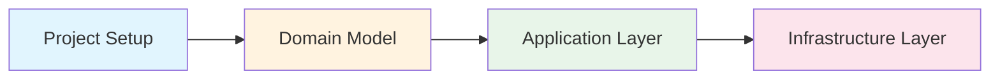

Implementing an order domain with DDD patterns using Spring Boot.

## Learning Path

## Contents

1. [Project Setup](setup/) - Project structure and dependencies
2. [Order Domain](order-domain/) - Aggregate, Entity, Value Object implementation
3. [Application Layer](application-layer/) - Use Case and service implementation
