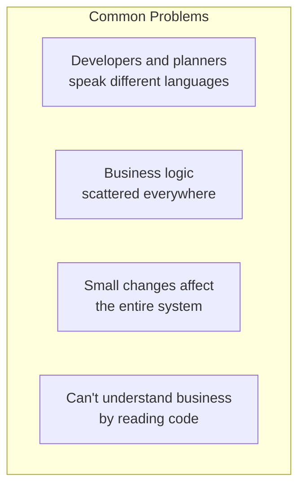
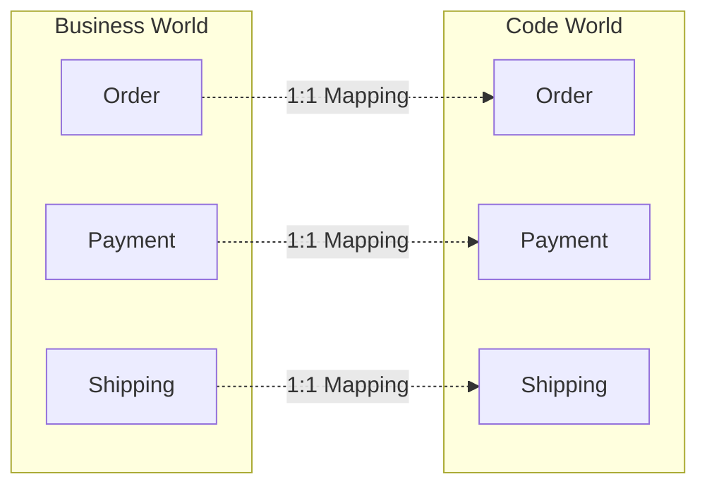
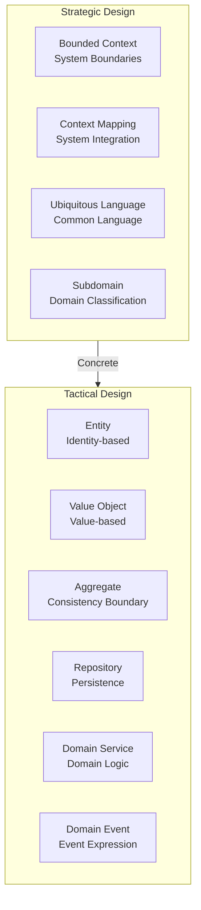
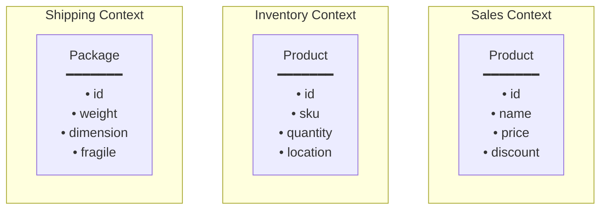
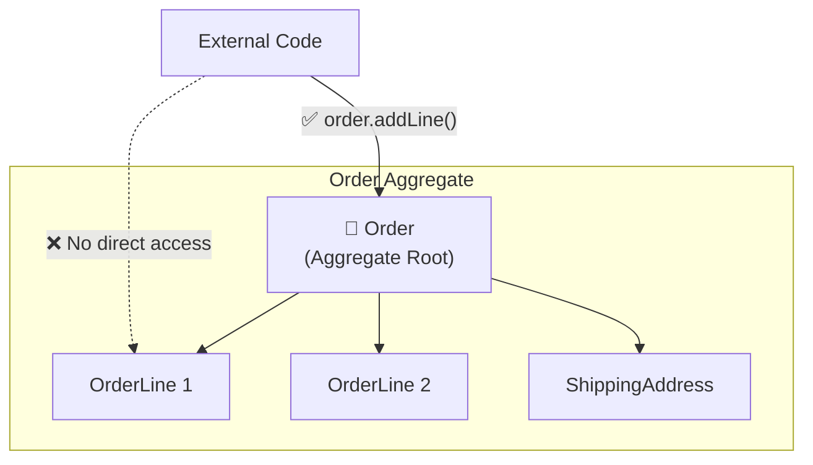
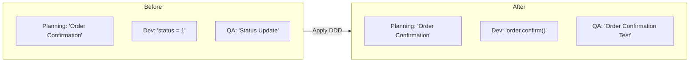
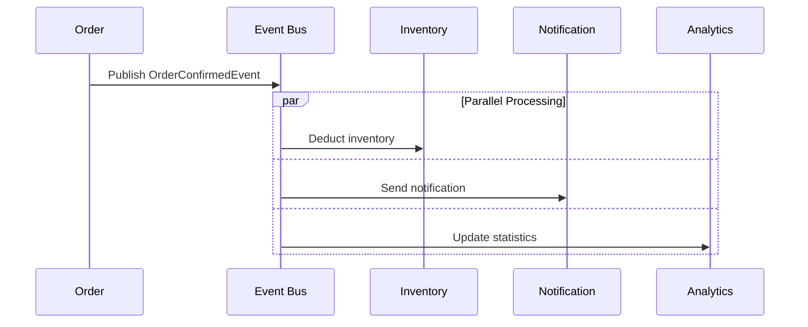
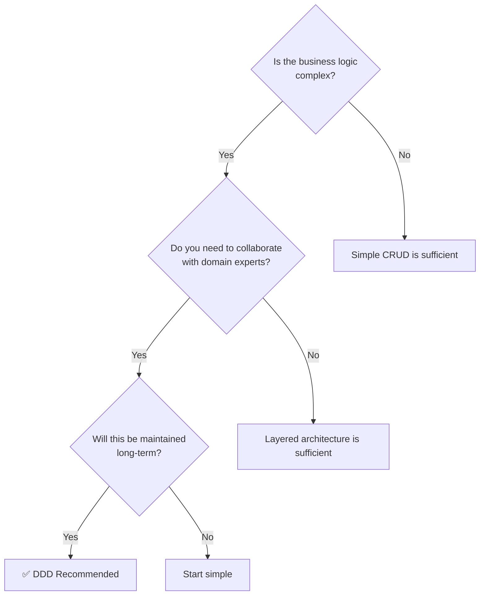

# Understanding DDD in 5 Minutes

A quick overview of DDD's core concepts.

## The Problem DDD Solves

### Common Problems in Real Projects



**Real conversation example:**

```
Planner: "When a customer cancels an order, refund their points"
Developer: "Oh, so I change the status to 9 in the order table,
           then INSERT into the point table with that user_id?"
Planner: "...What? What does status 9 mean?"
```

**This is where DDD comes in** — it bridges this communication gap.

## Core Idea

DDD can be summarized in one sentence:

> **"Reflect the business domain directly in your code"**



## Before vs After: Real Code Comparison

### Scenario: Order Confirmation

**Business Rules:**
- Only pending orders can be confirmed
- Confirmation deducts inventory
- Confirmation sends notification to customer

### ❌ Traditional Approach: Data-Centric (Transaction Script)

```java
@Service
public class OrderService {

    public void confirmOrder(Long orderId) {
        // 1. Query data
        OrderEntity order = orderRepository.findById(orderId)
            .orElseThrow(() -> new RuntimeException("Order not found"));

        // 2. Validate status (magic number)
        if (order.getStatus() != 0) {  // What's 0? PENDING?
            throw new RuntimeException("Cannot confirm");
        }

        // 3. Update status
        order.setStatus(1);  // What's 1? CONFIRMED?
        order.setConfirmedAt(LocalDateTime.now());

        // 4. Deduct inventory (should this be here?)
        for (OrderItemEntity item : order.getItems()) {
            ProductEntity product = productRepository.findById(item.getProductId())
                .orElseThrow();
            int newStock = product.getStock() - item.getQuantity();
            if (newStock < 0) {
                throw new RuntimeException("Insufficient stock");
            }
            product.setStock(newStock);
            productRepository.save(product);
        }

        // 5. Notification (should this be here?)
        notificationService.send(order.getUserId(), "Order confirmed");

        orderRepository.save(order);
    }
}
```

**Problems:**

| Problem | Description |
|---------|-------------|
| **Magic numbers** | Unknown meaning of `status = 0, 1` |
| **Anemic model** | Entity is just a data container with getters/setters |
| **Scattered logic** | Validation, inventory, notification mixed in one method |
| **Hard to test** | Unit testing impossible due to DB, external service dependencies |
| **Risk of change** | Status can be directly modified from elsewhere |

### ✅ DDD Approach: Domain-Centric

```java
// Domain Model - Business logic inside the object
public class Order extends AggregateRoot<OrderId> {
    private OrderId id;
    private CustomerId customerId;
    private OrderStatus status;
    private List<OrderLine> orderLines;

    // Business behavior expressed as methods
    public void confirm() {
        // Invariant validation
        if (this.status != OrderStatus.PENDING) {
            throw new OrderCannotBeConfirmedException(
                "Only pending orders can be confirmed. Current status: " + this.status
            );
        }

        // State change
        this.status = OrderStatus.CONFIRMED;
        this.confirmedAt = LocalDateTime.now();

        // Publish domain event (inventory, notification handled by event subscribers)
        registerEvent(new OrderConfirmedEvent(this));
    }

    public Money calculateTotal() {
        return orderLines.stream()
            .map(OrderLine::getAmount)
            .reduce(Money.ZERO, Money::add);
    }
}

// Application Service - Orchestrates flow only
@Service
@Transactional
public class OrderApplicationService {

    public void confirmOrder(OrderId orderId) {
        Order order = orderRepository.findById(orderId)
            .orElseThrow(() -> new OrderNotFoundException(orderId));

        order.confirm();  // Delegate to domain object

        orderRepository.save(order);
        // Events are automatically published by infrastructure
    }
}

// Event Handlers - Separation of concerns
@Component
public class InventoryEventHandler {
    @EventListener
    public void on(OrderConfirmedEvent event) {
        inventoryService.reserveStock(event.getOrderLines());
    }
}

@Component
public class NotificationEventHandler {
    @EventListener
    public void on(OrderConfirmedEvent event) {
        notificationService.sendOrderConfirmation(event.getCustomerId());
    }
}
```

**Improvements:**

| Improvement | Description |
|-------------|-------------|
| **Clear intent** | `order.confirm()` expresses business intent |
| **Rich model** | Order protects its own invariants |
| **Separation of concerns** | Inventory, notification separated into event handlers |
| **Easy to test** | Order can be unit tested |
| **Safe to change** | Status can only be changed through `confirm()` method |

## Two Levels of Design in DDD



| Category | Focus | Question | Key Deliverables |
|----------|-------|----------|-----------------|
| **Strategic Design** | Big picture, boundaries | "How do we divide the system?" | Context Map, Glossary |
| **Tactical Design** | Details, patterns | "How do we model the domain?" | Domain Model, Code |

## Key Terms at a Glance

### 1. Bounded Context

The same term can have different meanings depending on context.



**The same "product" in each Context:**
- **Sales:** "How much to sell it for" (price, discount)
- **Inventory:** "How many do we have" (quantity, location)
- **Shipping:** "How to ship it" (weight, dimensions)

→ Each Context has its own model

### 2. Aggregate

A cluster of objects that maintain transactional consistency.



**Rules:**
- External access must go through the **Aggregate Root** (Order)
- **One transaction = One Aggregate** modification
- The Root is responsible for internal consistency

### 3. Ubiquitous Language

Developers and business experts use **the same terminology**.



| Business Term | Code | Test |
|--------------|------|------|
| **Create** an order | `Order.create()` | `testOrderCreation()` |
| **Confirm** an order | `order.confirm()` | `testOrderConfirmation()` |
| **Cancel** an order | `order.cancel()` | `testOrderCancellation()` |
| **Change** shipping address | `order.changeShippingAddress()` | `testShippingAddressChange()` |

### 4. Domain Event

Represents significant occurrences in the domain.



**Event Characteristics:**
- **Past tense naming:** `OrderConfirmed` (was confirmed)
- **Immutable:** Cannot change after publishing
- **Self-contained:** Contains all information needed for processing

## When Should You Apply DDD?



### When DDD is Suitable

| Situation | Examples |
|-----------|----------|
| **Complex business rules** | Finance, insurance, logistics, healthcare |
| **Frequent requirement changes** | Startups, new business ventures |
| **Domain experts available** | Collaboration with business stakeholders |
| **Long-running systems** | Expected maintenance of 5+ years |

### When DDD is Overkill

| Situation | Alternative |
|-----------|-------------|
| **Simple CRUD** | Spring Data REST |
| **Prototype** | Prioritize fast implementation |
| **Small team** | Simple layered architecture |
| **Short-lived project** | Pragmatic approach |

## Benefits of DDD Adoption

### Real Case Comparison

```
📊 Before Adoption (Project A)
- New feature development: Average 2 weeks
- Bug fixes: Average 3 days (hard to identify side effects)
- New developer onboarding: 1 month
- Business change response: "We need to rewrite everything"

📊 After Adoption (Project B)
- New feature development: Average 1 week
- Bug fixes: Average 1 day (clear impact scope)
- New developer onboarding: 2 weeks (code serves as documentation)
- Business change response: "Just modify this Aggregate"
```

## Next Steps

Now that you understand the core concepts, let's dive deeper:

**Learning Path:** Quick Start → [Strategic Design](../concepts/strategic-design/) → [Tactical Design](../concepts/tactical-design/) → [Architecture](../concepts/architecture/) → Hands-on Examples

- [Strategic Design](../concepts/strategic-design/) - Bounded Context, Context Mapping, Subdomain
- [Tactical Design](../concepts/tactical-design/) - Entity, Value Object, Aggregate
- [Architecture](../concepts/architecture/) - Hexagonal, Clean Architecture
