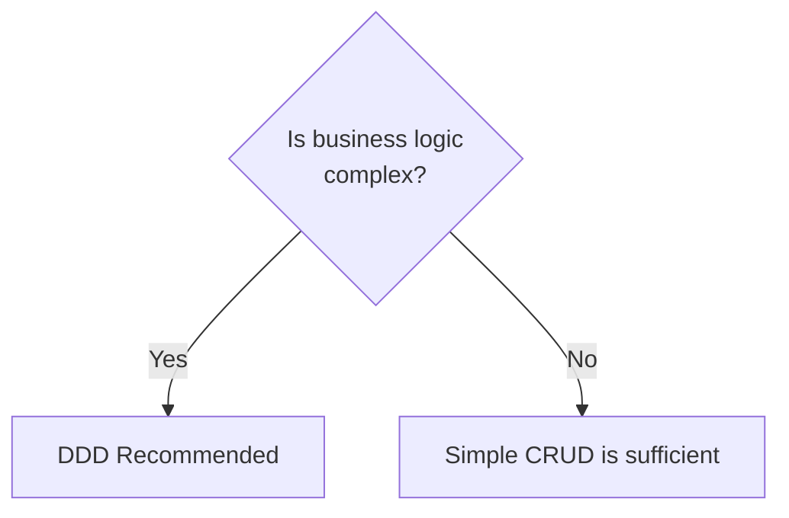
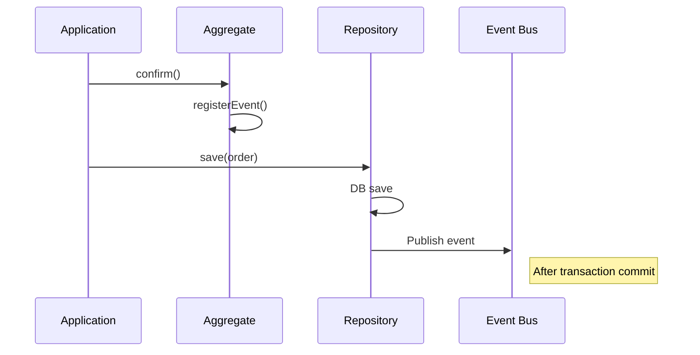
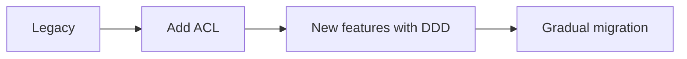
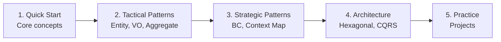

# DDD Frequently Asked Questions (FAQ)

Common questions and answers when applying DDD.

> **TL;DR**
>
> - DDD is a **methodology, not an architecture**, and provides value when there is complex business logic
> - Entity is identified by ID, Value Object equality is determined by attribute values
> - Design Aggregate as the **minimum unit that protects true invariants**
> - **Ubiquitous Language** is the most important element when applying DDD
> - Can be applied gradually to legacy systems through ACL (Anti-Corruption Layer)

## Basic Concepts

### Q: Is DDD an architecture?

**A:** No. DDD is a **methodology for handling complex domains**.

```
What DDD is NOT:
- An architecture pattern (just used alongside Clean, Hexagonal, etc.)
- A technology stack
- A framework

What DDD IS:
- Domain-centric thinking
- Collection of strategic/tactical patterns
- A method for business and technical collaboration
```

---

### Q: Is DDD necessary for all projects?

**A:** No. It's valuable when there is **complex business logic**.



**When DDD is appropriate:**
- Complex business rules (finance, insurance, logistics)
- Need to collaborate with domain experts
- Long-term operation/maintenance expected

**When DDD is overkill:**
- Simple CRUD applications
- Prototypes/MVPs
- Small short-term projects

---

### Q: How do I distinguish between Entity and Value Object?

**A:** Judge by asking **"Does it need to be tracked over time?"**

| Criteria | Entity | Value Object |
|----------|--------|--------------|
| **Equality** | Compared by ID | Compared by all attributes |
| **Lifecycle** | Created->Modified->Deleted | Created->Immutable |
| **Tracking** | Tracking needed | Tracking not needed |
| **Examples** | Order, Member, Product | Money, Address, Period |

```java
// Entity: Same order if Order ID is the same
Order order1 = new Order(OrderId.of("ORD-001"));
Order order2 = new Order(OrderId.of("ORD-001"));
order1.equals(order2);  // true (compared by ID)

// Value Object: Same money if amounts are equal
Money money1 = Money.won(10000);
Money money2 = Money.won(10000);
money1.equals(money2);  // true (compared by value)
```

---

### Q: How do I determine Aggregate size?

**A:** Make it the **minimum unit that protects true invariants**.

```
Wrong approach:
"Order -> Customer -> All customer's orders -> ..." (infinite expansion)

Right approach:
"What objects must change together to maintain this invariant?"
```

**Aggregate Design Principles:**

1. **Keep small** - Minimize transaction scope
2. **Reference by ID** - Reference other Aggregates only by ID
3. **Eventual consistency** - Synchronize between Aggregates via events

```java
// Bad: Aggregate too large
public class Order {
    private Customer customer;        // Entire object included
    private List<Product> products;   // Entire objects included
}

// Good: Appropriate size
public class Order {
    private CustomerId customerId;    // ID only
    private List<OrderLine> lines;    // Actual internal entities
}
```

> **Basic Concepts Key Points**
>
> - DDD is not an architecture, but a **domain-centric methodology**
> - It is appropriate for projects with complex business logic
> - Entity uses **ID for equality**, Value Object uses **attribute values for equality**
> - Design Aggregate as the **minimum unit that protects invariants**

---

## Implementation Related

### Q: Should I create a Repository for each Aggregate?

**A:** Yes, create **one Repository per Aggregate Root**.

```java
// Good: Repository only for Aggregate Root (Order)
public interface OrderRepository {
    Order save(Order order);
    Optional<Order> findById(OrderId id);
}

// Bad: Internal Entities don't have Repositories
// OrderLineRepository - don't create this
```

**Reasons:**
- Aggregate is the consistency boundary
- Internal Entities are accessed only through Root
- Makes unit testing easier

---

### Q: What's the difference between Domain Service and Application Service?

**A:** The difference is **domain logic vs use case orchestration**.

| Aspect | Domain Service | Application Service |
|--------|----------------|---------------------|
| **Location** | Domain layer | Application layer |
| **Role** | Domain logic | Transaction, orchestration |
| **Dependencies** | Only domain | Domain + infrastructure |
| **State** | Stateless | Stateless |

```java
// Domain Service: Domain logic spanning multiple Aggregates
@DomainService
public class DiscountCalculator {
    public Money calculate(Order order, Customer customer) {
        // Pure domain logic
        return customer.getGrade().calculateDiscount(order.getTotalAmount());
    }
}

// Application Service: Use case orchestration
@Service
@Transactional
public class OrderApplicationService {
    private final OrderRepository orderRepo;
    private final DiscountCalculator discountCalc;

    public void createOrder(CreateOrderCommand cmd) {
        Order order = Order.create(...);
        Money discount = discountCalc.calculate(order, customer);
        order.applyDiscount(discount);
        orderRepo.save(order);  // Transaction management
    }
}
```

---

### Q: When should Domain Events be published?

**A:** Publish **after state changes, when other systems need to be notified**.

```java
public class Order {
    public void confirm() {
        validateConfirmable();

        // 1. State change
        this.status = OrderStatus.CONFIRMED;

        // 2. Register event (actual publishing after save)
        registerEvent(new OrderConfirmedEvent(this));
    }
}
```

**Event Publishing Timing:**



---

### Q: Where should transactions be managed?

**A:** In the **Application Service**.

```java
@Service
@Transactional  // Transaction managed here
public class OrderApplicationService {

    public void confirmOrder(OrderId orderId) {
        Order order = orderRepository.findById(orderId);
        order.confirm();  // Domain doesn't know about transactions
        orderRepository.save(order);
    }
}
```

**Principles:**
- Domain doesn't know about transactions
- One transaction = one Aggregate
- Multiple Aggregates use events for eventual consistency

---

### Q: Should I separate JPA Entity from domain Entity?

**A:** **It depends on the situation.**

**When separating (recommended):**

```java
// Domain Layer - Pure
public class Order {
    private OrderId id;
    private Money totalAmount;
}

// Infrastructure Layer - JPA
@Entity
public class OrderEntity {
    @Id
    private String id;
    private BigDecimal totalAmount;
    private String currency;
}

// Mapper
@Component
public class OrderMapper {
    public Order toDomain(OrderEntity entity) { ... }
    public OrderEntity toEntity(Order domain) { ... }
}
```

**Pros:** Domain purity, easier testing
**Cons:** Increased complexity, mapping code

**When not separating:**

```java
@Entity
public class Order {
    @Id
    private String id;

    @Embedded
    private Money totalAmount;

    // JPA annotations and domain logic coexist
    public void confirm() { ... }
}
```

**Pros:** Simplicity
**Cons:** Domain depends on JPA

> **Implementation Related Key Points**
>
> - Create **one Repository per Aggregate Root**
> - Domain Service handles **domain logic**, Application Service handles **use case orchestration**
> - Publish domain events **after state changes** (after transaction commit)
> - **Transactions are managed in Application Service**
> - Separating JPA Entity and domain Entity **depends on the situation**

---

## Architecture Related

### Q: Should I use Hexagonal or Clean Architecture?

**A:** Both **explain the same principles from different perspectives**.

```
Commonalities:
- Domain at the center
- Dependencies flow inward
- Separate external concerns

Differences:
- Hexagonal: Port/Adapter perspective (horizontal)
- Clean: Concentric layer perspective (vertical)
```

**In practice, combine both**.

---

### Q: Is CQRS always necessary?

**A:** No. **Only consider it when there are complex queries**.

```
When CQRS is needed:
- Query and command models are significantly different
- Complex search/reporting needed
- Query performance optimization needed

When CQRS is overkill:
- Simple CRUD
- Queries return Entities as-is
- Eventual consistency unacceptable
```

> **Architecture Related Key Points**
>
> - Hexagonal and Clean Architecture **explain the same principles from different perspectives**
> - In practice, **combine both**
> - **Only consider CQRS when there are complex queries**

---

## Team/Organization Related

### Q: What if there's no domain expert?

**A:** **Someone is always the person who knows the domain best**.

```
Domain expert candidates:
- Planner / PM
- Business operations staff
- Developers with domain experience
- Customers (direct interviews)
```

**Ways to acquire domain knowledge:**
1. Study existing documents/manuals
2. Analyze competitor services
3. Observe actual business processes
4. Ask questions and document

---

### Q: How do I start if team members don't know DDD?

**A:** **Start small**.

```
Week 1: Share basic concepts
- Introduce concepts with Quick Start docs
- Understand Entity vs Value Object

Week 2: Create glossary
- Define core terms for current project
- Reflect in code

Week 3: Improve domain model
- Move logic from existing code to Entities
- Introduce Value Objects

Week 4+: Gradual expansion
- Define Aggregates
- Apply Repository pattern
```

---

### Q: Can DDD be applied to legacy systems?

**A:** Yes, apply **gradually**.



**Strategy:**
1. Isolate legacy with **Anti-Corruption Layer**
2. Develop new features with DDD
3. Gradually migrate legacy features
4. Use Strangler Fig Pattern

```java
// Legacy isolation
@Component
public class LegacyOrderAdapter implements OrderReader {
    private final LegacyOrderClient legacy;

    public Order findById(OrderId id) {
        LegacyOrderData data = legacy.getOrder(id.getValue());
        return translateToDomain(data);  // ACL
    }
}
```

> **Team/Organization Related Key Points**
>
> - If there's no domain expert, **find the person who knows the domain best**
> - **Start small** when introducing DDD (basic concepts -> glossary -> gradual expansion)
> - For legacy systems, recommend **isolating with ACL then gradual migration**

---

## Practical Tips

### Q: What's most important when applying DDD?

**A:** **Ubiquitous Language**.

```
When using business terms in code:
- Smooth communication between developers and non-developers
- Code serves as documentation
- Easier onboarding for new team members
- Easier to respond to requirement changes
```

**Language unification comes before** technical patterns (Aggregate, Repository, etc.).

---

### Q: What's the learning order for DDD?

**A:**



**Recommended resources:**
1. **Beginner:** DDD Distilled (book)
2. **Fundamentals:** Implementing DDD (book)
3. **Practice:** Example code from this guide

---

### Q: Code volume increased after applying DDD

**A:** This is **normal** initially. **Long-term maintenance costs decrease**.

```
Short-term costs:
- Increased Value Object classes
- Repository Interface/implementation separation
- Added Event classes

Long-term benefits:
- Fewer bugs (invariant protection)
- Easier changes (separation of concerns)
- Easier testing (pure domain)
- Shorter onboarding (code = documentation)
```

**Finding balance:**
- Focus DDD only on core domain
- Keep peripheral features simple
- Avoid excessive abstraction

> **Practical Tips Key Points**
>
> - The most important thing when applying DDD is **Ubiquitous Language**
> - Learning order: **Quick Start -> Tactical Patterns -> Strategic Patterns -> Architecture -> Practice**
> - Initial code volume increase is normal, **long-term maintenance costs decrease**
> - Focus DDD on core domain and **avoid excessive abstraction**

## Next Steps

- [Glossary](glossary/) - DDD terminology
- [References](references/) - Learning resources
