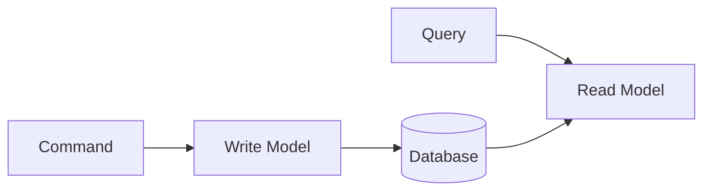

# DDD Glossary

A compilation of Domain-Driven Design core terminology. For detailed explanations, see the [Concepts]() section.

> **TL;DR**
>
> - **Strategic Design**: Define domain boundaries and language with Bounded Context, Context Mapping, Ubiquitous Language
> - **Tactical Design**: Implement domain models with Entity, Value Object, Aggregate, Repository, Domain Event
> - **Architecture Patterns**: Structure systems with Layered, Hexagonal, CQRS, Event Sourcing

## Strategic Design

> For details: [Strategic Design]()

### Bounded Context

**Definition:** An explicit boundary within which a specific domain model applies and maintains consistency

**Characteristics:**
- The same term can have different meanings in different Contexts
- Each Context has its own independent model
- Typically one team manages one Context
- Define relationships with other Contexts through [Context Mapping](#context-mapping)

**Example:**
- "Product" in Sales Context = price, promotions
- "Product" in Inventory Context = quantity, warehouse location

For details: [Strategic Design]()

---

### Context Mapping

**Definition:** Defining the relationships and integration methods between [Bounded Contexts](#bounded-context)

**Key Patterns:**

| Pattern | Description | When to Use |
|---------|-------------|-------------|
| **Shared Kernel** | Two Contexts share part of the model | Close collaboration needed |
| **Customer-Supplier** | Supplier provides API, consumer uses it | Clear dependency relationship |
| **Conformist** | Consumer follows supplier's model as-is | No negotiating power |
| **Anti-Corruption Layer** | Translation layer to convert external models | Legacy integration |
| **Open Host Service** | Expose standard API | Multiple consumers |
| **Published Language** | Use standard data format | [Domain Event](#domain-event) integration |

For details: [Strategic Design]()

---

### Ubiquitous Language

**Definition:** A common language shared between developers and domain experts

**Characteristics:**
- Same terminology used in code, documentation, and conversations
- Each [Bounded Context](#bounded-context) can have its own language
- Defined and managed through a glossary (like this one)

**Practice:**
```
Business term: "Confirm an order"
Code: order.confirm()
Test: @Test void order_confirmation_changes_status_to_CONFIRMED()
```

For details: [Strategic Design]()

---

### Core Domain

**Definition:** The domain that provides core competitive advantage to the business

**Characteristics:**
- Contains the most important and complex business logic
- Should be handled by the best developers
- Should not be outsourced
- Manage complexity by modeling with [Aggregate](#aggregate)

For details: [Strategic Design]()

---

### Supporting Domain

**Definition:** A domain that supports the [Core Domain](#core-domain) but is not core itself

**Characteristics:**
- Necessary for business but not a differentiator
- Can use external solutions
- Examples: User authentication, notifications

---

### Generic Domain

**Definition:** A domain commonly needed across all businesses

**Characteristics:**
- Can purchase/use standard solutions
- Examples: Email, payment gateways

> **Strategic Design Key Points**
>
> - **Bounded Context**: Explicit boundary where a domain model applies
> - **Context Mapping**: Define relationships and integration methods between Bounded Contexts
> - **Ubiquitous Language**: Common language shared between developers and domain experts
> - **Domain Classification**: Investment priority order: Core > Supporting > Generic

---

## Tactical Design

> For details: [Tactical Design]()

### Entity

**Definition:** A domain object distinguished by a unique Identity

**Characteristics:**
- Remains the same object even when state changes
- Has a lifecycle (creation -> modification -> deletion)
- Equality determined by identifier
- Component of an [Aggregate](#aggregate)

**Related Terms:** [Value Object](#value-object), [Aggregate Root](#aggregate-root)

```java
// Equality determined by identifier
@Override
public boolean equals(Object o) {
    if (!(o instanceof Order order)) return false;
    return id.equals(order.id);
}
```

For details: [Tactical Design]() | [Order Domain Example]()

---

### Value Object

**Definition:** An immutable object whose equality is determined by its attribute values

**Characteristics:**
- Immutable
- Same object if all attributes are equal
- Provides only side-effect-free methods
- Self-validates

**Related Terms:** [Entity](#entity) - compare with identity-based equality

```java
public record Money(BigDecimal amount, Currency currency) {
    public Money add(Money other) {
        return new Money(amount.add(other.amount), currency);
    }
}
```

For details: [Tactical Design]() | [Order Domain Example]()

---

### Aggregate

**Definition:** A cluster of associated objects treated as a unit for data changes

**Characteristics:**
- Access only through [Aggregate Root](#aggregate-root)
- One transaction = one Aggregate
- Protects true invariants

**Design Principles:**
1. Keep small
2. Reference other Aggregates only by ID
3. Achieve eventual consistency outside boundaries with [Domain Event](#domain-event)

**Related Terms:** [Entity](#entity), [Value Object](#value-object), [Repository](#repository)

For details: [Aggregate]() | [Aggregate Patterns]()

---

### Aggregate Root

**Definition:** The [Entity](#entity) that serves as the entry point to an [Aggregate](#aggregate)

**Responsibilities:**
- Single point of contact with the outside
- Ensures internal Aggregate consistency
- Publishes [Domain Events](#domain-event)

```java
public class Order extends AggregateRoot<OrderId> {
    private List<OrderLine> orderLines;

    public void addOrderLine(OrderLine line) {
        // Validate invariant
        validateMaxLines();
        orderLines.add(line);
        recalculateTotal();
    }
}
```

For details: [Aggregate]() | [Order Domain Example]()

---

### Repository

**Definition:** An interface that abstracts the persistence of an [Aggregate](#aggregate)

**Characteristics:**
- Only [Aggregate Roots](#aggregate-root) have Repositories
- Behaves like a collection
- Interface in domain layer, implementation in infrastructure (see [Hexagonal Architecture](#hexagonal-architecture))

```java
// Domain layer
public interface OrderRepository {
    Order save(Order order);
    Optional<Order> findById(OrderId id);
}

// Infrastructure layer
@Repository
public class JpaOrderRepository implements OrderRepository { }
```

For details: [Tactical Design]()

---

### Domain Service

**Definition:** A service containing domain logic that doesn't belong to a specific [Entity](#entity)

**When to Use:**
- Operations spanning multiple [Aggregates](#aggregate)
- Domain logic requiring external services
- Logic difficult to attribute to an Entity's responsibility

**Related Terms:** [Application Service](#application-service) - compare with use case orchestration

```java
@DomainService
public class DiscountCalculator {
    public Money calculate(Order order, Customer customer) {
        // Requires information from multiple Aggregates
    }
}
```

For details: [Tactical Design]()

---

### Domain Event

**Definition:** A business-meaningful occurrence that happened in the domain

**Characteristics:**
- Named in past tense (OrderConfirmed)
- Immutable (like [Value Object](#value-object))
- Includes timestamp
- Contains all necessary information

**Usage:**
- Achieve eventual consistency between [Aggregates](#aggregate)
- Synchronize Read Model in [CQRS](#cqrs-command-query-responsibility-segregation)
- Basic unit of [Event Sourcing](#event-sourcing)

```java
public class OrderConfirmedEvent extends DomainEvent {
    private final OrderId orderId;
    private final LocalDateTime confirmedAt;
}
```

For details: [Domain Events]() | [Event Sourcing Example]()

---

### Factory

**Definition:** Encapsulates complex [Aggregate](#aggregate) creation logic

**When to Use:**
- Complex creation logic
- When other service lookups are needed
- Multiple creation methods exist

For details: [Tactical Design]()

---

### Application Service

**Definition:** A service that orchestrates use cases

**Characteristics:**
- Manages transactions
- Coordinates [Domain Services](#domain-service) and [Repositories](#repository)
- Contains no domain logic

**Related Terms:** [Domain Service](#domain-service) - compare with domain logic handling

```java
@Service
@Transactional
public class OrderService {
    public OrderId createOrder(CreateOrderCommand command) {
        Order order = Order.create(...);  // Delegate to domain
        return orderRepository.save(order).getId();
    }
}
```

For details: [Application Layer Example]()

> **Tactical Design Key Points**
>
> - **Entity**: Identified by ID, state can change
> - **Value Object**: Equality determined by attribute values, immutable
> - **Aggregate**: Unit of data change, access only through Root
> - **Repository**: Abstracts Aggregate Root persistence
> - **Domain Event**: Meaningful occurrence in the domain (past tense naming)
> - **Domain Service vs Application Service**: Domain logic vs use case orchestration

---

## Architecture Patterns

> For details: [Architecture Overview]()

### Layered Architecture

```
+-------------------------+
|   Interfaces (API)      |
+-------------------------+
|   Application           | <- Application Service
+-------------------------+
|   Domain                | <- Entity, Value Object, Aggregate
+-------------------------+
|   Infrastructure        | <- Repository implementation
+-------------------------+
```

**Dependency Rule:** Dependencies flow only downward

**Related Terms:** [Application Service](#application-service), [Repository](#repository)

For details: [Layered Architecture]()

---

### Hexagonal Architecture

**Also known as:** Ports and Adapters

**Structure:**
- Port: Interface (defined by domain, e.g., [Repository](#repository))
- Adapter: Implementation (provided by infrastructure)

```
           +-------------+
           |   Domain    |
           |  (Hexagon)  |
           +-------------+
          ^               ^
         Port            Port
          v               v
    +---------+     +----------+
    | Adapter |     | Adapter  |
    | (Web)   |     | (DB)     |
    +---------+     +----------+
```

**Related Patterns:** [Layered Architecture](#layered-architecture), Clean Architecture, Onion Architecture

For details: [Hexagonal Architecture]() | [Clean Architecture]()

---

### CQRS (Command Query Responsibility Segregation)

**Definition:** Separating the models for commands (writes) and queries (reads)



**Benefits:**
- Each can be optimized independently
- Improved query performance
- Separation of complexity

**Related Patterns:** When used with [Event Sourcing](#event-sourcing), synchronize Read Model with [Domain Events](#domain-event)

For details: [CQRS]()

---

### Event Sourcing

**Definition:** Storing [Domain Events](#domain-event) instead of state and deriving state from events

```
Event Stream:
[OrderCreated] -> [OrderLineAdded] -> [OrderConfirmed]
                           |
              Current State = Result of replaying events
```

**Benefits:**
- Complete audit trail
- Time travel possible
- Well-suited for event-driven integration

**Related Patterns:** [CQRS](#cqrs-command-query-responsibility-segregation), [Domain Event](#domain-event)

For details: [Event Sourcing Example]() - EventStore, snapshots, time travel implementation

> **Architecture Patterns Key Points**
>
> - **Layered Architecture**: Dependencies flow only downward (Interfaces -> Application -> Domain -> Infrastructure)
> - **Hexagonal Architecture**: Protect domain from external concerns with Ports (interfaces) and Adapters (implementations)
> - **CQRS**: Separate command (write) and query (read) models for independent optimization
> - **Event Sourcing**: Store events instead of state and replay to derive current state

---

## Next Steps

- [Concepts]() - Strategic/tactical design, architecture
- [Examples]() - Spring Boot-based implementations
- [References]() - Books, articles, presentations
- [FAQ]() - Frequently asked questions
