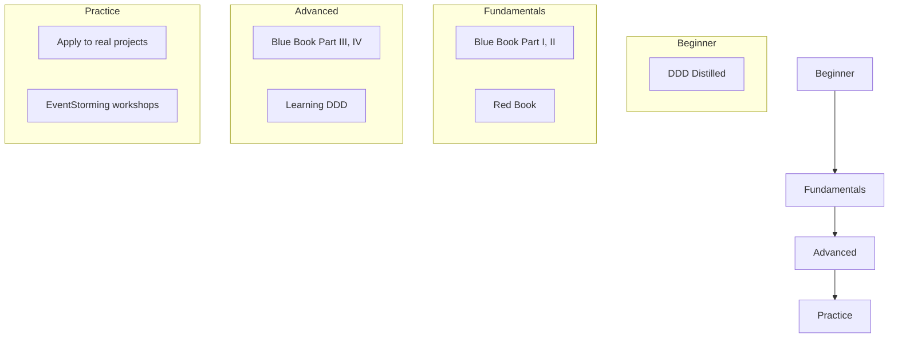

# References

Books, articles, and presentations for learning DDD.

> **TL;DR**
>
> - **Essential Reading**: Blue Book (original), Red Book (implementation), DDD Distilled (intro)
> - **Learning Order**: Intro -> Fundamentals -> Advanced -> Practice (progressive learning)
> - **Practice**: Start with refactoring existing projects or EventStorming

## Essential Reading

### Domain-Driven Design (Blue Book)

- **Author:** Eric Evans
- **Title:** Domain-Driven Design: Tackling Complexity in the Heart of Software (2003)

The original text of DDD. Contains the principles and philosophy of strategic/tactical design patterns.

**Key Parts:**
- Part I: Putting the Domain Model to Work
- Part II: The Building Blocks of a Model-Driven Design
- Part III: Refactoring Toward Deeper Insight
- Part IV: Strategic Design

---

### Implementing Domain-Driven Design (Red Book)

- **Author:** Vaughn Vernon
- **Title:** Implementing Domain-Driven Design (2013)

Details how to actually implement the concepts from the Blue Book.

**Key Content:**
- Bounded Context implementation
- Aggregate design principles
- Repository implementation
- Event-driven architecture

---

### Domain-Driven Design Distilled

- **Author:** Vaughn Vernon
- **Title:** Domain-Driven Design Distilled (2016)

An introductory book that concisely summarizes DDD's core concepts.

**Recommended for:**
- DDD beginners
- Those who need to quickly grasp concepts
- Team training

> **Essential Reading Key Points**
>
> - **Blue Book**: DDD original text, essential for understanding philosophy and principles
> - **Red Book**: Practical implementation methods for Blue Book concepts
> - **DDD Distilled**: Concise summary for beginners, suitable for team training

---

## Recommended Books

### Learning Domain-Driven Design

- **Author:** Vlad Khononov
- **Publisher:** O'Reilly (2021)

A practical guide reflecting modern DDD practices.

**Features:**
- Modern architecture (microservices, event-driven)
- Practical approach
- EventStorming introduction

---

### Patterns, Principles, and Practices of Domain-Driven Design

- **Authors:** Scott Millett, Nick Tune
- **Publisher:** Wrox (2015)

.NET-based but patterns themselves are language-neutral.

**Features:**
- Rich code examples
- Anti-pattern explanations
- Practical tips

---

### Clean Architecture

- **Author:** Robert C. Martin (Uncle Bob)

Not DDD, but helps understand architecture principles.

**Related Content:**
- Dependency rules
- Layer separation
- Domain-centric design

> **Recommended Books Key Points**
>
> - **Learning DDD**: Reflects modern practices (microservices, EventStorming)
> - **Patterns, Principles, and Practices of DDD**: Rich code examples and anti-patterns
> - **Clean Architecture**: Architecture principles used alongside DDD

---

## Online Resources

### Martin Fowler's Blog

- **URL:** https://martinfowler.com/tags/domain%20driven%20design.html

Articles clearly explaining DDD-related concepts

**Key Articles:**
- Bounded Context
- Aggregate
- CQRS
- Event Sourcing

---

### DDD Community

- **URL:** https://www.dddcommunity.org/

Community run by Eric Evans

---

### Awesome DDD

- **URL:** https://github.com/heynickc/awesome-ddd

Collection of DDD-related resources

> **Online Resources Key Points**
>
> - **Martin Fowler's Blog**: Excellent for concept clarification (Bounded Context, Aggregate, CQRS)
> - **DDD Community**: Official community run by Eric Evans
> - **Awesome DDD**: Comprehensive resource collection maintained on GitHub

---

## Presentations

### EventStorming

- **Presenter:** Alberto Brandolini
- **Resource:** eventstorming.com

Workshop technique for domain exploration

**Core Concepts:**
- Domain event identification
- Boundary discovery
- Visual collaboration

---

### Strategic Domain-Driven Design

- **Presenter:** Vaughn Vernon
- **Platform:** YouTube, InfoQ

Strategic design pattern lectures

> **Presentations Key Points**
>
> - **EventStorming**: Visual workshop technique for domain exploration
> - **Vaughn Vernon Lectures**: Helpful for understanding strategic design patterns

---

## Learning Roadmap



### Stage-by-Stage Recommendations

| Stage | Goal | Recommended Resources |
|-------|------|----------------------|
| **Beginner** | Understand what DDD is | DDD Distilled |
| **Fundamentals** | Understand tactical patterns | Red Book, Blue Book Part I-II |
| **Advanced** | Understand strategic patterns | Blue Book Part III-IV, Learning DDD |
| **Practice** | Apply to projects | EventStorming, hands-on practice |

## Practice Recommendations

### 1. Refactor Existing Project

- Anemic domain model -> Rich domain model
- Logic scattered in services -> Move to Entity/Value Object
- Redefine Aggregate boundaries

### 2. Start New Project

- Explore domain with EventStorming
- Identify Bounded Contexts
- Apply tactical patterns

### 3. Code Review Perspective

```
Checklist:
- [ ] Are domain terms reflected in code?
- [ ] Is business logic in domain objects?
- [ ] Are Aggregate boundaries appropriate?
- [ ] Are Value Objects being utilized?
```

> **Learning Roadmap and Practice Key Points**
>
> - **Learning Order**: Beginner (DDD Distilled) -> Fundamentals (Blue/Red Book) -> Advanced -> Practice
> - **Practice Recommendations**: Refactor existing project -> Start new project -> Code review
> - **Key Checks**: Domain term reflection, business logic location, Aggregate boundaries, Value Object usage

---

## Community

- **DDD Community:** https://www.dddcommunity.org/
- **Virtual DDD:** https://virtualddd.com/
- **DDD Reddit:** https://www.reddit.com/r/DomainDrivenDesign/

---

We hope this guide helps with your DDD learning journey!
