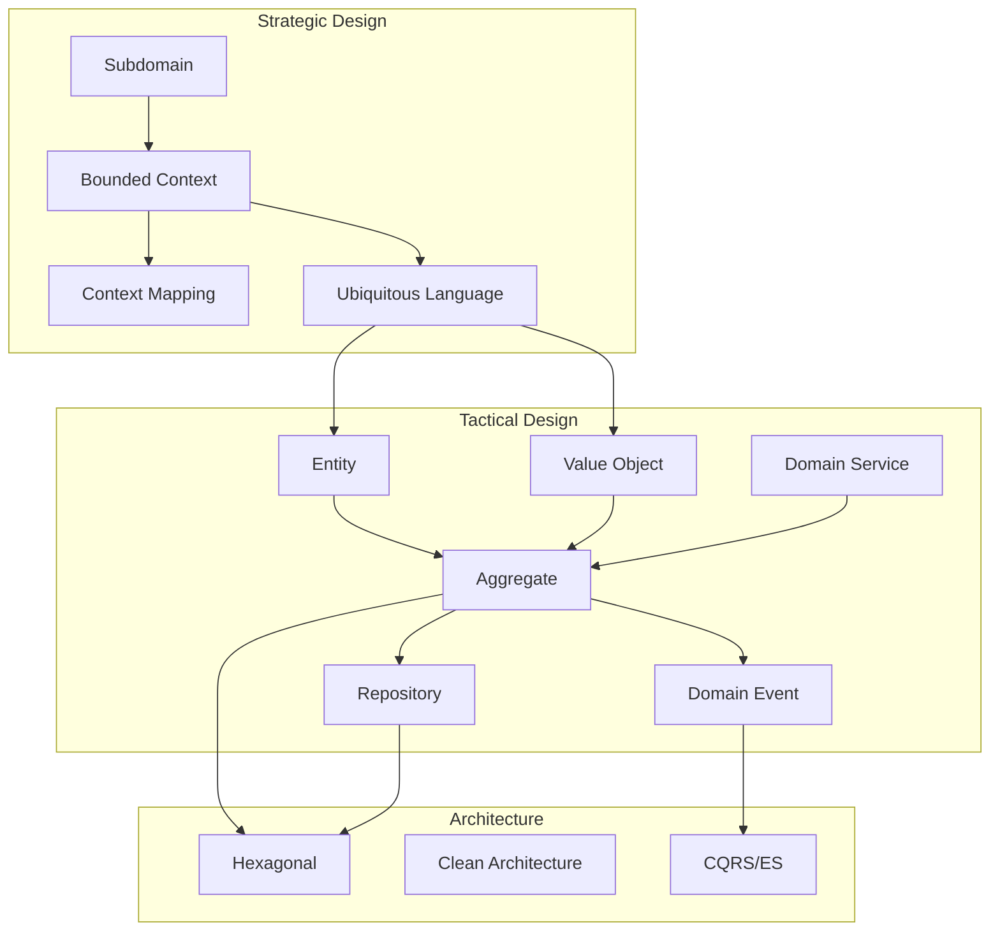

> **Target Audience**: Developers new to DDD or wanting to systematically organize their understanding
> **Prerequisites**: Object-oriented programming, basic Spring Boot knowledge
> **Section Purpose**: Explain the "why" and "what" of DDD's core concepts and patterns


This section focuses on **conceptual understanding**. We emphasize "why design this way" rather than "how to implement." For actual implementation, refer to [Practice Examples](), and for solving specific problems, see [How-To Guides]().


DDD's core consists of two levels of patterns: strategic design and tactical design. Strategic design draws the big picture of the system, defining how to divide the business domain and how each part interacts. Tactical design covers patterns for concretely implementing domain models within each boundary.

#### Design Patterns

Starting from strategic design patterns and progressively moving to tactical design patterns is an effective learning sequence. [Strategic Design]() covers Subdomain, Bounded Context, Context Mapping, and Ubiquitous Language, while [Tactical Design]() teaches Entity, Value Object, Repository, Domain Service, and Specification patterns. [Aggregate Deep Dive]() covers Aggregate design principles, transaction boundaries, and how to determine appropriate size, and [Domain Events]() explores event-driven architecture and Event Sourcing.

#### Architecture

There are architecture patterns for effectively protecting domain models and separating them from external dependencies. [Architecture Patterns]() compares and analyzes Hexagonal, Clean Architecture, and Onion Architecture, while [CQRS]() covers how to separate commands and queries to use models optimized for each.

#### Quality

Testing and continuous improvement are essential to maintain domain model quality. [Testing Strategy]() covers how to write domain model tests, integration tests, and E2E tests, while [Anti-Patterns and Pitfalls]() examines common mistakes made when applying DDD and their solutions.

#### Concept Relationships

The diagram below shows how DDD's major concepts are connected. Subdomains defined in strategic design form Bounded Contexts, and within each Context, Ubiquitous Language is used to define Entities and Value Objects from tactical design. These are grouped into Aggregates, persisted through Repositories, and communicate with other Contexts through Domain Events. This structure is implemented on top of architecture patterns like Hexagonal or Clean Architecture.

