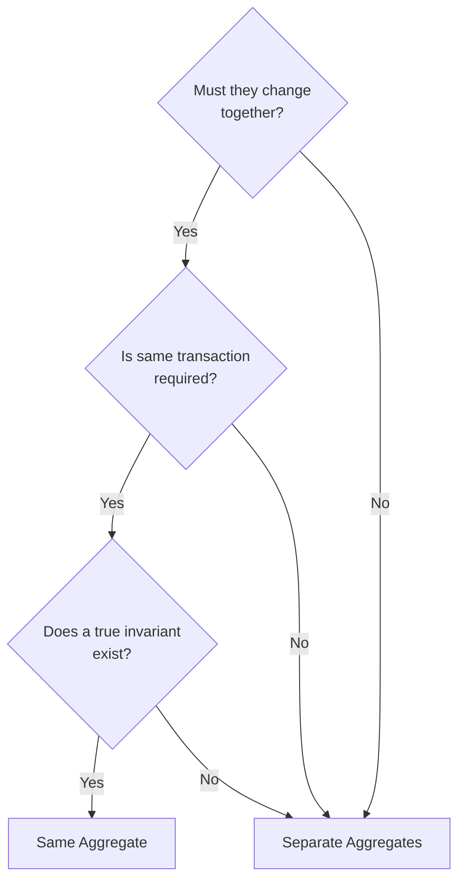

> **Target Audience**: Developers who have learned Aggregate basics and want to learn practical patterns
> **Prerequisites**: Understanding core concepts from [Aggregate Deep Dive]()
> **Reading Time**: About 30 minutes
> **Key Question**: "What patterns should I apply when implementing Aggregates?"


Practical patterns: **Factory Method** (creation) + **Domain Event publishing** + **Optimistic Locking** (concurrency) + **Soft Delete** (deletion)


# Aggregate Practical Patterns

Implementation patterns and decision guides for Aggregate design.

> **Common imports for examples in this page:**
> ```java
> import java.util.*;
> import java.time.LocalDateTime;
> import javax.persistence.Version;
> import org.springframework.context.ApplicationEventPublisher;
> ```

## Aggregate Root Design

### All Changes Through Root

```java
public class Order {
    private List<OrderLine> orderLines;

    // ✅ Add internal objects through root
    public void addOrderLine(ProductId productId, String name, Money price, int qty) {
        validateCanModify();

        OrderLine newLine = new OrderLine(
            OrderLineId.generate(),
            productId,
            name,
            price,
            qty
        );
        this.orderLines.add(newLine);
        recalculateTotal();
    }

    // ✅ Modify internal objects through root
    public void changeQuantity(OrderLineId lineId, int newQuantity) {
        validateCanModify();

        OrderLine line = findOrderLine(lineId);
        line.changeQuantity(newQuantity);  // Allow changes only internally
        recalculateTotal();
    }

    // Don't expose internal objects directly
    public List<OrderLine> getOrderLines() {
        return Collections.unmodifiableList(orderLines);
    }
}
```

### Invariant Validation

```java
public class Order {
    private static final int MAX_ORDER_LINES = 100;
    private static final Money MAX_ORDER_AMOUNT = Money.won(10_000_000);

    public void addOrderLine(OrderLine line) {
        // Invariant 1: Limit number of order items
        if (orderLines.size() >= MAX_ORDER_LINES) {
            throw new TooManyOrderLinesException(MAX_ORDER_LINES);
        }

        orderLines.add(line);
        recalculateTotal();

        // Invariant 2: Maximum order amount limit
        if (totalAmount.isGreaterThan(MAX_ORDER_AMOUNT)) {
            orderLines.remove(line);  // Rollback
            recalculateTotal();
            throw new OrderAmountExceededException(MAX_ORDER_AMOUNT);
        }
    }
}
```

## Practical Patterns

### Pattern 1: Optimistic Locking

```java
@Entity
public class OrderEntity {
    @Id
    private String id;

    @Version  // Optimistic locking
    private Long version;

    // ...
}
```

```java
// Exception thrown on concurrent modification
try {
    order.confirm();
    orderRepository.save(order);
} catch (OptimisticLockingFailureException e) {
    // Retry logic
    throw new ConcurrentModificationException("Order was modified elsewhere");
}
```

### Pattern 2: Aggregate Reconstitution

```java
public class Order {
    // Reconstitute from stored state (Factory pattern)
    public static Order reconstitute(
        OrderId id,
        CustomerId customerId,
        OrderStatus status,
        List<OrderLine> orderLines,
        ShippingAddress address,
        LocalDateTime createdAt
    ) {
        Order order = new Order();
        order.id = id;
        order.customerId = customerId;
        order.status = status;
        order.orderLines = new ArrayList<>(orderLines);
        order.shippingAddress = address;
        order.createdAt = createdAt;
        return order;
    }

    // Create new
    public static Order create(CustomerId customerId, List<OrderLine> orderLines) {
        Order order = new Order();
        order.id = OrderId.generate();
        order.customerId = customerId;
        order.status = OrderStatus.PENDING;
        order.orderLines = new ArrayList<>(orderLines);
        order.createdAt = LocalDateTime.now();

        order.registerEvent(new OrderCreatedEvent(order.id));
        return order;
    }
}
```

### Pattern 3: Domain Event Collection

```java
public abstract class AggregateRoot {
    private final List<DomainEvent> domainEvents = new ArrayList<>();

    protected void registerEvent(DomainEvent event) {
        domainEvents.add(event);
    }

    public List<DomainEvent> getDomainEvents() {
        return Collections.unmodifiableList(domainEvents);
    }

    public void clearDomainEvents() {
        domainEvents.clear();
    }
}

public class Order extends AggregateRoot {

    public void confirm() {
        this.status = OrderStatus.CONFIRMED;
        registerEvent(new OrderConfirmedEvent(this.id));
    }

    public void cancel(CancellationReason reason) {
        this.status = OrderStatus.CANCELLED;
        registerEvent(new OrderCancelledEvent(this.id, reason));
    }
}
```

### Pattern 4: Event Publishing in Repository

```java
@Repository
public class JpaOrderRepository implements OrderRepository {

    private final OrderJpaRepository jpaRepository;
    private final ApplicationEventPublisher eventPublisher;

    @Override
    public Order save(Order order) {
        OrderEntity entity = toEntity(order);
        jpaRepository.save(entity);

        // Publish events after save
        order.getDomainEvents().forEach(eventPublisher::publishEvent);
        order.clearDomainEvents();

        return order;
    }
}
```

## Aggregate Boundary Decision Guide

### Question Checklist



### Example: Order and Payment

```
Question: Should Order and Payment be the same Aggregate?

1. Must they change together?
   → Payment can't exist without Order, but Order persists even if payment fails
   → No

2. Is same transaction required?
   → Payment involves external PG, many failures/retries
   → Safer to separate
   → No

3. Does a true invariant exist?
   → "Order amount = Payment amount" can be eventually consistent
   → No

Conclusion: Separate Aggregates
```

```java
// Separate Aggregates
public class Order {
    private OrderId id;
    private PaymentId paymentId;  // Reference by ID only
    private PaymentStatus paymentStatus;  // Copy of status
}

public class Payment {
    private PaymentId id;
    private OrderId orderId;  // Reference by ID only
    private Money amount;
    private PaymentStatus status;
}
```

## Anti-Patterns

### 1. God Aggregate

```java
// ❌ Massive Aggregate containing everything
public class Order {
    private Customer customer;  // Entire Customer
    private List<Product> products;  // Entire Product
    private Payment payment;  // Entire Payment
    private Shipment shipment;  // Entire Shipment
    // Transaction scope is too wide
}
```

**Problems:**
- High contention on concurrent access
- Slow loading due to large object graph
- Changes in one area affect unrelated parts

**Solution:** Split into separate Aggregates with ID references.

### 2. Anemic Aggregate

```java
// ❌ Aggregate with no logic
public class Order {
    private OrderId id;
    private OrderStatus status;

    // Only getter/setter exists
    public OrderStatus getStatus() { return status; }
    public void setStatus(OrderStatus status) { this.status = status; }
}

// Logic scattered in service
public class OrderService {
    public void confirm(Order order) {
        if (order.getStatus() == OrderStatus.PENDING) {
            order.setStatus(OrderStatus.CONFIRMED);
        }
    }
}
```

**Problems:**
- Business rules scattered across services
- Invariants can be violated from anywhere
- Hard to understand domain logic

**Solution:** Move business logic into the Aggregate.

### 3. Aggregate with External Dependencies

```java
// ❌ Aggregate calling external services
public class Order {
    @Autowired  // Don't inject dependencies!
    private InventoryService inventoryService;

    public void confirm() {
        // Aggregate shouldn't call external services directly
        inventoryService.reserve(this.orderLines);
        this.status = OrderStatus.CONFIRMED;
    }
}
```

**Solution:** Use Domain Events for external integration.

## Summary

| Pattern | When to Use |
|---------|-------------|
| **Optimistic Locking** | Concurrent modification possible |
| **Reconstitution** | Separating creation from DB loading |
| **Event Collection** | Cross-aggregate communication |
| **Boundary Decision** | Designing new Aggregates |

## Next Steps

- [Domain Events]() - Event-based integration
- [Anti-Patterns]() - Common mistakes to avoid
