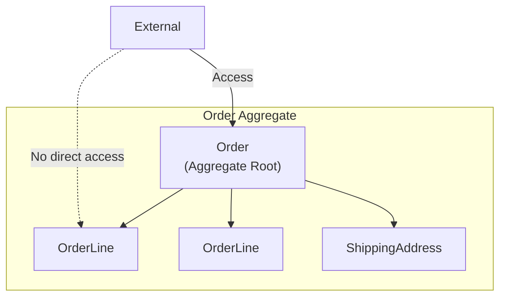
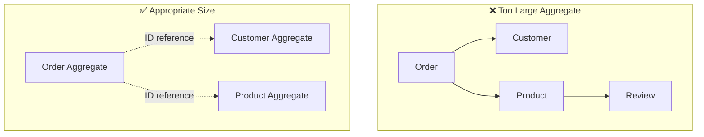
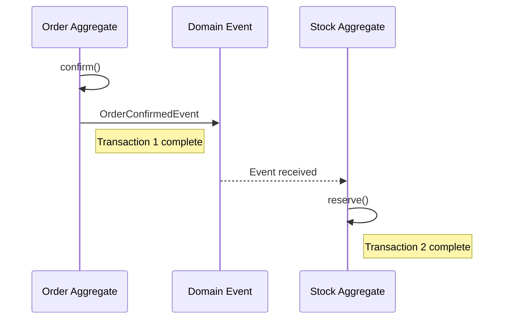
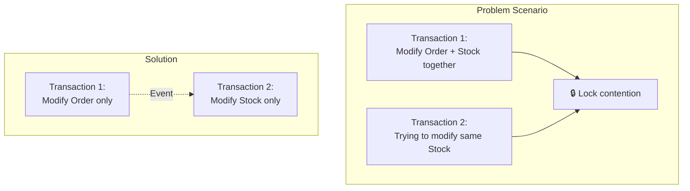

> **Target Audience**: Developers who understand Aggregate basics and need deep dive into design
> **Prerequisites**: Entity, Value Object concepts from [Tactical Design]()
> **Reading Time**: About 25 minutes
> **Key Question**: "How do I determine Aggregate boundaries, and what is the appropriate size?"


Aggregate design core: **Invariant-based boundary setting** → **Keep it small** → **Reference by ID** → **Use eventual consistency**


# Aggregate Deep Dive

A deep dive into Aggregate design principles, transaction boundaries, and practical patterns.

> **Common imports for examples in this page:**
> ```java
> import java.util.List;
> import java.util.ArrayList;
> import java.util.Collections;
> import java.time.LocalDateTime;
> ```

## Why Do We Need Aggregates?

One of the hardest questions in object-oriented design is **"How much should we group together as a single unit?"**

**Problems when designing without Aggregates:**

```java
// Problem 1: Internal objects can be modified directly from anywhere
OrderLine line = orderLineRepository.findById(lineId);
line.setQuantity(100);  // Order total not updated! Inconsistency occurs

// Problem 2: Transaction scope is unclear
@Transactional
public void processOrder(OrderId orderId) {
    // Order, OrderLine, Customer, Product, Stock, Payment...
    // All in one transaction? Up to where?
}

// Problem 3: Concurrency control is impossible
// User A: order.addLine(...)
// User B: order.removeLine(...)
// Who wins? What lock should be acquired?
```

**What Aggregates solve:**
- **Consistency boundary**: Always guarantees consistent state within this scope
- **Transaction boundary**: One Aggregate = One transaction
- **Concurrency boundary**: Concurrent modifications to the same Aggregate are treated as conflicts

## What is an Aggregate?

An **Aggregate** is a cluster of related objects treated as a unit for data changes.



### Core Components

| Element | Role | Example |
|---------|------|---------|
| **Aggregate Root** | Single point of contact with outside, ensures consistency | Order |
| **Internal Entity** | Accessed only through Root | OrderLine |
| **Value Object** | Immutable attribute values | ShippingAddress, Money |

## Design Principles

### Principle 1: Protect True Invariants

An **invariant** is a business rule that must always be true.

```java
public class Order {
    private List<OrderLine> orderLines;
    private Money totalAmount;
    private OrderStatus status;

    // Invariant: Order must not be empty
    public void removeOrderLine(OrderLineId lineId) {
        if (orderLines.size() <= 1) {
            throw new BusinessRuleViolationException(
                "Order must have at least 1 item"
            );
        }
        orderLines.removeIf(line -> line.getId().equals(lineId));
        recalculateTotal();  // Invariant: Total is always current
    }

    // Invariant: Total equals sum of order lines
    private void recalculateTotal() {
        this.totalAmount = orderLines.stream()
            .map(OrderLine::getAmount)
            .reduce(Money.ZERO, Money::add);
    }
}
```

### Principle 2: Design Small Aggregates



**Why keep them small:**
- Reduce transaction scope → Less concurrency conflicts
- Reduce memory usage
- Minimize change impact

### What Does "Small" Actually Mean?

The principle "design small" is vague. How do you actually judge?

**Questions to determine inclusion:**

```
Q1. "Is the Root valid without this object?"
    - No → Include (Order is meaningless without OrderLine)
    - Yes → Consider separating (Order can exist without Customer)

Q2. "Is this object created/modified independently?"
    - Yes → Separate (Product is managed independently of Order)
    - No → Include (OrderLine is meaningless without Order)

Q3. "Is this object referenced from other places?"
    - Yes → Separate (Product is referenced by multiple Orders)
    - No → Include (OrderLine only has meaning in this Order)

Q4. "Is this object frequently modified?"
    - Frequently modified → Separate (Stock changes with every order)
    - Changes only with Root → Include (ShippingAddress changes with Order)
```

**Real example: Order System**

```
Include in Order Aggregate:
├── OrderLine (meaningless without Order, created together)
├── ShippingAddress (Order's attribute, no independent changes)
└── OrderStatus (Order's state)

Separate as different Aggregates:
├── Customer (created/modified independently, referenced by multiple Orders)
├── Product (managed independently, also used in catalog)
└── Stock (frequently modified, concurrent access by multiple Orders)
```

**Sensing the right size:**
- Consider separation if internal Entities exceed 3-5
- Be suspicious if data loaded at once exceeds tens of KB
- Frequent concurrent modification conflicts are a separation signal

### Real Case: Aggregate Boundary Redesign

**Situation:** Order Aggregate in e-commerce system was too large, causing problems

```
Initial Design (Problem):
Order Aggregate
├── OrderLines (up to 100)
├── PaymentInfo
├── ShippingInfo
├── OrderHistory (all state change records)
└── CustomerSnapshot

Problems:
1. Order load average 50KB, max 500KB
2. Full load even for just viewing order → Slow
3. Full save on every state change → Lock contention
4. OrderHistory keeps growing → Memory issues
```

**Solution: Boundary Redesign**

```
After Redesign:
Order Aggregate (core only)
├── OrderLines
├── OrderStatus
└── ShippingAddressSnapshot

Separated as different Aggregates:
├── Payment Aggregate (payment information)
├── Shipment Aggregate (delivery tracking)
└── OrderAuditLog (history stored separately)

Results:
1. Order load time: 50ms → 5ms
2. Concurrency conflicts: 100/week → 2/week
3. Code complexity: Reduced (single responsibility per Aggregate)
```

**Lesson:**

> Vaughn Vernon's advice: "Start with the smallest possible Aggregate,
> and only expand when transactional consistency is actually needed."

### Performance Measurement: When to Consider Separation?

Measure these metrics regularly:

| Metric | Healthy Level | Warning Level | Danger Level |
|--------|---------------|---------------|--------------|
| Average load time | < 10ms | 10-50ms | > 50ms |
| Average Aggregate size | < 10KB | 10-50KB | > 50KB |
| Optimistic lock conflict rate | < 1% | 1-5% | > 5% |
| Average transaction time | < 50ms | 50-200ms | > 200ms |

```java
// Measurement code example
@Around("execution(* *Repository.save(..))")
public Object measureSaveTime(ProceedingJoinPoint pjp) throws Throwable {
    long start = System.currentTimeMillis();
    try {
        return pjp.proceed();
    } finally {
        long duration = System.currentTimeMillis() - start;
        if (duration > 50) {
            log.warn("Slow aggregate save: {}ms, type={}",
                duration, pjp.getArgs()[0].getClass().getSimpleName());
        }
        metrics.recordSaveTime(pjp.getSignature().getName(), duration);
    }
}
```

### Principle 3: Reference Other Aggregates by ID Only

```java
// ❌ Direct object reference
public class Order {
    private Customer customer;  // Direct reference to Customer Aggregate
    private List<Product> products;  // Direct reference to Product Aggregate
}

// ✅ Reference by ID
public class Order {
    private CustomerId customerId;  // Store ID only
    private List<OrderLine> orderLines;  // OrderLine contains ProductId internally
}

public record OrderLine(
    OrderLineId id,
    ProductId productId,  // Reference by ID
    String productName,   // Copy needed information
    Money price,
    int quantity
) {}
```

### Principle 4: Use Eventual Consistency Outside Boundaries



```java
// Order Aggregate
public class Order {
    public void confirm() {
        this.status = OrderStatus.CONFIRMED;
        // Only publish event, inventory handled in separate transaction
        registerEvent(new OrderConfirmedEvent(this.id, this.orderLines));
    }
}

// Stock Aggregate (separate transaction)
@Component
public class StockEventHandler {

    private final StockRepository stockRepository;

    // Note: @EventListener executes synchronously in same transaction
    // For separate transaction, configure as below
    @TransactionalEventListener(phase = TransactionPhase.AFTER_COMMIT)
    @Transactional(propagation = Propagation.REQUIRES_NEW)
    public void handle(OrderConfirmedEvent event) {
        for (OrderLineInfo line : event.getOrderLines()) {
            Stock stock = stockRepository.findByProductId(line.getProductId());
            stock.reserve(line.getQuantity());
            stockRepository.save(stock);
        }
    }
}
```

## Transaction Boundaries

### One Transaction = One Aggregate

```java
// ✅ Correct pattern: Modify only one Aggregate
@Transactional
public void confirmOrder(OrderId orderId) {
    Order order = orderRepository.findById(orderId)
        .orElseThrow(() -> new OrderNotFoundException(orderId));

    order.confirm();  // Only modify Order Aggregate

    orderRepository.save(order);
    // Use events to trigger changes in other Aggregates
}

// ❌ Wrong pattern: Modify multiple Aggregates simultaneously
@Transactional
public void confirmOrder(OrderId orderId) {
    Order order = orderRepository.findById(orderId).orElseThrow();
    order.confirm();

    // Modifying other Aggregates in same transaction - avoid this
    for (OrderLine line : order.getOrderLines()) {
        Stock stock = stockRepository.findByProductId(line.getProductId());
        stock.reserve(line.getQuantity());  // Modifying Stock Aggregate
    }
}
```

### Why Separate?



---

## Common Mistakes in Practice

### Mistake 1: Putting All Related Objects in One Aggregate

```java
// ❌ Too large Aggregate
public class Order {
    private Customer customer;        // Should be separate Aggregate
    private List<Product> products;   // Should be separate Aggregate
    private Payment payment;          // Should be separate Aggregate
    private Delivery delivery;        // Should be separate Aggregate
}

// Problems:
// 1. Must load Order just to modify Customer info
// 2. Must search through all Orders to check inventory
// 3. Unnecessary conflicts on concurrent orders
```

**Solution:** Separate with ID references, copy only needed information

```java
// ✅ Appropriate size
public class Order {
    private CustomerId customerId;
    private String customerName;  // Copy for display
    private List<OrderLine> orderLines;  // Only includes OrderLine
}
```

### Mistake 2: Calling Repository Inside Aggregate

```java
// ❌ Directly calling Repository from Aggregate
public class Order {
    @Autowired  // Never do this!
    private ProductRepository productRepository;

    public void addItem(ProductId productId, int quantity) {
        Product product = productRepository.findById(productId);  // Anti-pattern!
        this.orderLines.add(new OrderLine(product, quantity));
    }
}
```

**Problems:**
- Aggregate depends on infrastructure
- Hard to test
- Transaction scope becomes unclear

**Solution:** Fetch needed information in service layer and pass it

```java
// ✅ Fetch in service and pass
@Service
public class OrderService {
    public void addItem(OrderId orderId, ProductId productId, int quantity) {
        Order order = orderRepository.findById(orderId);
        ProductInfo productInfo = productService.getProductInfo(productId);

        order.addItem(productInfo, quantity);  // Pass only needed information

        orderRepository.save(order);
    }
}
```

### Mistake 3: Directly Modifying Internal Entity Bypassing Aggregate Root

```java
// ❌ Directly querying/modifying internal Entity
OrderLine line = orderLineRepository.findById(lineId);
line.setQuantity(10);  // Order's totalAmount is not updated!
orderLineRepository.save(line);
```

**Solution:** Always modify through Root

```java
// ✅ Modify through Root
Order order = orderRepository.findById(orderId);
order.changeLineQuantity(lineId, 10);  // Internally recalculates total
orderRepository.save(order);
```

### Mistake 4: Modifying Multiple Aggregates in One Transaction

```java
// ❌ Modifying multiple Aggregates in one transaction
@Transactional
public void processOrder(OrderId orderId) {
    Order order = orderRepository.findById(orderId);
    order.confirm();

    Stock stock = stockRepository.findByProductId(productId);
    stock.decrease(quantity);  // Modifying another Aggregate!

    Customer customer = customerRepository.findById(customerId);
    customer.addPoints(points);  // Modifying yet another Aggregate!
}
// Problem: Lock scope becomes too wide, concurrency issues arise
```

**Solution:** Separate with events

```java
// ✅ Each in separate transaction
@Transactional
public void confirmOrder(OrderId orderId) {
    Order order = orderRepository.findById(orderId);
    order.confirm();  // Publishes OrderConfirmedEvent
    orderRepository.save(order);
}

@TransactionalEventListener(phase = TransactionPhase.AFTER_COMMIT)
@Transactional(propagation = Propagation.REQUIRES_NEW)
public void onOrderConfirmed(OrderConfirmedEvent event) {
    Stock stock = stockRepository.findByProductId(event.getProductId());
    stock.decrease(event.getQuantity());
    stockRepository.save(stock);
}
```

---

---

## Introducing Aggregates to Legacy Systems

When introducing DDD to existing systems, a gradual approach is essential.

### Step-by-Step Migration Roadmap

```
Phase 1: Analysis (1-2 weeks)
├── Understand existing domain model
├── Analyze transaction boundaries
├── Identify most problematic areas
└── Draft target Aggregate design

Phase 2: Isolation (2-4 weeks)
├── Isolate target area into separate package
├── Maintain existing code, run new code in parallel
├── Build Anti-Corruption Layer
└── Gradually shift traffic

Phase 3: Refactoring (4-8 weeks)
├── Introduce Aggregate Root
├── Apply Repository pattern
├── Add domain event publishing
└── Remove legacy code

Phase 4: Stabilization (2-4 weeks)
├── Performance monitoring
├── Boundary adjustments
└── Documentation
```

### Anti-Corruption Layer Pattern

Place a translation layer between legacy code and new Aggregates:

```java
// Anti-Corruption Layer
@Service
public class OrderAntiCorruptionLayer {

    private final LegacyOrderDao legacyDao;  // Existing system
    private final OrderRepository newRepo;   // New Aggregate

    // Legacy → New model
    public Order findOrder(String legacyOrderId) {
        LegacyOrderEntity legacy = legacyDao.findById(legacyOrderId);
        return translateToAggregate(legacy);
    }

    // New model → Legacy (backward compatibility)
    public void saveOrder(Order order) {
        newRepo.save(order);
        // Also update legacy system (during transition period)
        legacyDao.update(translateToLegacy(order));
    }

    private Order translateToAggregate(LegacyOrderEntity legacy) {
        return Order.reconstitute(
            new OrderId(legacy.getOrderNumber()),
            translateOrderLines(legacy.getItems()),
            // ... translation logic
        );
    }
}
```

### Cautions When Introducing

**What NOT to do:**
- ❌ Refactor entire system at once
- ❌ Keep analyzing seeking perfect design
- ❌ Write new code ignoring legacy
- ❌ Do technical refactoring ignoring business requirements

**What TO do:**
- ✅ Start from the most painful area
- ✅ Show small wins quickly
- ✅ Coexist with legacy, gradually transition
- ✅ Justify by connecting to business value

---

## DDD Community Guidelines

### Eric Evans (DDD Creator) Advice

> "Finding Aggregate boundaries is one of the hardest design decisions.
> You might get it wrong at first, and that's okay.
> What matters is making boundaries explicit and being ready to adjust when needed."

### Vaughn Vernon's Practical Rules

1. **Start small**: When in doubt, separate
2. **Reference only the Root**: Don't expose internal Entities externally
3. **Reference by ID**: Reference other Aggregates only by ID
4. **Accept eventual consistency**: Immediate consistency is usually unnecessary

### General Decision Tree

```
Should this Entity be included in the Aggregate?

1. Can this Entity exist without the Root?
   └── Yes → Consider separate Aggregate
   └── No → Continue to next question

2. Is this Entity directly referenced from elsewhere?
   └── Yes → Separate Aggregate (change to ID reference)
   └── No → Continue to next question

3. Does this Entity always change together with Root?
   └── Yes → Include
   └── No → Separate Aggregate + synchronize via events

4. Would including it make the transaction too large?
   └── Yes → Separate and apply eventual consistency
   └── No → Include
```

---

## Summary

| Concept | Description |
|---------|-------------|
| **Aggregate** | Cluster of objects treated as a unit |
| **Aggregate Root** | Single entry point ensuring consistency |
| **Design Small** | Reduce transaction scope and conflicts |
| **ID Reference** | Reference other Aggregates by ID only |
| **Eventual Consistency** | Use events for cross-Aggregate changes |
| **Gradual Introduction** | Use ACL pattern for legacy systems |

## Next Steps

- [Aggregate Practical Patterns]() - Implementation patterns, anti-patterns, and decision guides
- [Domain Events]() - Event-based integration
