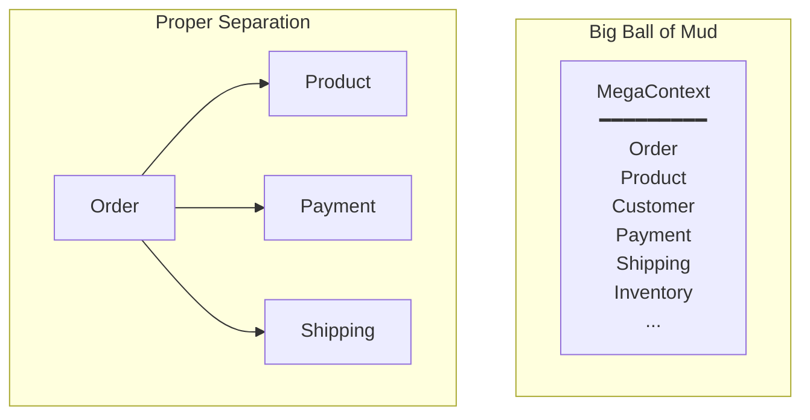
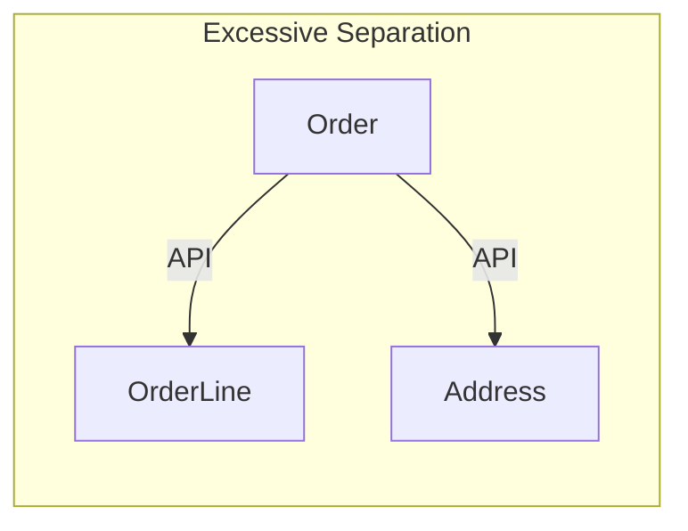

> **Target Audience**: Developers who are applying or considering adopting DDD
> **Prerequisites**: Basic concepts from [Quick Start](../../quick-start/) and [Tactical Design](../tactical-design/)
> **Reading Time**: About 20 minutes
> **Key Question**: "What are the common mistakes when applying DDD, and how can they be avoided?"


The anti-patterns introduced in this document frequently occur in real projects. Check if your codebase exhibits these symptoms.


DDD (Domain-Driven Design) is a powerful design methodology, but if not applied correctly, it can only increase complexity. This document examines common DDD anti-patterns encountered in practice and their solutions. Understanding the symptoms of each anti-pattern and catching them early to correct is crucial.

#### Strategic Design Anti-Patterns

Strategic design is the phase of drawing the big picture of the system. Wrong choices in this phase of deciding how to divide and integrate Bounded Contexts will negatively affect the entire system structure.

**1. Big Ball of Mud Context**

The most common mistake is making everything into one huge Bounded Context. It seems convenient at first, but as the system grows, it becomes unmanageable. Putting Order, Product, Customer, Payment, Shipping, and Inventory management all into one Context blurs the boundaries of each domain and reduces cohesion.



The main symptoms of this anti-pattern are as follows. All teams modify the same codebase, causing frequent merge conflicts. Even small changes require redeploying the entire application, lengthening deployment cycles. The same terms are used with different meanings, adding to confusion. For example, the term "product" can have different attributes and behaviors in catalog management, inventory management, and order processing.

The solution is to find clear boundaries and separate Contexts. First, find linguistic boundaries. Points where domain expert terminology conflicts are good candidates for Context boundaries. Second, consider team boundaries. Areas owned by different teams naturally separate into different Contexts. Third, separate gradually. Don't try to separate everything at once; start from the clearest boundaries and proceed step by step.

**2. Context Too Small**

The opposite extreme of Big Ball of Mud is also a problem. Riding the microservices wave and dividing too finely increases integration costs exponentially. Separating Order, OrderLine, and Address into separate services is a typical example of excessive separation.



The symptoms of this anti-pattern are having to call multiple services to implement a simple feature, complex distributed transaction management, and performance degradation due to network overhead. If retrieving a single order requires calling the Order service, OrderLine service, and Address service separately, it's clearly a wrong design.

Context separation criteria can be judged by these three questions. Can it be deployed independently? Is it owned by a different team? Does it have a different lifecycle? If any answer is "no," keeping them in the same Context is advisable. Order and OrderLine have the same lifecycle and are managed by the same team, so they should be maintained as one Aggregate.

**3. Ignoring Ubiquitous Language**

If code is written only with technical terms without using domain terms, communication with domain experts breaks down. Expressing "order confirmation" as `updateStatus(id, 1)` makes it impossible to understand the business meaning just by looking at the code.

```java
// ❌ Technical terms
public class OrderManager {
    public void updateStatus(Long id, int status) {
        // status: 0=pending, 1=confirmed, 2=shipped, 9=cancelled
    }
}

// ✅ Domain terms
public class Order {
    public void confirm() { }
    public void ship(TrackingNumber trackingNumber) { }
    public void cancel(CancellationReason reason) { }
}
```

The wrong example uses magic numbers. That status code 1 means "confirmed" can only be known by reading comments or referring to documentation. In contrast, the correct example uses clear domain terms like `confirm()`, `ship()`, `cancel()` so the code itself expresses business intent.

The solutions are as follows. First, create a glossary with domain experts. Second, use the same terms consistently in code, tests, and documentation. Third, verify domain term usage in code reviews. The team should manage this to prevent developers from arbitrarily changing or abbreviating terms.

#### Tactical Design Anti-Patterns

Tactical design is about implementation patterns at the code level. Misusing building blocks like Entity, Value Object, and Aggregate scatters business logic and makes maintenance difficult.

**4. Anemic Domain Model**

This is the most common and fatal anti-pattern. When an Entity has only data and no logic, you're giving up encapsulation, the core of object-orientation. When all business rules are scattered across the Service layer, duplicate code occurs and multiple places must be modified when rules change.

```java
// ❌ Anemic Model
public class Order {
    private Long id;
    private String status;
    private LocalDateTime confirmedAt;

    // Only getter/setter exist
    public String getStatus() { return status; }
    public void setStatus(String status) { this.status = status; }
}

// Logic scattered in service
public class OrderService {
    public void confirmOrder(Long orderId) {
        Order order = repository.findById(orderId);
        if (order.getStatus().equals("PENDING")) {
            order.setStatus("CONFIRMED");
            order.setConfirmedAt(LocalDateTime.now());
            // Business rules here...
        }
        repository.save(order);
    }
}
```

In the wrong example, the Order object is a simple data container. The business rule of order confirmation is in the Service, so if the order needs to be confirmed elsewhere, the same logic must be duplicated or the Service must be depended upon. State validation logic is also in the Service, so the Order object can have an invalid state at any time.

```java
// ✅ Rich Domain Model
public class Order {
    private OrderId id;
    private OrderStatus status;
    private LocalDateTime confirmedAt;

    public void confirm() {
        validateConfirmable();
        this.status = OrderStatus.CONFIRMED;
        this.confirmedAt = LocalDateTime.now();
        registerEvent(new OrderConfirmedEvent(this));
    }

    private void validateConfirmable() {
        if (this.status != OrderStatus.PENDING) {
            throw new IllegalOrderStateException(
                "Can only confirm from PENDING state. Current: " + this.status
            );
        }
    }
}

// Service only orchestrates flow
public class OrderService {
    public void confirmOrder(OrderId orderId) {
        Order order = repository.findById(orderId).orElseThrow();
        order.confirm();  // Delegate to domain
        repository.save(order);
    }
}
```

In the correct example, business rules are encapsulated within the Order object. The `confirm()` method handles all logic including state validation, state change, and event publishing. The Service simply acts as an orchestrator that finds the Order and calls `confirm()`. This way, order confirmation logic is gathered in one place, making maintenance easy.

Use a diagnostic checklist to detect Anemic Model early. Does the Entity have setters? If so, replace them with behavior methods. Does the Service validate state with if-else? Move that logic to the Entity. Are business rules in the Service? Move them to the domain model.

**5. God Aggregate**

A huge Aggregate containing too much causes performance and scalability problems. Since Aggregate is a transaction consistency boundary, the larger it is, the more frequent concurrency conflicts become.

```java
// ❌ God Aggregate
public class Order {
    private OrderId id;
    private Customer customer;        // Entire Customer Aggregate
    private List<Product> products;   // Entire Product Aggregate
    private Payment payment;          // Entire Payment Aggregate
    private Shipment shipment;        // Entire Shipment Aggregate
}
```

The problems with this design are that modifying a single order requires loading customer, product, payment, and shipping information, the transaction scope is too wide so concurrent modifications of the same order become frequent, and performance degrades due to loading unnecessary data. For example, loading all product information and the entire customer profile just to change the order status is wasteful.

```java
// ✅ Appropriate size
public class Order {
    private OrderId id;
    private CustomerId customerId;      // Reference by ID
    private List<OrderLine> orderLines; // Only true internal entities
    private ShippingAddress address;    // Value Object
}

public class OrderLine {
    private OrderLineId id;
    private ProductId productId;        // Reference by ID
    private String productName;         // Copy only needed info
    private Money price;
    private int quantity;
}
```

In the correct design, other Aggregates are referenced only by ID. Customer and Product are each independent Aggregates, so only their IDs are stored. OrderLine is a true part of Order so it's directly included, but only the name and price at the time of order are copied, not the entire Product information. This limits the transaction scope to the Order Aggregate, reducing concurrency conflicts.

**6. Ignoring Aggregate Boundaries**

Modifying multiple Aggregates in one transaction lengthens the transaction and causes concurrency issues. One of the core rules of DDD is "modify only one Aggregate per transaction."

```java
// ❌ Modifying multiple Aggregates simultaneously
@Transactional
public void confirmOrder(OrderId orderId) {
    Order order = orderRepository.findById(orderId);
    order.confirm();

    // Modifying other Aggregates in same transaction - avoid!
    for (OrderLine line : order.getOrderLines()) {
        Stock stock = stockRepository.findByProductId(line.getProductId());
        stock.reserve(line.getQuantity());
        stockRepository.save(stock);
    }

    Customer customer = customerRepository.findById(order.getCustomerId());
    customer.addPoints(order.getTotalAmount().multiply(0.01));
    customerRepository.save(customer);

    orderRepository.save(order);
}
```

This code modifies three Aggregates - Order, Stock, and Customer - in one transaction. The transaction lengthens causing severe lock contention, if stock update fails the order confirmation also rolls back increasing coupling. Also, when many orders are confirmed simultaneously, locks on the Stock Aggregate cause performance degradation.

```java
// ✅ Separate with events
@Transactional
public void confirmOrder(OrderId orderId) {
    Order order = orderRepository.findById(orderId);
    order.confirm();  // Publishes OrderConfirmedEvent
    orderRepository.save(order);
}

// Handle in separate transaction
@Component
public class StockEventHandler {
    @TransactionalEventListener(phase = TransactionPhase.AFTER_COMMIT)
    @Transactional(propagation = Propagation.REQUIRES_NEW)
    public void on(OrderConfirmedEvent event) {
        for (OrderLineSnapshot line : event.getOrderLines()) {
            Stock stock = stockRepository.findByProductId(line.productId());
            stock.reserve(line.quantity());
            stockRepository.save(stock);
        }
    }
}
```

The correct approach is to use events to process each Aggregate in separate transactions. Order confirmation only modifies the Order Aggregate and publishes an event. Stock deduction and points accumulation are processed in separate transactions by event handlers. This way, each Aggregate is independently scalable, and stock update failure doesn't affect order confirmation.

**7. Primitive Obsession**

Representing domain concepts with primitive types gives up type safety and domain rule protection. Primitive types like String, int, long have no constraints, so invalid values can easily enter.

```java
// ❌ Primitive Obsession
public class Order {
    private String orderId;          // Just String
    private String customerId;       // Just String
    private String email;            // Just String
    private int totalAmount;         // Just int
    private String status;           // Just String
}

public void createOrder(String customerId, String email, int amount) {
    // Swapping customerId and email causes no compile error!
}
```

The problem with this design is that the compiler cannot verify types. Even if you swap customerId and email like `createOrder("hong@email.com", "CUST-001", 10000)`, no compile error occurs. Also, there's no way to prevent negative amounts, invalid email formats, or invalid status strings.

```java
// ✅ Using Value Objects
public class Order {
    private OrderId id;
    private CustomerId customerId;
    private Email email;
    private Money totalAmount;
    private OrderStatus status;
}

// Type validation at compile time
public void createOrder(CustomerId customerId, Email email, Money amount) {
    // Different types cause compile error
}

// Value Object protects domain rules
public record Email(String value) {
    public Email {
        if (!value.matches("^[\\w.-]+@[\\w.-]+\\.[a-zA-Z]{2,}$")) {
            throw new InvalidEmailException(value);
        }
    }
}
```

Using Value Objects, the type system protects domain concepts. Swapping argument order like `createOrder(email, customerId, amount)` causes a compile error. The Email Value Object validates format at creation time, so an invalid email cannot exist anywhere in the system. Money prevents negatives, and OrderStatus only represents valid states.

**8. Smart UI Anti-Pattern**

When business logic is in the UI or Controller, it's hard to test and impossible to reuse. Controller is just an adapter for handling HTTP requests; it should not be responsible for business rules.

```java
// ❌ Business logic in Controller
@RestController
public class OrderController {

    @PostMapping("/orders/{id}/confirm")
    public ResponseEntity<?> confirmOrder(@PathVariable Long id) {
        Order order = repository.findById(id);

        // Business rules validation in Controller
        if (!order.getStatus().equals("PENDING")) {
            return ResponseEntity.badRequest().body("Already confirmed order");
        }

        if (order.getTotalAmount() > 1000000) {
            // Additional validation for high-value orders
            if (!fraudService.check(order)) {
                return ResponseEntity.badRequest().body("Fraud suspected");
            }
        }

        order.setStatus("CONFIRMED");
        repository.save(order);
        return ResponseEntity.ok().build();
    }
}
```

The problem with this code is that business rules are scattered in the Controller, so the same logic cannot be reused in other Controllers or batch jobs. Also, business logic cannot be verified without HTTP testing, making tests slow and complex. If order confirmation rules change, the Controller must be modified, so layer responsibilities are unclear.

```java
// ✅ Logic in domain
@RestController
public class OrderController {

    private final ConfirmOrderUseCase confirmOrderUseCase;

    @PostMapping("/orders/{id}/confirm")
    public ResponseEntity<?> confirmOrder(@PathVariable String id) {
        confirmOrderUseCase.confirm(OrderId.of(id));
        return ResponseEntity.ok().build();
    }
}

// Domain
public class Order {
    public void confirm(FraudChecker fraudChecker) {
        validateConfirmable();
        validateFraud(fraudChecker);
        this.status = OrderStatus.CONFIRMED;
    }

    private void validateConfirmable() {
        if (this.status != OrderStatus.PENDING) {
            throw new IllegalOrderStateException("...");
        }
    }

    private void validateFraud(FraudChecker fraudChecker) {
        if (isHighValue() && !fraudChecker.isSafe(this)) {
            throw new FraudSuspectedException(this.id);
        }
    }
}
```

In the correct design, the Controller is a thin adapter that simply calls the Use Case. All business rules are in the Order domain model, so they can be reused from any interface - web, CLI, batch, etc. Domain logic can be unit tested without HTTP, making tests fast and simple.

#### Architecture Anti-Patterns

Architecture-level anti-patterns are related to dependencies between layers. Maintaining the purity of the domain layer is particularly important.

**9. Domain Dependency Pollution**

When the domain model depends on infrastructure technologies like JPA or Spring, domain logic becomes hard to test and domain must be modified when technology changes. The domain should only handle business rules and be independent of infrastructure.

```java
// ❌ Domain depends on JPA
@Entity
@Table(name = "orders")
public class Order {
    @Id @GeneratedValue
    private Long id;

    @OneToMany(cascade = CascadeType.ALL)
    private List<OrderLine> orderLines;

    @Transient  // JPA ignore
    private List<DomainEvent> events;
}
```

This design has the Order domain model polluted with JPA annotations. Domain logic cannot be tested without JPA, and if changing the database to MongoDB, the domain model must be modified. Also, infrastructure concerns like `@Transient` penetrate the domain.

```java
// ✅ Pure domain
// Domain Layer
public class Order {
    private OrderId id;
    private List<OrderLine> orderLines;
    private List<DomainEvent> events;
}

// Infrastructure Layer
@Entity
@Table(name = "orders")
public class OrderEntity {
    @Id
    private String id;

    @OneToMany(cascade = CascadeType.ALL)
    private List<OrderLineEntity> orderLines;
}

// Mapper converts
@Component
public class OrderMapper {
    public OrderEntity toEntity(Order order) { ... }
    public Order toDomain(OrderEntity entity) { ... }
}
```

The correct approach is to separate the domain model and persistence model. Order is a pure Java object that doesn't depend on any framework. OrderEntity handles JPA mapping in the infrastructure layer. OrderMapper converts between the two to protect the domain. This way, domain logic can be tested without JPA, and persistence technology can be changed freely.

**10. Repository Implementation Leakage**

When JPA-specific methods are exposed in the Repository interface, the domain becomes dependent on infrastructure details. Repository should be a storage abstraction from the domain perspective; implementation technology should not be exposed.

```java
// ❌ JPA implementation leakage
public interface OrderRepository extends JpaRepository<Order, Long> {
    // JPA features exposed directly
    // findAll(), save(), saveAll(), etc.
}

// JPA methods used directly in domain
orderRepository.saveAll(orders);
orderRepository.flush();
```

This design inherits `JpaRepository`, exposing all JPA methods. The domain layer directly calls JPA-specific methods like `flush()`, `saveAll()`, depending on JPA. If replacing the Repository with a MongoDB implementation, methods like `flush()` don't exist, causing problems.

```java
// ✅ Domain Repository interface
// Domain Layer
public interface OrderRepository {
    Order save(Order order);
    Optional<Order> findById(OrderId id);
    List<Order> findByCustomerId(CustomerId customerId);
}

// Infrastructure Layer
@Repository
public class JpaOrderRepository implements OrderRepository {
    private final OrderJpaRepository jpaRepository;

    @Override
    public Order save(Order order) {
        OrderEntity entity = mapper.toEntity(order);
        return mapper.toDomain(jpaRepository.save(entity));
    }
}

interface OrderJpaRepository extends JpaRepository<OrderEntity, String> {
    // JPA features only exist here
}
```

In the correct design, OrderRepository is a domain layer interface that declares only business-perspective methods. JpaOrderRepository implements it in the infrastructure layer, internally using OrderJpaRepository. JPA-specific features are isolated in the infrastructure layer so the domain is unaffected. This allows Repository implementations to be changed freely.

#### CQRS Anti-Patterns

CQRS (Command Query Responsibility Segregation) is a powerful pattern, but it doesn't need to be applied everywhere. It should be used appropriately according to complexity.

**11. Excessive CQRS**

Applying CQRS to simple CRUD operations only increases unnecessary complexity. If the query and command models are almost the same and there are no performance issues, CQRS is over-engineering.

```java
// ❌ Complex CQRS for simple queries
public class UserQueryService {
    public UserView getUser(String userId) {
        // Building separate Read Model, Projector for simple queries
    }
}

// ✅ Choose based on complexity
public class UserService {
    public User getUser(UserId id) {
        return userRepository.findById(id).orElseThrow();
    }
}
```

Building a separate Read Model, Event Projector, and synchronization mechanism just to query user information is wasteful. CQRS should be applied when query and command requirements differ significantly, when query performance optimization is needed, or when complex search and reporting are required.

CQRS application criteria can be judged by these questions. Are the query and command models significantly different? Is query performance optimization needed? Are complex search or reporting needed? If none answer "yes," a simple model is sufficient. For example, order list queries can use the Order Aggregate as-is, but complex sales analysis reports may need a separate Read Model.

**12. Ignoring Sync Failures**

When using CQRS, synchronization between Command Model and Read Model is needed. Ignoring event processing failures causes data inconsistency, and users see incorrect information.

```java
// ❌ Data inconsistency on failure
@EventListener
public void on(OrderConfirmedEvent event) {
    OrderView view = viewRepository.findById(event.getOrderId());
    view.setStatus("CONFIRMED");  // What if this fails?
    viewRepository.save(view);
}
```

When an exception occurs during event processing, the Command Model (Order) is in confirmed state but the Read Model (OrderView) remains in pending state. Users see it as unconfirmed in the order list, but it's actually confirmed, causing confusion.

```java
// ✅ Failure handling with retry
@Component
public class OrderViewProjector {

    private final FailedEventStore failedEventStore;

    @KafkaListener(topics = "order-events")
    @Retryable(maxAttempts = 3, backoff = @Backoff(delay = 1000))
    public void handle(DomainEvent event) {
        try {
            project(event);
        } catch (Exception e) {
            // Save on retry failure
            failedEventStore.save(event, e);
            throw e;
        }
    }

    // Manual reprocessing of failed events
    @Scheduled(fixedDelay = 60000)
    public void retryFailedEvents() {
        failedEventStore.findAll().forEach(this::retry);
    }
}
```

The correct approach is to build a retry mechanism and failed event store. When event processing fails, it automatically retries, and if it continues to fail, it's stored in a separate store. A scheduler periodically reprocesses failed events to achieve eventual consistency. Failed events can be tracked in a monitoring dashboard and manually intervened if necessary.

#### Solution Checklist

A checklist for early detection of anti-patterns at each stage of a DDD project.

**Before Project Start**

Preparing the following items in advance can prevent many anti-patterns. Have you created a glossary with domain experts? This prevents the Ignoring Ubiquitous Language anti-pattern. Have you classified Core/Supporting/Generic Domains? This helps decide where to focus. Have you defined Bounded Context boundaries? This prevents Big Ball of Mud. Have you decided on integration methods between Contexts? This reduces integration problems later.

**When Writing Code**

Items to continuously check during development. Does the Entity have behavior (methods)? If it only has setters, it's a sign of Anemic Model. Are you actively using Value Objects? If using only primitive types, it's Primitive Obsession. Are Aggregate boundaries appropriate? If too large, it's God Aggregate; if too small, it's excessive separation. Does the domain not depend on infrastructure? If JPA annotations are in the domain, it's dependency pollution.

**During Code Review**

The stage of verifying quality at the team level. Did you use business terminology? Avoid technical terms like `updateStatus(1)`. Is logic in the domain? If Service has many if-else, move the logic to the domain. Is only one Aggregate modified per transaction? If multiple Aggregates are modified, separate with events. Do tests verify domain rules? If there are only Controller tests, domain logic tests are insufficient.

#### Next Steps

- [Examples](../../examples/) - Implementing with correct patterns
- [Glossary](../../appendix/glossary/) - DDD terminology reference
