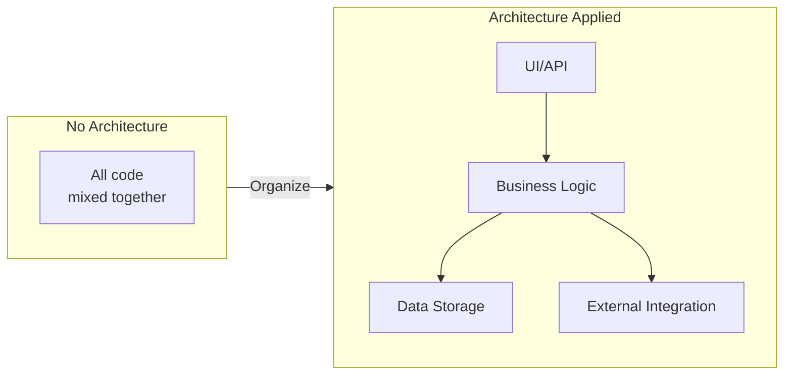
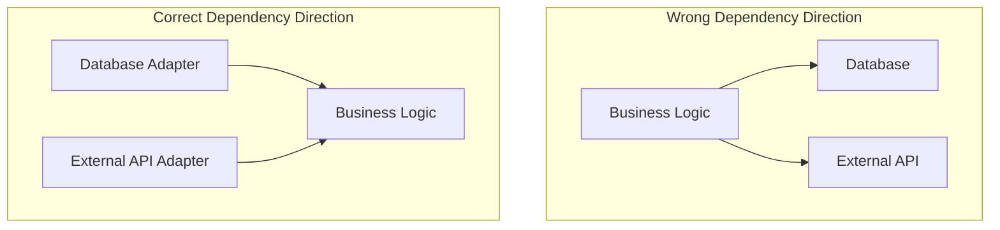
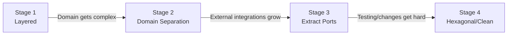

> **Target Audience**: Developers and architects who need to choose project architecture
> **Prerequisites**: Understanding of [Tactical Design](../tactical-design/) building blocks
> **Reading Time**: About 25 minutes
> **Key Question**: "Which should I choose among Layered, Hexagonal, and Clean Architecture?"


Architecture selection criteria: **Layered** (simple, fast development) → **Hexagonal** (easy testing, infrastructure replacement) → **Clean** (complex domain, long-term maintenance)


Let's explore architecture patterns for effectively implementing DDD. A good architecture protects business logic, is flexible to changes, and enables creating systems that are easy to test. Understanding the philosophy and practical application of each pattern helps you make the best choice for your project.

#### Why Do We Need Architecture Patterns?

When first starting a project, having all code in one place is fine. But as time passes and features are added, code becomes increasingly complex and it becomes hard to find what is where. Architecture patterns provide methods to prevent such chaos and organize systems systematically.

**Problems with Spaghetti Code**

Let's look at problems commonly seen in real projects. When all logic is in the Controller: input validation, business logic, database access, external API calls are all in one place.

```java
// ❌ Common problems in real projects
@RestController
public class OrderController {

    @Autowired
    private JdbcTemplate jdbcTemplate;

    @PostMapping("/orders")
    public String createOrder(@RequestBody Map<String, Object> request) {
        // 1. Input validation (in Controller?)
        String customerId = (String) request.get("customerId");
        if (customerId == null) {
            return "Customer ID required";
        }

        // 2. Business logic (in Controller?)
        double total = 0;
        List<Map> items = (List<Map>) request.get("items");
        for (Map item : items) {
            total += (Double) item.get("price") * (Integer) item.get("quantity");
        }

        // 3. Discount calculation (here too?)
        if (total > 100000) {
            total = total * 0.9;
        }

        // 4. Direct database access (in Controller!)
        jdbcTemplate.update(
            "INSERT INTO orders (customer_id, total) VALUES (?, ?)",
            customerId, total
        );

        // 5. Even external API calls...
        restTemplate.postForObject("http://payment-service/pay", ...);

        return "Order complete";
    }
}
```

This code has several problems. First, everything is mixed together so it's hard to find what does what. Second, you can't test without database or external API. Third, modifying one place can cause unexpected bugs elsewhere. Fourth, if the same logic is needed elsewhere, you have to copy and paste. Fifth, conflicts occur when multiple people modify simultaneously.

| Problem | Result |
|---------|--------|
| **Everything is mixed** | Hard to find what does what |
| **Untestable** | Can't test without DB, external API |
| **Risky changes** | Modify one place → bugs elsewhere |
| **Not reusable** | Copy/paste when same logic needed elsewhere |
| **Hard to collaborate** | Conflicts when multiple people modify |

**Purpose of Architecture**

Applying architecture patterns allows systematic organization of code. By clearly separating UI/API layer, business logic layer, data storage layer, and external integration layer, each focuses only on its role.



Using architecture patterns provides several benefits. First, separation of concerns means each part handles only one role. UI handles only user interface, business logic handles only domain rules, repository handles only data storage. Second, business logic can be tested separately. Third, changing database from MySQL to PostgreSQL keeps business logic intact. Fourth, team members can work simultaneously on different layers.

**Core Principle: Dependency Direction**

There's a most important principle shared by all architecture patterns: the direction of dependencies. Business logic (domain) should not depend on anything. Everything else should depend on business logic.



Why should we do it this way? Business logic is the core of the system and most important. It's relatively stable and doesn't change often. On the other hand, databases or external APIs can change. MySQL to PostgreSQL, REST to gRPC can happen. If important things depend on less important things, when less important things change, important things must change too. This is risky and costly. Therefore, invert the dependency direction, put stable things at the center, and make changeable things depend on it.

#### Architecture Patterns at a Glance

There are four main architecture patterns used when implementing DDD. Each pattern structures code slightly differently, but all share the common goal of protecting domain logic.

**4 Major Patterns**

Layered Architecture consists of 4 layers - Presentation, Application, Domain, Infrastructure - with dependencies flowing from top to bottom. Hexagonal Architecture consists of Adapter, Port, Core and isolates Core from the outside. Clean Architecture has a concentric circle structure of Framework, Adapter, Use Case, Entity with dependencies pointing only inward. Onion Architecture has an onion structure of Infrastructure, Application, Domain Service, Domain Model with dependencies pointing toward the center.

```mermaid
flowchart TB
    subgraph Layered["Layered"]
        L1["Presentation"]
        L2["Application"]
        L3["Domain"]
        L4["Infrastructure"]
        L1 --> L2 --> L3 --> L4
    end

    subgraph Hex["Hexagonal"]
        H1["Adapter"]
        H2["Port"]
        H3["Core"]
        H1 --> H2 --> H3
    end

    subgraph Clean["Clean"]
        C1["Framework"]
        C2["Adapter"]
        C3["Use Case"]
        C4["Entity"]
        C1 --> C2 --> C3 --> C4
    end

    subgraph Onion["Onion"]
        O1["Infrastructure"]
        O2["Application"]
        O3["Domain Service"]
        O4["Domain Model"]
        O1 --> O2 --> O3 --> O4
    end
```



**Pattern Comparison**

Comparing the core concept, difficulty, and suitable situations of each pattern helps you choose the right one for your project. Layered Architecture is a 4-layer structure flowing from top to bottom, the easiest to start with, suitable for starting projects or simple projects. Hexagonal Architecture is a structure that isolates external with Port and Adapter, medium difficulty, suitable for projects with many external system integrations. Clean Architecture is a concentric circle structure with strict dependency rules, the most difficult but provides clear structure for large long-term projects. Onion Architecture is an onion structure centered on domain model, medium difficulty, suitable for projects seriously applying DDD.

| Pattern | Core Concept | Difficulty | Best For |
|---------|--------------|------------|----------|
| **[Layered](./layered-architecture/)** | Top-down 4 layers | Easy | Getting started, simple projects |
| **[Hexagonal](./hexagonal-architecture/)** | Isolate external with Port and Adapter | Medium | Projects with many external integrations |
| **[Clean](./clean-architecture/)** | Strict dependency rules | Hard | Large, long-term projects |
| **[Onion](./onion-architecture/)** | Domain model centric | Medium | DDD projects |

**Which Pattern to Choose?**

Choosing the right architecture when starting a project is important. Consider team experience, project size, external integration needs, and whether DDD is being applied. If the team has no experience with architecture patterns, starting with Layered is good. If experienced and the project is large or long-term, consider more advanced patterns. If there are many external system integrations, Hexagonal is advantageous; if seriously applying DDD, Onion is suitable.

**Practical Advice**

If you're new, start with Layered. Working code comes before perfect architecture. Starting with Layered and progressively evolving as needed is realistic. Applying complex architecture to small projects can be over-engineering.

| Situation | Recommended Pattern | Reason |
|-----------|---------------------|--------|
| Startup, MVP | Layered | Fast development is priority |
| Complex business logic | Hexagonal or Onion | Need to protect domain |
| Microservices | Hexagonal | Fits well with service boundaries |
| Large team | Clean | Clear rules for collaboration |
| Legacy integration | Hexagonal | Isolate legacy with ACL |

#### Progressive Evolution Path

No need to apply complex architecture from the start. Architecture can naturally evolve as the project grows. Stage 1 starts with Layered. When domain becomes complex, move to Stage 2 and separate the domain. When external integrations increase, move to Stage 3 and extract Ports. When testing or changes become difficult, move to Stage 4 and apply Hexagonal or Clean architecture.



Knowing the signals for each stage transition helps evolve architecture at the right time. Signals from Stage 1 to 2 are when questions arise like "Should this logic be in the Controller?" or when copying the same logic across multiple Controllers. Signals from Stage 2 to 3 are when you feel "Changing the database means modifying domain too" or when writing tests is difficult due to external dependencies. Signals from Stage 3 to 4 are when the team grows and clear rules are needed, or when investment for long-term maintenance is necessary.

#### Detailed Guides

Detailed explanations for each architecture pattern are available on separate pages. Layered Architecture covers the most basic 4-layer structure, explaining the roles and implementation methods of Presentation, Application, Domain, and Infrastructure layers. Hexagonal Architecture covers how to isolate external with Port and Adapter, placing domain logic at the center and abstracting connections with the outside world. Clean Architecture covers the concentric circle structure with strict dependency rules, explaining the roles and dependency rules of Entity, Use Case, Interface Adapter, and Framework. Onion Architecture covers the onion structure centered on domain model, explaining the layers and relationships of Domain Model, Domain Service, Application Service, and Infrastructure.

1. **Layered Architecture** - The most basic 4-layer structure
2. **Hexagonal Architecture** - Isolate external with Port and Adapter
3. **Clean Architecture** - Concentric circles with strict dependency rules
4. **Onion Architecture** - Onion structure centered on domain model

#### Next Steps

- [CQRS](../cqrs/) - Pattern for separating read and write
- [Event Sourcing](../event-sourcing/) - Storing events instead of state
- [Anti-Patterns](../anti-patterns/) - Common mistakes to avoid
