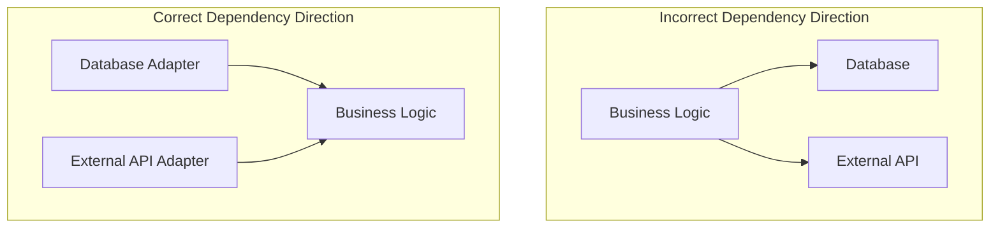
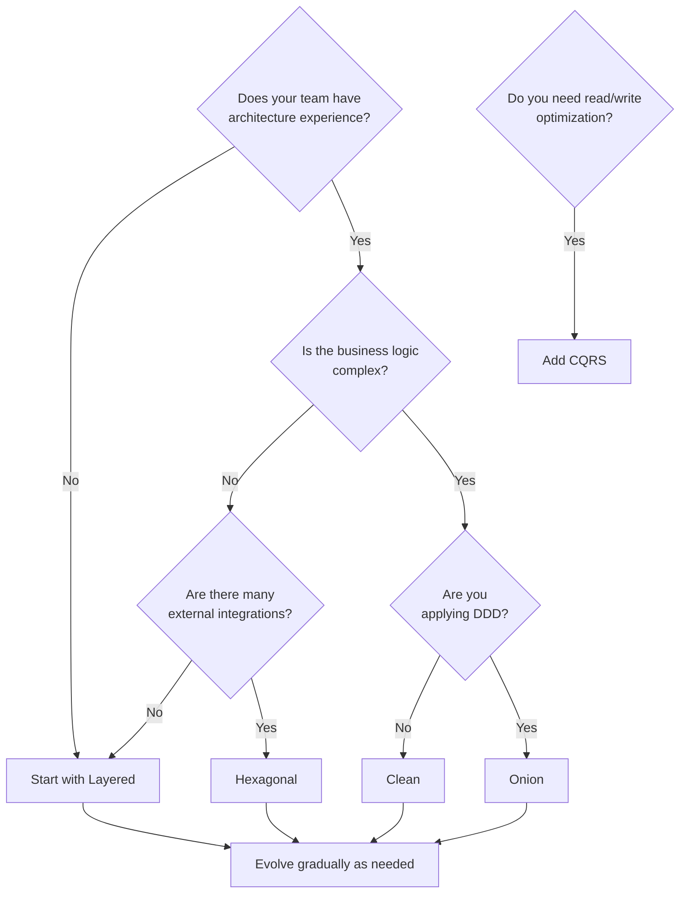
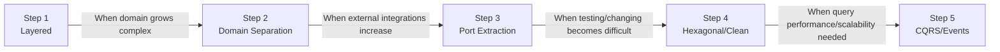

> **Target Audience**: Developers and architects who need to choose a project architecture
> **Prerequisites**: Understanding of [Tactical Design]() building blocks
> **Section Purpose**: Understand the philosophy of architecture patterns and make appropriate choices for your project


This section covers <strong>architecture patterns</strong> for effectively implementing DDD. Good architecture enables you to build systems that protect business logic, are flexible to change, and are easy to test.


## Overview Analogy Table

Here are analogies to understand architecture patterns at a glance.

| Architecture | Analogy | Core Philosophy | One-Line Summary |
|-------------|---------|-----------------|-----------------|
| **[Layered]()** | Building floors | Simple structure flowing from top to bottom | "Separate layers by role" |
| **[Hexagonal]()** | Smartphone and adapters | Isolate external world with Ports/Adapters | "Protect the inside from the outside" |
| **[Clean]()** | Concentric circles of a castle | Dependencies always point inward | "Business rules are king" |
| **[Onion]()** | Onion layers | Domain model at the very center | "Domain is the center of everything" |
| **[CQRS]()** | Separate read/write counters | Complete separation of commands and queries | "Optimize reads and writes separately" |
| **[Event-Driven]()** | Company announcement system | Loose coupling and asynchronous communication | "Announce what happened and react" |

## Why Do You Need Architecture Patterns?

When you first start a project, it is fine to have all the code in one place. But as time passes and features are added, the code becomes increasingly complex and difficult to navigate. Architecture patterns provide methods to prevent this chaos and systematically organize your system.


You can compare software architecture to <strong>building design</strong>:

- **No architecture**: A studio apartment where all rooms are connected. Cooking in the kitchen makes the bedroom smell, and when guests come, you have to tidy up everything.
- **Layered**: A building with designated floors. Ground floor retail, second floor offices, third floor residential. Upper floors depend on lower floors.
- **Hexagonal**: A central hall with multiple entrances. Whether you enter from the front door, back door, or underground parking, you arrive at the same hall. Changing entrances (adapters) does not affect the internal structure.
- **Clean**: A castle with concentric circles. Moat (external world) -> walls (frameworks) -> inner keep (business logic) -> tower (core entities). You can only enter from outside to inside.

**Key question**: "How much do you need to protect your business logic (the tower) from external changes?"


## Core Principle: Dependency Direction

The most important principle shared by all architecture patterns is the direction of dependencies. Business logic (domain) should not depend on anything. Everything else should depend on the business logic.

## Philosophy of Each Architecture Pattern

Each architecture pattern has its own philosophy and design goals.

### Layered Architecture

**Philosophy**: "Separate concerns so each layer focuses on its own role"

- **Background**: Solving the problem of unmaintainable mixed code
- **Core Idea**: Vertical separation, calls only flow from top to bottom
- **Values**: Simplicity, easy to understand, rapid development

### Hexagonal Architecture

**Philosophy**: "Completely isolate the application core from the external world"

- **Background**: Solving the problem of external system changes affecting business logic
- **Core Idea**: Define boundaries with Ports and Adapters
- **Values**: Testability, flexibility in technology replacement

### Clean Architecture

**Philosophy**: "Dependencies must always point inward"

- **Background**: Maintenance issues with framework-dependent code
- **Core Idea**: Strict dependency rules, concentric circle structure
- **Values**: Framework independence, long-term maintainability

### Onion Architecture

**Philosophy**: "The domain model is king. Everything else serves the domain"

- **Background**: Need for a structure to effectively implement DDD
- **Core Idea**: Place the domain model at the very center
- **Values**: Domain purity, DDD-friendliness

### CQRS

**Philosophy**: "Reads and writes are fundamentally different problems, so separate them"

- **Background**: Different optimization requirements for queries and commands
- **Core Idea**: Separate Command and Query models
- **Values**: Optimization tailored to each, scalability

### Event-Driven Architecture

**Philosophy**: "Announce what happened and let interested parties react"

- **Background**: Flexibility issues with tightly coupled systems
- **Core Idea**: Loose coupling through domain events
- **Values**: Scalability, loose coupling, asynchronous processing

## Feature Comparison by Pattern

| Pattern | Core Concept | Difficulty | Suitable For |
|---------|-------------|-----------|-------------|
| **[Layered]()** | 4 layers flowing top to bottom | Easy | Getting started, simple projects |
| **[Hexagonal]()** | Isolate externals with Ports and Adapters | Medium | Projects with many external integrations |
| **[Clean]()** | Strict dependency rules | Hard | Large-scale, long-term projects |
| **[Onion]()** | Domain model centric | Medium | DDD projects |
| **[CQRS]()** | Read/write separation | Hard | Complex queries/performance requirements |
| **[Event-Driven]()** | Domain events | Medium~Hard | Microservices, asynchronous processing |

## Best Practice: Which System Fits Which Architecture?

The appropriate architecture varies depending on project characteristics.

### Recommended Architecture by System Type

| System Type | Recommended Architecture | Reason |
|------------|-------------------------|--------|
| **Startup MVP** | Layered | Speed is priority, minimize complexity |
| **Internal Admin System** | Layered or Hexagonal | Moderate complexity, easy maintenance |
| **E-commerce Platform** | Hexagonal + Event-Driven | Many external integrations, scalability needed |
| **Finance/Insurance System** | Onion or Clean | Complex domain, regulatory compliance |
| **Large Enterprise** | Clean + CQRS | Clear rules, multi-team collaboration |
| **Microservices** | Hexagonal + Event-Driven | Service boundaries, loose coupling |
| **Legacy Integration** | Hexagonal | Isolate legacy with ACL |
| **Reporting-focused** | CQRS | Complex query optimization |

### Selection Flowchart

## Gradual Evolution Path

You do not need to apply a complex architecture from the start. As your project grows, you can naturally evolve the architecture.

### Evolution Signals by Stage

| Current -> Next | Signal |
|----------------|--------|
| Layered -> Domain Separation | "Should this logic really be in the Controller?" |
| Domain Separation -> Port Extraction | "Changing the DB means modifying the domain too" |
| Port Extraction -> Hexagonal/Clean | "The team is growing and we need clear rules" |
| Hexagonal/Clean -> CQRS | "Query performance is the bottleneck" |
| -> Event-Driven | "We need to reduce coupling between services" |

## Learning Order

We recommend learning each architecture pattern in the following order.

### Foundational Architecture

| Order | Document | Key Question |
|-------|----------|-------------|
| 1 | [Layered Architecture]() | "How should you structure your code?" |
| 2 | [Hexagonal Architecture]() | "How should you isolate externals?" |
| 3 | [Clean Architecture]() | "How should you manage dependencies?" |
| 4 | [Onion Architecture]() | "How should you protect the domain?" |

### Advanced Patterns

| Order | Document | Key Question |
|-------|----------|-------------|
| 5 | [CQRS]() | "Should you separate reads and writes?" |
| 6 | [Event-Driven Architecture]() | "How should components communicate?" |

## Next Steps

- **If you are just starting**: Begin with [Layered Architecture]()
- **If you have many external integrations**: Check out [Hexagonal Architecture]()
- **If you are applying DDD**: [Onion Architecture]() is a good fit
- **If query performance matters**: Consider [CQRS]()
