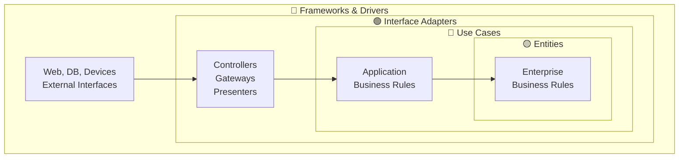
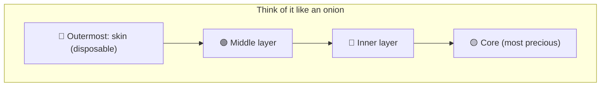
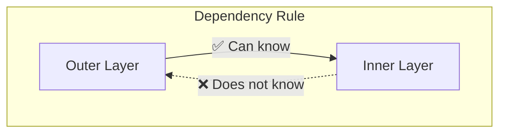
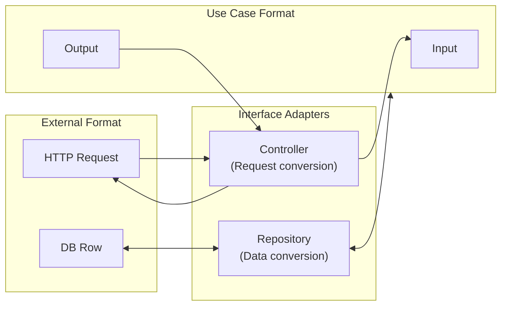
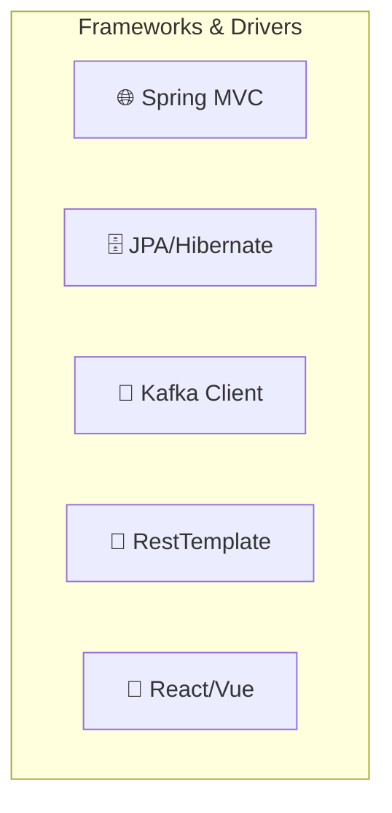
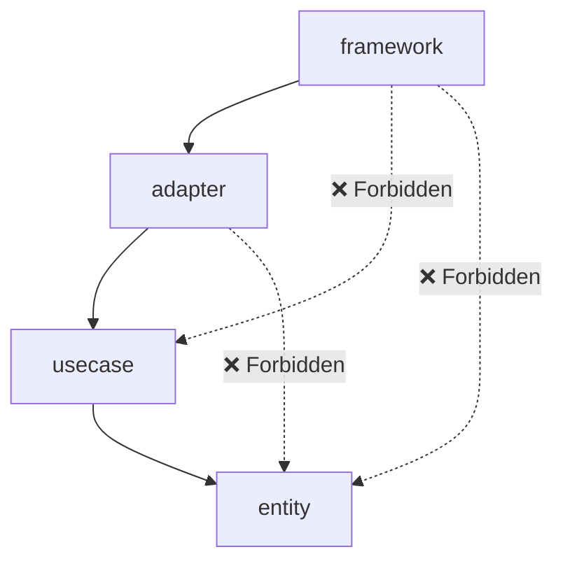
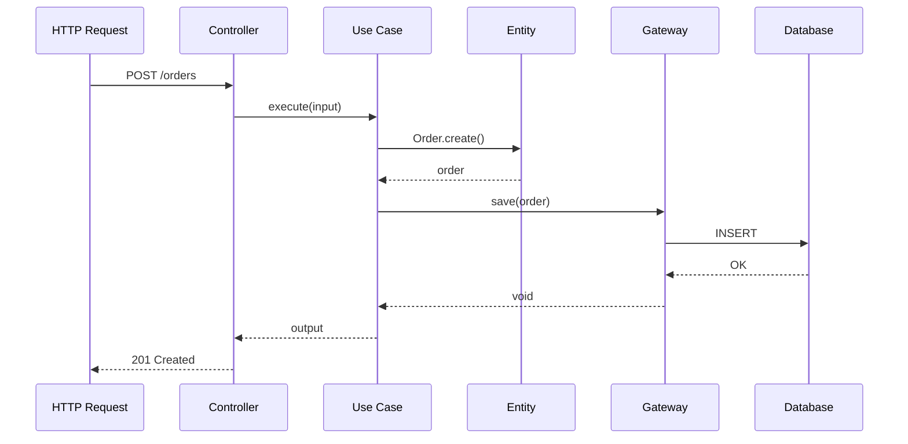
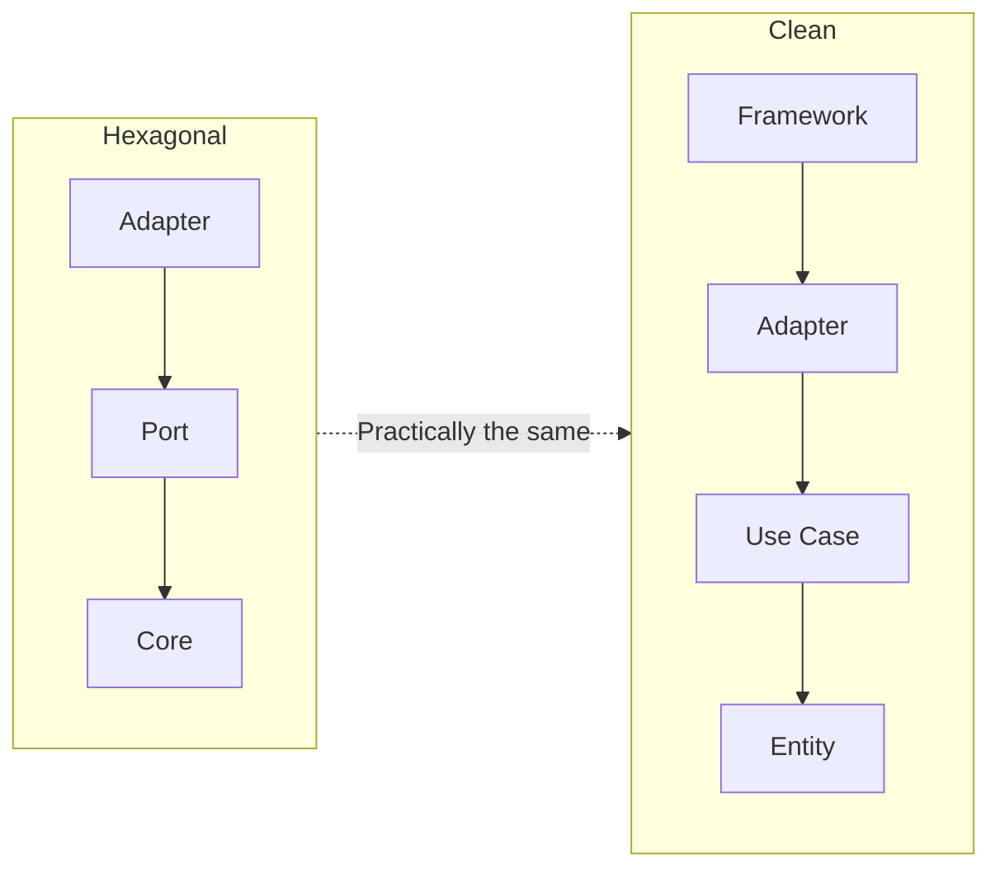
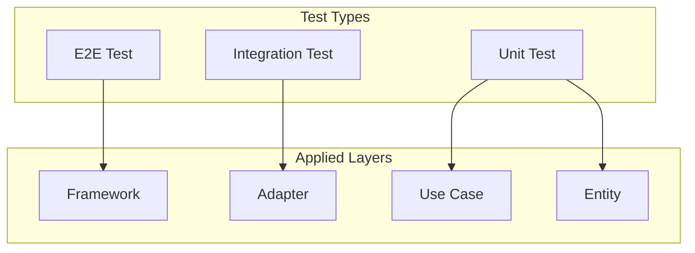
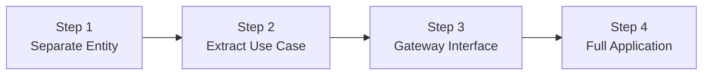

> **Target Audience**: Developers of large-scale projects requiring strict dependency management
> **Prerequisites**: Understanding of [Hexagonal Architecture]()'s Port/Adapter concept
> **Estimated Time**: About 25 minutes

# Clean Architecture

An architecture proposed by Uncle Bob (Robert C. Martin) in 2012. Strictly adhering to the <strong>Dependency Rule</strong> is the core principle.

Clean Architecture emerged from a persistent problem in software development. When business logic is tightly coupled to frameworks or databases, changing the technology stack or writing tests becomes very difficult. For example, if JPA annotations are directly attached to domain objects, testing the domain logic always requires a database connection. Clean Architecture aims to <strong>completely isolate business rules from technical details</strong>.

## One-Line Summary

> **Dependencies always point inward**



---

## Understanding Through "Concentric Circles"

### Analogy: Onion Layers

If you cut an onion, it has multiple layers:



Software is the same:

| Layer | Onion Analogy | Software | Change Frequency |
|-------|--------------|----------|-----------------|
| 🟡 **Core** | Innermost | Business rules | Rarely changes |
| 🔴 **Inner** | Mid-inner | Use Case | Changes occasionally |
| 🟢 **Middle** | Mid-outer | Adapter | Changes often |
| 🔵 **Outer** | Skin | Framework | Replaceable anytime |

**Core idea:** Place the most important thing (business rules) at the innermost level, and less important things (technical details) on the outside.

---

## The Dependency Rule

```
📌 Rule: The inner circle knows nothing about the outer circle
```



**Why is this important?**

```java
// ❌ Rule violation: Entity knows about Framework
public class Order {
    @Entity  // JPA annotation = Framework!
    @Table(name = "orders")
    public void save() {
        // Uses something from Spring...
    }
}

// ✅ Rule compliance: Entity has only pure business logic
public class Order {
    private OrderId id;
    private Money totalAmount;

    public void confirm() {
        // Pure business logic only
        if (!canBeConfirmed()) {
            throw new IllegalStateException("Cannot be confirmed");
        }
        this.status = OrderStatus.CONFIRMED;
    }
}
```

---

## 4 Layers in Detail

### 1. Entities - 🟡 Innermost

Where <strong>core business rules</strong> reside. Rules shared across the entire company.

```
Example: "Orders over 1 million won classify the customer as VIP"
    → This rule is the same regardless of which system uses it
```

```java
// Entities Layer
public class Order {
    private OrderId id;
    private CustomerId customerId;
    private List<OrderLine> lines;
    private OrderStatus status;
    private Money totalAmount;

    // Core business rules
    public void confirm() {
        validateCanConfirm();
        this.status = OrderStatus.CONFIRMED;
    }

    public void cancel() {
        validateCanCancel();
        this.status = OrderStatus.CANCELLED;
    }

    public boolean isVipOrder() {
        return totalAmount.isGreaterThan(Money.of(1_000_000));
    }

    private void validateCanConfirm() {
        if (status != OrderStatus.PENDING) {
            throw new InvalidOrderStateException("Can only be confirmed in PENDING state");
        }
        if (lines.isEmpty()) {
            throw new EmptyOrderException("No order items");
        }
    }
}
```

```java
// Value Object (included in Entities Layer)
public record Money(BigDecimal amount, Currency currency) {

    public Money {
        if (amount.compareTo(BigDecimal.ZERO) < 0) {
            throw new IllegalArgumentException("Amount must be 0 or greater");
        }
    }

    public boolean isGreaterThan(Money other) {
        return this.amount.compareTo(other.amount) > 0;
    }

    public Money add(Money other) {
        validateSameCurrency(other);
        return new Money(this.amount.add(other.amount), this.currency);
    }
}
```


**Entity Characteristics**
- Does not depend on any framework
- Pure Java object (POJO)
- Business rules expressed as methods
- Easiest to test


---

### 2. Use Cases - 🔴

Where <strong>application business rules</strong> reside. Defines how things work "in this system."

```
Example: "For web orders: check inventory → payment → confirm order → notify"
    → This is our system's specific flow
```

```java
// Use Case Interface (Input Port)
public interface CreateOrderUseCase {
    CreateOrderOutput execute(CreateOrderInput input);
}

// Input (Request Model)
public record CreateOrderInput(
    String customerId,
    List<OrderLineInput> lines
) {}

// Output (Response Model)
public record CreateOrderOutput(
    String orderId,
    String status,
    BigDecimal totalAmount
) {}
```

```java
// Use Case implementation (Interactor)
public class CreateOrderInteractor implements CreateOrderUseCase {

    // Output Ports (connections to external systems via interfaces)
    private final OrderRepository orderRepository;
    private final InventoryGateway inventoryGateway;
    private final PaymentGateway paymentGateway;

    @Override
    public CreateOrderOutput execute(CreateOrderInput input) {
        // 1. Check inventory
        for (OrderLineInput line : input.lines()) {
            if (!inventoryGateway.checkAvailability(line.productId(), line.quantity())) {
                throw new InsufficientInventoryException(line.productId());
            }
        }

        // 2. Create Entity (core business logic is in the Entity)
        Order order = Order.create(
            CustomerId.of(input.customerId()),
            toOrderLines(input.lines())
        );

        // 3. Save
        orderRepository.save(order);

        // 4. Generate Output
        return new CreateOrderOutput(
            order.getId().getValue(),
            order.getStatus().name(),
            order.getTotalAmount().getAmount()
        );
    }
}
```


**Use Case Rules**

1. **Use Entities only** - Use Case calls Entity, and Entity performs the actual business logic
2. **Use Gateway interfaces** - External systems are abstracted through interfaces
3. **Input/Output objects** - Define objects for data exchange with the outside


---

### 3. Interface Adapters - 🟢

Responsible for <strong>data conversion</strong>. Converts between the format Use Cases want and the format external systems want.



**Three types of Adapter:**

| Adapter | Role | Example |
|---------|------|---------|
| **Controller** | HTTP Request -> Use Case Input | REST Controller |
| **Presenter** | Use Case Output -> HTTP Response | View Model creation |
| **Gateway** | Use Case Request -> External System | Repository implementation |

```java
// Controller (HTTP -> Use Case)
@RestController
@RequestMapping("/api/orders")
public class OrderController {

    private final CreateOrderUseCase createOrderUseCase;

    @PostMapping
    public ResponseEntity<OrderResponse> createOrder(
            @RequestBody CreateOrderRequest request) {

        // 1. Convert HTTP Request -> Use Case Input
        CreateOrderInput input = new CreateOrderInput(
            request.customerId(),
            request.items().stream()
                .map(this::toOrderLineInput)
                .toList()
        );

        // 2. Execute Use Case
        CreateOrderOutput output = createOrderUseCase.execute(input);

        // 3. Convert Use Case Output -> HTTP Response
        OrderResponse response = new OrderResponse(
            output.orderId(),
            output.status(),
            output.totalAmount()
        );

        return ResponseEntity.status(HttpStatus.CREATED).body(response);
    }
}

// Gateway implementation (Repository)
@Repository
public class JpaOrderRepository implements OrderRepository {

    private final OrderJpaRepository jpaRepository;
    private final OrderDataMapper mapper;

    @Override
    public void save(Order order) {
        // Domain Entity -> JPA Entity conversion
        JpaOrderEntity entity = mapper.toJpaEntity(order);
        jpaRepository.save(entity);
    }

    @Override
    public Optional<Order> findById(OrderId id) {
        // JPA Entity -> Domain Entity conversion
        return jpaRepository.findById(id.getValue())
            .map(mapper::toDomain);
    }
}
```

---

### 4. Frameworks & Drivers - 🔵 Outermost

Where <strong>external tools</strong> reside. Can be replaced at any time.



```java
// Framework Layer: Spring configuration
@Configuration
public class OrderConfig {

    @Bean
    public CreateOrderUseCase createOrderUseCase(
            OrderRepository orderRepository,
            InventoryGateway inventoryGateway) {
        return new CreateOrderInteractor(orderRepository, inventoryGateway);
    }
}

// Framework Layer: JPA Entity
@Entity
@Table(name = "orders")
public class JpaOrderEntity {
    @Id
    private String id;
    private String customerId;
    private String status;
    private BigDecimal totalAmount;

    @OneToMany(mappedBy = "order", cascade = CascadeType.ALL)
    private List<JpaOrderLineEntity> lines;
}

// Framework Layer: Spring Data Repository
public interface OrderJpaRepository extends JpaRepository<JpaOrderEntity, String> {
}
```


**Framework Layer's Role**
- Configuration of external tools like Spring, JPA, Kafka
- Dependency injection configuration (Bean registration)
- Handles only technical details


---

## Package Structure

```
com.example.order/
│
├── entity/                          # 🟡 Entities (innermost)
│   ├── Order.java
│   ├── OrderLine.java
│   ├── OrderId.java
│   ├── OrderStatus.java
│   └── Money.java
│
├── usecase/                         # 🔴 Use Cases
│   ├── port/
│   │   ├── in/                      # Input Ports (Use Case Interfaces)
│   │   │   ├── CreateOrderUseCase.java
│   │   │   ├── CreateOrderInput.java
│   │   │   └── CreateOrderOutput.java
│   │   └── out/                     # Output Ports (Gateway Interfaces)
│   │       ├── OrderRepository.java
│   │       ├── InventoryGateway.java
│   │       └── PaymentGateway.java
│   └── interactor/                  # Use Case Implementations
│       ├── CreateOrderInteractor.java
│       └── ConfirmOrderInteractor.java
│
├── adapter/                         # 🟢 Interface Adapters
│   ├── controller/
│   │   ├── OrderController.java
│   │   ├── CreateOrderRequest.java
│   │   └── OrderResponse.java
│   ├── presenter/
│   │   └── OrderPresenter.java
│   └── gateway/
│       ├── persistence/
│       │   ├── JpaOrderRepository.java
│       │   └── OrderDataMapper.java
│       └── external/
│           └── InventoryGatewayImpl.java
│
└── framework/                       # 🔵 Frameworks & Drivers (outermost)
    ├── config/
    │   └── OrderConfig.java
    └── persistence/
        ├── JpaOrderEntity.java
        └── OrderJpaRepository.java
```

---

## Dependency Flow in Detail

### Compile-Time Dependencies



### Runtime Flow (Actual Call Sequence)



---

## Difference Between Hexagonal and Clean

Both have similar goals, but different perspectives:

| Perspective | Hexagonal | Clean |
|------------|-----------|-------|
| **Shape** | Hexagon (inside/outside) | Concentric circles (layers) |
| **Emphasis** | Port/Adapter separation | Dependency Rule |
| **Use Case** | Application Service | Interactor |
| **External Connection** | Port | Gateway Interface |
| **Naming Convention** | ~Port, ~Adapter | ~UseCase, ~Gateway |
| **Number of Layers** | 3 (Adapter, Port, Core) | 4 (FW, Adapter, UC, Entity) |



---

## Common Mistakes

### 1. Framework Code in Entity

```java
// ❌ Wrong: Entity depends on JPA
@Entity  // JPA annotation!
public class Order {
    @Id
    @GeneratedValue
    private Long id;

    @Transactional  // Spring annotation!
    public void confirm() { ... }
}

// ✅ Correct: Pure Entity
public class Order {
    private OrderId id;
    private OrderStatus status;

    public void confirm() {
        // Pure business logic only
    }
}
```

### 2. Use Case Knows About HTTP

```java
// ❌ Wrong: Use Case uses HTTP objects
public class CreateOrderInteractor {
    public ResponseEntity<?> execute(HttpServletRequest request) {
        // Use Case should not know about HTTP!
    }
}

// ✅ Correct: Pure Input/Output
public class CreateOrderInteractor {
    public CreateOrderOutput execute(CreateOrderInput input) {
        // Pure objects unrelated to HTTP
    }
}
```

### 3. Interactor Directly Calls Presenter

```java
// ❌ Wrong: Interactor depends on Presenter
public class CreateOrderInteractor {
    private final OrderPresenter presenter;  // Depends on Adapter!

    public void execute(CreateOrderInput input) {
        Order order = ...;
        presenter.present(order);  // Not allowed!
    }
}

// ✅ Correct: Return Output object
public class CreateOrderInteractor {
    public CreateOrderOutput execute(CreateOrderInput input) {
        Order order = ...;
        return new CreateOrderOutput(order.getId(), ...);  // Return Output
    }
}
```

### 4. Using Gateway Implementation Directly in Use Case

```java
// ❌ Wrong: Depends on concrete class
public class CreateOrderInteractor {
    private final JpaOrderRepository repository;  // Concrete class!
}

// ✅ Correct: Depends on interface
public class CreateOrderInteractor {
    private final OrderRepository repository;  // Interface!
}
```

---

## Testing Strategy

### Testing by Layer



### 1. Entity Test (Purest)

```java
class OrderTest {

    @Test
    void order_confirmation_succeeds() {
        Order order = Order.create(
            CustomerId.of("c1"),
            List.of(new OrderLine(ProductId.of("p1"), 2, Money.of(10000)))
        );

        order.confirm();

        assertThat(order.getStatus()).isEqualTo(OrderStatus.CONFIRMED);
    }

    @Test
    void vip_order_detection() {
        Order order = createOrderWithTotal(Money.of(1_500_000));

        assertThat(order.isVipOrder()).isTrue();
    }
}
```

### 2. Use Case Test (Gateway Mock)

```java
@ExtendWith(MockitoExtension.class)
class CreateOrderInteractorTest {

    @Mock private OrderRepository orderRepository;
    @Mock private InventoryGateway inventoryGateway;

    private CreateOrderInteractor interactor;

    @BeforeEach
    void setUp() {
        interactor = new CreateOrderInteractor(orderRepository, inventoryGateway);
    }

    @Test
    void order_creation_succeeds() {
        // Given
        when(inventoryGateway.checkAvailability(any(), anyInt())).thenReturn(true);

        CreateOrderInput input = new CreateOrderInput(
            "customer-1",
            List.of(new OrderLineInput("product-1", 2, 10000))
        );

        // When
        CreateOrderOutput output = interactor.execute(input);

        // Then
        verify(orderRepository).save(any(Order.class));
        assertThat(output.orderId()).isNotNull();
        assertThat(output.status()).isEqualTo("PENDING");
    }

    @Test
    void throws_exception_on_insufficient_inventory() {
        when(inventoryGateway.checkAvailability(any(), anyInt())).thenReturn(false);

        CreateOrderInput input = new CreateOrderInput(
            "customer-1",
            List.of(new OrderLineInput("product-1", 100, 10000))
        );

        assertThrows(InsufficientInventoryException.class,
            () -> interactor.execute(input));
    }
}
```

### 3. Adapter Test (Integration)

```java
@WebMvcTest(OrderController.class)
class OrderControllerTest {

    @Autowired private MockMvc mockMvc;
    @MockBean private CreateOrderUseCase createOrderUseCase;

    @Test
    void create_order_api() throws Exception {
        when(createOrderUseCase.execute(any()))
            .thenReturn(new CreateOrderOutput("order-123", "PENDING", BigDecimal.valueOf(20000)));

        mockMvc.perform(post("/api/orders")
                .contentType(MediaType.APPLICATION_JSON)
                .content("""
                    {
                        "customerId": "c1",
                        "items": [{"productId": "p1", "quantity": 2, "price": 10000}]
                    }
                    """))
            .andExpect(status().isCreated())
            .andExpect(jsonPath("$.orderId").value("order-123"));
    }
}
```

---

## When Should You Use Clean Architecture?

### Suitable Cases

- Larg-scale projects requiring long-term maintenance
- Multiple teams collaborating (clear boundaries needed)
- Complex business logic
- Test coverage is important
- Technology stack changes are possible

### Unsuitable Cases

- Small-scale, short-term projects -> Over-engineering
- Simple CRUD applications
- Team is unfamiliar with the architecture -> Start with [Layered]()
- MVP, prototype development

### Best Practice: Which Systems Fit?

| System Type | Fit | Reason |
|------------|-----|--------|
| **Large Enterprise** | Very suitable | Clear rules enable large team collaboration |
| **Finance/Insurance System** | Very suitable | Complex domain, regulatory compliance needed |
| **Long-term Maintenance System** | Suitable | Structure resistant to change |
| **Multi-platform** | Suitable | Reuse same business logic across web/mobile/CLI |
| **Regulated Industry** | Suitable | Audit tracking, easy to test |
| **Startup MVP** | Unsuitable | Over-engineering, rapid development takes priority |
| **Prototype** | Unsuitable | Frequent changes make it counterproductive |
| **Small Team** | Unsuitable | Burden from increased file count |

---

## File Count Comparison

File count difference when implementing the same feature:

```
Feature: Order Creation API

=== Layered (5 files) ===
├── OrderController.java
├── OrderService.java
├── OrderRepository.java
├── Order.java
└── OrderDto.java

=== Clean (12+ files) ===
├── entity/
│   └── Order.java
├── usecase/
│   ├── port/in/
│   │   ├── CreateOrderUseCase.java
│   │   ├── CreateOrderInput.java
│   │   └── CreateOrderOutput.java
│   ├── port/out/
│   │   └── OrderRepository.java
│   └── interactor/
│       └── CreateOrderInteractor.java
├── adapter/
│   ├── controller/
│   │   ├── OrderController.java
│   │   └── OrderRequest.java
│   └── gateway/
│       └── JpaOrderRepository.java
└── framework/
    └── JpaOrderEntity.java
```

**What you gain by having more files:**
- Clear responsibility for each file
- Easy to test
- Small impact scope from changes

---

## Gradual Adoption

You do not need to convert everything to Clean Architecture at once:



### Step 1: Separate Entity

```java
// Move business logic from Service to Entity
// Before
public class OrderService {
    public void confirm(Order order) {
        if (order.getStatus().equals("PENDING")) {
            order.setStatus("CONFIRMED");
        }
    }
}

// After
public class Order {
    public void confirm() {
        if (this.status != OrderStatus.PENDING) {
            throw new IllegalStateException();
        }
        this.status = OrderStatus.CONFIRMED;
    }
}
```

### Step 2: Extract Use Case

```java
// Abstract Service into Use Case interface
public interface ConfirmOrderUseCase {
    void execute(OrderId orderId);
}

public class ConfirmOrderInteractor implements ConfirmOrderUseCase {
    // ...
}
```

### Step 3: Gateway Interface

```java
// Repository as Gateway interface
public interface OrderRepository {
    void save(Order order);
    Optional<Order> findById(OrderId id);
}
```

---

## Next Steps

- [Onion Architecture]() - Domain model centric
- [Hexagonal Architecture]() - Port and Adapter perspective
- [CQRS]() - Read/write separation
