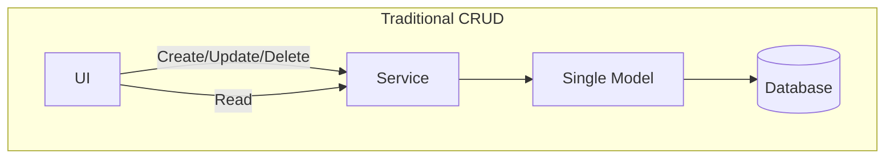
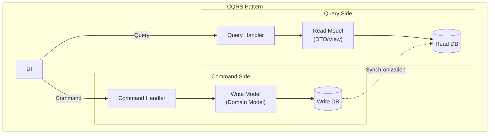
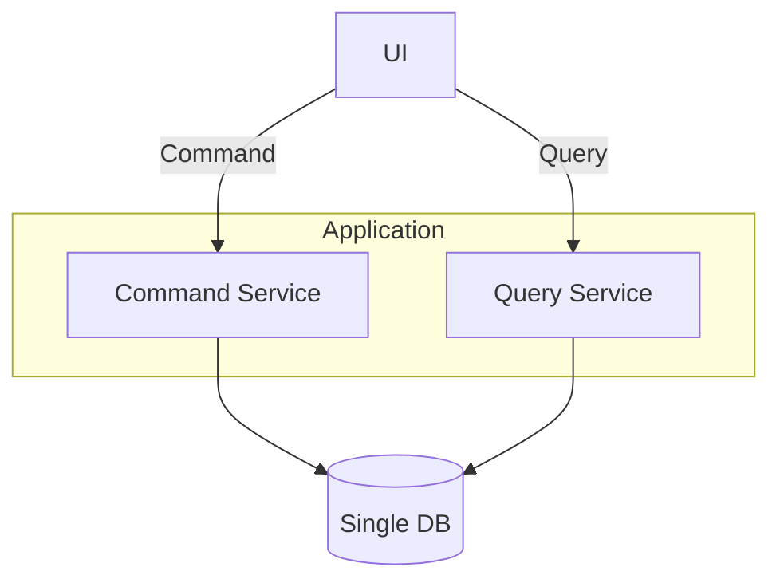
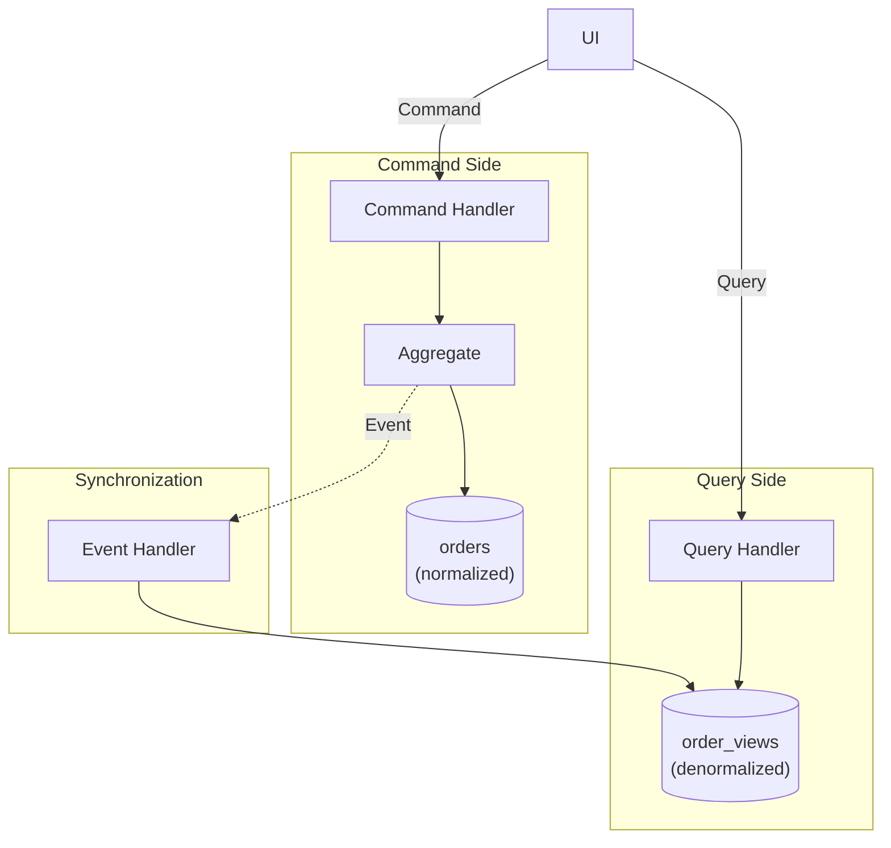
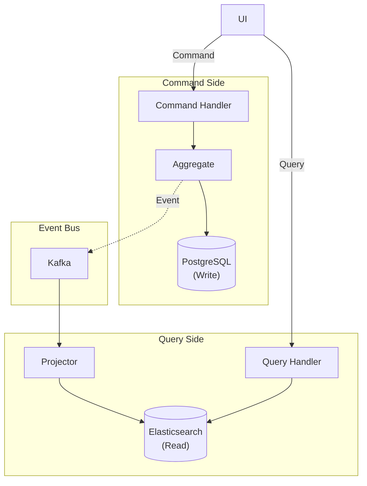
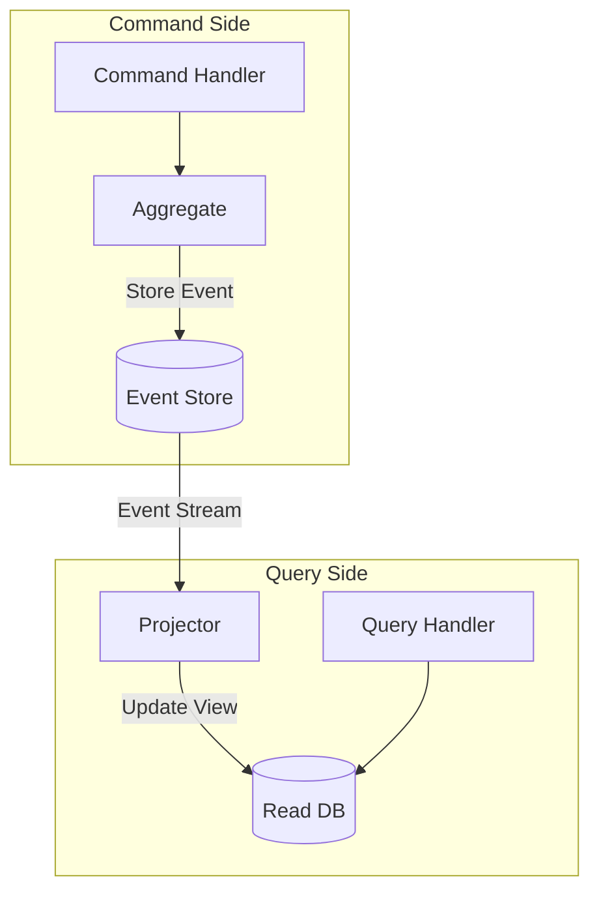

> **Target Audience**: Developers designing systems with complex query requirements or performance optimization needs
> **Prerequisites**: [Event-Driven Architecture]() or basic understanding of event-driven architecture concepts
> **Estimated Time**: About 35 minutes
> **Key Question**: "When should you separate read and write models?"


CQRS core: Separate <strong>Command</strong> (state changes, uses domain model) and <strong>Query</strong> (reads, uses optimized read model) to optimize each according to its requirements



You can compare CQRS to <strong>library operations</strong>:

- **Traditional approach (single model)**: A librarian handles both book checkout/return and book search requests. When checkouts pile up, searches slow down, and when searches increase, checkouts slow down.
- **CQRS approach**: Separate the checkout clerk (Command) and the search librarian (Query). The checkout clerk changes the status of books, while the search librarian uses optimized indexes to respond quickly.

**Key point**: Because checkout (writes) and search (reads) have different requirements, you handle each in an optimized manner. Checkouts require consistency, while searches require speed.


Let us examine the pattern that separates command (write) and query (read) responsibilities. CQRS stands for Command Query Responsibility Segregation, a pattern that separates a system's read and write operations into separate models so each can be optimized independently. It is a powerful architecture pattern that can effectively handle complex domain logic and diverse query requirements.

#### Why CQRS?

Understanding the limitations of the traditional CRUD approach reveals why CQRS is needed. In the traditional approach, a single model is used for both reads and writes, which works well for simple applications but causes various problems as complexity increases.

**Limitations of Traditional CRUD**

Traditional CRUD systems access the database through a single model via a Service from the UI. Create, update, delete, and read operations all use the same model and the same path. This structure is simple but has several drawbacks.



Key problems include polluting the domain model to support complex queries. For example, adding read-only methods to domain entities to obtain reporting data degrades domain model purity. Also, the optimization requirements for queries and commands are fundamentally different. Queries need fast responses and benefit from denormalized data, while commands need consistency and transactions with normalized data. Finally, since reads and writes have different load patterns but share the same database, independent scaling is difficult.

**Benefits of CQRS Structure**

CQRS completely separates commands and queries. The Command Side uses the write model (domain model) to access the Write DB, and the Query Side uses the read model (DTO/View) to access the Read DB. Synchronization between the two DBs occurs through events.



This structure allows the domain model to focus purely on business logic while the read model can be freely designed in a UI-optimized format. Each can be independently scaled and optimized, improving both performance and maintainability.

#### Implementation Levels

CQRS does not need to be perfectly implemented all at once. It can be applied incrementally based on the project's complexity and requirements. There are three main levels, each with different complexity and benefits.

**Level 1: Single DB, Code Separation**

The simplest form uses a single database but separates commands and queries at the code level. This approach applies CQRS concepts while minimizing infrastructure complexity.



The Command Service uses the domain model to execute business logic and change state. It manages transactions and validates domain rules. The Query Service directly retrieves DTOs for fast data return. It uses read-only transactions and writes queries optimized for reading.

```java
// Command Service - uses domain model
@Service
@Transactional
public class OrderCommandService {

    private final OrderRepository orderRepository;

    public OrderId createOrder(CreateOrderCommand command) {
        Order order = Order.create(
            command.getCustomerId(),
            command.getOrderLines()
        );
        return orderRepository.save(order).getId();
    }

    public void confirmOrder(ConfirmOrderCommand command) {
        Order order = orderRepository.findById(command.getOrderId())
            .orElseThrow();
        order.confirm();
        orderRepository.save(order);
    }
}

// Query Service - direct DTO retrieval
@Service
@Transactional(readOnly = true)
public class OrderQueryService {

    private final OrderQueryRepository queryRepository;

    public OrderDetailView getOrderDetail(String orderId) {
        return queryRepository.findOrderDetailById(orderId)
            .orElseThrow(() -> new OrderNotFoundException(orderId));
    }

    public Page<OrderSummaryView> getOrderList(OrderSearchCriteria criteria, Pageable pageable) {
        return queryRepository.searchOrders(criteria, pageable);
    }
}

// Query-only Repository
public interface OrderQueryRepository {

    @Query("""
        SELECT new com.example.order.query.OrderDetailView(
            o.id, o.status, o.totalAmount, o.createdAt,
            c.name, c.email
        )
        FROM OrderEntity o
        JOIN o.customer c
        WHERE o.id = :orderId
        """)
    Optional<OrderDetailView> findOrderDetailById(@Param("orderId") String orderId);

    @Query("""
        SELECT new com.example.order.query.OrderSummaryView(
            o.id, o.status, o.totalAmount, o.createdAt
        )
        FROM OrderEntity o
        WHERE (:status IS NULL OR o.status = :status)
        AND (:customerId IS NULL OR o.customerId = :customerId)
        """)
    Page<OrderSummaryView> searchOrders(
        @Param("status") OrderStatus status,
        @Param("customerId") String customerId,
        Pageable pageable
    );
}

// Query result DTOs
public record OrderDetailView(
    String orderId,
    String status,
    BigDecimal totalAmount,
    LocalDateTime createdAt,
    String customerName,
    String customerEmail
) {}

public record OrderSummaryView(
    String orderId,
    String status,
    BigDecimal totalAmount,
    LocalDateTime createdAt
) {}
```

In this code, the Command Service uses the Order domain model to execute business logic. The confirm method changes state through the order entity's internal validation logic. The Query Service directly retrieves DTOs like OrderDetailView, returning needed data immediately without going through the domain model.

**Level 2: Separated Read Model**

The second stage creates separate query-only tables or views. Writes go to normalized tables, reads come from denormalized tables. This greatly improves query performance and allows data retrieval without complex joins.



In this structure, domain events are published when orders are created or statuses change. The event handler receives these and updates the read model. The read model is denormalized for fast queries without complex joins.

```java
// Write Side: Domain Event publishing
public class Order extends AggregateRoot<OrderId> {

    public void confirm() {
        this.status = OrderStatus.CONFIRMED;
        registerEvent(new OrderConfirmedEvent(
            this.id,
            this.customerId,
            this.totalAmount,
            LocalDateTime.now()
        ));
    }
}

// Read Model synchronization
@Component
public class OrderViewProjector {

    private final OrderViewRepository viewRepository;

    @TransactionalEventListener
    public void on(OrderCreatedEvent event) {
        OrderView view = new OrderView();
        view.setOrderId(event.getOrderId().getValue());
        view.setCustomerId(event.getCustomerId().getValue());
        view.setStatus("PENDING");
        view.setTotalAmount(event.getTotalAmount().amount());
        view.setCreatedAt(event.getCreatedAt());
        viewRepository.save(view);
    }

    @TransactionalEventListener
    public void on(OrderConfirmedEvent event) {
        OrderView view = viewRepository.findById(event.getOrderId().getValue())
            .orElseThrow();
        view.setStatus("CONFIRMED");
        view.setConfirmedAt(event.getConfirmedAt());
        viewRepository.save(view);
    }

    @TransactionalEventListener
    public void on(OrderCancelledEvent event) {
        OrderView view = viewRepository.findById(event.getOrderId().getValue())
            .orElseThrow();
        view.setStatus("CANCELLED");
        view.setCancelledAt(event.getCancelledAt());
        view.setCancellationReason(event.getReason());
        viewRepository.save(view);
    }
}

// Read Model Entity (denormalized)
@Entity
@Table(name = "order_views")
public class OrderView {
    @Id
    private String orderId;
    private String customerId;
    private String customerName;     // Denormalized: no Customer table join needed
    private String customerEmail;    // Denormalized
    private String status;
    private BigDecimal totalAmount;
    private LocalDateTime createdAt;
    private LocalDateTime confirmedAt;
    private LocalDateTime cancelledAt;
    private String cancellationReason;
    private int itemCount;           // Denormalized: pre-aggregated value
}

// Query becomes simple
@Service
public class OrderQueryService {

    private final OrderViewRepository viewRepository;

    public OrderView getOrder(String orderId) {
        return viewRepository.findById(orderId).orElseThrow();
    }

    public Page<OrderView> searchOrders(String customerId, String status, Pageable pageable) {
        return viewRepository.findByCustomerIdAndStatus(customerId, status, pageable);
    }
}
```

Looking at the OrderView entity, fields like customerName and customerEmail are denormalized. When querying, you can get all needed information by querying only OrderView without joining the Customer table. Pre-calculated aggregate values like itemCount also make queries very fast.

**Level 3: Separated DB**

The most advanced form uses completely different databases for writes and reads. For writes, you can use an RDBMS like PostgreSQL that supports transactions well, and for reads, a NoSQL solution like Elasticsearch that specializes in search. The two DBs are synchronized through an event bus like Kafka.



In this structure, command processing and querying are completely independent. Each uses a different database, so problems in one do not affect the other. Even if the read DB goes down, writes continue working, and you can rebuild the read DB.

```java
// Event publishing (Kafka)
@Component
public class OrderEventPublisher {

    private final KafkaTemplate<String, DomainEvent> kafkaTemplate;

    @TransactionalEventListener(phase = TransactionPhase.AFTER_COMMIT)
    public void publishToKafka(OrderConfirmedEvent event) {
        kafkaTemplate.send("order-events", event.getOrderId().getValue(), event);
    }
}

// Read Side: Elasticsearch Projector
@Component
public class ElasticsearchOrderProjector {

    private final ElasticsearchOperations elasticsearchOperations;

    @KafkaListener(topics = "order-events", groupId = "order-view-projector")
    public void handle(DomainEvent event) {
        if (event instanceof OrderCreatedEvent e) {
            OrderDocument doc = new OrderDocument();
            doc.setOrderId(e.getOrderId().getValue());
            doc.setCustomerId(e.getCustomerId().getValue());
            doc.setStatus("PENDING");
            doc.setTotalAmount(e.getTotalAmount().amount());
            doc.setCreatedAt(e.getCreatedAt());
            elasticsearchOperations.save(doc);
        } else if (event instanceof OrderConfirmedEvent e) {
            OrderDocument doc = elasticsearchOperations.get(
                e.getOrderId().getValue(), OrderDocument.class);
            doc.setStatus("CONFIRMED");
            doc.setConfirmedAt(e.getConfirmedAt());
            elasticsearchOperations.save(doc);
        }
    }
}

// Read Model: Elasticsearch Document
@Document(indexName = "orders")
public class OrderDocument {
    @Id
    private String orderId;
    private String customerId;
    private String customerName;
    private String status;
    private BigDecimal totalAmount;
    private LocalDateTime createdAt;
    private LocalDateTime confirmedAt;
    // Full-text search field
    private String searchableText;
}

// Query Service: Using Elasticsearch
@Service
public class OrderQueryService {

    private final ElasticsearchOperations elasticsearchOperations;

    public SearchHits<OrderDocument> search(String keyword, String status, Pageable pageable) {
        Query query = NativeQuery.builder()
            .withQuery(q -> q
                .bool(b -> b
                    .must(m -> m.match(t -> t.field("searchableText").query(keyword)))
                    .filter(f -> f.term(t -> t.field("status").value(status)))
                )
            )
            .withPageable(pageable)
            .build();

        return elasticsearchOperations.search(query, OrderDocument.class);
    }
}
```

Using Elasticsearch enables full-text search, diverse filtering, and aggregation features. Putting all order-related text in the searchableText field allows users to find related orders regardless of their search keyword.

#### CQRS + Event Sourcing

CQRS is frequently used with Event Sourcing. Event Sourcing is a pattern that stores all state changes as events, and combining it with CQRS creates a very powerful system.



On the Command Side, only events are stored. The current state is derived by replaying events. On the Query Side, the event stream is subscribed to generate read-only views. This provides complete audit trails and fast query performance simultaneously.

```java
// Event Store
public interface OrderEventStore {
    void append(OrderId orderId, List<DomainEvent> events, long expectedVersion);
    List<DomainEvent> getEvents(OrderId orderId);
}

// Command Handler with Event Sourcing
@Service
public class OrderCommandHandler {

    private final OrderEventStore eventStore;

    public void handle(ConfirmOrderCommand command) {
        // 1. Restore Aggregate from event stream
        List<DomainEvent> events = eventStore.getEvents(command.getOrderId());
        Order order = Order.fromEvents(events);

        // 2. Execute command
        order.confirm();

        // 3. Save new events
        eventStore.append(
            command.getOrderId(),
            order.getDomainEvents(),
            events.size()  // Optimistic concurrency
        );
    }
}

// Aggregate: Restore from events
public class Order {

    public static Order fromEvents(List<DomainEvent> events) {
        Order order = new Order();
        for (DomainEvent event : events) {
            order.apply(event);
        }
        return order;
    }

    private void apply(DomainEvent event) {
        if (event instanceof OrderCreatedEvent e) {
            this.id = e.getOrderId();
            this.customerId = e.getCustomerId();
            this.status = OrderStatus.PENDING;
        } else if (event instanceof OrderConfirmedEvent e) {
            this.status = OrderStatus.CONFIRMED;
            this.confirmedAt = e.getConfirmedAt();
        }
        // ...
    }
}
```

The advantage of this approach is that all change history is preserved. You can know exactly how an order reached its current state, and if needed, you can reproduce the state at any specific point in the past. Also, if a new read model is needed, you can create it anytime by replaying the event stream.

#### Practical Guide

You should be careful when introducing CQRS. It is not necessary for every project, and incorrect application only increases unnecessary complexity. You must clearly understand when to use CQRS and when to avoid it.

**When CQRS Is Suitable**

CQRS shines in complex domains. When the domain model is complex, you can keep the Write model pure while freely designing the Read model. In systems where query performance is important, you can guarantee fast responses by optimizing the Read model. When various query forms are needed, you can create multiple Read models for different purposes. For example, you can implement detailed queries for administrators, summary queries for users, and aggregate queries for reporting as separate models. If you are using event-driven architecture, CQRS naturally combines with Event Sourcing.

| Situation | Reason |
|-----------|--------|
| **Complex domain** | Keep Write model pure |
| **Query performance important** | Read model optimization possible |
| **Various query forms** | Create purpose-specific Read models |
| **Event-driven architecture** | Naturally combines with Event Sourcing |

**When CQRS Is Overkill**

Conversely, CQRS is counterproductive for simple CRUD applications. When create, update, delete, and read are all simple, it only increases complexity. Systems requiring immediate consistency are also unsuitable for CQRS. CQRS typically uses eventual consistency, which is problematic if read results must immediately reflect writes. For small-scale projects, it can be over-engineering. Consider your team's size and experience.

| Situation | Reason |
|-----------|--------|
| **Simple CRUD** | Only increases complexity |
| **Immediate consistency required** | Eventual consistency delay issues |
| **Small-scale project** | Over-engineering |

**Best Practice: Which Systems Fit?**

| System Type | Fit | Reason |
|------------|-----|--------|
| **Dashboard/Reporting** | Very suitable | Complex aggregate queries, various query forms |
| **E-commerce Platform** | Suitable | Product query optimization, order history analysis |
| **Search Functionality** | Suitable | Leverage separate search engines like Elasticsearch |
| **Event Sourcing** | Very suitable | CQRS is a natural combination with event sourcing |
| **Microservices** | Suitable | Independent scaling per service |
| **Real-time Collaboration Tools** | Suitable | Event-based synchronization |
| **Banking Transactions** | Unsuitable | Immediate consistency required |
| **Inventory System** | Depends | Unsuitable if real-time inventory checks needed |
| **Simple Admin System** | Unsuitable | Benefits do not justify complexity |

**Caveats**

When applying CQRS, there are mandatory considerations. The most important is eventual consistency. If you Query immediately after executing a Command, synchronization may not yet be complete, showing previous data.

**1. Handling Eventual Consistency**

After executing a Command, an immediate Query may return previous data because the Read Model has not yet been updated. This is a fundamental characteristic of CQRS and must be handled at the application level.

```java
// Querying immediately after Command may show old data
orderCommandService.confirmOrder(orderId);
// Synchronization delay!
OrderView view = orderQueryService.getOrder(orderId);
// view.status may still be PENDING
```

There are several ways to solve this problem. Using optimistic updates in the UI makes it appear to the user that the change happened immediately, updating when actual data arrives. You can also include results in the Command response to display without a Query. Using WebSocket allows you to notify clients in real-time when the Read Model is updated.

**2. Handling Synchronization Failures**

If an exception occurs in the Event Handler, the Read Model is not updated. You need a mechanism to track and reprocess such failures.

```java
@Component
public class OrderViewProjector {

    private final OrderViewRepository viewRepository;
    private final FailedEventRepository failedEventRepository;

    @KafkaListener(topics = "order-events")
    public void handle(DomainEvent event) {
        try {
            project(event);
        } catch (Exception e) {
            // Save failed event (for reprocessing)
            failedEventRepository.save(new FailedEvent(event, e.getMessage()));
            throw e;  // Propagate exception for retry
        }
    }
}
```

Saving failed events to a separate table allows you to reprocess them later, manually or automatically. You can implement retry mechanisms or use Dead Letter Queues.

#### Controller Design

In CQRS systems, it is good to separate Controllers into Command and Query as well. This clarifies responsibilities and allows independent version management and scaling.

```java
// Command Controller
@RestController
@RequestMapping("/api/orders")
public class OrderCommandController {

    private final OrderCommandService commandService;

    @PostMapping
    public ResponseEntity<CreateOrderResponse> createOrder(@RequestBody CreateOrderRequest request) {
        OrderId orderId = commandService.createOrder(request.toCommand());
        return ResponseEntity.created(URI.create("/api/orders/" + orderId))
            .body(new CreateOrderResponse(orderId.getValue()));
    }

    @PostMapping("/{orderId}/confirm")
    public ResponseEntity<Void> confirmOrder(@PathVariable String orderId) {
        commandService.confirmOrder(new ConfirmOrderCommand(OrderId.of(orderId)));
        return ResponseEntity.ok().build();
    }
}

// Query Controller
@RestController
@RequestMapping("/api/orders")
public class OrderQueryController {

    private final OrderQueryService queryService;

    @GetMapping("/{orderId}")
    public ResponseEntity<OrderDetailView> getOrder(@PathVariable String orderId) {
        return ResponseEntity.ok(queryService.getOrderDetail(orderId));
    }

    @GetMapping
    public ResponseEntity<Page<OrderSummaryView>> searchOrders(
        @RequestParam(required = false) String customerId,
        @RequestParam(required = false) OrderStatus status,
        Pageable pageable
    ) {
        return ResponseEntity.ok(queryService.searchOrders(customerId, status, pageable));
    }
}
```

The Command Controller handles write operations like POST, PUT, DELETE, typically returning only success status or created resource IDs. The Query Controller handles only GET requests, returning various query results. This separation makes API documentation clearer and authorization management easier.

#### Next Steps

- [Testing Strategy]() - Testing CQRS systems
- [Anti-Patterns]() - Common mistakes when applying CQRS
