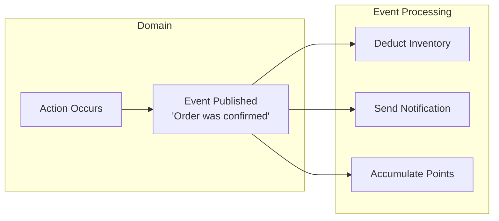
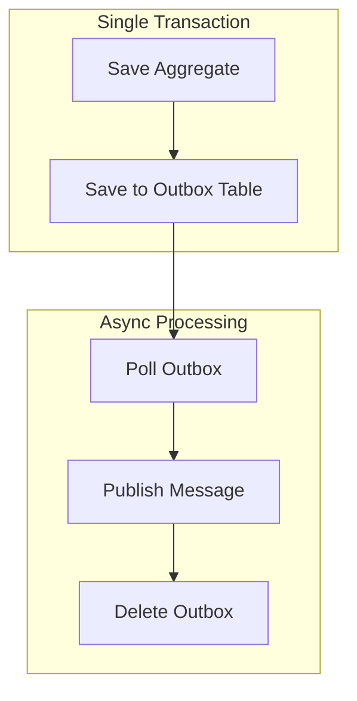
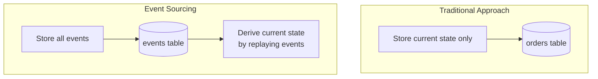
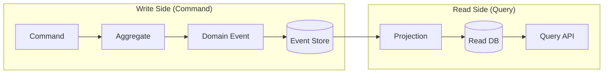

> **Target Audience**: Developers who understand domain modeling and transaction concepts
> **Prerequisites**: Understanding of [Onion Architecture]() or Aggregate boundary concepts
> **Estimated Time**: About 30 minutes
> **Key Question**: "When and why should you use domain events?"

---

# Event-Driven Architecture


You can think of domain events as a <strong>company announcement system</strong>:

- **Event publishing**: HR sends out a "New employee has joined" announcement. HR does not know who will see this announcement, nor does it need to.
- **Event subscription**: The IT team sees the announcement and creates an account, the General Affairs team orders business cards, and the Training team schedules onboarding. Each department acts independently.
- **Loose coupling**: The system works even if HR does not know the IT team exists. Even if a "Welcome Gift team" is added later, HR does not need any changes.

**Key point**: The publisher only announces "something happened," and subscribers each do what they need to do.



* Domain events are a design tool for safely propagating “a business-meaningful change has already occurred” throughout the entire system.
* Through this, you can separate core domain logic from secondary concerns and gradually evolve the system into an event-driven architecture.


Let us explore how to express and utilize important events that occur in the domain. Domain events capture meaningful changes in business processes, propagate them throughout the system, and enable communication between loosely coupled components. This is a core concept when building microservice architectures or event-driven systems.

#### What Are Domain Events?

A domain event is a business-meaningful occurrence that domain experts care about. For example, "an order was confirmed," "a payment was completed," or "a product was shipped" -- these are moments that matter in real business, expressed in code. These events are not merely technical state changes but indicate that something meaningful has happened from a business perspective.



The diagram above shows how a single domain event is processed by multiple handlers. When an order is confirmed, follow-up tasks such as inventory deduction, notification delivery, and point accumulation are automatically triggered.

**Key characteristics of domain events**

Domain events have several important characteristics. First, event names are always in the past tense. Since they express facts that have already occurred, you use past tense like "OrderConfirmed" rather than imperative like "ConfirmOrder." Second, events are immutable. Once published, an event can never be changed, and all event data is read-only. Third, events are self-contained. They must include all information needed to process the event, such as orderId, time of occurrence, and related data.

| Characteristic | Description | Example |
|------|------|------|
| **Past tense naming** | Represents a fact that already happened | OrderConfirmed (O), ConfirmOrder (X) |
| **Immutability** | Cannot be changed after publishing | Event data is readonly |
| **Self-contained** | Contains all needed information | orderId, timestamp, related data |


#### Event Design

When designing domain events, it is important to maintain a consistent structure. Defining common properties that all events should share as a base class makes management and tracking easier.

**Defining the Basic Structure**

You define an abstract class that serves as the foundation for all domain events. This class automatically generates a unique event ID and occurrence time, allowing you to track each event. The event ID is used to prevent duplicate processing, and the occurrence time is used for determining event ordering and debugging.

```java
public abstract class DomainEvent {
    private final String eventId;
    private final Instant occurredAt;

    protected DomainEvent() {
        this.eventId = UUID.randomUUID().toString();
        this.occurredAt = Instant.now();
    }

    public String getEventId() {
        return eventId;
    }

    public Instant getOccurredAt() {
        return occurredAt;
    }
}
```

**Implementing Concrete Events**

When defining concrete business events, you must include all information needed to process that event. For example, an order confirmed event includes not only the order ID but also the customer ID, total amount, and order line information. This way, event handlers can perform their tasks without additional database lookups.

An important point is that you do not include the domain entity itself in the event. Instead, you create event-specific snapshot objects that selectively include only the needed data. This keeps events lightweight and clear, and changes to the entity structure later will not affect the events.

```java
public class OrderConfirmedEvent extends DomainEvent {
    private final OrderId orderId;
    private final CustomerId customerId;
    private final Money totalAmount;
    private final List<OrderLineSnapshot> orderLines;

    public OrderConfirmedEvent(Order order) {
        super();
        this.orderId = order.getId();
        this.customerId = order.getCustomerId();
        this.totalAmount = order.getTotalAmount();
        this.orderLines = order.getOrderLines().stream()
            .map(OrderLineSnapshot::from)
            .toList();
    }

    // Getters...

    // Event-specific snapshot (immutable)
    public record OrderLineSnapshot(
        ProductId productId,
        String productName,
        int quantity,
        Money amount
    ) {
        public static OrderLineSnapshot from(OrderLine line) {
            return new OrderLineSnapshot(
                line.getProductId(),
                line.getProductName(),
                line.getQuantity(),
                line.getAmount()
            );
        }
    }
}
```

**Deciding When to Publish Events**

Events must be published at the appropriate time. Generally, you publish events in three situations. First, when an important state change has been completed. For example, when the order status changes from "PENDING" to "CONFIRMED," you publish an OrderConfirmed event. Second, when a business rule has been satisfied. If certain conditions are met and something meaningful has happened, you express it as an event. Third, when other systems or bounded contexts need to be notified. If the outside world needs to know about this change, you publish an event to notify them.

```java
public class Order extends AggregateRoot {

    public void confirm() {
        validateConfirmable();

        this.status = OrderStatus.CONFIRMED;
        this.confirmedAt = LocalDateTime.now();

        // Register event after state change
        registerEvent(new OrderConfirmedEvent(this));
    }

    public void ship(TrackingNumber trackingNumber) {
        validateShippable();

        this.status = OrderStatus.SHIPPED;
        this.trackingNumber = trackingNumber;

        registerEvent(new OrderShippedEvent(this.id, trackingNumber));
    }

    public void cancel(CancellationReason reason) {
        validateCancellable();

        this.status = OrderStatus.CANCELLED;
        this.cancelledAt = LocalDateTime.now();
        this.cancellationReason = reason;

        registerEvent(new OrderCancelledEvent(this.id, reason));
    }
}
```

In the code above, the order entity registers the appropriate event immediately after changing its state. Events are not published immediately but are first stored in the Aggregate, and are actually published only after the transaction completes successfully.

#### Event Publishing Implementation

There are several ways to actually publish domain events. Each method has its own trade-offs, and you should choose based on your project's requirements.

**Method 1: Using Spring ApplicationEvent**

The simplest approach is to use Spring's ApplicationEventPublisher. The Aggregate Root stores generated events in an internal list, and when the Repository saves, these events are published to Spring's event bus. This approach is simple to implement and integrates well with the Spring ecosystem, but it only works within the application.

```java
// Aggregate Root base class
public abstract class AggregateRoot {
    @Transient
    private final List<DomainEvent> domainEvents = new ArrayList<>();

    protected void registerEvent(DomainEvent event) {
        domainEvents.add(event);
    }

    public List<DomainEvent> getDomainEvents() {
        return Collections.unmodifiableList(domainEvents);
    }

    public void clearDomainEvents() {
        domainEvents.clear();
    }
}

// Publish when saving in Repository
@Repository
public class JpaOrderRepository implements OrderRepository {
    private final OrderJpaRepository jpaRepository;
    private final ApplicationEventPublisher eventPublisher;

    @Override
    public Order save(Order order) {
        OrderEntity entity = mapper.toEntity(order);
        jpaRepository.save(entity);

        // Publish events after successful save
        order.getDomainEvents().forEach(eventPublisher::publishEvent);
        order.clearDomainEvents();

        return order;
    }
}
```

**Method 2: Using Spring Data's @DomainEvents**

Spring Data JPA provides a convenient base class called `AbstractAggregateRoot`. When you extend this class, event registration and publishing are handled automatically. When the Repository's `save()` method is called, registered events are automatically published, so you do not need to write separate event publishing code.

```java
@Entity
public class OrderEntity extends AbstractAggregateRoot<OrderEntity> {

    public void confirm() {
        this.status = OrderStatus.CONFIRMED;

        // Method from AbstractAggregateRoot
        registerEvent(new OrderConfirmedEvent(this.id));
    }
}

// Events are automatically published when Repository save() is called
```

**Method 3: Transactional Outbox Pattern**

For systems where reliability is important, you use the Transactional Outbox Pattern. This pattern was designed to prevent event loss. Events are saved to the database in the same transaction that saves the Aggregate. A separate scheduler then periodically polls the Outbox table and publishes unpublished events to a message broker like Kafka. This way, if the database transaction succeeds, the events are guaranteed to be saved, so event loss does not occur.



This diagram shows the full flow of the Transactional Outbox Pattern. The important point is that Aggregate saving and Outbox saving happen within a single transaction.

```java
// Outbox entity
@Entity
@Table(name = "outbox_events")
public class OutboxEvent {
    @Id
    private String id;
    private String aggregateType;
    private String aggregateId;
    private String eventType;
    private String payload;  // JSON
    private Instant createdAt;
    private boolean published;
}

// Also save to Outbox when saving
@Transactional
public void confirmOrder(OrderId orderId) {
    Order order = orderRepository.findById(orderId).orElseThrow();
    order.confirm();

    orderRepository.save(order);

    // Save to Outbox in the same transaction
    OutboxEvent outbox = OutboxEvent.builder()
        .aggregateType("Order")
        .aggregateId(orderId.getValue())
        .eventType("OrderConfirmed")
        .payload(toJson(new OrderConfirmedEvent(order)))
        .build();
    outboxRepository.save(outbox);
}

// Separate scheduler polls Outbox and publishes to Kafka
@Scheduled(fixedDelay = 1000)
public void publishOutboxEvents() {
    List<OutboxEvent> events = outboxRepository.findUnpublished();
    for (OutboxEvent event : events) {
        kafkaTemplate.send("domain-events", event.getPayload());
        event.markAsPublished();
        outboxRepository.save(event);
    }
}
```

#### Event Processing

Once you have published events, you need handlers to process them. Event processing is divided into synchronous and asynchronous approaches, each suited for different use cases.

**Ensuring Required Tasks with Synchronous Processing**

Synchronous processing executes handlers within the same transaction as the event publishing. Using Spring's `@TransactionalEventListener`, you can process events at specific phases of the transaction. Handlers that run at the `BEFORE_COMMIT` phase are used for tasks that must succeed along with the order confirmation. If the handler throws an exception, the entire transaction is rolled back.

```java
@Component
public class OrderEventHandler {

    // BEFORE_COMMIT: Runs just before transaction commit
    // Note: Transaction is rolled back if handler throws an exception
    @TransactionalEventListener(phase = TransactionPhase.BEFORE_COMMIT)
    public void handleOrderConfirmed(OrderConfirmedEvent event) {
        // Logic that must succeed together with order confirmation
        // Entire transaction rolls back on failure
        auditService.recordConfirmation(event.getOrderId());
    }
}
```

**TransactionPhase Selection Guide**

Spring provides several TransactionPhases, each used for different purposes. `BEFORE_COMMIT` runs just before commit, and the entire transaction is rolled back if the handler fails. This is suitable for required follow-up tasks like audit logging. `AFTER_COMMIT` runs after the commit completes, and even if the handler fails, the already committed transaction is not rolled back. This is used for cases like notification delivery or external system integration where failure should not affect the main operation. `AFTER_ROLLBACK` runs after the transaction is rolled back and is useful for implementing compensating transactions.

| Phase | Execution Timing | On Handler Failure | Use Case |
|-------|----------|---------------|----------|
| **BEFORE_COMMIT** | Just before commit | Full rollback | Required follow-up tasks |
| **AFTER_COMMIT** | After commit completes | No rollback possible | Notifications, external integrations |
| **AFTER_ROLLBACK** | After rollback | - | Compensating transactions |

**Decoupling Systems with Asynchronous Processing**

Asynchronous processing executes event handlers in a separate thread or transaction. When used together with the `@Async` annotation, handlers run asynchronously and do not block the main transaction. Tasks like notification delivery can take a long time and should not affect orders even if they fail, so asynchronous processing is appropriate.

```java
@Component
public class NotificationEventHandler {

    // Asynchronous processing after transaction commit
    @Async
    @TransactionalEventListener(phase = TransactionPhase.AFTER_COMMIT)
    public void handleOrderConfirmed(OrderConfirmedEvent event) {
        // Send notification (does not affect the order even on failure)
        notificationService.sendOrderConfirmation(
            event.getCustomerId(),
            event.getOrderId()
        );
    }
}
```

**Delivering Events Between Microservices with Kafka**

In microservice architectures, events are delivered through message brokers like Kafka. Events published by the order service are subscribed to and processed by the inventory service, notification service, and others. Using Kafka, you can reliably deliver events while maintaining loose coupling between services. Setting the key to the order ID guarantees the ordering of events for the same order.

```java
// Event publishing
@Component
public class OrderEventPublisher {
    private final KafkaTemplate<String, OrderEvent> kafkaTemplate;

    @TransactionalEventListener(phase = TransactionPhase.AFTER_COMMIT)
    public void publishToKafka(OrderConfirmedEvent event) {
        kafkaTemplate.send(
            "order-events",
            event.getOrderId().getValue(),  // Key: ordering guarantee
            toKafkaEvent(event)
        );
    }
}

// Event consumption
@Component
public class InventoryEventConsumer {

    @KafkaListener(topics = "order-events", groupId = "inventory-service")
    public void handleOrderEvent(ConsumerRecord<String, OrderEvent> record) {
        OrderEvent event = record.value();

        if ("OrderConfirmed".equals(event.getType())) {
            // Deduct inventory
            inventoryService.reserveStock(event.getOrderLines());
        }
    }
}
```

#### Event Design Guide

To design good events, it is important to maintain an appropriate amount of information. Too little and the consumer must make additional queries; too much and the event becomes heavy with unnecessary coupling.

**Determining the Right Amount of Information**

If you only include IDs in events, consumers must look up detailed information from the database. This increases database load and couples consumers to the order database. Conversely, including the entire Aggregate makes events too heavy and exposes the Aggregate's internal structure to the outside. The appropriate approach is to selectively include only the key information needed for event processing. For an order confirmed event, the order ID, customer ID, total amount, and order line snapshots are usually sufficient.

```java
// ❌ Too little information
public class OrderConfirmedEvent {
    private OrderId orderId;  // ID alone requires additional lookups
}

// ❌ Too much information
public class OrderConfirmedEvent {
    private Order order;  // Entire Aggregate included
}

// ✅ Appropriate amount of information
public class OrderConfirmedEvent {
    private OrderId orderId;
    private CustomerId customerId;
    private Money totalAmount;
    private List<OrderLineSnapshot> orderLines;  // Needed snapshots
    private Instant confirmedAt;
}
```

**Managing Event Versions**

Events can change as the system evolves. However, since already-published events represent facts that occurred in the past, you must be careful with schema changes. You should include version information in events and consider how to maintain backward compatibility. When adding new fields, make them Optional so that existing events can still be processed.

```java
// Event with version information
public class OrderConfirmedEventV2 extends DomainEvent {
    private static final int VERSION = 2;

    private OrderId orderId;
    private CustomerId customerId;
    private Money totalAmount;
    private ShippingAddress shippingAddress;  // Added in V2

    // Conversion for backward compatibility
    public OrderConfirmedEventV1 toV1() {
        return new OrderConfirmedEventV1(orderId, customerId, totalAmount);
    }
}
```

#### Event Pattern Comparison

There are three major patterns for using domain events, each with a different purpose. Understanding these patterns helps you choose the right approach for your situation.

**Event Notification vs Event-Carried State Transfer vs Event Sourcing**

Event Notification is the simplest pattern -- it only sends a notification that "something happened." The event includes only an ID, and consumers must look up needed information themselves. Event-Carried State Transfer is the most commonly used pattern, including the full state needed for processing in the event. It is convenient because consumers can process immediately without additional lookups. Event Sourcing is the most complex pattern, storing all state changes as events and deriving the current state by replaying events.

| Pattern | Purpose | Event Content | Complexity |
|------|------|-----------|--------|
| **Event Notification** | "This happened" notification | Contains only ID | Low |
| **Event-Carried State Transfer** | State synchronization | Contains full state | Medium |
| **Event Sourcing** | Store state as events | Change history | High |

**Concrete Examples by Pattern**

Let us look at how each pattern is actually implemented in code. Event Notification only announces that an order was confirmed, and consumers call the order service to look up details if needed. Event-Carried State Transfer includes all order details in the event, so consumers can process immediately without additional lookups. Event Sourcing is covered in detail in a separate section.

```java
// 1. Event Notification (simplest)
// "The order was confirmed -- look it up yourself if you need details"
public class OrderConfirmedEvent {
    private OrderId orderId;  // ID only
    // Consumers must look up details themselves if needed
}

// 2. Event-Carried State Transfer (most common)
// "The order was confirmed, and here are the order details"
public class OrderConfirmedEvent {
    private OrderId orderId;
    private CustomerId customerId;
    private List<OrderLineSnapshot> orderLines;  // Includes needed data
    private Money totalAmount;
    // Consumer can process without additional lookups
}

// 3. Event Sourcing
// "Store all changes as events, derive current state by replay"
// -> Explained in detail in a separate section
```

**Pattern Selection Criteria**

You can decide which pattern to choose as follows. If you simply need notifications, use Event Notification. If consumers need to process immediately without additional lookups, use Event-Carried State Transfer. If you need complete audit trails and can handle the complexity, consider Event Sourcing. In most cases, Event-Carried State Transfer is the appropriate choice.

#### Event Sourcing

Event Sourcing is a pattern that uses events as the source of truth for state. The traditional approach stores only the current state, but Event Sourcing stores all change history as events and derives the current state by replaying those events.



**Restoring Aggregates from Events**

In Event Sourcing, to get the current state of an Aggregate, you replay all of its events in order. Each event changes the Aggregate's state through the `apply` method. For example, applying OrderCreatedEvent sets the order ID and status, and applying OrderConfirmedEvent changes the status to CONFIRMED.

```java
// Restore Aggregate from events
public class Order {
    private OrderId id;
    private OrderStatus status;
    private List<OrderLine> orderLines;

    // Restore from event stream
    public static Order fromEvents(List<DomainEvent> events) {
        Order order = new Order();
        for (DomainEvent event : events) {
            order.apply(event);
        }
        return order;
    }

    private void apply(DomainEvent event) {
        if (event instanceof OrderCreatedEvent e) {
            this.id = e.getOrderId();
            this.status = OrderStatus.PENDING;
            this.orderLines = new ArrayList<>(e.getOrderLines());
        } else if (event instanceof OrderConfirmedEvent e) {
            this.status = OrderStatus.CONFIRMED;
        } else if (event instanceof OrderCancelledEvent e) {
            this.status = OrderStatus.CANCELLED;
        }
    }
}

// Event Store
public interface OrderEventStore {
    void append(OrderId orderId, DomainEvent event);
    List<DomainEvent> getEvents(OrderId orderId);
}

// Repository
public class EventSourcedOrderRepository implements OrderRepository {
    private final OrderEventStore eventStore;

    @Override
    public Optional<Order> findById(OrderId id) {
        List<DomainEvent> events = eventStore.getEvents(id);
        if (events.isEmpty()) {
            return Optional.empty();
        }
        return Optional.of(Order.fromEvents(events));
    }

    @Override
    public Order save(Order order) {
        for (DomainEvent event : order.getDomainEvents()) {
            eventStore.append(order.getId(), event);
        }
        order.clearDomainEvents();
        return order;
    }
}
```

**Advantages and Disadvantages of Event Sourcing**

Event Sourcing provides powerful advantages but also increases complexity. Among the advantages, complete audit trails are possible. Since all change history is preserved, you can know exactly "who did what and when." Time travel is also possible. You can reproduce the state at any past point in time, which is useful for debugging and analysis. It also naturally fits event-driven integration. Among the disadvantages, implementation complexity increases, and event schema evolution is difficult. Since stored events cannot be changed, you must be very careful with schema changes. Query performance can also be an issue, so it is typically used together with CQRS.

| Advantages | Disadvantages |
|------|------|
| Complete audit trail | Increased complexity |
| Time travel (past state reproduction) | Difficult event schema evolution |
| Suitable for event-driven integration | Query performance (CQRS needed) |

**Choosing an Event Store**

To implement Event Sourcing, you need a store to save events. There are several options, each with its own trade-offs. Implementing directly on an RDBMS is the simplest and allows you to use existing databases, making it suitable for small projects or learning purposes. EventStoreDB is a database designed specifically for Event Sourcing, with built-in subscription features, making it suitable for professional Event Sourcing. Axon Framework integrates well with CQRS in the Java ecosystem and is useful for Spring-based projects. Kafka offers high performance and is suitable for event streaming-centric systems if you are already using it.

| Option | Features | Suitable When |
|------|------|-----------|
| **Custom (RDBMS)** | Simple, leverages existing DB | Small scale, learning purposes |
| **EventStoreDB** | Dedicated store, built-in subscriptions | Professional Event Sourcing |
| **Axon Framework** | Java ecosystem, CQRS integration | Spring-based projects |
| **Kafka** | High performance, if already in use | Event streaming-centric |

#### CQRS and Domain Events

When you use Event Sourcing, CQRS (Command Query Responsibility Segregation) naturally becomes necessary. This is because event replaying can cause read performance issues.



**Why CQRS Is Needed**

In Event Sourcing, to get the current state, you must replay all events. If a single order has 100 events, each query requires 100 replays, which is very slow. With CQRS, the write side stores events, and the read side subscribes to events and maintains a separate read-only view. This way, queries are processed quickly while still maintaining a complete event history.

```java
// Without CQRS: replay events every time
public Order findById(OrderId id) {
    List<DomainEvent> events = eventStore.getEvents(id);
    return Order.fromEvents(events);  // Slow!
}

// With CQRS: use read-only view
public OrderView findById(OrderId id) {
    return orderViewRepository.findById(id);  // Fast!
}

// Projection: convert events to read views
@EventHandler
public void on(OrderConfirmedEvent event) {
    OrderView view = orderViewRepository.findById(event.getOrderId());
    view.setStatus("CONFIRMED");
    view.setConfirmedAt(event.getOccurredAt());
    orderViewRepository.save(view);
}
```

**CQRS Adoption Criteria**

CQRS increases complexity, so it is not necessary for every project. Consider CQRS if two or more of the following conditions apply: read and write patterns differ significantly, read performance is critical, you are using Event Sourcing, complex query requirements call for diverse views, or read and write scaling needs to be independent.

#### Practical Tips

Here are a few useful tips for using domain events in practice.

**1. Event Naming Conventions**

Event names should follow consistent rules. Use past tense to clearly indicate a fact that has already occurred, and use domain terminology to convey business meaning. Use clear prefixes to indicate which Aggregate the event relates to. For example, compose them as "Order + Confirmed = OrderConfirmed."

**2. Handling Idempotency**

Events may be delivered more than once due to network errors. You must ensure idempotency so that receiving the same event multiple times produces the same result. Implement this by checking whether an event has already been processed and ignoring duplicates.

```java
@Component
public class PaymentEventHandler {
    private final ProcessedEventRepository processedEvents;

    @KafkaListener(topics = "order-events")
    public void handle(OrderConfirmedEvent event) {
        // Check if event was already processed
        if (processedEvents.exists(event.getEventId())) {
            log.info("Already processed event: {}", event.getEventId());
            return;
        }

        // Process business logic
        paymentService.requestPayment(event);

        // Record processing completion
        processedEvents.save(event.getEventId());
    }
}
```

**3. Failure Handling Strategy**

Since event processing can fail, you must implement a retry strategy. Using Spring Kafka's `@RetryableTopic`, you can automatically retry, and on final failure, move the event to a Dead Letter Topic.

```java
@Component
public class StockEventHandler {

    @RetryableTopic(
        attempts = "3",
        backoff = @Backoff(delay = 1000, multiplier = 2)
    )
    @KafkaListener(topics = "order-events")
    public void handle(OrderConfirmedEvent event) {
        // Moves to DLT after 3 retry failures
        stockService.reserve(event.getOrderLines());
    }

    @DltHandler
    public void handleDlt(OrderConfirmedEvent event) {
        // Dead Letter Topic handling
        alertService.notifyStockReservationFailed(event);
    }
}
```

#### Pitfalls of Event-Driven Architecture

Domain events are powerful, but if used incorrectly, you end up with a system that is difficult to debug. Knowing the common pitfalls helps you prevent them.

**Pitfall 1: Event Loss**

The problem is that `@TransactionalEventListener(AFTER_COMMIT)` keeps events only in memory. Events are published after the transaction commits, but if the application dies at this point, the events are lost. The order is saved in the database, but the event is never published, so inventory deduction and notification delivery never execute.

The solution is the Transactional Outbox Pattern. Store events in the database first, not in memory. Since Aggregate saving and event saving happen in the same transaction, if the transaction succeeds, the events are guaranteed to be saved. A separate process periodically polls the Outbox table and publishes unpublished events to Kafka.

```java
// ❌ Event loss possible
@Transactional
public void confirmOrder(OrderId orderId) {
    Order order = orderRepository.findById(orderId);
    order.confirm();
    orderRepository.save(order);
    // Commit completes here

    // Event is published in AFTER_COMMIT
    // What if the server dies at this point? -> Event lost!
}

// ✅ Prevent event loss
@Transactional
public void confirmOrder(OrderId orderId) {
    Order order = orderRepository.findById(orderId);
    order.confirm();
    orderRepository.save(order);

    // Save to Outbox in the same transaction
    outboxRepository.save(new OutboxEvent(
        "OrderConfirmed",
        toJson(new OrderConfirmedEvent(order))
    ));
    // DB transaction success = event storage guaranteed
}

// Separate scheduler polls Outbox and publishes to Kafka
@Scheduled(fixedDelay = 1000)
public void publishEvents() {
    List<OutboxEvent> events = outboxRepository.findUnpublished();
    for (OutboxEvent event : events) {
        kafkaTemplate.send("domain-events", event.getPayload());
        event.markPublished();
        outboxRepository.save(event);
    }
}
```

**Pitfall 2: Event Order Reversal**

Asynchronous events may be processed in a different order than they were published. You might publish OrderCreated -> OrderPaid -> OrderShipped, but they could be processed as OrderCreated -> OrderShipped -> OrderPaid. This results in the strange state of "shipped without payment."

There are two solutions. First, validate state in the event handler. If the status is not PAID, defer shipment processing and retry or send to the DLT. Second, include a version or sequence number in events and ignore events with lower sequence numbers.

```java
// Method 1: Validate state before processing
@KafkaListener(topics = "order-events")
public void handleOrderShipped(OrderShippedEvent event) {
    Order order = orderRepository.findById(event.getOrderId());

    // State validation: defer processing if not in PAID state
    if (order.getStatus() != OrderStatus.PAID) {
        throw new OrderNotReadyForShipmentException();
        // Retry or move to DLT
    }

    order.ship();
    orderRepository.save(order);
}

// Method 2: Include version/sequence in events
public class OrderEvent {
    private long sequenceNumber;  // 1, 2, 3, ...

    // Ignore events with lower sequence numbers
}
```

**Pitfall 3: Circular Events**

An infinite loop can occur where event A triggers B, and B triggers A again. For example, OrderConfirmed triggers StockReserved, StockReserved triggers OrderUpdated, and OrderUpdated triggers StockReserved again.

The solution is to track the event chain. Include correlationId (original event ID), causationId (ID of the event that triggered this one), and depth (event chain depth) in each event. Stop the chain when the depth exceeds a certain level.

```java
public abstract class DomainEvent {
    private String correlationId;  // Original event ID
    private String causationId;    // ID of the event that triggered this one
    private int depth;             // Event chain depth

    public boolean isMaxDepthReached() {
        return depth > 10;  // Maximum depth limit
    }
}
```

**Pitfall 4: Event Schema Changes**

Changing the event structure can break existing Consumers. If v1 used an `amount` field and v2 splits it into `totalAmount` and `discountAmount`, existing Consumers will fail trying to find `amount`.

The solution is to maintain backward compatibility. Adding fields is fine but handle them as Optional. Keep existing fields and add new fields so both approaches work. If you need to delete fields or change types, define a new event type.

```java
// Adding fields is OK (handle as Optional)
public class OrderConfirmedEvent {
    private String orderId;
    private Money amount;           // Keep existing field
    private Money totalAmount;      // Add new field
    private Money discountAmount;   // Add new field

    // Backward compatibility: accessible via existing field too
    public Money getAmount() {
        return amount != null ? amount : totalAmount;
    }
}

// If field deletion or type change is needed, define a new event type
// OrderConfirmedEventV2
```

#### Event Debugging Tips

Event-driven systems are difficult to trace. To make debugging easier, you must include tracking information in all events. The eventId uniquely identifies each event, correlationId links all events from the same request, occurredAt records the time of occurrence, and aggregateId and aggregateType indicate which Aggregate the event originated from.

```java
public abstract class DomainEvent {
    private String eventId;         // Unique ID
    private String correlationId;   // Request tracking ID (all events from the same request)
    private Instant occurredAt;     // Time of occurrence
    private String aggregateId;     // Which Aggregate it originated from
    private String aggregateType;   // Order, Payment, etc.
}
```

Always include this information when writing logs. Then you can search by correlationId in the logs to trace the entire event flow triggered by a single request.

```java
log.info("Event processing started: eventId={}, correlationId={}, type={}",
    event.getEventId(),
    event.getCorrelationId(),
    event.getClass().getSimpleName());
```

#### Real Schema Evolution Cases

Event schema changes must be approached carefully. Let us learn to distinguish safe changes from dangerous ones through real examples.

**Case 1: Adding Fields (Safe)**

Adding fields is relatively safe. Existing Consumers ignore the new fields and continue working, while new Consumers can leverage the new fields. However, new fields must allow null and should ideally provide default values.

```java
// v1: Initial version
public class OrderConfirmedEvent {
    private String orderId;
    private BigDecimal amount;
}

// v2: Need to add discount information
public class OrderConfirmedEvent {
    private String orderId;
    private BigDecimal amount;
    private BigDecimal discountAmount;  // New field (null allowed)

    // Backward compatibility: discountAmount is null for existing events
    public BigDecimal getDiscountAmount() {
        return discountAmount != null ? discountAmount : BigDecimal.ZERO;
    }
}
```

**Case 2: Renaming Fields (Dangerous)**

Directly renaming a field will break all existing Consumers. Instead, keep both fields to ensure backward compatibility. Mark the existing field with @Deprecated to allow gradual migration.

```java
// ❌ Dangerous: Direct field rename
// v1: amount
// v2: totalAmount
// -> All existing Consumers break!

// ✅ Safe: Keep both fields
public class OrderConfirmedEvent {
    private String orderId;

    @Deprecated
    private BigDecimal amount;       // Keep existing field

    private BigDecimal totalAmount;  // New field

    // New Consumers use totalAmount
    public BigDecimal getTotalAmount() {
        return totalAmount != null ? totalAmount : amount;
    }

    // Existing Consumer compatibility
    public BigDecimal getAmount() {
        return amount != null ? amount : totalAmount;
    }
}
```

**Case 3: Type Changes (Most Dangerous)**

Changing types is the most dangerous. Deserialization can fail and bring the system to a halt. If a type change is needed, define a new event type and implement Consumers to handle both versions.

```java
// ❌ Never do this: Type change
// v1: String orderId
// v2: Long orderId
// -> Deserialization failure!

// ✅ Solution: Define a new event type
public class OrderConfirmedEventV2 {
    private Long orderId;  // New type

    // Migration handler
    public static OrderConfirmedEventV2 fromV1(OrderConfirmedEvent v1) {
        return new OrderConfirmedEventV2(Long.parseLong(v1.getOrderId()));
    }
}

// Consumer handles both versions
@KafkaListener(topics = "order-events")
public void handle(ConsumerRecord<String, JsonNode> record) {
    int version = record.value().get("version").asInt();
    if (version == 1) {
        // Handle V1
    } else {
        // Handle V2
    }
}
```

**Schema Evolution Checklist**

Safe changes include adding new fields (Optional), adding default values to fields, and adding new event types. Dangerous changes include renaming fields, changing field types, and making fields required -- these need a migration strategy. Changes you must never make include deleting existing fields, deleting existing event types, and changing event semantics.

---

#### When Should You Use Event-Driven Architecture?

**Suitable Cases**

- When communication between microservices is needed
- When loose coupling is important
- Workflows where asynchronous processing is appropriate
- Systems requiring audit trails
- Large-scale systems where scalability is important

**Unsuitable Cases**

- When synchronous responses are mandatory
- Teams that cannot handle debugging complexity
- When absolute transactional consistency is required
- Small monolithic systems

**Best Practice: Which Systems Fit?**

| System Type | Suitability | Reason |
|------------|-------|------|
| **Microservices** | Very suitable | Loose coupling between services, independent deployment |
| **E-commerce** | Very suitable | Order -> Payment -> Shipping -> Notification pipeline |
| **Notification systems** | Suitable | Asynchronous delivery, retryable |
| **Real-time data pipelines** | Suitable | Stream processing, scalability |
| **Audit/Logging systems** | Suitable | Tracking all change history |
| **IoT data collection** | Suitable | High-volume event processing |
| **Payment systems** | Partially suitable | Complex failure handling, compensating transactions needed |
| **Real-time games** | Unsuitable | Low-latency synchronous responses needed |
| **Simple CRUD** | Unsuitable | No benefit relative to complexity |

---

#### Summary

Domain events are business-meaningful occurrences expressed in code. Event patterns include Notification, State Transfer, and Sourcing, each serving a different purpose. Using the Outbox pattern prevents event loss, and CQRS solves the query performance issues of Event Sourcing. When evolving schemas, maintaining backward compatibility is essential.

| Concept | Key Point |
|------|------|
| **Domain Event** | Business-meaningful occurrence |
| **Event Patterns** | Notification / State Transfer / Sourcing |
| **Outbox Pattern** | Prevents event loss |
| **CQRS** | Solves Event Sourcing query performance |
| **Schema Evolution** | Backward compatibility is essential |

#### Next Steps

- [CQRS]() - A pattern that pairs well with event-driven systems
- [Hands-on Examples]() - Implementing an order domain with Spring Boot
- [Kafka Core Components]() - Components of Kafka used as a message broker in event-driven architecture
