> **Target Audience**: Developers considering testability and external dependency replacement
> **Prerequisites**: Understanding the limitations of [Layered Architecture]()
> **Estimated Time**: About 20 minutes

Also known as the **Ports and Adapters** pattern. An architecture that completely isolates the application core from the external world. The core idea of hexagonal architecture is to place business logic at the center and handle all external interactions through Ports and Adapters. This way, even if external technologies change, core business logic remains unaffected.

#### One-Line Summary

The application sits inside the hexagon, and all external connections are handled through Ports and Adapters. This allows you to perfectly separate business logic from technical details.

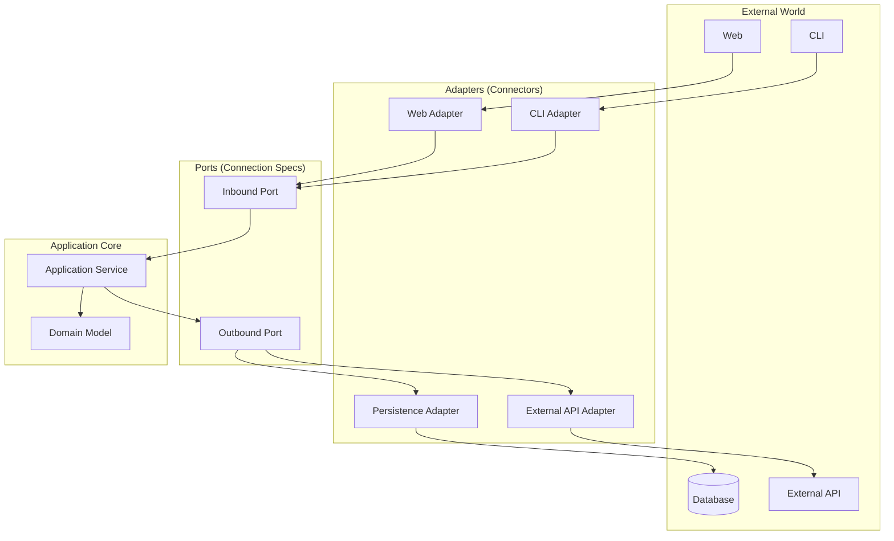

---

#### Why "Hexagonal"?

The hexagonal name does not mean 6 sides are important, but rather conveys that the application can be connected from multiple directions. Unlike the one-way flow of "top to bottom" in layered architecture, hexagonal presents the perspective of "inside and outside."


Think about a smartphone. The smartphone itself does not know which charger it uses.

- **Smartphone (Core)**: Handles only core functions like calls and app execution
- **충전 포트(Port)**: "전원을 공급받고 싶어"라는 interface
- **Adapter**: Connects via various methods like USB-C, wireless charging, USB

Even if the charging method changes, the phone's functions remain the same. **Just changing the adapter lets you connect to various devices.**


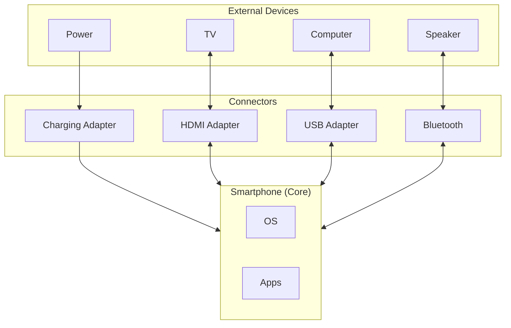

The same applies to software. Core business logic does not need to know which database or UI framework is used. All these technical choices are isolated through Adapters.

The hexagonal shape does not mean 6 sides are important, but visually represents "can be connected from multiple directions." The key is shifting thinking from the layered "top->bottom" to an "inside<->outside" perspective.

---

#### Three Core Concepts

To understand hexagonal architecture, you need to know three concepts: Port, Adapter, and Application Core. Understanding how these three collaborate reveals the full picture of hexagonal architecture.

**1. Port - "Connection Spec"**

A Port is an interface. It defines the "specification" for connecting with the outside. There are two types of Ports. Inbound Ports define incoming requests from external to application, and Outbound Ports define outgoing requests from application to external.

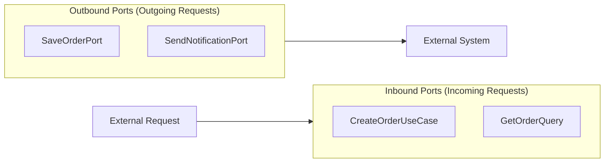

Understanding the <strong>two types of Ports</strong> is important. The table below summarizes each Port's characteristics.

| Port Type | Direction | Role | Example |
|----------|------|------|------|
| **Inbound Port** | External -> Application | "Request me like this" | `CreateOrderUseCase` |
| **Outbound Port** | Application -> External | "I only need this" | `SaveOrderPort` |

Inbound Ports define how the application can be called from outside. For example, it specifies "you need this information to create an order." Outbound Ports define what the application requests from the outside. It specifies "I want to save an order" but does not need to know which database or how to store it.

```java
// Inbound Port: "Call me like this from outside"
public interface CreateOrderUseCase {
    OrderId createOrder(CreateOrderCommand command);
}

// Outbound Port: "I want to save an order"
public interface SaveOrderPort {
    void save(Order order);
}
```

By defining Ports as interfaces, you do not need to know what the specific implementation is. Even if you later switch MySQL to MongoDB or REST API to gRPC, the Ports do not need to change.

**2. Adapter - "Connector"**

An Adapter is an implementation. It handles the actual connection according to the Port specification. There are also two types of Adapters. Driving Adapters call the application, and Driven Adapters are called by the application.

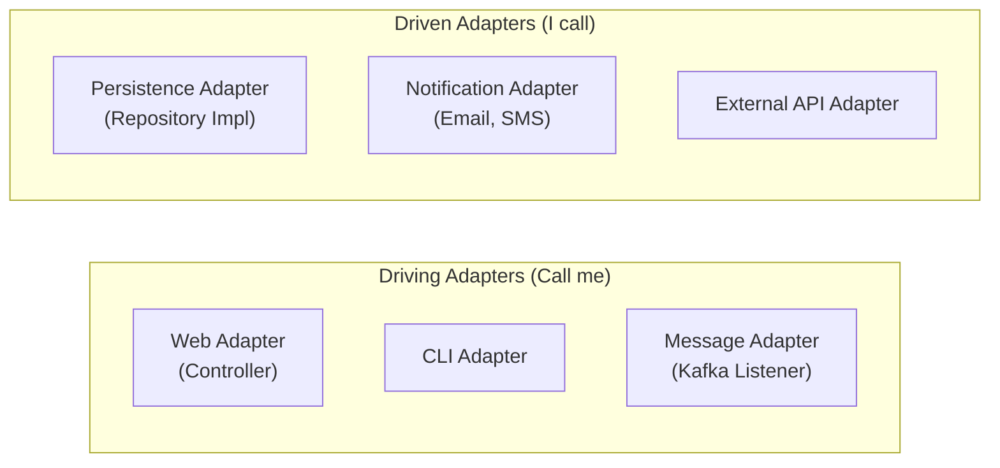

Distinguishing the <strong>two types of Adapters</strong> is important. The table below summarizes each Adapter's characteristics.

| Adapter Type | Other Name | Role | Example |
|-------------|----------|------|------|
| **Driving Adapter** | Primary Adapter | Calls the application | Controller, CLI |
| **Driven Adapter** | Secondary Adapter | Called by the application | Repository impl, API Client |

Driving Adapters receive external requests and pass them to the application. For example, an HTTP Controller receives HTTP requests and converts them to Inbound Port format. Driven Adapters pass application requests to external systems. For example, a JPA Repository converts application save requests into database queries.

```java
// Driving Adapter: Receive external requests and pass to application
@RestController
public class OrderController {
    private final CreateOrderUseCase createOrderUseCase;  // Uses Port

    @PostMapping("/orders")
    public ResponseEntity<String> createOrder(@RequestBody OrderRequest request) {
        OrderId orderId = createOrderUseCase.createOrder(request.toCommand());
        return ResponseEntity.ok(orderId.getValue());
    }
}

// Driven Adapter: Pass application requests to external systems
@Repository
public class OrderPersistenceAdapter implements SaveOrderPort {
    private final OrderJpaRepository jpaRepository;

    @Override
    public void save(Order order) {
        OrderEntity entity = OrderMapper.toEntity(order);
        jpaRepository.save(entity);
    }
}
```

In the code above, OrderController receives HTTP requests and calls CreateOrderUseCase, while OrderPersistenceAdapter implements SaveOrderPort to save to the database. The important point is that the application core is completely unaware of these Adapters.

**3. Application Core - "Business Heart"**

Inside the hexagon, there is only pure business logic. Application Core는 Application Layer와 Domain Layer로 구성됩니다. Application Layer는 비즈니스 프로세스의 orchestrate flow하고, Domain Layer는 core business 규칙을 담고 있습니다.

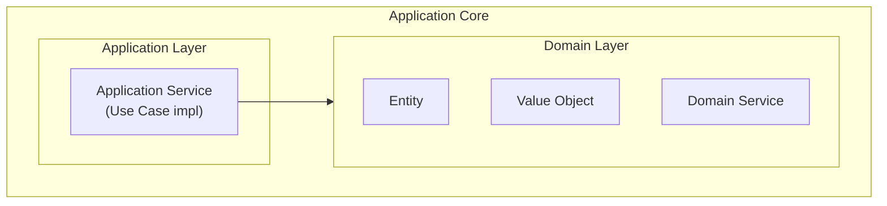

The Application Core knows nothing about the external world. HTTP가 무엇인지, JPA가 무엇인지, Kafka가 무엇인지 모릅니다. 오직 Port interface만 알고 있으며, 순수한 business logic에만 집중합니다.

---

#### Full Structure at a Glance

헥사고날 아키텍처의 모든 요소가 어떻게 협력하는지 전체 그림을 보겠습니다. external world, Driving Adapters, Inbound Ports, Application Core, Outbound Ports, Driven Adapters가 어떻게 연결되는지 이해하면 헥사고날의 핵심을 파악할 수 있습니다.

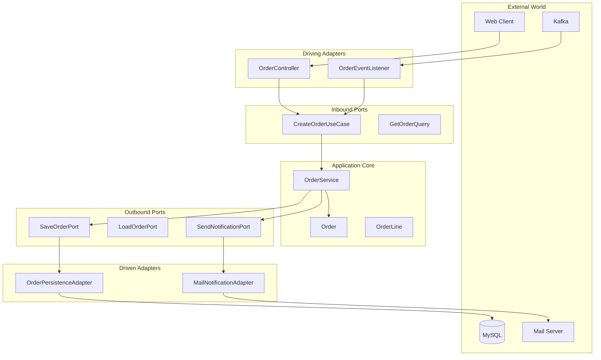

위 다이어그램에서 화살표의 방향에 주목하세요. 의존성은 항상 바깥에서 안으로만 향합니다. Application Core는 외부를 전혀 모르며, Port interface만 사용합니다.

---

#### Understanding Through Code

Now let us implement hexagonal architecture with actual code. We will proceed in the order of Port definition, Application Service implementation, and Adapter implementation.

**Step 1: Define Ports**

First, define the application boundaries with Ports. Inbound Ports define use cases that can be called from outside, and Outbound Ports define external services that the application needs.

```java
// === Inbound Ports ===
// Application 패키지에 위치

// 주문 생성 유스케이스
public interface CreateOrderUseCase {
    OrderId execute(CreateOrderCommand command);
}

// 주문 확정 유스케이스
public interface ConfirmOrderUseCase {
    void execute(OrderId orderId);
}

// 주문 조회 (Query)
public interface GetOrderQuery {
    OrderDto execute(OrderId orderId);
}
```

Inbound Port는 애플리케이션이 제공하는 기능을 명확히 정의합니다. 각 유스케이스는 하나의 비즈니스 목적을 가지고 있으며, 외부에서는 이 interface만 보고 애플리케이션을 호출할 수 있습니다.

```java
// === Outbound Ports ===
// Application 패키지에 위치

// 주문 저장
public interface SaveOrderPort {
    void save(Order order);
}

// 주문 조회
public interface LoadOrderPort {
    Order loadById(OrderId id);
    boolean existsById(OrderId id);
}

// 알림 발송
public interface SendNotificationPort {
    void sendOrderConfirmation(Order order);
}

// 재고 확인
public interface CheckInventoryPort {
    boolean isAvailable(ProductId productId, int quantity);
}
```

Outbound Ports define external services the application needs. All communication with external systems including databases, message queues, and external APIs is done through these Ports.

**Step 2: Implement Application Service**

Application Service는 Inbound Port를 구현하고 Outbound Port를 사용합니다. 비즈니스 orchestrate flow하며, Domain 객체를 조합하여 유스케이스를 완성합니다.

```java
@Service
@Transactional
public class OrderService implements CreateOrderUseCase, ConfirmOrderUseCase {

    // Outbound Ports (interface)만 의존
    private final SaveOrderPort saveOrderPort;
    private final LoadOrderPort loadOrderPort;
    private final SendNotificationPort notificationPort;
    private final CheckInventoryPort inventoryPort;

    // Constructor injection
    public OrderService(
            SaveOrderPort saveOrderPort,
            LoadOrderPort loadOrderPort,
            SendNotificationPort notificationPort,
            CheckInventoryPort inventoryPort) {
        this.saveOrderPort = saveOrderPort;
        this.loadOrderPort = loadOrderPort;
        this.notificationPort = notificationPort;
        this.inventoryPort = inventoryPort;
    }

    @Override
    public OrderId execute(CreateOrderCommand command) {
        // 1. Check inventory (using Outbound Port)
        for (OrderLineCommand line : command.getLines()) {
            if (!inventoryPort.isAvailable(line.getProductId(), line.getQuantity())) {
                throw new InsufficientInventoryException(line.getProductId());
            }
        }

        // 2. Create order (Domain Logic)
        Order order = Order.create(
            command.getCustomerId(),
            command.toOrderLines()
        );

        // 3. Save (using Outbound Port)
        saveOrderPort.save(order);

        return order.getId();
    }

    @Override
    public void execute(OrderId orderId) {
        // 1. Retrieve order (using Outbound Port)
        Order order = loadOrderPort.loadById(orderId);

        // 2. Confirm order (Domain Logic)
        order.confirm();

        // 3. Save (using Outbound Port)
        saveOrderPort.save(order);

        // 4. Send notification (using Outbound Port)
        notificationPort.sendOrderConfirmation(order);
    }
}
```

위 코드에서 OrderService는 구체적인 implementation가 아닌 Port interface만 의존하고 있습니다. SaveOrderPort가 JPA인지 MongoDB인지, SendNotificationPort가 이메일인지 SMS인지 전혀 모릅니다. 이것이 헥사고날 아키텍처의 핵심입니다.


**Key Point**

Application Service는 **Port(interface)만 알고 있습니다:**
- `SaveOrderPort` ← JPA인지 MongoDB인지 모름
- `SendNotificationPort` ← 이메일인지 SMS인지 모름
- `CheckInventoryPort` ← 내부 DB인지 외부 API인지 모름

그래서 **외부 기술이 바뀌어도 이 코드는 변경할 필요가 없습니다!**


**Step 3: Implement Driving Adapters**

Driving Adapters receive external requests and call Inbound Ports. For example, a Web Adapter receives HTTP requests, converts them to Command objects, then executes Use Cases.

```java
// === Web Adapter (Driving) ===
@RestController
@RequestMapping("/api/orders")
public class OrderController {

    private final CreateOrderUseCase createOrderUseCase;
    private final ConfirmOrderUseCase confirmOrderUseCase;
    private final GetOrderQuery getOrderQuery;

    @PostMapping
    public ResponseEntity<OrderIdResponse> createOrder(
            @Valid @RequestBody CreateOrderRequest request) {

        // Convert Request -> Command
        CreateOrderCommand command = request.toCommand();

        // Execute Use Case
        OrderId orderId = createOrderUseCase.execute(command);

        // Create Response
        return ResponseEntity
            .status(HttpStatus.CREATED)
            .body(new OrderIdResponse(orderId.getValue()));
    }

    @PostMapping("/{orderId}/confirm")
    public ResponseEntity<Void> confirmOrder(@PathVariable String orderId) {
        confirmOrderUseCase.execute(OrderId.of(orderId));
        return ResponseEntity.ok().build();
    }

    @GetMapping("/{orderId}")
    public ResponseEntity<OrderResponse> getOrder(@PathVariable String orderId) {
        OrderDto order = getOrderQuery.execute(OrderId.of(orderId));
        return ResponseEntity.ok(OrderResponse.from(order));
    }
}
```

OrderController only handles the details of the HTTP transport protocol. All it does is receive HTTP requests, convert to Commands, call Use Cases, and convert results to HTTP responses.

```java
// === Message Adapter (Driving) ===
@Component
public class OrderEventListener {

    private final ConfirmOrderUseCase confirmOrderUseCase;

    @KafkaListener(topics = "payment-completed")
    public void onPaymentCompleted(PaymentCompletedEvent event) {
        // Automatically confirm order when payment completes
        confirmOrderUseCase.execute(OrderId.of(event.getOrderId()));
    }
}
```

The Message Adapter receives Kafka messages and calls Use Cases. The application core does not know about Kafka at all; it is simply called through Inbound Ports.

**Step 4: Implement Driven Adapters**

Driven Adapter는 Outbound Port를 구현하여 외부 시스템과 통신합니다. 예를 들어, Persistence Adapter는 SaveOrderPort를 구현하여 데이터베이스에 저장하는 technical details을 처리합니다.

```java
// === Persistence Adapter (Driven) ===
@Repository
public class OrderPersistenceAdapter implements SaveOrderPort, LoadOrderPort {

    private final OrderJpaRepository jpaRepository;
    private final OrderMapper mapper;

    @Override
    public void save(Order order) {
        OrderEntity entity = mapper.toEntity(order);
        jpaRepository.save(entity);
    }

    @Override
    public Order loadById(OrderId id) {
        return jpaRepository.findById(id.getValue())
            .map(mapper::toDomain)
            .orElseThrow(() -> new OrderNotFoundException(id));
    }

    @Override
    public boolean existsById(OrderId id) {
        return jpaRepository.existsById(id.getValue());
    }
}
```

OrderPersistenceAdapter accesses the database using JPA. It is responsible for converting Domain objects to JPA Entities and vice versa.

```java
// === Notification Adapter (Driven) ===
@Component
public class EmailNotificationAdapter implements SendNotificationPort {

    private final JavaMailSender mailSender;

    @Override
    public void sendOrderConfirmation(Order order) {
        SimpleMailMessage message = new SimpleMailMessage();
        message.setTo(order.getCustomerEmail());
        message.setSubject("Your order has been confirmed");
        message.setText("Order number: " + order.getId().getValue());

        mailSender.send(message);
    }
}
```

EmailNotificationAdapter sends emails. If you want to switch to SMS later, simply create a new SmsNotificationAdapter that implements SendNotificationPort. No Application Service code changes are needed.

```java
// === External API Adapter (Driven) ===
@Component
public class InventoryApiAdapter implements CheckInventoryPort {

    private final RestTemplate restTemplate;

    @Override
    public boolean isAvailable(ProductId productId, int quantity) {
        String url = "http://inventory-service/api/products/{id}/stock";

        InventoryResponse response = restTemplate.getForObject(
            url,
            InventoryResponse.class,
            productId.getValue()
        );

        return response.getAvailableQuantity() >= quantity;
    }
}
```

InventoryApiAdapter communicates with an external inventory management service. The Application Core has no idea whether inventory is in an internal database or fetched from an external API.

---

#### Package Structure

헥사고날 아키텍처를 패키지로 표현하면 다음과 같습니다. adapter 패키지는 in과 out으로 나뉘며, application 패키지에는 port와 service가 있고, domain 패키지에는 순수한 domain model이 있습니다.

```
com.example.order/
│
├── adapter/                          # Adapters (외부와의 연결)
│   ├── in/                           # Driving Adapters
│   │   ├── web/
│   │   │   ├── OrderController.java
│   │   │   ├── CreateOrderRequest.java
│   │   │   └── OrderResponse.java
│   │   └── message/
│   │       └── OrderEventListener.java
│   │
│   └── out/                          # Driven Adapters
│       ├── persistence/
│       │   ├── OrderPersistenceAdapter.java
│       │   ├── OrderEntity.java
│       │   ├── OrderJpaRepository.java
│       │   └── OrderMapper.java
│       ├── notification/
│       │   └── EmailNotificationAdapter.java
│       └── inventory/
│           └── InventoryApiAdapter.java
│
├── application/                      # Application Core - 바깥쪽
│   ├── port/
│   │   ├── in/                       # Inbound Ports
│   │   │   ├── CreateOrderUseCase.java
│   │   │   ├── ConfirmOrderUseCase.java
│   │   │   └── GetOrderQuery.java
│   │   └── out/                      # Outbound Ports
│   │       ├── SaveOrderPort.java
│   │       ├── LoadOrderPort.java
│   │       ├── SendNotificationPort.java
│   │       └── CheckInventoryPort.java
│   └── service/
│       └── OrderService.java
│
└── domain/                           # Application Core - 안쪽
    ├── Order.java
    ├── OrderLine.java
    ├── OrderId.java
    ├── OrderStatus.java
    └── Money.java
```

In this structure, the adapter package is on the outermost layer, while application and domain packages are inside. Dependencies always point from outside to inside only.

---

#### Dependency Direction

헥사고날 아키텍처의 핵심은 dependency direction입니다. 모든 의존성은 Adapter에서 Port로, Port에서 Core로 향합니다. Core는 아무것도 의존하지 않습니다.

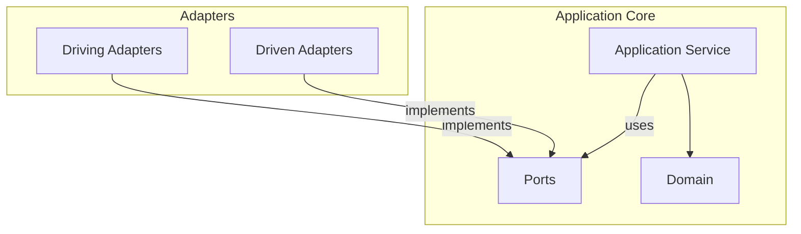

**Core Rules:**

의존성 규칙을 엄격히 지키는 것이 헥사고날 아키텍처의 핵심입니다. 첫째, Adapter는 Port를 구현하고 Port에 의존합니다. 둘째, Application Core는 Adapter를 전혀 모릅니다. 셋째, Domain은 아무것도 의존하지 않으며 순수한 business logic만 담고 있습니다.

---

#### 헥사고날의 장점

Let us examine the key benefits of hexagonal architecture with concrete examples.

**1. Testing Becomes Easy**

Port만 Mock하면 되므로 테스트가 매우 간단해집니다. 데이터베이스나 외부 API 없이도 business logic을 완벽하게 테스트할 수 있습니다.

```java
// Port만 Mock하면 됩니다
@ExtendWith(MockitoExtension.class)
class OrderServiceTest {

    @Mock private SaveOrderPort saveOrderPort;
    @Mock private LoadOrderPort loadOrderPort;
    @Mock private SendNotificationPort notificationPort;
    @Mock private CheckInventoryPort inventoryPort;

    @InjectMocks
    private OrderService orderService;

    @Test
    void 주문_생성_성공() {
        // Given
        when(inventoryPort.isAvailable(any(), anyInt())).thenReturn(true);

        CreateOrderCommand command = new CreateOrderCommand(
            CustomerId.of("customer-1"),
            List.of(new OrderLineCommand(ProductId.of("product-1"), 2))
        );

        // When
        OrderId result = orderService.execute(command);

        // Then
        verify(saveOrderPort).save(any(Order.class));
        assertThat(result).isNotNull();
    }
}
```

The test above verifies OrderService logic without actual databases or external services. Since Ports are replaced with Mocks, test writing is simple and execution is fast.

**2. technology replacement가 쉬워집니다**

Since you only need to replace Adapters, you can easily change the technology stack. The Application Core does not need any changes.

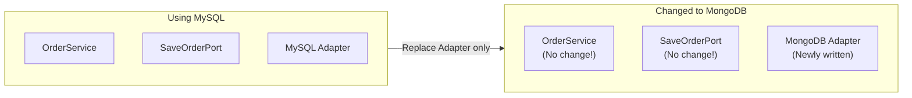

예를 들어, MySQL에서 MongoDB로 데이터베이스를 변경해도 OrderService 코드는 전혀 변경할 필요가 없습니다. SaveOrderPort interface도 그대로이고, 단지 MongoOrderAdapter라는 새로운 Adapter만 작성하면 됩니다.

```java
// MySQL에서 MongoDB로 변경해도 Service 코드 변경 없음!

// Before: MySQL Adapter
@Repository
public class MySqlOrderAdapter implements SaveOrderPort {
    private final OrderJpaRepository jpaRepository;
    // ...
}

// After: MongoDB Adapter (새로 추가)
@Repository
public class MongoOrderAdapter implements SaveOrderPort {
    private final OrderMongoRepository mongoRepository;
    // ...
}
```

**3. Adding External Integrations Becomes Easy**

새로운 알림 채널을 추가하고 싶다면 Adapter만 추가하면 됩니다. Application Core는 SendNotificationPort interface만 알고 있으므로, 어떤 Adapter를 사용하는지 상관하지 않습니다.

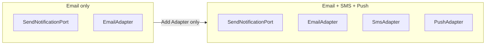

To extend from email-only to SMS and push notifications, just add SmsAdapter and PushAdapter. The Application Service still only calls SendNotificationPort, so no code changes are needed.

---

#### Trade-offs

Hexagonal architecture provides flexibility, but at a cost.


| Advantage | Cost |
|------|------|
| easy to test성 | Port/Adapter interface 작성 필요 |
| technology replacement 유연성 | 초기 설계에 더 많은 시간 소요 |
| 외부 연동 격리 | 파일 수 증가 (interface + implementation) |
| 명확한 dependency direction | 팀 전체가 패턴을 이해해야 함 |


**When Are the Costs Justified?**

The complexity of hexagonal is justified **when the possibility of external system changes is high**:
- If there is a possibility of switching the database from MySQL to PostgreSQL -> Worth it
- If you are certain you will use MySQL forever -> May be excessive abstraction

---

#### Comparison with Layered

Layered and hexagonal architectures are similar but have important differences. Let us first examine the difference in perspective.

**Difference in Perspective**

Layered emphasizes a vertical top-to-bottom structure, while hexagonal emphasizes a radial inside-outside structure.

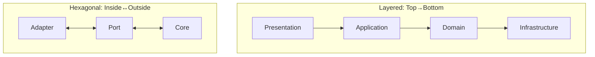

**Detailed Comparison**

The table below summarizes the key differences between layered and hexagonal.

| Perspective | Layered | Hexagonal |
|------|--------|----------|
| **Structure** | Vertical layers (4) | Inside/Outside |
| **Dependencies** | Top to bottom | Outside to inside |
| **Infrastructure** | Bottom layer | Outer Adapter |
| **Emphasis** | Layer separation | External isolation |
| **Test** | Mock needed | Port Mock only |
| **Suitable For** | Simple projects | Projects with many integrations |

Layered is simple and intuitive, but as external system integrations increase, hexagonal becomes more suitable. Hexagonal explicitly separates Ports and Adapters, enabling more flexible responses to external changes.

---

#### Common Mistakes

Let us look at common mistakes when applying hexagonal architecture.

**1. Direct Dependency Without Ports**

Port 없이 Service가 Repository implementation를 직접 의존하면 헥사고날의 이점을 잃게 됩니다. 항상 interface(Port)를 통해 의존해야 합니다.

```java
// ❌ 잘못된 예: Service가 Repository implementation를 직접 의존
@Service
public class OrderService {
    private final OrderJpaRepository jpaRepository;  // Concrete class!
}

// ✅ 올바른 예: Port(interface)에 의존
@Service
public class OrderService {
    private final SaveOrderPort saveOrderPort;  // interface!
}
```

If you depend on concrete classes, Service code must be modified when switching JPA to another technology later. If you depend on Ports, you only need to replace Adapters.

**2. Adapter에 business logic**

Adapter는 단순히 변환만 담당해야 합니다. business logic을 Adapter에 넣으면 안 됩니다.

```java
// ❌ 잘못된 예: Controller에 business logic
@RestController
public class OrderController {
    @PostMapping
    public ResponseEntity<?> createOrder(@RequestBody OrderRequest request) {
        // business logic이 Controller에!
        if (request.getTotal() > 100000) {
            request.setDiscount(0.1);
        }
        // ...
    }
}

// ✅ Correct: Controller handles only request/response
@RestController
public class OrderController {
    private final CreateOrderUseCase useCase;

    @PostMapping
    public ResponseEntity<?> createOrder(@RequestBody OrderRequest request) {
        OrderId orderId = useCase.execute(request.toCommand());  // Delegate
        return ResponseEntity.ok(new OrderIdResponse(orderId));
    }
}
```

Controllers should only be responsible for converting HTTP requests to Commands, calling Use Cases, and converting results to HTTP responses.

**3. Domain Depends on Ports**

Domain은 완전히 순수해야 하며, Port에도 의존하면 안 됩니다. Domain은 business logic만 담고 있어야 합니다.

```java
// ❌ Wrong: Entity uses Port
public class Order {
    private final SaveOrderPort saveOrderPort;  // Domain depends on Port!

    public void confirm() {
        this.status = CONFIRMED;
        saveOrderPort.save(this);  // Not allowed!
    }
}

// ✅ Correct: Domain stays pure
public class Order {
    public void confirm() {
        this.status = CONFIRMED;  // State change only
    }
}

// Save in Application Service
@Service
public class OrderService {
    public void confirmOrder(OrderId id) {
        Order order = loadOrderPort.loadById(id);
        order.confirm();
        saveOrderPort.save(order);  // Save in Service
    }
}
```

Domain Entities only handle state changes, while saving is handled by the Application Service through Ports.

---

#### Testing Strategy

In hexagonal architecture, test each level following the test pyramid.

**Strategy by Test Level**

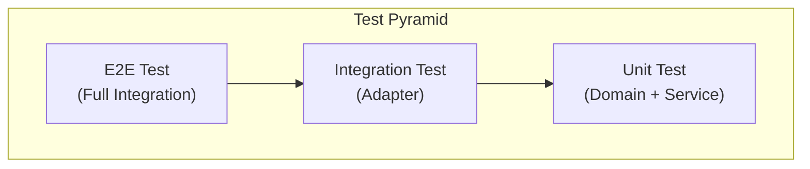

**1. Domain Test (Pure Unit Test)**

Domain은 external dependencies이 없으므로 가장 간단하게 테스트할 수 있습니다. pure Java object이므로 테스트 실행 속도도 빠릅니다.

```java
class OrderTest {

    @Test
    void 주문_확정_성공() {
        // Given
        Order order = Order.create(
            CustomerId.of("c1"),
            List.of(new OrderLine(ProductId.of("p1"), 1, Money.of(10000)))
        );

        // When
        order.confirm();

        // Then
        assertThat(order.getStatus()).isEqualTo(OrderStatus.CONFIRMED);
    }

    @Test
    void 이미_확정된_주문은_다시_확정할_수_없다() {
        Order order = createConfirmedOrder();

        assertThrows(IllegalStateException.class, () -> order.confirm());
    }
}
```

**2. Application Service Test (Port Mock)**

Application Service는 Port를 Mock으로 대체하여 테스트합니다. 실제 데이터베이스나 외부 서비스 없이 business logic을 검증할 수 있습니다.

```java
@ExtendWith(MockitoExtension.class)
class OrderServiceTest {

    @Mock private SaveOrderPort saveOrderPort;
    @Mock private LoadOrderPort loadOrderPort;
    @Mock private SendNotificationPort notificationPort;
    @Mock private CheckInventoryPort inventoryPort;

    @InjectMocks
    private OrderService orderService;

    @Test
    void 재고_부족시_주문_실패() {
        // Given
        when(inventoryPort.isAvailable(any(), anyInt())).thenReturn(false);

        CreateOrderCommand command = createCommand();

        // When & Then
        assertThrows(
            InsufficientInventoryException.class,
            () -> orderService.execute(command)
        );

        verify(saveOrderPort, never()).save(any());
    }
}
```

**3. Adapter Test (Integration Test)**

Since Adapters communicate with actual external systems, perform integration tests. Using Spring Boot test tools is convenient.

```java
// Persistence Adapter 테스트
@DataJpaTest
class OrderPersistenceAdapterTest {

    @Autowired
    private OrderJpaRepository jpaRepository;

    private OrderPersistenceAdapter adapter;

    @BeforeEach
    void setUp() {
        adapter = new OrderPersistenceAdapter(jpaRepository, new OrderMapper());
    }

    @Test
    void 주문_저장_및_조회() {
        // Given
        Order order = createOrder();

        // When
        adapter.save(order);
        Order found = adapter.loadById(order.getId());

        // Then
        assertThat(found.getId()).isEqualTo(order.getId());
    }
}

// Web Adapter 테스트
@WebMvcTest(OrderController.class)
class OrderControllerTest {

    @Autowired
    private MockMvc mockMvc;

    @MockBean
    private CreateOrderUseCase createOrderUseCase;

    @Test
    void 주문_생성_API() throws Exception {
        when(createOrderUseCase.execute(any()))
            .thenReturn(OrderId.of("order-123"));

        mockMvc.perform(post("/api/orders")
                .contentType(MediaType.APPLICATION_JSON)
                .content("{\"customerId\":\"c1\",\"items\":[]}"))
            .andExpect(status().isCreated())
            .andExpect(jsonPath("$.orderId").value("order-123"));
    }
}
```

---

#### When Should You Use Hexagonal?

Hexagonal architecture is not suitable for every project. Choose based on your project characteristics.

**Suitable Cases**

헥사고날 아키텍처는 다음과 같은 상황에서 특히 유용합니다. 외부 시스템 연동이 많은 경우, 예를 들어 여러 데이터베이스, REST API, 메시지 큐를 사용하는 프로젝트에 적합합니다. 마이크로서비스 아키텍처에서도 각 서비스의 경계를 명확히 하는 데 도움이 됩니다.

기술 변경 가능성이 있는 경우, 예를 들어 나중에 데이터베이스를 바꾸거나 메시징 시스템을 변경할 가능성이 있다면 헥사고날이 좋습니다. 팀이 테스트를 중요하게 여기는 경우에도 적합합니다. 레거시 시스템과 통합해야 할 때도 Port와 Adapter로 깔끔하게 분리할 수 있어 유용합니다.

**Unsuitable Cases**

반면, 다음과 같은 상황에서는 헥사고날이 과할 수 있습니다. 소규모 단기 프로젝트에서는 오버엔지니어링이 될 수 있습니다. 팀이 패턴에 익숙하지 않을 때는 계층형으로 시작하는 것이 좋습니다.

단순 CRUD 애플리케이션에서는 헥사고날의 이점을 누리기 어렵습니다. 외부 연동이 거의 없는 프로젝트에서도 불필요한 복잡도만 증가시킬 수 있습니다.

**Best Practice: Which Systems Fit?**

| 시스템 유형 | 적합도 | 이유 |
|------------|-------|------|
| **마이크로서비스** | 매우 적합 | 서비스 경계 명확화, 독립적 배포 |
| **이커머스 플랫폼** | 매우 적합 | 결제/배송/재고 등 다양한 외부 연동 |
| **레거시 통합** | 적합 | ACL로 레거시 격리 가능 |
| **API Gateway** | 적합 | 다양한 백엔드 서비스 연동 |
| **IoT 시스템** | 적합 | 다양한 프로토콜과 디바이스 연동 |
| **단순 CRUD** | 부적합 | 계층형으로 충분 |
| **소규모 MVP** | 부적합 | 오버엔지니어링 |
| **외부 연동 없음** | 부적합 | 계층형 권장 |

---

#### Transitioning from Layered to Hexagonal

You can gradually transition from layered to hexagonal architecture. There is no need to change everything at once.

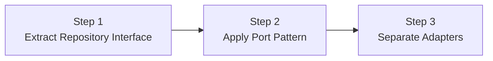

**Step 1: Move Repository Interface to Domain**

먼저 Repository interface를 Infrastructure에서 Domain으로 이동합니다.

```java
// Before: Infrastructure에 있던 Repository
// After: Domain에 interface 정의
public interface OrderRepository {
    void save(Order order);
    Optional<Order> findById(OrderId id);
}
```

**Step 2: Change to Port Naming**

Split Repository into SaveOrderPort and LoadOrderPort for more clarity.

```java
// Before: OrderRepository
// After: SaveOrderPort, LoadOrderPort 분리
public interface SaveOrderPort {
    void save(Order order);
}

public interface LoadOrderPort {
    Order loadById(OrderId id);
}
```

**3단계: Adapter package structure 정리**

마지막으로 package structure를 헥사고날 스타일로 정리합니다.

```
// Before
com.example.order/
├── controller/
├── service/
├── repository/
└── entity/

// After
com.example.order/
├── adapter/
│   ├── in/web/
│   └── out/persistence/
├── application/
│   ├── port/in/
│   ├── port/out/
│   └── service/
└── domain/
```

---

#### Key Summary


| Concept | Description | Example |
|------|------|------|
| **Port** | 연결 규격 (interface) | `SaveOrderPort`, `SendNotificationPort` |
| **Adapter** | 연결 장치 (implementation) | `JpaOrderAdapter`, `EmailAdapter` |
| **Core** | 순수 business logic | `OrderService`, `Order` |
| **Driving** | Things that call me | Controller, Kafka Listener |
| **Driven** | Things I call | Repository impl, API Client |

<strong>Remember:</strong> Dependencies always point from <strong>outside -> inside</strong> only. The Application Core knows nothing about external technologies.


---

#### Next Steps

- [클린 아키텍처]() - 더 엄격한 의존성 규칙
- [어니언 아키텍처]() - domain model 중심
- [CQRS]() - 읽기/쓰기 분리
