> **Target Audience**: Developers considering testability and external dependency replacement
> **Prerequisites**: Understanding the limitations of [Layered Architecture](layered-architecture/)
> **Estimated Time**: About 20 minutes

Also known as the **Ports and Adapters** pattern. An architecture that completely isolates the application core from the external world. The core idea of hexagonal architecture is to place business logic at the center and handle all external interactions through Ports and Adapters. This way, even if external technologies change, core business logic remains unaffected.

#### One-Line Summary

The application sits inside the hexagon, and all external connections are handled through Ports and Adapters. This allows you to perfectly separate business logic from technical details.

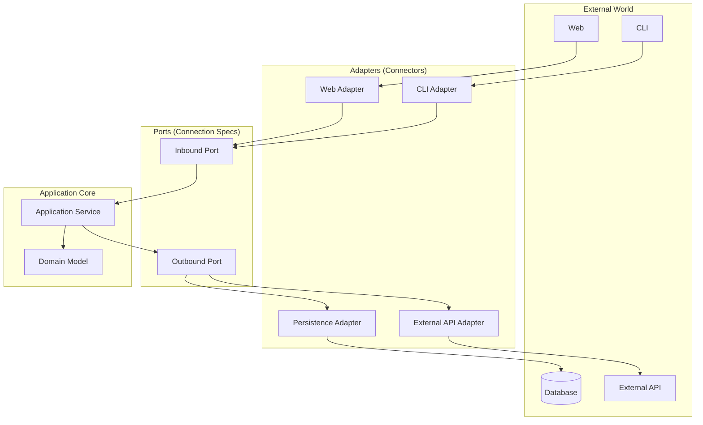

*This diagram shows the core structure of Hexagonal Architecture with the domain at the center, communicating with the external world (Web, CLI, DB, etc.) through Ports and Adapters.*

---

#### Why "Hexagonal"?

The hexagonal name does not mean 6 sides are important, but rather conveys that the application can be connected from multiple directions. Unlike the one-way flow of "top to bottom" in layered architecture, hexagonal presents the perspective of "inside and outside."


Think about a smartphone. The smartphone itself does not know which charger it uses.

- **Smartphone (Core)**: Handles only core functions like calls and app execution
- **Charging Port (Port)**: An interface that says "I want to receive power"
- **Adapter**: Connects via various methods like USB-C, wireless charging, USB

Even if the charging method changes, the phone's functions remain the same. **Just changing the adapter lets you connect to various devices.**


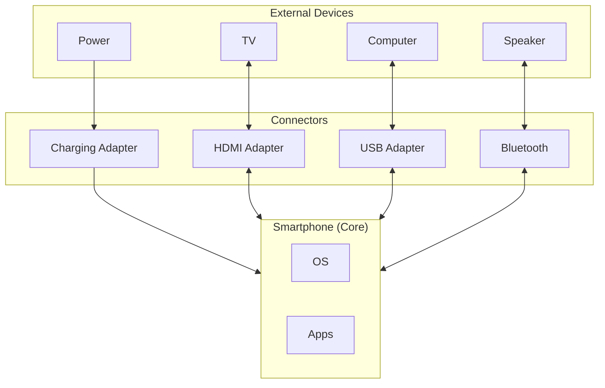

*This diagram uses a smartphone analogy where the Core (OS, apps) connects to various Adapters through Ports (charging, earphone, display).*

The same applies to software. Core business logic does not need to know which database or UI framework is used. All these technical choices are isolated through Adapters.

The hexagonal shape does not mean 6 sides are important, but visually represents "can be connected from multiple directions." The key is shifting thinking from the layered "top->bottom" to an "inside<->outside" perspective.

---

#### Three Core Concepts

To understand hexagonal architecture, you need to know three concepts: Port, Adapter, and Application Core. Understanding how these three collaborate reveals the full picture of hexagonal architecture.

**1. Port - "Connection Spec"**

A Port is an interface. It defines the "specification" for connecting with the outside. There are two types of Ports. Inbound Ports define incoming requests from external to application, and Outbound Ports define outgoing requests from application to external.

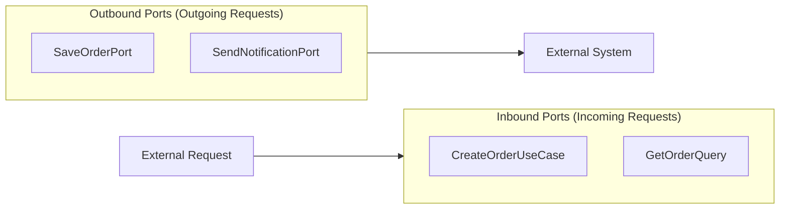

*This diagram shows the difference between Inbound Ports (incoming requests: CreateOrderUseCase, etc.) and Outbound Ports (outgoing requests: SaveOrderPort, etc.).*

Understanding the <strong>two types of Ports</strong> is important. The table below summarizes each Port's characteristics.

| Port Type | Direction | Role | Example |
|----------|------|------|------|
| **Inbound Port** | External -> Application | "Request me like this" | `CreateOrderUseCase` |
| **Outbound Port** | Application -> External | "I only need this" | `SaveOrderPort` |

Inbound Ports define how the application can be called from outside. For example, it specifies "you need this information to create an order." Outbound Ports define what the application requests from the outside. It specifies "I want to save an order" but does not need to know which database or how to store it.

```java
// Inbound Port: "Call me like this from outside"
public interface CreateOrderUseCase {
    OrderId createOrder(CreateOrderCommand command);
}

// Outbound Port: "I want to save an order"
public interface SaveOrderPort {
    void save(Order order);
}
```

By defining Ports as interfaces, you do not need to know what the specific implementation is. Even if you later switch MySQL to MongoDB or REST API to gRPC, the Ports do not need to change.

**2. Adapter - "Connector"**

An Adapter is an implementation. It handles the actual connection according to the Port specification. There are also two types of Adapters. Driving Adapters call the application, and Driven Adapters are called by the application.

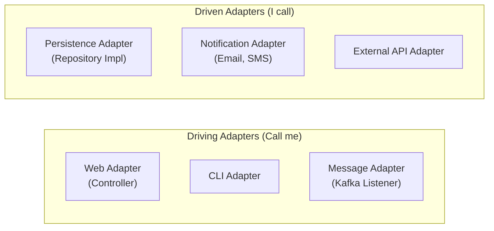

*This diagram shows the difference between Driving Adapters (things that call me, e.g., Controller) and Driven Adapters (things I call, e.g., DB).*

Distinguishing the <strong>two types of Adapters</strong> is important. The table below summarizes each Adapter's characteristics.

| Adapter Type | Other Name | Role | Example |
|-------------|----------|------|------|
| **Driving Adapter** | Primary Adapter | Calls the application | Controller, CLI |
| **Driven Adapter** | Secondary Adapter | Called by the application | Repository impl, API Client |

Driving Adapters receive external requests and pass them to the application. For example, an HTTP Controller receives HTTP requests and converts them to Inbound Port format. Driven Adapters pass application requests to external systems. For example, a JPA Repository converts application save requests into database queries.

```java
// Driving Adapter: Receive external requests and pass to application
@RestController
public class OrderController {
    private final CreateOrderUseCase createOrderUseCase;  // Uses Port

    @PostMapping("/orders")
    public ResponseEntity<String> createOrder(@RequestBody OrderRequest request) {
        OrderId orderId = createOrderUseCase.createOrder(request.toCommand());
        return ResponseEntity.ok(orderId.getValue());
    }
}

// Driven Adapter: Pass application requests to external systems
@Repository
public class OrderPersistenceAdapter implements SaveOrderPort {
    private final OrderJpaRepository jpaRepository;

    @Override
    public void save(Order order) {
        OrderEntity entity = OrderMapper.toEntity(order);
        jpaRepository.save(entity);
    }
}
```

In the code above, OrderController receives HTTP requests and calls CreateOrderUseCase, while OrderPersistenceAdapter implements SaveOrderPort to save to the database. The important point is that the application core is completely unaware of these Adapters.

**3. Application Core - "Business Heart"**

Inside the hexagon, there is only pure business logic. The Application Core consists of the Application Layer and the Domain Layer. The Application Layer orchestrates business process flow, while the Domain Layer contains the core business rules.

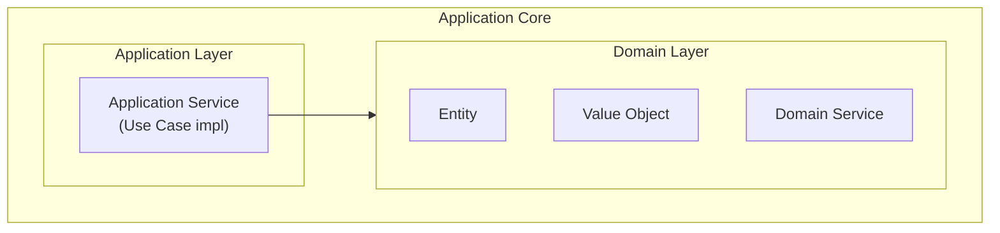

*This diagram shows the relationship between the Application Layer and Domain Layer within the Application Core, and the external Adapters.*

The Application Core knows nothing about the external world. It does not know what HTTP is, what JPA is, or what Kafka is. It only knows Port interfaces and focuses solely on pure business logic.

---

#### Full Structure at a Glance

Let us see the full picture of how all elements of hexagonal architecture collaborate. Understanding how the external world, Driving Adapters, Inbound Ports, Application Core, Outbound Ports, and Driven Adapters connect reveals the essence of hexagonal architecture.

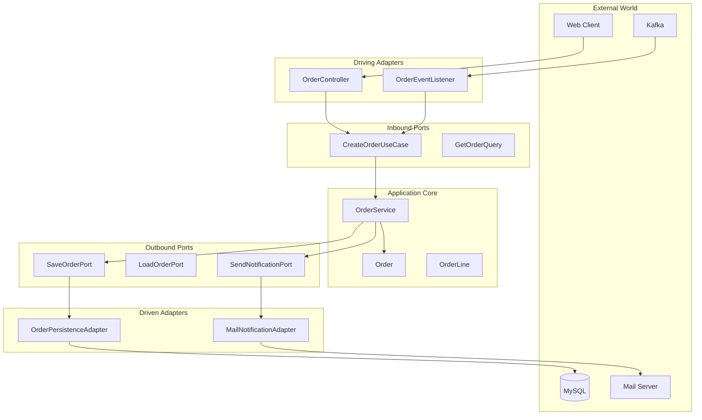

*This diagram shows the complete connection structure from the external world through Driving Adapter, Inbound Port, Application Core, Outbound Port, to Driven Adapter.*

Pay attention to the direction of the arrows in the diagram above. Dependencies always point from outside to inside only. The Application Core knows nothing about the outside and only uses Port interfaces.

---

#### Understanding Through Code

Now let us implement hexagonal architecture with actual code. We will proceed in the order of Port definition, Application Service implementation, and Adapter implementation.

**Step 1: Define Ports**

First, define the application boundaries with Ports. Inbound Ports define use cases that can be called from outside, and Outbound Ports define external services that the application needs.

```java
// === Inbound Ports ===
// Located in the Application package

// Create order use case
public interface CreateOrderUseCase {
    OrderId execute(CreateOrderCommand command);
}

// Confirm order use case
public interface ConfirmOrderUseCase {
    void execute(OrderId orderId);
}

// Order query (Query)
public interface GetOrderQuery {
    OrderDto execute(OrderId orderId);
}
```

Inbound Ports clearly define the capabilities the application offers. Each use case has a single business purpose, and the outside world can call the application by looking only at these interfaces.

```java
// === Outbound Ports ===
// Located in the Application package

// Save order
public interface SaveOrderPort {
    void save(Order order);
}

// Load order
public interface LoadOrderPort {
    Order loadById(OrderId id);
    boolean existsById(OrderId id);
}

// Send notification
public interface SendNotificationPort {
    void sendOrderConfirmation(Order order);
}

// Check inventory
public interface CheckInventoryPort {
    boolean isAvailable(ProductId productId, int quantity);
}
```

Outbound Ports define external services the application needs. All communication with external systems including databases, message queues, and external APIs is done through these Ports.

**Step 2: Implement Application Service**

The Application Service implements Inbound Ports and uses Outbound Ports. It orchestrates business flow and composes Domain objects to complete use cases.

```java
@Service
@Transactional
public class OrderService implements CreateOrderUseCase, ConfirmOrderUseCase {

    // Depends only on Outbound Ports (interfaces)
    private final SaveOrderPort saveOrderPort;
    private final LoadOrderPort loadOrderPort;
    private final SendNotificationPort notificationPort;
    private final CheckInventoryPort inventoryPort;

    // Constructor injection
    public OrderService(
            SaveOrderPort saveOrderPort,
            LoadOrderPort loadOrderPort,
            SendNotificationPort notificationPort,
            CheckInventoryPort inventoryPort) {
        this.saveOrderPort = saveOrderPort;
        this.loadOrderPort = loadOrderPort;
        this.notificationPort = notificationPort;
        this.inventoryPort = inventoryPort;
    }

    @Override
    public OrderId execute(CreateOrderCommand command) {
        // 1. Check inventory (using Outbound Port)
        for (OrderLineCommand line : command.getLines()) {
            if (!inventoryPort.isAvailable(line.getProductId(), line.getQuantity())) {
                throw new InsufficientInventoryException(line.getProductId());
            }
        }

        // 2. Create order (Domain Logic)
        Order order = Order.create(
            command.getCustomerId(),
            command.toOrderLines()
        );

        // 3. Save (using Outbound Port)
        saveOrderPort.save(order);

        return order.getId();
    }

    @Override
    public void execute(OrderId orderId) {
        // 1. Retrieve order (using Outbound Port)
        Order order = loadOrderPort.loadById(orderId);

        // 2. Confirm order (Domain Logic)
        order.confirm();

        // 3. Save (using Outbound Port)
        saveOrderPort.save(order);

        // 4. Send notification (using Outbound Port)
        notificationPort.sendOrderConfirmation(order);
    }
}
```

In the code above, OrderService depends only on Port interfaces, not concrete implementations. It has no idea whether SaveOrderPort uses JPA or MongoDB, or whether SendNotificationPort sends email or SMS. This is the core of hexagonal architecture.


**Key Point**

Application Service **only knows Ports (interfaces):**
- `SaveOrderPort` -- does not know if it is JPA or MongoDB
- `SendNotificationPort` -- does not know if it is email or SMS
- `CheckInventoryPort` -- does not know if it is an internal DB or external API

That is why **this code never needs to change even when external technologies change!**


**Step 3: Implement Driving Adapters**

Driving Adapters receive external requests and call Inbound Ports. For example, a Web Adapter receives HTTP requests, converts them to Command objects, then executes Use Cases.

```java
// === Web Adapter (Driving) ===
@RestController
@RequestMapping("/api/orders")
public class OrderController {

    private final CreateOrderUseCase createOrderUseCase;
    private final ConfirmOrderUseCase confirmOrderUseCase;
    private final GetOrderQuery getOrderQuery;

    @PostMapping
    public ResponseEntity<OrderIdResponse> createOrder(
            @Valid @RequestBody CreateOrderRequest request) {

        // Convert Request -> Command
        CreateOrderCommand command = request.toCommand();

        // Execute Use Case
        OrderId orderId = createOrderUseCase.execute(command);

        // Create Response
        return ResponseEntity
            .status(HttpStatus.CREATED)
            .body(new OrderIdResponse(orderId.getValue()));
    }

    @PostMapping("/{orderId}/confirm")
    public ResponseEntity<Void> confirmOrder(@PathVariable String orderId) {
        confirmOrderUseCase.execute(OrderId.of(orderId));
        return ResponseEntity.ok().build();
    }

    @GetMapping("/{orderId}")
    public ResponseEntity<OrderResponse> getOrder(@PathVariable String orderId) {
        OrderDto order = getOrderQuery.execute(OrderId.of(orderId));
        return ResponseEntity.ok(OrderResponse.from(order));
    }
}
```

OrderController only handles the details of the HTTP transport protocol. All it does is receive HTTP requests, convert to Commands, call Use Cases, and convert results to HTTP responses.

```java
// === Message Adapter (Driving) ===
@Component
public class OrderEventListener {

    private final ConfirmOrderUseCase confirmOrderUseCase;

    @KafkaListener(topics = "payment-completed")
    public void onPaymentCompleted(PaymentCompletedEvent event) {
        // Automatically confirm order when payment completes
        confirmOrderUseCase.execute(OrderId.of(event.getOrderId()));
    }
}
```

The Message Adapter receives Kafka messages and calls Use Cases. The application core does not know about Kafka at all; it is simply called through Inbound Ports.

**Step 4: Implement Driven Adapters**

Driven Adapters implement Outbound Ports to communicate with external systems. For example, the Persistence Adapter implements SaveOrderPort to handle the technical details of saving to a database.

```java
// === Persistence Adapter (Driven) ===
@Repository
public class OrderPersistenceAdapter implements SaveOrderPort, LoadOrderPort {

    private final OrderJpaRepository jpaRepository;
    private final OrderMapper mapper;

    @Override
    public void save(Order order) {
        OrderEntity entity = mapper.toEntity(order);
        jpaRepository.save(entity);
    }

    @Override
    public Order loadById(OrderId id) {
        return jpaRepository.findById(id.getValue())
            .map(mapper::toDomain)
            .orElseThrow(() -> new OrderNotFoundException(id));
    }

    @Override
    public boolean existsById(OrderId id) {
        return jpaRepository.existsById(id.getValue());
    }
}
```

OrderPersistenceAdapter accesses the database using JPA. It is responsible for converting Domain objects to JPA Entities and vice versa.

```java
// === Notification Adapter (Driven) ===
@Component
public class EmailNotificationAdapter implements SendNotificationPort {

    private final JavaMailSender mailSender;

    @Override
    public void sendOrderConfirmation(Order order) {
        SimpleMailMessage message = new SimpleMailMessage();
        message.setTo(order.getCustomerEmail());
        message.setSubject("Your order has been confirmed");
        message.setText("Order number: " + order.getId().getValue());

        mailSender.send(message);
    }
}
```

EmailNotificationAdapter sends emails. If you want to switch to SMS later, simply create a new SmsNotificationAdapter that implements SendNotificationPort. No Application Service code changes are needed.

```java
// === External API Adapter (Driven) ===
@Component
public class InventoryApiAdapter implements CheckInventoryPort {

    private final RestTemplate restTemplate;

    @Override
    public boolean isAvailable(ProductId productId, int quantity) {
        String url = "http://inventory-service/api/products/{id}/stock";

        InventoryResponse response = restTemplate.getForObject(
            url,
            InventoryResponse.class,
            productId.getValue()
        );

        return response.getAvailableQuantity() >= quantity;
    }
}
```

InventoryApiAdapter communicates with an external inventory management service. The Application Core has no idea whether inventory is in an internal database or fetched from an external API.

---

#### Package Structure

Here is how hexagonal architecture is expressed as a package structure. The adapter package is divided into in and out, the application package contains ports and services, and the domain package holds the pure domain model.

```
com.example.order/
│
├── adapter/                          # Adapters (external connections)
│   ├── in/                           # Driving Adapters
│   │   ├── web/
│   │   │   ├── OrderController.java
│   │   │   ├── CreateOrderRequest.java
│   │   │   └── OrderResponse.java
│   │   └── message/
│   │       └── OrderEventListener.java
│   │
│   └── out/                          # Driven Adapters
│       ├── persistence/
│       │   ├── OrderPersistenceAdapter.java
│       │   ├── OrderEntity.java
│       │   ├── OrderJpaRepository.java
│       │   └── OrderMapper.java
│       ├── notification/
│       │   └── EmailNotificationAdapter.java
│       └── inventory/
│           └── InventoryApiAdapter.java
│
├── application/                      # Application Core - outer
│   ├── port/
│   │   ├── in/                       # Inbound Ports
│   │   │   ├── CreateOrderUseCase.java
│   │   │   ├── ConfirmOrderUseCase.java
│   │   │   └── GetOrderQuery.java
│   │   └── out/                      # Outbound Ports
│   │       ├── SaveOrderPort.java
│   │       ├── LoadOrderPort.java
│   │       ├── SendNotificationPort.java
│   │       └── CheckInventoryPort.java
│   └── service/
│       └── OrderService.java
│
└── domain/                           # Application Core - inner
    ├── Order.java
    ├── OrderLine.java
    ├── OrderId.java
    ├── OrderStatus.java
    └── Money.java
```

In this structure, the adapter package is on the outermost layer, while application and domain packages are inside. Dependencies always point from outside to inside only.

---

#### Dependency Direction

The core of hexagonal architecture is the dependency direction. All dependencies point from Adapter to Port, and from Port to Core. The Core depends on nothing.

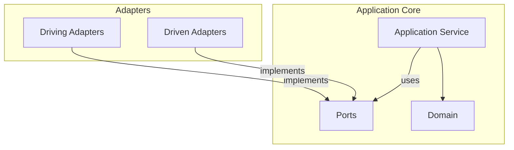

*This diagram shows the dependency direction flowing from Adapter to Port to Core, where Core depends on nothing.*

**Core Rules:**

Strictly following the dependency rules is the core of hexagonal architecture. First, Adapters implement and depend on Ports. Second, the Application Core knows nothing about Adapters. Third, the Domain depends on nothing and contains only pure business logic.

---

#### Benefits of Hexagonal

Let us examine the key benefits of hexagonal architecture with concrete examples.

**1. Testing Becomes Easy**

Since you only need to Mock Ports, testing becomes very simple. You can perfectly test business logic without databases or external APIs.

```java
// Just Mock the Ports
@ExtendWith(MockitoExtension.class)
class OrderServiceTest {

    @Mock private SaveOrderPort saveOrderPort;
    @Mock private LoadOrderPort loadOrderPort;
    @Mock private SendNotificationPort notificationPort;
    @Mock private CheckInventoryPort inventoryPort;

    @InjectMocks
    private OrderService orderService;

    @Test
    void order_creation_success() {
        // Given
        when(inventoryPort.isAvailable(any(), anyInt())).thenReturn(true);

        CreateOrderCommand command = new CreateOrderCommand(
            CustomerId.of("customer-1"),
            List.of(new OrderLineCommand(ProductId.of("product-1"), 2))
        );

        // When
        OrderId result = orderService.execute(command);

        // Then
        verify(saveOrderPort).save(any(Order.class));
        assertThat(result).isNotNull();
    }
}
```

The test above verifies OrderService logic without actual databases or external services. Since Ports are replaced with Mocks, test writing is simple and execution is fast.

**2. Technology Replacement Becomes Easy**

Since you only need to replace Adapters, you can easily change the technology stack. The Application Core does not need any changes.

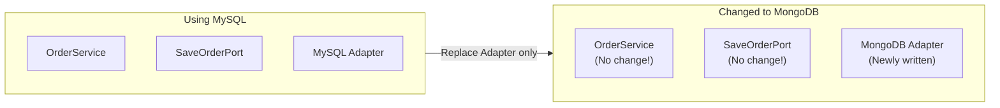

*This diagram shows the ease of technology stack replacement where only the Adapter needs to be swapped when switching from MySQL to MongoDB.*

For example, even if you change the database from MySQL to MongoDB, the OrderService code does not need any changes. The SaveOrderPort interface remains the same, and you simply write a new MongoOrderAdapter.

```java
// No Service code changes needed even when switching from MySQL to MongoDB!

// Before: MySQL Adapter
@Repository
public class MySqlOrderAdapter implements SaveOrderPort {
    private final OrderJpaRepository jpaRepository;
    // ...
}

// After: MongoDB Adapter (newly added)
@Repository
public class MongoOrderAdapter implements SaveOrderPort {
    private final OrderMongoRepository mongoRepository;
    // ...
}
```

**3. Adding External Integrations Becomes Easy**

If you want to add a new notification channel, you just add an Adapter. Since the Application Core only knows the SendNotificationPort interface, it does not care which Adapter is used.

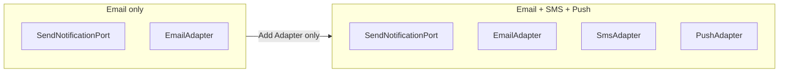

*This diagram shows an example of extending notification channels by adding SMS and Push Adapters alongside the Email Adapter.*

To extend from email-only to SMS and push notifications, just add SmsAdapter and PushAdapter. The Application Service still only calls SendNotificationPort, so no code changes are needed.

---

#### Trade-offs

Hexagonal architecture provides flexibility, but at a cost.


| Advantage | Cost |
|------|------|
| Testability | Need to write Port/Adapter interfaces |
| Technology replacement flexibility | More time needed for initial design |
| External integration isolation | Increased number of files (interface + implementation) |
| Clear dependency direction | Entire team must understand the pattern |


**When Are the Costs Justified?**

The complexity of hexagonal is justified **when the possibility of external system changes is high**:
- If there is a possibility of switching the database from MySQL to PostgreSQL -> Worth it
- If you are certain you will use MySQL forever -> May be excessive abstraction

---

#### Comparison with Layered

Layered and hexagonal architectures are similar but have important differences. Let us first examine the difference in perspective.

**Difference in Perspective**

Layered emphasizes a vertical top-to-bottom structure, while hexagonal emphasizes a radial inside-outside structure.

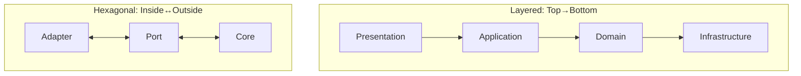

*This diagram compares the structural differences between Layered Architecture (top-down) and Hexagonal Architecture (inside-out).*

**Detailed Comparison**

The table below summarizes the key differences between layered and hexagonal.

| Perspective | Layered | Hexagonal |
|------|--------|----------|
| **Structure** | Vertical layers (4) | Inside/Outside |
| **Dependencies** | Top to bottom | Outside to inside |
| **Infrastructure** | Bottom layer | Outer Adapter |
| **Emphasis** | Layer separation | External isolation |
| **Test** | Mock needed | Port Mock only |
| **Suitable For** | Simple projects | Projects with many integrations |

Layered is simple and intuitive, but as external system integrations increase, hexagonal becomes more suitable. Hexagonal explicitly separates Ports and Adapters, enabling more flexible responses to external changes.

---

#### Common Mistakes

Let us look at common mistakes when applying hexagonal architecture.

**1. Direct Dependency Without Ports**

If a Service directly depends on a Repository implementation without a Port, you lose the benefits of hexagonal architecture. You must always depend through interfaces (Ports).

```java
// ❌ Wrong: Service directly depends on Repository implementation
@Service
public class OrderService {
    private final OrderJpaRepository jpaRepository;  // Concrete class!
}

// ✅ Correct: Depend on Port (interface)
@Service
public class OrderService {
    private final SaveOrderPort saveOrderPort;  // interface!
}
```

If you depend on concrete classes, Service code must be modified when switching JPA to another technology later. If you depend on Ports, you only need to replace Adapters.

**2. Business Logic in Adapters**

Adapters should only handle conversion. You must not put business logic in Adapters.

```java
// ❌ Wrong: Business logic in Controller
@RestController
public class OrderController {
    @PostMapping
    public ResponseEntity<?> createOrder(@RequestBody OrderRequest request) {
        // Business logic in the Controller!
        if (request.getTotal() > 100000) {
            request.setDiscount(0.1);
        }
        // ...
    }
}

// ✅ Correct: Controller handles only request/response
@RestController
public class OrderController {
    private final CreateOrderUseCase useCase;

    @PostMapping
    public ResponseEntity<?> createOrder(@RequestBody OrderRequest request) {
        OrderId orderId = useCase.execute(request.toCommand());  // Delegate
        return ResponseEntity.ok(new OrderIdResponse(orderId));
    }
}
```

Controllers should only be responsible for converting HTTP requests to Commands, calling Use Cases, and converting results to HTTP responses.

**3. Domain Depends on Ports**

The Domain must be completely pure and must not depend even on Ports. The Domain should contain only business logic.

```java
// ❌ Wrong: Entity uses Port
public class Order {
    private final SaveOrderPort saveOrderPort;  // Domain depends on Port!

    public void confirm() {
        this.status = CONFIRMED;
        saveOrderPort.save(this);  // Not allowed!
    }
}

// ✅ Correct: Domain stays pure
public class Order {
    public void confirm() {
        this.status = CONFIRMED;  // State change only
    }
}

// Save in Application Service
@Service
public class OrderService {
    public void confirmOrder(OrderId id) {
        Order order = loadOrderPort.loadById(id);
        order.confirm();
        saveOrderPort.save(order);  // Save in Service
    }
}
```

Domain Entities only handle state changes, while saving is handled by the Application Service through Ports.

---

#### Testing Strategy

In hexagonal architecture, test each level following the test pyramid.

**Strategy by Test Level**

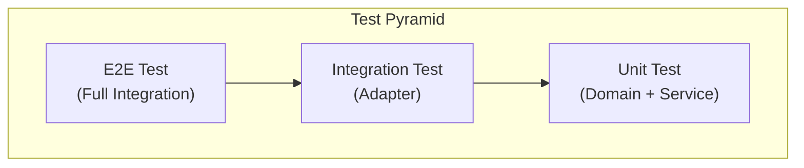

*This diagram shows the test pyramid strategy from unit tests (Domain/Port) to integration tests (Adapter) to E2E tests.*

**1. Domain Test (Pure Unit Test)**

Since the Domain has no external dependencies, it is the simplest to test. As pure Java objects, test execution is also fast.

```java
class OrderTest {

    @Test
    void order_confirmation_success() {
        // Given
        Order order = Order.create(
            CustomerId.of("c1"),
            List.of(new OrderLine(ProductId.of("p1"), 1, Money.of(10000)))
        );

        // When
        order.confirm();

        // Then
        assertThat(order.getStatus()).isEqualTo(OrderStatus.CONFIRMED);
    }

    @Test
    void already_confirmed_order_cannot_be_confirmed_again() {
        Order order = createConfirmedOrder();

        assertThrows(IllegalStateException.class, () -> order.confirm());
    }
}
```

**2. Application Service Test (Port Mock)**

The Application Service is tested by replacing Ports with Mocks. You can verify business logic without actual databases or external services.

```java
@ExtendWith(MockitoExtension.class)
class OrderServiceTest {

    @Mock private SaveOrderPort saveOrderPort;
    @Mock private LoadOrderPort loadOrderPort;
    @Mock private SendNotificationPort notificationPort;
    @Mock private CheckInventoryPort inventoryPort;

    @InjectMocks
    private OrderService orderService;

    @Test
    void order_fails_when_inventory_insufficient() {
        // Given
        when(inventoryPort.isAvailable(any(), anyInt())).thenReturn(false);

        CreateOrderCommand command = createCommand();

        // When & Then
        assertThrows(
            InsufficientInventoryException.class,
            () -> orderService.execute(command)
        );

        verify(saveOrderPort, never()).save(any());
    }
}
```

**3. Adapter Test (Integration Test)**

Since Adapters communicate with actual external systems, perform integration tests. Using Spring Boot test tools is convenient.

```java
// Persistence Adapter test
@DataJpaTest
class OrderPersistenceAdapterTest {

    @Autowired
    private OrderJpaRepository jpaRepository;

    private OrderPersistenceAdapter adapter;

    @BeforeEach
    void setUp() {
        adapter = new OrderPersistenceAdapter(jpaRepository, new OrderMapper());
    }

    @Test
    void save_and_load_order() {
        // Given
        Order order = createOrder();

        // When
        adapter.save(order);
        Order found = adapter.loadById(order.getId());

        // Then
        assertThat(found.getId()).isEqualTo(order.getId());
    }
}

// Web Adapter test
@WebMvcTest(OrderController.class)
class OrderControllerTest {

    @Autowired
    private MockMvc mockMvc;

    @MockBean
    private CreateOrderUseCase createOrderUseCase;

    @Test
    void create_order_API() throws Exception {
        when(createOrderUseCase.execute(any()))
            .thenReturn(OrderId.of("order-123"));

        mockMvc.perform(post("/api/orders")
                .contentType(MediaType.APPLICATION_JSON)
                .content("{\"customerId\":\"c1\",\"items\":[]}"))
            .andExpect(status().isCreated())
            .andExpect(jsonPath("$.orderId").value("order-123"));
    }
}
```

---

#### When Should You Use Hexagonal?

Hexagonal architecture is not suitable for every project. Choose based on your project characteristics.

**Suitable Cases**

Hexagonal architecture is particularly useful in the following situations. When there are many external system integrations -- for example, projects using multiple databases, REST APIs, and message queues. It also helps clearly define the boundaries of each service in microservice architectures.

When there is a possibility of technology changes -- for example, if you might switch databases or change messaging systems later, hexagonal is a good fit. It is also suitable when the team values testing. When integrating with legacy systems, Ports and Adapters allow for clean separation.

**Unsuitable Cases**

On the other hand, hexagonal may be excessive in the following situations. For small, short-term projects, it can be over-engineering. When the team is not familiar with the pattern, it is better to start with layered architecture.

For simple CRUD applications, it is hard to benefit from hexagonal. For projects with almost no external integrations, it can only add unnecessary complexity.

**Best Practice: Which Systems Fit?**

| System Type | Suitability | Reason |
|------------|-------|------|
| **Microservices** | Very suitable | Clear service boundaries, independent deployment |
| **E-commerce Platform** | Very suitable | Various external integrations such as payment/shipping/inventory |
| **Legacy Integration** | Suitable | Can isolate legacy with ACL |
| **API Gateway** | Suitable | Various backend service integrations |
| **IoT Systems** | Suitable | Various protocol and device integrations |
| **Simple CRUD** | Unsuitable | Layered is sufficient |
| **Small MVP** | Unsuitable | Over-engineering |
| **No External Integrations** | Unsuitable | Layered recommended |

---

#### Transitioning from Layered to Hexagonal

You can gradually transition from layered to hexagonal architecture. There is no need to change everything at once.

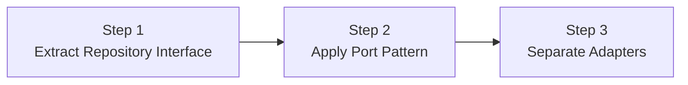

*This diagram shows the gradual transition stages from existing layered architecture through Repository Interface extraction, Port pattern application, to Adapter separation.*

**Step 1: Move Repository Interface to Domain**

First, move the Repository interface from Infrastructure to Domain.

```java
// Before: Repository in Infrastructure
// After: Interface defined in Domain
public interface OrderRepository {
    void save(Order order);
    Optional<Order> findById(OrderId id);
}
```

**Step 2: Change to Port Naming**

Split Repository into SaveOrderPort and LoadOrderPort for more clarity.

```java
// Before: OrderRepository
// After: Split into SaveOrderPort, LoadOrderPort
public interface SaveOrderPort {
    void save(Order order);
}

public interface LoadOrderPort {
    Order loadById(OrderId id);
}
```

**Step 3: Organize Adapter Package Structure**

Finally, reorganize the package structure into the hexagonal style.

```
// Before
com.example.order/
├── controller/
├── service/
├── repository/
└── entity/

// After
com.example.order/
├── adapter/
│   ├── in/web/
│   └── out/persistence/
├── application/
│   ├── port/in/
│   ├── port/out/
│   └── service/
└── domain/
```

---

#### Key Summary


| Concept | Description | Example |
|------|------|------|
| **Port** | Connection spec (interface) | `SaveOrderPort`, `SendNotificationPort` |
| **Adapter** | Connector (implementation) | `JpaOrderAdapter`, `EmailAdapter` |
| **Core** | Pure business logic | `OrderService`, `Order` |
| **Driving** | Things that call me | Controller, Kafka Listener |
| **Driven** | Things I call | Repository impl, API Client |

<strong>Remember:</strong> Dependencies always point from <strong>outside -> inside</strong> only. The Application Core knows nothing about external technologies.


---

#### Next Steps

- [Clean Architecture](clean-architecture/) - Stricter dependency rules
- [Onion Architecture](onion-architecture/) - Domain model centered
- [CQRS](cqrs/) - Read/write separation
