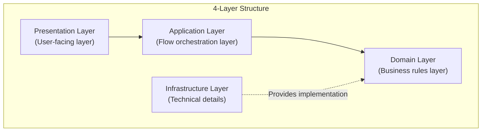
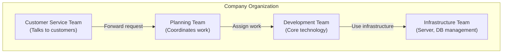
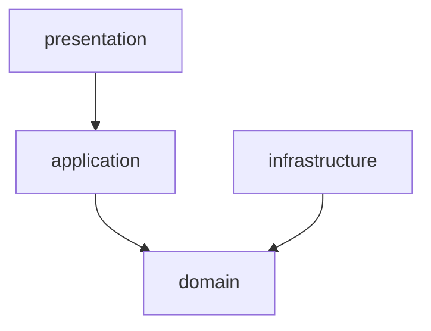
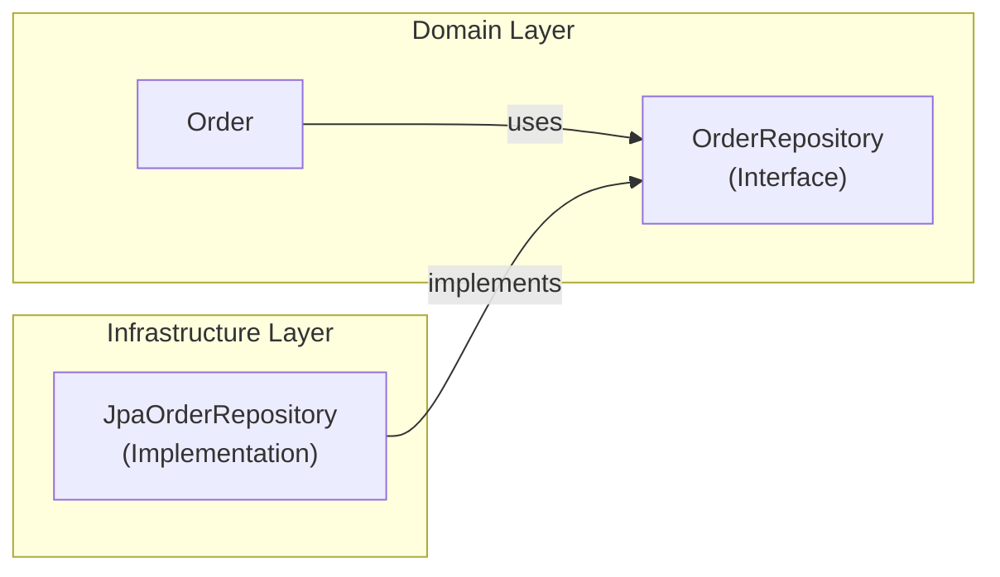
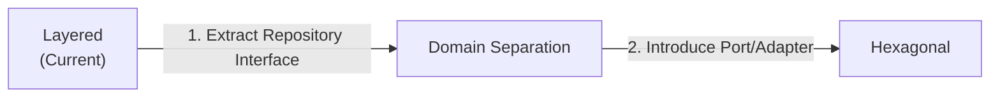

> **Target Audience**: Developers learning architecture patterns for the first time
> **Prerequisites**: Basic understanding of Spring Boot MVC patterns
> **Estimated Time**: About 15 minutes

The most basic and widely used architecture pattern. **If you are learning architecture for the first time, start here.** Layered architecture divides software horizontally so each layer has a clear role. It follows the simple but powerful rule that each layer can only call the layer below it.

#### One-Line Summary

The fundamental principle is dividing code into 4 layers and calling only from top to bottom. This allows each layer to focus on its responsibilities, making the code structure easy to understand.



*This diagram shows the four layers of Layered Architecture (Presentation, Application, Domain, Infrastructure) and the top-down dependency direction.*

---

#### Why Divide Into Layers?

The reason for dividing into layers is to separate complex systems into manageable units. When each layer has its own responsibility, it is easy to predict the impact of code changes, and collaboration between team members becomes smoother.


Think about how work is done in a company:

| Company Organization | Software Layer | Role |
|----------|---------------|------|
| **Customer Service** | Presentation | Understanding what the customer wants |
| **Planning Team** | Application | Coordinating processing order |
| **Development Team** | Domain | Developing core features |
| **Infrastructure Team** | Infrastructure | Managing servers, DBs, etc. |

Each team is efficient because they focus on their role, right? **The same applies to software.**




*This diagram uses a company organization analogy showing the roles of Customer Service team (Presentation), Planning team (Application), Expert team (Domain), and Support team (Infrastructure).*

Each team has a clear role, so when problems arise, you immediately know where to fix. Software layers operate on the same principle.

---

#### 4 Layers in Detail

Layered architecture consists of four major layers. Each layer is clearly distinguished, and upper layers can only call lower layers.

**1. Presentation Layer**

The presentation layer is the gateway for communicating with users. It receives user input and displays results. It processes HTTP requests or accepts screen input and delivers results as JSON responses or HTML pages. It also validates that input formats are correct.

Users interact with the system only through this layer. When a user clicks a button or submits a form, the presentation layer receives it, converts it to an appropriate format, and passes it to the lower layer.

```java
// Presentation Layer example: Controller
@RestController
@RequestMapping("/api/orders")
public class OrderController {

    private final OrderService orderService;  // Application Layer call

    // Receive user request
    @PostMapping
    public ResponseEntity<OrderResponse> createOrder(
            @Valid @RequestBody CreateOrderRequest request) {

        // 1. Pass request data to Application Layer
        OrderDto result = orderService.createOrder(
            request.getCustomerId(),
            request.getItems()
        );

        // 2. Return result to user
        return ResponseEntity.ok(OrderResponse.from(result));
    }

    @GetMapping("/{orderId}")
    public ResponseEntity<OrderResponse> getOrder(@PathVariable String orderId) {
        OrderDto order = orderService.getOrder(orderId);
        return ResponseEntity.ok(OrderResponse.from(order));
    }
}

// Request/Response objects (DTO)
public record CreateOrderRequest(
    String customerId,
    List<OrderItemRequest> items
) {}

public record OrderResponse(
    String orderId,
    String status,
    BigDecimal totalAmount
) {
    public static OrderResponse from(OrderDto dto) {
        return new OrderResponse(dto.orderId(), dto.status(), dto.totalAmount());
    }
}
```

In the code above, OrderController receives HTTP requests, passes them to OrderService, and converts the results back to HTTP responses. This layer only knows about the HTTP transport protocol details and contains no business logic.


**Common Mistake: Putting Business Logic in Presentation**

```java
// ❌ Wrong: Discount calculation in Controller
@PostMapping
public ResponseEntity<OrderResponse> createOrder(...) {
    // This logic should not be here!
    if (request.getTotalAmount() > 100000) {
        request.setDiscount(0.1);  // 10% 할인
    }
}
```

Business logic should be in the Domain Layer.


**2. Application Layer**

The application layer is the conductor that orchestrates business flows. This layer decides "what" to do but leaves "how" to do it to the Domain Layer. It decides the processing order, manages transactions, and combines Domain Layer objects.

For example, when creating an order, it orchestrates the flow of retrieving customer information, creating the order object, saving it, and sending notifications. While Domain objects handle the actual business rules at each step, the Application Layer decides the execution order.

```java
// Application Layer example: Service
@Service
@Transactional  // Transaction management here
public class OrderService {

    private final OrderRepository orderRepository;
    private final CustomerRepository customerRepository;
    private final PaymentService paymentService;
    private final NotificationService notificationService;

    // Orchestrate order creation "flow"
    public OrderDto createOrder(String customerId, List<OrderItemDto> items) {

        // 1. Retrieve customer
        Customer customer = customerRepository.findById(customerId)
            .orElseThrow(() -> new CustomerNotFoundException(customerId));

        // 2. Create order (business logic inside Order object)
        Order order = Order.create(customer.getId(), toOrderLines(items));

        // 3. Save
        orderRepository.save(order);

        // 4. Send notification
        notificationService.sendOrderCreatedNotification(order);

        // 5. Return result
        return OrderDto.from(order);
    }

    // Order confirmation "flow"
    public void confirmOrder(String orderId) {
        // 1. Retrieve order
        Order order = orderRepository.findById(orderId)
            .orElseThrow(() -> new OrderNotFoundException(orderId));

        // 2. Process payment
        paymentService.processPayment(order.getTotalAmount());

        // 3. Confirm order (business logic inside Order)
        order.confirm();

        // 4. Save
        orderRepository.save(order);
    }
}
```

The code above defines the flow of order creation and confirmation business processes. Each step is executed in order, while the actual business rules are handled by the Order object's create() and confirm() methods.


**Difference Between Application and Domain**

```java
// Application Layer: Orchestrate "flow"
public void confirmOrder(String orderId) {
    Order order = orderRepository.findById(orderId);
    paymentService.processPayment(order.getTotalAmount());
    order.confirm();  // Request Domain to "confirm"
    orderRepository.save(order);
}

// Domain Layer: Apply "rules"
public class Order {
    public void confirm() {
        // Business rule: Can only confirm in PENDING state
        if (this.status != OrderStatus.PENDING) {
            throw new IllegalStateException("Cannot be confirmed in this state");
        }
        this.status = OrderStatus.CONFIRMED;
    }
}
```


**3. Domain Layer**

The domain layer is the heart of business rules. It is the most important layer, where the "real business logic" resides. It expresses business rules, maintains data consistency, and represents domain concepts.

For example, rules like "VIP customers get 10% discount," constraints like "order amount must be 0 or more," and invariants like "orders can only be modified in PENDING state" all reside in this layer. Domain concepts like Order, Customer, and Product are also represented as classes in this layer.

```java
// Domain Layer example: Entity
public class Order {
    private OrderId id;
    private CustomerId customerId;
    private List<OrderLine> orderLines;
    private OrderStatus status;
    private Money totalAmount;

    // Factory method: Apply business rules
    public static Order create(CustomerId customerId, List<OrderLine> lines) {
        // Rule: Order must have at least 1 item
        if (lines.isEmpty()) {
            throw new IllegalArgumentException("An order requires at least 1 item");
        }

        Order order = new Order();
        order.id = OrderId.generate();
        order.customerId = customerId;
        order.orderLines = new ArrayList<>(lines);
        order.status = OrderStatus.PENDING;
        order.calculateTotal();

        return order;
    }

    // Business logic: Add item
    public void addItem(OrderLine line) {
        // Rule: Items can only be added in PENDING state
        validateModifiable();

        // Rule: If same product, only increase quantity
        orderLines.stream()
            .filter(existing -> existing.isSameProduct(line))
            .findFirst()
            .ifPresentOrElse(
                existing -> existing.increaseQuantity(line.getQuantity()),
                () -> orderLines.add(line)
            );

        calculateTotal();
    }

    // Business logic: Confirm order
    public void confirm() {
        // Rule: Can only confirm in PENDING state
        if (this.status != OrderStatus.PENDING) {
            throw new IllegalStateException(
                "Cannot confirm order. Current state: " + status
            );
        }

        // Rule: Check minimum order amount
        if (this.totalAmount.isLessThan(Money.of(1000))) {
            throw new IllegalStateException("Minimum order amount is 1,000 won");
        }

        this.status = OrderStatus.CONFIRMED;
    }

    // Business logic: Cancel order
    public void cancel() {
        // Rule: Can only cancel before shipping starts
        if (this.status == OrderStatus.SHIPPED) {
            throw new IllegalStateException("Orders that have started shipping cannot be cancelled");
        }

        this.status = OrderStatus.CANCELLED;
    }

    // Internal logic
    private void calculateTotal() {
        this.totalAmount = orderLines.stream()
            .map(OrderLine::getAmount)
            .reduce(Money.ZERO, Money::add);
    }

    private void validateModifiable() {
        if (this.status != OrderStatus.PENDING) {
            throw new IllegalStateException("Cannot be modified in this state");
        }
    }
}
```

In the code above, the Order class encapsulates all business rules related to orders. Externally, state can only be changed through Order's public methods, and each method only changes state after validating business rules.

```java
// Domain Layer: Value Object
public record Money(BigDecimal amount) {

    public static final Money ZERO = new Money(BigDecimal.ZERO);

    public Money {
        // Invariant: Amount must be 0 or more
        if (amount.compareTo(BigDecimal.ZERO) < 0) {
            throw new IllegalArgumentException("Amount must be 0 or more");
        }
    }

    public static Money of(long amount) {
        return new Money(BigDecimal.valueOf(amount));
    }

    public Money add(Money other) {
        return new Money(this.amount.add(other.amount));
    }

    public Money multiply(int quantity) {
        return new Money(this.amount.multiply(BigDecimal.valueOf(quantity)));
    }

    public boolean isLessThan(Money other) {
        return this.amount.compareTo(other.amount) < 0;
    }
}
```

Money is an example of a Value Object. It is immutable, compared by value, and self-validates its invariant (amount must be 0 or more).


**Common Mistake: Anemic Domain**

```java
// ❌ Wrong: Entity with only data and no logic
public class Order {
    private String id;
    private String status;
    private BigDecimal total;

    // Only getters and setters...
    public String getStatus() { return status; }
    public void setStatus(String status) { this.status = status; }
}

// Logic is in Service
public class OrderService {
    public void confirm(Order order) {
        if (order.getStatus().equals("PENDING")) {
            order.setStatus("CONFIRMED");  // Should not do this!
        }
    }
}
```

Business logic should be inside the Entity!


**4. Infrastructure Layer**

The infrastructure layer handles technical details. It is responsible for all communication with external systems including database access, external API calls, message sending, and file storage. Technical tools like JPA, MyBatis, REST Client, Kafka, and Email reside in this layer.

Implementations in this layer implement Domain Layer interfaces. For example, the OrderRepository interface is defined in the Domain Layer, while the JpaOrderRepository implementation is in the Infrastructure Layer.

```java
// Infrastructure Layer: Repository implementation
@Repository
public class JpaOrderRepository implements OrderRepository {

    private final OrderJpaRepository jpaRepository;  // Spring Data JPA
    private final OrderMapper mapper;

    @Override
    public void save(Order order) {
        // Domain -> JPA Entity conversion
        OrderEntity entity = mapper.toEntity(order);
        jpaRepository.save(entity);
    }

    @Override
    public Optional<Order> findById(OrderId id) {
        // JPA Entity -> Domain conversion
        return jpaRepository.findById(id.getValue())
            .map(mapper::toDomain);
    }
}

// JPA Entity (Infrastructure only)
@Entity
@Table(name = "orders")
public class OrderEntity {
    @Id
    private String id;
    private String customerId;
    private String status;
    private BigDecimal totalAmount;

    @OneToMany(mappedBy = "order", cascade = CascadeType.ALL)
    private List<OrderLineEntity> orderLines;

    // getter, setter (used only in Infrastructure)
}
```

The code above converts Domain Order objects into JPA Entities for database storage. The Domain Layer knows nothing about database technology and only uses the OrderRepository interface.

```java
// Infrastructure Layer: External API integration
@Component
public class PaymentGatewayClient implements PaymentService {

    private final RestTemplate restTemplate;

    @Override
    public PaymentResult processPayment(Money amount) {
        PaymentRequest request = new PaymentRequest(amount.getAmount());

        ResponseEntity<PaymentResponse> response = restTemplate.postForEntity(
            "https://payment-api.example.com/pay",
            request,
            PaymentResponse.class
        );

        return toPaymentResult(response.getBody());
    }
}
```

Communication with external payment APIs is also handled in the Infrastructure Layer. The Domain Layer only knows the PaymentService interface and does not know which payment system is actually used.

---

#### Package Structure

When applying layered architecture to a Java project, package structure is important. Separate each layer into distinct packages so layers are clearly distinguished physically as well.

**Basic Structure**

Below is the package structure for the order domain organized in layers. Each layer is separated into independent packages, making it easy for code readers to identify which layer a class belongs to.

```
com.example.order/
├── presentation/              # Presentation Layer
│   ├── OrderController.java
│   ├── CreateOrderRequest.java
│   └── OrderResponse.java
│
├── application/               # Application Layer
│   ├── OrderService.java
│   └── OrderDto.java
│
├── domain/                    # Domain Layer
│   ├── Order.java
│   ├── OrderLine.java
│   ├── OrderId.java
│   ├── OrderStatus.java
│   ├── Money.java
│   └── OrderRepository.java   # Interface (구현은 Infrastructure에)
│
└── infrastructure/            # Infrastructure Layer
    ├── persistence/
    │   ├── JpaOrderRepository.java
    │   ├── OrderEntity.java
    │   └── OrderMapper.java
    └── external/
        └── PaymentGatewayClient.java
```

The presentation package contains controllers and DTOs, the application package contains services and application DTOs, the domain package contains entities and value objects, and the infrastructure package contains Repository implementations and external integration code.

**Dependency Direction**

Dependencies always point from top to bottom only. In the diagram below, arrows indicate dependency direction. Presentation depends on application, application depends on domain, and infrastructure also depends on domain. But domain depends on nothing.



*This diagram shows the dependency direction between layers where Domain depends on nothing and Infrastructure implements Domain.*

This makes the domain layer the most stable layer, and technical changes (e.g., switching from JPA to MyBatis) do not affect the domain.

---

#### Dependency Inversion (DIP)

"Domain does not depend on Infrastructure" may sound strange. How can it not depend when using a Repository? The secret lies in interfaces.

**The Secret: Interfaces**

Define Repository interfaces in the Domain Layer, and implement them in the Infrastructure Layer. This way, Domain does not need to know about specific implementations and only uses interfaces.



*This diagram shows dependency inversion where Repository Interface is defined in the Domain Layer and implemented in the Infrastructure Layer.*

In the diagram above, Order uses the OrderRepository interface, and JpaOrderRepository implements that interface. The dependency direction is inverted.

```java
// Domain Layer: Interface definition
public interface OrderRepository {
    void save(Order order);
    Optional<Order> findById(OrderId id);
}

// Domain Layer: Service uses only interfaces
@Service
public class OrderService {
    private final OrderRepository orderRepository;  // Interface type

    public void createOrder(...) {
        orderRepository.save(order);  // Does not know specific implementation
    }
}

// Infrastructure Layer: Interface implementation
@Repository
public class JpaOrderRepository implements OrderRepository {
    // Implemented using JPA
}
```

This way, Domain only needs to know the OrderRepository interface, and even if JPA is replaced with MyBatis, no Domain code needs to change. It is also convenient for testing, as you can use Mock Repositories.

---

#### Pros and Cons of Layered

Layered architecture is simple and intuitive but has some pros and cons. Depending on project characteristics, advantages may outweigh disadvantages or vice versa.

**Advantages**

The advantages of layered architecture mainly lie in being easy to understand and apply. The table below summarizes the key advantages.

| Advantage | Description |
|------|------|
| **Easy to understand** | Intuitive top-down flow |
| **Clear roles** | Each layer's purpose is obvious |
| **Quick start** | Can be applied immediately without complex setup |
| **Team collaboration** | Division of labor: "you handle Controller, I handle Service" |

Thanks to the intuitive top-to-bottom flow, even new developers can easily understand it. With clearly defined roles for each layer, there is less need to worry about where to write code. It can be applied immediately without complex configuration or additional tools, enabling quick project starts. Team collaboration is also efficient as members can divide work by layer.

**Disadvantages**

However, layered architecture has some disadvantages. These drawbacks can become burdensome as projects grow.

| Disadvantage | Description |
|------|------|
| **Forced layer traversal** | Even simple queries must pass through all layers |
| **Technology dependency** | Infrastructure changes can affect Domain |
| **Testing difficulty** | Difficult to test without Mocks |

Even simple data retrieval must pass through all layers, potentially creating unnecessary code. Attaching JPA annotations directly to Domain Entities creates technology dependencies that make future changes difficult. Testing can be cumbersome as all lower layers must be mocked.

---

#### Common Mistakes

Let us look at common mistakes when applying layered architecture. Avoiding these mistakes leads to cleaner code.

**1. Layer Skipping**

Skipping layers violates the core principle of layered architecture. Each layer should only call the layer directly below it; layers should not be skipped.

```java
// ❌ Controller directly accessing Repository
@RestController
public class OrderController {
    @Autowired
    private OrderRepository orderRepository;  // Application Layer skipped!

    @GetMapping("/{id}")
    public Order getOrder(@PathVariable String id) {
        return orderRepository.findById(id);  // Returns directly without validation or conversion
    }
}
```

The code above has the Controller directly calling the Repository, skipping the Application Layer. This eliminates opportunities to apply business logic and blurs responsibilities between layers.

```java
// ✅ Correct approach: Pass through Application Layer
@RestController
public class OrderController {
    private final OrderService orderService;  // Application Layer

    @GetMapping("/{id}")
    public OrderResponse getOrder(@PathVariable String id) {
        OrderDto dto = orderService.getOrder(id);  // Pass through Service
        return OrderResponse.from(dto);
    }
}
```

The correct approach is for Controller to call Service, and Service to call Repository. This allows each layer to fulfill its role.

**2. Technical Code in Domain**

Attaching framework annotations like JPA or Spring to Domain Entities ties the Domain to technology. To maintain a pure Domain model, create separate Entities in Infrastructure.

```java
// ❌ JPA annotations on Domain Entity
@Entity
@Table(name = "orders")
public class Order {
    @Id
    @GeneratedValue
    private Long id;

    @OneToMany(cascade = CascadeType.ALL)
    private List<OrderLine> lines;
}
```

The code above has the Domain Entity directly depending on JPA. If you want to switch JPA to another technology later, all Domain code must be modified.

To maintain a pure Domain model, keep only pure Java objects in Domain and create separate JPA Entities in Infrastructure. Then use Mappers to convert between Domain objects and JPA Entities.

**3. Circular Dependencies**

Circular dependencies occur when two or more Services depend on each other. This can cause compile errors or runtime problems.

```java
// ❌ Circular dependency
// OrderService → PaymentService → OrderService

@Service
public class OrderService {
    private final PaymentService paymentService;
}

@Service
public class PaymentService {
    private final OrderService orderService;  // Circular!
}
```

The code above creates a circular structure where OrderService and PaymentService depend on each other. This structure makes code hard to understand and testing difficult.

```java
// ✅ Resolve with events
@Service
public class OrderService {
    private final EventPublisher eventPublisher;

    public void confirmOrder(String orderId) {
        // ...
        eventPublisher.publish(new OrderConfirmedEvent(order));
    }
}

@Component
public class PaymentEventHandler {
    @EventListener
    public void onOrderConfirmed(OrderConfirmedEvent event) {
        // Process payment
    }
}
```

A good way to resolve circular dependencies is using events. OrderService publishes an event, and PaymentEventHandler receives and processes that event. This way, the two services do not directly depend on each other.

---

#### Testing Strategy

In layered architecture, each layer can be tested independently. The appropriate testing method varies by layer.

**1. Domain Layer Test (Easiest)**

Since the Domain Layer has no external dependencies, you only need to test pure logic. No Mocks needed, and test execution is fast.

```java
class OrderTest {

    @Test
    void 주문_생성_시_총액이_계산된다() {
        // Given
        List<OrderLine> lines = List.of(
            new OrderLine(ProductId.of("P1"), 2, Money.of(10000)),
            new OrderLine(ProductId.of("P2"), 1, Money.of(5000))
        );

        // When
        Order order = Order.create(CustomerId.of("C1"), lines);

        // Then
        assertThat(order.getTotalAmount()).isEqualTo(Money.of(25000));
    }

    @Test
    void PENDING_상태에서만_확정_가능하다() {
        Order order = createPendingOrder();

        order.confirm();

        assertThat(order.getStatus()).isEqualTo(OrderStatus.CONFIRMED);
    }

    @Test
    void 배송_시작된_주문은_취소할_수_없다() {
        Order order = createShippedOrder();

        assertThrows(IllegalStateException.class, () -> order.cancel());
    }
}
```

All the tests above are pure unit tests. They verify only the Order class logic without databases or external services.

**2. Application Layer Test (Using Mocks)**

Since the Application Layer combines multiple lower layers, test with Mocks. Replace Repositories and external services with Mocks for fast testing.

```java
@ExtendWith(MockitoExtension.class)
class OrderServiceTest {

    @Mock
    private OrderRepository orderRepository;

    @Mock
    private NotificationService notificationService;

    @InjectMocks
    private OrderService orderService;

    @Test
    void 주문_생성_성공() {
        // Given
        String customerId = "customer-1";
        List<OrderItemDto> items = List.of(
            new OrderItemDto("product-1", 2, 10000)
        );

        // When
        OrderDto result = orderService.createOrder(customerId, items);

        // Then
        verify(orderRepository).save(any(Order.class));
        verify(notificationService).sendOrderCreatedNotification(any());
        assertThat(result.orderId()).isNotNull();
    }
}
```

The test above verifies OrderService's flow orchestration logic. It replaces Repository and NotificationService with Mocks to test without an actual database or notification service.

**3. Infrastructure Layer Test (Integration Test)**

Since the Infrastructure Layer communicates with actual databases and external systems, perform integration tests. Using Spring Boot tools like @DataJpaTest is convenient.

```java
@DataJpaTest
class JpaOrderRepositoryTest {

    @Autowired
    private OrderJpaRepository jpaRepository;

    private JpaOrderRepository repository;

    @BeforeEach
    void setUp() {
        repository = new JpaOrderRepository(jpaRepository, new OrderMapper());
    }

    @Test
    void 주문을_저장하고_조회한다() {
        // Given
        Order order = createTestOrder();

        // When
        repository.save(order);
        Optional<Order> found = repository.findById(order.getId());

        // Then
        assertThat(found).isPresent();
        assertThat(found.get().getId()).isEqualTo(order.getId());
    }
}
```

The test above uses actual JPA and a database (usually an in-memory DB like H2) to verify that the Repository implementation works correctly.

---

#### When Should You Use Layered?

Layered architecture is not suitable for all situations. Suitability varies depending on project characteristics and team circumstances.

**Suitable Cases**

Layered architecture works particularly well in the following situations. In early project stages, simple layered may be more suitable than complex architecture. When the team has little architecture pattern experience, easy-to-understand layered is also good.

If business logic is not complex and the application is mainly simple CRUD, layered is sufficient. It is also suitable for MVPs and prototypes that need rapid development.

**Unsuitable Cases**

On the other hand, layered may be unsuitable in the following situations. When there are many external system integrations, consider hexagonal architecture. When there is complex domain logic, onion architecture may be more suitable.

For large teams or long-term projects, stricter rules like clean architecture may be needed.

**Best Practice: Which Systems Fit?**

| System Type | Fit | Reason |
|------------|-------|------|
| **Startup MVP** | Very suitable | Rapid development, low learning curve |
| **Internal Admin Tool** | Suitable | Moderate complexity, easy maintenance |
| **Simple REST API** | Suitable | CRUD-focused, clear layer separation |
| **Monolith Starting Point** | Suitable | Can evolve to hexagonal later |
| **Systems with Many Integrations** | Unsuitable | Hexagonal recommended |
| **Complex Domain** | Unsuitable | Onion/Clean recommended |
| **Large Enterprise** | Unsuitable | Stricter rules needed |

---

#### Key Summary


| Layer | Role | Example |
|------|------|------|
| **Presentation** | User request/response handling | Controller, Request/Response DTO |
| **Application** | Business flow orchestration | Service (transaction management) |
| **Domain** | Core business rules | Entity, Value Object |
| **Infrastructure** | Technical details | Repository impl, external API |

**Core Rules:**
1. Call only from top to bottom (Presentation -> Application -> Domain)
2. Domain depends on nothing (pure business logic)
3. Repository interfaces in Domain, implementations in Infrastructure


---

#### Evolving to the Next Level

Once you are comfortable with layered, you can move to more advanced patterns as needed. Gradual improvement is recommended.



*This diagram shows the roadmap for progressively evolving architecture from layered to domain separation to hexagonal.*

**Step 1: Move Repository Interface to Domain**

First, move the Repository interface from Infrastructure to Domain. This prevents Domain from depending on Infrastructure.

```java
// Before: Infrastructure에 있던 것을
// After: Domain으로 이동
package com.example.domain;

public interface OrderRepository {
    void save(Order order);
    Optional<Order> findById(OrderId id);
}
```

**Step 2: Abstract More External Integrations as Interfaces**

Abstract all external service integrations as interfaces. Going through this process naturally evolves into hexagonal architecture.

---

#### Next Steps

- [헥사고날 아키텍처](hexagonal-architecture/) - Port와 Adapter로 외부 격리
- [클린 아키텍처](clean-architecture/) - 엄격한 의존성 규칙
- [어니언 아키텍처](onion-architecture/) - 도메인 모델 중심
