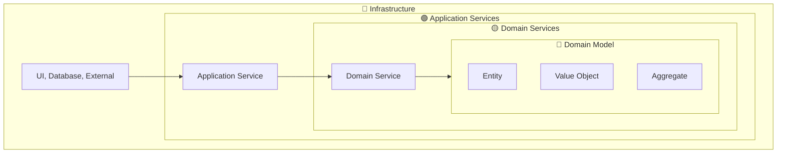
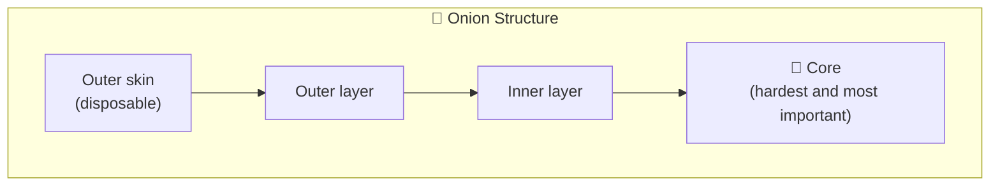
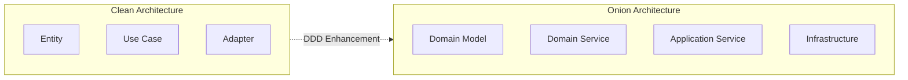
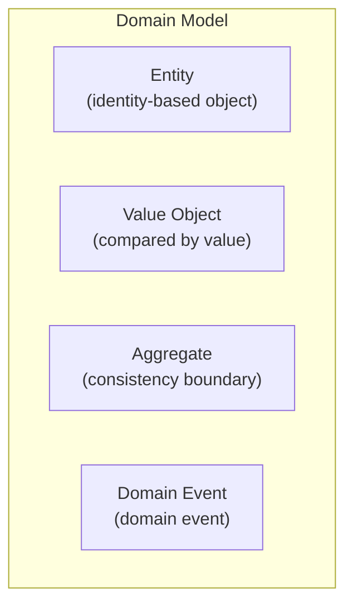
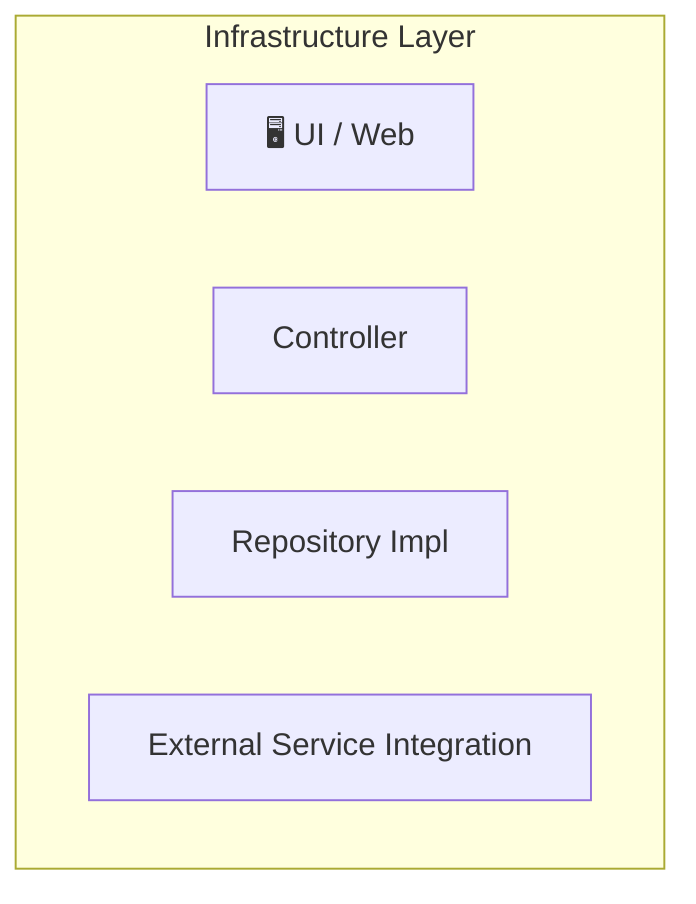
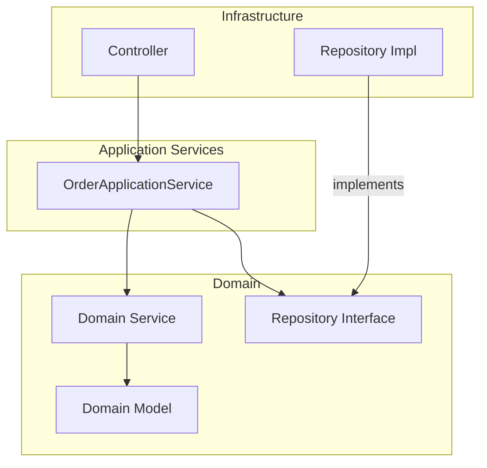
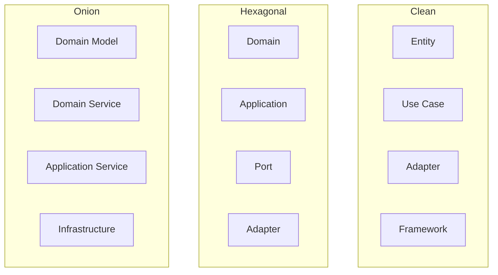
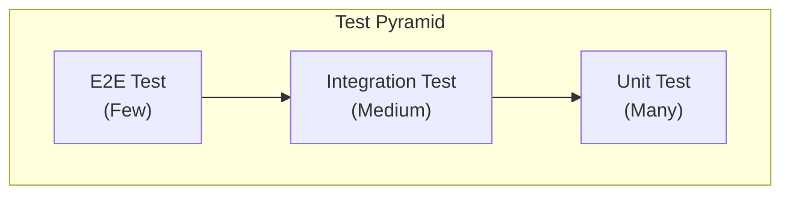
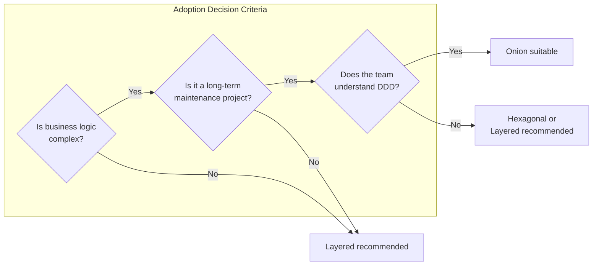
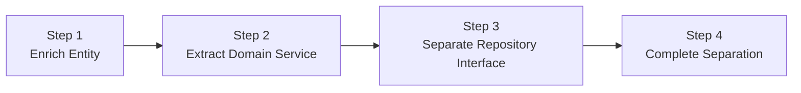

> **Target Audience**: Developers looking for an architecture that works well with DDD
> **Prerequisites**: [Hexagonal Architecture](hexagonal-architecture/) and Dependency Inversion Principle
> **Estimated Time**: About 20 minutes

# Onion Architecture

An architecture proposed by Jeffrey Palermo in 2008. It places the <strong>domain model at the very center</strong> and wraps it in concentric layers, like an onion.

Onion architecture starts from the limitations of traditional layered architecture. In layered architecture, upper layers depend on lower layers, so changes in the database layer cascade into the service layer. In contrast, onion architecture is designed so that the <strong>domain model depends on nothing</strong>, and infrastructure depends on the domain. This allows domain logic to express pure business rules regardless of changes in databases, frameworks, or external services. This is precisely why it pairs so well with DDD (Domain-Driven Design).

## One-Line Summary

> **The domain model is king. Everything else serves the domain.**



*This diagram shows the onion layer structure of Onion Architecture with Domain Model at the innermost layer and Infrastructure at the outermost.*

---

## Understanding Through the "Onion"


When you cut an onion, you see layer upon layer:

| Onion Layer | Software Layer | Characteristics |
|--------|-------------|------|
| Outer skin (disposable part) | **Infrastructure** | Replaceable, technical details |
| Outer layer | **Application Services** | Flow orchestration |
| Inner layer | **Domain Services** | Domain logic composition |
| **Core** (hardest part) | **Domain Model** | Business rules that never change |

<strong>Core idea:</strong> The domain model sits at the innermost layer and <strong>depends on nothing</strong>. The outer skin (Infrastructure) can be peeled off and replaced at any time, but the core remains intact.


The diagram below visually represents the layered structure of the onion:



*This diagram uses an onion layer analogy where the outer shell (Infrastructure) is replaceable while the inner core (Domain Model) is protected.*

---

## Difference from Clean Architecture

Both have a "concentric circle" structure, but they emphasize different things:

| Aspect | Clean | Onion |
|------|------|--------|
| **Center** | Entity (business rules) | Domain Model (DDD concepts) |
| **Emphasis** | Dependency rules | Domain purity |
| **Domain Service** | Included in Entity | Separate layer |
| **Use Case** | Interactor | Application Service |
| **DDD Affinity** | Moderate | High |



*This diagram compares the structures of Clean Architecture and Onion Architecture side by side.*

**Why Onion is more suitable for DDD:**
- Clearly separates Domain Model and Domain Service
- Aggregate, Entity, and Value Object concepts fit naturally
- Repository interfaces reside in the Domain

---

## 4 Layers in Detail

### 1. Domain Model - Innermost Layer

This is where <strong>core business concepts and rules</strong> reside.



*This diagram shows the Domain Model layer containing Entity, Value Object, and Domain Event, which hold the core business rules.*

```java
// Entity: distinguished by unique identifier
public class Order {
    private final OrderId id;  // identifier
    private CustomerId customerId;
    private List<OrderLine> orderLines;
    private OrderStatus status;
    private Money totalAmount;

    // Factory method
    public static Order create(CustomerId customerId, List<OrderLine> lines) {
        if (lines.isEmpty()) {
            throw new EmptyOrderException();
        }

        Order order = new Order(OrderId.generate());
        order.customerId = customerId;
        order.orderLines = new ArrayList<>(lines);
        order.status = OrderStatus.PENDING;
        order.recalculateTotal();

        return order;
    }

    // business logic
    public void addLine(OrderLine line) {
        validateModifiable();
        this.orderLines.add(line);
        recalculateTotal();
    }

    public void confirm() {
        validateCanConfirm();
        this.status = OrderStatus.CONFIRMED;
    }

    public void cancel() {
        validateCanCancel();
        this.status = OrderStatus.CANCELLED;
    }

    // Invariant validation
    private void validateModifiable() {
        if (status != OrderStatus.PENDING) {
            throw new OrderNotModifiableException(id, status);
        }
    }

    private void validateCanConfirm() {
        if (status != OrderStatus.PENDING) {
            throw new InvalidOrderStateException("Can only confirm from PENDING state");
        }
        if (totalAmount.isLessThan(Money.of(1000))) {
            throw new MinimumOrderAmountException();
        }
    }
}
```

```java
// Value Object: compared by value, immutable
public record Money(BigDecimal amount, Currency currency) {

    public static final Money ZERO = Money.of(0);

    public Money {
        Objects.requireNonNull(amount);
        Objects.requireNonNull(currency);
        if (amount.compareTo(BigDecimal.ZERO) < 0) {
            throw new NegativeAmountException();
        }
    }

    public static Money of(long amount) {
        return new Money(BigDecimal.valueOf(amount), Currency.KRW);
    }

    public Money add(Money other) {
        validateSameCurrency(other);
        return new Money(amount.add(other.amount), currency);
    }

    public Money multiply(int quantity) {
        return new Money(amount.multiply(BigDecimal.valueOf(quantity)), currency);
    }

    public boolean isLessThan(Money other) {
        validateSameCurrency(other);
        return amount.compareTo(other.amount) < 0;
    }

    public boolean isGreaterThan(Money other) {
        validateSameCurrency(other);
        return amount.compareTo(other.amount) > 0;
    }

    private void validateSameCurrency(Money other) {
        if (this.currency != other.currency) {
            throw new CurrencyMismatchException(this.currency, other.currency);
        }
    }
}
```

```java
// Aggregate Root: consistency boundary
public class Order {  // Order is the Aggregate Root
    private OrderId id;
    private List<OrderLine> orderLines;  // OrderLine is managed only within Order

    // External access to OrderLine is only through Order
    public void addLine(ProductId productId, int quantity, Money unitPrice) {
        OrderLine line = new OrderLine(productId, quantity, unitPrice);
        this.orderLines.add(line);
        recalculateTotal();
    }

    public void removeLine(ProductId productId) {
        orderLines.removeIf(line -> line.getProductId().equals(productId));
        recalculateTotal();
    }
}
```


**Characteristics of Domain Model**
- **Pure Java object** - does not depend on any framework
- **Rich domain logic** - must not have only getters/setters
- **Self-defending** - cannot be put into an invalid state
- **Easy to test** - testable without external dependencies


---

### 2. Domain Services

This is where <strong>logic that combines multiple domain objects</strong> resides. It contains logic that is difficult to place in a single Entity.

```
Where does this logic go?
- In Order? In Customer?
-> If neither, then Domain Service!
```

```java
// Domain Service: combines multiple Aggregates
public class PricingService {

    // Discount calculation - needs both Order and Customer information
    public Money calculateFinalPrice(Order order, Customer customer, DiscountPolicy policy) {
        Money basePrice = order.getTotalAmount();

        // Discount based on customer grade
        Percentage discount = policy.getDiscountFor(customer.getGrade());
        Money discounted = basePrice.applyDiscount(discount);

        // Additional VIP discount
        if (customer.isVip() && order.getTotalAmount().isGreaterThan(Money.of(100000))) {
            discounted = discounted.applyDiscount(Percentage.of(5));
        }

        return discounted;
    }
}
```

```java
// Domain Service: inventory check + reservation
public class InventoryDomainService {

    // Check and reserve inventory for multiple products at once
    public ReservationResult reserveInventory(Order order, InventoryRepository inventoryRepo) {
        List<ReservationItem> reservations = new ArrayList<>();

        for (OrderLine line : order.getOrderLines()) {
            Inventory inventory = inventoryRepo.findByProductId(line.getProductId())
                .orElseThrow(() -> new ProductNotFoundException(line.getProductId()));

            if (!inventory.hasEnough(line.getQuantity())) {
                return ReservationResult.failed(line.getProductId(), "Insufficient stock");
            }

            inventory.reserve(line.getQuantity());
            reservations.add(new ReservationItem(inventory.getId(), line.getQuantity()));
        }

        return ReservationResult.success(reservations);
    }
}
```

**Additionally, Repository interfaces are located in the Domain layer:**

```java
// Repository Interface (defined in the Domain layer)
public interface OrderRepository {
    Order save(Order order);
    Optional<Order> findById(OrderId id);
    List<Order> findByCustomerId(CustomerId customerId);
}

public interface CustomerRepository {
    Optional<Customer> findById(CustomerId id);
}
```


**Domain Service vs Application Service**

| Domain Service | Application Service |
|----------------|---------------------|
| Domain logic composition | Flow (workflow) orchestration |
| Pure business rules | Transaction, infrastructure calls |
| Uses only other domain objects | Calls Repository, external services |
| "Calculate discount amount" | "Create order -> save -> notify" |


---

### 3. Application Services

<strong>Orchestrates Use Case flow</strong>. Handles transaction management, external system calls, and more.

```java
@Service
@Transactional
public class OrderApplicationService {

    // Repositories (Infrastructure implementations are injected)
    private final OrderRepository orderRepository;
    private final CustomerRepository customerRepository;

    // Domain Services
    private final PricingService pricingService;
    private final InventoryDomainService inventoryService;

    // External services
    private final PaymentService paymentService;
    private final NotificationService notificationService;
    private final EventPublisher eventPublisher;

    // Use Case: create order
    public OrderDto createOrder(CreateOrderCommand command) {
        // 1. Look up customer
        Customer customer = customerRepository.findById(command.customerId())
            .orElseThrow(() -> new CustomerNotFoundException(command.customerId()));

        // 2. Create domain object (Domain Model)
        Order order = Order.create(
            customer.getId(),
            command.toOrderLines()
        );

        // 3. Apply discount (Domain Service)
        Money finalPrice = pricingService.calculateFinalPrice(
            order,
            customer,
            DiscountPolicy.standard()
        );
        order.applyDiscount(finalPrice);

        // 4. Reserve inventory (Domain Service)
        ReservationResult reservation = inventoryService.reserveInventory(
            order,
            inventoryRepository
        );
        if (!reservation.isSuccess()) {
            throw new InsufficientInventoryException(reservation.getFailedProduct());
        }

        // 5. Save (Repository)
        Order savedOrder = orderRepository.save(order);

        // 6. Publish event
        eventPublisher.publish(new OrderCreatedEvent(savedOrder));

        // 7. Return DTO
        return OrderDto.from(savedOrder);
    }

    // Use Case: confirm order
    public void confirmOrder(OrderId orderId) {
        // 1. Look up
        Order order = orderRepository.findById(orderId)
            .orElseThrow(() -> new OrderNotFoundException(orderId));

        // 2. Payment (external service)
        PaymentResult payment = paymentService.process(order.getTotalAmount());
        if (!payment.isSuccess()) {
            throw new PaymentFailedException(payment.getReason());
        }

        // 3. Confirm (Domain logic)
        order.confirm();

        // 4. Save
        orderRepository.save(order);

        // 5. Send notification (external service)
        notificationService.sendConfirmation(order);

        // 6. Publish event
        eventPublisher.publish(new OrderConfirmedEvent(order));
    }
}
```


**Role of Application Service**
- **Orchestrator role** - decides "what" to do, delegates "how" to the Domain
- **Transaction boundary** - applies @Transactional
- **External system calls** - Payment, Notification, etc.
- **Event publishing** - publishes domain events
- **DTO conversion** - determines the data format to return externally


---

### 4. Infrastructure - Outermost Layer

This is where <strong>technical details</strong> reside. UI, database, external API integrations, and more.



*This diagram shows the Infrastructure layer containing UI, Controller, Repository implementations, external API integrations, and other technical details.*

```java
// Controller (Infrastructure)
@RestController
@RequestMapping("/api/orders")
public class OrderController {

    private final OrderApplicationService orderService;

    @PostMapping
    public ResponseEntity<OrderResponse> createOrder(
            @Valid @RequestBody CreateOrderRequest request) {

        CreateOrderCommand command = request.toCommand();
        OrderDto result = orderService.createOrder(command);

        return ResponseEntity
            .status(HttpStatus.CREATED)
            .body(OrderResponse.from(result));
    }

    @PostMapping("/{orderId}/confirm")
    public ResponseEntity<Void> confirmOrder(@PathVariable String orderId) {
        orderService.confirmOrder(OrderId.of(orderId));
        return ResponseEntity.ok().build();
    }
}
```

```java
// Repository implementation (Infrastructure)
@Repository
public class JpaOrderRepository implements OrderRepository {

    private final OrderJpaRepository jpaRepository;
    private final OrderMapper mapper;

    @Override
    public Order save(Order order) {
        OrderEntity entity = mapper.toEntity(order);
        OrderEntity saved = jpaRepository.save(entity);
        return mapper.toDomain(saved);
    }

    @Override
    public Optional<Order> findById(OrderId id) {
        return jpaRepository.findById(id.getValue())
            .map(mapper::toDomain);
    }

    @Override
    public List<Order> findByCustomerId(CustomerId customerId) {
        return jpaRepository.findByCustomerId(customerId.getValue())
            .stream()
            .map(mapper::toDomain)
            .toList();
    }
}

// JPA Entity (Infrastructure only)
@Entity
@Table(name = "orders")
public class OrderEntity {
    @Id
    private String id;
    private String customerId;
    private String status;
    private BigDecimal totalAmount;

    @OneToMany(mappedBy = "order", cascade = CascadeType.ALL, orphanRemoval = true)
    private List<OrderLineEntity> orderLines = new ArrayList<>();
}
```

```java
// External service implementation (Infrastructure)
@Component
public class ExternalPaymentService implements PaymentService {

    private final RestTemplate restTemplate;

    @Override
    public PaymentResult process(Money amount) {
        PaymentRequest request = new PaymentRequest(
            amount.getAmount(),
            amount.getCurrency().name()
        );

        try {
            ResponseEntity<PaymentResponse> response = restTemplate.postForEntity(
                "https://payment-api.example.com/process",
                request,
                PaymentResponse.class
            );

            return PaymentResult.from(response.getBody());
        } catch (Exception e) {
            return PaymentResult.failed("Payment service error: " + e.getMessage());
        }
    }
}
```

---

## Package Structure

```
com.example.order/
│
├── domain/                          # Domain Layer
│   ├── model/                       # Domain Model (innermost)
│   │   ├── order/
│   │   │   ├── Order.java           # Aggregate Root
│   │   │   ├── OrderLine.java       # Entity
│   │   │   ├── OrderId.java         # Value Object
│   │   │   └── OrderStatus.java     # Enum
│   │   ├── customer/
│   │   │   ├── Customer.java
│   │   │   └── CustomerId.java
│   │   └── common/
│   │       ├── Money.java
│   │       └── Percentage.java
│   │
│   ├── service/                     # Domain Services
│   │   ├── PricingService.java
│   │   └── InventoryDomainService.java
│   │
│   ├── repository/                  # Repository Interfaces
│   │   ├── OrderRepository.java
│   │   └── CustomerRepository.java
│   │
│   └── event/                       # Domain Events
│       ├── OrderCreatedEvent.java
│       └── OrderConfirmedEvent.java
│
├── application/                     # Application Services
│   ├── service/
│   │   └── OrderApplicationService.java
│   ├── command/
│   │   └── CreateOrderCommand.java
│   ├── dto/
│   │   └── OrderDto.java
│   └── port/                        # External service interfaces
│       ├── PaymentService.java
│       └── NotificationService.java
│
└── infrastructure/                  # Infrastructure (outermost)
    ├── web/
    │   ├── OrderController.java
    │   ├── CreateOrderRequest.java
    │   └── OrderResponse.java
    ├── persistence/
    │   ├── JpaOrderRepository.java
    │   ├── OrderEntity.java
    │   ├── OrderJpaRepository.java
    │   └── OrderMapper.java
    └── external/
        ├── ExternalPaymentService.java
        └── EmailNotificationService.java
```

---

## Dependency Direction



*This diagram shows the dependency direction flowing inward only, from Infrastructure through Application Service and Domain Service to Domain Model.*

**Core Rules:**
1. Dependencies only flow in the direction **Infrastructure -> Application -> Domain**
2. **Domain depends on nothing**
3. **Repository Interface is in Domain, implementation is in Infrastructure**

---

## Comparison with Other Architectures

### Clean vs Hexagonal vs Onion



*This diagram compares the layer structures of Clean, Hexagonal, and Onion Architecture side by side.*

| Comparison | Clean | Hexagonal | Onion |
|---------|------|---------|--------|
| **Number of Layers** | 4 | 3-4 | 4 |
| **Center** | Entity | Core | Domain Model |
| **Emphasis** | Dependency rules | External isolation | Domain purity |
| **Domain Service** | Included in Entity | No explicit distinction | Separate layer |
| **DDD Affinity** | Moderate | High | Highest |
| **Complexity** | High | Medium | Medium |

---

## Common Mistakes

### 1. Infrastructure Code in Domain

```java
// ❌ Wrong: JPA annotations in Domain Model
@Entity  // Infrastructure code!
@Table(name = "orders")
public class Order {
    @Id
    private String id;

    @OneToMany(cascade = CascadeType.ALL)
    private List<OrderLine> orderLines;
}

// ✅ Correct: Pure Domain Model
public class Order {
    private OrderId id;
    private List<OrderLine> orderLines;

    // Pure business logic only
}

// Separate JPA Entity in Infrastructure
@Entity
@Table(name = "orders")
public class OrderEntity {
    @Id
    private String id;
    // ...
}
```

### 2. Business Logic in Application Service

```java
// ❌ Wrong: Business rules in Application Service
@Service
public class OrderApplicationService {

    public void confirmOrder(OrderId orderId) {
        Order order = orderRepository.findById(orderId).orElseThrow();

        // This logic should be inside Order!
        if (order.getStatus().equals("PENDING")) {
            if (order.getTotalAmount() >= 1000) {
                order.setStatus("CONFIRMED");
            }
        }
    }
}

// ✅ Correct: Business logic in Domain Model
public class Order {
    public void confirm() {
        validateCanConfirm();  // Rule validation
        this.status = OrderStatus.CONFIRMED;
    }

    private void validateCanConfirm() {
        if (status != OrderStatus.PENDING) {
            throw new InvalidOrderStateException();
        }
        if (totalAmount.isLessThan(Money.of(1000))) {
            throw new MinimumOrderAmountException();
        }
    }
}

@Service
public class OrderApplicationService {
    public void confirmOrder(OrderId orderId) {
        Order order = orderRepository.findById(orderId).orElseThrow();
        order.confirm();  // Delegate to Domain
        orderRepository.save(order);
    }
}
```

### 3. Domain Directly Calling External Services

```java
// ❌ Wrong: Domain Service calls external service
public class PricingDomainService {
    private final ExternalDiscountApi discountApi;  // External API!

    public Money calculatePrice(Order order) {
        Discount discount = discountApi.getDiscount(order.getCustomerId());  // Not allowed!
        return order.getTotalAmount().applyDiscount(discount);
    }
}

// ✅ Correct: Receive needed information as parameters
public class PricingDomainService {
    public Money calculatePrice(Order order, DiscountPolicy policy) {
        // External info is fetched by Application Service and passed in
        Percentage discount = policy.getDiscountFor(order.getCustomerGrade());
        return order.getTotalAmount().applyDiscount(discount);
    }
}

// Application Service fetches external information
@Service
public class OrderApplicationService {
    private final DiscountClient discountClient;  // Infrastructure

    public OrderDto createOrder(CreateOrderCommand command) {
        DiscountPolicy policy = discountClient.getCurrentPolicy();  // External lookup
        Money finalPrice = pricingService.calculatePrice(order, policy);  // Pass to Domain
    }
}
```

---

## Testing Strategy

### Testing by layer



*This diagram shows the test pyramid strategy from unit tests (Domain) to integration tests to E2E tests.*

### 1. Domain Model Tests (Easiest)

```java
class OrderTest {

    @Test
    void order_creation_success() {
        List<OrderLine> lines = List.of(
            new OrderLine(ProductId.of("p1"), 2, Money.of(10000))
        );

        Order order = Order.create(CustomerId.of("c1"), lines);

        assertThat(order.getId()).isNotNull();
        assertThat(order.getStatus()).isEqualTo(OrderStatus.PENDING);
        assertThat(order.getTotalAmount()).isEqualTo(Money.of(20000));
    }

    @Test
    void empty_order_cannot_be_created() {
        assertThrows(EmptyOrderException.class,
            () -> Order.create(CustomerId.of("c1"), List.of()));
    }
}

class MoneyTest {

    @Test
    void add_amounts() {
        Money a = Money.of(10000);
        Money b = Money.of(5000);

        Money result = a.add(b);

        assertThat(result).isEqualTo(Money.of(15000));
    }

    @Test
    void negative_amount_not_allowed() {
        assertThrows(NegativeAmountException.class,
            () -> new Money(BigDecimal.valueOf(-1000), Currency.KRW));
    }
}
```

### 2. Domain Service Tests

```java
class PricingServiceTest {

    private PricingService pricingService = new PricingService();

    @Test
    void VIP_customer_10_percent_discount() {
        Order order = createOrderWithTotal(Money.of(100000));
        Customer vip = Customer.withGrade(Grade.VIP);
        DiscountPolicy policy = DiscountPolicy.standard();

        Money result = pricingService.calculateFinalPrice(order, vip, policy);

        assertThat(result).isEqualTo(Money.of(90000));
    }
}
```

### 3. Application Service Tests (Using Mocks)

```java
@ExtendWith(MockitoExtension.class)
class OrderApplicationServiceTest {

    @Mock private OrderRepository orderRepository;
    @Mock private CustomerRepository customerRepository;
    @Mock private PricingService pricingService;
    @Mock private PaymentService paymentService;
    @Mock private EventPublisher eventPublisher;

    @InjectMocks
    private OrderApplicationService service;

    @Test
    void order_confirmation_success() {
        // Given
        Order order = createPendingOrder();
        when(orderRepository.findById(any())).thenReturn(Optional.of(order));
        when(paymentService.process(any())).thenReturn(PaymentResult.success());

        // When
        service.confirmOrder(order.getId());

        // Then
        verify(orderRepository).save(any());
        verify(eventPublisher).publish(any(OrderConfirmedEvent.class));
    }

    @Test
    void exception_on_payment_failure() {
        Order order = createPendingOrder();
        when(orderRepository.findById(any())).thenReturn(Optional.of(order));
        when(paymentService.process(any())).thenReturn(PaymentResult.failed("Insufficient balance"));

        assertThrows(PaymentFailedException.class,
            () -> service.confirmOrder(order.getId()));

        verify(orderRepository, never()).save(any());
    }
}
```

### 4. Infrastructure Tests (Integration Tests)

```java
@DataJpaTest
class JpaOrderRepositoryTest {

    @Autowired
    private OrderJpaRepository jpaRepository;

    private JpaOrderRepository repository;

    @BeforeEach
    void setUp() {
        repository = new JpaOrderRepository(jpaRepository, new OrderMapper());
    }

    @Test
    void save_and_find_order() {
        Order order = createOrder();

        repository.save(order);
        Optional<Order> found = repository.findById(order.getId());

        assertThat(found).isPresent();
        assertThat(found.get().getStatus()).isEqualTo(order.getStatus());
    }
}
```

---

## Trade-offs

Onion architecture protects the domain, but at the cost of complexity and development effort. You must clearly understand the trade-offs before adopting it in a project.

### Advantages

| Advantage | Description |
|-----|------|
| **Domain protection** | Business logic is not polluted by technical details |
| **Testability** | Domain Layer can be unit tested without external dependencies |
| **Technology independence** | Database and framework changes do not affect the domain |
| **DDD affinity** | Maps naturally to DDD concepts like Aggregate, Entity, Value Object |
| **Clear boundaries** | Clear responsibilities between layers facilitate team collaboration |

### Disadvantages

| Disadvantage | Description |
|-----|------|
| **Initial complexity** | More files and interfaces than layered |
| **Learning curve** | Must understand DDD concepts and dependency direction |
| **Mapping overhead** | Conversion code needed between Domain Entity and JPA Entity |
| **Excessive for simple CRUD** | Over-engineering if business logic is simple |
| **Performance cost** | Many object conversions can cause slight performance degradation |

### Practical Considerations



*This diagram shows a flowchart for deciding whether to adopt Onion Architecture based on business logic complexity and long-term maintenance needs.*

> <strong>Key point:</strong> The complexity of the architecture should be <strong>proportional to the complexity of the problem you are solving</strong>. If you apply a complex solution to a simple problem, the complexity itself becomes a new problem.

---

## When Should You Use Onion Architecture?

### Suitable Cases

- Projects that fully adopt DDD
- Cases with complex domain logic
- Cases requiring collaboration with domain experts
- Projects maintained long-term
- Cases where business rules change frequently

### Unsuitable Cases

- Simple CRUD applications
- Small, short-term projects
- Teams with no DDD experience -- start with [Layered Architecture](layered-architecture/)
- Cases with many external integrations but simple domains -- use [Hexagonal](hexagonal-architecture/)

### Best Practice: Which Systems Fit?

| System Type | Suitability | Reason |
|------------|-------|------|
| **DDD-based projects** | Very suitable | Maps naturally to Aggregate, Entity, Value Object |
| **Insurance/Finance domains** | Very suitable | Complex business rules, domain purity |
| **Reservation/Scheduling systems** | Suitable | Complex domain logic, state management |
| **Inventory/Logistics management** | Suitable | Business rule-centric, domain expert collaboration |
| **Healthcare systems** | Suitable | Regulatory compliance, complex domain |
| **Simple query services** | Unsuitable | Excessive if domain logic is simple |
| **External integration-focused** | Unsuitable | Hexagonal is more appropriate |
| **MVP/Prototype** | Unsuitable | Fast development takes priority |

---

## Gradual Adoption



*This diagram shows the stages of progressively adopting Onion Architecture from Entity enrichment to Domain Service extraction and Repository Interface application.*

### Step 1: Add Logic to Entities

```java
// Before: Anemic Domain
public class Order {
    private String status;
    public void setStatus(String s) { this.status = s; }
}

// After: Rich Domain
public class Order {
    private OrderStatus status;

    public void confirm() {
        if (status != OrderStatus.PENDING) {
            throw new IllegalStateException();
        }
        this.status = OrderStatus.CONFIRMED;
    }
}
```

### Step 2: Extract Domain Services

```java
// Move logic that combines multiple Entities to a Domain Service
public class PricingService {
    public Money calculatePrice(Order order, Customer customer) {
        // ...
    }
}
```

### Step 3: Separate Repository Interfaces

```java
// domain/repository/OrderRepository.java (Interface)
public interface OrderRepository {
    Order save(Order order);
}

// infrastructure/persistence/JpaOrderRepository.java (implementation)
public class JpaOrderRepository implements OrderRepository {
    // ...
}
```

---

## Next Steps

- [Layered Architecture](layered-architecture/) - Start from the basics
- [Hexagonal Architecture](hexagonal-architecture/) - External integration focused
- [Clean Architecture](clean-architecture/) - Strict rules
- [CQRS](cqrs/) - Read/write separation
