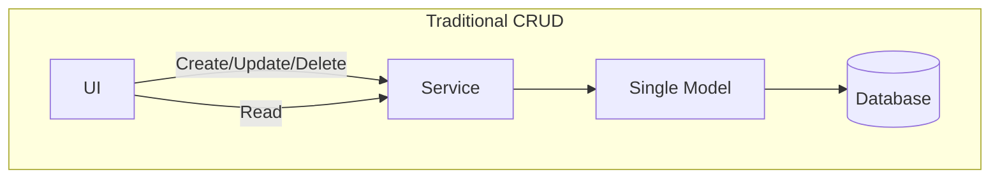
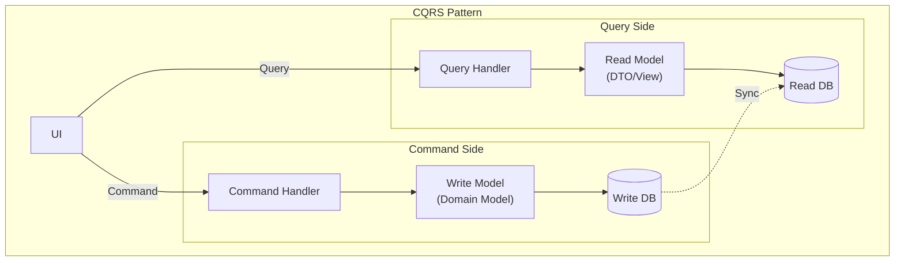
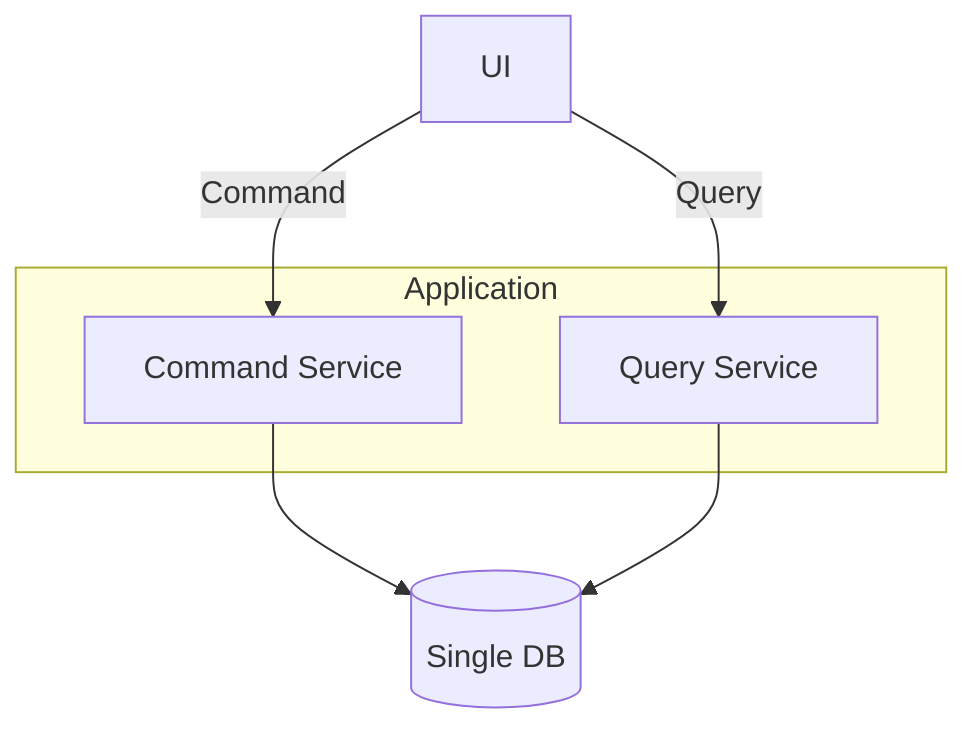
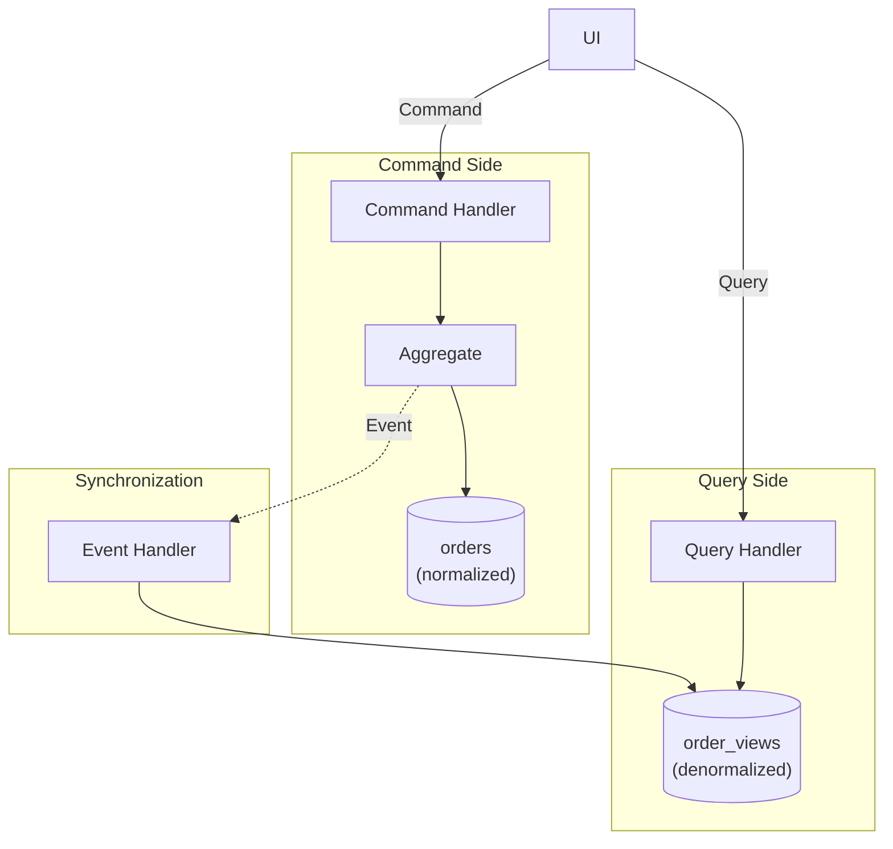
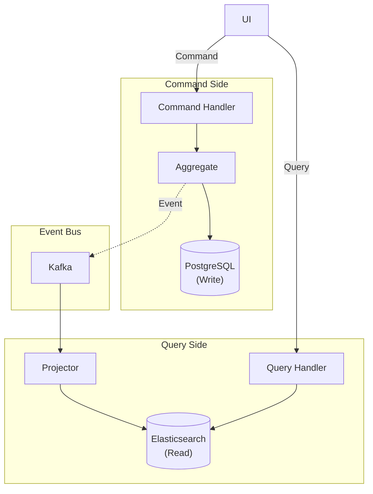
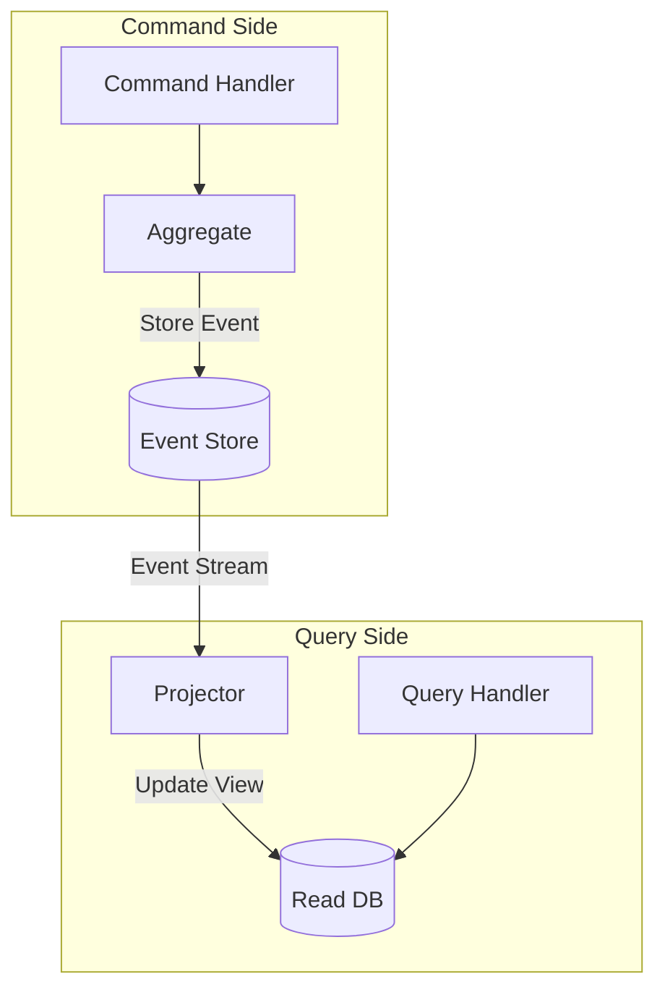

> **Target Audience**: Developers designing systems with complex query requirements or performance optimization needs
> **Prerequisites**: [Domain Events](../domain-events/) or basic understanding of event-driven architecture
> **Estimated Time**: About 35 minutes
> **Key Question**: "When should you separate read and write models?"


CQRS Core: **Command** (state changes, uses domain model) vs **Query** (reads, uses optimized read model) separation allows optimization for each requirement


This section explores the pattern that separates command (write) and query (read) responsibilities. CQRS stands for Command Query Responsibility Segregation, a pattern that separates system read and write operations into separate models, allowing each to be optimized independently. It's a powerful architectural pattern for effectively handling complex domain logic and diverse query requirements.

#### Why CQRS?

Understanding the limitations of traditional CRUD approaches reveals why CQRS is needed. In the traditional approach, a single model is used for both reading and writing, which works well for simple applications but causes various problems as complexity increases.

**Limitations of Traditional CRUD**

Traditional CRUD systems access the database through a single model via a service layer from the UI. Create, update, delete, and read operations all use the same model and the same path. This structure is simple but has several problems.



Key problems include polluting the domain model to support complex queries. For example, adding query-only methods to domain entities for reporting data diminishes the purity of the domain model. Also, the optimization requirements for queries and commands are fundamentally different. Queries need fast responses and benefit from denormalized data, while commands need consistency and transactions with normalized data. Finally, read and write workload patterns differ, but using the same database makes independent scaling difficult.

**Benefits of CQRS Structure**

CQRS completely separates Command and Query. The Command Side uses the write model (domain model) to access the Write DB, while the Query Side uses the read model (DTO/View) to access the Read DB. Synchronization between the two DBs happens through events.



This structure allows the domain model to focus purely on business logic, while the read model can be freely designed in a UI-optimized form. Each can be scaled and optimized independently, improving both performance and maintainability.

#### Implementation Levels

CQRS doesn't need to be implemented perfectly all at once. It can be applied incrementally based on project complexity and requirements. There are three main levels, each with different complexity and benefits.

**Level 1: Single DB, Code Separation**

The simplest form uses a single database but separates commands and queries at the code level. This approach applies CQRS concepts while minimizing infrastructure complexity.



Command Service executes business logic using the domain model and changes state. It manages transactions and validates domain rules. Query Service directly queries DTOs to return data quickly. It uses read-only transactions and writes queries optimized for retrieval.

```java
// Command Service - Uses domain model
@Service
@Transactional
public class OrderCommandService {

    private final OrderRepository orderRepository;

    public OrderId createOrder(CreateOrderCommand command) {
        Order order = Order.create(
            command.getCustomerId(),
            command.getOrderLines()
        );
        return orderRepository.save(order).getId();
    }

    public void confirmOrder(ConfirmOrderCommand command) {
        Order order = orderRepository.findById(command.getOrderId())
            .orElseThrow();
        order.confirm();
        orderRepository.save(order);
    }
}

// Query Service - Direct DTO query
@Service
@Transactional(readOnly = true)
public class OrderQueryService {

    private final OrderQueryRepository queryRepository;

    public OrderDetailView getOrderDetail(String orderId) {
        return queryRepository.findOrderDetailById(orderId)
            .orElseThrow(() -> new OrderNotFoundException(orderId));
    }

    public Page<OrderSummaryView> getOrderList(OrderSearchCriteria criteria, Pageable pageable) {
        return queryRepository.searchOrders(criteria, pageable);
    }
}

// Query-only Repository
public interface OrderQueryRepository {

    @Query("""
        SELECT new com.example.order.query.OrderDetailView(
            o.id, o.status, o.totalAmount, o.createdAt,
            c.name, c.email
        )
        FROM OrderEntity o
        JOIN o.customer c
        WHERE o.id = :orderId
        """)
    Optional<OrderDetailView> findOrderDetailById(@Param("orderId") String orderId);

    @Query("""
        SELECT new com.example.order.query.OrderSummaryView(
            o.id, o.status, o.totalAmount, o.createdAt
        )
        FROM OrderEntity o
        WHERE (:status IS NULL OR o.status = :status)
        AND (:customerId IS NULL OR o.customerId = :customerId)
        """)
    Page<OrderSummaryView> searchOrders(
        @Param("status") OrderStatus status,
        @Param("customerId") String customerId,
        Pageable pageable
    );
}

// Query result DTOs
public record OrderDetailView(
    String orderId,
    String status,
    BigDecimal totalAmount,
    LocalDateTime createdAt,
    String customerName,
    String customerEmail
) {}

public record OrderSummaryView(
    String orderId,
    String status,
    BigDecimal totalAmount,
    LocalDateTime createdAt
) {}
```

In this code, Command Service uses the Order domain model to execute business logic. The confirm method goes through validation logic inside the order entity to change state. Query Service directly queries DTOs like OrderDetailView, returning the needed data directly without going through the domain model.

**Level 2: Separate Read Model**

At this level, query-only tables or views are created separately. Writes go to normalized tables, reads come from denormalized tables. This greatly improves query performance and allows data retrieval without complex joins.



In this structure, when an order is created or its status changes, a domain event is published. The event handler receives it and updates the read model. The read model is denormalized, allowing fast queries without complex joins.

```java
// Write Side: Domain Event publishing
public class Order extends AggregateRoot<OrderId> {

    public void confirm() {
        this.status = OrderStatus.CONFIRMED;
        registerEvent(new OrderConfirmedEvent(
            this.id,
            this.customerId,
            this.totalAmount,
            LocalDateTime.now()
        ));
    }
}

// Read Model synchronization
@Component
public class OrderViewProjector {

    private final OrderViewRepository viewRepository;

    @TransactionalEventListener
    public void on(OrderCreatedEvent event) {
        OrderView view = new OrderView();
        view.setOrderId(event.getOrderId().getValue());
        view.setCustomerId(event.getCustomerId().getValue());
        view.setStatus("PENDING");
        view.setTotalAmount(event.getTotalAmount().amount());
        view.setCreatedAt(event.getCreatedAt());
        viewRepository.save(view);
    }

    @TransactionalEventListener
    public void on(OrderConfirmedEvent event) {
        OrderView view = viewRepository.findById(event.getOrderId().getValue())
            .orElseThrow();
        view.setStatus("CONFIRMED");
        view.setConfirmedAt(event.getConfirmedAt());
        viewRepository.save(view);
    }

    @TransactionalEventListener
    public void on(OrderCancelledEvent event) {
        OrderView view = viewRepository.findById(event.getOrderId().getValue())
            .orElseThrow();
        view.setStatus("CANCELLED");
        view.setCancelledAt(event.getCancelledAt());
        view.setCancellationReason(event.getReason());
        viewRepository.save(view);
    }
}

// Read Model Entity (denormalized)
@Entity
@Table(name = "order_views")
public class OrderView {
    @Id
    private String orderId;
    private String customerId;
    private String customerName;     // Denormalized: No Customer table join needed
    private String customerEmail;    // Denormalized
    private String status;
    private BigDecimal totalAmount;
    private LocalDateTime createdAt;
    private LocalDateTime confirmedAt;
    private LocalDateTime cancelledAt;
    private String cancellationReason;
    private int itemCount;           // Denormalized: Aggregate value
}

// Query becomes simple
@Service
public class OrderQueryService {

    private final OrderViewRepository viewRepository;

    public OrderView getOrder(String orderId) {
        return viewRepository.findById(orderId).orElseThrow();
    }

    public Page<OrderView> searchOrders(String customerId, String status, Pageable pageable) {
        return viewRepository.findByCustomerIdAndStatus(customerId, status, pageable);
    }
}
```

Looking at the OrderView entity, fields like customerName and customerEmail are denormalized. When querying, you can get all needed information just by querying OrderView without joining the Customer table. Aggregate values like itemCount are pre-calculated and stored, making queries very fast.

**Level 3: Separate Databases**

The most advanced form uses completely different databases for writes and reads. For writes, an RDBMS like PostgreSQL that supports transactions well is used, while for reads, a NoSQL like Elasticsearch specialized for search can be used. An event bus like Kafka synchronizes the two DBs.



In this structure, command processing and queries are completely independent. Each uses different databases, so a problem in one doesn't affect the other. If the read DB goes down, writes continue to work, and you just need to rebuild the read DB.

```java
// Event publishing (Kafka)
@Component
public class OrderEventPublisher {

    private final KafkaTemplate<String, DomainEvent> kafkaTemplate;

    @TransactionalEventListener(phase = TransactionPhase.AFTER_COMMIT)
    public void publishToKafka(OrderConfirmedEvent event) {
        kafkaTemplate.send("order-events", event.getOrderId().getValue(), event);
    }
}

// Read Side: Elasticsearch Projector
@Component
public class ElasticsearchOrderProjector {

    private final ElasticsearchOperations elasticsearchOperations;

    @KafkaListener(topics = "order-events", groupId = "order-view-projector")
    public void handle(DomainEvent event) {
        if (event instanceof OrderCreatedEvent e) {
            OrderDocument doc = new OrderDocument();
            doc.setOrderId(e.getOrderId().getValue());
            doc.setCustomerId(e.getCustomerId().getValue());
            doc.setStatus("PENDING");
            doc.setTotalAmount(e.getTotalAmount().amount());
            doc.setCreatedAt(e.getCreatedAt());
            elasticsearchOperations.save(doc);
        } else if (event instanceof OrderConfirmedEvent e) {
            OrderDocument doc = elasticsearchOperations.get(
                e.getOrderId().getValue(), OrderDocument.class);
            doc.setStatus("CONFIRMED");
            doc.setConfirmedAt(e.getConfirmedAt());
            elasticsearchOperations.save(doc);
        }
    }
}

// Read Model: Elasticsearch Document
@Document(indexName = "orders")
public class OrderDocument {
    @Id
    private String orderId;
    private String customerId;
    private String customerName;
    private String status;
    private BigDecimal totalAmount;
    private LocalDateTime createdAt;
    private LocalDateTime confirmedAt;
    // Full-text search field
    private String searchableText;
}

// Query Service: Using Elasticsearch
@Service
public class OrderQueryService {

    private final ElasticsearchOperations elasticsearchOperations;

    public SearchHits<OrderDocument> search(String keyword, String status, Pageable pageable) {
        Query query = NativeQuery.builder()
            .withQuery(q -> q
                .bool(b -> b
                    .must(m -> m.match(t -> t.field("searchableText").query(keyword)))
                    .filter(f -> f.term(t -> t.field("status").value(status)))
                )
            )
            .withPageable(pageable)
            .build();

        return elasticsearchOperations.search(query, OrderDocument.class);
    }
}
```

Using Elasticsearch enables full-text search, various filtering, and aggregation capabilities. By putting all order-related text in the searchableText field, users can find relevant orders regardless of what keyword they search for.

#### CQRS + Event Sourcing

CQRS is often used together with Event Sourcing. Event Sourcing is a pattern that stores all state changes as events, and combined with CQRS, it creates a very powerful system.



On the Command Side, only events are stored. Current state is derived by replaying events. On the Query Side, the event stream is subscribed to generate read-only views. This provides both complete audit trails and fast query performance.

```java
// Event Store
public interface OrderEventStore {
    void append(OrderId orderId, List<DomainEvent> events, long expectedVersion);
    List<DomainEvent> getEvents(OrderId orderId);
}

// Command Handler with Event Sourcing
@Service
public class OrderCommandHandler {

    private final OrderEventStore eventStore;

    public void handle(ConfirmOrderCommand command) {
        // 1. Restore Aggregate from event stream
        List<DomainEvent> events = eventStore.getEvents(command.getOrderId());
        Order order = Order.fromEvents(events);

        // 2. Execute command
        order.confirm();

        // 3. Save new events
        eventStore.append(
            command.getOrderId(),
            order.getDomainEvents(),
            events.size()  // Optimistic concurrency
        );
    }
}

// Aggregate: Restore from events
public class Order {

    public static Order fromEvents(List<DomainEvent> events) {
        Order order = new Order();
        for (DomainEvent event : events) {
            order.apply(event);
        }
        return order;
    }

    private void apply(DomainEvent event) {
        if (event instanceof OrderCreatedEvent e) {
            this.id = e.getOrderId();
            this.customerId = e.getCustomerId();
            this.status = OrderStatus.PENDING;
        } else if (event instanceof OrderConfirmedEvent e) {
            this.status = OrderStatus.CONFIRMED;
            this.confirmedAt = e.getConfirmedAt();
        }
        // ...
    }
}
```

The advantage of this approach is that all change history is preserved. You can know exactly how an order reached its current state, and if needed, you can recreate the state at any specific point in time. Also, if you need a new read model, you can create it anytime by replaying the event stream.

#### Practical Guide

CQRS should be adopted carefully. It's not needed for every project, and misapplying it only adds unnecessary complexity. You must clearly understand when to use CQRS and when to avoid it.

**When CQRS is a Good Fit**

CQRS shines in complex domains. When the domain model is complex, you can keep the Write model pure while freely designing the Read model. For systems where query performance is critical, you can optimize the Read model to ensure fast responses. When various query forms are needed, you can create multiple Read models for different purposes. For example, detailed admin queries, user summary queries, and reporting aggregation queries can each be implemented with different models. If you're using event-driven architecture, CQRS naturally combines with Event Sourcing.

| Situation | Reason |
|-----------|--------|
| **Complex domain** | Keep Write model pure |
| **Query performance critical** | Can optimize Read model |
| **Various query patterns** | Create purpose-specific Read models |
| **Event-driven architecture** | Natural fit with Event Sourcing |

**When CQRS is Overkill**

Conversely, CQRS can be a hindrance for simple CRUD applications. When create, update, delete, and query are all simple, it only adds complexity. Systems that require immediate consistency are also not suitable for CQRS. CQRS typically uses eventual consistency, which is problematic if read results must immediately reflect writes. For small projects, it can be over-engineering. Consider the team's size and experience.

| Situation | Reason |
|-----------|--------|
| **Simple CRUD** | Only adds complexity |
| **Immediate consistency required** | Eventual consistency delay issues |
| **Small projects** | Over-engineering |

**Cautions**

There are things you must consider when applying CQRS. The most important is eventual consistency. If you query immediately after executing a Command, synchronization may not be complete yet, showing old data.

**1. Handling Eventual Consistency**

If you Query immediately after executing a Command, the Read Model may not be updated yet, returning old data. This is a fundamental characteristic of CQRS, so it must be handled at the application level.

```java
// Query immediately after Command may return stale data
orderCommandService.confirmOrder(orderId);
// Sync delay!
OrderView view = orderQueryService.getOrder(orderId);
// view.status might still be PENDING
```

There are several ways to solve this problem. Using optimistic updates in the UI, the user sees the change immediately, and it updates when actual data arrives. Including results in the Command response allows display without a Query. Using WebSocket, you can notify clients in real-time when the Read Model is updated.

**2. Handling Sync Failures**

If an exception occurs in the Event Handler, the Read Model won't be updated. You need a mechanism to track and reprocess such failures.

```java
@Component
public class OrderViewProjector {

    private final OrderViewRepository viewRepository;
    private final FailedEventRepository failedEventRepository;

    @KafkaListener(topics = "order-events")
    public void handle(DomainEvent event) {
        try {
            project(event);
        } catch (Exception e) {
            // Save failed event for reprocessing
            failedEventRepository.save(new FailedEvent(event, e.getMessage()));
            throw e;  // Propagate for retry
        }
    }
}
```

Saving failed events in a separate table allows manual or automatic reprocessing later. You can implement retry mechanisms or utilize Dead Letter Queues.

#### Controller Design

In CQRS systems, it's good to separate Controllers into Command and Query as well. This clarifies responsibilities and allows each to be versioned or scaled independently.

```java
// Command Controller
@RestController
@RequestMapping("/api/orders")
public class OrderCommandController {

    private final OrderCommandService commandService;

    @PostMapping
    public ResponseEntity<CreateOrderResponse> createOrder(@RequestBody CreateOrderRequest request) {
        OrderId orderId = commandService.createOrder(request.toCommand());
        return ResponseEntity.created(URI.create("/api/orders/" + orderId))
            .body(new CreateOrderResponse(orderId.getValue()));
    }

    @PostMapping("/{orderId}/confirm")
    public ResponseEntity<Void> confirmOrder(@PathVariable String orderId) {
        commandService.confirmOrder(new ConfirmOrderCommand(OrderId.of(orderId)));
        return ResponseEntity.ok().build();
    }
}

// Query Controller
@RestController
@RequestMapping("/api/orders")
public class OrderQueryController {

    private final OrderQueryService queryService;

    @GetMapping("/{orderId}")
    public ResponseEntity<OrderDetailView> getOrder(@PathVariable String orderId) {
        return ResponseEntity.ok(queryService.getOrderDetail(orderId));
    }

    @GetMapping
    public ResponseEntity<Page<OrderSummaryView>> searchOrders(
        @RequestParam(required = false) String customerId,
        @RequestParam(required = false) OrderStatus status,
        Pageable pageable
    ) {
        return ResponseEntity.ok(queryService.searchOrders(customerId, status, pageable));
    }
}
```

Command Controller handles write operations like POST, PUT, DELETE, usually returning just success status or created resource IDs. Query Controller handles only GET requests, returning various query results. This separation clarifies API documentation and simplifies authorization management.

#### Next Steps

- [Testing Strategy](../testing/) - Testing CQRS systems
- [Anti-Patterns](../anti-patterns/) - Common CQRS mistakes
