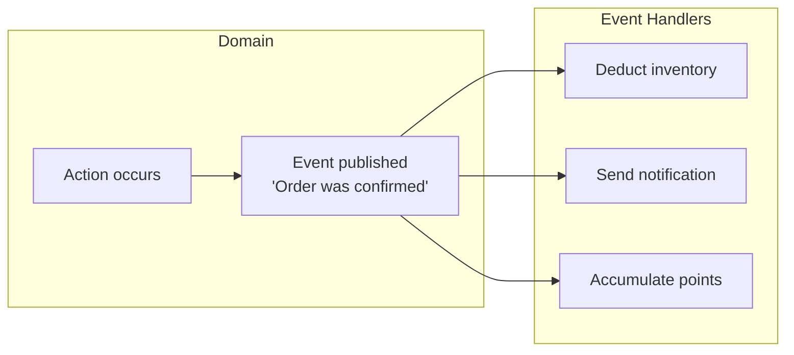
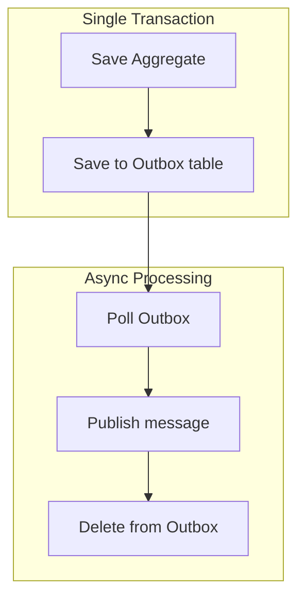
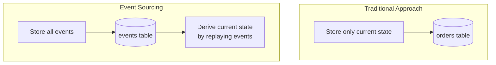
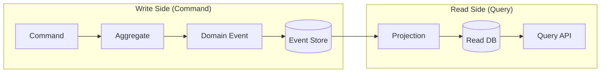

> **Target Audience**: Developers who understand domain modeling and transaction concepts
> **Prerequisites**: [Aggregate Deep Dive](../aggregate/) or understanding of Aggregate boundaries
> **Estimated Time**: About 30 minutes
> **Key Question**: "When and why should you use domain events?"

---


* Domain events are a design tool for safely propagating "business-meaningful changes that have already occurred" throughout the system.
* They enable separation of core domain logic from cross-cutting concerns and allow gradual evolution toward event-driven architecture.


This section explores how to express and utilize important occurrences in the domain as events. Domain events capture meaningful changes in business processes, propagate them within the system, and enable loosely coupled communication between components. This is a core concept when building microservices architecture or event-driven systems.

#### What are Domain Events?

Domain events are business-meaningful occurrences that domain experts care about. Examples include "an order was confirmed", "a payment was completed", or "a product was shipped" - moments that matter in actual business, expressed in code. These events represent not just technical state changes, but meaningful happenings from a business perspective.



The diagram above shows how a single domain event is processed by multiple handlers. When an order is confirmed, follow-up tasks like inventory deduction, notification sending, and point accumulation are automatically triggered.

**Key Characteristics of Domain Events**

Domain events have several important characteristics. First, event names are always in past tense. Because they express facts that have already happened, we use past tense like "OrderConfirmed" rather than imperative form like "ConfirmOrder". Second, events are immutable. Once published, an event can never be changed, and all event data is read-only. Third, events are self-contained. They should contain all information needed to process the event, including orderId, timestamp, and related data.

| Property | Description | Example |
|----------|-------------|---------|
| **Past tense naming** | Something that already happened | OrderConfirmed (O), ConfirmOrder (X) |
| **Immutability** | Cannot change after publishing | Event data is readonly |
| **Self-contained** | Contains necessary information | orderId, timestamp, related data |


#### Event Design

When designing domain events, maintaining a consistent structure is important. Defining common attributes that all events should have in a base class makes management and tracking easier.

**Defining Basic Structure**

Define an abstract class that serves as the foundation for all domain events. This class automatically generates an event unique ID and timestamp, allowing each event to be tracked. The event ID is used for duplicate processing prevention, and the timestamp is used for determining event order and debugging.

```java
public abstract class DomainEvent {
    private final String eventId;
    private final Instant occurredAt;

    protected DomainEvent() {
        this.eventId = UUID.randomUUID().toString();
        this.occurredAt = Instant.now();
    }

    public String getEventId() {
        return eventId;
    }

    public Instant getOccurredAt() {
        return occurredAt;
    }
}
```

**Implementing Concrete Events**

When defining concrete business events, include all information needed to process that event. For example, an order confirmation event includes not just the order ID, but also customer ID, total amount, and order line information. This way, event handlers can perform their work without additional database queries.

An important note is that you don't put domain entities directly in events. Instead, create event-specific snapshot objects and selectively include only the needed data. This keeps events lightweight and clear, and later changes to entity structure don't affect events.

```java
public class OrderConfirmedEvent extends DomainEvent {
    private final OrderId orderId;
    private final CustomerId customerId;
    private final Money totalAmount;
    private final List<OrderLineSnapshot> orderLines;

    public OrderConfirmedEvent(Order order) {
        super();
        this.orderId = order.getId();
        this.customerId = order.getCustomerId();
        this.totalAmount = order.getTotalAmount();
        this.orderLines = order.getOrderLines().stream()
            .map(OrderLineSnapshot::from)
            .toList();
    }

    // Getters...

    // Event-specific snapshot (immutable)
    public record OrderLineSnapshot(
        ProductId productId,
        String productName,
        int quantity,
        Money amount
    ) {
        public static OrderLineSnapshot from(OrderLine line) {
            return new OrderLineSnapshot(
                line.getProductId(),
                line.getProductName(),
                line.getQuantity(),
                line.getAmount()
            );
        }
    }
}
```

**Deciding When to Publish Events**

Events should be published at appropriate times. Generally, events are published in three situations. First, when an important state change completes. For example, when order status changes from "pending" to "confirmed", publish an OrderConfirmed event. Second, when a business rule is satisfied. If a meaningful thing happened because certain conditions were met, express it as an event. Third, when other systems or bounded contexts need to be notified. If external parties need to know about this change, publish an event to notify them.

```java
public class Order extends AggregateRoot {

    public void confirm() {
        validateConfirmable();

        this.status = OrderStatus.CONFIRMED;
        this.confirmedAt = LocalDateTime.now();

        // Register event after state change
        registerEvent(new OrderConfirmedEvent(this));
    }

    public void ship(TrackingNumber trackingNumber) {
        validateShippable();

        this.status = OrderStatus.SHIPPED;
        this.trackingNumber = trackingNumber;

        registerEvent(new OrderShippedEvent(this.id, trackingNumber));
    }

    public void cancel(CancellationReason reason) {
        validateCancellable();

        this.status = OrderStatus.CANCELLED;
        this.cancelledAt = LocalDateTime.now();
        this.cancellationReason = reason;

        registerEvent(new OrderCancelledEvent(this.id, reason));
    }
}
```

In the code above, the order entity registers appropriate events immediately after changing state. Events are not published immediately but stored in the Aggregate first, then actually published after the transaction successfully completes.

#### Event Publishing Implementation

There are several ways to actually publish domain events. Each method has pros and cons and should be chosen based on project requirements.

**Method 1: Using Spring ApplicationEvent**

The simplest method is using Spring's ApplicationEventPublisher. The Aggregate Root stores occurred events in an internal list, and when the Repository saves, it publishes these events to Spring's event bus. This approach is simple to implement and integrates well with the Spring ecosystem, but is limited to working only within the application.

```java
// Aggregate Root base class
public abstract class AggregateRoot {
    @Transient
    private final List<DomainEvent> domainEvents = new ArrayList<>();

    protected void registerEvent(DomainEvent event) {
        domainEvents.add(event);
    }

    public List<DomainEvent> getDomainEvents() {
        return Collections.unmodifiableList(domainEvents);
    }

    public void clearDomainEvents() {
        domainEvents.clear();
    }
}

// Publish from Repository on save
@Repository
public class JpaOrderRepository implements OrderRepository {
    private final OrderJpaRepository jpaRepository;
    private final ApplicationEventPublisher eventPublisher;

    @Override
    public Order save(Order order) {
        OrderEntity entity = mapper.toEntity(order);
        jpaRepository.save(entity);

        // Publish events after successful save
        order.getDomainEvents().forEach(eventPublisher::publishEvent);
        order.clearDomainEvents();

        return order;
    }
}
```

**Method 2: Using Spring Data's @DomainEvents**

Spring Data JPA provides a convenient base class called `AbstractAggregateRoot`. Inheriting from this class automatically handles event registration and publishing. When the Repository's `save()` method is called, registered events are automatically published, so you don't need to write separate event publishing code.

```java
@Entity
public class OrderEntity extends AbstractAggregateRoot<OrderEntity> {

    public void confirm() {
        this.status = OrderStatus.CONFIRMED;

        // Method from AbstractAggregateRoot
        registerEvent(new OrderConfirmedEvent(this.id));
    }
}

// Events automatically published when Repository save() is called
```

**Method 3: Transactional Outbox Pattern**

For systems where reliability is important, use the Transactional Outbox Pattern. This pattern was designed to prevent event loss. In the transaction that saves the Aggregate, events are also saved to the database together. Then a separate scheduler periodically polls the Outbox table to publish unpublished events to a message broker like Kafka. This way, if the database transaction succeeds, events are guaranteed to be saved, so event loss doesn't occur.



This diagram shows the overall flow of the Transactional Outbox Pattern. The important point is that Aggregate saving and Outbox saving happen within a single transaction.

```java
// Outbox entity
@Entity
@Table(name = "outbox_events")
public class OutboxEvent {
    @Id
    private String id;
    private String aggregateType;
    private String aggregateId;
    private String eventType;
    private String payload;  // JSON
    private Instant createdAt;
    private boolean published;
}

// Save to Outbox when saving
@Transactional
public void confirmOrder(OrderId orderId) {
    Order order = orderRepository.findById(orderId).orElseThrow();
    order.confirm();

    orderRepository.save(order);

    // Save to Outbox in same transaction
    OutboxEvent outbox = OutboxEvent.builder()
        .aggregateType("Order")
        .aggregateId(orderId.getValue())
        .eventType("OrderConfirmed")
        .payload(toJson(new OrderConfirmedEvent(order)))
        .build();
    outboxRepository.save(outbox);
}

// Separate scheduler polls Outbox and publishes to Kafka
@Scheduled(fixedDelay = 1000)
public void publishOutboxEvents() {
    List<OutboxEvent> events = outboxRepository.findUnpublished();
    for (OutboxEvent event : events) {
        kafkaTemplate.send("domain-events", event.getPayload());
        event.markAsPublished();
        outboxRepository.save(event);
    }
}
```

#### Event Handling

After publishing events, you need handlers to process them. Event handling is divided into synchronous and asynchronous approaches, each suitable for different use cases.

**Synchronous Handling for Required Tasks**

Synchronous handling executes handlers within the same transaction as event publishing. Using Spring's `@TransactionalEventListener`, you can process events at specific phases of the transaction. Handlers executed in the `BEFORE_COMMIT` phase are used for tasks that must succeed together with order confirmation. If an exception occurs in the handler, the entire transaction is rolled back.

```java
@Component
public class OrderEventHandler {

    // BEFORE_COMMIT: Executes just before transaction commit
    // Note: Handler exception rolls back the transaction
    @TransactionalEventListener(phase = TransactionPhase.BEFORE_COMMIT)
    public void handleOrderConfirmed(OrderConfirmedEvent event) {
        // Logic that must succeed with order confirmation
        // Transaction rolls back on failure
        auditService.recordConfirmation(event.getOrderId());
    }
}
```

**TransactionPhase Selection Guide**

Spring provides several TransactionPhases, each used for different purposes. `BEFORE_COMMIT` executes just before commit, and if the handler fails, the entire transaction is rolled back. This is suitable for required follow-up tasks like audit records. `AFTER_COMMIT` executes after commit completes, and handler failure doesn't roll back the already committed transaction. This is used when failure shouldn't affect the main operation, like notification sending or external system integration. `AFTER_ROLLBACK` executes after transaction rollback and is useful for implementing compensating transactions.

| Phase | Execution Timing | On Handler Failure | Use Case |
|-------|-----------------|-------------------|----------|
| **BEFORE_COMMIT** | Just before commit | Full rollback | Required follow-up tasks |
| **AFTER_COMMIT** | After commit complete | Cannot rollback | Notifications, external integration |
| **AFTER_ROLLBACK** | After rollback | - | Compensating transactions |

**Asynchronous Handling for System Decoupling**

Asynchronous handling executes event handlers in separate threads or transactions. Using the `@Async` annotation together, handlers run asynchronously without blocking the main transaction. Tasks like notification sending can take a long time and shouldn't affect the order even if they fail, so asynchronous handling is appropriate.

```java
@Component
public class NotificationEventHandler {

    // Async processing after transaction commit
    @Async
    @TransactionalEventListener(phase = TransactionPhase.AFTER_COMMIT)
    public void handleOrderConfirmed(OrderConfirmedEvent event) {
        // Send notification (doesn't affect order on failure)
        notificationService.sendOrderConfirmation(
            event.getCustomerId(),
            event.getOrderId()
        );
    }
}
```

**Delivering Events Between Microservices via Kafka**

In microservices architecture, events are delivered through message brokers like Kafka. Events published from the order service are subscribed to and processed by inventory service, notification service, etc. Using Kafka maintains loose coupling between services while reliably delivering events. Setting the Key to order ID ensures order of events for the same order.

```java
// Event publishing
@Component
public class OrderEventPublisher {
    private final KafkaTemplate<String, OrderEvent> kafkaTemplate;

    @TransactionalEventListener(phase = TransactionPhase.AFTER_COMMIT)
    public void publishToKafka(OrderConfirmedEvent event) {
        kafkaTemplate.send(
            "order-events",
            event.getOrderId().getValue(),  // Key: Order guarantee
            toKafkaEvent(event)
        );
    }
}

// Event consumption
@Component
public class InventoryEventConsumer {

    @KafkaListener(topics = "order-events", groupId = "inventory-service")
    public void handleOrderEvent(ConsumerRecord<String, OrderEvent> record) {
        OrderEvent event = record.value();

        if ("OrderConfirmed".equals(event.getType())) {
            // Deduct inventory
            inventoryService.reserveStock(event.getOrderLines());
        }
    }
}
```

#### Event Design Guide

To design good events, maintaining appropriate information amount is important. Too little requires additional queries by event consumers, too much makes events heavy and creates unnecessary coupling.

**Determining Appropriate Information Amount**

If you include only an ID in the event, consumers must query the database for detailed information. This increases database load and couples consumers to the order database. Conversely, including the entire Aggregate makes the event too heavy and exposes the Aggregate's internal structure. The appropriate approach is selectively including only the key information needed for event processing. For an order confirmation event, order ID, customer ID, total amount, and order line snapshot should be sufficient.

```java
// Too little information
public class OrderConfirmedEvent {
    private OrderId orderId;  // ID alone requires additional queries
}

// Too much information
public class OrderConfirmedEvent {
    private Order order;  // Includes entire Aggregate
}

// Appropriate information
public class OrderConfirmedEvent {
    private OrderId orderId;
    private CustomerId customerId;
    private Money totalAmount;
    private List<OrderLineSnapshot> orderLines;  // Necessary snapshot
    private Instant confirmedAt;
}
```

**Managing Event Versions**

Events can change as the system evolves. However, since published events are facts that occurred in the past, schema changes must be careful. Consider including version information in events and maintaining backward compatibility. When adding new fields, make them Optional so existing events can still be processed.

```java
// Event with version
public class OrderConfirmedEventV2 extends DomainEvent {
    private static final int VERSION = 2;

    private OrderId orderId;
    private CustomerId customerId;
    private Money totalAmount;
    private ShippingAddress shippingAddress;  // Added in V2

    // Conversion for backward compatibility
    public OrderConfirmedEventV1 toV1() {
        return new OrderConfirmedEventV1(orderId, customerId, totalAmount);
    }
}
```

#### Event Pattern Comparison

There are three main patterns for using domain events, each with different purposes. Understanding these patterns helps you choose the appropriate approach for your situation.

**Event Notification vs Event-Carried State Transfer vs Event Sourcing**

Event Notification is the simplest pattern, just sending notifications that "something happened". Events contain just IDs, and consumers must query for needed information themselves. Event-Carried State Transfer is the most commonly used pattern, including the full state needed for processing in the event. Consumers can process immediately without additional queries, which is convenient. Event Sourcing is the most complex pattern, storing all state changes as events and deriving current state by replaying events.

| Pattern | Purpose | Event Content | Complexity |
|---------|---------|---------------|------------|
| **Event Notification** | "This happened" notification | ID only | Low |
| **Event-Carried State Transfer** | State synchronization | Full state included | Medium |
| **Event Sourcing** | Store state as events | Change history | High |

**Specific Examples by Pattern**

Let's look at how each pattern is actually implemented in code. Event Notification just notifies that an order was confirmed, and consumers call the order service to query details if needed. Event-Carried State Transfer includes all order details in the event, so consumers can process immediately without additional queries. Event Sourcing is covered in detail in a separate section.

```java
// 1. Event Notification (simplest)
// "Order was confirmed, you figure out the details"
public class OrderConfirmedEvent {
    private OrderId orderId;  // ID only
    // Consumer must query if needed
}

// 2. Event-Carried State Transfer (most common)
// "Order was confirmed, here are the details"
public class OrderConfirmedEvent {
    private OrderId orderId;
    private CustomerId customerId;
    private List<OrderLineSnapshot> orderLines;  // Data included
    private Money totalAmount;
    // Consumer can process without additional queries
}

// 3. Event Sourcing
// "Store all changes as events, derive current state by replay"
// -> Detailed in separate section
```

**Criteria for Pattern Selection**

You can decide which pattern to choose as follows. If you just need notifications, use Event Notification. If consumers need to process immediately without additional queries, use Event-Carried State Transfer. If you need complete audit trails and can handle the complexity, consider Event Sourcing. In most cases, Event-Carried State Transfer is an appropriate choice.

#### Event Sourcing

Event Sourcing is a pattern that uses events as the source of state. The traditional approach stores only current state, but Event Sourcing stores all change history as events and derives current state by replaying events.



**Restoring Aggregate from Events**

In Event Sourcing, to get the current state of an Aggregate, you replay all events for that Aggregate in order. Each event changes the Aggregate's state through the `apply` method. For example, applying OrderCreatedEvent sets the order ID and status, and applying OrderConfirmedEvent changes the status to CONFIRMED.

```java
// Reconstruct Aggregate from events
public class Order {
    private OrderId id;
    private OrderStatus status;
    private List<OrderLine> orderLines;

    // Reconstruct from event stream
    public static Order fromEvents(List<DomainEvent> events) {
        Order order = new Order();
        for (DomainEvent event : events) {
            order.apply(event);
        }
        return order;
    }

    private void apply(DomainEvent event) {
        if (event instanceof OrderCreatedEvent e) {
            this.id = e.getOrderId();
            this.status = OrderStatus.PENDING;
            this.orderLines = new ArrayList<>(e.getOrderLines());
        } else if (event instanceof OrderConfirmedEvent e) {
            this.status = OrderStatus.CONFIRMED;
        } else if (event instanceof OrderCancelledEvent e) {
            this.status = OrderStatus.CANCELLED;
        }
    }
}

// Event Store
public interface OrderEventStore {
    void append(OrderId orderId, DomainEvent event);
    List<DomainEvent> getEvents(OrderId orderId);
}

// Repository
public class EventSourcedOrderRepository implements OrderRepository {
    private final OrderEventStore eventStore;

    @Override
    public Optional<Order> findById(OrderId id) {
        List<DomainEvent> events = eventStore.getEvents(id);
        if (events.isEmpty()) {
            return Optional.empty();
        }
        return Optional.of(Order.fromEvents(events));
    }

    @Override
    public Order save(Order order) {
        for (DomainEvent event : order.getDomainEvents()) {
            eventStore.append(order.getId(), event);
        }
        order.clearDomainEvents();
        return order;
    }
}
```

**Pros and Cons of Event Sourcing**

Event Sourcing provides powerful advantages but also increases complexity. Advantages include complete audit trails. All change history is preserved, so you can know exactly "who did what when". Time travel is also possible. You can reproduce the state at any specific point in the past, useful for debugging and analysis. It naturally fits event-driven integration. Disadvantages include increased implementation complexity and difficult event schema evolution. Once stored, events cannot be changed, so schema changes must be very careful. Query performance can also be problematic, so it's usually used with CQRS.

| Pros | Cons |
|------|------|
| Complete audit trail | Increased complexity |
| Time travel (reconstruct past states) | Event schema evolution challenges |
| Suited for event-driven integration | Query performance (CQRS needed) |

**Choosing an Event Store**

To implement Event Sourcing, you need a store for events. There are several options, each with pros and cons. Implementing directly in RDBMS is simplest and leverages existing databases, suitable for small projects or learning purposes. EventStoreDB is a database designed specifically for Event Sourcing with built-in subscription features, suitable for professional Event Sourcing. Axon Framework integrates well with CQRS in the Java ecosystem, useful for Spring-based projects. Kafka is high-performance and if already in use, suitable for event streaming-centric systems.

| Option | Features | Suitable For |
|--------|----------|--------------|
| **Direct implementation (RDBMS)** | Simple, uses existing DB | Small projects, learning |
| **EventStoreDB** | Dedicated store, built-in subscriptions | Professional Event Sourcing |
| **Axon Framework** | Java ecosystem, CQRS integration | Spring-based projects |
| **Kafka** | High performance, already in use | Event streaming-centric |

#### CQRS and Domain Events

When using Event Sourcing, CQRS (Command Query Responsibility Segregation) naturally becomes necessary. This is because event replay can cause read performance issues.



**Why CQRS is Needed**

In Event Sourcing, to get current state, all events must be replayed. If there are 100 events for one order, 100 replays are needed per query, which is very slow. Applying CQRS, the write side stores events, and the read side subscribes to events to maintain separate read-only views. This way, queries are processed quickly while maintaining complete event history.

```java
// Without CQRS: Replay events every time
public Order findById(OrderId id) {
    List<DomainEvent> events = eventStore.getEvents(id);
    return Order.fromEvents(events);  // Slow!
}

// With CQRS: Use read-only view
public OrderView findById(OrderId id) {
    return orderViewRepository.findById(id);  // Fast!
}

// Projection: Transform events to read views
@EventHandler
public void on(OrderConfirmedEvent event) {
    OrderView view = orderViewRepository.findById(event.getOrderId());
    view.setStatus("CONFIRMED");
    view.setConfirmedAt(event.getOccurredAt());
    orderViewRepository.save(view);
}
```

**Criteria for Adopting CQRS**

CQRS increases complexity, so it's not needed for every project. Consider CQRS if 2 or more of the following conditions apply: read and write patterns differ significantly, read performance is important, Event Sourcing is used, complex query requirements exist requiring various views, read and write scaling needs to be independent.

#### Practical Tips

Here are some useful tips for using domain events in practice.

**1. Event Naming Convention**

Event names should follow consistent rules. Use past tense to clearly indicate it's a fact that already happened, use domain terms to convey business meaning. Use clear prefixes so it's apparent which Aggregate the event relates to. For example, compose like "Order + Confirmed = OrderConfirmed".

**2. Idempotency Handling**

Events can be delivered multiple times due to network errors. Ensure idempotency so that receiving the same event multiple times produces the same result. Check if the event was already processed and ignore if it's a duplicate.

```java
@Component
public class PaymentEventHandler {
    private final ProcessedEventRepository processedEvents;

    @KafkaListener(topics = "order-events")
    public void handle(OrderConfirmedEvent event) {
        // Check if event was already processed
        if (processedEvents.exists(event.getEventId())) {
            log.info("Already processed event: {}", event.getEventId());
            return;
        }

        // Process business logic
        paymentService.requestPayment(event);

        // Record as processed
        processedEvents.save(event.getEventId());
    }
}
```

**3. Failure Handling Strategy**

Event processing can fail, so implement retry strategies. Using Spring Kafka's `@RetryableTopic` automatically retries and moves to Dead Letter Topic on final failure.

```java
@Component
public class StockEventHandler {

    @RetryableTopic(
        attempts = "3",
        backoff = @Backoff(delay = 1000, multiplier = 2)
    )
    @KafkaListener(topics = "order-events")
    public void handle(OrderConfirmedEvent event) {
        // After 3 retries, failure moves to DLT
        stockService.reserve(event.getOrderLines());
    }

    @DltHandler
    public void handleDlt(OrderConfirmedEvent event) {
        // Dead Letter Topic handling
        alertService.notifyStockReservationFailed(event);
    }
}
```

#### Pitfalls of Event-Driven Architecture

Domain events are powerful, but misuse creates systems that are difficult to debug. Knowing common pitfalls helps prevent them in advance.

**Pitfall 1: Event Loss**

The problem is that `@TransactionalEventListener(AFTER_COMMIT)` only keeps events in memory. Events are published after the transaction commits, but if the application dies at this point, events are lost. The order is saved in the database but the event isn't published, so inventory deduction or notification sending doesn't execute.

The solution is the Transactional Outbox Pattern. Save events to the database first, not memory. Aggregate saving and event saving happen in the same transaction, so if the transaction succeeds, events are guaranteed to be saved. A separate process periodically polls the Outbox table to publish unpublished events to Kafka.

```java
// Event loss possible
@Transactional
public void confirmOrder(OrderId orderId) {
    Order order = orderRepository.findById(orderId);
    order.confirm();
    orderRepository.save(order);
    // Commit complete here

    // Event published in AFTER_COMMIT
    // What if server dies at this point? -> Event lost!
}

// Event loss prevented
@Transactional
public void confirmOrder(OrderId orderId) {
    Order order = orderRepository.findById(orderId);
    order.confirm();
    orderRepository.save(order);

    // Save to Outbox in same transaction
    outboxRepository.save(new OutboxEvent(
        "OrderConfirmed",
        toJson(new OrderConfirmedEvent(order))
    ));
    // DB transaction success = Event save guaranteed
}

// Separate scheduler polls Outbox and publishes to Kafka
@Scheduled(fixedDelay = 1000)
public void publishEvents() {
    List<OutboxEvent> events = outboxRepository.findUnpublished();
    for (OutboxEvent event : events) {
        kafkaTemplate.send("domain-events", event.getPayload());
        event.markPublished();
        outboxRepository.save(event);
    }
}
```

**Pitfall 2: Event Order Inversion**

Asynchronous events may be processed in different order than published. Published in order OrderCreated -> OrderPaid -> OrderShipped, but might be processed OrderCreated -> OrderShipped -> OrderPaid. Then you get the strange state of "shipped without payment".

There are two solutions. First, validate state in event handlers. If not PAID status, defer shipping processing and retry or send to DLT. Second, include version or sequence numbers in events and ignore events with lower sequences.

```java
// Method 1: Validate state before processing
@KafkaListener(topics = "order-events")
public void handleOrderShipped(OrderShippedEvent event) {
    Order order = orderRepository.findById(event.getOrderId());

    // State validation: Defer processing if not PAID
    if (order.getStatus() != OrderStatus.PAID) {
        throw new OrderNotReadyForShipmentException();
        // Retry or move to DLT
    }

    order.ship();
    orderRepository.save(order);
}

// Method 2: Include version/sequence in events
public class OrderEvent {
    private long sequenceNumber;  // 1, 2, 3, ...

    // Ignore events with lower sequence
}
```

**Pitfall 3: Circular Events**

An infinite loop can occur where event A triggers B, and B triggers A again. For example, OrderConfirmed triggers StockReserved, StockReserved triggers OrderUpdated, OrderUpdated triggers StockReserved again.

The solution is tracking event chains. Include correlationId (original event ID), causationId (ID of event that caused this event), and depth (event chain depth) in each event. Stop the chain if depth exceeds a certain level.

```java
public abstract class DomainEvent {
    private String correlationId;  // Original event ID
    private String causationId;    // ID of event that caused this event
    private int depth;             // Event chain depth

    public boolean isMaxDepthReached() {
        return depth > 10;  // Max depth limit
    }
}
```

**Pitfall 4: Event Schema Changes**

Changing event structure can break existing Consumers. If v1 used an `amount` field and v2 splits it into `totalAmount` and `discountAmount`, existing Consumers looking for `amount` will fail.

The solution is maintaining backward compatibility. Adding fields is OK but handle as Optional. Keep existing fields and add new ones so both approaches work. If field deletion or type change is needed, define new event types.

```java
// Field addition is OK (handle as Optional)
public class OrderConfirmedEvent {
    private String orderId;
    private Money amount;           // Keep existing field
    private Money totalAmount;      // Add new field
    private Money discountAmount;   // Add new field

    // Backward compatibility: Access via existing field
    public Money getAmount() {
        return amount != null ? amount : totalAmount;
    }
}

// Define new event type for field deletion or type change
// OrderConfirmedEventV2
```

#### Event Debugging Tips

Event-driven systems are difficult to trace flow. To make debugging easier, include tracking information in all events. eventId uniquely identifies each event, correlationId links all events from the same request, occurredAt records the timestamp, and aggregateId and aggregateType indicate which Aggregate the event came from.

```java
public abstract class DomainEvent {
    private String eventId;         // Unique ID
    private String correlationId;   // Request tracking ID (all events from same request)
    private Instant occurredAt;     // Timestamp
    private String aggregateId;     // Which Aggregate it came from
    private String aggregateType;   // Order, Payment, etc.
}
```

When writing logs, always include this information. Then you can search by correlationId in logs to trace all event flows from a single request.

```java
log.info("Event processing started: eventId={}, correlationId={}, type={}",
    event.getEventId(),
    event.getCorrelationId(),
    event.getClass().getSimpleName());
```

#### Real Schema Evolution Cases

Event schema changes must be careful. Learn to distinguish safe and dangerous changes through real cases.

**Case 1: Field Addition (Safe)**

Adding fields is relatively safe. Existing Consumers ignore new fields and continue working, new Consumers can utilize new fields. However, new fields must allow null, and providing default values is recommended.

```java
// v1: Initial version
public class OrderConfirmedEvent {
    private String orderId;
    private BigDecimal amount;
}

// v2: Need to add discount info
public class OrderConfirmedEvent {
    private String orderId;
    private BigDecimal amount;
    private BigDecimal discountAmount;  // New field (null allowed)

    // Backward compatibility: discountAmount is null for existing events
    public BigDecimal getDiscountAmount() {
        return discountAmount != null ? discountAmount : BigDecimal.ZERO;
    }
}
```

**Case 2: Field Name Change (Dangerous)**

Directly changing field names breaks all existing Consumers. Instead, keep both fields to ensure backward compatibility. Mark existing fields with @Deprecated to enable gradual migration.

```java
// Dangerous: Direct field name change
// v1: amount
// v2: totalAmount
// -> All existing Consumers break!

// Safe: Keep both fields
public class OrderConfirmedEvent {
    private String orderId;

    @Deprecated
    private BigDecimal amount;       // Keep existing field

    private BigDecimal totalAmount;  // New field

    // New Consumers use totalAmount
    public BigDecimal getTotalAmount() {
        return totalAmount != null ? totalAmount : amount;
    }

    // Existing Consumer compatibility
    public BigDecimal getAmount() {
        return amount != null ? amount : totalAmount;
    }
}
```

**Case 3: Type Change (Most Dangerous)**

Changing types is most dangerous. Deserialization can fail and stop the system. If type change is needed, define new event types and implement Consumers to handle both versions.

```java
// Never do this: Type change
// v1: String orderId
// v2: Long orderId
// -> Deserialization failure!

// Solution: Define new event type
public class OrderConfirmedEventV2 {
    private Long orderId;  // New type

    // Migration handler
    public static OrderConfirmedEventV2 fromV1(OrderConfirmedEvent v1) {
        return new OrderConfirmedEventV2(Long.parseLong(v1.getOrderId()));
    }
}

// Consumer handles both versions
@KafkaListener(topics = "order-events")
public void handle(ConsumerRecord<String, JsonNode> record) {
    int version = record.value().get("version").asInt();
    if (version == 1) {
        // Handle V1
    } else {
        // Handle V2
    }
}
```

**Schema Evolution Checklist**

Safe changes include adding new fields (Optional), adding default values to fields, adding new event types. Dangerous changes requiring migration strategy include field name changes, field type changes, changing to required fields. Changes that should never be done include deleting existing fields, deleting existing event types, changing event meaning.

#### Summary

Domain events are business-meaningful occurrences expressed in code. Event patterns include Notification, State Transfer, and Sourcing, each with different purposes. The Outbox pattern prevents event loss, and CQRS solves Event Sourcing query performance issues. Maintaining backward compatibility is essential during schema evolution.

| Concept | Key Point |
|---------|-----------|
| **Domain Events** | Business-meaningful occurrences |
| **Event Patterns** | Notification / State Transfer / Sourcing |
| **Outbox Pattern** | Prevent event loss |
| **CQRS** | Solve Event Sourcing query performance |
| **Schema Evolution** | Backward compatibility is essential |

#### Next Steps

- [Hands-on Examples](../../examples/) - Building an order domain with Spring Boot
