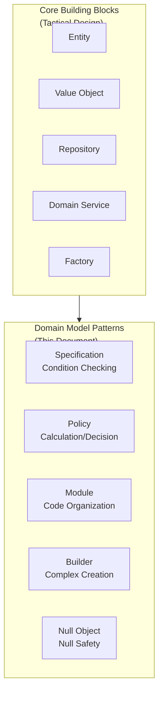
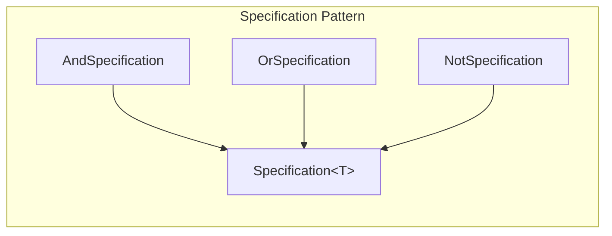
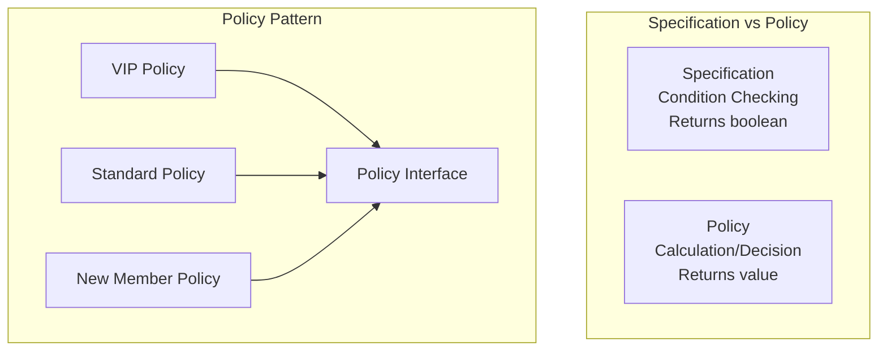
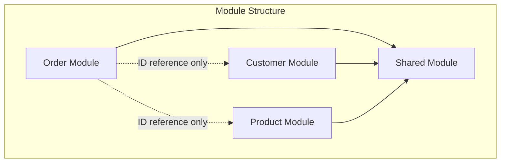

> **Target Audience**: Backend developers who understand [Tactical Design]() building blocks
> **Prerequisites**: Understanding of Entity, Value Object, Repository, Domain Service concepts
> **Estimated Time**: About 25-30 minutes
> **Key Question**: "How do you structure domain logic that is difficult to express with core building blocks alone?"


Core building blocks (Entity, Value Object, Repository, Domain Service, Factory) are the skeleton of a domain model. The patterns covered in this document are tools for <strong>systematically expressing business rules</strong> on top of that skeleton: <strong>Specification</strong> (condition checking) + <strong>Policy</strong> (calculation/decision) + <strong>Module</strong> (code organization) + <strong>Builder</strong> (complex creation) + <strong>Null Object</strong> (null safety)


You can implement a domain model with just the core building blocks of tactical design. However, real businesses have more complex requirements. Condition checks like "can this order be confirmed?", policy decisions like "what percentage discount applies to VIP customers?", and code organization spanning multiple modules — let us explore the auxiliary patterns that cleanly solve these problems.



> **Common imports for examples on this page:**
> ```java
> import java.util.*;
> import java.time.LocalDateTime;
> import java.math.BigDecimal;
> ```

#### Specification Pattern

**Definition**

The Specification pattern encapsulates business rules as objects to make them reusable. Complex conditions like "can this order be confirmed?" or "is this customer eligible for a VIP discount?" can be created as Specification objects and composed together.



**When to Use It?**

The Specification pattern is useful in the following situations.

- **Complex business rules**: Nested if-else conditions that are hard to read
- **Reusable conditions**: Validation logic repeated in multiple places
- **Dynamic condition composition**: When you need to combine conditions with and, or, not at runtime

**Basic Implementation**

The Specification interface checks conditions with the `isSatisfiedBy` method. You can compose Specifications with `and`, `or`, and `not` methods. `AndSpecification` requires both conditions to be met, `OrSpecification` requires only one, and `NotSpecification` reverses the condition.

```java
// Specification interface
public interface Specification<T> {
    boolean isSatisfiedBy(T candidate);

    default Specification<T> and(Specification<T> other) {
        return new AndSpecification<>(this, other);
    }

    default Specification<T> or(Specification<T> other) {
        return new OrSpecification<>(this, other);
    }

    default Specification<T> not() {
        return new NotSpecification<>(this);
    }
}

// Composite Specifications
public class AndSpecification<T> implements Specification<T> {
    private final Specification<T> first;
    private final Specification<T> second;

    public AndSpecification(Specification<T> first, Specification<T> second) {
        this.first = first;
        this.second = second;
    }

    @Override
    public boolean isSatisfiedBy(T candidate) {
        return first.isSatisfiedBy(candidate) && second.isSatisfiedBy(candidate);
    }
}

public class OrSpecification<T> implements Specification<T> {
    private final Specification<T> first;
    private final Specification<T> second;

    public OrSpecification(Specification<T> first, Specification<T> second) {
        this.first = first;
        this.second = second;
    }

    @Override
    public boolean isSatisfiedBy(T candidate) {
        return first.isSatisfiedBy(candidate) || second.isSatisfiedBy(candidate);
    }
}

public class NotSpecification<T> implements Specification<T> {
    private final Specification<T> spec;

    public NotSpecification(Specification<T> spec) {
        this.spec = spec;
    }

    @Override
    public boolean isSatisfiedBy(T candidate) {
        return !spec.isSatisfiedBy(candidate);
    }
}
```

**Order Domain Example**

Let us see how Specification is used in the order domain. `hasMinimumAmount` checks the minimum amount condition, and `hasStatus` checks for a specific status. `isConfirmable` composes the compound condition "PENDING status AND above minimum amount" with and. `isCancellable` composes "PENDING OR CONFIRMED status" with or. The Order class's `confirm` and `cancel` methods use these Specifications to check conditions.

```java
// Concrete Order Specifications
public class OrderSpecifications {

    // Minimum amount validation
    public static Specification<Order> hasMinimumAmount(Money minimum) {
        return order -> order.getTotalAmount().isGreaterThanOrEqual(minimum);
    }

    // Specific status validation
    public static Specification<Order> hasStatus(OrderStatus status) {
        return order -> order.getStatus() == status;
    }

    // Confirmable check
    public static Specification<Order> isConfirmable() {
        return hasStatus(OrderStatus.PENDING)
            .and(hasMinimumAmount(Money.won(10000)));
    }

    // Cancellable check
    public static Specification<Order> isCancellable() {
        return hasStatus(OrderStatus.PENDING)
            .or(hasStatus(OrderStatus.CONFIRMED));
    }

    // Shippable check
    public static Specification<Order> isShippable() {
        return hasStatus(OrderStatus.CONFIRMED)
            .and(order -> order.hasValidShippingAddress())
            .and(order -> !order.getOrderLines().isEmpty());
    }
}

// Usage example
public class Order {

    public void confirm() {
        if (!OrderSpecifications.isConfirmable().isSatisfiedBy(this)) {
            throw new OrderCannotBeConfirmedException(this.id);
        }
        this.status = OrderStatus.CONFIRMED;
        registerEvent(new OrderConfirmedEvent(this.id));
    }

    public void cancel(CancellationReason reason) {
        if (!OrderSpecifications.isCancellable().isSatisfiedBy(this)) {
            throw new OrderCannotBeCancelledException(this.id, this.status);
        }
        this.status = OrderStatus.CANCELLED;
        this.cancellationReason = reason;
        registerEvent(new OrderCancelledEvent(this.id, reason));
    }
}
```

**Using with Repository**

Specifications can also be used for Repository queries. Using Spring Data JPA Specifications, you can write dynamic queries in a type-safe manner. Specifications like `hasStatus`, `hasMinimumAmount`, `createdBetween`, and `belongsToCustomer` can be composed to create complex query conditions.

```java
// JPA Specification (Spring Data JPA)
public class OrderJpaSpecifications {

    public static org.springframework.data.jpa.domain.Specification<OrderEntity>
            hasStatus(OrderStatus status) {
        return (root, query, cb) ->
            cb.equal(root.get("status"), status);
    }

    public static org.springframework.data.jpa.domain.Specification<OrderEntity>
            hasMinimumAmount(Money minimum) {
        return (root, query, cb) ->
            cb.greaterThanOrEqualTo(root.get("totalAmount"), minimum.amount());
    }

    public static org.springframework.data.jpa.domain.Specification<OrderEntity>
            createdBetween(LocalDateTime start, LocalDateTime end) {
        return (root, query, cb) ->
            cb.between(root.get("createdAt"), start, end);
    }

    public static org.springframework.data.jpa.domain.Specification<OrderEntity>
            belongsToCustomer(CustomerId customerId) {
        return (root, query, cb) ->
            cb.equal(root.get("customerId"), customerId.getValue());
    }
}

// Usage in Repository
@Repository
public class JpaOrderRepository implements OrderRepository {

    private final OrderJpaRepository jpaRepository;

    @Override
    public List<Order> findConfirmableOrders() {
        var spec = OrderJpaSpecifications.hasStatus(OrderStatus.PENDING)
            .and(OrderJpaSpecifications.hasMinimumAmount(Money.won(10000)));

        return jpaRepository.findAll(spec).stream()
            .map(mapper::toDomain)
            .toList();
    }
}
```

The advantages of the Specification pattern can be summarized as follows. <strong>Reusability</strong> means business rules can be reused in multiple places. <strong>Readability</strong> means complex conditions are expressed clearly. <strong>Test-friendliness</strong> means each rule can be tested independently. <strong>Composability</strong> means complex rules can be built with and, or, not.

| Advantage | Description |
|-----------|-------------|
| **Reusability** | Reuse business rules in multiple places |
| **Readability** | Express complex conditions clearly |
| **Test-friendly** | Test each rule independently |
| **Composable** | Build complex rules with and, or, not |

#### Policy Pattern

**Definition**

The Policy pattern separates business policies into independent, replaceable objects. While Specification focuses on "condition checking," Policy focuses on "calculation or decision." Discount policies, shipping fee policies, and point accrual policies are good examples of the Policy pattern.



**Discount Policy Example**

Let us implement a discount policy with the Policy pattern. The `DiscountPolicy` interface defines `calculateDiscount` and `isApplicable` methods. `VipDiscountPolicy` applies a 10% discount for VIP customers. `FirstOrderDiscountPolicy` applies a 5,000 won discount for first-time customers. `BulkOrderDiscountPolicy` applies a 5% discount for purchases of 10 or more items. `DiscountCalculator` combines all these policies to calculate the total discount.

```java
// Discount policy interface
public interface DiscountPolicy {
    Money calculateDiscount(Order order, Customer customer);
    boolean isApplicable(Order order, Customer customer);
}

// VIP discount policy
public class VipDiscountPolicy implements DiscountPolicy {
    private static final BigDecimal DISCOUNT_RATE = new BigDecimal("0.10");

    @Override
    public boolean isApplicable(Order order, Customer customer) {
        return customer.getGrade() == CustomerGrade.VIP;
    }

    @Override
    public Money calculateDiscount(Order order, Customer customer) {
        return order.getTotalAmount().multiply(DISCOUNT_RATE);
    }
}

// First order discount policy
public class FirstOrderDiscountPolicy implements DiscountPolicy {
    private static final Money DISCOUNT_AMOUNT = Money.won(5000);

    @Override
    public boolean isApplicable(Order order, Customer customer) {
        return customer.getOrderCount() == 0;
    }

    @Override
    public Money calculateDiscount(Order order, Customer customer) {
        return DISCOUNT_AMOUNT;
    }
}

// Bulk order discount policy
public class BulkOrderDiscountPolicy implements DiscountPolicy {
    private static final int MINIMUM_QUANTITY = 10;
    private static final BigDecimal DISCOUNT_RATE = new BigDecimal("0.05");

    @Override
    public boolean isApplicable(Order order, Customer customer) {
        return order.getTotalQuantity() >= MINIMUM_QUANTITY;
    }

    @Override
    public Money calculateDiscount(Order order, Customer customer) {
        return order.getTotalAmount().multiply(DISCOUNT_RATE);
    }
}

// Policy composition
@DomainService
public class DiscountCalculator {

    private final List<DiscountPolicy> policies;

    public DiscountCalculator(List<DiscountPolicy> policies) {
        this.policies = policies;
    }

    public Money calculateTotalDiscount(Order order, Customer customer) {
        return policies.stream()
            .filter(policy -> policy.isApplicable(order, customer))
            .map(policy -> policy.calculateDiscount(order, customer))
            .reduce(Money.ZERO, Money::add);
    }
}
```

**Shipping Fee Policy Example**

Shipping fee policies follow a similar pattern. `StandardShippingPolicy` is the default policy that provides free shipping for purchases over 50,000 won. `RemoteAreaShippingPolicy` adds a surcharge for remote areas. It takes an existing policy as a delegate to calculate the base fee, then adds extra cost if the area is remote.

```java
// Shipping fee policy interface
public interface ShippingPolicy {
    Money calculateShippingFee(Order order, ShippingAddress address);
}

// Standard shipping fee policy
public class StandardShippingPolicy implements ShippingPolicy {
    private static final Money BASE_FEE = Money.won(3000);
    private static final Money FREE_SHIPPING_THRESHOLD = Money.won(50000);

    @Override
    public Money calculateShippingFee(Order order, ShippingAddress address) {
        if (order.getTotalAmount().isGreaterThanOrEqual(FREE_SHIPPING_THRESHOLD)) {
            return Money.ZERO;
        }
        return BASE_FEE;
    }
}

// Remote area shipping fee policy
public class RemoteAreaShippingPolicy implements ShippingPolicy {
    private static final Money REMOTE_SURCHARGE = Money.won(5000);
    private final ShippingPolicy delegate;
    private final RemoteAreaChecker remoteAreaChecker;

    @Override
    public Money calculateShippingFee(Order order, ShippingAddress address) {
        Money baseFee = delegate.calculateShippingFee(order, address);

        if (remoteAreaChecker.isRemoteArea(address)) {
            return baseFee.add(REMOTE_SURCHARGE);
        }
        return baseFee;
    }
}
```

#### Module Organization

**Package Structure**

As domain complexity grows, you manage it by separating into modules. In DDD, a Module is a unit that cohesively groups related domain concepts. The order module, customer module, and product module are each divided into domain, application, and infrastructure layers. The domain package contains Entity, Value Object, Repository Interface, and Domain Events. The application package contains Application Services and DTOs. The infrastructure package contains Repository implementations and Event Publishers. The shared module contains common Value Objects like Money and Address.

```
src/main/java/com/example/
├── order/                          # Order module
│   ├── domain/
│   │   ├── Order.java
│   │   ├── OrderLine.java
│   │   ├── OrderId.java
│   │   ├── OrderStatus.java
│   │   ├── OrderRepository.java   # Repository Interface
│   │   ├── OrderFactory.java
│   │   └── event/
│   │       ├── OrderCreatedEvent.java
│   │       └── OrderConfirmedEvent.java
│   ├── application/
│   │   ├── OrderCommandService.java
│   │   ├── OrderQueryService.java
│   │   └── dto/
│   │       ├── CreateOrderCommand.java
│   │       └── OrderResponse.java
│   └── infrastructure/
│       ├── persistence/
│       │   ├── JpaOrderRepository.java
│       │   ├── OrderEntity.java
│       │   └── OrderMapper.java
│       └── event/
│           └── KafkaOrderEventPublisher.java
│
├── customer/                       # Customer module
│   ├── domain/
│   │   ├── Customer.java
│   │   ├── CustomerId.java
│   │   └── CustomerRepository.java
│   ├── application/
│   │   └── CustomerService.java
│   └── infrastructure/
│       └── persistence/
│           └── JpaCustomerRepository.java
│
├── product/                        # Product module
│   ├── domain/
│   ├── application/
│   └── infrastructure/
│
└── shared/                         # Shared module
    ├── domain/
    │   ├── Money.java
    │   ├── Address.java
    │   └── AggregateRoot.java
    └── infrastructure/
        └── event/
            └── DomainEventPublisher.java
```

**Inter-Module Dependencies**

Dependencies between modules must be clear. The order, customer, and product modules all depend on the shared module. The order module does not directly depend on the customer or product modules — it uses only ID references.



**Inter-Module Communication**

Communication between modules uses ID references. You should not directly reference the Customer Aggregate. Only reference CustomerId. If needed, query through CustomerReader in the Application Service. This keeps coupling between modules low and allows independent changes.

```java
// Direct dependency (avoid this)
public class Order {
    private Customer customer;  // Direct reference to another module's Aggregate
}

// ID reference
public class Order {
    private CustomerId customerId;  // Reference only the ID
}

// Query in Application Service when needed
@Service
public class OrderApplicationService {

    private final OrderRepository orderRepository;
    private final CustomerReader customerReader;  // Port/Interface

    public OrderDetailResponse getOrderDetail(OrderId orderId) {
        Order order = orderRepository.findById(orderId).orElseThrow();
        Customer customer = customerReader.findById(order.getCustomerId());

        return OrderDetailResponse.of(order, customer);
    }
}
```

#### Builder Pattern (Complex Creation)

**Aggregate Builder**

Use the Builder pattern for complex Aggregate creation. While the [Tactical Design]() Factory is suited for "complex creation requiring external dependencies," Builder is suited for "assembling objects from multiple attributes." An inner Builder class provides a fluent interface, and the `build` method performs final validation.

```java
public class Order {
    private final OrderId id;
    private final CustomerId customerId;
    private final List<OrderLine> orderLines;
    private final ShippingAddress shippingAddress;
    private final Money totalAmount;
    private OrderStatus status;

    private Order(Builder builder) {
        this.id = builder.id;
        this.customerId = builder.customerId;
        this.orderLines = List.copyOf(builder.orderLines);
        this.shippingAddress = builder.shippingAddress;
        this.totalAmount = calculateTotalAmount(builder.orderLines);
        this.status = OrderStatus.PENDING;

        validate();
    }

    private void validate() {
        if (orderLines.isEmpty()) {
            throw new EmptyOrderException("An order requires at least 1 item");
        }
    }

    public static Builder builder() {
        return new Builder();
    }

    public static class Builder {
        private OrderId id;
        private CustomerId customerId;
        private List<OrderLine> orderLines = new ArrayList<>();
        private ShippingAddress shippingAddress;

        public Builder id(OrderId id) {
            this.id = id;
            return this;
        }

        public Builder customerId(CustomerId customerId) {
            this.customerId = customerId;
            return this;
        }

        public Builder addOrderLine(ProductId productId, String productName,
                                    Money price, int quantity) {
            this.orderLines.add(OrderLine.create(productId, productName, price, quantity));
            return this;
        }

        public Builder shippingAddress(ShippingAddress address) {
            this.shippingAddress = address;
            return this;
        }

        public Order build() {
            if (id == null) {
                id = OrderId.generate();
            }
            return new Order(this);
        }
    }
}

// Usage example
Order order = Order.builder()
    .customerId(CustomerId.of("CUST-001"))
    .addOrderLine(productId1, "Laptop", Money.won(1200000), 1)
    .addOrderLine(productId2, "Mouse", Money.won(50000), 2)
    .shippingAddress(new ShippingAddress("12345", "Seoul", "Gangnam-gu", "Apt 101"))
    .build();
```

#### Null Object Pattern

**Definition**

A pattern that uses a special 'null' object to avoid null checks. Define a NONE Null Object on the DiscountPolicy interface. Instead of returning null when there is no discount, return `DiscountPolicy.NONE`. This way, you can call `calculateDiscount` without null checks.

```java
// Null Object pattern applied
public interface DiscountPolicy {
    Money calculateDiscount(Order order);

    // Null Object
    DiscountPolicy NONE = order -> Money.ZERO;
}

// Usage
public class Order {
    private final DiscountPolicy discountPolicy;

    public Order(CustomerId customerId, DiscountPolicy discountPolicy) {
        this.customerId = customerId;
        // Use NONE instead of null
        this.discountPolicy = discountPolicy != null ? discountPolicy : DiscountPolicy.NONE;
    }

    public Money calculateFinalAmount() {
        // No null check needed
        Money discount = discountPolicy.calculateDiscount(this);
        return totalAmount.subtract(discount);
    }
}
```

**Comparison with Optional**

You can also use Optional, but in domain logic, Null Object is often more natural. Optional requires the caller to handle it, while Null Object operates transparently.

```java
// Using Optional
public Optional<Discount> getDiscount() {
    return Optional.ofNullable(discount);
}

// Using Null Object (recommended in domain logic)
public Discount getDiscount() {
    return discount != null ? discount : Discount.NONE;
}
```

#### Key Summary


| Pattern | Purpose | Key Use Cases |
|---------|---------|---------------|
| **Specification** | Encapsulate business rules as objects | Complex condition checks, dynamic queries |
| **Policy** | Separate business policies for replaceability | Discount, shipping fee, point calculation |
| **Module** | Cohesively organize related domain concepts | Package structure, inter-module communication |
| **Builder** | Step-by-step construction of complex objects | Creating Aggregates with many attributes |
| **Null Object** | Ensure null safety | Optional policies, default value handling |

**Specification vs Policy distinction:**
- **Specification**: "Is this condition satisfied?" -> Returns boolean
- **Policy**: "What value to calculate/decide?" -> Returns a value


#### Next Steps

- [Architecture Patterns]() - Code structure for placing building blocks and patterns
- [Testing Strategy]() - Testing methods to validate domain models
- [Anti-Patterns and Pitfalls]() - Common mistakes and solutions
