> **Target Audience**: Developers considering testability and external dependency replacement
> **Prerequisites**: Understanding the [limitations of layered architecture](layered-architecture/)
> **Estimated Time**: About 20 minutes

Also known as the **Ports and Adapters** pattern. An architecture that completely isolates the application core from the external world. The core idea of hexagonal architecture is to put business logic at the center and handle all interactions with the external world through Ports and Adapters. This way, even when external technologies change, the core business logic remains unaffected.

#### One-Line Summary

The application is inside the hexagon, and all connections with the outside are handled through Ports and Adapters. This enables perfect separation between business logic and technical details.

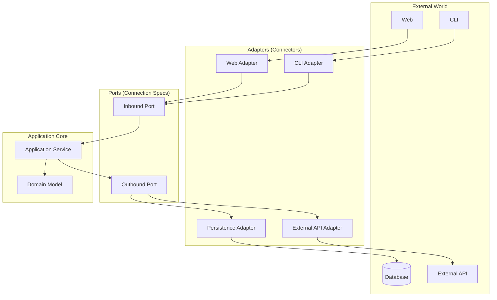

---

#### Why "Hexagonal"?

The name hexagonal isn't about having 6 sides being important, but represents the meaning that the application can be connected from multiple directions. Unlike the "top to bottom" one-way flow of layered architecture, hexagonal presents the perspective of "inside and outside".

**Analogy: Smartphone and Adapters**

Think about a smartphone. The smartphone itself doesn't know what charger you use. It could be USB-C or wireless charging. Even if the charging method changes, the phone's functions remain the same. Just by changing adapters, you can connect to various devices.

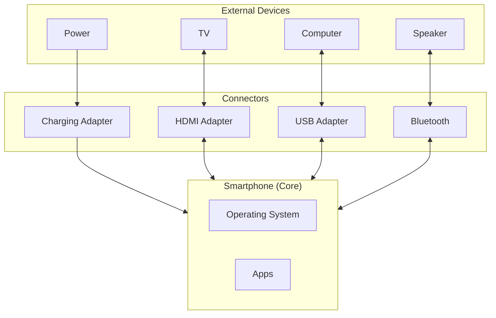

Software is the same. Core business logic doesn't need to know which database or UI framework is used. All these technical choices are isolated through Adapters.

The hexagonal shape isn't about 6 sides being important, but visually expresses the meaning of "can be connected from multiple directions". The key is shifting thinking from "top -> bottom" of layered to "inside <-> outside".

---

#### 3 Core Concepts

To understand hexagonal architecture, you need to know three concepts: Port, Adapter, and Application Core. Understanding how these three collaborate reveals the complete picture of hexagonal architecture.

**1. Port - "Connection Specification"**

A Port is an interface. It defines the "specification" for connecting with the outside. There are two types of Ports. Inbound Ports define requests coming from outside into the application, and Outbound Ports define requests going from the application to the outside.

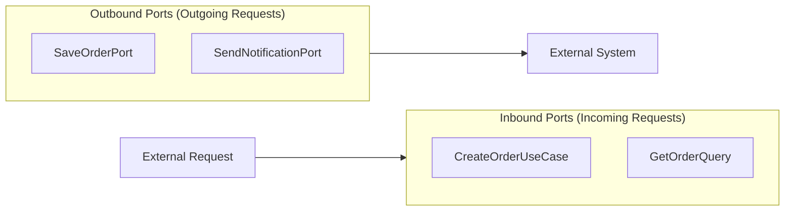

Understanding **two types of Ports** is important. The table below summarizes each Port's characteristics.

| Port Type | Direction | Role | Example |
|-----------|-----------|------|---------|
| **Inbound Port** | External -> Application | "Request to me this way" | `CreateOrderUseCase` |
| **Outbound Port** | Application -> External | "I only need this" | `SaveOrderPort` |

Inbound Ports define how the application can be called from outside. For example, they specify "to create an order, you need this information". Outbound Ports define what the application requests from the outside. They specify "I want to save an order" but don't need to know which database or how to save.

```java
// Inbound Port: "Call me like this from outside"
public interface CreateOrderUseCase {
    OrderId createOrder(CreateOrderCommand command);
}

// Outbound Port: "I want to save an order"
public interface SaveOrderPort {
    void save(Order order);
}
```

By defining Ports as interfaces like this, you don't need to know what the concrete implementation is. Later, even if you change MySQL to MongoDB or REST API to gRPC, Ports don't need to change.

**2. Adapter - "Connector"**

An Adapter is an implementation. It handles actual connections according to Port specifications. There are also two types of Adapters. Driving Adapters call the application, and Driven Adapters are called by the application.

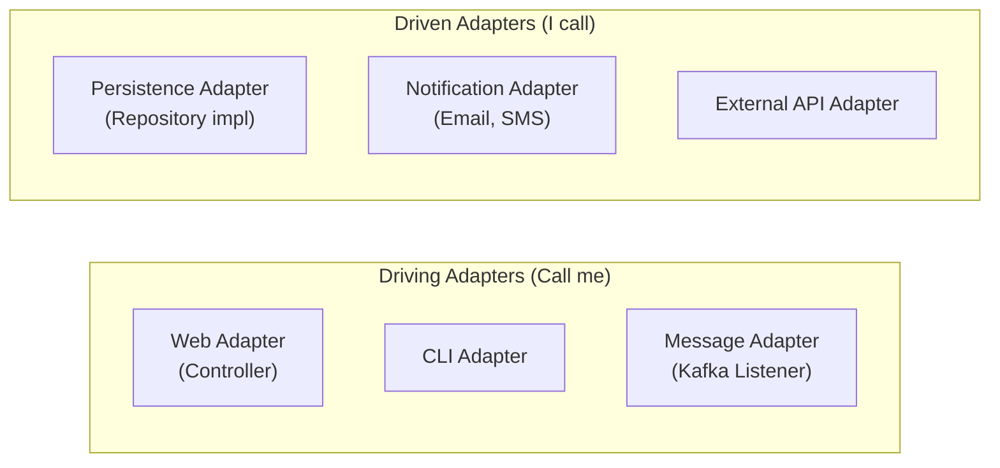

Distinguishing **two types of Adapters** is important. The table below summarizes each Adapter's characteristics.

| Adapter Type | Other Name | Role | Example |
|--------------|------------|------|---------|
| **Driving Adapter** | Primary Adapter | Calls the application | Controller, CLI |
| **Driven Adapter** | Secondary Adapter | Called by the application | Repository impl, API Client |

Driving Adapters receive external requests and pass them to the application. For example, an HTTP Controller receives HTTP requests and converts them to Inbound Port format. Driven Adapters convey the application's requests to external systems. For example, a JPA Repository converts the application's save requests to database queries.

```java
// Driving Adapter: Receives external request and passes to application
@RestController
public class OrderController {
    private final CreateOrderUseCase createOrderUseCase;  // Uses Port

    @PostMapping("/orders")
    public ResponseEntity<String> createOrder(@RequestBody OrderRequest request) {
        OrderId orderId = createOrderUseCase.createOrder(request.toCommand());
        return ResponseEntity.ok(orderId.getValue());
    }
}

// Driven Adapter: Passes application's request to external system
@Repository
public class OrderPersistenceAdapter implements SaveOrderPort {
    private final OrderJpaRepository jpaRepository;

    @Override
    public void save(Order order) {
        OrderEntity entity = OrderMapper.toEntity(order);
        jpaRepository.save(entity);
    }
}
```

In the code above, OrderController receives HTTP requests and calls CreateOrderUseCase, and OrderPersistenceAdapter implements SaveOrderPort to save to the database. The important point is that the Application Core doesn't know about these Adapters at all.

**3. Application Core - "Business Heart"**

Inside the hexagon, there is only pure business logic. Application Core consists of Application Layer and Domain Layer. Application Layer orchestrates the flow of business processes, and Domain Layer contains core business rules.

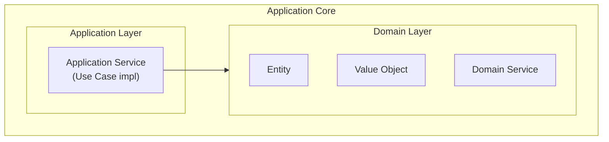

Application Core knows nothing about the external world. It doesn't know what HTTP is, what JPA is, what Kafka is. It only knows Port interfaces and focuses solely on pure business logic.

---

#### Overview of the Complete Structure

Let's look at the complete picture of how all elements of hexagonal architecture collaborate. Understanding how External World, Driving Adapters, Inbound Ports, Application Core, Outbound Ports, and Driven Adapters connect reveals the essence of hexagonal.

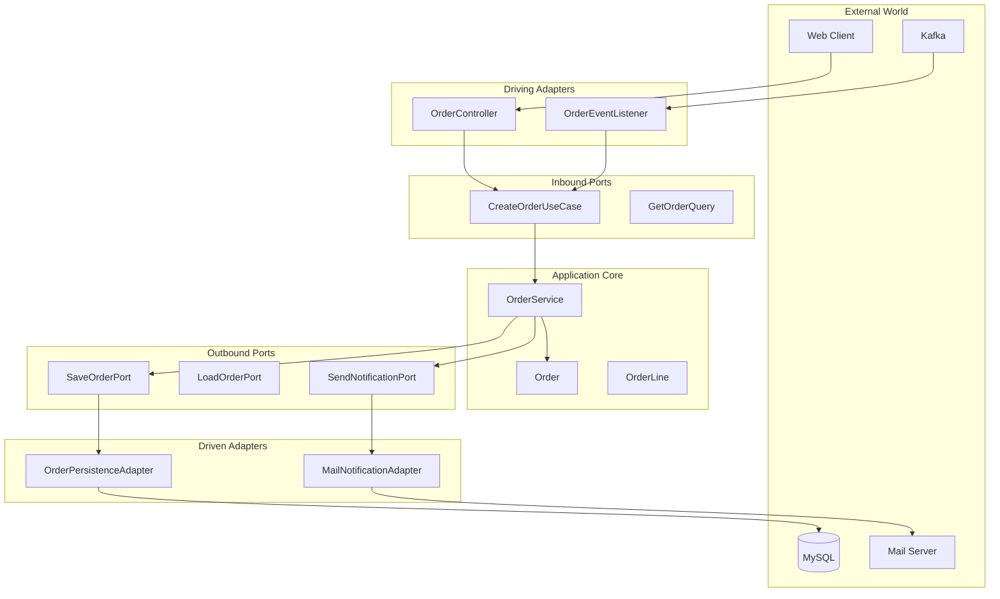

Notice the direction of arrows in the diagram above. Dependencies always point only from outside to inside. Application Core knows nothing about the outside and only uses Port interfaces.

---

#### Understanding Through Code

Now let's implement hexagonal architecture with actual code. We'll proceed in order: Port definition, Application Service implementation, and Adapter implementation.

**Step 1: Define Ports**

First, define the application's boundaries with Ports. Inbound Ports define use cases that can be called from outside, and Outbound Ports define external services the application needs.

```java
// === Inbound Ports ===
// Located in Application package

// Order creation use case
public interface CreateOrderUseCase {
    OrderId execute(CreateOrderCommand command);
}

// Order confirmation use case
public interface ConfirmOrderUseCase {
    void execute(OrderId orderId);
}

// Order query
public interface GetOrderQuery {
    OrderDto execute(OrderId orderId);
}
```

Inbound Ports clearly define the functionality the application provides. Each use case has one business purpose, and external parties can call the application just by looking at these interfaces.

```java
// === Outbound Ports ===
// Located in Application package

// Save order
public interface SaveOrderPort {
    void save(Order order);
}

// Load order
public interface LoadOrderPort {
    Order loadById(OrderId id);
    boolean existsById(OrderId id);
}

// Send notification
public interface SendNotificationPort {
    void sendOrderConfirmation(Order order);
}

// Check inventory
public interface CheckInventoryPort {
    boolean isAvailable(ProductId productId, int quantity);
}
```

Outbound Ports define external services the application needs. All communication with external systems like databases, message queues, and external APIs goes through these Ports.

**Step 2: Implement Application Service**

Application Service implements Inbound Ports and uses Outbound Ports. It orchestrates business flow and combines Domain objects to complete use cases.

```java
@Service
@Transactional
public class OrderService implements CreateOrderUseCase, ConfirmOrderUseCase {

    // Depends only on Outbound Ports (interfaces)
    private final SaveOrderPort saveOrderPort;
    private final LoadOrderPort loadOrderPort;
    private final SendNotificationPort notificationPort;
    private final CheckInventoryPort inventoryPort;

    // Constructor injection
    public OrderService(
            SaveOrderPort saveOrderPort,
            LoadOrderPort loadOrderPort,
            SendNotificationPort notificationPort,
            CheckInventoryPort inventoryPort) {
        this.saveOrderPort = saveOrderPort;
        this.loadOrderPort = loadOrderPort;
        this.notificationPort = notificationPort;
        this.inventoryPort = inventoryPort;
    }

    @Override
    public OrderId execute(CreateOrderCommand command) {
        // 1. Check inventory (using Outbound Port)
        for (OrderLineCommand line : command.getLines()) {
            if (!inventoryPort.isAvailable(line.getProductId(), line.getQuantity())) {
                throw new InsufficientInventoryException(line.getProductId());
            }
        }

        // 2. Create order (Domain Logic)
        Order order = Order.create(
            command.getCustomerId(),
            command.toOrderLines()
        );

        // 3. Save (using Outbound Port)
        saveOrderPort.save(order);

        return order.getId();
    }

    @Override
    public void execute(OrderId orderId) {
        // 1. Load order (using Outbound Port)
        Order order = loadOrderPort.loadById(orderId);

        // 2. Confirm order (Domain Logic)
        order.confirm();

        // 3. Save (using Outbound Port)
        saveOrderPort.save(order);

        // 4. Send notification (using Outbound Port)
        notificationPort.sendOrderConfirmation(order);
    }
}
```

In the code above, OrderService depends only on Port interfaces, not concrete implementations. It doesn't know whether SaveOrderPort is JPA or MongoDB, whether SendNotificationPort is email or SMS. This is the essence of hexagonal architecture.


**Key Point**

Application Service **only knows Ports (interfaces):**
- `SaveOrderPort` - Doesn't know if it's JPA or MongoDB
- `SendNotificationPort` - Doesn't know if it's email or SMS
- `CheckInventoryPort` - Doesn't know if it's internal DB or external API

So **even when external technology changes, this code doesn't need to change!**


**Step 3: Implement Driving Adapters**

Driving Adapters receive external requests and call Inbound Ports. For example, Web Adapter receives HTTP requests, converts them to Command objects, then executes Use Cases.

```java
// === Web Adapter (Driving) ===
@RestController
@RequestMapping("/api/orders")
public class OrderController {

    private final CreateOrderUseCase createOrderUseCase;
    private final ConfirmOrderUseCase confirmOrderUseCase;
    private final GetOrderQuery getOrderQuery;

    @PostMapping
    public ResponseEntity<OrderIdResponse> createOrder(
            @Valid @RequestBody CreateOrderRequest request) {

        // Request -> Command conversion
        CreateOrderCommand command = request.toCommand();

        // Execute Use Case
        OrderId orderId = createOrderUseCase.execute(command);

        // Generate Response
        return ResponseEntity
            .status(HttpStatus.CREATED)
            .body(new OrderIdResponse(orderId.getValue()));
    }

    @PostMapping("/{orderId}/confirm")
    public ResponseEntity<Void> confirmOrder(@PathVariable String orderId) {
        confirmOrderUseCase.execute(OrderId.of(orderId));
        return ResponseEntity.ok().build();
    }

    @GetMapping("/{orderId}")
    public ResponseEntity<OrderResponse> getOrder(@PathVariable String orderId) {
        OrderDto order = getOrderQuery.execute(OrderId.of(orderId));
        return ResponseEntity.ok(OrderResponse.from(order));
    }
}
```

OrderController only handles HTTP transport protocol details. Receiving HTTP requests, converting to Commands, calling Use Cases, and converting results to HTTP responses is all it does.

```java
// === Message Adapter (Driving) ===
@Component
public class OrderEventListener {

    private final ConfirmOrderUseCase confirmOrderUseCase;

    @KafkaListener(topics = "payment-completed")
    public void onPaymentCompleted(PaymentCompletedEvent event) {
        // Automatically confirm order when payment completes
        confirmOrderUseCase.execute(OrderId.of(event.getOrderId()));
    }
}
```

Message Adapter receives Kafka messages and calls Use Cases. Application Core doesn't know about Kafka at all, it's just called through Inbound Ports.

**Step 4: Implement Driven Adapters**

Driven Adapters implement Outbound Ports to communicate with external systems. For example, Persistence Adapter implements SaveOrderPort to handle the technical details of saving to the database.

```java
// === Persistence Adapter (Driven) ===
@Repository
public class OrderPersistenceAdapter implements SaveOrderPort, LoadOrderPort {

    private final OrderJpaRepository jpaRepository;
    private final OrderMapper mapper;

    @Override
    public void save(Order order) {
        OrderEntity entity = mapper.toEntity(order);
        jpaRepository.save(entity);
    }

    @Override
    public Order loadById(OrderId id) {
        return jpaRepository.findById(id.getValue())
            .map(mapper::toDomain)
            .orElseThrow(() -> new OrderNotFoundException(id));
    }

    @Override
    public boolean existsById(OrderId id) {
        return jpaRepository.existsById(id.getValue());
    }
}
```

OrderPersistenceAdapter uses JPA to access the database. It's responsible for converting Domain objects to JPA Entities and vice versa.

```java
// === Notification Adapter (Driven) ===
@Component
public class EmailNotificationAdapter implements SendNotificationPort {

    private final JavaMailSender mailSender;

    @Override
    public void sendOrderConfirmation(Order order) {
        SimpleMailMessage message = new SimpleMailMessage();
        message.setTo(order.getCustomerEmail());
        message.setSubject("Your order has been confirmed");
        message.setText("Order number: " + order.getId().getValue());

        mailSender.send(message);
    }
}
```

EmailNotificationAdapter sends emails. If you want to change to SMS later, just create a new SmsNotificationAdapter implementing SendNotificationPort. Application Service code doesn't need to change at all.

```java
// === External API Adapter (Driven) ===
@Component
public class InventoryApiAdapter implements CheckInventoryPort {

    private final RestTemplate restTemplate;

    @Override
    public boolean isAvailable(ProductId productId, int quantity) {
        String url = "http://inventory-service/api/products/{id}/stock";

        InventoryResponse response = restTemplate.getForObject(
            url,
            InventoryResponse.class,
            productId.getValue()
        );

        return response.getAvailableQuantity() >= quantity;
    }
}
```

InventoryApiAdapter communicates with an external inventory management service. Application Core doesn't know whether inventory is in an internal database or fetched from an external API.

---

#### Package Structure

Expressing hexagonal architecture as packages looks like this. The adapter package is divided into in and out, the application package has port and service, and the domain package has pure domain models.

```
com.example.order/
│
├── adapter/                          # Adapters (connections with outside)
│   ├── in/                           # Driving Adapters
│   │   ├── web/
│   │   │   ├── OrderController.java
│   │   │   ├── CreateOrderRequest.java
│   │   │   └── OrderResponse.java
│   │   └── message/
│   │       └── OrderEventListener.java
│   │
│   └── out/                          # Driven Adapters
│       ├── persistence/
│       │   ├── OrderPersistenceAdapter.java
│       │   ├── OrderEntity.java
│       │   ├── OrderJpaRepository.java
│       │   └── OrderMapper.java
│       ├── notification/
│       │   └── EmailNotificationAdapter.java
│       └── inventory/
│           └── InventoryApiAdapter.java
│
├── application/                      # Application Core - outer
│   ├── port/
│   │   ├── in/                       # Inbound Ports
│   │   │   ├── CreateOrderUseCase.java
│   │   │   ├── ConfirmOrderUseCase.java
│   │   │   └── GetOrderQuery.java
│   │   └── out/                      # Outbound Ports
│   │       ├── SaveOrderPort.java
│   │       ├── LoadOrderPort.java
│   │       ├── SendNotificationPort.java
│   │       └── CheckInventoryPort.java
│   └── service/
│       └── OrderService.java
│
└── domain/                           # Application Core - inner
    ├── Order.java
    ├── OrderLine.java
    ├── OrderId.java
    ├── OrderStatus.java
    └── Money.java
```

In this structure, the adapter package is on the outermost side, and application and domain packages are on the inside. Dependencies always point only from outside to inside.

---

#### Dependency Direction

The core of hexagonal architecture is dependency direction. All dependencies point from Adapter to Port, from Port to Core. Core depends on nothing.

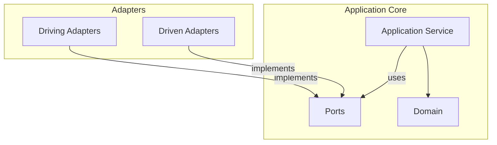

**Core Rules:**

Strictly following dependency rules is the core of hexagonal architecture. First, Adapters implement Ports and depend on Ports. Second, Application Core knows nothing about Adapters. Third, Domain depends on nothing and contains only pure business logic.

---

#### Benefits of Hexagonal

Let's look at the main benefits hexagonal architecture provides with concrete examples.

**1. Testing Becomes Easy**

Just mocking Ports makes testing very simple. You can perfectly test business logic without databases or external APIs.

```java
// Just mock Ports
@ExtendWith(MockitoExtension.class)
class OrderServiceTest {

    @Mock private SaveOrderPort saveOrderPort;
    @Mock private LoadOrderPort loadOrderPort;
    @Mock private SendNotificationPort notificationPort;
    @Mock private CheckInventoryPort inventoryPort;

    @InjectMocks
    private OrderService orderService;

    @Test
    void order_creation_succeeds() {
        // Given
        when(inventoryPort.isAvailable(any(), anyInt())).thenReturn(true);

        CreateOrderCommand command = new CreateOrderCommand(
            CustomerId.of("customer-1"),
            List.of(new OrderLineCommand(ProductId.of("product-1"), 2))
        );

        // When
        OrderId result = orderService.execute(command);

        // Then
        verify(saveOrderPort).save(any(Order.class));
        assertThat(result).isNotNull();
    }
}
```

The test above verifies OrderService logic without actual databases or external services. Just replacing Ports with Mocks makes test writing simple and execution fast.

**2. Technology Replacement Becomes Easy**

Just replacing Adapters allows easy changes to the technology stack. Application Core doesn't need to change at all.

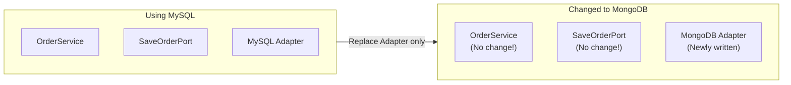

For example, even changing databases from MySQL to MongoDB, OrderService code doesn't need to change at all. The SaveOrderPort interface stays the same, you just need to write a new MongoOrderAdapter.

```java
// No Service code change when changing from MySQL to MongoDB!

// Before: MySQL Adapter
@Repository
public class MySqlOrderAdapter implements SaveOrderPort {
    private final OrderJpaRepository jpaRepository;
    // ...
}

// After: MongoDB Adapter (newly added)
@Repository
public class MongoOrderAdapter implements SaveOrderPort {
    private final OrderMongoRepository mongoRepository;
    // ...
}
```

**3. Adding External Integrations Becomes Easy**

To add new notification channels, just add Adapters. Application Core only knows the SendNotificationPort interface, so it doesn't care which Adapter is used.

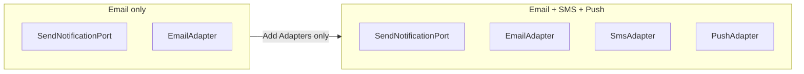

To extend from just email to SMS and push notifications, add SmsAdapter and PushAdapter. Application Service still only calls SendNotificationPort, so there's no code change.

---

#### Comparison with Layered

Layered architecture and hexagonal architecture are similar but have important differences. Let's first look at the difference in perspective.

**Difference in Perspective**

Layered emphasizes a vertical top-to-bottom structure, while hexagonal emphasizes a radial inside-outside structure.

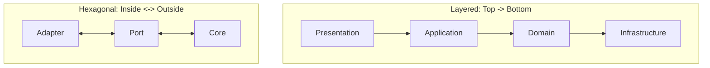

**Detailed Comparison**

The table below summarizes the main differences between layered and hexagonal.

| Aspect | Layered | Hexagonal |
|--------|---------|-----------|
| **Structure** | Vertical layers (4 tiers) | Inside/Outside |
| **Dependencies** | Top to bottom | Outside to inside |
| **Infrastructure** | Bottom layer | Outside Adapter |
| **Emphasis** | Layer separation | External isolation |
| **Testing** | Mock needed | Just Port mocks |
| **Suitable for** | Simple projects | Projects with many external integrations |

Layered is simple and intuitive, but when there are many external system integrations, hexagonal is more suitable. Hexagonal explicitly separates Ports and Adapters, allowing more flexible response to external changes.

---

#### Common Mistakes

Let's look at mistakes that often occur when applying hexagonal architecture.

**1. Direct Dependency Without Port**

If Service directly depends on Repository implementation without Port, you lose hexagonal's benefits. Always depend through interfaces (Ports).

```java
// Wrong: Service directly depends on Repository implementation
@Service
public class OrderService {
    private final OrderJpaRepository jpaRepository;  // Concrete class!
}

// Correct: Depend on Port (interface)
@Service
public class OrderService {
    private final SaveOrderPort saveOrderPort;  // Interface!
}
```

Depending on concrete classes means you have to modify Service code when changing JPA to another technology. Depending on Ports means you just replace Adapters.

**2. Business Logic in Adapter**

Adapters should only handle conversion. Don't put business logic in Adapters.

```java
// Wrong: Business logic in Controller
@RestController
public class OrderController {
    @PostMapping
    public ResponseEntity<?> createOrder(@RequestBody OrderRequest request) {
        // Business logic in Controller!
        if (request.getTotal() > 100000) {
            request.setDiscount(0.1);
        }
        // ...
    }
}

// Correct: Controller only handles request/response
@RestController
public class OrderController {
    private final CreateOrderUseCase useCase;

    @PostMapping
    public ResponseEntity<?> createOrder(@RequestBody OrderRequest request) {
        OrderId orderId = useCase.execute(request.toCommand());  // Delegate
        return ResponseEntity.ok(new OrderIdResponse(orderId));
    }
}
```

Controllers should only handle converting HTTP requests to Commands, calling Use Cases, and converting results to HTTP responses.

**3. Domain Depending on Port**

Domain must be completely pure and should not depend on Ports. Domain should contain only business logic.

```java
// Wrong: Entity using Port
public class Order {
    private final SaveOrderPort saveOrderPort;  // Domain depending on Port!

    public void confirm() {
        this.status = CONFIRMED;
        saveOrderPort.save(this);  // Not allowed!
    }
}

// Correct: Keep Domain pure
public class Order {
    public void confirm() {
        this.status = CONFIRMED;  // Only state change
    }
}

// Save in Application Service
@Service
public class OrderService {
    public void confirmOrder(OrderId id) {
        Order order = loadOrderPort.loadById(id);
        order.confirm();
        saveOrderPort.save(order);  // Save in Service
    }
}
```

Domain Entities only handle state changes, and saving is handled by Application Service through Ports.

---

#### Testing Strategy

In hexagonal architecture, tests follow the testing pyramid for each level.

**Strategy by Test Level**

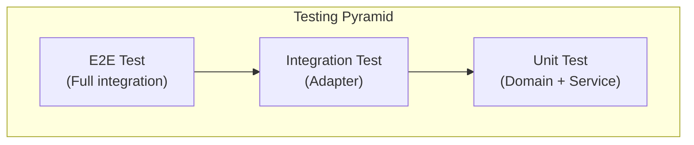

**1. Domain Test (Pure Unit Test)**

Domain has no external dependencies, so it's simplest to test. Being pure Java objects, test execution speed is also fast.

```java
class OrderTest {

    @Test
    void order_confirmation_succeeds() {
        // Given
        Order order = Order.create(
            CustomerId.of("c1"),
            List.of(new OrderLine(ProductId.of("p1"), 1, Money.of(10000)))
        );

        // When
        order.confirm();

        // Then
        assertThat(order.getStatus()).isEqualTo(OrderStatus.CONFIRMED);
    }

    @Test
    void already_confirmed_order_cannot_be_confirmed_again() {
        Order order = createConfirmedOrder();

        assertThrows(IllegalStateException.class, () -> order.confirm());
    }
}
```

**2. Application Service Test (Port Mock)**

Application Service is tested by replacing Ports with Mocks. You can verify business logic without actual databases or external services.

```java
@ExtendWith(MockitoExtension.class)
class OrderServiceTest {

    @Mock private SaveOrderPort saveOrderPort;
    @Mock private LoadOrderPort loadOrderPort;
    @Mock private SendNotificationPort notificationPort;
    @Mock private CheckInventoryPort inventoryPort;

    @InjectMocks
    private OrderService orderService;

    @Test
    void order_fails_when_inventory_insufficient() {
        // Given
        when(inventoryPort.isAvailable(any(), anyInt())).thenReturn(false);

        CreateOrderCommand command = createCommand();

        // When & Then
        assertThrows(
            InsufficientInventoryException.class,
            () -> orderService.execute(command)
        );

        verify(saveOrderPort, never()).save(any());
    }
}
```

**3. Adapter Test (Integration Test)**

Adapters communicate with actual external systems, so integration tests are performed. Spring Boot's testing tools are convenient.

```java
// Persistence Adapter test
@DataJpaTest
class OrderPersistenceAdapterTest {

    @Autowired
    private OrderJpaRepository jpaRepository;

    private OrderPersistenceAdapter adapter;

    @BeforeEach
    void setUp() {
        adapter = new OrderPersistenceAdapter(jpaRepository, new OrderMapper());
    }

    @Test
    void save_and_load_order() {
        // Given
        Order order = createOrder();

        // When
        adapter.save(order);
        Order found = adapter.loadById(order.getId());

        // Then
        assertThat(found.getId()).isEqualTo(order.getId());
    }
}

// Web Adapter test
@WebMvcTest(OrderController.class)
class OrderControllerTest {

    @Autowired
    private MockMvc mockMvc;

    @MockBean
    private CreateOrderUseCase createOrderUseCase;

    @Test
    void create_order_API() throws Exception {
        when(createOrderUseCase.execute(any()))
            .thenReturn(OrderId.of("order-123"));

        mockMvc.perform(post("/api/orders")
                .contentType(MediaType.APPLICATION_JSON)
                .content("{\"customerId\":\"c1\",\"items\":[]}"))
            .andExpect(status().isCreated())
            .andExpect(jsonPath("$.orderId").value("order-123"));
    }
}
```

---

#### When to Use Hexagonal?

Hexagonal architecture isn't suitable for every project. Consider your project's characteristics when choosing.

**Good Fit**

Hexagonal architecture is particularly useful in the following situations. When there are many external system integrations, for example projects using multiple databases, REST APIs, message queues. In microservices architecture, it helps clarify each service's boundaries.

When technology changes are possible, for example if you might change databases or messaging systems later, hexagonal is good. When the team values testing, it's also suitable. When integrating with legacy systems, Ports and Adapters can cleanly separate concerns.

**Poor Fit**

Conversely, hexagonal can be overkill in the following situations. In small, short-term projects, it can be over-engineering. When the team isn't familiar with the pattern, it's better to start with layered.

For simple CRUD applications, it's hard to benefit from hexagonal. In projects with almost no external integrations, it only adds unnecessary complexity.

---

#### Transitioning from Layered to Hexagonal

Existing layered architecture can be gradually transitioned to hexagonal. You don't need to change everything at once.

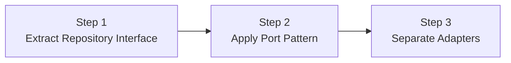

**Step 1: Move Repository Interface to Domain**

First, move the Repository interface from Infrastructure to Domain.

```java
// Before: Repository was in Infrastructure
// After: Define interface in Domain
public interface OrderRepository {
    void save(Order order);
    Optional<Order> findById(OrderId id);
}
```

**Step 2: Change to Port Naming**

Separate Repository into SaveOrderPort and LoadOrderPort for clarity.

```java
// Before: OrderRepository
// After: Separate SaveOrderPort, LoadOrderPort
public interface SaveOrderPort {
    void save(Order order);
}

public interface LoadOrderPort {
    Order loadById(OrderId id);
}
```

**Step 3: Organize Adapter Package Structure**

Finally, organize the package structure to hexagonal style.

```
// Before
com.example.order/
├── controller/
├── service/
├── repository/
└── entity/

// After
com.example.order/
├── adapter/
│   ├── in/web/
│   └── out/persistence/
├── application/
│   ├── port/in/
│   ├── port/out/
│   └── service/
└── domain/
```

---

#### Next Steps

- [Clean Architecture](clean-architecture/) - Stricter dependency rules
- [Onion Architecture](onion-architecture/) - Domain model centric
- [CQRS](cqrs/) - Read/Write separation
