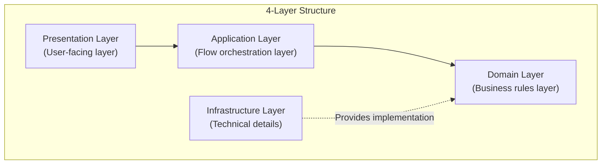
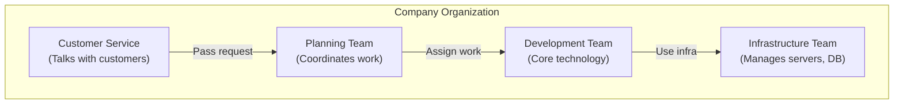
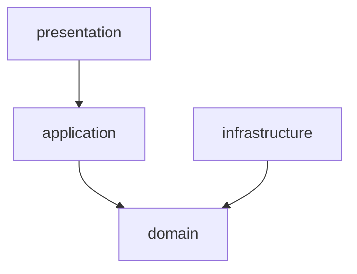
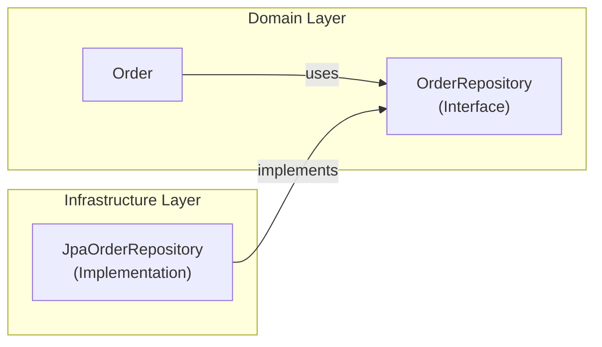
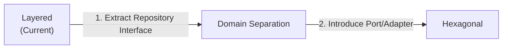

> **Target Audience**: Developers learning architecture patterns for the first time
> **Prerequisites**: Basic understanding of Spring Boot MVC patterns
> **Estimated Time**: About 15 minutes

The most basic and widely used architecture pattern. **Start here if you're learning architecture for the first time.** Layered architecture divides software horizontally so that each layer has a clear role. It follows a simple but powerful rule: each layer can only call from top to bottom.

#### One-Line Summary

The basic principle is to divide code into 4 layers and call only from top to bottom. This allows each layer to focus on its responsibilities and makes the code structure easier to understand.



---

#### Why Divide into Layers?

The reason for dividing into layers is to separate complex systems into manageable units. When each layer has its own responsibility, it becomes easier to predict the impact of code changes, and collaboration among team members becomes smoother.

**Analogy: Company Organization**

Think about how a company works. The customer service team identifies what customers want, the planning team coordinates the order of processing, the development team builds actual features, and the infrastructure team manages servers and databases. Each team focusing on their role makes things efficient, right? Software is the same.



Each team has a clear role, so when problems arise, you immediately know where to look. Software layers work on the same principle.

---

#### Detailed Explanation of 4 Layers

Layered architecture consists of 4 main layers. Each layer is clearly separated, and upper layers can only call lower layers.

**1. Presentation Layer**

The Presentation Layer is the interface for communicating with users. It receives user input and displays results. It handles HTTP requests or form inputs, and delivers results as JSON responses or HTML pages. It also validates whether input formats are correct.

Users interact with the system only through this layer. When a user clicks a button or submits a form, the Presentation Layer receives it, converts it to an appropriate format, and passes it to lower layers.

```java
// Presentation Layer example: Controller
@RestController
@RequestMapping("/api/orders")
public class OrderController {

    private final OrderService orderService;  // Calls Application Layer

    // Receive user request
    @PostMapping
    public ResponseEntity<OrderResponse> createOrder(
            @Valid @RequestBody CreateOrderRequest request) {

        // 1. Pass request data to Application Layer
        OrderDto result = orderService.createOrder(
            request.getCustomerId(),
            request.getItems()
        );

        // 2. Return result to user
        return ResponseEntity.ok(OrderResponse.from(result));
    }

    @GetMapping("/{orderId}")
    public ResponseEntity<OrderResponse> getOrder(@PathVariable String orderId) {
        OrderDto order = orderService.getOrder(orderId);
        return ResponseEntity.ok(OrderResponse.from(order));
    }
}

// Request/Response objects (DTO)
public record CreateOrderRequest(
    String customerId,
    List<OrderItemRequest> items
) {}

public record OrderResponse(
    String orderId,
    String status,
    BigDecimal totalAmount
) {
    public static OrderResponse from(OrderDto dto) {
        return new OrderResponse(dto.orderId(), dto.status(), dto.totalAmount());
    }
}
```

In the code above, OrderController receives HTTP requests and passes them to OrderService, then converts the results back to HTTP responses. This layer only knows about HTTP protocol details and contains no business logic.


**Common Mistake: Business logic in Presentation**

```java
// ❌ Wrong: Discount calculation in Controller
@PostMapping
public ResponseEntity<OrderResponse> createOrder(...) {
    // This logic shouldn't be here!
    if (request.getTotalAmount() > 100000) {
        request.setDiscount(0.1);  // 10% discount
    }
}
```

Business logic should be in the Domain Layer.


**2. Application Layer**

The Application Layer is the conductor orchestrating workflow. This layer decides "what" to do, but leaves "how" to the Domain Layer. It decides the order of processing, manages transactions, and combines Domain Layer objects.

For example, when creating an order, it orchestrates a series of flows: query customer information, create order object, save, and send notification. The actual business rules are applied by Domain objects, but the Application Layer decides the order of execution.

```java
// Application Layer example: Service
@Service
@Transactional  // Transaction management here
public class OrderService {

    private final OrderRepository orderRepository;
    private final CustomerRepository customerRepository;
    private final PaymentService paymentService;
    private final NotificationService notificationService;

    // Orchestrate order creation "flow"
    public OrderDto createOrder(String customerId, List<OrderItemDto> items) {

        // 1. Find customer
        Customer customer = customerRepository.findById(customerId)
            .orElseThrow(() -> new CustomerNotFoundException(customerId));

        // 2. Create order (business logic inside Order object)
        Order order = Order.create(customer.getId(), toOrderLines(items));

        // 3. Save
        orderRepository.save(order);

        // 4. Send notification
        notificationService.sendOrderCreatedNotification(order);

        // 5. Return result
        return OrderDto.from(order);
    }

    // Order confirmation "flow"
    public void confirmOrder(String orderId) {
        // 1. Find order
        Order order = orderRepository.findById(orderId)
            .orElseThrow(() -> new OrderNotFoundException(orderId));

        // 2. Process payment
        paymentService.processPayment(order.getTotalAmount());

        // 3. Confirm order (business logic inside Order)
        order.confirm();

        // 4. Save
        orderRepository.save(order);
    }
}
```

The code above defines the flow of business processes for order creation and confirmation. It executes each step in order, and the actual business rules are handled by Order object's create() or confirm() methods.


**Application vs Domain Difference**

```java
// Application Layer: "Flow" orchestration
public void confirmOrder(String orderId) {
    Order order = orderRepository.findById(orderId);
    paymentService.processPayment(order.getTotalAmount());
    order.confirm();  // Asks Domain to "confirm"
    orderRepository.save(order);
}

// Domain Layer: "Rule" application
public class Order {
    public void confirm() {
        // Business rule: Can only confirm from PENDING state
        if (this.status != OrderStatus.PENDING) {
            throw new IllegalStateException("Cannot confirm in this state");
        }
        this.status = OrderStatus.CONFIRMED;
    }
}
```


**3. Domain Layer**

The Domain Layer is the heart of business rules. It is the most important layer, where "real business logic" lives. It expresses business rules, maintains data consistency, and represents domain concepts.

For example, rules like "VIP customers get 10% discount", constraints like "order amount must be 0 or more", and invariants like "order can only be modified when status is PENDING" are all in this layer. Domain concepts like Order, Customer, and Product are also expressed as classes in this layer.

```java
// Domain Layer example: Entity
public class Order {
    private OrderId id;
    private CustomerId customerId;
    private List<OrderLine> orderLines;
    private OrderStatus status;
    private Money totalAmount;

    // Creation method: Apply business rules
    public static Order create(CustomerId customerId, List<OrderLine> lines) {
        // Rule: Order must have at least 1 item
        if (lines.isEmpty()) {
            throw new IllegalArgumentException("Order requires at least 1 item");
        }

        Order order = new Order();
        order.id = OrderId.generate();
        order.customerId = customerId;
        order.orderLines = new ArrayList<>(lines);
        order.status = OrderStatus.PENDING;
        order.calculateTotal();

        return order;
    }

    // Business logic: Add item
    public void addItem(OrderLine line) {
        // Rule: Can only add items in PENDING state
        validateModifiable();

        // Rule: Same product increases quantity
        orderLines.stream()
            .filter(existing -> existing.isSameProduct(line))
            .findFirst()
            .ifPresentOrElse(
                existing -> existing.increaseQuantity(line.getQuantity()),
                () -> orderLines.add(line)
            );

        calculateTotal();
    }

    // Business logic: Confirm order
    public void confirm() {
        // Rule: Can only confirm from PENDING state
        if (this.status != OrderStatus.PENDING) {
            throw new IllegalStateException(
                "Cannot confirm order. Current state: " + status
            );
        }

        // Rule: Check minimum order amount
        if (this.totalAmount.isLessThan(Money.of(1000))) {
            throw new IllegalStateException("Minimum order amount is 1,000 won");
        }

        this.status = OrderStatus.CONFIRMED;
    }

    // Business logic: Cancel order
    public void cancel() {
        // Rule: Cannot cancel after shipping started
        if (this.status == OrderStatus.SHIPPED) {
            throw new IllegalStateException("Cannot cancel shipped orders");
        }

        this.status = OrderStatus.CANCELLED;
    }

    // Internal logic
    private void calculateTotal() {
        this.totalAmount = orderLines.stream()
            .map(OrderLine::getAmount)
            .reduce(Money.ZERO, Money::add);
    }

    private void validateModifiable() {
        if (this.status != OrderStatus.PENDING) {
            throw new IllegalStateException("Cannot modify in this state");
        }
    }
}
```

In the code above, the Order class encapsulates all business rules related to orders. External code can only change state through Order's public methods, and each method validates business rules before changing state.

```java
// Domain Layer: Value Object
public record Money(BigDecimal amount) {

    public static final Money ZERO = new Money(BigDecimal.ZERO);

    public Money {
        // Invariant: Amount must be 0 or more
        if (amount.compareTo(BigDecimal.ZERO) < 0) {
            throw new IllegalArgumentException("Amount must be 0 or greater");
        }
    }

    public static Money of(long amount) {
        return new Money(BigDecimal.valueOf(amount));
    }

    public Money add(Money other) {
        return new Money(this.amount.add(other.amount));
    }

    public Money multiply(int quantity) {
        return new Money(this.amount.multiply(BigDecimal.valueOf(quantity)));
    }

    public boolean isLessThan(Money other) {
        return this.amount.compareTo(other.amount) < 0;
    }
}
```

Money is an example of a Value Object. It is immutable, compared by value, and validates its own invariant (amount must be 0 or more).


**Common Mistake: Anemic Domain**

```java
// ❌ Wrong: Entity with no logic, just data
public class Order {
    private String id;
    private String status;
    private BigDecimal total;

    // Only getter, setter...
    public String getStatus() { return status; }
    public void setStatus(String status) { this.status = status; }
}

// Logic is in Service
public class OrderService {
    public void confirm(Order order) {
        if (order.getStatus().equals("PENDING")) {
            order.setStatus("CONFIRMED");  // Don't do this!
        }
    }
}
```

Business logic should be inside the Entity!


**4. Infrastructure Layer**

The Infrastructure Layer handles technical details. It handles database access, external API calls, message sending, file storage, and all communication with external systems. Technical tools like JPA, MyBatis, REST Client, Kafka, and Email are in this layer.

Implementations in this layer implement Domain Layer interfaces. For example, the OrderRepository interface is defined in the Domain Layer, and the JpaOrderRepository implementation is in the Infrastructure Layer.

```java
// Infrastructure Layer: Repository implementation
@Repository
public class JpaOrderRepository implements OrderRepository {

    private final OrderJpaRepository jpaRepository;  // Spring Data JPA
    private final OrderMapper mapper;

    @Override
    public void save(Order order) {
        // Domain -> JPA Entity conversion
        OrderEntity entity = mapper.toEntity(order);
        jpaRepository.save(entity);
    }

    @Override
    public Optional<Order> findById(OrderId id) {
        // JPA Entity -> Domain conversion
        return jpaRepository.findById(id.getValue())
            .map(mapper::toDomain);
    }
}

// JPA Entity (Infrastructure only)
@Entity
@Table(name = "orders")
public class OrderEntity {
    @Id
    private String id;
    private String customerId;
    private String status;
    private BigDecimal totalAmount;

    @OneToMany(mappedBy = "order", cascade = CascadeType.ALL)
    private List<OrderLineEntity> orderLines;

    // getter, setter (used only in Infrastructure)
}
```

The code above converts Domain's Order object to JPA Entity for database storage. The Domain Layer knows nothing about database technology and only uses the OrderRepository interface.

```java
// Infrastructure Layer: External API integration
@Component
public class PaymentGatewayClient implements PaymentService {

    private final RestTemplate restTemplate;

    @Override
    public PaymentResult processPayment(Money amount) {
        PaymentRequest request = new PaymentRequest(amount.getAmount());

        ResponseEntity<PaymentResponse> response = restTemplate.postForEntity(
            "https://payment-api.example.com/pay",
            request,
            PaymentResponse.class
        );

        return toPaymentResult(response.getBody());
    }
}
```

Communication with external payment APIs is also handled in the Infrastructure Layer. The Domain Layer only knows the PaymentService interface and doesn't know which payment system is actually used.

---

#### Package Structure

When applying layered architecture to a Java project, package structure is important. Separate each layer into its own package so that layers are clearly distinguished physically.

**Basic Structure**

Below is a package structure for an order domain organized in layers. Each layer is separated into independent packages, making it easy for code readers to identify which layer code belongs to.

```
com.example.order/
├── presentation/              # Presentation Layer
│   ├── OrderController.java
│   ├── CreateOrderRequest.java
│   └── OrderResponse.java
│
├── application/               # Application Layer
│   ├── OrderService.java
│   └── OrderDto.java
│
├── domain/                    # Domain Layer
│   ├── Order.java
│   ├── OrderLine.java
│   ├── OrderId.java
│   ├── OrderStatus.java
│   ├── Money.java
│   └── OrderRepository.java   # Interface (implementation in Infrastructure)
│
└── infrastructure/            # Infrastructure Layer
    ├── persistence/
    │   ├── JpaOrderRepository.java
    │   ├── OrderEntity.java
    │   └── OrderMapper.java
    └── external/
        └── PaymentGatewayClient.java
```

The presentation package contains controllers and DTOs, the application package contains services and application DTOs, the domain package contains entities and value objects, and the infrastructure package contains Repository implementations and external integration code.

**Dependency Direction**

Dependency direction always flows from top to bottom. In the diagram below, arrows indicate dependency direction. Presentation depends on application, application depends on domain, and infrastructure also depends on domain. However, domain depends on nothing.



This way, the domain layer becomes the most stable layer, and technical changes (e.g., changing from JPA to MyBatis) don't affect the domain.

---

#### Dependency Inversion (DIP)

"Domain doesn't depend on Infrastructure" might sound strange. How can we use Repository without depending on it? The secret is in interfaces.

**The Secret: Interfaces**

Define the Repository interface in the Domain Layer and implement it in the Infrastructure Layer. This way, Domain doesn't need to know the concrete implementation, just using the interface.



In the diagram above, Order uses the OrderRepository interface, and JpaOrderRepository implements that interface. The dependency direction is inverted.

```java
// Domain Layer: Define interface
public interface OrderRepository {
    void save(Order order);
    Optional<Order> findById(OrderId id);
}

// Domain Layer: Service uses only interface
@Service
public class OrderService {
    private final OrderRepository orderRepository;  // Interface type

    public void createOrder(...) {
        orderRepository.save(order);  // Doesn't know concrete implementation
    }
}

// Infrastructure Layer: Implement interface
@Repository
public class JpaOrderRepository implements OrderRepository {
    // Implement using JPA
}
```

This way, Domain only needs to know the OrderRepository interface, and you can swap JPA for MyBatis without changing Domain code. It's also convenient to use fake (Mock) Repositories for testing.

---

#### Pros and Cons of Layered

Layered architecture is simple and intuitive but has some pros and cons. Depending on project characteristics, advantages may outweigh disadvantages or vice versa.

**Advantages**

The main advantages of layered architecture are that it's easy to understand and apply. The table below summarizes the key advantages.

| Advantage | Description |
|-----------|-------------|
| **Easy to understand** | Intuitive top-to-bottom flow |
| **Clear roles** | What each layer does is obvious |
| **Quick start** | Can apply immediately without complex setup |
| **Team collaboration** | "You do Controller, I do Service" division possible |

The intuitive top-to-bottom flow makes it easy for new developers to understand. Each layer's role is clearly defined, so there's little need to wonder where to write what code. You can apply it immediately without complex setup or additional tools, enabling quick project starts. It's also efficient for team collaboration since members can divide work by layer.

**Disadvantages**

However, layered architecture also has some disadvantages. These disadvantages can become burdensome as projects grow.

| Disadvantage | Description |
|--------------|-------------|
| **Forces layer traversal** | Even simple queries must go through all layers |
| **Technology dependency** | Infrastructure changes can affect Domain |
| **Testing difficulties** | Hard to test without Mocks |

Even simple data queries must go through all layers, which can lead to unnecessary code. If you directly attach JPA annotations to Domain Entities, technology dependencies arise, making future changes difficult. Testing can be cumbersome since all lower layers must be Mocked.

---

#### Common Mistakes

Let's look at common mistakes when applying layered architecture. Avoiding these mistakes leads to cleaner code.

**1. Skipping Layers**

Skipping layers violates the core principle of layered architecture. Each layer should only call the layer directly below it; you shouldn't skip layers.

```java
// ❌ Controller directly accesses Repository
@RestController
public class OrderController {
    @Autowired
    private OrderRepository orderRepository;  // Skips Application Layer!

    @GetMapping("/{id}")
    public Order getOrder(@PathVariable String id) {
        return orderRepository.findById(id);  // Returns directly without validation/conversion
    }
}
```

The code above has the Controller directly calling the Repository, skipping the Application Layer. This means there's no opportunity to apply business logic, and responsibilities between layers become ambiguous.

```java
// ✅ Correct: Go through Application Layer
@RestController
public class OrderController {
    private final OrderService orderService;  // Application Layer

    @GetMapping("/{id}")
    public OrderResponse getOrder(@PathVariable String id) {
        OrderDto dto = orderService.getOrder(id);  // Through Service
        return OrderResponse.from(dto);
    }
}
```

The correct approach is for the Controller to call the Service, and the Service to call the Repository. This allows each layer to perform its role.

**2. Technical Code in Domain**

Attaching framework annotations like JPA or Spring to Domain Entities makes Domain dependent on technology. To maintain a pure Domain model, create separate Entities in Infrastructure.

```java
// ❌ JPA annotations in Domain Entity
@Entity
@Table(name = "orders")
public class Order {
    @Id
    @GeneratedValue
    private Long id;

    @OneToMany(cascade = CascadeType.ALL)
    private List<OrderLine> lines;
}
```

The code above has the Domain Entity directly depending on JPA. If you later want to replace JPA with another technology, you'd have to modify all Domain code.

To maintain a pure Domain model, keep only plain Java objects in Domain and create separate JPA Entities in Infrastructure. Use Mappers to convert between Domain objects and JPA Entities.

**3. Circular Dependencies**

Circular dependencies occur when two or more Services depend on each other. This can cause compile errors or runtime problems.

```java
// ❌ Circular dependency
// OrderService -> PaymentService -> OrderService

@Service
public class OrderService {
    private final PaymentService paymentService;
}

@Service
public class PaymentService {
    private final OrderService orderService;  // Circular!
}
```

The code above creates a circular structure where OrderService and PaymentService depend on each other. This structure makes code hard to understand and testing difficult.

```java
// ✅ Solve with events
@Service
public class OrderService {
    private final EventPublisher eventPublisher;

    public void confirmOrder(String orderId) {
        // ...
        eventPublisher.publish(new OrderConfirmedEvent(order));
    }
}

@Component
public class PaymentEventHandler {
    @EventListener
    public void onOrderConfirmed(OrderConfirmedEvent event) {
        // Process payment
    }
}
```

A good way to resolve circular dependencies is to use events. OrderService publishes events, and PaymentEventHandler receives and processes them. This way, the two services don't directly depend on each other.

---

#### Testing Strategy

In layered architecture, you can test each layer independently. Different testing methods are appropriate for different layers.

**1. Domain Layer Test (Easiest)**

The Domain Layer has no external dependencies, so you only need to test pure logic. No Mocks needed, and test execution is fast.

```java
class OrderTest {

    @Test
    void totalAmountIsCalculatedOnCreation() {
        // Given
        List<OrderLine> lines = List.of(
            new OrderLine(ProductId.of("P1"), 2, Money.of(10000)),
            new OrderLine(ProductId.of("P2"), 1, Money.of(5000))
        );

        // When
        Order order = Order.create(CustomerId.of("C1"), lines);

        // Then
        assertThat(order.getTotalAmount()).isEqualTo(Money.of(25000));
    }

    @Test
    void canOnlyConfirmFromPendingState() {
        Order order = createPendingOrder();

        order.confirm();

        assertThat(order.getStatus()).isEqualTo(OrderStatus.CONFIRMED);
    }

    @Test
    void cannotCancelShippedOrder() {
        Order order = createShippedOrder();

        assertThrows(IllegalStateException.class, () -> order.cancel());
    }
}
```

All the tests above are pure unit tests. They verify Order class logic without databases or external services.

**2. Application Layer Test (Using Mock)**

The Application Layer combines multiple lower layers, so use Mocks for testing. You can test quickly by replacing Repositories and external services with Mocks.

```java
@ExtendWith(MockitoExtension.class)
class OrderServiceTest {

    @Mock
    private OrderRepository orderRepository;

    @Mock
    private NotificationService notificationService;

    @InjectMocks
    private OrderService orderService;

    @Test
    void createOrderSuccess() {
        // Given
        String customerId = "customer-1";
        List<OrderItemDto> items = List.of(
            new OrderItemDto("product-1", 2, 10000)
        );

        // When
        OrderDto result = orderService.createOrder(customerId, items);

        // Then
        verify(orderRepository).save(any(Order.class));
        verify(notificationService).sendOrderCreatedNotification(any());
        assertThat(result.orderId()).isNotNull();
    }
}
```

The test above verifies OrderService's flow orchestration logic. It tests without actual databases or notification services by replacing Repository and NotificationService with Mocks.

**3. Infrastructure Layer Test (Integration Test)**

The Infrastructure Layer communicates with actual databases or external systems, so perform integration tests. Tools like Spring Boot's @DataJpaTest are convenient.

```java
@DataJpaTest
class JpaOrderRepositoryTest {

    @Autowired
    private OrderJpaRepository jpaRepository;

    private JpaOrderRepository repository;

    @BeforeEach
    void setUp() {
        repository = new JpaOrderRepository(jpaRepository, new OrderMapper());
    }

    @Test
    void saveAndFindOrder() {
        // Given
        Order order = createTestOrder();

        // When
        repository.save(order);
        Optional<Order> found = repository.findById(order.getId());

        // Then
        assertThat(found).isPresent();
        assertThat(found.get().getId()).isEqualTo(order.getId());
    }
}
```

The test above uses actual JPA and a database (usually an in-memory DB like H2) to verify that the Repository implementation works correctly.

---

#### When to Use Layered?

Layered architecture isn't suitable for all situations. Its suitability varies depending on project characteristics and team circumstances.

**Suitable Cases**

Layered architecture works particularly well in the following situations. In early project stages, a simple layered approach may be more appropriate than complex architecture. When teams have little architecture pattern experience, the easy-to-understand layered approach is good.

If business logic is not complex and the application is simple CRUD, layered is sufficient. It's also suitable for MVPs or prototypes that need rapid development.

**Unsuitable Cases**

On the other hand, layered may be unsuitable in the following situations. For many external system integrations, consider hexagonal architecture. For complex domain logic, onion architecture may be more appropriate.

For large teams or long-term projects, stricter rules like clean architecture may be needed.

---

#### Evolving to Next Stage

Once familiar with layered, you can progress to more advanced patterns as needed. It's good to improve gradually.



**Step 1: Move Repository Interface to Domain**

First, move the Repository interface from Infrastructure to Domain. This way, Domain no longer depends on Infrastructure.

```java
// Before: Was in Infrastructure
// After: Move to Domain
package com.example.domain;

public interface OrderRepository {
    void save(Order order);
    Optional<Order> findById(OrderId id);
}
```

**Step 2: Abstract more external integrations as Interfaces**

Abstract all external service integrations as interfaces. Going through this process naturally evolves into hexagonal architecture.

---

#### Next Steps

- [Hexagonal Architecture](../hexagonal-architecture/) - Isolate external with Port and Adapter
- [Clean Architecture](../clean-architecture/) - Strict dependency rules
- [Onion Architecture](../onion-architecture/) - Domain model centric
