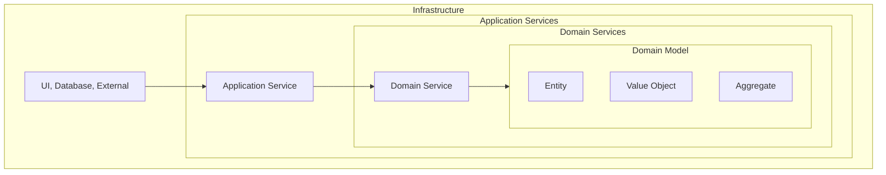
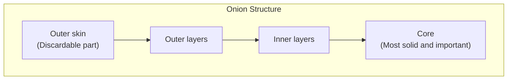
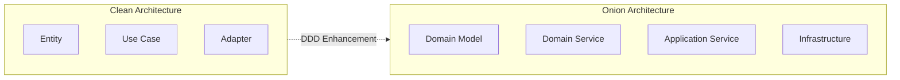
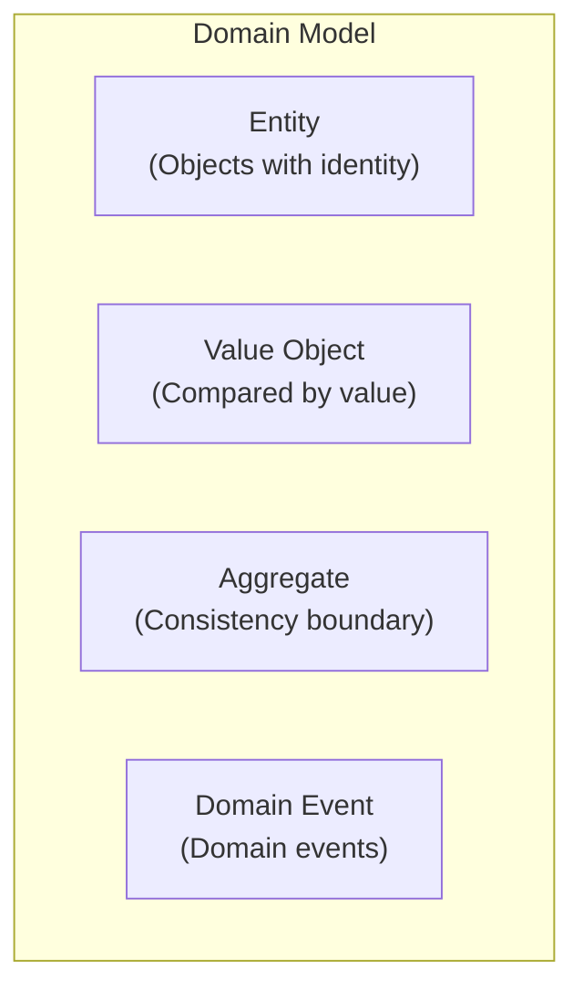
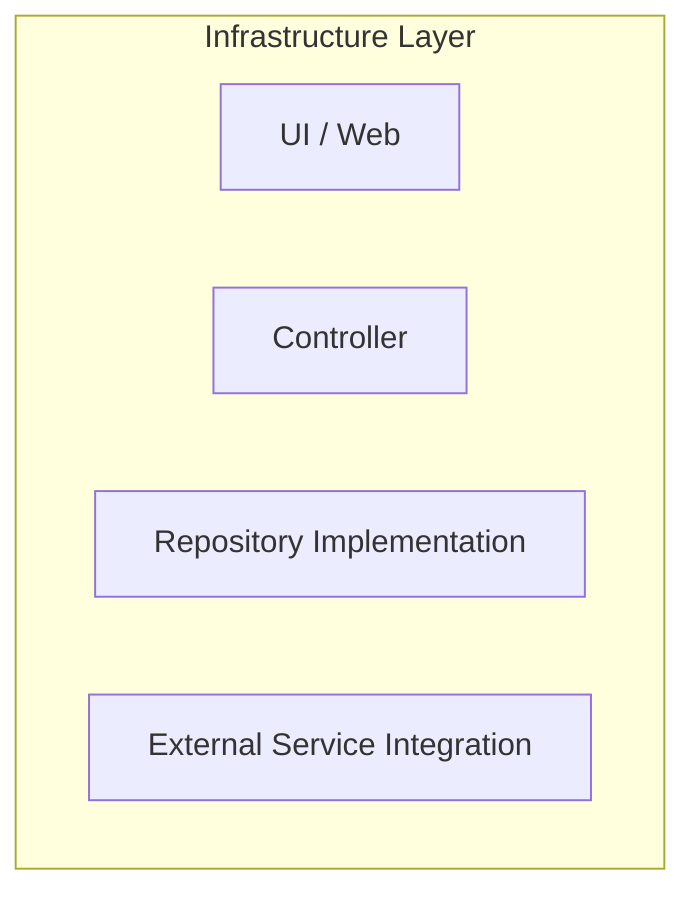
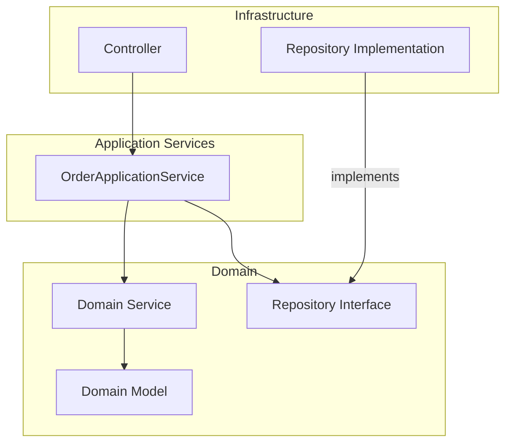
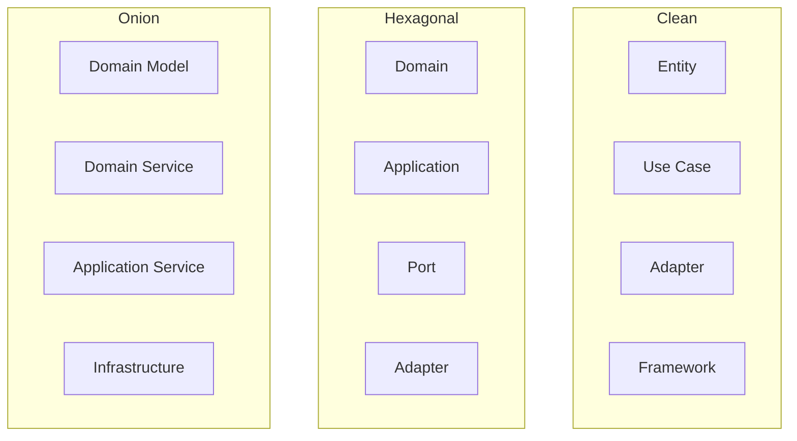
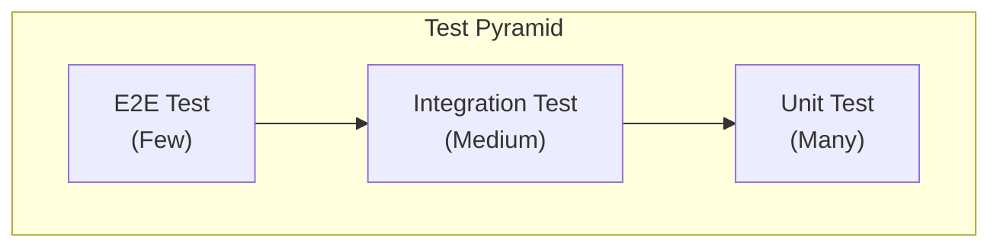
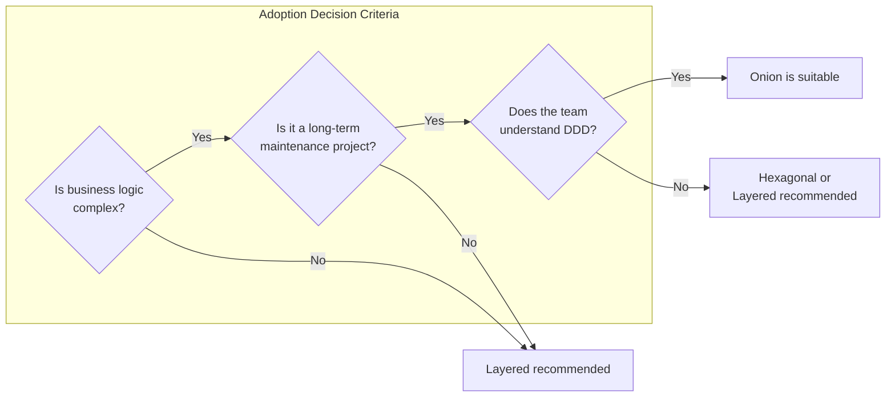
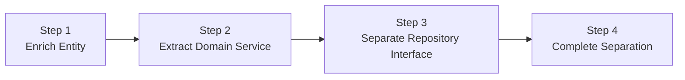

> **Target Audience**: Developers looking for architecture that pairs well with DDD
> **Prerequisites**: [Hexagonal Architecture](../hexagonal-architecture/) and Dependency Inversion Principle
> **Estimated Time**: About 20 minutes

# Onion Architecture

Proposed by Jeffrey Palermo in 2008. Places **Domain Model at the center**, wrapped in layers like an onion.

Onion Architecture starts from the limitations of traditional layered architecture. In layered architecture, upper layers depend on lower layers, so changes in the database layer cause cascading effects on the service layer. In contrast, Onion Architecture is designed so that **Domain Model doesn't depend on anything**, and Infrastructure depends on Domain. This allows domain logic to express pure business rules regardless of changes in databases, frameworks, or external services. This is why it pairs particularly well with Domain-Driven Design (DDD).

## One-Line Summary

> **Domain Model is king. Everything else serves the domain.**



---

## Understanding with an "Onion"

### Analogy: A Real Onion

If you cut an onion:



Software is the same:

| Onion Layer | Software Layer | Characteristics |
|-------------|----------------|-----------------|
| Outer skin | Infrastructure | Replaceable, technical details |
| Outer layers | Application Services | Flow orchestration |
| Inner layers | Domain Services | Domain logic composition |
| Core | Domain Model | Business rules that never change |

**Key Idea:** Domain Model is at the innermost layer and **depends on nothing**.

---

## Difference from Clean Architecture

Both have "concentric circle" structures, but emphasis differs:

| Aspect | Clean | Onion |
|--------|-------|-------|
| **Center** | Entity (Business rules) | Domain Model (DDD concepts) |
| **Emphasis** | Dependency rule | Domain purity |
| **Domain Service** | Part of Entity | Separate layer |
| **Use Case** | Interactor | Application Service |
| **DDD Affinity** | Medium | High |



**Why Onion is more suitable for DDD:**
- Clearly separates Domain Model and Domain Service
- Aggregate, Entity, Value Object concepts fit naturally
- Repository interface lives in Domain

---

## Detailed Explanation of 4 Layers

### 1. Domain Model - Innermost

Where **core business concepts and rules** reside.



```java
// Entity: Distinguished by unique identifier
public class Order {
    private final OrderId id;  // Identifier
    private CustomerId customerId;
    private List<OrderLine> orderLines;
    private OrderStatus status;
    private Money totalAmount;

    // Factory method
    public static Order create(CustomerId customerId, List<OrderLine> lines) {
        if (lines.isEmpty()) {
            throw new EmptyOrderException();
        }

        Order order = new Order(OrderId.generate());
        order.customerId = customerId;
        order.orderLines = new ArrayList<>(lines);
        order.status = OrderStatus.PENDING;
        order.recalculateTotal();

        return order;
    }

    // Business logic
    public void addLine(OrderLine line) {
        validateModifiable();
        this.orderLines.add(line);
        recalculateTotal();
    }

    public void confirm() {
        validateCanConfirm();
        this.status = OrderStatus.CONFIRMED;
    }

    public void cancel() {
        validateCanCancel();
        this.status = OrderStatus.CANCELLED;
    }

    // Invariant validation
    private void validateModifiable() {
        if (status != OrderStatus.PENDING) {
            throw new OrderNotModifiableException(id, status);
        }
    }

    private void validateCanConfirm() {
        if (status != OrderStatus.PENDING) {
            throw new InvalidOrderStateException("Can only confirm from PENDING state");
        }
        if (totalAmount.isLessThan(Money.of(1000))) {
            throw new MinimumOrderAmountException();
        }
    }
}
```

```java
// Value Object: Compared by value, immutable
public record Money(BigDecimal amount, Currency currency) {

    public static final Money ZERO = Money.of(0);

    public Money {
        Objects.requireNonNull(amount);
        Objects.requireNonNull(currency);
        if (amount.compareTo(BigDecimal.ZERO) < 0) {
            throw new NegativeAmountException();
        }
    }

    public static Money of(long amount) {
        return new Money(BigDecimal.valueOf(amount), Currency.KRW);
    }

    public Money add(Money other) {
        validateSameCurrency(other);
        return new Money(amount.add(other.amount), currency);
    }

    public Money multiply(int quantity) {
        return new Money(amount.multiply(BigDecimal.valueOf(quantity)), currency);
    }

    public boolean isLessThan(Money other) {
        validateSameCurrency(other);
        return amount.compareTo(other.amount) < 0;
    }

    public boolean isGreaterThan(Money other) {
        validateSameCurrency(other);
        return amount.compareTo(other.amount) > 0;
    }

    private void validateSameCurrency(Money other) {
        if (this.currency != other.currency) {
            throw new CurrencyMismatchException(this.currency, other.currency);
        }
    }
}
```

```java
// Aggregate Root: Consistency boundary
public class Order {  // Order is the Aggregate Root
    private OrderId id;
    private List<OrderLine> orderLines;  // OrderLine is only managed within Order

    // External access to OrderLine only through Order
    public void addLine(ProductId productId, int quantity, Money unitPrice) {
        OrderLine line = new OrderLine(productId, quantity, unitPrice);
        this.orderLines.add(line);
        recalculateTotal();
    }

    public void removeLine(ProductId productId) {
        orderLines.removeIf(line -> line.getProductId().equals(productId));
        recalculateTotal();
    }
}
```


**Domain Model Characteristics**
- **Pure Java objects** - No framework dependencies
- **Rich domain logic** - Must not be just getters/setters
- **Self-defensive** - Cannot be put into invalid state
- **Easy to test** - Testable without external dependencies


---

### 2. Domain Services

Where **logic combining multiple domain objects** resides. Contains logic that's hard to put in a single Entity.

```
When asking "Where does this logic belong?"
- In Order? Or Customer?
-> If neither, then Domain Service!
```

```java
// Domain Service: Combines multiple Aggregates
public class PricingService {

    // Discount calculation - Requires both Order and Customer info
    public Money calculateFinalPrice(Order order, Customer customer, DiscountPolicy policy) {
        Money basePrice = order.getTotalAmount();

        // Discount based on customer grade
        Percentage discount = policy.getDiscountFor(customer.getGrade());
        Money discounted = basePrice.applyDiscount(discount);

        // Additional VIP discount
        if (customer.isVip() && order.getTotalAmount().isGreaterThan(Money.of(100000))) {
            discounted = discounted.applyDiscount(Percentage.of(5));
        }

        return discounted;
    }
}
```

```java
// Domain Service: Inventory check + reservation
public class InventoryDomainService {

    // Check and reserve inventory for multiple products at once
    public ReservationResult reserveInventory(Order order, InventoryRepository inventoryRepo) {
        List<ReservationItem> reservations = new ArrayList<>();

        for (OrderLine line : order.getOrderLines()) {
            Inventory inventory = inventoryRepo.findByProductId(line.getProductId())
                .orElseThrow(() -> new ProductNotFoundException(line.getProductId()));

            if (!inventory.hasEnough(line.getQuantity())) {
                return ReservationResult.failed(line.getProductId(), "Insufficient inventory");
            }

            inventory.reserve(line.getQuantity());
            reservations.add(new ReservationItem(inventory.getId(), line.getQuantity()));
        }

        return ReservationResult.success(reservations);
    }
}
```

**Repository interfaces also live in the Domain layer:**

```java
// Repository Interface (Defined in Domain layer)
public interface OrderRepository {
    Order save(Order order);
    Optional<Order> findById(OrderId id);
    List<Order> findByCustomerId(CustomerId customerId);
}

public interface CustomerRepository {
    Optional<Customer> findById(CustomerId id);
}
```


**Domain Service vs Application Service**

| Domain Service | Application Service |
|----------------|---------------------|
| Combines domain logic | Orchestrates workflow |
| Pure business rules | Transactions, infrastructure calls |
| Uses only other domain objects | Calls Repository, external services |
| "Calculate discount amount" | "Create order -> Save -> Notify" |


---

### 3. Application Services

**Orchestrates Use Case workflows**. Handles transaction management, external system calls, etc.

```java
@Service
@Transactional
public class OrderApplicationService {

    // Repositories (Infrastructure implementations injected)
    private final OrderRepository orderRepository;
    private final CustomerRepository customerRepository;

    // Domain Services
    private final PricingService pricingService;
    private final InventoryDomainService inventoryService;

    // External services
    private final PaymentService paymentService;
    private final NotificationService notificationService;
    private final EventPublisher eventPublisher;

    // Use Case: Create order
    public OrderDto createOrder(CreateOrderCommand command) {
        // 1. Find customer
        Customer customer = customerRepository.findById(command.customerId())
            .orElseThrow(() -> new CustomerNotFoundException(command.customerId()));

        // 2. Create domain object (Domain Model)
        Order order = Order.create(
            customer.getId(),
            command.toOrderLines()
        );

        // 3. Apply discount (Domain Service)
        Money finalPrice = pricingService.calculateFinalPrice(
            order,
            customer,
            DiscountPolicy.standard()
        );
        order.applyDiscount(finalPrice);

        // 4. Reserve inventory (Domain Service)
        ReservationResult reservation = inventoryService.reserveInventory(
            order,
            inventoryRepository
        );
        if (!reservation.isSuccess()) {
            throw new InsufficientInventoryException(reservation.getFailedProduct());
        }

        // 5. Save (Repository)
        Order savedOrder = orderRepository.save(order);

        // 6. Publish event
        eventPublisher.publish(new OrderCreatedEvent(savedOrder));

        // 7. Return DTO
        return OrderDto.from(savedOrder);
    }

    // Use Case: Confirm order
    public void confirmOrder(OrderId orderId) {
        // 1. Find
        Order order = orderRepository.findById(orderId)
            .orElseThrow(() -> new OrderNotFoundException(orderId));

        // 2. Payment (external service)
        PaymentResult payment = paymentService.process(order.getTotalAmount());
        if (!payment.isSuccess()) {
            throw new PaymentFailedException(payment.getReason());
        }

        // 3. Confirm (Domain logic)
        order.confirm();

        // 4. Save
        orderRepository.save(order);

        // 5. Send notification (external service)
        notificationService.sendConfirmation(order);

        // 6. Publish event
        eventPublisher.publish(new OrderConfirmedEvent(order));
    }
}
```


**Application Service Roles**
- **Orchestrator** - Decides "what" to do, delegates "how" to Domain
- **Transaction boundary** - Applies @Transactional
- **External system calls** - Payment, Notification, etc.
- **Event publishing** - Publishes domain events
- **DTO conversion** - Determines data format to return externally


---

### 4. Infrastructure - Outermost

Where **technical details** reside. UI, Database, external API integrations, etc.



```java
// Controller (Infrastructure)
@RestController
@RequestMapping("/api/orders")
public class OrderController {

    private final OrderApplicationService orderService;

    @PostMapping
    public ResponseEntity<OrderResponse> createOrder(
            @Valid @RequestBody CreateOrderRequest request) {

        CreateOrderCommand command = request.toCommand();
        OrderDto result = orderService.createOrder(command);

        return ResponseEntity
            .status(HttpStatus.CREATED)
            .body(OrderResponse.from(result));
    }

    @PostMapping("/{orderId}/confirm")
    public ResponseEntity<Void> confirmOrder(@PathVariable String orderId) {
        orderService.confirmOrder(OrderId.of(orderId));
        return ResponseEntity.ok().build();
    }
}
```

```java
// Repository Implementation (Infrastructure)
@Repository
public class JpaOrderRepository implements OrderRepository {

    private final OrderJpaRepository jpaRepository;
    private final OrderMapper mapper;

    @Override
    public Order save(Order order) {
        OrderEntity entity = mapper.toEntity(order);
        OrderEntity saved = jpaRepository.save(entity);
        return mapper.toDomain(saved);
    }

    @Override
    public Optional<Order> findById(OrderId id) {
        return jpaRepository.findById(id.getValue())
            .map(mapper::toDomain);
    }

    @Override
    public List<Order> findByCustomerId(CustomerId customerId) {
        return jpaRepository.findByCustomerId(customerId.getValue())
            .stream()
            .map(mapper::toDomain)
            .toList();
    }
}

// JPA Entity (Infrastructure only)
@Entity
@Table(name = "orders")
public class OrderEntity {
    @Id
    private String id;
    private String customerId;
    private String status;
    private BigDecimal totalAmount;

    @OneToMany(mappedBy = "order", cascade = CascadeType.ALL, orphanRemoval = true)
    private List<OrderLineEntity> orderLines = new ArrayList<>();
}
```

```java
// External Service Implementation (Infrastructure)
@Component
public class ExternalPaymentService implements PaymentService {

    private final RestTemplate restTemplate;

    @Override
    public PaymentResult process(Money amount) {
        PaymentRequest request = new PaymentRequest(
            amount.getAmount(),
            amount.getCurrency().name()
        );

        try {
            ResponseEntity<PaymentResponse> response = restTemplate.postForEntity(
                "https://payment-api.example.com/process",
                request,
                PaymentResponse.class
            );

            return PaymentResult.from(response.getBody());
        } catch (Exception e) {
            return PaymentResult.failed("Payment service error: " + e.getMessage());
        }
    }
}
```

---

## Package Structure

```
com.example.order/
│
├── domain/                          # Domain Layer
│   ├── model/                       # Domain Model (innermost)
│   │   ├── order/
│   │   │   ├── Order.java           # Aggregate Root
│   │   │   ├── OrderLine.java       # Entity
│   │   │   ├── OrderId.java         # Value Object
│   │   │   └── OrderStatus.java     # Enum
│   │   ├── customer/
│   │   │   ├── Customer.java
│   │   │   └── CustomerId.java
│   │   └── common/
│   │       ├── Money.java
│   │       └── Percentage.java
│   │
│   ├── service/                     # Domain Services
│   │   ├── PricingService.java
│   │   └── InventoryDomainService.java
│   │
│   ├── repository/                  # Repository Interfaces
│   │   ├── OrderRepository.java
│   │   └── CustomerRepository.java
│   │
│   └── event/                       # Domain Events
│       ├── OrderCreatedEvent.java
│       └── OrderConfirmedEvent.java
│
├── application/                     # Application Services
│   ├── service/
│   │   └── OrderApplicationService.java
│   ├── command/
│   │   └── CreateOrderCommand.java
│   ├── dto/
│   │   └── OrderDto.java
│   └── port/                        # External Service Interfaces
│       ├── PaymentService.java
│       └── NotificationService.java
│
└── infrastructure/                  # Infrastructure (outermost)
    ├── web/
    │   ├── OrderController.java
    │   ├── CreateOrderRequest.java
    │   └── OrderResponse.java
    ├── persistence/
    │   ├── JpaOrderRepository.java
    │   ├── OrderEntity.java
    │   ├── OrderJpaRepository.java
    │   └── OrderMapper.java
    └── external/
        ├── ExternalPaymentService.java
        └── EmailNotificationService.java
```

---

## Dependency Direction



**Core Rules:**
1. **Infrastructure -> Application -> Domain** direction only
2. **Domain depends on nothing**
3. **Repository Interface in Domain, Implementation in Infrastructure**

---

## Comparison with Other Architectures

### Clean vs Hexagonal vs Onion



| Comparison | Clean | Hexagonal | Onion |
|------------|-------|-----------|-------|
| **Number of layers** | 4 | 3-4 | 4 |
| **Center** | Entity | Core | Domain Model |
| **Emphasis** | Dependency rule | External isolation | Domain purity |
| **Domain Service** | Part of Entity | No explicit distinction | Separate layer |
| **DDD Affinity** | Medium | High | Highest |
| **Complexity** | High | Medium | Medium |

---

## Common Mistakes

### 1. Infrastructure Code in Domain

```java
// ❌ Wrong: JPA annotations in Domain Model
@Entity  // Infrastructure code!
@Table(name = "orders")
public class Order {
    @Id
    private String id;

    @OneToMany(cascade = CascadeType.ALL)
    private List<OrderLine> orderLines;
}

// ✅ Correct: Pure Domain Model
public class Order {
    private OrderId id;
    private List<OrderLine> orderLines;

    // Only pure business logic
}

// Separate JPA Entity in Infrastructure
@Entity
@Table(name = "orders")
public class OrderEntity {
    @Id
    private String id;
    // ...
}
```

### 2. Business Logic in Application Service

```java
// ❌ Wrong: Business rules in Application Service
@Service
public class OrderApplicationService {

    public void confirmOrder(OrderId orderId) {
        Order order = orderRepository.findById(orderId).orElseThrow();

        // This logic should be inside Order!
        if (order.getStatus().equals("PENDING")) {
            if (order.getTotalAmount() >= 1000) {
                order.setStatus("CONFIRMED");
            }
        }
    }
}

// ✅ Correct: Business logic in Domain Model
public class Order {
    public void confirm() {
        validateCanConfirm();  // Rule validation
        this.status = OrderStatus.CONFIRMED;
    }

    private void validateCanConfirm() {
        if (status != OrderStatus.PENDING) {
            throw new InvalidOrderStateException();
        }
        if (totalAmount.isLessThan(Money.of(1000))) {
            throw new MinimumOrderAmountException();
        }
    }
}

@Service
public class OrderApplicationService {
    public void confirmOrder(OrderId orderId) {
        Order order = orderRepository.findById(orderId).orElseThrow();
        order.confirm();  // Delegate to Domain
        orderRepository.save(order);
    }
}
```

### 3. Domain Calling External Services Directly

```java
// ❌ Wrong: Domain Service calls external service
public class PricingDomainService {
    private final ExternalDiscountApi discountApi;  // External API!

    public Money calculatePrice(Order order) {
        Discount discount = discountApi.getDiscount(order.getCustomerId());  // Not allowed!
        return order.getTotalAmount().applyDiscount(discount);
    }
}

// ✅ Correct: Receive needed information as parameter
public class PricingDomainService {
    public Money calculatePrice(Order order, DiscountPolicy policy) {
        // External info is fetched by Application Service and passed in
        Percentage discount = policy.getDiscountFor(order.getCustomerGrade());
        return order.getTotalAmount().applyDiscount(discount);
    }
}

// Application Service fetches external info
@Service
public class OrderApplicationService {
    private final DiscountClient discountClient;  // Infrastructure

    public OrderDto createOrder(CreateOrderCommand command) {
        DiscountPolicy policy = discountClient.getCurrentPolicy();  // Fetch externally
        Money finalPrice = pricingService.calculatePrice(order, policy);  // Pass to Domain
    }
}
```

---

## Testing Strategy

### Testing by Layer



### 1. Domain Model Test (Easiest)

```java
class OrderTest {

    @Test
    void orderCreationSuccess() {
        List<OrderLine> lines = List.of(
            new OrderLine(ProductId.of("p1"), 2, Money.of(10000))
        );

        Order order = Order.create(CustomerId.of("c1"), lines);

        assertThat(order.getId()).isNotNull();
        assertThat(order.getStatus()).isEqualTo(OrderStatus.PENDING);
        assertThat(order.getTotalAmount()).isEqualTo(Money.of(20000));
    }

    @Test
    void cannotCreateEmptyOrder() {
        assertThrows(EmptyOrderException.class,
            () -> Order.create(CustomerId.of("c1"), List.of()));
    }
}

class MoneyTest {

    @Test
    void addMoney() {
        Money a = Money.of(10000);
        Money b = Money.of(5000);

        Money result = a.add(b);

        assertThat(result).isEqualTo(Money.of(15000));
    }

    @Test
    void negativeAmountNotAllowed() {
        assertThrows(NegativeAmountException.class,
            () -> new Money(BigDecimal.valueOf(-1000), Currency.KRW));
    }
}
```

### 2. Domain Service Test

```java
class PricingServiceTest {

    private PricingService pricingService = new PricingService();

    @Test
    void vipCustomerGets10PercentDiscount() {
        Order order = createOrderWithTotal(Money.of(100000));
        Customer vip = Customer.withGrade(Grade.VIP);
        DiscountPolicy policy = DiscountPolicy.standard();

        Money result = pricingService.calculateFinalPrice(order, vip, policy);

        assertThat(result).isEqualTo(Money.of(90000));
    }
}
```

### 3. Application Service Test (Using Mock)

```java
@ExtendWith(MockitoExtension.class)
class OrderApplicationServiceTest {

    @Mock private OrderRepository orderRepository;
    @Mock private CustomerRepository customerRepository;
    @Mock private PricingService pricingService;
    @Mock private PaymentService paymentService;
    @Mock private EventPublisher eventPublisher;

    @InjectMocks
    private OrderApplicationService service;

    @Test
    void confirmOrderSuccess() {
        // Given
        Order order = createPendingOrder();
        when(orderRepository.findById(any())).thenReturn(Optional.of(order));
        when(paymentService.process(any())).thenReturn(PaymentResult.success());

        // When
        service.confirmOrder(order.getId());

        // Then
        verify(orderRepository).save(any());
        verify(eventPublisher).publish(any(OrderConfirmedEvent.class));
    }

    @Test
    void paymentFailureThrowsException() {
        Order order = createPendingOrder();
        when(orderRepository.findById(any())).thenReturn(Optional.of(order));
        when(paymentService.process(any())).thenReturn(PaymentResult.failed("Insufficient funds"));

        assertThrows(PaymentFailedException.class,
            () -> service.confirmOrder(order.getId()));

        verify(orderRepository, never()).save(any());
    }
}
```

### 4. Infrastructure Test (Integration Test)

```java
@DataJpaTest
class JpaOrderRepositoryTest {

    @Autowired
    private OrderJpaRepository jpaRepository;

    private JpaOrderRepository repository;

    @BeforeEach
    void setUp() {
        repository = new JpaOrderRepository(jpaRepository, new OrderMapper());
    }

    @Test
    void saveAndFindOrder() {
        Order order = createOrder();

        repository.save(order);
        Optional<Order> found = repository.findById(order.getId());

        assertThat(found).isPresent();
        assertThat(found.get().getStatus()).isEqualTo(order.getStatus());
    }
}
```

---

## Trade-offs

Onion Architecture protects the domain but pays the price of complexity and development cost. You should clearly understand the pros and cons before adopting it in a project.

### Advantages

| Advantage | Description |
|-----------|-------------|
| **Domain protection** | Business logic not contaminated by technical details |
| **Testability** | Domain Layer unit testable without external dependencies |
| **Technology independence** | Database, framework changes don't affect domain |
| **DDD affinity** | Maps naturally to DDD concepts like Aggregate, Entity, Value Object |
| **Clear boundaries** | Clear responsibilities between layers facilitate team collaboration |

### Disadvantages

| Disadvantage | Description |
|--------------|-------------|
| **Initial complexity** | More files and interfaces than layered |
| **Learning curve** | Need to understand DDD concepts and dependency direction |
| **Mapping overhead** | Requires conversion code between Domain Entity <-> JPA Entity |
| **Overkill for simple CRUD** | Over-engineering if business logic is simple |
| **Performance cost** | Many object conversions can cause slight performance degradation |

### Practical Considerations



> **Key:** Architecture complexity should be **proportional to the problem complexity** being solved. Applying complex solutions to simple problems makes the complexity itself a new problem.

---

## When to Use Onion Architecture?

### Suitable Cases

- Projects fully applying DDD
- Cases with complex domain logic
- Collaborating with domain experts
- Long-term maintenance projects
- Cases where business rules change frequently

### Unsuitable Cases

- Simple CRUD applications
- Small, short-term projects
- Teams without DDD experience -> Start with [Layered](../layered-architecture/)
- Many external integrations with simple domain -> [Hexagonal](../hexagonal-architecture/)

---

## Gradual Adoption



### Step 1: Put Logic in Entity

```java
// Before: Anemic Domain
public class Order {
    private String status;
    public void setStatus(String s) { this.status = s; }
}

// After: Rich Domain
public class Order {
    private OrderStatus status;

    public void confirm() {
        if (status != OrderStatus.PENDING) {
            throw new IllegalStateException();
        }
        this.status = OrderStatus.CONFIRMED;
    }
}
```

### Step 2: Extract Domain Service

```java
// Extract logic combining multiple Entities to Domain Service
public class PricingService {
    public Money calculatePrice(Order order, Customer customer) {
        // ...
    }
}
```

### Step 3: Separate Repository Interface

```java
// domain/repository/OrderRepository.java (Interface)
public interface OrderRepository {
    Order save(Order order);
}

// infrastructure/persistence/JpaOrderRepository.java (Implementation)
public class JpaOrderRepository implements OrderRepository {
    // ...
}
```

---

## Next Steps

- [Layered Architecture](../layered-architecture/) - Start from basics
- [Hexagonal Architecture](../hexagonal-architecture/) - External integration focus
- [Clean Architecture](../clean-architecture/) - Strict rules
- [CQRS](../cqrs/) - Read/Write separation
