> **Target Audience**: Architects and senior developers who want to understand the big picture of DDD
> **Prerequisites**: Have read [Quick Start](../quick-start/) or understand basic DDD concepts
> **Estimated Time**: About 30 minutes
> **Key Question**: "How should we divide the system, and how should each part collaborate?"


4 core concepts of Strategic Design: **Subdomain** (classify business areas) -> **Ubiquitous Language** (define common language) -> **Bounded Context** (set model boundaries) -> **Context Mapping** (define collaboration between boundaries)


Strategic design is high-level design that decides how to divide and integrate complex domains. It is the starting point of DDD and the core activity that determines the overall system architecture.

#### Overview

Strategic design is the process of drawing **"the big picture"** of the business. It's not just about how to write code, but includes strategic decisions about what the organization should focus on, how to divide the system, and how to organize teams. The 4 core components of strategic design are closely connected, and each serves as the foundation for the next step.

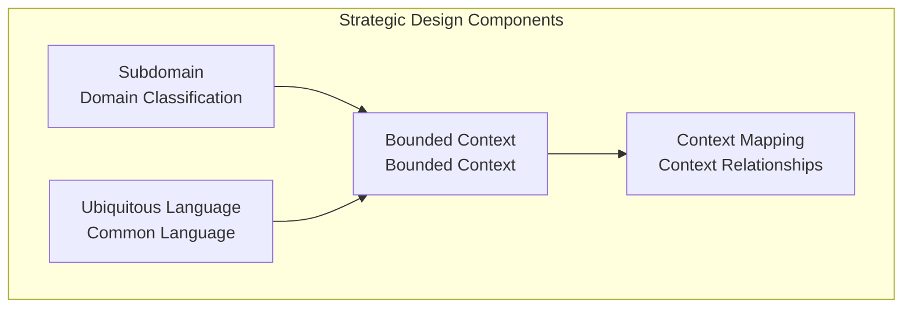

*This diagram shows the four components of strategic design (Subdomain, Ubiquitous Language, Bounded Context, Context Mapping) and their relationships.*

Each component of strategic design answers the following questions. **Subdomain** classifies the domain into Core, Supporting, and Generic by asking "What is core to the business?". **Ubiquitous Language** defines "What language will we communicate in?" and produces a glossary. **Bounded Context** answers "How do we divide the system?" and clarifies context boundaries. Finally, **Context Mapping** determines "How do systems integrate?" and establishes integration strategies.

| Component | Question | Output |
|-----------|----------|--------|
| **Subdomain** | What is core to the business? | Domain classification |
| **Ubiquitous Language** | What language will we communicate in? | Glossary |
| **Bounded Context** | How do we divide the system? | Context boundaries |
| **Context Mapping** | How do systems integrate? | Integration strategy |

This table shows the key questions that must be answered when starting strategic design. Each component is iteratively refined rather than proceeding sequentially.

#### Subdomain

**Concept**

Classifying the business domain by importance and characteristics is what Subdomain is about. Not all business functions have equal value. Some functions are the company's core competency, some merely support the business, and some are generic to any company. Recognizing these differences clearly and deciding investment priorities is the purpose of Subdomain classification.

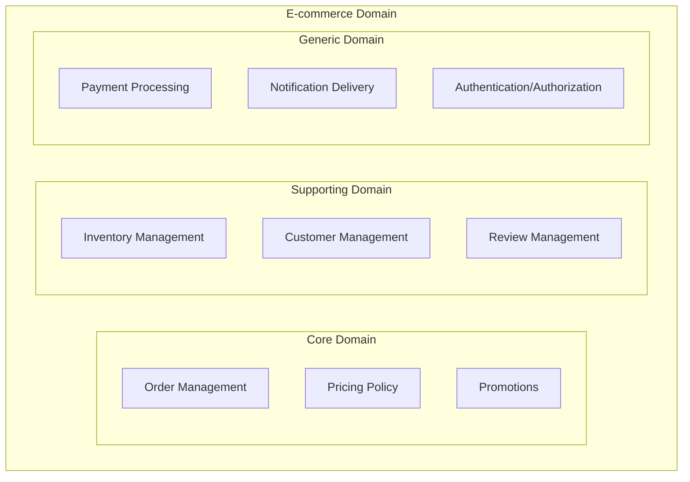

*This diagram classifies the e-commerce domain into Core (orders, pricing, promotions), Supporting (inventory, customers, reviews), and Generic (payments, notifications, authentication).*

**Subdomain Types**

Subdomains are classified into three types. **Core Domain** is the area that creates the business's core competency, requiring top priority investment and the best developers. For example, a delivery app's dispatch algorithm is Core Domain. **Supporting Domain** supports the core but is not a differentiating factor, requiring adequate investment. Inventory management and customer management fall here. **Generic Domain** is common to all businesses, and using external solutions is efficient. Payment, authentication, and email sending belong here.

| Type | Characteristics | Investment | Example |
|------|----------------|------------|---------|
| **Core Domain** | Core business competency | Top priority, best developers | Delivery app's dispatch algorithm |
| **Supporting Domain** | Supports core but not differentiating | Adequate investment | Inventory management, customer management |
| **Generic Domain** | Common to all businesses | Use external solutions | Payment, authentication, email |

Investment strategy and development approach should differ according to each type. Invest the best talent and time in Core Domain, and use proven external solutions to quickly build Generic Domain.

**Real-World Example: Coupang**

Let's look at Coupang's domain analysis as a real company case. What is Coupang's core competency? It's Rocket Delivery logistics, dynamic pricing, and personalized recommendations. These are classified as Core Domain, built in-house with the best talent. Product catalog, inventory management, seller management, and review systems are Supporting Domain, built in-house at a practical level. Payment uses PG companies, notifications use SMS/Push services, and member authentication uses OAuth - Generic Domain integrates external services.

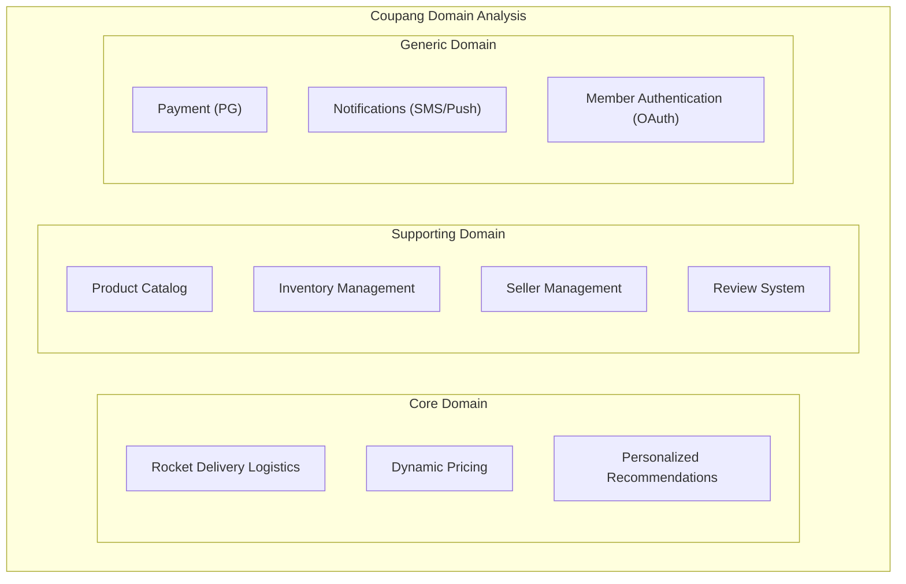

*This diagram classifies Coupang's domain into Core (Rocket Delivery, dynamic pricing, personalized recommendations), Supporting (catalog, inventory, sellers, reviews), and Generic (payments, notifications, authentication).*

This classification becomes the basis for investment decisions. Core receives continuous investment for innovation and differentiation, Supporting receives investment necessary for business operations, and Generic receives only minimal integration costs.

**Subdomain Identification Guide**

When it's hard to determine which Subdomain a function belongs to, check the following questions in order. First ask "Can the business exist without this?". If not, it's Core Domain. If yes, move to the next question. If "Does it differentiate from competitors?" is yes, it's Core Domain; if no, move to the last question. If "Can a solution be purchased in the market?" is yes, it's Generic Domain; if no, it's Supporting Domain.

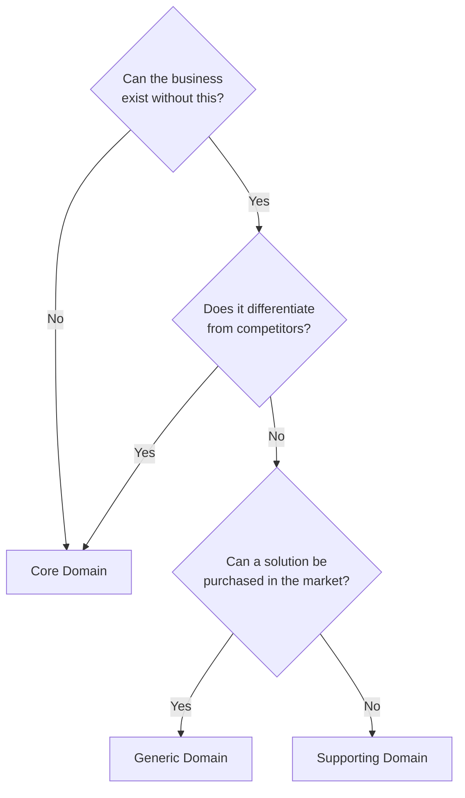

*This diagram shows a decision flowchart for determining Subdomain type based on business necessity, competitive differentiation, and market solution availability.*

#### Ubiquitous Language

**Why is it needed?**

Serious misunderstandings occur when developers and business experts use different terminology. What if the business team calls it "Gift Purchase", but developers implement `gift_flag = true`, QA calls it "Gift option check", and documentation says `giftYn` field? Requirements get misunderstood, bugs occur, and communication costs increase exponentially. Ubiquitous Language is DDD's core practice to solve these problems by ensuring all stakeholders use the same terminology.

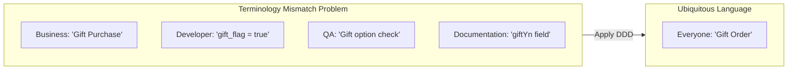

*This diagram shows how terminology mismatch problems (left) are solved by applying Ubiquitous Language (right) so all stakeholders use the same terms.*

**How to Write a Glossary**

To systematically manage Ubiquitous Language, you need to write a glossary. Terms are broadly classified into three types. First is nouns, representing Entities and Value Objects. Order, Order Line, Shipping Address, Money fall here, with each definition, code representation, and synonyms clearly recorded.

**1. Nouns (Entity, Value Object)**

| Term | Definition | Code | Synonyms/Confusion |
|------|------------|------|-------------------|
| Order | A request created by a customer to purchase products | `Order` | Purchase, order |
| Order Line | Individual product and quantity within an order | `OrderLine` | Order item, detail |
| Shipping Address | Address where products will be delivered | `ShippingAddress` | Delivery address, destination |
| Money | Currency unit including currency and amount | `Money` | Price, cost |

Second is verbs, representing actions and Commands. Define business actions like Create Order, Confirm Order, Cancel Order, specifying preconditions and results for each. For example, "Confirm Order" is only possible when in PENDING status, and after execution becomes CONFIRMED status with inventory deducted.

**2. Verbs (Actions, Commands)**

| Term | Definition | Code | Preconditions | Result |
|------|------------|------|---------------|--------|
| Create Order | Creates a new order | `Order.create()` | Valid products, customer | Order created |
| Confirm Order | Changes order to processing status | `order.confirm()` | PENDING status | CONFIRMED status, inventory deducted |
| Cancel Order | Changes order to cancelled status | `order.cancel()` | PENDING/CONFIRMED | CANCELLED status, inventory restored |

Third is events, representing facts that occurred in the past. Express in past tense like "Order Created", "Order Confirmed", "Order Cancelled", defining follow-up processing for each event. When "Order Confirmed" event occurs, payment request and packing start are triggered.

**3. Events (Past occurrences)**

| Term | Definition | Code | Follow-up Actions |
|------|------------|------|-------------------|
| Order Created | The fact that a new order was created | `OrderCreatedEvent` | Reserve inventory, send notification |
| Order Confirmed | The fact that an order was confirmed | `OrderConfirmedEvent` | Request payment, start packing |
| Order Cancelled | The fact that an order was cancelled | `OrderCancelledEvent` | Restore inventory, refund |

**Reflecting in Code**

Ubiquitous Language shouldn't exist only in documentation. It must be directly reflected in code. Let's first see a wrong example. An `OrdSvc` class has an `updOrdSts` method that finds `OrdEntity` from `ordRepo` and changes status with `setSts`. This code is full of technical terms and abbreviations, making it impossible to understand the business meaning.

The correct example uses business terminology directly. `OrderService`'s `confirmOrder` method finds `Order` from `OrderRepository` and calls `order.confirm()`. The method name "Confirm the order" clearly expresses the business intent. Similarly, the `cancelOrder` method intuitively conveys "Cancel the order".

```java
// ❌ Technical terms, abbreviations used
public class OrdSvc {
    public void updOrdSts(Long ordId, int sts) {
        OrdEntity ord = ordRepo.findById(ordId);
        ord.setSts(sts);
        ordRepo.save(ord);
    }
}

// ✅ Business terminology used
public class OrderService {
    public void confirmOrder(OrderId orderId) {
        Order order = orderRepository.findById(orderId);
        order.confirm();  // "Confirm the order"
        orderRepository.save(order);
    }

    public void cancelOrder(OrderId orderId, CancellationReason reason) {
        Order order = orderRepository.findById(orderId);
        order.cancel(reason);  // "Cancel the order"
        orderRepository.save(order);
    }
}
```

**Same Language in Tests**

Ubiquitous Language should also be applied equally to test code. Test names, given-when-then comments, and assertion messages all use business terminology. The example below tests the "Order Confirmation" feature. `@DisplayName` specifies "Confirming a pending order changes status to CONFIRMED", clearly expressing the business rule. Comments are also written in natural language like "When there is a pending order", "When the order is confirmed", "Status becomes CONFIRMED".

```java
@Nested
@DisplayName("Order Confirmation")
class OrderConfirmation {

    @Test
    @DisplayName("Confirming a pending order changes status to CONFIRMED")
    void pendingOrderConfirmationSuccess() {
        // given: When there is a pending order
        Order pendingOrder = createPendingOrder();

        // when: When the order is confirmed
        pendingOrder.confirm();

        // then: Status becomes CONFIRMED
        assertThat(pendingOrder.getStatus()).isEqualTo(OrderStatus.CONFIRMED);
    }

    @Test
    @DisplayName("An already confirmed order cannot be confirmed again")
    void alreadyConfirmedOrderCannotBeReconfirmed() {
        // given: An already confirmed order
        Order confirmedOrder = createConfirmedOrder();

        // when & then: Exception thrown when confirming again
        assertThatThrownBy(() -> confirmedOrder.confirm())
            .isInstanceOf(OrderCannotBeConfirmedException.class)
            .hasMessageContaining("already confirmed");
    }
}
```

When tests are written with Ubiquitous Language like this, the tests themselves serve as living documentation. New team members can understand business rules just by reading test code.

#### Bounded Context

**Concept**

A Bounded Context is an explicit boundary where a specific domain model applies. Even the same term "Customer" has different meanings from sales perspective as "Buyer", from shipping perspective as "Recipient", and from billing perspective as "Payer". Bounded Context acknowledges these differences and draws boundaries to maintain consistent meaning within each Context. Taking an e-commerce system as example, Sales Context, Inventory Context, Shipping Context, and Billing Context each have independent models and terminology, loosely coupled through events.

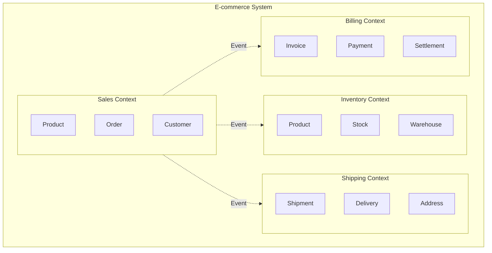

*This diagram shows the e-commerce system where Sales, Inventory, Shipping, and Billing Contexts each have independent models and are integrated through events.*

**Same Term, Different Meaning (Homonyms)**

Let's look specifically at how the term "Customer" has different meanings in each Context. Sales Context's Customer answers "Who is ordering?". It has membership grade (VIP, Gold, Silver) and available points, with a `getDiscount` method to calculate discounts. Shipping Context's Customer is named Recipient and answers "Who is receiving?". It has phone number, address, and delivery preference (door, security desk), with a `canReceiveAt` method to check if they can receive at a specific time slot. Billing Context's Customer is named Payer and answers "Who is paying?". It has tax ID, billing address, and payment methods, with a `requiresTaxInvoice` method to determine whether to issue a tax invoice.

```java
// Customer in Sales Context
// "Who is ordering?"
public class Customer {
    private CustomerId id;
    private String name;
    private Email email;
    private MembershipGrade grade;  // VIP, Gold, Silver
    private Money availablePoints;

    public Money getDiscount(Order order) {
        return grade.calculateDiscount(order.getTotalAmount());
    }
}

// Customer in Shipping Context (Recipient)
// "Who is receiving?"
public class Recipient {
    private String name;
    private PhoneNumber phone;
    private Address address;
    private DeliveryPreference preference;  // Door, Security desk

    public boolean canReceiveAt(TimeSlot slot) {
        return preference.isAvailable(slot);
    }
}

// Customer in Billing Context (Payer)
// "Who is paying?"
public class Payer {
    private String name;
    private TaxId taxId;
    private BillingAddress billingAddress;
    private List<PaymentMethod> paymentMethods;

    public boolean requiresTaxInvoice() {
        return taxId != null;
    }
}
```

It's natural for the same term to have different attributes and behaviors per Context. Trying to forcefully unify into a single Customer class causes requirements from all Contexts to mix, exploding complexity.

**How to Identify Bounded Contexts**

There are three clues for identifying Context boundaries. First is linguistic clues. When you hear "The customer..." and naturally ask "Which customer?", the Contexts are different. Is it the buyer, recipient, or payer? Similarly "The product..." - sales product, inventory item, or shipping item? "The order..." - sales order, shipping instruction, or delivery request? If these questions arise naturally, it's a signal to separate into distinct Bounded Contexts.

**1. Linguistic Clues**

```
"The customer..." -> Which customer? Buyer? Recipient? Payer?
"The product..." -> Which product? Sales product? Inventory item? Shipping item?
"The order..." -> Which order? Sales order? Shipping instruction? Delivery request?
```

Second is organizational clues. According to Conway's Law, "System structure follows organizational structure". If there's a sales team, logistics team, and billing team, naturally Sales Context, Logistics Context, and Billing Context are created. Different teams means different responsibilities and concerns, which can become Context boundaries.

**2. Organizational Clues**

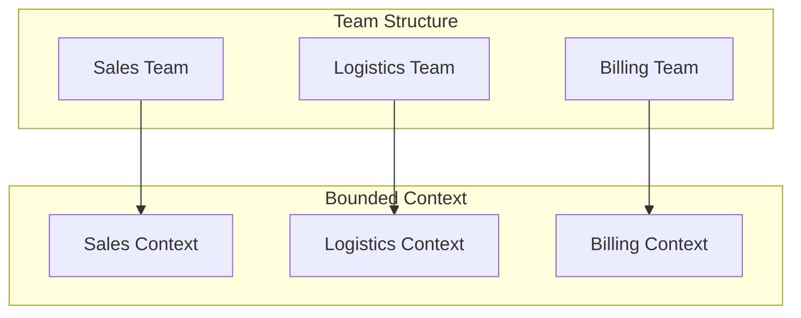

*This diagram shows how team structure (Sales, Logistics, Billing teams) maps to Bounded Contexts (Sales, Logistics, Billing) following Conway's Law.*

Third is business process clues. Breaking down the order process into stages yields Order Receipt, Payment Processing, Shipping Instruction, Delivery, Settlement. Each stage has different responsibilities, naturally mapping to Sales, Payment, Inventory, Shipping, Billing Contexts.

**3. Business Process Clues**

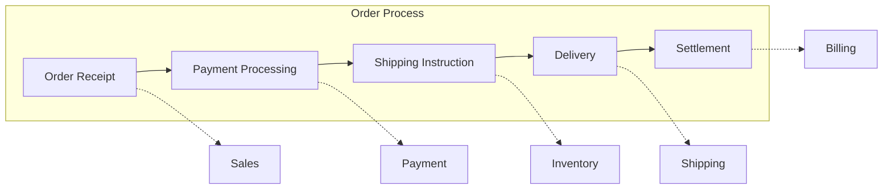

*This diagram shows how each stage of the order process (receipt, payment, shipping, delivery, settlement) naturally maps to separate Contexts.*

**Context Boundary Decision Checklist**

When deciding Context boundaries, use the following checklist. Cases to group in the same Context are when strong transactional consistency is required, same team is responsible, same language (terminology) is used, or must be deployed together. Conversely, cases to separate into different Contexts are when the same term is used with different meanings, different teams are responsible, can be changed/deployed independently, or eventual consistency is sufficient.

```
✅ Should be grouped in the same Context:
- [ ] Strong transactional consistency is required
- [ ] Same team is responsible
- [ ] Same language (terminology) is used
- [ ] Must be deployed together

❌ Should be separated into different Contexts:
- [ ] Same term is used with different meanings
- [ ] Different teams are responsible
- [ ] Can be changed/deployed independently
- [ ] Eventual consistency is sufficient
```

#### Context Mapping

**Concept**

Context Mapping defines relationships and integration methods between Contexts. Each Context is independent but cannot create business value if completely isolated. Order service needs product information, and inventory service needs order information. Explicitly defining who is the provider (Upstream) and who is the consumer (Downstream) in these relationships, and what pattern to use for integration, is Context Mapping.

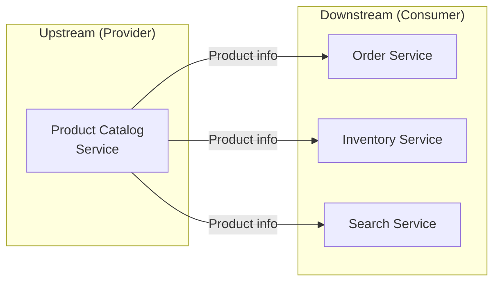

*This diagram shows the upstream Product Catalog Service providing product information to multiple downstream consumers (Order, Inventory, Search).*

**Integration Patterns in Detail**

There are several patterns for integrating between Contexts, each with different characteristics and suitable situations. Choosing the right pattern for the situation is important.

**1. Partnership**

A pattern where two teams work closely together on integration. Suitable when handling different services within the same product team or when there are strong dependencies. Both teams coordinate on API changes, have regular integration meetings, and perform joint testing. A good example is when the order team and payment team develop orders and payments simultaneously with close collaboration.

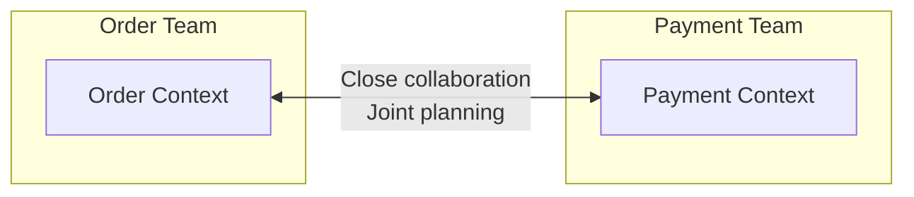

*This diagram shows the Order team and Payment team collaborating closely through the Partnership pattern with joint planning.*

**2. Shared Kernel**

A pattern where two Contexts share some models. Suitable for truly identical concepts like Money or Address that are stable with rare changes. The advantage is eliminating duplication and consistency, but the disadvantage is increased coupling since changes affect both sides. As in the example below, creating a separate `shared-kernel` module to share Money and Address allows both Order Context and Payment Context to use the same amount calculation logic.

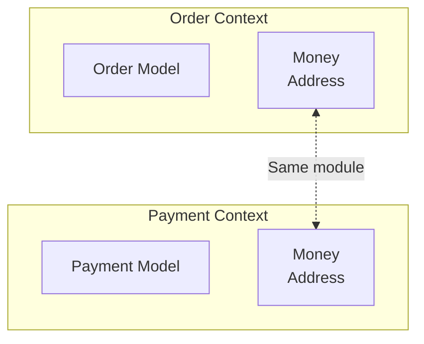

*This diagram shows Order Context and Payment Context sharing stable models like Money and Address through a Shared Kernel.*

```java
// shared-kernel module
public record Money(BigDecimal amount, Currency currency) {
    public Money add(Money other) {
        validateSameCurrency(other);
        return new Money(this.amount.add(other.amount), this.currency);
    }
}

public record Address(String zipCode, String city, String street, String detail) {
    public String fullAddress() {
        return String.format("(%s) %s %s %s", zipCode, city, street, detail);
    }
}
```

**3. Customer-Supplier**

The most common pattern where Upstream provides API and Downstream consumes it. Upstream has API design authority, and Downstream implements to match the API. Upstream provides API and notifies Downstream of changes, while Downstream consumes API and communicates requirements. In the example below, Order Service (Downstream) calls Product Service (Upstream)'s API via Feign Client to query product information and converts it to its own domain model (OrderLine).

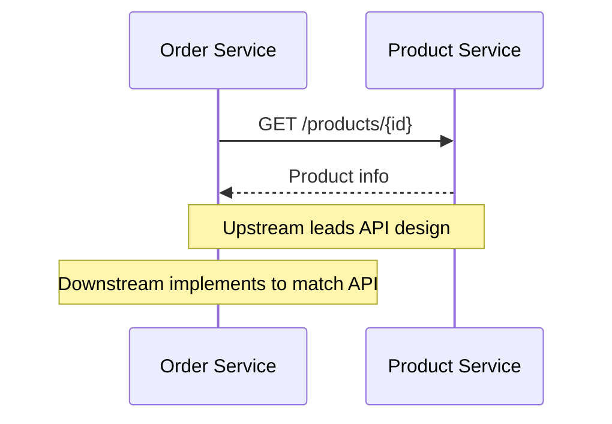

*This diagram shows the Customer-Supplier pattern where Order Service calls Product Service's API to retrieve product information.*

```java
// Downstream: Product Service Client
@FeignClient(name = "product-service")
public interface ProductServiceClient {

    @GetMapping("/products/{id}")
    ProductResponse getProduct(@PathVariable String id);

    @GetMapping("/products")
    List<ProductResponse> getProducts(@RequestParam List<String> ids);
}

// Usage in Downstream
@Service
public class OrderService {
    private final ProductServiceClient productClient;

    public Order createOrder(CreateOrderCommand command) {
        // Query product info from Upstream
        ProductResponse product = productClient.getProduct(command.getProductId());

        // Convert to Downstream model for use
        OrderLine orderLine = OrderLine.create(
            ProductId.of(product.id()),
            product.name(),
            Money.of(product.price()),
            command.getQuantity()
        );

        return Order.create(command.getCustomerId(), List.of(orderLine));
    }
}
```

**4. Conformist**

A pattern where Downstream follows the Upstream model as-is. Suitable when integrating with unchangeable Upstream like external or legacy systems, or when there's no negotiating power, or for simple integrations. Uses Upstream model without transformation so implementation is simple, but has the disadvantage of being dependent on Upstream changes.

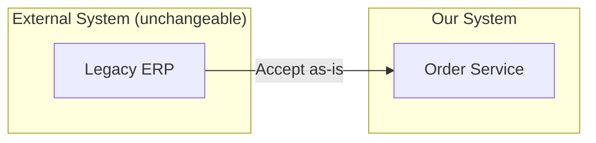

*This diagram shows the Conformist pattern where the model from an unchangeable external Legacy ERP system is accepted as-is.*

**5. Anti-Corruption Layer (ACL)**

A pattern that places a translation layer to prevent external models from corrupting internal ones. Essential when integrating with legacy systems or complex, inconsistent external APIs. Anti-Corruption Layer consists of Translator (data conversion), Adapter (interface adaptation), and Facade (simplification). In the example below, the legacy system uses abbreviations and magic numbers like `ord_no`, `sts_cd`, `cust_nm`, but ACL converts these to clean domain models (Order, OrderStatus, ShippingAddress). The advantage is protecting internal model and isolation from legacy changes, but disadvantages are additional complexity and performance overhead.

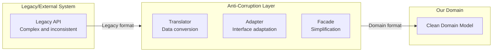

*This diagram shows the Anti-Corruption Layer (Translator, Adapter, Facade) placed between legacy systems and the domain to protect the internal model.*

```java
// Legacy system response (unchangeable)
public class LegacyOrderResponse {
    private String ord_no;           // Different naming
    private int sts_cd;              // Magic numbers (0=pending, 1=confirmed, 9=cancelled)
    private String cust_nm;          // Abbreviations
    private long ord_amt;            // Amount as number
    private String dlv_addr1;        // Address1
    private String dlv_addr2;        // Address2
    private String rcv_nm;           // Recipient
    private String rcv_tel;          // Phone
}

// Anti-Corruption Layer: Translator
@Component
public class LegacyOrderTranslator {

    public Order translate(LegacyOrderResponse legacy) {
        return Order.reconstitute(
            OrderId.of(legacy.getOrd_no()),
            translateStatus(legacy.getSts_cd()),
            translateCustomer(legacy),
            translateShippingAddress(legacy),
            Money.won(legacy.getOrd_amt())
        );
    }

    private OrderStatus translateStatus(int statusCode) {
        return switch (statusCode) {
            case 0 -> OrderStatus.PENDING;
            case 1 -> OrderStatus.CONFIRMED;
            case 2 -> OrderStatus.SHIPPED;
            case 3 -> OrderStatus.DELIVERED;
            case 9 -> OrderStatus.CANCELLED;
            default -> throw new UnknownLegacyStatusException(statusCode);
        };
    }

    private ShippingAddress translateShippingAddress(LegacyOrderResponse legacy) {
        return new ShippingAddress(
            extractZipCode(legacy.getDlv_addr1()),
            extractCity(legacy.getDlv_addr1()),
            legacy.getDlv_addr1(),
            legacy.getDlv_addr2(),
            legacy.getRcv_nm(),
            formatPhoneNumber(legacy.getRcv_tel())
        );
    }
}

// Adapter: Repository implementation
@Repository
public class LegacyOrderAdapter implements OrderReader {
    private final LegacyOrderClient legacyClient;
    private final LegacyOrderTranslator translator;

    @Override
    public Optional<Order> findById(OrderId id) {
        try {
            LegacyOrderResponse response = legacyClient.getOrder(id.getValue());
            return Optional.of(translator.translate(response));
        } catch (LegacyNotFoundException e) {
            return Optional.empty();
        }
    }
}
```

**6. Open Host Service + Published Language**

A pattern for integration through standardized API and data formats. Suitable when a single Upstream (Provider) serves multiple Downstreams (Consumers). Open Host Service means a public REST API, and Published Language means standardized JSON Schema or Protocol Buffer. As in the example below, defining `OrderConfirmedEvent` as JSON Schema allows Order Service, Search Service, Analytics Service, external partners, etc. to all consume events in the same format.

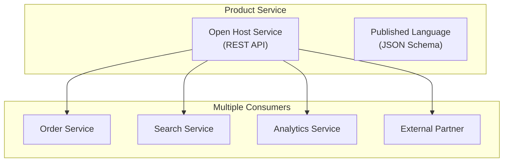

*This diagram shows Product Service providing standardized services to multiple consumers through Open Host Service and Published Language.*

```json
// Published Language: Standardized event schema
{
  "$schema": "https://json-schema.org/draft/2020-12/schema",
  "title": "OrderConfirmedEvent",
  "type": "object",
  "properties": {
    "eventId": { "type": "string", "format": "uuid" },
    "eventType": { "const": "ORDER_CONFIRMED" },
    "occurredAt": { "type": "string", "format": "date-time" },
    "payload": {
      "type": "object",
      "properties": {
        "orderId": { "type": "string" },
        "customerId": { "type": "string" },
        "totalAmount": {
          "type": "object",
          "properties": {
            "amount": { "type": "number" },
            "currency": { "type": "string" }
          }
        },
        "orderLines": {
          "type": "array",
          "items": {
            "type": "object",
            "properties": {
              "productId": { "type": "string" },
              "quantity": { "type": "integer" }
            }
          }
        }
      }
    }
  }
}
```

**7. Separate Ways**

A pattern where each implements separately without integration. Suitable when integration cost is greater than duplication cost, for simple functionality, or with different requirements. Sometimes it's better to implement independently than to increase complexity by forcing integration.

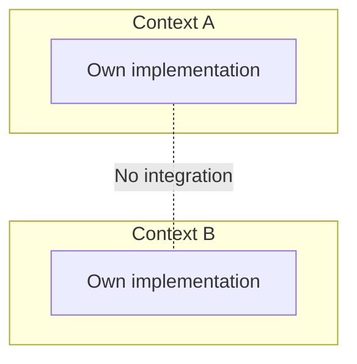

*This diagram shows the Separate Ways pattern where two Contexts do not integrate and implement independently.*

**Context Map Example: E-commerce**

Let's look at a complete Context Map for a real e-commerce system. Core Domain has Orders and Pricing Policy, Supporting Domain has Product Catalog, Inventory, Shipping, and Members, Generic Domain has Payment (external PG), Notifications (external service), and Authentication (OAuth). Order and Catalog are in Customer-Supplier relationship, querying product info when creating orders. Order and Inventory are also Customer-Supplier, requesting inventory check/deduction when confirming orders. Order and Payment use ACL protection for external PG integration. Order with Shipping and Notification integrate loosely via Published Language (events). Price and Order share pricing calculation logic in a Shared Kernel relationship.

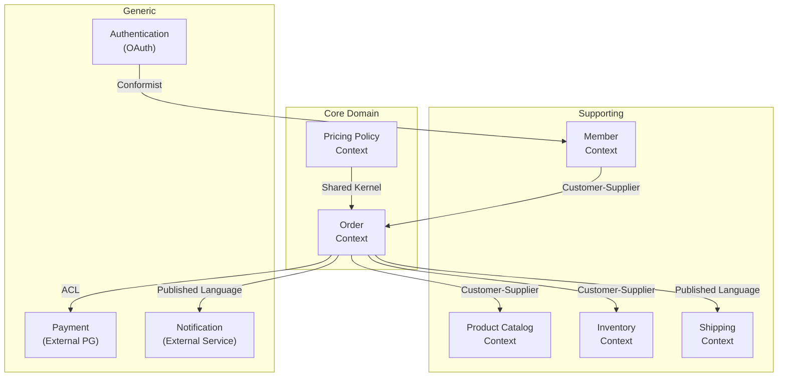

*This diagram shows the complete Context Map of an e-commerce system with integration patterns between Core/Supporting/Generic domains.*

Each relationship has the following meaning. ORDER -> CATALOG is the relationship of querying product info when creating orders. ORDER -> INV is the relationship of checking inventory and requesting deduction when confirming orders. ORDER -> PAY is protected by ACL for external PG integration. ORDER -> SHIP, NOTI are event-based loose integration. PRICE <-> ORDER is a Shared Kernel relationship sharing pricing calculation logic.

| Relationship | Description |
|--------------|-------------|
| **ORDER -> CATALOG** | Query product info when creating order |
| **ORDER -> INV** | Check/deduct inventory when confirming order |
| **ORDER -> PAY** | External PG integration, protected by ACL |
| **ORDER -> SHIP, NOTI** | Loose coupling via events |
| **PRICE <-> ORDER** | Share pricing calculation logic (Shared Kernel) |

#### EventStorming for Strategic Design

**What is EventStorming?**

A workshop technique where domain experts and developers come together to explore the domain. By sticking orange post-its (Domain Events), blue post-its (Commands), yellow post-its (Aggregates), and purple post-its (Policies) on meeting room walls, business processes are visualized. During this process, Bounded Context boundaries naturally emerge.

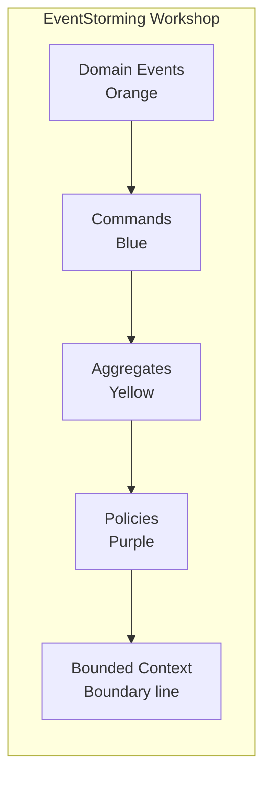

*This diagram shows the key EventStorming components (Actor, Command, Aggregate, Domain Event, Policy) connected in sequence.*

**EventStorming Results**

After EventStorming, boundaries like Order Context and Inventory Context become clear. Within Order Context, "Create Order Requested" Command goes through Order Aggregate to generate "Order Created" Event. This event triggers "Check Inventory" Policy, and again "Confirm Order Requested" Command goes through Order Aggregate to generate "Order Confirmed" Event. This Event crosses over to Inventory Context, triggering "Deduct Inventory Requested" Command, and Stock Aggregate generates "Inventory Deducted" Event.

```
┌─────────────────────────────────────────────────────────────────┐
│                          Order Context                          │
│  ┌──────────┐    ┌──────────┐    ┌──────────┐    ┌──────────┐  │
│  │ Create   │ => │ Order    │ => │ Confirm  │ => │ Order    │  │
│  │ Order    │    │          │    │ Order    │    │          │  │
│  │ Requested│    │(Aggregate│    │ Requested│    │(Aggregate│  │
│  │ (Command)│    │          │    │(Command) │    │          │  │
│  └──────────┘    └──────────┘    └──────────┘    └──────────┘  │
│        │              │               │               │         │
│        ▼              ▼               ▼               ▼         │
│  ┌──────────┐    ┌──────────┐    ┌──────────┐    ┌──────────┐  │
│  │ Order    │    │ Check    │    │ Order    │    │ Request  │  │
│  │ Created  │    │ Inventory│    │ Confirmed│    │ Payment  │  │
│  │ (Event)  │    │ (Policy) │    │ (Event)  │    │ (Policy) │  │
│  └──────────┘    └──────────┘    └──────────┘    └──────────┘  │
└─────────────────────────────────────────────────────────────────┘
                              │
                              ▼
┌─────────────────────────────────────────────────────────────────┐
│                        Inventory Context                        │
│  ┌──────────┐    ┌──────────┐    ┌──────────┐                  │
│  │ Deduct   │ => │ Stock    │ => │ Inventory│                  │
│  │ Inventory│    │          │    │ Deducted │                  │
│  │ Requested│    │(Aggregate│    │ (Event)  │                  │
│  │ (Command)│    │          │    │          │                  │
│  └──────────┘    └──────────┘    └──────────┘                  │
└─────────────────────────────────────────────────────────────────┘
```

Such results become a design blueprint that can be directly converted to code.

#### Next Steps

- [Tactical Design](tactical-design/) - Entity, Value Object, Aggregate patterns
- [Architecture](architecture/) - Hexagonal, Clean Architecture
