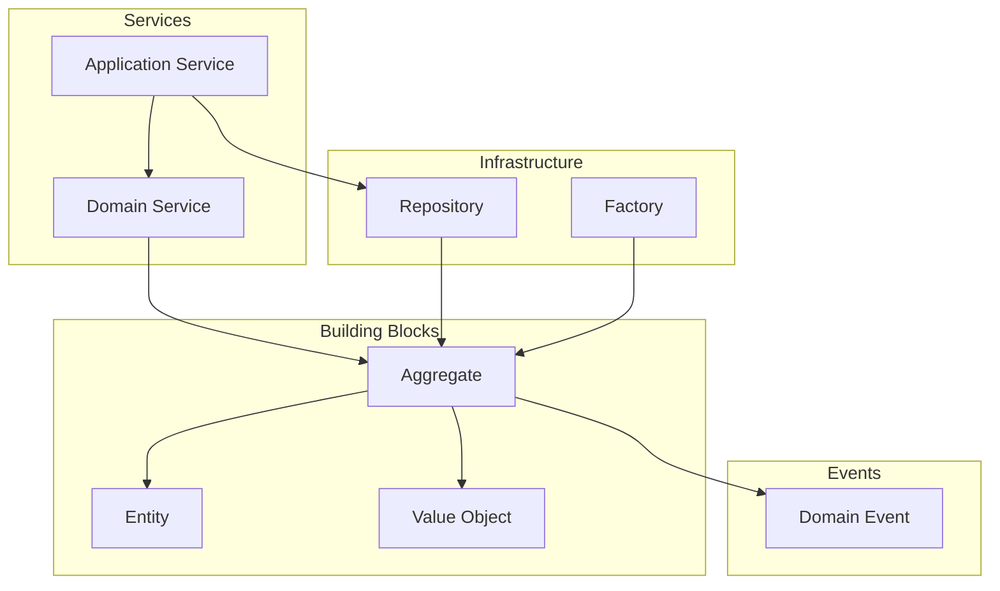
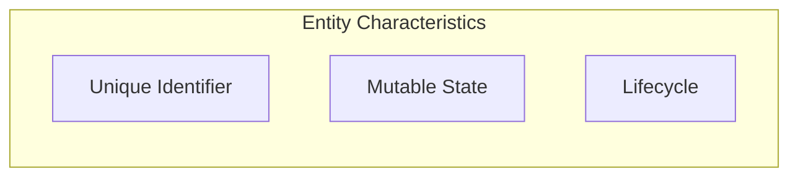
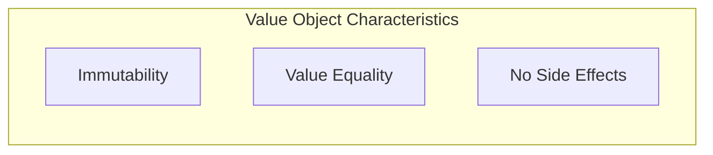
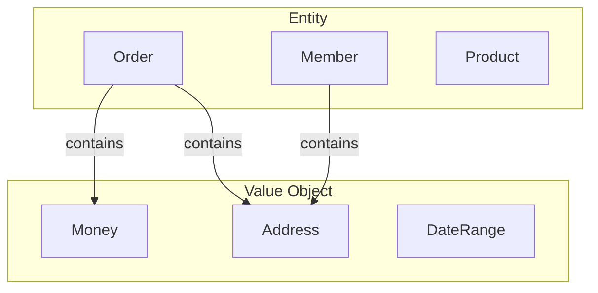
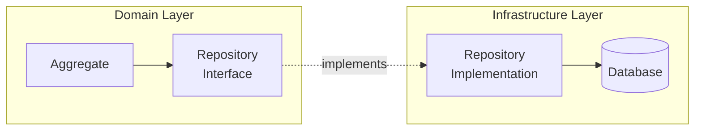
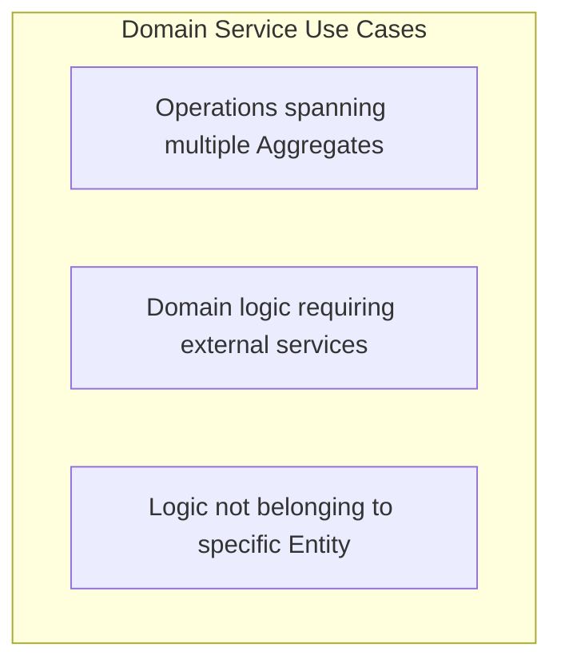
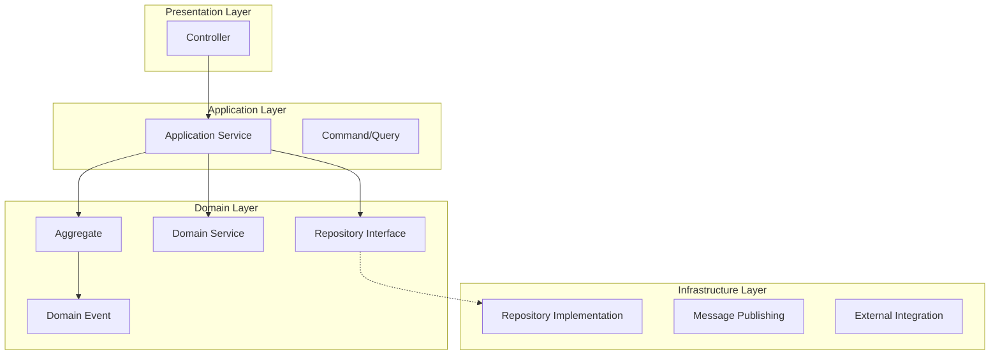
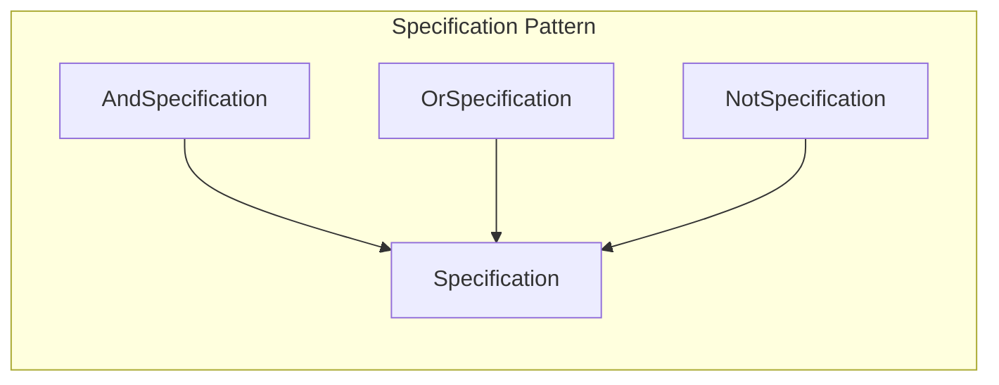
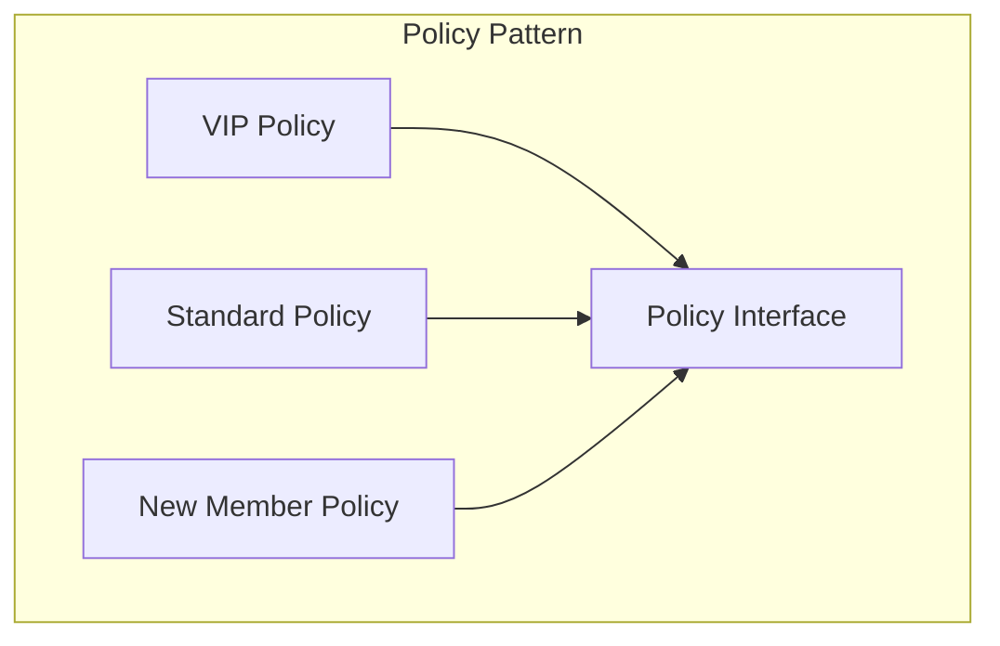
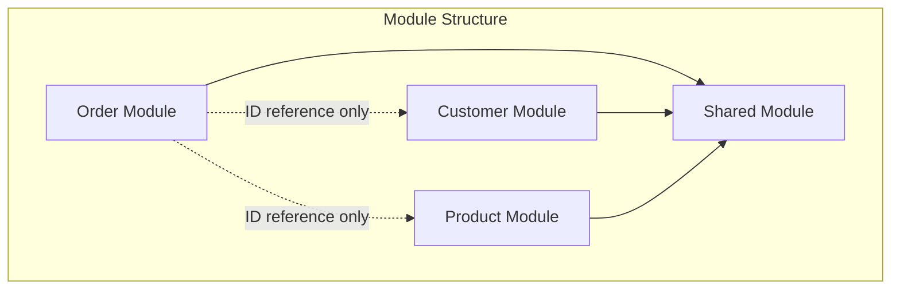

> **Target Audience**: Backend developers who want to implement DDD building blocks in code
> **Prerequisites**: Read [Strategic Design](strategic-design/) or understand Bounded Context concept
> **Time Required**: About 40 minutes
> **Key Question**: "What patterns should be used to implement domain models?"


Tactical Design Building Blocks: **Entity**(distinguished by identity) + **Value Object**(distinguished by value) → **Aggregate**(consistency boundary) + **Repository**(persistence) + **Domain Service**(domain logic) + **Domain Event**(event communication)


Tactical design consists of patterns for concretely implementing domain models. If strategic design draws the "big picture," tactical design provides "specific implementation methods."

> **Common imports for examples on this page:**
> ```java
> import java.util.*;
> import java.time.LocalDateTime;
> import java.math.BigDecimal;
> ```

#### Tactical Design Elements Overview

Tactical design consists of several building blocks. Entity and Value Object are the basic units of domain objects, and Aggregate groups them into consistency boundaries. Domain Service and Application Service orchestrate business logic, while Repository and Factory manage object lifecycles. Domain Event handles communication between Aggregates. These components work together to clearly express complex domain logic.



#### Entity

**Definition**

Entity is a domain object distinguished by its identity. Like order numbers or member IDs, it has a unique identifier, and even if attributes change, objects with the same identifier are treated as the same object. The core of Entity consists of three characteristics: Identity, Mutability, and Lifecycle.



Let's look at Entity characteristics in detail. **Identity** is the characteristic of being distinguished by a unique identifier. Order numbers and member IDs are typical examples. **Mutability** means the state can change. For example, order status changes from PENDING to CONFIRMED. **Lifecycle** means it has a lifecycle of creation, modification, and deletion. The process of member signup, activity, and withdrawal falls under this.

| Characteristic | Description | Example |
|----------------|-------------|---------|
| **Identity** | Distinguished by unique identifier | Order number, Member ID |
| **Mutability** | State can change | Order status: PENDING → CONFIRMED |
| **Lifecycle** | Has creation, modification, deletion lifecycle | Member signup → activity → withdrawal |

**Implementation Example**

Here's an implementation example of the Order Entity. The `id` field is immutable (final), so once set it cannot be changed. On the other hand, `status` and `shippingAddress` are mutable and can change according to business rules. The `equals` and `hashCode` methods compare equality by ID only. Orders with the same ID are treated as the same object even if other attributes differ. Business behaviors like `confirm` and `changeShippingAddress` are expressed as methods. Rather than simply calling setters, they perform validation and domain event publishing together.

```java
public class Order {
    private final OrderId id;  // Identity - immutable
    private OrderStatus status;  // State - mutable
    private final CustomerId customerId;
    private ShippingAddress shippingAddress;  // Can be changed
    private final List<OrderLine> orderLines;
    private final LocalDateTime createdAt;

    // Identity-based equality
    @Override
    public boolean equals(Object o) {
        if (this == o) return true;
        if (!(o instanceof Order order)) return false;
        return id.equals(order.id);  // Compare by ID only
    }

    @Override
    public int hashCode() {
        return Objects.hash(id);
    }

    // Business behavior
    public void confirm() {
        validateConfirmable();
        this.status = OrderStatus.CONFIRMED;
        registerEvent(new OrderConfirmedEvent(this.id));
    }

    public void changeShippingAddress(ShippingAddress newAddress) {
        validateAddressChangeable();
        this.shippingAddress = newAddress;
        registerEvent(new ShippingAddressChangedEvent(this.id, newAddress));
    }

    private void validateConfirmable() {
        if (this.status != OrderStatus.PENDING) {
            throw new IllegalOrderStateException(
                "Order can only be confirmed when PENDING. Current: " + this.status
            );
        }
    }
}
```

**Identifier Design**

It's better to use domain identifier types rather than simple String or Long for Entity identifiers. The `OrderId` in the example below is implemented as a Java Record to guarantee immutability. Null checks and empty value validation are performed in the constructor to prevent creation of invalid IDs. The `generate` static method creates a new ID, and the `of` static method restores an ID from an existing value.

```java
// ✅ Domain Identifier (recommended)
public record OrderId(String value) {
    public OrderId {
        Objects.requireNonNull(value, "OrderId cannot be null");
        if (value.isBlank()) {
            throw new IllegalArgumentException("OrderId cannot be empty");
        }
    }

    public static OrderId generate() {
        return new OrderId("ORD-" + UUID.randomUUID().toString().substring(0, 8));
    }

    public static OrderId of(String value) {
        return new OrderId(value);
    }
}

// Usage
Order order = new Order(OrderId.generate(), customerId, orderLines);
```

#### Value Object

**Definition**

Value Object is an immutable object whose equality is determined by attribute values. While Entity is distinguished by identifier, Value Object is distinguished by the value itself. 1000 won and another 1000 won of Money are separate objects but are treated as equal because they have the same value.



Value Object characteristics are summarized as follows. **Immutability** means it cannot be changed after creation. After creating Money(1000, KRW), you cannot change the amount or currency. **Value Equality** means objects with the same attributes are treated as the same object. 1000 won equals 1000 won. **Self-Contained** means it validates itself. Negative amounts are rejected at creation time.

| Characteristic | Description | Example |
|----------------|-------------|---------|
| **Immutability** | Cannot change after creation | Money(1000, KRW) |
| **Value Equality** | Same object if all attributes are equal | $1000 == $1000 |
| **Self-Contained** | Self-validates | Amount cannot be negative |

**Implementation Example**

Let's look at the Money Value Object implementation. Using Java Record automatically guarantees immutability. Validation is performed in the Compact Constructor. An exception is thrown if the amount is null or negative. Factory methods like `won` allow convenient object creation. Operations like `add` and `multiply` return new objects without modifying the original. This is the key to immutable operations.

```java
// Money Value Object
public record Money(BigDecimal amount, Currency currency) {

    // Validation on creation
    public Money {
        Objects.requireNonNull(amount, "Amount is required");
        Objects.requireNonNull(currency, "Currency is required");
        if (amount.compareTo(BigDecimal.ZERO) < 0) {
            throw new IllegalArgumentException("Amount must be 0 or greater");
        }
    }

    // Factory method
    public static Money won(long amount) {
        return new Money(BigDecimal.valueOf(amount), Currency.KRW);
    }

    public static Money ZERO = new Money(BigDecimal.ZERO, Currency.KRW);

    // Immutable operations - return new object
    public Money add(Money other) {
        validateSameCurrency(other);
        return new Money(this.amount.add(other.amount), this.currency);
    }

    public Money multiply(int quantity) {
        return new Money(this.amount.multiply(BigDecimal.valueOf(quantity)), this.currency);
    }

    public boolean isGreaterThan(Money other) {
        validateSameCurrency(other);
        return this.amount.compareTo(other.amount) > 0;
    }

    private void validateSameCurrency(Money other) {
        if (!this.currency.equals(other.currency)) {
            throw new CurrencyMismatchException(this.currency, other.currency);
        }
    }
}
```

The Address Value Object follows a similar pattern. Required fields are validated in the Compact Constructor, and zip code format is also validated. The `fullAddress` method returns the address in a readable format.

```java
// Address Value Object
public record Address(
    String zipCode,
    String city,
    String street,
    String detail
) {
    public Address {
        Objects.requireNonNull(zipCode, "Zip code is required");
        Objects.requireNonNull(city, "City is required");
        Objects.requireNonNull(street, "Street is required");

        if (!zipCode.matches("\\d{5}")) {
            throw new InvalidAddressException("Zip code must be 5 digits");
        }
    }

    public String fullAddress() {
        return String.format("(%s) %s %s %s", zipCode, city, street, detail);
    }
}
```

**Entity vs Value Object**

How do we distinguish between Entity and Value Object? Order, Member, and Product are Entities. Each has a unique identifier and an independent lifecycle. On the other hand, Money, Address, and DateRange are Value Objects. The value itself has meaning and is used as part of an Entity.



The differences between the two concepts are summarized as follows. Entity is compared by ID, is mutable, and has an independent lifecycle. Order and Member fall under this. Value Object is compared by all attributes, is immutable, and is dependent on Entity. Money and Address fall under this.

| Aspect | Entity | Value Object |
|--------|--------|--------------|
| **Equality** | Compare by ID | Compare by all attributes |
| **Mutability** | Mutable | Immutable |
| **Lifecycle** | Independent | Dependent on Entity |
| **Example** | Order, Member | Money, Address |

**Things That Should Be Value Objects**

Primitive Obsession is an anti-pattern to avoid. Don't use String or int directly; wrap them in Value Objects. Expressing `orderId` as `OrderId`, `totalAmount` as `Money`, and `customerEmail` as `Email` increases type safety and clarifies business meaning.

```java
// ❌ Primitive Obsession
public class Order {
    private String orderId;        // Just String
    private int totalAmount;       // Just int
    private String customerEmail;  // Just String
}

// ✅ Using Value Objects
public class Order {
    private OrderId id;            // Domain identifier
    private Money totalAmount;     // Money VO
    private Email customerEmail;   // Email VO
}
```

#### Repository

**Definition**

Repository is an interface that abstracts persistence for Aggregates. It hides technical details of the database and allows storing and retrieving domain objects as if handling a collection. The Repository interface is located in the domain layer, and the implementation is located in the infrastructure layer.



**Interface Design**

The Repository interface is located in the domain layer and written in domain language. `save` stores an Aggregate, and `findById` retrieves by ID. Domain-specific query methods like `findByCustomerId` or `findPendingOrdersOlderThan` are also included. `delete` handles deletion, and soft delete is recommended in practice over hard delete. `existsById` only checks existence.

```java
// Located in Domain Layer
public interface OrderRepository {

    // Save
    Order save(Order order);

    // Find
    Optional<Order> findById(OrderId id);

    // Domain-specific queries
    List<Order> findByCustomerId(CustomerId customerId);

    List<Order> findPendingOrdersOlderThan(LocalDateTime dateTime);

    // Delete (soft delete recommended)
    void delete(Order order);

    // Existence check
    boolean existsById(OrderId id);
}
```

**Implementation**

The Repository implementation is located in the infrastructure layer and uses technologies like JPA or MyBatis. It handles conversion between domain objects and persistence models (Entity). `save` converts a domain object to Entity and saves it, and `findById` retrieves an Entity and converts it to a domain object. Domain-specific queries like `findPendingOrdersOlderThan` are also implemented.

```java
// Located in Infrastructure Layer
@Repository
public class JpaOrderRepository implements OrderRepository {

    private final OrderJpaRepository jpaRepository;
    private final OrderMapper mapper;

    @Override
    public Order save(Order order) {
        OrderEntity entity = mapper.toEntity(order);
        OrderEntity saved = jpaRepository.save(entity);
        return mapper.toDomain(saved);
    }

    @Override
    public Optional<Order> findById(OrderId id) {
        return jpaRepository.findById(id.getValue())
            .map(mapper::toDomain);
    }

    @Override
    public List<Order> findPendingOrdersOlderThan(LocalDateTime dateTime) {
        return jpaRepository.findByStatusAndCreatedAtBefore(
                OrderStatus.PENDING, dateTime)
            .stream()
            .map(mapper::toDomain)
            .toList();
    }
}
```

**Repository Design Principles**

There are principles to follow when designing Repositories. First, only Aggregate Roots have Repositories. Order has a Repository, but OrderLine does not. OrderLine is accessed only through Order.

```java
// ✅ Only Aggregate Root (Order) has Repository
interface OrderRepository {
    Order save(Order order);
}

// ❌ Internal Aggregate objects don't have Repository
// interface OrderLineRepository { ... }  // Wrong design
```

Second, Repositories should behave like collections. `save` is used naturally like adding to a list, and `findById` is used like finding in a list.

```java
// Like adding to a collection
orderRepository.save(order);

// Like finding in a collection
Order order = orderRepository.findById(orderId)
    .orElseThrow(() -> new OrderNotFoundException(orderId));
```

#### Domain Service

**When to Use?**

Domain Service contains domain logic that doesn't belong to a specific Entity or Value Object. Use it when the operation spans multiple Aggregates, when external services are needed for domain logic, or when the logic doesn't belong to a specific Entity.



**Example 1: Discount Calculation**

Use Domain Service when the discount policy needs to consider multiple factors. `DiscountCalculator` calculates the final discount considering both member grade and promotions. Since Order alone cannot determine this, and both MemberGrade and Promotion information are needed, it's separated into a Domain Service.

```java
// When discount policy considers multiple factors
@DomainService
public class DiscountCalculator {

    private final MemberGradeReader memberGradeReader;
    private final PromotionReader promotionReader;

    public Money calculateDiscount(Order order, CustomerId customerId) {
        MemberGrade grade = memberGradeReader.getGrade(customerId);
        List<Promotion> promotions = promotionReader.getActivePromotions();

        Money gradeDiscount = calculateGradeDiscount(order, grade);
        Money promotionDiscount = calculatePromotionDiscount(order, promotions);

        return gradeDiscount.add(promotionDiscount);
    }

    private Money calculateGradeDiscount(Order order, MemberGrade grade) {
        return order.getTotalAmount().multiply(grade.getDiscountRate());
    }

    private Money calculatePromotionDiscount(Order order, List<Promotion> promotions) {
        return promotions.stream()
            .filter(p -> p.isApplicableTo(order))
            .map(p -> p.calculateDiscount(order))
            .reduce(Money.ZERO, Money::add);
    }
}
```

**Example 2: Stock Validation**

Stock validation is also implemented as a Domain Service. `StockValidator` validates whether there is sufficient stock for all items in the order. Since Order only knows its item information and Stock only knows stock information, the logic connecting these two naturally belongs in a Domain Service.

```java
@DomainService
public class StockValidator {

    private final StockReader stockReader;

    public void validateStock(Order order) {
        for (OrderLine line : order.getOrderLines()) {
            Stock stock = stockReader.getStock(line.getProductId());

            if (!stock.isAvailable(line.getQuantity())) {
                throw new InsufficientStockException(
                    line.getProductId(),
                    line.getQuantity(),
                    stock.getAvailableQuantity()
                );
            }
        }
    }
}
```

**Domain Service vs Application Service**

Domain Service and Application Service have different roles. Domain Service contains pure domain logic. It doesn't know about transactions or infrastructure. It only depends on domain objects. On the other hand, Application Service orchestrates use cases. It manages transactions and connects domain with infrastructure. In the example below, `OrderValidator` is a Domain Service containing only validation logic, and `OrderApplicationService` is an Application Service orchestrating the entire flow.

```java
// Domain Service: Domain logic
@DomainService
public class OrderValidator {
    public void validate(Order order) {
        // Pure domain rule validation
    }
}

// Application Service: Use case orchestration
@Service
@Transactional
public class OrderApplicationService {

    private final OrderRepository orderRepository;
    private final OrderValidator orderValidator;  // Uses Domain Service
    private final EventPublisher eventPublisher;

    public OrderId createOrder(CreateOrderCommand command) {
        // 1. Create domain object
        Order order = Order.create(command.getCustomerId(), command.getOrderLines());

        // 2. Validate with Domain Service
        orderValidator.validate(order);

        // 3. Save
        Order saved = orderRepository.save(order);

        // 4. Publish events
        eventPublisher.publish(saved.getDomainEvents());

        return saved.getId();
    }
}
```

The differences between the two services are summarized as follows. Domain Service is located in the domain layer, contains domain logic, doesn't know about transactions, and only depends on domain objects. Application Service is located in the application layer, orchestrates use cases, manages transactions, and depends on both domain and infrastructure.

| Aspect | Domain Service | Application Service |
|--------|---------------|---------------------|
| **Location** | Domain Layer | Application Layer |
| **Role** | Domain logic | Use case orchestration |
| **Transaction** | Unaware | Manages |
| **Dependencies** | Domain objects only | Domain + Infrastructure |

#### Factory

**When to Use?**

Factory encapsulates creation logic when Aggregate creation is complex. For simple cases, a static factory method is sufficient, but for complex cases, a separate Factory class is created. `Order.create` is a static factory method for simple creation. `OrderFactory` is a Factory class containing complex logic like customer validation, product lookup, and order line creation.

```java
// Simple case: static factory method
public class Order {
    public static Order create(CustomerId customerId, List<OrderLine> lines) {
        return new Order(OrderId.generate(), customerId, lines);
    }
}

// Complex case: Factory class
@Component
public class OrderFactory {

    private final CustomerReader customerReader;
    private final ProductReader productReader;

    public Order create(CreateOrderCommand command) {
        // Validate customer
        Customer customer = customerReader.getCustomer(command.getCustomerId());
        customer.validateCanOrder();

        // Create order lines
        List<OrderLine> orderLines = command.getItems().stream()
            .map(this::createOrderLine)
            .toList();

        // Create order
        return Order.create(
            customer.getId(),
            orderLines,
            customer.getDefaultShippingAddress()
        );
    }

    private OrderLine createOrderLine(OrderItemRequest request) {
        Product product = productReader.getProduct(request.getProductId());
        return OrderLine.create(
            product.getId(),
            product.getName(),
            product.getPrice(),
            request.getQuantity()
        );
    }
}
```

#### Layer Structure

Let's look at the layer structure of tactical design. The Controller in the presentation layer calls the Application Service in the application layer. The Application Service uses Aggregates, Domain Services, and Repository Interfaces in the domain layer. Repository Interfaces connect to Repository implementations in the infrastructure layer. Aggregates publish Domain Events to communicate with other Aggregates.



#### Specification Pattern

**Definition**

Specification is a pattern that encapsulates business rules as objects for reusability. Complex conditions like "Can this order be confirmed?" or "Can this customer receive a VIP discount?" can be made into Specification objects and combined.



**Basic Implementation**

The Specification interface checks conditions with the `isSatisfiedBy` method. Specifications can be combined with `and`, `or`, `not` methods. `AndSpecification` requires both conditions to be satisfied, `OrSpecification` requires only one to be satisfied, and `NotSpecification` reverses the condition.

```java
// Specification interface
public interface Specification<T> {
    boolean isSatisfiedBy(T candidate);

    default Specification<T> and(Specification<T> other) {
        return new AndSpecification<>(this, other);
    }

    default Specification<T> or(Specification<T> other) {
        return new OrSpecification<>(this, other);
    }

    default Specification<T> not() {
        return new NotSpecification<>(this);
    }
}

// Composite Specifications
public class AndSpecification<T> implements Specification<T> {
    private final Specification<T> first;
    private final Specification<T> second;

    public AndSpecification(Specification<T> first, Specification<T> second) {
        this.first = first;
        this.second = second;
    }

    @Override
    public boolean isSatisfiedBy(T candidate) {
        return first.isSatisfiedBy(candidate) && second.isSatisfiedBy(candidate);
    }
}

public class OrSpecification<T> implements Specification<T> {
    private final Specification<T> first;
    private final Specification<T> second;

    public OrSpecification(Specification<T> first, Specification<T> second) {
        this.first = first;
        this.second = second;
    }

    @Override
    public boolean isSatisfiedBy(T candidate) {
        return first.isSatisfiedBy(candidate) || second.isSatisfiedBy(candidate);
    }
}

public class NotSpecification<T> implements Specification<T> {
    private final Specification<T> spec;

    public NotSpecification(Specification<T> spec) {
        this.spec = spec;
    }

    @Override
    public boolean isSatisfiedBy(T candidate) {
        return !spec.isSatisfiedBy(candidate);
    }
}
```

**Order Domain Example**

Let's see how Specifications are used in the order domain. `hasMinimumAmount` checks the minimum amount condition, and `hasStatus` checks a specific status condition. `isConfirmable` combines "PENDING status and above minimum amount" as a compound condition with and. `isCancellable` combines "PENDING or CONFIRMED status" with or. The `confirm` and `cancel` methods in the Order class use these Specifications to check conditions.

```java
// Concrete Order Specifications
public class OrderSpecifications {

    // Minimum amount validation
    public static Specification<Order> hasMinimumAmount(Money minimum) {
        return order -> order.getTotalAmount().isGreaterThanOrEqual(minimum);
    }

    // Status validation
    public static Specification<Order> hasStatus(OrderStatus status) {
        return order -> order.getStatus() == status;
    }

    // Can be confirmed
    public static Specification<Order> isConfirmable() {
        return hasStatus(OrderStatus.PENDING)
            .and(hasMinimumAmount(Money.won(10000)));
    }

    // Can be cancelled
    public static Specification<Order> isCancellable() {
        return hasStatus(OrderStatus.PENDING)
            .or(hasStatus(OrderStatus.CONFIRMED));
    }

    // Can be shipped
    public static Specification<Order> isShippable() {
        return hasStatus(OrderStatus.CONFIRMED)
            .and(order -> order.hasValidShippingAddress())
            .and(order -> !order.getOrderLines().isEmpty());
    }
}

// Usage
public class Order {

    public void confirm() {
        if (!OrderSpecifications.isConfirmable().isSatisfiedBy(this)) {
            throw new OrderCannotBeConfirmedException(this.id);
        }
        this.status = OrderStatus.CONFIRMED;
        registerEvent(new OrderConfirmedEvent(this.id));
    }

    public void cancel(CancellationReason reason) {
        if (!OrderSpecifications.isCancellable().isSatisfiedBy(this)) {
            throw new OrderCannotBeCancelledException(this.id, this.status);
        }
        this.status = OrderStatus.CANCELLED;
        this.cancellationReason = reason;
        registerEvent(new OrderCancelledEvent(this.id, reason));
    }
}
```

**Using with Repository**

Specifications can also be used for Repository queries. Using Spring Data JPA's Specification allows writing dynamic queries in a type-safe manner. Combining Specifications like `hasStatus`, `hasMinimumAmount`, `createdBetween`, and `belongsToCustomer` creates complex query conditions.

```java
// JPA Specification (Spring Data JPA)
public class OrderJpaSpecifications {

    public static org.springframework.data.jpa.domain.Specification<OrderEntity>
            hasStatus(OrderStatus status) {
        return (root, query, cb) ->
            cb.equal(root.get("status"), status);
    }

    public static org.springframework.data.jpa.domain.Specification<OrderEntity>
            hasMinimumAmount(Money minimum) {
        return (root, query, cb) ->
            cb.greaterThanOrEqualTo(root.get("totalAmount"), minimum.amount());
    }

    public static org.springframework.data.jpa.domain.Specification<OrderEntity>
            createdBetween(LocalDateTime start, LocalDateTime end) {
        return (root, query, cb) ->
            cb.between(root.get("createdAt"), start, end);
    }

    public static org.springframework.data.jpa.domain.Specification<OrderEntity>
            belongsToCustomer(CustomerId customerId) {
        return (root, query, cb) ->
            cb.equal(root.get("customerId"), customerId.getValue());
    }
}

// Use in Repository
@Repository
public class JpaOrderRepository implements OrderRepository {

    private final OrderJpaRepository jpaRepository;

    @Override
    public List<Order> findConfirmableOrders() {
        var spec = OrderJpaSpecifications.hasStatus(OrderStatus.PENDING)
            .and(OrderJpaSpecifications.hasMinimumAmount(Money.won(10000)));

        return jpaRepository.findAll(spec).stream()
            .map(mapper::toDomain)
            .toList();
    }
}
```

The benefits of the Specification pattern are summarized as follows. **Reusability** means business rules can be reused in multiple places. **Readability** means complex conditions are expressed clearly. **Testability** means each rule can be tested independently. **Composability** means complex rules can be built with and, or, not.

| Benefit | Description |
|---------|-------------|
| **Reusability** | Reuse business rules in multiple places |
| **Readability** | Express complex conditions clearly |
| **Testability** | Test each rule independently |
| **Composability** | Build complex rules with and, or, not |

#### Policy Pattern

**Definition**

Policy is a pattern that separates business policies into independent objects making them replaceable. While Specification focuses on "condition checking," Policy focuses on "calculation or decision." Discount policies, shipping fee policies, and point accumulation policies are good examples of the Policy pattern.



**Discount Policy Example**

Let's implement discount policies with the Policy pattern. The `DiscountPolicy` interface defines `calculateDiscount` and `isApplicable` methods. `VipDiscountPolicy` applies a 10% discount to VIP customers. `FirstOrderDiscountPolicy` applies a 5000 won discount to first-order customers. `BulkOrderDiscountPolicy` applies a 5% discount when purchasing 10 or more items. `DiscountCalculator` combines all these policies to calculate the total discount.

```java
// Discount policy interface
public interface DiscountPolicy {
    Money calculateDiscount(Order order, Customer customer);
    boolean isApplicable(Order order, Customer customer);
}

// VIP discount policy
public class VipDiscountPolicy implements DiscountPolicy {
    private static final BigDecimal DISCOUNT_RATE = new BigDecimal("0.10");

    @Override
    public boolean isApplicable(Order order, Customer customer) {
        return customer.getGrade() == CustomerGrade.VIP;
    }

    @Override
    public Money calculateDiscount(Order order, Customer customer) {
        return order.getTotalAmount().multiply(DISCOUNT_RATE);
    }
}

// First order discount policy
public class FirstOrderDiscountPolicy implements DiscountPolicy {
    private static final Money DISCOUNT_AMOUNT = Money.won(5000);

    @Override
    public boolean isApplicable(Order order, Customer customer) {
        return customer.getOrderCount() == 0;
    }

    @Override
    public Money calculateDiscount(Order order, Customer customer) {
        return DISCOUNT_AMOUNT;
    }
}

// Bulk order discount policy
public class BulkOrderDiscountPolicy implements DiscountPolicy {
    private static final int MINIMUM_QUANTITY = 10;
    private static final BigDecimal DISCOUNT_RATE = new BigDecimal("0.05");

    @Override
    public boolean isApplicable(Order order, Customer customer) {
        return order.getTotalQuantity() >= MINIMUM_QUANTITY;
    }

    @Override
    public Money calculateDiscount(Order order, Customer customer) {
        return order.getTotalAmount().multiply(DISCOUNT_RATE);
    }
}

// Policy composition
@DomainService
public class DiscountCalculator {

    private final List<DiscountPolicy> policies;

    public DiscountCalculator(List<DiscountPolicy> policies) {
        this.policies = policies;
    }

    public Money calculateTotalDiscount(Order order, Customer customer) {
        return policies.stream()
            .filter(policy -> policy.isApplicable(order, customer))
            .map(policy -> policy.calculateDiscount(order, customer))
            .reduce(Money.ZERO, Money::add);
    }
}
```

**Shipping Fee Policy Example**

Shipping fee policies follow a similar pattern. `StandardShippingPolicy` is the default shipping fee policy that applies free shipping for purchases of 50,000 won or more. `RemoteAreaShippingPolicy` charges additional shipping fees for remote areas. It receives an existing policy as a delegate to calculate the base shipping fee, then adds additional cost if it's a remote area.

```java
// Shipping fee policy interface
public interface ShippingPolicy {
    Money calculateShippingFee(Order order, ShippingAddress address);
}

// Standard shipping policy
public class StandardShippingPolicy implements ShippingPolicy {
    private static final Money BASE_FEE = Money.won(3000);
    private static final Money FREE_SHIPPING_THRESHOLD = Money.won(50000);

    @Override
    public Money calculateShippingFee(Order order, ShippingAddress address) {
        if (order.getTotalAmount().isGreaterThanOrEqual(FREE_SHIPPING_THRESHOLD)) {
            return Money.ZERO;
        }
        return BASE_FEE;
    }
}

// Remote area shipping policy
public class RemoteAreaShippingPolicy implements ShippingPolicy {
    private static final Money REMOTE_SURCHARGE = Money.won(5000);
    private final ShippingPolicy delegate;
    private final RemoteAreaChecker remoteAreaChecker;

    @Override
    public Money calculateShippingFee(Order order, ShippingAddress address) {
        Money baseFee = delegate.calculateShippingFee(order, address);

        if (remoteAreaChecker.isRemoteArea(address)) {
            return baseFee.add(REMOTE_SURCHARGE);
        }
        return baseFee;
    }
}
```

#### Module Organization

**Package Structure**

As domain complexity increases, organize with modules. The order module, customer module, and product module are each divided into domain, application, and infrastructure layers. The domain package contains Entity, Value Object, Repository Interface, and Domain Event. The application package contains Application Service and DTO. The infrastructure package contains Repository implementation and Event Publisher. The shared module contains common Value Objects like Money and Address.

```
src/main/java/com/example/
├── order/                          # Order Module
│   ├── domain/
│   │   ├── Order.java
│   │   ├── OrderLine.java
│   │   ├── OrderId.java
│   │   ├── OrderStatus.java
│   │   ├── OrderRepository.java   # Repository Interface
│   │   ├── OrderFactory.java
│   │   └── event/
│   │       ├── OrderCreatedEvent.java
│   │       └── OrderConfirmedEvent.java
│   ├── application/
│   │   ├── OrderCommandService.java
│   │   ├── OrderQueryService.java
│   │   └── dto/
│   │       ├── CreateOrderCommand.java
│   │       └── OrderResponse.java
│   └── infrastructure/
│       ├── persistence/
│       │   ├── JpaOrderRepository.java
│       │   ├── OrderEntity.java
│       │   └── OrderMapper.java
│       └── event/
│           └── KafkaOrderEventPublisher.java
│
├── customer/                       # Customer Module
│   ├── domain/
│   │   ├── Customer.java
│   │   ├── CustomerId.java
│   │   └── CustomerRepository.java
│   ├── application/
│   │   └── CustomerService.java
│   └── infrastructure/
│       └── persistence/
│           └── JpaCustomerRepository.java
│
├── product/                        # Product Module
│   ├── domain/
│   ├── application/
│   └── infrastructure/
│
└── shared/                         # Shared Module
    ├── domain/
    │   ├── Money.java
    │   ├── Address.java
    │   └── AggregateRoot.java
    └── infrastructure/
        └── event/
            └── DomainEventPublisher.java
```

**Inter-Module Dependencies**

Inter-module dependencies should be clear. The order module, customer module, and product module all depend on the shared module. The order module does not directly depend on the customer or product module; it only uses ID references.



**Inter-Module Communication**

Inter-module communication uses ID references. You should not directly reference the Customer Aggregate. Only reference CustomerId. Query with CustomerReader in the Application Service when needed. This lowers coupling between modules and allows independent changes.

```java
// ❌ Direct dependency (avoid)
public class Order {
    private Customer customer;  // Direct reference to another module's Aggregate
}

// ✅ Reference by ID
public class Order {
    private CustomerId customerId;  // ID reference only
}

// Query in Application Service when needed
@Service
public class OrderApplicationService {

    private final OrderRepository orderRepository;
    private final CustomerReader customerReader;  // Port/Interface

    public OrderDetailResponse getOrderDetail(OrderId orderId) {
        Order order = orderRepository.findById(orderId).orElseThrow();
        Customer customer = customerReader.findById(order.getCustomerId());

        return OrderDetailResponse.of(order, customer);
    }
}
```

#### Builder Pattern (Complex Creation)

**Aggregate Builder**

Use the Builder pattern for complex Aggregate creation. If you need to set multiple properties when creating an Order, a Builder is useful. An inner Builder class provides a fluent interface, and final validation is performed in the `build` method.

```java
public class Order {
    private final OrderId id;
    private final CustomerId customerId;
    private final List<OrderLine> orderLines;
    private final ShippingAddress shippingAddress;
    private final Money totalAmount;
    private OrderStatus status;

    private Order(Builder builder) {
        this.id = builder.id;
        this.customerId = builder.customerId;
        this.orderLines = List.copyOf(builder.orderLines);
        this.shippingAddress = builder.shippingAddress;
        this.totalAmount = calculateTotalAmount(builder.orderLines);
        this.status = OrderStatus.PENDING;

        validate();
    }

    private void validate() {
        if (orderLines.isEmpty()) {
            throw new EmptyOrderException("Order requires at least 1 item");
        }
    }

    public static Builder builder() {
        return new Builder();
    }

    public static class Builder {
        private OrderId id;
        private CustomerId customerId;
        private List<OrderLine> orderLines = new ArrayList<>();
        private ShippingAddress shippingAddress;

        public Builder id(OrderId id) {
            this.id = id;
            return this;
        }

        public Builder customerId(CustomerId customerId) {
            this.customerId = customerId;
            return this;
        }

        public Builder addOrderLine(ProductId productId, String productName,
                                    Money price, int quantity) {
            this.orderLines.add(OrderLine.create(productId, productName, price, quantity));
            return this;
        }

        public Builder shippingAddress(ShippingAddress address) {
            this.shippingAddress = address;
            return this;
        }

        public Order build() {
            if (id == null) {
                id = OrderId.generate();
            }
            return new Order(this);
        }
    }
}

// Usage
Order order = Order.builder()
    .customerId(CustomerId.of("CUST-001"))
    .addOrderLine(productId1, "Laptop", Money.won(1200000), 1)
    .addOrderLine(productId2, "Mouse", Money.won(50000), 2)
    .shippingAddress(new ShippingAddress("12345", "Seoul", "Gangnam-gu", "Unit 101"))
    .build();
```

#### Null Object Pattern

**Definition**

This pattern uses a special 'null' object to avoid null checks. Define a Null Object called NONE in the DiscountPolicy interface. Instead of returning null when there's no discount, return `DiscountPolicy.NONE`. This allows calling `calculateDiscount` without null checks.

```java
// Null Object pattern applied
public interface DiscountPolicy {
    Money calculateDiscount(Order order);

    // Null Object
    DiscountPolicy NONE = order -> Money.ZERO;
}

// Usage
public class Order {
    private final DiscountPolicy discountPolicy;

    public Order(CustomerId customerId, DiscountPolicy discountPolicy) {
        this.customerId = customerId;
        // Use NONE instead of null
        this.discountPolicy = discountPolicy != null ? discountPolicy : DiscountPolicy.NONE;
    }

    public Money calculateFinalAmount() {
        // No null check needed
        Money discount = discountPolicy.calculateDiscount(this);
        return totalAmount.subtract(discount);
    }
}
```

**Comparison with Optional**

Optional is another approach, but Null Object is often more natural in domain logic. Optional requires handling by the caller, but Null Object works transparently.

```java
// Using Optional
public Optional<Discount> getDiscount() {
    return Optional.ofNullable(discount);
}

// Using Null Object (recommended in domain logic)
public Discount getDiscount() {
    return discount != null ? discount : Discount.NONE;
}
```

#### Tactical Design Checklist

**Entity Checklist**

Check the following items when designing Entities. Verify that it has a unique identifier, compares equality by identifier, expresses business behaviors as methods, cannot enter an invalid state, and uses behavior methods instead of setters.

```
[ ] Has unique identifier?
[ ] Compares equality by identifier?
[ ] Business behaviors expressed as methods?
[ ] Cannot enter invalid state?
[ ] Uses behavior methods instead of setters?
```

**Value Object Checklist**

When designing Value Objects, check if it's immutable, compares equality by all attributes, self-validates, has no side effects (returns new object), and expresses a meaningful domain concept.

```
[ ] Is immutable?
[ ] Compares equality by all attributes?
[ ] Self-validates?
[ ] Has no side effects? (returns new object)
[ ] Expresses meaningful domain concept?
```

**Repository Checklist**

When designing Repositories, check if only Aggregate Roots have Repositories, the interface is in the Domain Layer, it acts like a collection, and has domain-specific methods.

```
[ ] Only Aggregate Roots have Repositories?
[ ] Interface is in Domain Layer?
[ ] Acts like a collection?
[ ] Has domain-specific methods?
```

**Domain Service Checklist**

When designing Domain Services, check if the logic doesn't belong to a specific Entity, spans multiple Aggregates, is stateless, and depends only on the Domain Layer.

```
[ ] Logic doesn't belong to specific Entity?
[ ] Spans multiple Aggregates?
[ ] Is stateless?
[ ] Depends only on Domain Layer?
```

#### Next Steps

- [Aggregate Deep Dive](aggregate/) - Aggregate design principles and transaction boundaries
- [Domain Events](./) - Event-driven design
