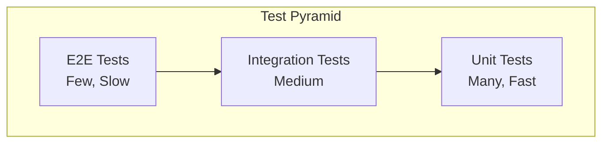
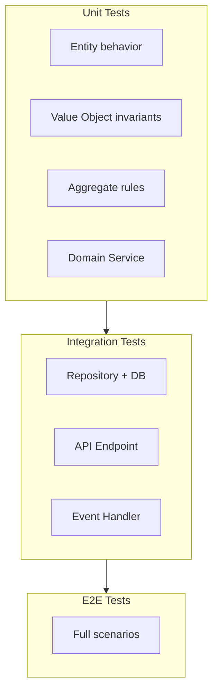

> **Target Audience**: Developers establishing testing strategies for DDD-based projects
> **Prerequisites**: [Tactical Design](tactical-design/) building blocks, basic JUnit/Mockito usage
> **Time Required**: About 25 minutes
> **Key Question**: "How should tests be organized in DDD architecture?"


Testing Strategy Core: **Unit Tests**(domain model focused, most numerous) → **Integration Tests**(Repository, external integrations) → **E2E Tests**(critical scenarios only)


Systems applying Domain-Driven Design require a different testing strategy than typical CRUD applications. Since business logic is concentrated in domain models, tests should also be designed around the domain layer. This document explores testing strategies suitable for DDD architecture and specific implementation methods.

#### Test Pyramid

The core of an effective testing strategy is following the test pyramid principle. The test pyramid is a strategy of writing the most unit tests, a medium amount of integration tests, and the fewest E2E tests. This is a balanced approach considering cost and execution speed.



Looking at each test type, unit tests target domain models and services with fast speed and low cost. Integration tests verify Repository and external system integrations with medium speed and cost. E2E tests target the entire system and are the slowest and most expensive.

| Test Type | Scope | Speed | Cost |
|-----------|-------|-------|------|
| **Unit Tests** | Domain models, services | Fast | Low |
| **Integration Tests** | Repository, external integrations | Medium | Medium |
| **E2E Tests** | Entire system | Slow | High |

Unit tests execute quickly without external dependencies, providing immediate feedback during development. E2E tests verify the entire system but have long execution times and high maintenance costs, so applying them only to critical scenarios is advisable.

#### Domain Model Unit Tests

The most important tests in DDD are unit tests of domain models. Since the core of business logic is in domain models, thoroughly verifying them is key to ensuring quality.

**Why Important?**

Domain models are the core of business logic. They should be testable quickly without dependencies like databases or external APIs. If domain models are implemented as pure Java objects, tests can be written very simply and quickly. This is particularly useful when developing with TDD (Test-Driven Development).

**Entity Tests**

The core of Entity tests is verifying business rules and state transitions. The following example shows how to systematically test the creation, confirmation, and cancellation behaviors of the Order Entity. Using JUnit 5's `@Nested` annotation to group related tests greatly improves readability.

```java
class OrderTest {

    @Nested
    @DisplayName("Order Creation")
    class CreateOrder {

        @Test
        @DisplayName("Can create order with valid data")
        void createWithValidData() {
            // given
            var customerId = CustomerId.of("CUST-001");
            var address = createValidAddress();
            var orderLines = List.of(
                new OrderLineRequest(ProductId.of("PROD-001"), "Product1", Money.won(10000), 2)
            );

            // when
            Order order = Order.create(customerId, address, orderLines);

            // then
            assertThat(order.getId()).isNotNull();
            assertThat(order.getStatus()).isEqualTo(OrderStatus.PENDING);
            assertThat(order.getTotalAmount()).isEqualTo(Money.won(20000));
            assertThat(order.getOrderLines()).hasSize(1);
        }

        @Test
        @DisplayName("Creating without order lines throws exception")
        void failWithEmptyOrderLines() {
            // given
            var customerId = CustomerId.of("CUST-001");
            var address = createValidAddress();

            // when & then
            assertThatThrownBy(() -> Order.create(customerId, address, List.of()))
                .isInstanceOf(IllegalArgumentException.class)
                .hasMessageContaining("at least 1");
        }

        @Test
        @DisplayName("Exceeding max amount throws exception")
        void failWithExceedingMaxAmount() {
            // given
            var orderLines = List.of(
                new OrderLineRequest(ProductId.of("PROD-001"), "Expensive", Money.won(100_000_001), 1)
            );

            // when & then
            assertThatThrownBy(() -> Order.create(customerId, address, orderLines))
                .isInstanceOf(IllegalArgumentException.class)
                .hasMessageContaining("max amount");
        }
    }

    @Nested
    @DisplayName("Order Confirmation")
    class ConfirmOrder {

        @Test
        @DisplayName("Can confirm PENDING order")
        void confirmPendingOrder() {
            // given
            Order order = createPendingOrder();

            // when
            order.confirm();

            // then
            assertThat(order.getStatus()).isEqualTo(OrderStatus.CONFIRMED);
            assertThat(order.getConfirmedAt()).isNotNull();
        }

        @Test
        @DisplayName("OrderConfirmedEvent is published when confirmed")
        void publishEventWhenConfirmed() {
            // given
            Order order = createPendingOrder();

            // when
            order.confirm();

            // then
            assertThat(order.getDomainEvents())
                .hasSize(1)
                .first()
                .isInstanceOf(OrderConfirmedEvent.class);
        }

        @Test
        @DisplayName("Already confirmed order cannot be confirmed again")
        void cannotConfirmAlreadyConfirmed() {
            // given
            Order order = createPendingOrder();
            order.confirm();
            order.clearDomainEvents();

            // when & then
            assertThatThrownBy(order::confirm)
                .isInstanceOf(IllegalOrderStateException.class)
                .hasMessageContaining("PENDING");
        }

        @Test
        @DisplayName("Cancelled order cannot be confirmed")
        void cannotConfirmCancelledOrder() {
            // given
            Order order = createPendingOrder();
            order.cancel("Test");

            // when & then
            assertThatThrownBy(order::confirm)
                .isInstanceOf(IllegalOrderStateException.class);
        }
    }

    @Nested
    @DisplayName("Order Cancellation")
    class CancelOrder {

        @ParameterizedTest
        @EnumSource(value = OrderStatus.class, names = {"PENDING", "CONFIRMED"})
        @DisplayName("Can cancel in PENDING or CONFIRMED state")
        void canCancelPendingOrConfirmed(OrderStatus status) {
            // given
            Order order = createOrderWithStatus(status);

            // when
            order.cancel("Changed mind");

            // then
            assertThat(order.getStatus()).isEqualTo(OrderStatus.CANCELLED);
            assertThat(order.getCancellationReason()).isEqualTo("Changed mind");
        }

        @ParameterizedTest
        @EnumSource(value = OrderStatus.class, names = {"SHIPPED", "DELIVERED"})
        @DisplayName("Cannot cancel after SHIPPED")
        void cannotCancelAfterShipped(OrderStatus status) {
            // given
            Order order = createOrderWithStatus(status);

            // when & then
            assertThatThrownBy(() -> order.cancel("Test"))
                .isInstanceOf(IllegalOrderStateException.class);
        }
    }
}
```

The above test code verifies the entire order lifecycle. Order creation confirms validation (item existence, max amount limit), and order confirmation verifies state transitions and domain event publishing. Using `@ParameterizedTest` allows writing tests for multiple states concisely.

**Value Object Tests**

Value Objects have immutability and value-based equality, so these characteristics should be verified through tests. Value Objects like Money and ShippingAddress encapsulate business rules, so validation logic is also tested together.

```java
class MoneyTest {

    @Test
    @DisplayName("Same amount and currency are equal")
    void equalityByValue() {
        // given
        Money money1 = Money.won(10000);
        Money money2 = Money.won(10000);

        // then
        assertThat(money1).isEqualTo(money2);
        assertThat(money1.hashCode()).isEqualTo(money2.hashCode());
    }

    @Test
    @DisplayName("Can add money")
    void addMoney() {
        // given
        Money money1 = Money.won(10000);
        Money money2 = Money.won(5000);

        // when
        Money result = money1.add(money2);

        // then
        assertThat(result).isEqualTo(Money.won(15000));
        // Original is unchanged (immutability)
        assertThat(money1).isEqualTo(Money.won(10000));
    }

    @Test
    @DisplayName("Cannot operate with different currencies")
    void cannotAddDifferentCurrency() {
        // given
        Money won = Money.won(10000);
        Money usd = new Money(BigDecimal.valueOf(10), Currency.getInstance("USD"));

        // when & then
        assertThatThrownBy(() -> won.add(usd))
            .isInstanceOf(IllegalArgumentException.class)
            .hasMessageContaining("different currencies");
    }

    @Test
    @DisplayName("Cannot create negative amount")
    void cannotCreateNegativeAmount() {
        assertThatThrownBy(() -> Money.won(-1000))
            .isInstanceOf(IllegalArgumentException.class);
    }
}

class ShippingAddressTest {

    @Test
    @DisplayName("Can create valid address")
    void createValidAddress() {
        // when
        ShippingAddress address = new ShippingAddress(
            "12345", "Seoul", "Gangnam-daero 123", "Unit 101",
            "John Doe", "010-1234-5678"
        );

        // then
        assertThat(address.fullAddress())
            .isEqualTo("(12345) Seoul Gangnam-daero 123 Unit 101");
    }

    @Test
    @DisplayName("Invalid zip code throws exception")
    void invalidZipCode() {
        assertThatThrownBy(() -> new ShippingAddress(
            "1234", "Seoul", "Gangnam-daero 123", "Unit 101",  // 4-digit zip
            "John Doe", "010-1234-5678"
        ))
            .isInstanceOf(IllegalArgumentException.class)
            .hasMessageContaining("zip code");
    }
}
```

The Money tests verify value-based equality, immutability, and currency matching rules. Confirming that the original object is unchanged in the `add()` method test is very important for ensuring immutability. The ShippingAddress test verifies that format validation rules work correctly.

**Aggregate Invariant Tests**

One of the core responsibilities of Aggregates is protecting invariants. Invariants are business rules that must always be true regardless of the Aggregate's state. The following example verifies order amount consistency and minimum item count rules.

```java
class OrderInvariantTest {

    @Test
    @DisplayName("Total amount always equals sum of order lines")
    void totalAmountEqualsOrderLinesSum() {
        // given
        Order order = Order.create(
            customerId, address,
            List.of(
                new OrderLineRequest(productId1, "Product1", Money.won(10000), 2),  // 20000
                new OrderLineRequest(productId2, "Product2", Money.won(5000), 3)    // 15000
            )
        );

        // then
        Money expectedTotal = Money.won(35000);
        assertThat(order.getTotalAmount()).isEqualTo(expectedTotal);

        // Consistency maintained after removing order line
        order.removeOrderLine(order.getOrderLines().get(0).getId());
        assertThat(order.getTotalAmount()).isEqualTo(Money.won(15000));
    }

    @Test
    @DisplayName("Order must always have at least 1 line item")
    void minimumOneOrderLine() {
        // given
        Order order = Order.create(
            customerId, address,
            List.of(new OrderLineRequest(productId, "Product", Money.won(10000), 1))
        );

        // when & then: Attempt to remove last item
        assertThatThrownBy(() ->
            order.removeOrderLine(order.getOrderLines().get(0).getId())
        )
            .isInstanceOf(IllegalArgumentException.class)
            .hasMessageContaining("at least 1");
    }
}
```

Invariant tests confirm that business rules are maintained even after Aggregates change state. When order lines are added or removed, the total must be automatically recalculated, and an exception must be thrown if the minimum item count rule is violated. These tests are key safeguards ensuring domain model consistency.

#### Application Service Tests

Application Services manage transaction boundaries and orchestrate domain models. Since domain logic is in Entities, Application Service tests use Mocks to verify collaborator behavior.

```java
@ExtendWith(MockitoExtension.class)
class OrderServiceTest {

    @Mock
    private OrderRepository orderRepository;

    @Mock
    private ApplicationEventPublisher eventPublisher;

    @InjectMocks
    private OrderService orderService;

    @Test
    @DisplayName("Confirming order saves and publishes event")
    void confirmOrder() {
        // given
        OrderId orderId = OrderId.of("ORD-001");
        Order order = spy(createPendingOrder(orderId));

        when(orderRepository.findById(orderId)).thenReturn(Optional.of(order));

        // when
        orderService.confirmOrder(new ConfirmOrderCommand(orderId));

        // then
        verify(order).confirm();
        verify(orderRepository).save(order);
        verify(eventPublisher).publishEvent(any(OrderConfirmedEvent.class));
    }

    @Test
    @DisplayName("Confirming non-existent order throws exception")
    void confirmNotFoundOrder() {
        // given
        OrderId orderId = OrderId.of("NOT-EXIST");
        when(orderRepository.findById(orderId)).thenReturn(Optional.empty());

        // when & then
        assertThatThrownBy(() ->
            orderService.confirmOrder(new ConfirmOrderCommand(orderId))
        )
            .isInstanceOf(OrderNotFoundException.class);

        verify(orderRepository, never()).save(any());
    }
}
```

The core of Application Service tests is verifying that collaborators are called in the correct order. In the order confirmation scenario, we verify the flow of retrieving the order from the Repository, calling the domain method, saving the changed order, and publishing an event. Using Mocks allows fast testing without a database.

#### Repository Integration Tests

Repositories are infrastructure layer components that persist domain models. They should be tested with an actual database to confirm that mapping and queries work correctly. Using Testcontainers allows testing with the same database as production.

```java
@DataJpaTest
@AutoConfigureTestDatabase(replace = AutoConfigureTestDatabase.Replace.NONE)
@Testcontainers
class JpaOrderRepositoryTest {

    @Container
    static PostgreSQLContainer<?> postgres = new PostgreSQLContainer<>("postgres:15");

    @DynamicPropertySource
    static void configureProperties(DynamicPropertyRegistry registry) {
        registry.add("spring.datasource.url", postgres::getJdbcUrl);
        registry.add("spring.datasource.username", postgres::getUsername);
        registry.add("spring.datasource.password", postgres::getPassword);
    }

    @Autowired
    private JpaOrderRepository repository;

    @Autowired
    private TestEntityManager entityManager;

    @Test
    @DisplayName("Can save and find order")
    void saveAndFind() {
        // given
        Order order = Order.create(customerId, address, orderLines);

        // when
        Order saved = repository.save(order);
        entityManager.flush();
        entityManager.clear();

        // then
        Order found = repository.findById(saved.getId()).orElseThrow();
        assertThat(found.getId()).isEqualTo(saved.getId());
        assertThat(found.getStatus()).isEqualTo(OrderStatus.PENDING);
        assertThat(found.getOrderLines()).hasSize(1);
    }

    @Test
    @DisplayName("Can find orders by customer ID")
    void findByCustomerId() {
        // given
        Order order1 = repository.save(Order.create(customerId, address, orderLines));
        Order order2 = repository.save(Order.create(customerId, address, orderLines));
        Order otherOrder = repository.save(Order.create(otherCustomerId, address, orderLines));
        entityManager.flush();

        // when
        List<Order> orders = repository.findByCustomerId(customerId);

        // then
        assertThat(orders)
            .hasSize(2)
            .extracting(Order::getId)
            .containsExactlyInAnyOrder(order1.getId(), order2.getId());
    }
}
```

In Repository tests, calling `entityManager.flush()` and `clear()` initializes the persistence context. This allows verifying results actually retrieved from the database to confirm that mapping configuration is correct. Testcontainers provides a clean database environment for each test, so there's no interference between tests.

#### API Integration Tests

API integration tests verify the entire stack from HTTP request to database storage. Testing in an environment most similar to actual user scenarios provides high reliability.

```java
@SpringBootTest(webEnvironment = SpringBootTest.WebEnvironment.RANDOM_PORT)
@Testcontainers
class OrderApiIntegrationTest {

    @Container
    static PostgreSQLContainer<?> postgres = new PostgreSQLContainer<>("postgres:15");

    @Autowired
    private TestRestTemplate restTemplate;

    @Autowired
    private OrderRepository orderRepository;

    @Test
    @DisplayName("Create Order API")
    void createOrder() {
        // given
        CreateOrderRequest request = new CreateOrderRequest(
            "CUST-001",
            new ShippingAddressRequest("12345", "Seoul", "Gangnam-daero", "Unit 101", "John Doe", "010-1234-5678"),
            List.of(new OrderLineRequestDto("PROD-001", "Product1", 10000L, 2))
        );

        // when
        ResponseEntity<CreateOrderResponse> response = restTemplate.postForEntity(
            "/api/orders",
            request,
            CreateOrderResponse.class
        );

        // then
        assertThat(response.getStatusCode()).isEqualTo(HttpStatus.CREATED);
        assertThat(response.getBody().orderId()).isNotNull();

        // Verify DB
        Order saved = orderRepository.findById(OrderId.of(response.getBody().orderId()))
            .orElseThrow();
        assertThat(saved.getStatus()).isEqualTo(OrderStatus.PENDING);
    }

    @Test
    @DisplayName("Confirm Order API")
    void confirmOrder() {
        // given
        Order order = orderRepository.save(createPendingOrder());

        // when
        ResponseEntity<Void> response = restTemplate.postForEntity(
            "/api/orders/{orderId}/confirm",
            null,
            Void.class,
            order.getId().getValue()
        );

        // then
        assertThat(response.getStatusCode()).isEqualTo(HttpStatus.OK);

        Order confirmed = orderRepository.findById(order.getId()).orElseThrow();
        assertThat(confirmed.getStatus()).isEqualTo(OrderStatus.CONFIRMED);
    }
}
```

API integration tests verify not only HTTP response codes but also actual database state. After creating an order, verify it was saved in the correct state in the database, and after confirming an order, verify the state changed. Such verification ensures all layers are correctly integrated.

#### Event Handler Tests

In systems using domain events, event handlers must be tested to work correctly. Verify that appropriate side effects occur when events are published.

```java
@SpringBootTest
class OrderEventHandlerTest {

    @Autowired
    private ApplicationEventPublisher eventPublisher;

    @Autowired
    private OrderViewRepository orderViewRepository;

    @Test
    @DisplayName("OrderView is updated when OrderConfirmedEvent is published")
    void updateViewOnConfirmed() {
        // given
        String orderId = "ORD-001";
        orderViewRepository.save(new OrderView(orderId, "PENDING"));

        OrderConfirmedEvent event = new OrderConfirmedEvent(
            OrderId.of(orderId),
            CustomerId.of("CUST-001"),
            Money.won(10000),
            LocalDateTime.now()
        );

        // when
        eventPublisher.publishEvent(event);

        // then
        OrderView updated = orderViewRepository.findById(orderId).orElseThrow();
        assertThat(updated.getStatus()).isEqualTo("CONFIRMED");
    }
}
```

Event handler tests verify the behavior of event-driven architecture. Confirming that the query model is updated when an order confirmed event is published can verify that the CQRS pattern is correctly implemented.

#### Test Utilities

Separating repetitive test data creation code into utilities greatly improves test code readability and maintainability.

**Test Fixture**

Test Fixtures are a collection of static methods that create basic data needed for tests. They provide helper methods to easily create domain objects in various states.

```java
public class OrderFixtures {

    public static Order createPendingOrder() {
        return Order.create(
            CustomerId.of("CUST-001"),
            createValidAddress(),
            createDefaultOrderLines()
        );
    }

    public static Order createConfirmedOrder() {
        Order order = createPendingOrder();
        order.confirm();
        order.clearDomainEvents();
        return order;
    }

    public static Order createOrderWithStatus(OrderStatus status) {
        Order order = createPendingOrder();
        switch (status) {
            case CONFIRMED -> order.confirm();
            case SHIPPED -> { order.confirm(); order.ship(TrackingNumber.generate()); }
            case CANCELLED -> order.cancel("Test");
        }
        order.clearDomainEvents();
        return order;
    }

    public static ShippingAddress createValidAddress() {
        return new ShippingAddress(
            "12345", "Seoul", "Gangnam-daero 123", "Unit 101",
            "John Doe", "010-1234-5678"
        );
    }

    public static List<OrderLineRequest> createDefaultOrderLines() {
        return List.of(
            new OrderLineRequest(ProductId.of("PROD-001"), "Product1", Money.won(10000), 1)
        );
    }
}
```

Using Fixtures removes repetitive object creation code from test code. Methods like `createOrderWithStatus()` are very useful for easily creating orders in various states.

**Test Builder**

The Test Builder pattern uses a Fluent API to create highly readable test data. It provides defaults while allowing customization of only needed properties.

```java
public class OrderBuilder {

    private CustomerId customerId = CustomerId.of("CUST-001");
    private ShippingAddress address = OrderFixtures.createValidAddress();
    private List<OrderLineRequest> orderLines = OrderFixtures.createDefaultOrderLines();
    private OrderStatus targetStatus = OrderStatus.PENDING;

    public static OrderBuilder anOrder() {
        return new OrderBuilder();
    }

    public OrderBuilder withCustomerId(String customerId) {
        this.customerId = CustomerId.of(customerId);
        return this;
    }

    public OrderBuilder withOrderLine(String productId, String name, long price, int qty) {
        this.orderLines = List.of(
            new OrderLineRequest(ProductId.of(productId), name, Money.won(price), qty)
        );
        return this;
    }

    public OrderBuilder confirmed() {
        this.targetStatus = OrderStatus.CONFIRMED;
        return this;
    }

    public OrderBuilder cancelled() {
        this.targetStatus = OrderStatus.CANCELLED;
        return this;
    }

    public Order build() {
        Order order = Order.create(customerId, address, orderLines);
        if (targetStatus == OrderStatus.CONFIRMED) {
            order.confirm();
        } else if (targetStatus == OrderStatus.CANCELLED) {
            order.cancel("Test");
        }
        order.clearDomainEvents();
        return order;
    }
}

// Usage
Order order = OrderBuilder.anOrder()
    .withCustomerId("VIP-001")
    .withOrderLine("EXPENSIVE-001", "Expensive Product", 1000000, 1)
    .confirmed()
    .build();
```

The Builder pattern clearly expresses test intent. "A VIP customer ordered an expensive product and it's in confirmed state" can be expressed in easily readable code, greatly improving test readability.

#### Testing Strategy Summary

The testing strategy for DDD systems organized by layer is as follows. Choosing appropriate testing methods for each layer's characteristics is important.



Choose appropriate test types according to test targets. Entities and Value Objects are quickly verified with unit tests without external dependencies, Repositories perform integration tests with actual databases, and full scenarios are verified from the user perspective with E2E tests.

| Test Target | Type | Characteristics |
|-------------|------|-----------------|
| **Entity, VO** | Unit | No mocks, fast |
| **Application Service** | Unit | Repository mocked |
| **Repository** | Integration | Real DB (Testcontainers) |
| **API** | Integration | Full stack |
| **Scenarios** | E2E | User perspective |

Entities and Value Objects are pure domain logic so can be tested quickly without mocks. Application Services are unit tested with collaborators replaced by mocks, and Repositories and APIs are integration tested with real infrastructure. Core user scenarios are verified with E2E tests for the complete flow.

#### Next Steps

- [Anti-Patterns](anti-patterns/) - Common testing mistakes
