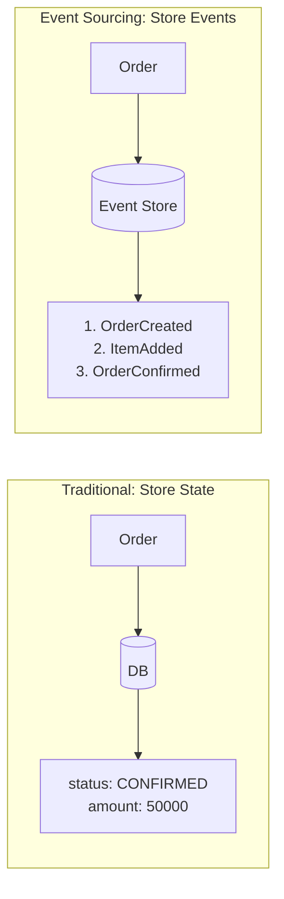

Implement the Event Sourcing pattern for an order domain. Store events instead of state, and restore state by replaying events.

## What is Event Sourcing?

### Traditional vs Event Sourcing



| Aspect | Traditional | Event Sourcing |
|--------|-------------|----------------|
| **What's Stored** | Current state | All events |
| **History** | Requires separate management | Automatically preserved |
| **Point-in-time Recovery** | Not possible | Can recreate any point in time |
| **Debugging** | Difficult | Easy event tracing |
| **Complexity** | Low | High |

---

## Domain Event Definition

### Event Base Class

```java
// DomainEvent.java
public abstract class DomainEvent {
    private final String eventId;
    private final String aggregateId;
    private final long version;
    private final Instant occurredAt;

    protected DomainEvent(String aggregateId, long version) {
        this.eventId = UUID.randomUUID().toString();
        this.aggregateId = aggregateId;
        this.version = version;
        this.occurredAt = Instant.now();
    }

    public abstract String getEventType();
}
```

### Order Domain Events

```java
// OrderCreatedEvent.java
public class OrderCreatedEvent extends DomainEvent {
    private final String customerId;
    private final String shippingAddress;

    @Override
    public String getEventType() {
        return "ORDER_CREATED";
    }
}

// OrderItemAddedEvent.java
public class OrderItemAddedEvent extends DomainEvent {
    private final String productId;
    private final String productName;
    private final int quantity;
    private final Money unitPrice;

    @Override
    public String getEventType() {
        return "ORDER_ITEM_ADDED";
    }
}

// OrderConfirmedEvent.java
public class OrderConfirmedEvent extends DomainEvent {
    private final Money totalAmount;
    private final Instant confirmedAt;

    @Override
    public String getEventType() {
        return "ORDER_CONFIRMED";
    }
}
```

---

## Event-Sourced Aggregate

### Order Aggregate

```java
public class Order extends EventSourcedAggregate {
    private String customerId;
    private String shippingAddress;
    private List<OrderLine> orderLines = new ArrayList<>();
    private OrderStatus status;
    private Money totalAmount;

    // Factory method: Create new order
    public static Order create(String orderId, String customerId, String shippingAddress) {
        Order order = new Order();
        order.apply(new OrderCreatedEvent(orderId, 1, customerId, shippingAddress));
        return order;
    }

    // Reconstitute from events
    public static Order reconstitute(String orderId, List<DomainEvent> events) {
        Order order = new Order();
        events.forEach(order::apply);
        return order;
    }

    // Command: Add item
    public void addItem(String productId, String productName, int quantity, Money unitPrice) {
        if (status != OrderStatus.PENDING) {
            throw new IllegalStateException("Cannot add items to confirmed order.");
        }
        apply(new OrderItemAddedEvent(getId(), nextVersion(), productId, productName, quantity, unitPrice));
    }

    // Command: Confirm order
    public void confirm() {
        if (status != OrderStatus.PENDING) {
            throw new IllegalStateException("Only pending orders can be confirmed.");
        }
        if (orderLines.isEmpty()) {
            throw new IllegalStateException("Cannot confirm order with no items.");
        }
        Money total = calculateTotal();
        apply(new OrderConfirmedEvent(getId(), nextVersion(), total));
    }

    // Event handler: State change
    @Override
    protected void when(DomainEvent event) {
        switch (event) {
            case OrderCreatedEvent e -> {
                setId(e.getAggregateId());
                this.customerId = e.getCustomerId();
                this.shippingAddress = e.getShippingAddress();
                this.status = OrderStatus.PENDING;
            }
            case OrderItemAddedEvent e -> {
                this.orderLines.add(new OrderLine(
                    e.getProductId(), e.getProductName(),
                    e.getQuantity(), e.getUnitPrice()
                ));
            }
            case OrderConfirmedEvent e -> {
                this.status = OrderStatus.CONFIRMED;
                this.totalAmount = e.getTotalAmount();
            }
            default -> throw new IllegalArgumentException("Unknown event");
        }
    }
}
```

---

## Event Store Implementation

### EventStore Interface

```java
public interface EventStore {
    void append(String aggregateId, List<DomainEvent> events, long expectedVersion);
    List<DomainEvent> load(String aggregateId);
    List<DomainEvent> loadFromVersion(String aggregateId, long fromVersion);
}
```

### JPA-based Implementation

```java
@Entity
@Table(name = "event_store")
public class EventEntity {
    @Id
    @GeneratedValue(strategy = GenerationType.IDENTITY)
    private Long id;

    private String aggregateId;
    private String eventType;
    private long version;

    @Column(columnDefinition = "TEXT")
    private String payload;  // JSON

    private Instant occurredAt;
    private Instant storedAt;
}

@Component
public class JpaEventStore implements EventStore {
    private final EventEntityRepository repository;
    private final ObjectMapper objectMapper;

    @Override
    @Transactional
    public void append(String aggregateId, List<DomainEvent> events, long expectedVersion) {
        // Optimistic concurrency check
        Optional<EventEntity> lastEvent = repository.findTopByAggregateIdOrderByVersionDesc(aggregateId);
        long currentVersion = lastEvent.map(EventEntity::getVersion).orElse(0L);

        if (currentVersion != expectedVersion) {
            throw new OptimisticLockingException(
                String.format("Expected version %d but was %d", expectedVersion, currentVersion)
            );
        }

        // Save events
        List<EventEntity> entities = events.stream()
            .map(this::toEntity)
            .toList();

        repository.saveAll(entities);
    }

    @Override
    public List<DomainEvent> load(String aggregateId) {
        return repository.findByAggregateIdOrderByVersionAsc(aggregateId).stream()
            .map(this::toDomainEvent)
            .toList();
    }
}
```

---

## Snapshot (Performance Optimization)

```java
@Component
public class SnapshotStore {
    private static final int SNAPSHOT_THRESHOLD = 100;  // Snapshot every 100 events

    public Optional<Order> loadWithSnapshot(String orderId) {
        // 1. Load snapshot
        Optional<SnapshotEntity> snapshot = snapshotRepository
            .findTopByAggregateIdOrderByVersionDesc(orderId);

        if (snapshot.isEmpty()) {
            // No snapshot, restore from all events
            List<DomainEvent> events = eventStore.load(orderId);
            return events.isEmpty() ? Optional.empty()
                : Optional.of(Order.reconstitute(orderId, events));
        }

        // 2. Restore state from snapshot
        Order order = deserializeOrder(snapshot.get().getState());

        // 3. Load only events after snapshot
        List<DomainEvent> newEvents = eventStore.loadFromVersion(
            orderId, snapshot.get().getVersion());

        // 4. Apply new events
        newEvents.forEach(order::apply);
        order.markEventsAsCommitted();

        return Optional.of(order);
    }
}
```

---

## Tests

### Unit Tests

```java
class OrderTest {

    @Test
    void creating_order_raises_OrderCreatedEvent() {
        // When
        Order order = Order.create("order-1", "customer-1", "123 Main St");

        // Then
        List<DomainEvent> events = order.getUncommittedEvents();
        assertThat(events).hasSize(1);
        assertThat(events.get(0)).isInstanceOf(OrderCreatedEvent.class);
    }

    @Test
    void can_restore_state_from_events() {
        // Given
        List<DomainEvent> events = List.of(
            new OrderCreatedEvent("order-1", 1, "customer-1", "123 Main St"),
            new OrderItemAddedEvent("order-1", 2, "prod-1", "Laptop", 1, Money.of(1000)),
            new OrderConfirmedEvent("order-1", 3, Money.of(1000))
        );

        // When
        Order order = Order.reconstitute("order-1", events);

        // Then
        assertThat(order.getStatus()).isEqualTo(OrderStatus.CONFIRMED);
        assertThat(order.getOrderLines()).hasSize(1);
        assertThat(order.getTotalAmount()).isEqualTo(Money.of(1000));
    }

    @Test
    void cannot_add_items_to_confirmed_order() {
        // Given
        Order order = Order.create("order-1", "customer-1", "123 Main St");
        order.addItem("prod-1", "Laptop", 1, Money.of(1000));
        order.confirm();
        order.markEventsAsCommitted();

        // When & Then
        assertThatThrownBy(() ->
            order.addItem("prod-2", "Mouse", 1, Money.of(50))
        ).isInstanceOf(IllegalStateException.class)
         .hasMessageContaining("confirmed order");
    }
}
```

---

## Checklist

- [ ] All state changes through events
- [ ] Events are immutable
- [ ] Optimistic concurrency control implemented
- [ ] Snapshots for performance optimization
- [ ] Event schema versioning
- [ ] Replay tests

---

## Next Steps

- [CQRS](../concepts/cqrs/) - Command and Query separation
- [Domain Events](../concepts/domain-events/) - Event publishing and subscribing
- [Kafka Integration]() - External event publishing
