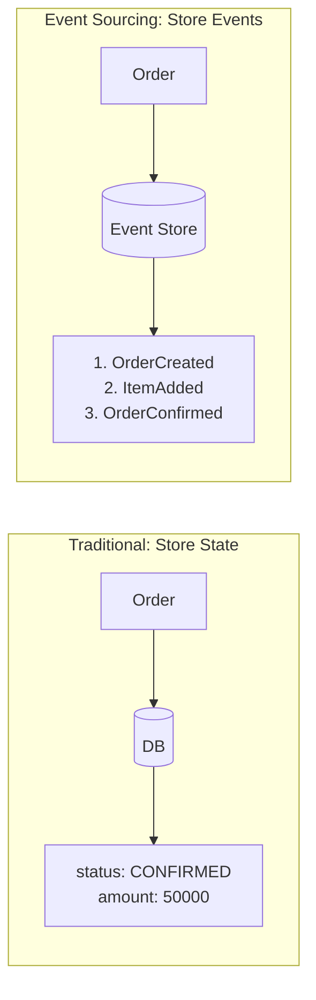


- **Event Sourcing**: Store events instead of state. Restore state by replaying events
- **Event Store**: Persistent storage for events. Version-based optimistic concurrency control
- **Event-Sourced Aggregate**: Apply/when pattern for event application and state changes
- **Snapshot**: Periodically save state snapshots for performance optimization
- **Point-in-time Recovery**: Replay events up to a specific version to query past state


## Target Audience and Prerequisites

| Item | Required Level |
|------|----------------|
| **Target Audience** | Developers looking to implement the Event Sourcing pattern |
| **DDD** | Understanding of Aggregate and Domain Event concepts |
| **Java** | Switch Expression, Pattern Matching syntax |
| **Prerequisites** | [Order Domain](order-domain/), [Application Layer](application-layer/) completed |

Implement the Event Sourcing pattern for an order domain. Store events instead of state, and restore state by replaying events.

## What is Event Sourcing?

### Traditional vs Event Sourcing



> **Diagram Description**: On the left (traditional approach), Order stores current state (status: CONFIRMED, amount: 50000) in the DB. On the right (Event Sourcing), Order stores an event sequence (OrderCreated, ItemAdded, OrderConfirmed) in the Event Store.

| Aspect | Traditional | Event Sourcing |
|--------|-------------|----------------|
| **What's Stored** | Current state | All events |
| **History** | Requires separate management | Automatically preserved |
| **Point-in-time Recovery** | Not possible | Can recreate any point in time |
| **Debugging** | Difficult | Easy event tracing |
| **Complexity** | Low | High |


- **Don't store state, store events**: Current state is calculated by replaying events
- **Complete history**: All change history is automatically preserved
- **Time travel**: Can restore state at any point in time
- **Trade-off**: Increased implementation complexity, query performance considerations needed


---

## Domain Event Definition

### Event Base Class

```java
// DomainEvent.java
public abstract class DomainEvent {
    private final String eventId;
    private final String aggregateId;
    private final long version;
    private final Instant occurredAt;

    protected DomainEvent(String aggregateId, long version) {
        this.eventId = UUID.randomUUID().toString();
        this.aggregateId = aggregateId;
        this.version = version;
        this.occurredAt = Instant.now();
    }

    public abstract String getEventType();

    // getters
}
```

### Order Domain Events

```java
// OrderCreatedEvent.java
public class OrderCreatedEvent extends DomainEvent {
    private final String customerId;
    private final String shippingAddress;

    public OrderCreatedEvent(String orderId, long version,
                             String customerId, String shippingAddress) {
        super(orderId, version);
        this.customerId = customerId;
        this.shippingAddress = shippingAddress;
    }

    @Override
    public String getEventType() {
        return "ORDER_CREATED";
    }
}

// OrderItemAddedEvent.java
public class OrderItemAddedEvent extends DomainEvent {
    private final String productId;
    private final String productName;
    private final int quantity;
    private final Money unitPrice;

    public OrderItemAddedEvent(String orderId, long version,
                               String productId, String productName,
                               int quantity, Money unitPrice) {
        super(orderId, version);
        this.productId = productId;
        this.productName = productName;
        this.quantity = quantity;
        this.unitPrice = unitPrice;
    }

    @Override
    public String getEventType() {
        return "ORDER_ITEM_ADDED";
    }
}

// OrderConfirmedEvent.java
public class OrderConfirmedEvent extends DomainEvent {
    private final Money totalAmount;
    private final Instant confirmedAt;

    public OrderConfirmedEvent(String orderId, long version, Money totalAmount) {
        super(orderId, version);
        this.totalAmount = totalAmount;
        this.confirmedAt = Instant.now();
    }

    @Override
    public String getEventType() {
        return "ORDER_CONFIRMED";
    }
}

// OrderCancelledEvent.java
public class OrderCancelledEvent extends DomainEvent {
    private final String reason;
    private final Instant cancelledAt;

    public OrderCancelledEvent(String orderId, long version, String reason) {
        super(orderId, version);
        this.reason = reason;
        this.cancelledAt = Instant.now();
    }

    @Override
    public String getEventType() {
        return "ORDER_CANCELLED";
    }
}
```


- **Version included**: Each event contains the Aggregate's version number
- **Immutable**: Events cannot be changed once created
- **Self-describing**: getEventType() identifies the event type
- **Minimal data**: Contains only the data needed to restore state


---

## Event-Sourced Aggregate

### Order Aggregate

```java
public class Order extends EventSourcedAggregate {
    private String customerId;
    private String shippingAddress;
    private List<OrderLine> orderLines = new ArrayList<>();
    private OrderStatus status;
    private Money totalAmount;
    private Instant confirmedAt;
    private String cancelReason;

    // Empty constructor (for event replay)
    public Order() {
        super();
    }

    // Factory method: Create new order
    public static Order create(String orderId, String customerId, String shippingAddress) {
        Order order = new Order();
        order.apply(new OrderCreatedEvent(orderId, 1, customerId, shippingAddress));
        return order;
    }

    // Reconstitute from events
    public static Order reconstitute(String orderId, List<DomainEvent> events) {
        Order order = new Order();
        events.forEach(order::apply);
        return order;
    }

    // Command: Add item
    public void addItem(String productId, String productName, int quantity, Money unitPrice) {
        if (status != OrderStatus.PENDING) {
            throw new IllegalStateException("Cannot add items to confirmed order.");
        }
        if (quantity <= 0) {
            throw new IllegalArgumentException("Quantity must be at least 1.");
        }

        apply(new OrderItemAddedEvent(getId(), nextVersion(), productId, productName, quantity, unitPrice));
    }

    // Command: Confirm order
    public void confirm() {
        if (status != OrderStatus.PENDING) {
            throw new IllegalStateException("Only pending orders can be confirmed.");
        }
        if (orderLines.isEmpty()) {
            throw new IllegalStateException("Cannot confirm order with no items.");
        }

        Money total = calculateTotal();
        apply(new OrderConfirmedEvent(getId(), nextVersion(), total));
    }

    // Command: Cancel order
    public void cancel(String reason) {
        if (status == OrderStatus.CANCELLED) {
            throw new IllegalStateException("Order is already cancelled.");
        }
        if (status == OrderStatus.SHIPPED) {
            throw new IllegalStateException("Cannot cancel shipped order.");
        }

        apply(new OrderCancelledEvent(getId(), nextVersion(), reason));
    }

    // Event handler: State change
    @Override
    protected void when(DomainEvent event) {
        switch (event) {
            case OrderCreatedEvent e -> {
                setId(e.getAggregateId());
                this.customerId = e.getCustomerId();
                this.shippingAddress = e.getShippingAddress();
                this.status = OrderStatus.PENDING;
                this.orderLines = new ArrayList<>();
            }
            case OrderItemAddedEvent e -> {
                this.orderLines.add(new OrderLine(
                    e.getProductId(),
                    e.getProductName(),
                    e.getQuantity(),
                    e.getUnitPrice()
                ));
            }
            case OrderConfirmedEvent e -> {
                this.status = OrderStatus.CONFIRMED;
                this.totalAmount = e.getTotalAmount();
                this.confirmedAt = e.getConfirmedAt();
            }
            case OrderCancelledEvent e -> {
                this.status = OrderStatus.CANCELLED;
                this.cancelReason = e.getReason();
            }
            default -> throw new IllegalArgumentException("Unknown event: " + event.getClass());
        }
    }

    private Money calculateTotal() {
        return orderLines.stream()
            .map(line -> line.getUnitPrice().multiply(line.getQuantity()))
            .reduce(Money.ZERO, Money::add);
    }
}
```

### EventSourcedAggregate Base Class

```java
public abstract class EventSourcedAggregate {
    private String id;
    private long version = 0;
    private final List<DomainEvent> uncommittedEvents = new ArrayList<>();

    protected void apply(DomainEvent event) {
        when(event);
        this.version = event.getVersion();
        uncommittedEvents.add(event);
    }

    protected abstract void when(DomainEvent event);

    protected long nextVersion() {
        return version + 1;
    }

    public List<DomainEvent> getUncommittedEvents() {
        return List.copyOf(uncommittedEvents);
    }

    public void markEventsAsCommitted() {
        uncommittedEvents.clear();
    }

    // getters, setters
}
```


- **apply/when pattern**: apply() records the event, when() changes state
- **Command methods**: Validate then generate events (addItem, confirm, cancel)
- **reconstitute**: Restore state from event list
- **uncommittedEvents**: Track events not yet saved
- **Version management**: nextVersion() assigns sequential version numbers


---

## Event Store Implementation

### EventStore Interface

```java
public interface EventStore {
    void append(String aggregateId, List<DomainEvent> events, long expectedVersion);
    List<DomainEvent> load(String aggregateId);
    List<DomainEvent> loadFromVersion(String aggregateId, long fromVersion);
}
```

### JPA-based Implementation

```java
@Entity
@Table(name = "event_store")
public class EventEntity {
    @Id
    @GeneratedValue(strategy = GenerationType.IDENTITY)
    private Long id;

    @Column(nullable = false)
    private String aggregateId;

    @Column(nullable = false)
    private String aggregateType;

    @Column(nullable = false)
    private String eventType;

    @Column(nullable = false)
    private long version;

    @Column(columnDefinition = "TEXT", nullable = false)
    private String payload;  // JSON

    @Column(nullable = false)
    private Instant occurredAt;

    @Column(nullable = false)
    private Instant storedAt;
}

@Repository
public interface EventEntityRepository extends JpaRepository<EventEntity, Long> {
    List<EventEntity> findByAggregateIdOrderByVersionAsc(String aggregateId);
    List<EventEntity> findByAggregateIdAndVersionGreaterThanOrderByVersionAsc(
        String aggregateId, long version);
    Optional<EventEntity> findTopByAggregateIdOrderByVersionDesc(String aggregateId);
}

@Component
@RequiredArgsConstructor
public class JpaEventStore implements EventStore {
    private final EventEntityRepository repository;
    private final ObjectMapper objectMapper;

    @Override
    @Transactional
    public void append(String aggregateId, List<DomainEvent> events, long expectedVersion) {
        // Optimistic concurrency check
        Optional<EventEntity> lastEvent = repository.findTopByAggregateIdOrderByVersionDesc(aggregateId);
        long currentVersion = lastEvent.map(EventEntity::getVersion).orElse(0L);

        if (currentVersion != expectedVersion) {
            throw new OptimisticLockingException(
                String.format("Expected version %d but was %d", expectedVersion, currentVersion)
            );
        }

        // Save events
        List<EventEntity> entities = events.stream()
            .map(this::toEntity)
            .toList();

        repository.saveAll(entities);
    }

    @Override
    public List<DomainEvent> load(String aggregateId) {
        return repository.findByAggregateIdOrderByVersionAsc(aggregateId).stream()
            .map(this::toDomainEvent)
            .toList();
    }

    @Override
    public List<DomainEvent> loadFromVersion(String aggregateId, long fromVersion) {
        return repository.findByAggregateIdAndVersionGreaterThanOrderByVersionAsc(aggregateId, fromVersion)
            .stream()
            .map(this::toDomainEvent)
            .toList();
    }

    private EventEntity toEntity(DomainEvent event) {
        EventEntity entity = new EventEntity();
        entity.setAggregateId(event.getAggregateId());
        entity.setAggregateType("Order");
        entity.setEventType(event.getEventType());
        entity.setVersion(event.getVersion());
        entity.setPayload(serialize(event));
        entity.setOccurredAt(event.getOccurredAt());
        entity.setStoredAt(Instant.now());
        return entity;
    }

    private DomainEvent toDomainEvent(EventEntity entity) {
        return deserialize(entity.getPayload(), entity.getEventType());
    }

    private String serialize(DomainEvent event) {
        try {
            return objectMapper.writeValueAsString(event);
        } catch (JsonProcessingException e) {
            throw new RuntimeException("Failed to serialize event", e);
        }
    }

    private DomainEvent deserialize(String payload, String eventType) {
        try {
            Class<? extends DomainEvent> eventClass = getEventClass(eventType);
            return objectMapper.readValue(payload, eventClass);
        } catch (JsonProcessingException e) {
            throw new RuntimeException("Failed to deserialize event", e);
        }
    }

    private Class<? extends DomainEvent> getEventClass(String eventType) {
        return switch (eventType) {
            case "ORDER_CREATED" -> OrderCreatedEvent.class;
            case "ORDER_ITEM_ADDED" -> OrderItemAddedEvent.class;
            case "ORDER_CONFIRMED" -> OrderConfirmedEvent.class;
            case "ORDER_CANCELLED" -> OrderCancelledEvent.class;
            default -> throw new IllegalArgumentException("Unknown event type: " + eventType);
        };
    }
}
```


- **Append-Only**: Events can only be added, never modified or deleted
- **Optimistic concurrency**: expectedVersion validation detects concurrent modification conflicts
- **JSON serialization**: Store events as JSON for flexibility
- **Version-based query**: loadFromVersion() loads only events after a specific version


---

## Repository Implementation

### OrderRepository

```java
public interface OrderRepository {
    void save(Order order);
    Optional<Order> findById(String orderId);
}

@Component
@RequiredArgsConstructor
public class EventSourcedOrderRepository implements OrderRepository {
    private final EventStore eventStore;

    @Override
    @Transactional
    public void save(Order order) {
        List<DomainEvent> uncommittedEvents = order.getUncommittedEvents();
        if (uncommittedEvents.isEmpty()) {
            return;
        }

        long expectedVersion = order.getVersion() - uncommittedEvents.size();
        eventStore.append(order.getId(), uncommittedEvents, expectedVersion);
        order.markEventsAsCommitted();
    }

    @Override
    public Optional<Order> findById(String orderId) {
        List<DomainEvent> events = eventStore.load(orderId);
        if (events.isEmpty()) {
            return Optional.empty();
        }
        return Optional.of(Order.reconstitute(orderId, events));
    }
}
```


- **Event Store delegation**: Delegates event storage/retrieval to Event Store
- **Version calculation**: expectedVersion = current version - uncommitted event count on save
- **reconstitute usage**: Restore Aggregate from events
- **Domain Repository interface**: Interface defined in domain layer


---

## Snapshot (Performance Optimization)

### Snapshots for Performance

```java
@Entity
@Table(name = "snapshots")
public class SnapshotEntity {
    @Id
    @GeneratedValue(strategy = GenerationType.IDENTITY)
    private Long id;

    private String aggregateId;
    private String aggregateType;
    private long version;

    @Column(columnDefinition = "TEXT")
    private String state;  // JSON

    private Instant createdAt;
}

@Component
@RequiredArgsConstructor
public class SnapshotStore {
    private static final int SNAPSHOT_THRESHOLD = 100;  // Snapshot every 100 events

    private final SnapshotRepository snapshotRepository;
    private final EventStore eventStore;
    private final ObjectMapper objectMapper;

    public Optional<Order> loadWithSnapshot(String orderId) {
        // 1. Load snapshot
        Optional<SnapshotEntity> snapshot = snapshotRepository
            .findTopByAggregateIdOrderByVersionDesc(orderId);

        if (snapshot.isEmpty()) {
            // No snapshot, restore from all events
            List<DomainEvent> events = eventStore.load(orderId);
            return events.isEmpty() ? Optional.empty()
                : Optional.of(Order.reconstitute(orderId, events));
        }

        // 2. Restore state from snapshot
        Order order = deserializeOrder(snapshot.get().getState());

        // 3. Load only events after snapshot
        List<DomainEvent> newEvents = eventStore.loadFromVersion(
            orderId, snapshot.get().getVersion());

        // 4. Apply new events
        newEvents.forEach(order::apply);
        order.markEventsAsCommitted();

        return Optional.of(order);
    }

    public void saveWithSnapshot(Order order) {
        // Save events
        List<DomainEvent> uncommittedEvents = order.getUncommittedEvents();
        long expectedVersion = order.getVersion() - uncommittedEvents.size();
        eventStore.append(order.getId(), uncommittedEvents, expectedVersion);
        order.markEventsAsCommitted();

        // Check if snapshot needed
        if (order.getVersion() % SNAPSHOT_THRESHOLD == 0) {
            createSnapshot(order);
        }
    }

    private void createSnapshot(Order order) {
        SnapshotEntity snapshot = new SnapshotEntity();
        snapshot.setAggregateId(order.getId());
        snapshot.setAggregateType("Order");
        snapshot.setVersion(order.getVersion());
        snapshot.setState(serializeOrder(order));
        snapshot.setCreatedAt(Instant.now());

        snapshotRepository.save(snapshot);
    }
}
```


- **Performance optimization**: Reduces full replay cost when there are many events
- **Periodic creation**: Create snapshot every SNAPSHOT_THRESHOLD (e.g., 100) events
- **Partial replay**: Restore state by replaying snapshot + only subsequent events
- **State serialization**: Store Aggregate state as JSON


---

## Application Service

### OrderApplicationService

```java
@Service
@RequiredArgsConstructor
@Transactional
public class OrderApplicationService {
    private final OrderRepository orderRepository;
    private final ApplicationEventPublisher eventPublisher;

    public String createOrder(CreateOrderCommand command) {
        String orderId = UUID.randomUUID().toString();

        Order order = Order.create(
            orderId,
            command.customerId(),
            command.shippingAddress()
        );

        orderRepository.save(order);

        // Publish events for external system notification
        publishEvents(order);

        return orderId;
    }

    public void addItem(AddItemCommand command) {
        Order order = orderRepository.findById(command.orderId())
            .orElseThrow(() -> new OrderNotFoundException(command.orderId()));

        order.addItem(
            command.productId(),
            command.productName(),
            command.quantity(),
            command.unitPrice()
        );

        orderRepository.save(order);
        publishEvents(order);
    }

    public void confirmOrder(String orderId) {
        Order order = orderRepository.findById(orderId)
            .orElseThrow(() -> new OrderNotFoundException(orderId));

        order.confirm();

        orderRepository.save(order);
        publishEvents(order);
    }

    public void cancelOrder(String orderId, String reason) {
        Order order = orderRepository.findById(orderId)
            .orElseThrow(() -> new OrderNotFoundException(orderId));

        order.cancel(reason);

        orderRepository.save(order);
        publishEvents(order);
    }

    // Query: Restore state at specific point in time
    public OrderView getOrderAtVersion(String orderId, long version) {
        List<DomainEvent> events = eventStore.load(orderId).stream()
            .filter(e -> e.getVersion() <= version)
            .toList();

        if (events.isEmpty()) {
            throw new OrderNotFoundException(orderId);
        }

        Order order = Order.reconstitute(orderId, events);
        return OrderView.from(order);
    }

    private void publishEvents(Order order) {
        order.getUncommittedEvents().forEach(eventPublisher::publishEvent);
    }
}
```


- **Point-in-time query**: getOrderAtVersion() queries state at specific version
- **Event filtering**: Filter events with version <= targetVersion to restore past state
- **External event publishing**: Notify external systems via ApplicationEventPublisher after save
- **Standard CRUD pattern**: Maintains same service interface as traditional approach


---

## Tests

### Unit Tests

```java
class OrderTest {

    @Test
    void creating_order_raises_OrderCreatedEvent() {
        // When
        Order order = Order.create("order-1", "customer-1", "123 Main St");

        // Then
        List<DomainEvent> events = order.getUncommittedEvents();
        assertThat(events).hasSize(1);
        assertThat(events.get(0)).isInstanceOf(OrderCreatedEvent.class);

        OrderCreatedEvent event = (OrderCreatedEvent) events.get(0);
        assertThat(event.getAggregateId()).isEqualTo("order-1");
        assertThat(event.getCustomerId()).isEqualTo("customer-1");
    }

    @Test
    void can_restore_state_from_events() {
        // Given
        List<DomainEvent> events = List.of(
            new OrderCreatedEvent("order-1", 1, "customer-1", "123 Main St"),
            new OrderItemAddedEvent("order-1", 2, "prod-1", "Laptop", 1, Money.of(1000000)),
            new OrderConfirmedEvent("order-1", 3, Money.of(1000000))
        );

        // When
        Order order = Order.reconstitute("order-1", events);

        // Then
        assertThat(order.getStatus()).isEqualTo(OrderStatus.CONFIRMED);
        assertThat(order.getOrderLines()).hasSize(1);
        assertThat(order.getTotalAmount()).isEqualTo(Money.of(1000000));
    }

    @Test
    void cannot_add_items_to_confirmed_order() {
        // Given
        Order order = Order.create("order-1", "customer-1", "123 Main St");
        order.addItem("prod-1", "Laptop", 1, Money.of(1000000));
        order.confirm();
        order.markEventsAsCommitted();

        // When & Then
        assertThatThrownBy(() ->
            order.addItem("prod-2", "Mouse", 1, Money.of(50000))
        ).isInstanceOf(IllegalStateException.class)
         .hasMessageContaining("confirmed order");
    }
}
```


- **Event verification**: Check generated events with getUncommittedEvents()
- **State restoration test**: Verify state after reconstitute from event list
- **Invariant test**: Verify exception thrown when attempting invalid state transitions
- **Independent tests**: Can unit test domain logic without DB


---

## Checklist

- [ ] All state changes through events
- [ ] Events are immutable
- [ ] Optimistic concurrency control implemented
- [ ] Snapshots for performance optimization
- [ ] Event schema versioning
- [ ] Replay tests

---

## Next Steps

- [CQRS]() - Command and Query separation
- [Domain Events]() - Event publishing and subscribing
- [Kafka Integration]() - External event publishing
