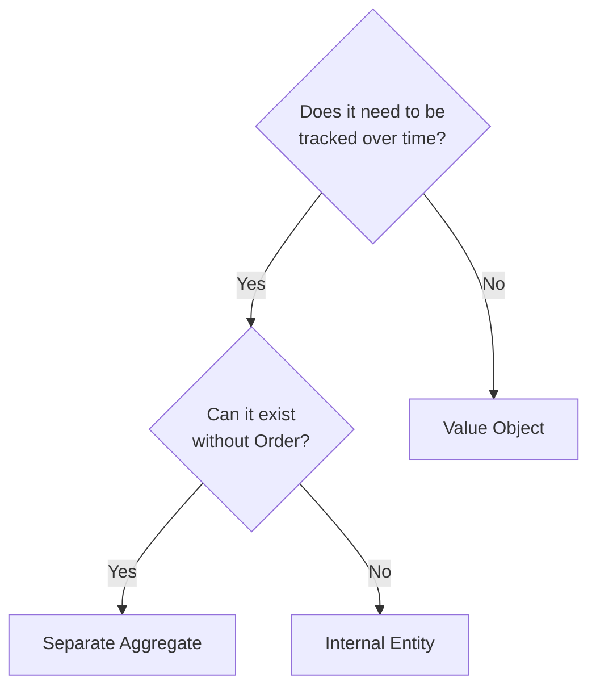
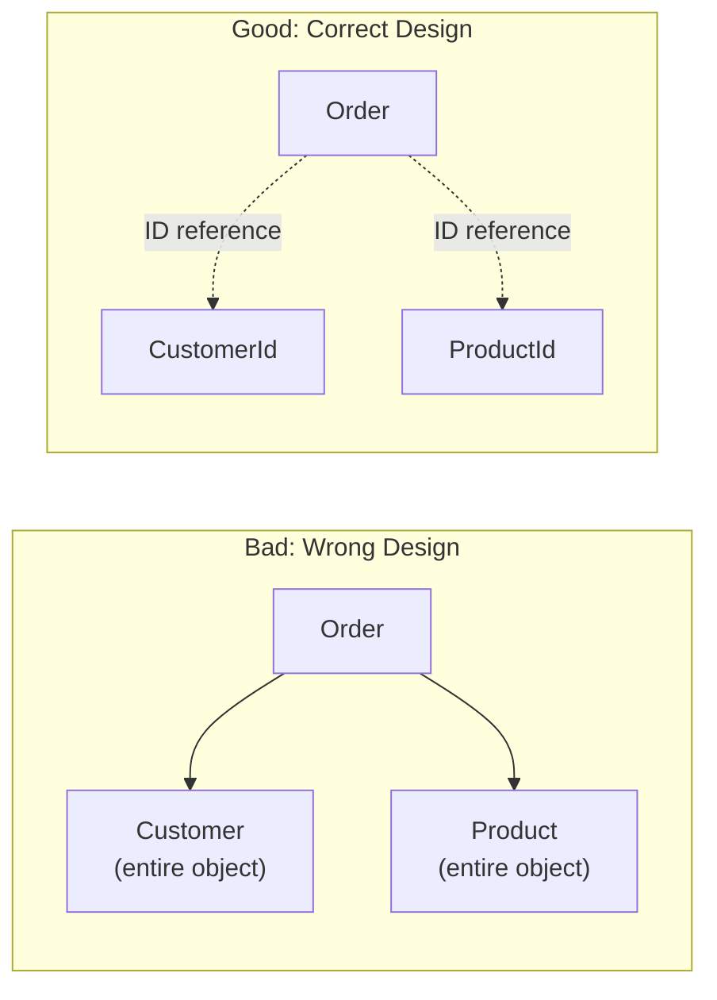
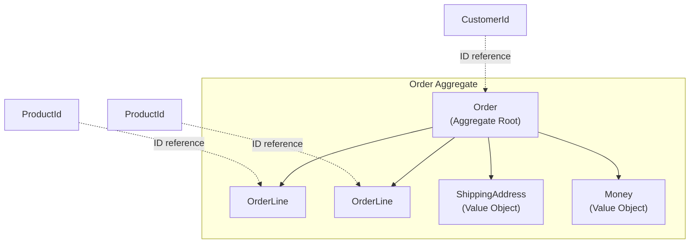

# Order Domain Implementation


- **Order**: Aggregate Root. Manages the order's consistency boundary
- **OrderLine**: Internal Entity. Can only be created/modified through Order
- **Money, ShippingAddress, OrderId**: Value Objects. Immutable and compared by value
- **Invariants**: At least 1 order line, max amount 100M won, quantity 1~999
- **Domain Events**: OrderCreatedEvent, OrderConfirmedEvent, etc. published on state changes


## Target Audience and Prerequisites

| Item | Required Level |
|------|----------------|
| **Target Audience** | Developers implementing DDD tactical patterns in code |
| **DDD Basics** | Understanding of Aggregate, Entity, Value Object, Domain Event concepts |
| **Java** | Experience with Record, Optional, Stream API |
| **Prerequisite** | [Project Setup](setup/) completed |

Implementing the order domain with DDD patterns.

> **Common Imports for examples in this page:**
> ```java
> import java.util.*;
> import java.time.LocalDateTime;
> import java.math.BigDecimal;
> // Domain classes are defined within this document
> ```

## Why Did We Design It This Way?

Before looking at the code, first understand the **reasoning** behind each design decision.

### Design Decisions Summary

| Element | Decision | Reason |
|---------|----------|--------|
| **Order** | Aggregate Root | Order's consistency boundary. All changes only through Order |
| **OrderLine** | Internal Entity | Quantity changes needed, but cannot exist without Order |
| **Money** | Value Object | Amount is immutable, compared by value (10000 won == 10000 won) |
| **ShippingAddress** | Value Object | Address is a single semantic unit, no partial changes |
| **OrderId** | Value Object | ID doesn't change, compared by value |
| **CustomerId** | ID Reference | Customer is separate Aggregate, direct inclusion violates boundary |

### Value Object vs Entity: How Did We Distinguish?



> **Diagram Description**: This is a flowchart for deciding Entity vs Value Object. If the answer to "Does it need to be tracked over time?" is No, it's a Value Object. If Yes, the next question "Can it exist without Order?" determines whether it's a Separate Aggregate (Yes) or Internal Entity (No).

**Why Money is a Value Object:**
- "10,000 won" and "10,000 won" are **the same money** (compared by value)
- We don't "modify" the amount, we **replace it with a new amount**
- No need to track history of amount changes

**Why OrderLine is an Entity:**
- Even adding the same product, "first item" and "second item" are **different** (distinguished by ID)
- Quantity must be **changeable** (state change tracking)
- But cannot exist without Order, so it's an internal Entity

### Aggregate Boundary: Why Only Order as Root?



> **Diagram Description**: On the left (wrong design), Order contains entire Customer and Product objects. On the right (correct design), Order only references CustomerId and ProductId. Other Aggregates should only be referenced by ID.

**Why reference Customer only by ID:**
- Customer has an **independent lifecycle** from the order
- If we save entire customer info with order -> **data duplication**
- If customer info changes, all orders with that customer must also change -> **consistency problem**

**Why reference only ProductId:**
- Even if product price changes, **price at order time** should be preserved
- So we save `price` as a **snapshot** in OrderLine

### Invariants: What Are We Protecting?

Rules that the Order Aggregate **always guarantees**:

| Invariant | Code Location | Business Reason |
|-----------|---------------|-----------------|
| At least 1 order line | `Order.create()` | Empty order is meaningless |
| Max amount 100M won | `addOrderLineInternal()` | Payment limit, fraud prevention |
| Quantity 1~999 | `OrderLine.validateQuantity()` | Inventory management, unusual transaction prevention |
| Changes only in PENDING | Each business method | Prevent changes after confirmation |

### Package-Private Constructor: Why Needed?

```java
// Bad: public constructor -> anyone can create
public OrderLine(ProductId productId, ...) { }

// Good: package-private -> only Order can create
OrderLine(ProductId productId, ...) { }
```

**Reason:** OrderLine cannot exist without Order. Making it package-private **prevents incorrect usage at compile time**.


- **Aggregate Boundary**: Range where consistency must be guaranteed. Order + OrderLine form one boundary
- **ID Reference**: Other Aggregates (Customer, Product) referenced only by ID, not objects
- **Value Object**: Immutable, compared by value, only replaceable (Money, Address)
- **Internal Entity**: Exists only within Aggregate, accessed only through Root (OrderLine)


---

## Domain Model Design

### Order Aggregate Structure



> **Diagram Description**: This shows the internal structure of Order Aggregate. Order (Aggregate Root) contains OrderLines, ShippingAddress (VO), and Money (VO). CustomerId and ProductId are shown with dotted lines indicating external references (ID only).

## Value Object Implementation

### OrderId

```java
package com.example.order.domain.model;

import java.util.Objects;
import java.util.UUID;

public record OrderId(String value) {

    public OrderId {
        Objects.requireNonNull(value, "OrderId cannot be null");
        if (value.isBlank()) {
            throw new IllegalArgumentException("OrderId cannot be blank");
        }
    }

    public static OrderId generate() {
        return new OrderId("ORD-" + UUID.randomUUID().toString().substring(0, 8).toUpperCase());
    }

    public static OrderId of(String value) {
        return new OrderId(value);
    }

    @Override
    public String toString() {
        return value;
    }
}
```

### Money

```java
package com.example.order.domain.model;

import java.math.BigDecimal;
import java.math.RoundingMode;
import java.util.Currency;
import java.util.Objects;

public record Money(BigDecimal amount, Currency currency) {

    public static final Money ZERO = Money.won(0);

    public Money {
        Objects.requireNonNull(amount, "Amount is required");
        Objects.requireNonNull(currency, "Currency is required");
        if (amount.compareTo(BigDecimal.ZERO) < 0) {
            throw new IllegalArgumentException("Amount must be 0 or greater: " + amount);
        }
        amount = amount.setScale(0, RoundingMode.HALF_UP);
    }

    // Factory methods
    public static Money won(long amount) {
        return new Money(BigDecimal.valueOf(amount), Currency.getInstance("KRW"));
    }

    public static Money won(BigDecimal amount) {
        return new Money(amount, Currency.getInstance("KRW"));
    }

    // Operations
    public Money add(Money other) {
        validateSameCurrency(other);
        return new Money(this.amount.add(other.amount), this.currency);
    }

    public Money subtract(Money other) {
        validateSameCurrency(other);
        BigDecimal result = this.amount.subtract(other.amount);
        if (result.compareTo(BigDecimal.ZERO) < 0) {
            throw new IllegalArgumentException("Result amount would be negative");
        }
        return new Money(result, this.currency);
    }

    public Money multiply(int quantity) {
        if (quantity < 0) {
            throw new IllegalArgumentException("Quantity must be 0 or greater");
        }
        return new Money(this.amount.multiply(BigDecimal.valueOf(quantity)), this.currency);
    }

    public Money multiply(BigDecimal rate) {
        return new Money(this.amount.multiply(rate), this.currency);
    }

    // Comparison
    public boolean isGreaterThan(Money other) {
        validateSameCurrency(other);
        return this.amount.compareTo(other.amount) > 0;
    }

    public boolean isGreaterThanOrEqual(Money other) {
        validateSameCurrency(other);
        return this.amount.compareTo(other.amount) >= 0;
    }

    public boolean isZero() {
        return this.amount.compareTo(BigDecimal.ZERO) == 0;
    }

    private void validateSameCurrency(Money other) {
        if (!this.currency.equals(other.currency)) {
            throw new IllegalArgumentException(
                String.format("Currencies differ: %s vs %s", this.currency, other.currency)
            );
        }
    }

    @Override
    public String toString() {
        return String.format("%s %s", currency.getSymbol(), amount.toPlainString());
    }
}
```

### ShippingAddress

```java
package com.example.order.domain.model;

import java.util.Objects;

public record ShippingAddress(
    String zipCode,
    String city,
    String street,
    String detail,
    String receiverName,
    String receiverPhone
) {

    public ShippingAddress {
        Objects.requireNonNull(zipCode, "Zip code is required");
        Objects.requireNonNull(city, "City is required");
        Objects.requireNonNull(street, "Street is required");
        Objects.requireNonNull(receiverName, "Receiver name is required");
        Objects.requireNonNull(receiverPhone, "Receiver phone is required");

        if (!zipCode.matches("\\d{5}")) {
            throw new IllegalArgumentException("Zip code must be 5 digits: " + zipCode);
        }

        if (!receiverPhone.matches("\\d{2,3}-\\d{3,4}-\\d{4}")) {
            throw new IllegalArgumentException("Invalid phone format: " + receiverPhone);
        }
    }

    public String fullAddress() {
        String base = String.format("(%s) %s %s", zipCode, city, street);
        return detail != null && !detail.isBlank()
            ? base + " " + detail
            : base;
    }

    public String receiverInfo() {
        return String.format("%s (%s)", receiverName, receiverPhone);
    }
}
```


- **Java Record usage**: Immutability, auto-generated equals/hashCode
- **Compact Constructor**: Validation performed in constructor
- **Factory methods**: Clear creation methods like `Money.won(10000)`, `OrderId.generate()`
- **Domain operations**: Domain logic encapsulated within VO like `Money.add()`, `Money.multiply()`


## Entity Implementation

### OrderLine (Internal Entity)

```java
package com.example.order.domain.model;

import java.util.Objects;
import java.util.UUID;

public class OrderLine extends Entity<OrderLineId> {

    private final OrderLineId id;
    private final ProductId productId;
    private final String productName;
    private final Money price;
    private int quantity;

    // Constructor (package-private - created only through Order)
    OrderLine(ProductId productId, String productName, Money price, int quantity) {
        validateQuantity(quantity);
        Objects.requireNonNull(productId, "Product ID is required");
        Objects.requireNonNull(productName, "Product name is required");
        Objects.requireNonNull(price, "Price is required");

        this.id = OrderLineId.generate();
        this.productId = productId;
        this.productName = productName;
        this.price = price;
        this.quantity = quantity;
    }

    @Override
    public OrderLineId getId() {
        return id;
    }

    public ProductId getProductId() {
        return productId;
    }

    public String getProductName() {
        return productName;
    }

    public Money getPrice() {
        return price;
    }

    public int getQuantity() {
        return quantity;
    }

    // Calculate order line amount
    public Money getAmount() {
        return price.multiply(quantity);
    }

    // Change quantity (called only through Order)
    void changeQuantity(int newQuantity) {
        validateQuantity(newQuantity);
        this.quantity = newQuantity;
    }

    private void validateQuantity(int quantity) {
        if (quantity <= 0) {
            throw new IllegalArgumentException("Quantity must be at least 1: " + quantity);
        }
        if (quantity > 999) {
            throw new IllegalArgumentException("Quantity must be 999 or less: " + quantity);
        }
    }

    // Reconstitute from DB (package-private - used only by Mapper)
    static OrderLine reconstitute(
        OrderLineId id,
        ProductId productId,
        String productName,
        Money price,
        int quantity
    ) {
        // Call reconstitution-only private constructor
        return new OrderLine(id, productId, productName, price, quantity);
    }

    // Reconstitution-only private constructor
    private OrderLine(OrderLineId id, ProductId productId, String productName, Money price, int quantity) {
        this.id = id;
        this.productId = productId;
        this.productName = productName;
        this.price = price;
        this.quantity = quantity;
    }
}

// OrderLineId
public record OrderLineId(String value) {
    public static OrderLineId generate() {
        return new OrderLineId(UUID.randomUUID().toString());
    }

    public static OrderLineId of(String value) {
        return new OrderLineId(value);
    }
}
```


- **Package-private constructor**: Restricts creation only through Aggregate Root
- **Invariant validation**: `validateQuantity()` enforces quantity constraints (1~999)
- **reconstitute method**: Separate method for DB restoration that bypasses validation
- **State change methods**: `changeQuantity()` is also package-private, callable only by Root


## Aggregate Root Implementation

### Order

```java
package com.example.order.domain.model;

import com.example.order.domain.event.OrderCancelledEvent;
import com.example.order.domain.event.OrderConfirmedEvent;
import com.example.order.domain.event.OrderCreatedEvent;
import com.example.order.domain.exception.IllegalOrderStateException;

import java.time.LocalDateTime;
import java.util.ArrayList;
import java.util.Collections;
import java.util.List;
import java.util.Objects;

public class Order extends AggregateRoot<OrderId> {

    private static final int MAX_ORDER_LINES = 100;
    private static final Money MAX_ORDER_AMOUNT = Money.won(100_000_000);

    private final OrderId id;
    private final CustomerId customerId;
    private final List<OrderLine> orderLines;
    private ShippingAddress shippingAddress;
    private OrderStatus status;
    private Money totalAmount;
    private final LocalDateTime createdAt;
    private LocalDateTime confirmedAt;
    private LocalDateTime cancelledAt;
    private String cancellationReason;

    // private constructor
    private Order(OrderId id, CustomerId customerId, ShippingAddress shippingAddress) {
        this.id = id;
        this.customerId = customerId;
        this.orderLines = new ArrayList<>();
        this.shippingAddress = shippingAddress;
        this.status = OrderStatus.PENDING;
        this.totalAmount = Money.ZERO;
        this.createdAt = LocalDateTime.now();
    }

    // Factory method: Create new order
    public static Order create(
        CustomerId customerId,
        ShippingAddress shippingAddress,
        List<OrderLineRequest> lineRequests
    ) {
        Objects.requireNonNull(customerId, "Customer ID is required");
        Objects.requireNonNull(shippingAddress, "Shipping address is required");

        if (lineRequests == null || lineRequests.isEmpty()) {
            throw new IllegalArgumentException("At least 1 order line is required");
        }

        Order order = new Order(OrderId.generate(), customerId, shippingAddress);

        for (OrderLineRequest request : lineRequests) {
            order.addOrderLineInternal(
                request.productId(),
                request.productName(),
                request.price(),
                request.quantity()
            );
        }

        order.registerEvent(new OrderCreatedEvent(order));
        return order;
    }

    // Factory method: Reconstitute from DB
    public static Order reconstitute(
        OrderId id,
        CustomerId customerId,
        List<OrderLine> orderLines,
        ShippingAddress shippingAddress,
        OrderStatus status,
        Money totalAmount,
        LocalDateTime createdAt,
        LocalDateTime confirmedAt,
        LocalDateTime cancelledAt,
        String cancellationReason
    ) {
        Order order = new Order(id, customerId, shippingAddress);
        order.orderLines.addAll(orderLines);
        order.status = status;
        order.totalAmount = totalAmount;
        order.confirmedAt = confirmedAt;
        order.cancelledAt = cancelledAt;
        order.cancellationReason = cancellationReason;
        // Don't publish events during reconstitution
        return order;
    }

    // === Business Methods ===

    // Confirm order
    public void confirm() {
        if (this.status != OrderStatus.PENDING) {
            throw new IllegalOrderStateException(
                String.format("Only PENDING orders can be confirmed. Current status: %s", this.status)
            );
        }

        this.status = OrderStatus.CONFIRMED;
        this.confirmedAt = LocalDateTime.now();

        registerEvent(new OrderConfirmedEvent(this));
    }

    // Cancel order
    public void cancel(String reason) {
        if (!isCancellable()) {
            throw new IllegalOrderStateException(
                String.format("Cannot cancel in current status: %s", this.status)
            );
        }

        this.status = OrderStatus.CANCELLED;
        this.cancelledAt = LocalDateTime.now();
        this.cancellationReason = reason;

        registerEvent(new OrderCancelledEvent(this.id, reason));
    }

    // Change shipping address
    public void changeShippingAddress(ShippingAddress newAddress) {
        if (this.status != OrderStatus.PENDING) {
            throw new IllegalOrderStateException("Shipping address can only be changed in PENDING status");
        }

        Objects.requireNonNull(newAddress, "New shipping address is required");
        this.shippingAddress = newAddress;
    }

    // Change order line quantity
    public void changeOrderLineQuantity(OrderLineId lineId, int newQuantity) {
        if (this.status != OrderStatus.PENDING) {
            throw new IllegalOrderStateException("Quantity can only be changed in PENDING status");
        }

        OrderLine line = findOrderLine(lineId);
        line.changeQuantity(newQuantity);
        recalculateTotal();
    }

    // Remove order line
    public void removeOrderLine(OrderLineId lineId) {
        if (this.status != OrderStatus.PENDING) {
            throw new IllegalOrderStateException("Lines can only be removed in PENDING status");
        }

        if (orderLines.size() <= 1) {
            throw new IllegalArgumentException("Order must have at least 1 line");
        }

        orderLines.removeIf(line -> line.getId().equals(lineId));
        recalculateTotal();
    }

    // === Internal Methods ===

    private void addOrderLineInternal(ProductId productId, String name, Money price, int qty) {
        if (orderLines.size() >= MAX_ORDER_LINES) {
            throw new IllegalArgumentException(
                String.format("Maximum %d order lines allowed", MAX_ORDER_LINES)
            );
        }

        OrderLine newLine = new OrderLine(productId, name, price, qty);
        orderLines.add(newLine);
        recalculateTotal();

        // Validate maximum amount
        if (totalAmount.isGreaterThan(MAX_ORDER_AMOUNT)) {
            orderLines.remove(newLine);
            recalculateTotal();
            throw new IllegalArgumentException(
                String.format("Order total exceeds maximum amount (%s)", MAX_ORDER_AMOUNT)
            );
        }
    }

    private void recalculateTotal() {
        this.totalAmount = orderLines.stream()
            .map(OrderLine::getAmount)
            .reduce(Money.ZERO, Money::add);
    }

    private OrderLine findOrderLine(OrderLineId lineId) {
        return orderLines.stream()
            .filter(line -> line.getId().equals(lineId))
            .findFirst()
            .orElseThrow(() -> new IllegalArgumentException(
                "Order line not found: " + lineId
            ));
    }

    private boolean isCancellable() {
        return this.status == OrderStatus.PENDING
            || this.status == OrderStatus.CONFIRMED;
    }

    // === Getters ===

    @Override
    public OrderId getId() {
        return id;
    }

    public CustomerId getCustomerId() {
        return customerId;
    }

    public List<OrderLine> getOrderLines() {
        return Collections.unmodifiableList(orderLines);
    }

    public ShippingAddress getShippingAddress() {
        return shippingAddress;
    }

    public OrderStatus getStatus() {
        return status;
    }

    public Money getTotalAmount() {
        return totalAmount;
    }

    public LocalDateTime getCreatedAt() {
        return createdAt;
    }

    public LocalDateTime getConfirmedAt() {
        return confirmedAt;
    }

    public LocalDateTime getCancelledAt() {
        return cancelledAt;
    }

    public String getCancellationReason() {
        return cancellationReason;
    }
}

// Order creation request DTO
public record OrderLineRequest(
    ProductId productId,
    String productName,
    Money price,
    int quantity
) {}
```

### OrderStatus

```java
package com.example.order.domain.model;

public enum OrderStatus {
    PENDING("Pending"),
    CONFIRMED("Confirmed"),
    SHIPPED("Shipping"),
    DELIVERED("Delivered"),
    CANCELLED("Cancelled");

    private final String description;

    OrderStatus(String description) {
        this.description = description;
    }

    public String getDescription() {
        return description;
    }
}
```


- **Factory methods**: `Order.create()` for creation, `Order.reconstitute()` for restoration
- **Invariant enforcement**: All business rules (max amount, min line count) validated internally
- **State transition control**: `confirm()`, `cancel()` restrict allowed actions per status
- **Event publishing**: `registerEvent()` collects domain events on state changes
- **Encapsulation**: `getOrderLines()` returns immutable list to prevent external modification


## Domain Event Implementation

### OrderCreatedEvent

```java
package com.example.order.domain.event;

import com.example.order.domain.model.*;

import java.util.List;

public class OrderCreatedEvent extends DomainEvent {

    private final OrderId orderId;
    private final CustomerId customerId;
    private final Money totalAmount;
    private final List<OrderLineSnapshot> orderLines;
    private final ShippingAddress shippingAddress;

    public OrderCreatedEvent(Order order) {
        super();
        this.orderId = order.getId();
        this.customerId = order.getCustomerId();
        this.totalAmount = order.getTotalAmount();
        this.orderLines = order.getOrderLines().stream()
            .map(OrderLineSnapshot::from)
            .toList();
        this.shippingAddress = order.getShippingAddress();
    }

    @Override
    public String getAggregateId() {
        return orderId.value();
    }

    // Getters...

    public record OrderLineSnapshot(
        ProductId productId,
        String productName,
        int quantity,
        Money amount
    ) {
        public static OrderLineSnapshot from(OrderLine line) {
            return new OrderLineSnapshot(
                line.getProductId(),
                line.getProductName(),
                line.getQuantity(),
                line.getAmount()
            );
        }
    }
}
```

### OrderConfirmedEvent

```java
package com.example.order.domain.event;

import com.example.order.domain.model.*;

import java.time.LocalDateTime;
import java.util.List;

public class OrderConfirmedEvent extends DomainEvent {

    private final OrderId orderId;
    private final CustomerId customerId;
    private final Money totalAmount;
    private final List<OrderLineSnapshot> orderLines;
    private final LocalDateTime confirmedAt;

    public OrderConfirmedEvent(Order order) {
        super();
        this.orderId = order.getId();
        this.customerId = order.getCustomerId();
        this.totalAmount = order.getTotalAmount();
        this.orderLines = order.getOrderLines().stream()
            .map(line -> new OrderLineSnapshot(
                line.getProductId(),
                line.getQuantity()
            ))
            .toList();
        this.confirmedAt = order.getConfirmedAt();
    }

    @Override
    public String getAggregateId() {
        return orderId.value();
    }

    // Getters...

    public record OrderLineSnapshot(
        ProductId productId,
        int quantity
    ) {}
}
```


- **Immutable snapshots**: Store state snapshot at time of event publication
- **Auto metadata**: eventId, occurredAt auto-generated in parent class
- **Aggregate ID**: `getAggregateId()` identifies which Aggregate the event originated from
- **Inner Record**: Define event-specific data structures like `OrderLineSnapshot`


## Repository Interface

```java
package com.example.order.domain.repository;

import com.example.order.domain.model.*;

import java.util.List;
import java.util.Optional;

public interface OrderRepository {

    Order save(Order order);

    Optional<Order> findById(OrderId id);

    List<Order> findByCustomerId(CustomerId customerId);

    List<Order> findByStatus(OrderStatus status);

    boolean existsById(OrderId id);
}
```

## Unit Tests

```java
package com.example.order.domain.model;

import org.junit.jupiter.api.DisplayName;
import org.junit.jupiter.api.Nested;
import org.junit.jupiter.api.Test;

import java.util.List;

import static org.assertj.core.api.Assertions.*;

class OrderTest {

    @Nested
    @DisplayName("Order Creation")
    class CreateOrder {

        @Test
        @DisplayName("Can create order with valid data")
        void createWithValidData() {
            // given
            var customerId = CustomerId.of("CUST-001");
            var address = new ShippingAddress(
                "12345", "Seoul", "Gangnam-daero 123", "Suite 101",
                "John Doe", "010-1234-5678"
            );
            var lineRequests = List.of(
                new OrderLineRequest(
                    ProductId.of("PROD-001"),
                    "Product 1",
                    Money.won(10000),
                    2
                )
            );

            // when
            Order order = Order.create(customerId, address, lineRequests);

            // then
            assertThat(order.getId()).isNotNull();
            assertThat(order.getStatus()).isEqualTo(OrderStatus.PENDING);
            assertThat(order.getTotalAmount()).isEqualTo(Money.won(20000));
            assertThat(order.getOrderLines()).hasSize(1);
            assertThat(order.getDomainEvents()).hasSize(1);
            assertThat(order.getDomainEvents().get(0)).isInstanceOf(OrderCreatedEvent.class);
        }

        @Test
        @DisplayName("Throws exception when creating with empty order lines")
        void failWithEmptyOrderLines() {
            // given
            var customerId = CustomerId.of("CUST-001");
            var address = createValidAddress();

            // when & then
            assertThatThrownBy(() -> Order.create(customerId, address, List.of()))
                .isInstanceOf(IllegalArgumentException.class)
                .hasMessageContaining("at least 1");
        }
    }

    @Nested
    @DisplayName("Order Confirmation")
    class ConfirmOrder {

        @Test
        @DisplayName("Can confirm PENDING order")
        void confirmPendingOrder() {
            // given
            Order order = createPendingOrder();

            // when
            order.confirm();

            // then
            assertThat(order.getStatus()).isEqualTo(OrderStatus.CONFIRMED);
            assertThat(order.getConfirmedAt()).isNotNull();
        }

        @Test
        @DisplayName("Cannot confirm already confirmed order")
        void cannotConfirmAlreadyConfirmed() {
            // given
            Order order = createPendingOrder();
            order.confirm();

            // when & then
            assertThatThrownBy(order::confirm)
                .isInstanceOf(IllegalOrderStateException.class)
                .hasMessageContaining("PENDING");
        }
    }

    @Nested
    @DisplayName("Order Cancellation")
    class CancelOrder {

        @Test
        @DisplayName("Can cancel PENDING order")
        void cancelPendingOrder() {
            // given
            Order order = createPendingOrder();

            // when
            order.cancel("Changed my mind");

            // then
            assertThat(order.getStatus()).isEqualTo(OrderStatus.CANCELLED);
            assertThat(order.getCancellationReason()).isEqualTo("Changed my mind");
        }

        @Test
        @DisplayName("Can cancel CONFIRMED order")
        void cancelConfirmedOrder() {
            // given
            Order order = createPendingOrder();
            order.confirm();

            // when
            order.cancel("Out of stock");

            // then
            assertThat(order.getStatus()).isEqualTo(OrderStatus.CANCELLED);
        }
    }

    // Helper methods
    private Order createPendingOrder() {
        return Order.create(
            CustomerId.of("CUST-001"),
            createValidAddress(),
            List.of(new OrderLineRequest(
                ProductId.of("PROD-001"),
                "Product 1",
                Money.won(10000),
                1
            ))
        );
    }

    private ShippingAddress createValidAddress() {
        return new ShippingAddress(
            "12345", "Seoul", "Gangnam-daero 123", "Suite 101",
            "John Doe", "010-1234-5678"
        );
    }
}
```


- **@Nested**: Group tests by functionality (Order Creation, Order Confirmation, Order Cancellation)
- **@DisplayName**: Clearly express test intent
- **Given-When-Then**: Clear separation of test structure
- **Event verification**: Verify published events with `getDomainEvents()`
- **Exception verification**: Test business rule violations with `assertThatThrownBy()`


## Troubleshooting

### Problem: "I need to query another Aggregate inside an Entity"

**Symptom**: Need Customer or Product information inside Order

**Cause**: Trying to reference other objects across Aggregate boundary

**Solution**:
1. Retrieve required information in service layer and pass it in
2. Store display information as a snapshot

```java
// Bad: Calling Repository inside Aggregate
public class Order {
    public void validate() {
        Customer customer = customerRepository.findById(customerId); // Don't do this!
    }
}

// Good: Retrieve in service and pass in
@Service
public class OrderApplicationService {
    public void createOrder(CreateOrderCommand cmd) {
        Customer customer = customerRepository.findById(cmd.customerId());
        Money discount = discountPolicy.calculate(customer.getGrade());

        Order order = Order.create(
            cmd.customerId(),
            customer.getName(),  // Snapshot for display
            discount,
            cmd.orderLines()
        );
    }
}
```

---

### Problem: "Validation fails in Record constructor"

**Symptom**: `NullPointerException` or validation error when creating `Money`

**Cause**: Wrong parameter reassignment syntax in Compact Constructor

**Solution**:

```java
// Bad: Wrong reassignment (using this.)
public record Money(BigDecimal amount, Currency currency) {
    public Money {
        this.amount = amount.setScale(0); // Compile error!
    }
}

// Good: Correct reassignment (variable name only)
public record Money(BigDecimal amount, Currency currency) {
    public Money {
        Objects.requireNonNull(amount);
        amount = amount.setScale(0, RoundingMode.HALF_UP);
    }
}
```

---

### Problem: "OrderLine not saved when saving Aggregate with JPA"

**Symptom**: Order is saved but OrderLine table is empty

**Cause**: Missing JPA cascade configuration or relationship mapping error

**Solution**:

```java
@Entity
@Table(name = "orders")
public class OrderJpaEntity {

    @OneToMany(cascade = CascadeType.ALL, orphanRemoval = true)
    @JoinColumn(name = "order_id")
    private List<OrderLineJpaEntity> orderLines = new ArrayList<>();

    // Map from Order domain model
    public static OrderJpaEntity fromDomain(Order order) {
        OrderJpaEntity entity = new OrderJpaEntity();
        entity.id = order.getId().value();
        entity.orderLines = order.getOrderLines().stream()
            .map(OrderLineJpaEntity::fromDomain)
            .collect(toList());
        entity.orderLines.forEach(line -> line.setOrder(entity));
        return entity;
    }
}
```

---

### Problem: "Domain events are not being published"

**Symptom**: `@EventListener` is not being called

**Cause**: Events are registered but not actually published

**Solution**:

```java
@Service
@Transactional
public class OrderApplicationService {

    private final ApplicationEventPublisher eventPublisher;

    public void confirmOrder(OrderId orderId) {
        Order order = orderRepository.findById(orderId).orElseThrow();
        order.confirm();
        orderRepository.save(order);

        // Publish collected events
        order.getDomainEvents().forEach(eventPublisher::publishEvent);
        order.clearDomainEvents();
    }
}
```

Or use Spring Data JPA's `@DomainEvents` annotation:

```java
public abstract class AggregateRoot<ID> {

    @Transient
    private final List<DomainEvent> domainEvents = new ArrayList<>();

    @DomainEvents
    public Collection<DomainEvent> domainEvents() {
        return Collections.unmodifiableList(domainEvents);
    }

    @AfterDomainEventPublication
    public void clearDomainEvents() {
        domainEvents.clear();
    }
}
```

## Next Steps

- [Application Layer](application-layer/) - Use Case and service implementation
