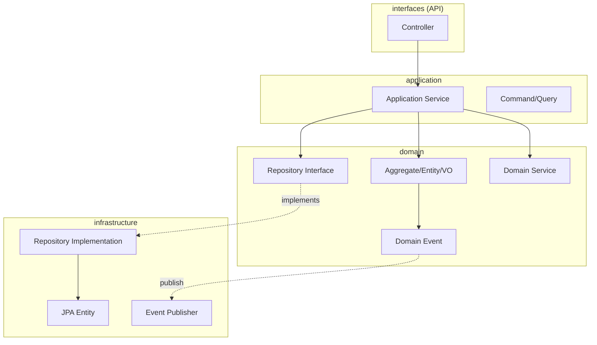
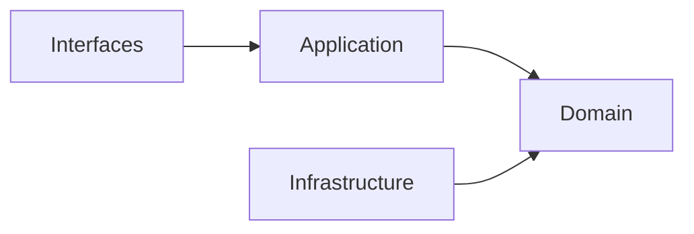

# Project Setup


- DDD layered architecture (Domain, Application, Infrastructure, Interfaces) package structure
- Spring Boot 3.2.x + Spring Kafka + JPA based dependencies
- AggregateRoot, DomainEvent, Entity base class implementations
- Docker Compose for Kafka + PostgreSQL development environment


## Target Audience and Prerequisites

| Item | Required Level |
|------|----------------|
| **Target Audience** | Backend developers looking to apply DDD patterns with Spring Boot |
| **Java** | Java 17+ syntax, Record, Stream API |
| **Spring Boot** | Spring Boot basics, DI, @Service, @Repository |
| **Gradle** | Kotlin DSL basic syntax |
| **Docker** | Experience running docker-compose up/down |

Setting up the structure and dependencies for the DDD example project.

## Project Structure

```
order-service/
├── src/main/java/com/example/order/
│   ├── domain/                    # Domain layer
│   │   ├── model/                 # Aggregate, Entity, VO
│   │   │   ├── Order.java
│   │   │   ├── OrderLine.java
│   │   │   ├── OrderId.java
│   │   │   └── Money.java
│   │   ├── event/                 # Domain events
│   │   │   ├── OrderCreatedEvent.java
│   │   │   └── OrderConfirmedEvent.java
│   │   ├── repository/            # Repository interfaces
│   │   │   └── OrderRepository.java
│   │   └── service/               # Domain services
│   │       └── OrderValidator.java
│   │
│   ├── application/               # Application layer
│   │   ├── service/               # Application Service
│   │   │   └── OrderService.java
│   │   ├── command/               # Command objects
│   │   │   └── CreateOrderCommand.java
│   │   └── dto/                   # DTOs
│   │       └── OrderResponse.java
│   │
│   ├── infrastructure/            # Infrastructure layer
│   │   ├── persistence/           # JPA implementation
│   │   │   ├── entity/
│   │   │   ├── repository/
│   │   │   └── mapper/
│   │   └── event/                 # Event publishing
│   │       └── KafkaEventPublisher.java
│   │
│   └── interfaces/                # Interface layer (API)
│       └── rest/
│           └── OrderController.java
│
├── build.gradle.kts
└── docker-compose.yml
```

## Dependency Configuration

### build.gradle.kts

```kotlin
plugins {
    java
    id("org.springframework.boot") version "3.2.1"
    id("io.spring.dependency-management") version "1.1.4"
}

group = "com.example"
version = "0.0.1-SNAPSHOT"

java {
    sourceCompatibility = JavaVersion.VERSION_21
}

repositories {
    mavenCentral()
}

dependencies {
    // Spring Boot
    implementation("org.springframework.boot:spring-boot-starter-web")
    implementation("org.springframework.boot:spring-boot-starter-data-jpa")
    implementation("org.springframework.boot:spring-boot-starter-validation")

    // Kafka (for event publishing)
    implementation("org.springframework.kafka:spring-kafka")

    // Database
    runtimeOnly("com.h2database:h2")
    runtimeOnly("org.postgresql:postgresql")

    // Lombok (optional)
    compileOnly("org.projectlombok:lombok")
    annotationProcessor("org.projectlombok:lombok")

    // Test
    testImplementation("org.springframework.boot:spring-boot-starter-test")
    testImplementation("org.springframework.kafka:spring-kafka-test")
}

tasks.withType<Test> {
    useJUnitPlatform()
}
```

## Layer Responsibilities



> **Diagram Description**: The Controller in the Interfaces layer calls the Service in the Application layer. The Service uses Aggregate/Entity and Repository Interface from the Domain layer. The Infrastructure layer provides Repository implementation, JPA Entity, and Kafka Publisher. Domain Events are published through Infrastructure.

### Dependency Rules



> **Diagram Description**: Dependencies always point inward (toward Domain). Interfaces depends on Application, Application depends on Domain, and Infrastructure implements Domain interfaces.

| Rule | Description |
|------|-------------|
| **Domain is independent** | Does not depend on other layers |
| **Dependencies flow inward** | Interfaces -> Application -> Domain |
| **Infrastructure implements Domain** | Provides Repository Interface implementations |


- **Domain Layer**: Core of business logic. Implemented in pure Java without external dependencies
- **Application Layer**: Use Case orchestration. Handles transaction boundaries and event publishing
- **Infrastructure Layer**: Technical implementation. Depends on external technologies like JPA, Kafka
- **Interfaces Layer**: External integration. REST API, message handlers, etc.


## application.yml

```yaml
spring:
  application:
    name: order-service

  datasource:
    url: jdbc:h2:mem:orderdb
    driver-class-name: org.h2.Driver
    username: sa
    password:

  jpa:
    hibernate:
      ddl-auto: create-drop
    show-sql: true
    properties:
      hibernate:
        format_sql: true

  h2:
    console:
      enabled: true
      path: /h2-console

  kafka:
    bootstrap-servers: localhost:9092
    producer:
      key-serializer: org.apache.kafka.common.serialization.StringSerializer
      value-serializer: org.springframework.kafka.support.serializer.JsonSerializer
```

## Core Base Classes

### AggregateRoot

```java
package com.example.order.domain.model;

import java.util.ArrayList;
import java.util.Collections;
import java.util.List;

public abstract class AggregateRoot<ID> {

    private final List<DomainEvent> domainEvents = new ArrayList<>();

    public abstract ID getId();

    protected void registerEvent(DomainEvent event) {
        domainEvents.add(event);
    }

    public List<DomainEvent> getDomainEvents() {
        return Collections.unmodifiableList(domainEvents);
    }

    public void clearDomainEvents() {
        domainEvents.clear();
    }
}
```

### DomainEvent

```java
package com.example.order.domain.event;

import java.time.Instant;
import java.util.UUID;

public abstract class DomainEvent {

    private final String eventId;
    private final Instant occurredAt;

    protected DomainEvent() {
        this.eventId = UUID.randomUUID().toString();
        this.occurredAt = Instant.now();
    }

    public String getEventId() {
        return eventId;
    }

    public Instant getOccurredAt() {
        return occurredAt;
    }

    public abstract String getAggregateId();
}
```

### Entity Base Class

```java
package com.example.order.domain.model;

import java.util.Objects;

public abstract class Entity<ID> {

    public abstract ID getId();

    @Override
    public boolean equals(Object o) {
        if (this == o) return true;
        if (o == null || getClass() != o.getClass()) return false;
        Entity<?> entity = (Entity<?>) o;
        return Objects.equals(getId(), entity.getId());
    }

    @Override
    public int hashCode() {
        return Objects.hash(getId());
    }
}
```


- **AggregateRoot**: Collects and manages domain events. Parent class for all Aggregates
- **DomainEvent**: Auto-generates event ID and occurrence time. Designed as immutable object
- **Entity**: ID-based equality comparison. equals/hashCode only use ID


## Docker Compose (Development Environment)

```yaml
version: '3.8'

services:
  postgres:
    image: postgres:15
    container_name: order-postgres
    environment:
      POSTGRES_DB: orderdb
      POSTGRES_USER: order
      POSTGRES_PASSWORD: order123
    ports:
      - "5432:5432"
    volumes:
      - postgres-data:/var/lib/postgresql/data

  kafka:
    image: apache/kafka:3.6.1
    container_name: kafka
    ports:
      - "9092:9092"
    environment:
      KAFKA_NODE_ID: 1
      KAFKA_PROCESS_ROLES: broker,controller
      KAFKA_LISTENERS: PLAINTEXT://0.0.0.0:9092,CONTROLLER://0.0.0.0:9093
      KAFKA_ADVERTISED_LISTENERS: PLAINTEXT://localhost:9092
      KAFKA_CONTROLLER_LISTENER_NAMES: CONTROLLER
      KAFKA_LISTENER_SECURITY_PROTOCOL_MAP: CONTROLLER:PLAINTEXT,PLAINTEXT:PLAINTEXT
      KAFKA_CONTROLLER_QUORUM_VOTERS: 1@kafka:9093
      KAFKA_OFFSETS_TOPIC_REPLICATION_FACTOR: 1
      CLUSTER_ID: MkU3OEVBNTcwNTJENDM2Qk

volumes:
  postgres-data:
```

## Package Structure Principles

### 1. Domain-Centric Packages

```
// Bad: Technology-centric
com.example.order
├── controller
├── service
├── repository
└── entity

// Good: Domain-centric
com.example.order
├── domain           # Core business logic
├── application      # Use cases
├── infrastructure   # Technical implementations
└── interfaces       # External interfaces
```

### 2. Subdomain Separation

```
com.example
├── order/           # Order domain
│   ├── domain
│   ├── application
│   └── ...
├── inventory/       # Inventory domain
│   ├── domain
│   └── ...
└── shipping/        # Shipping domain
    ├── domain
    └── ...
```


- **Domain-centric, not technology-centric**: Use domain/application/infrastructure structure instead of controller/service/repository
- **Subdomain separation**: Separate by domain (order/, inventory/, shipping/) as the system grows
- **Bounded Context reflection**: Each subdomain has its own independent layer structure


## Next Steps

- [Order Domain](order-domain/) - Aggregate, Entity, Value Object implementation
