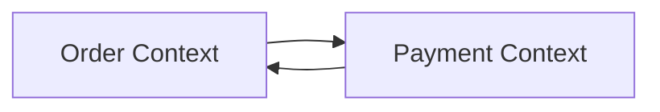
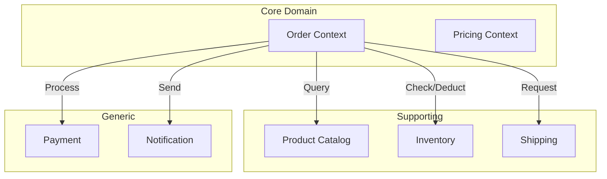

> **Problem Solved**: Unsure how to divide the system, or high inter-team dependencies due to incorrectly defined Context boundaries
> **Time Required**: ~25 min
> **Prerequisites**: Assumes you have read the [Strategic Design]() document


After completing this guide, you will be able to:
- Identify Context boundaries using 3 signals
- Validate boundaries through domain expert interviews
- Recognize and fix symptoms of incorrect boundaries


## 1. Detecting Signals That Indicate Context Boundaries

Check the following 3 signals to determine if Bounded Context separation is needed.

### 1.1 Signal 1: Same Term, Different Meanings

When talking to domain experts, if you hear "not that X, the other X", it's a signal for Context separation. Capture this signal.

```
// Real conversation example

Developer: "What fields do I need to modify product information?"

Product Team: "Product name, price, description, and images."

Logistics Team: "Oh, product? Weight, volume, and storage temperature are needed."

Developer: "Both are 'product' but with completely different attributes..."
```


When you hear "not that X", immediately take note. This is the key clue for Context separation.


In such cases, record as follows:

| Term | Meaning in Sales Context | Meaning in Logistics Context |
|------|--------------------------|------------------------------|
| Product | Information to show customers (name, price, image) | Information needed for shipping (weight, volume, temperature) |
| Order | Customer's purchase request | Shipping instruction |
| Customer | Buyer | Recipient |

### 1.2 Signal 2: Different Change Frequencies

Separate into different Contexts when the same data has different change frequencies.

```
// Change frequency analysis example

Product basic information:
├── Product name: Rarely changes (1-2 times/year)
├── Price: Frequently changes (1-2 times/week)
└── Inventory: Changes very frequently (every minute)

→ Consider separating price and inventory into separate Contexts
```

### 1.3 Signal 3: Different Teams Responsible

According to Conway's Law, system structure follows organizational structure. Divide Contexts by referring to the organizational structure as follows.

```
Organization structure:
├── Sales Team → Sales Context
├── Logistics Team → Logistics Context
├── Finance Team → Billing Context
└── CS Team → Support Context
```

**Verification questions**:

- [ ] Which team is responsible for this feature?
- [ ] Which team's approval is needed to change this feature?
- [ ] Which team responds when there's an incident?

## 2. Discovering Boundaries Through Domain Expert Interviews

### 2.1 Interview Question Template

Ask domain experts the following questions in order:

**Step 1: Understand Core Business Processes**

```
"Please explain your most important business process."
"Walk me through your day from start to finish."
"What do you do during the busiest times?"
```

**Step 2: Collect Terms**

```
"What exactly is the 'order' you just mentioned?"
"Do you use 'order' and 'request' with the same meaning or different meanings?"
"Do other teams use 'order' with the same meaning?"
```

**Step 3: Confirm Boundaries**

```
"Do you collaborate with other teams when doing this work?"
"What information do you receive from other teams?"
"What information do you pass to other teams?"
```

### 2.2 Organizing Interview Results

Organize interview results in the following format:

```
Context Candidate: Order Processing

Responsible Team: Sales Team

Core Terms:
├── Order: Customer's purchase request
├── Order Line: Individual product within an order
└── Shipping Address: Location for product delivery

Key Behaviors:
├── Create order
├── Confirm order
├── Cancel order
└── Change shipping address

Collaborating Contexts:
├── Product Catalog → Query product information
├── Inventory → Check/deduct stock
└── Shipping → Request delivery
```

## 3. Validating Context Boundaries

### 3.1 Boundary Validation Checklist

Verify you can answer "yes" to all of the following questions. If any answer is "no", reconsider the boundaries:

**Linguistic Consistency**:
- [ ] Do all terms have consistent meanings within this Context?
- [ ] Are terms with different external meanings clearly distinguished?

**Clear Responsibility**:
- [ ] Is the responsible team for this Context clear?
- [ ] Does a single team have decision-making authority for changes?

**Independence**:
- [ ] Can this Context be changed without changing other Contexts?
- [ ] Can this Context be deployed without deploying other Contexts?

### 3.2 Symptoms of Incorrect Boundaries


If you see the following symptoms, immediately reconsider the boundaries. These symptoms are clear signals of incorrect Context separation.


Review boundaries if you see these symptoms:

**Symptom 1: Circular Dependencies**



**Solution**: Merge into one or separate using events.

**Symptom 2: Excessive Synchronous Calls**

```java
// ❌ Wrong: Synchronous call chain
public void confirmOrder(OrderId orderId) {
    Order order = orderRepository.findById(orderId);
    Stock stock = stockService.checkStock(order);      // Sync call 1
    Payment payment = paymentService.process(order);   // Sync call 2
    Shipping shipping = shippingService.create(order); // Sync call 3
    order.confirm();
}
```

**Solution**: Convert to event-based asynchronous processing.

**Symptom 3: Distributed Transaction Required**

If you need to wrap data from multiple Contexts in a single transaction, reconsider the boundaries.

```java
// ❌ Wrong: Distributed transaction
@Transactional
public void confirmOrder(OrderId orderId) {
    orderRepository.save(order);      // Order DB
    stockRepository.decrease(stock);  // Stock DB (different Context)
    pointRepository.add(points);      // Point DB (another Context)
}
```

## 4. Visualizing Context Boundaries

### 4.1 Drawing a Context Map

Express discovered Contexts and their relationships in a diagram:



### 4.2 Creating a Glossary for Each Context

Create a glossary for each Context:

```markdown
## Order Context Glossary

| Term | Definition | Code | Synonym in Other Contexts |
|------|------------|------|---------------------------|
| Order | Customer's purchase request | `Order` | Shipping Context: Shipment Request |
| Order Line | Individual product within an order | `OrderLine` | - |
| Shipping Address | Location for product delivery | `ShippingAddress` | Shipping Context: Destination |
| Confirm | Change order to processable state | `confirm()` | Inventory Context: Reserve Confirmation |
```

## 5. Gradual Context Separation

### 5.1 Starting from a Monolith


Don't aim for microservices from the start. Begin with logical separation within a monolith.


Start with logical separation:

```
// Step 1: Logical separation by package
src/main/java/com/example/
├── order/      // Order Context
├── catalog/    // Product Catalog Context
├── stock/      // Inventory Context
└── shipping/   // Shipping Context

// Each Context uses only its own Repository
order/
├── OrderService.java       // Don't directly use other Context's Repository
├── OrderRepository.java
└── Order.java
```

### 5.2 Gradual Separation Strategy

**Step 1**: Package separation (logical boundary)

```java
// Same module but separated by interface
public interface ProductReader {
    ProductInfo getProduct(ProductId id);
}
```

**Step 2**: Module separation (compile boundary)

```groovy
// settings.gradle
include ':order-module'
include ':catalog-module'
include ':shared-kernel'
```

**Step 3**: Service separation (runtime boundary)

```yaml
# Deploy as separate services
services:
  order-service:
    image: order-service:1.0
  catalog-service:
    image: catalog-service:1.0
```

## Troubleshooting

### Problem: "I don't know where to draw Context boundaries"

**Solution**:

1. Find the point where term meanings change.
2. Reference team boundaries.
3. Separate data with different change frequencies.

```
Verification questions:
- "Do other teams use this term with the same meaning?"
- "Which team's approval is needed to change this feature?"
- "How often does this data change?"
```

---

### Problem: "Contexts are too small, causing high overhead"

**Symptoms**: 10+ Contexts, simple features require multiple Context calls

**Solution**:

Merge related small Contexts:

```
// Before: Excessive separation
├── ProductInfo Context
├── ProductPrice Context
├── ProductStock Context
└── ProductImage Context

// After: Appropriate merging
├── Product Catalog Context (Info + Image)
├── Pricing Context
└── Inventory Context (Stock)
```

---

### Problem: "Data synchronization between Contexts is difficult"

**Solution**:

Use event-based synchronization:

```java
// Publish event from Order Context
public class Order {
    public void confirm() {
        this.status = OrderStatus.CONFIRMED;
        registerEvent(new OrderConfirmedEvent(this.id, this.orderLines));
    }
}

// Subscribe to event in Inventory Context
@EventListener
public void handle(OrderConfirmedEvent event) {
    for (OrderLineInfo line : event.getOrderLines()) {
        Stock stock = stockRepository.findByProductId(line.getProductId());
        stock.decrease(line.getQuantity());
    }
}
```

## Next Steps

- [Strategic Design]() - Context Mapping patterns in detail
- [Defining Aggregate Boundaries]() - Internal Context design
- [Domain Events]() - Communication between Contexts
