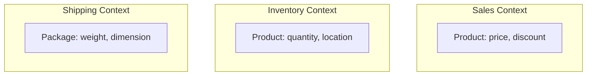
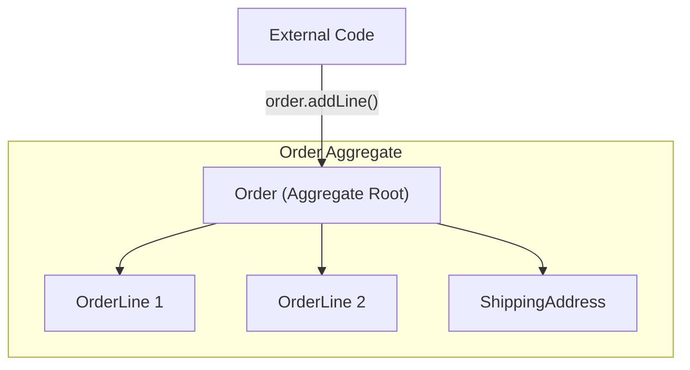
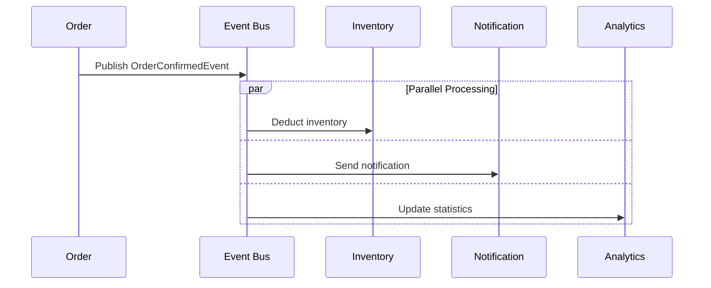

> **Target Audience**: Backend developers familiar with traditional service development but new to DDD
> **Prerequisites**: Java/Spring basics, object-oriented programming, service layer patterns
> **Time Required**: Approximately 15 minutes
> **After Reading**: You'll understand DDD's core concepts and differences from traditional approaches, and be able to decide whether to apply DDD to your project


This document is **an overview, not a tutorial**. The goal is to quickly survey DDD's core concepts and grasp the big picture. For step-by-step hands-on practice with actual code, refer to the [Hands-on Examples](../examples/) section.



- DDD coheres business logic within domain objects, aligning code with business language
- Systems are separated by Bounded Context, and transaction boundaries are defined by Aggregates
- Effective for systems with complex business rules; overkill for simple CRUD applications


This section provides a quick overview of DDD's core concepts. When developing complex business systems, you often experience problems: developers and planners using different terminology, business logic scattered throughout the codebase, small changes affecting the entire system. Situations where reading the code doesn't help you understand how the business works are also common.

## The Problem DDD Solves

If conversations like this sound familiar, DDD can help.

```
Planner: "When a customer cancels an order, refund their points"
Developer: "Oh, so I change the status to 9 in the order table,
           then INSERT into the point table with that user_id?"
Planner: "...What? What does status 9 mean?"
```

This gap occurs because code is written with a technology-centric focus. DDD bridges this gap by reflecting the business domain directly in code. When the business says "Order", "Payment", "Shipping", the code maps 1:1 with Order, Payment, Shipping.

## Before vs After: Real Code Comparison

Let's compare traditional and DDD approaches through an order confirmation business scenario. The business rules are: only pending orders can be confirmed, confirmation deducts inventory, and sends notification to the customer.

**Traditional Approach: Data-Centric (Transaction Script)**

The code below shows order confirmation logic written in the traditional approach. In this approach, the service class contains all business logic, and entities serve merely as data containers.

```java
@Service
public class OrderService {

    public void confirmOrder(Long orderId) {
        // 1. Query data
        OrderEntity order = orderRepository.findById(orderId)
            .orElseThrow(() -> new RuntimeException("Order not found"));

        // 2. Validate status (magic number)
        if (order.getStatus() != 0) {  // What's 0? PENDING?
            throw new RuntimeException("Cannot confirm");
        }

        // 3. Update status
        order.setStatus(1);  // What's 1? CONFIRMED?
        order.setConfirmedAt(LocalDateTime.now());

        // 4. Deduct inventory (should this be here?)
        for (OrderItemEntity item : order.getItems()) {
            ProductEntity product = productRepository.findById(item.getProductId())
                .orElseThrow();
            int newStock = product.getStock() - item.getQuantity();
            if (newStock < 0) {
                throw new RuntimeException("Insufficient stock");
            }
            product.setStock(newStock);
            productRepository.save(product);
        }

        // 5. Notification (should this be here?)
        notificationService.send(order.getUserId(), "Order confirmed");

        orderRepository.save(order);
    }
}
```

The problems with this code are summarized below. You can't tell what status values 0 and 1 mean just from the code. The Entity is an anemic model with only getters/setters, and validation, inventory deduction, and notification logic are mixed in one method. Unit testing is difficult due to dependencies on database and external services, and status can be directly modified from elsewhere, which is dangerous.

| Problem | Description |
|---------|-------------|
| Magic numbers | Unknown meaning of `status = 0, 1` |
| Anemic model | Entity is just a data container with getters/setters |
| Scattered logic | Validation, inventory, notification mixed in one method |
| Hard to test | Unit testing impossible due to DB, external service dependencies |
| Risk of change | Status can be directly modified from elsewhere |

**DDD Approach: Domain-Centric**

In the DDD approach, business logic coheres within domain objects. The code below shows an example where the Order Aggregate protects its own invariants and expresses business behavior as methods.

```java
// Domain Model - Business logic inside the object
public class Order extends AggregateRoot<OrderId> {
    private OrderId id;
    private CustomerId customerId;
    private OrderStatus status;
    private List<OrderLine> orderLines;

    // Business behavior expressed as methods
    public void confirm() {
        // Invariant validation
        if (this.status != OrderStatus.PENDING) {
            throw new OrderCannotBeConfirmedException(
                "Only pending orders can be confirmed. Current status: " + this.status
            );
        }

        // State change
        this.status = OrderStatus.CONFIRMED;
        this.confirmedAt = LocalDateTime.now();

        // Publish domain event (inventory, notification handled by event subscribers)
        registerEvent(new OrderConfirmedEvent(this));
    }

    public Money calculateTotal() {
        return orderLines.stream()
            .map(OrderLine::getAmount)
            .reduce(Money.ZERO, Money::add);
    }
}
```

The application service only orchestrates flow and delegates actual business logic to domain objects.

```java
// Application Service - Orchestrates flow only
@Service
@Transactional
public class OrderApplicationService {

    public void confirmOrder(OrderId orderId) {
        Order order = orderRepository.findById(orderId)
            .orElseThrow(() -> new OrderNotFoundException(orderId));

        order.confirm();  // Delegate to domain object

        orderRepository.save(order);
        // Events are automatically published by infrastructure
    }
}
```

Inventory deduction and notification are separated into event handlers, clearly separating concerns.

```java
// Event Handlers - Separation of concerns
@Component
public class InventoryEventHandler {
    @EventListener
    public void on(OrderConfirmedEvent event) {
        inventoryService.reserveStock(event.getOrderLines());
    }
}

@Component
public class NotificationEventHandler {
    @EventListener
    public void on(OrderConfirmedEvent event) {
        notificationService.sendOrderConfirmation(event.getCustomerId());
    }
}
```

The improvements from the DDD approach are summarized below. `order.confirm()` clearly expresses business intent, and Order protects its own invariants. Inventory and notification are separated into event handlers for clear separation of concerns, and Order can be unit tested alone. Status can only be changed through the confirm() method, making it safe.

| Improvement | Description |
|-------------|-------------|
| Clear intent | `order.confirm()` expresses business intent |
| Rich model | Order protects its own invariants |
| Separation of concerns | Inventory, notification separated into event handlers |
| Easy to test | Order can be unit tested |
| Safe to change | Status can only be changed through `confirm()` method |

## Two Levels of Design in DDD

DDD is divided into two levels: Strategic Design and Tactical Design. Strategic Design answers the big picture question "How do we divide the system?", covering Bounded Context, Context Mapping, Ubiquitous Language, and Subdomain. Tactical Design answers the detailed implementation question "How do we model the domain?", providing patterns like Entity, Value Object, Aggregate, Repository, Domain Service, and Domain Event.

| Category | Focus | Question | Key Deliverables |
|----------|-------|----------|------------------|
| Strategic Design | Big picture, boundaries | "How do we divide the system?" | Context Map, Glossary |
| Tactical Design | Details, patterns | "How do we model the domain?" | Domain Model, Code |

## Key Terms at a Glance

**Bounded Context**

The same term can have different meanings depending on context. For example, "Product" focuses on "how much to sell it for" (price, discount) in the Sales Context, "how many do we have" (quantity, location) in the Inventory Context, and "how to ship it" (weight, dimensions) in the Shipping Context. Each Context has its own model, allowing each domain's complexity to be managed independently.



**Aggregate**

An Aggregate is a cluster of objects that maintain transactional consistency. External access must go through the Aggregate Root, only one Aggregate is modified per transaction, and the Root is responsible for internal consistency. In the diagram below, Order is the Aggregate Root, and OrderLine and ShippingAddress are only accessible through Order.



**Ubiquitous Language**

Developers and business experts use the same terminology. When a planner says "Order Confirmation", developers write code as `order.confirm()`, and QA names test cases as "Order Confirmation Test". When business terminology, code, and tests use consistent language, communication misunderstandings decrease and code intent becomes easier to understand.

| Business Term | Code | Test |
|--------------|------|------|
| **Create** an order | `Order.create()` | `testOrderCreation()` |
| **Confirm** an order | `order.confirm()` | `testOrderConfirmation()` |
| **Cancel** an order | `order.cancel()` | `testOrderCancellation()` |
| **Change** shipping address | `order.changeShippingAddress()` | `testShippingAddressChange()` |

**Domain Event**

A Domain Event represents a significant occurrence in the domain. Events are named in past tense to indicate something that has already happened (e.g., OrderConfirmed), are immutable after publishing, and contain all information needed for processing. Events enable loose coupling communication with other domain areas.



## When Should You Apply DDD?

When deciding whether to apply DDD, consider the complexity of business logic, the need for collaboration with domain experts, and the expected lifespan of the system. DDD is effective in fields with complex business rules like finance, insurance, logistics, and healthcare, or startups and new ventures expecting frequent requirement changes. It's also suitable for systems where domain experts are available for collaboration and long-term operation of 5+ years is expected.

On the other hand, Spring Data REST may be better for simple CRUD applications, fast implementation for prototypes, simple layered architecture for small teams, and pragmatic approaches for short-lived projects.

## Common Problems

Here are common problems encountered when first applying DDD and their solutions.

**Problem 1: "I don't know where to set Aggregate boundaries"**

```
Symptom: Putting everything in one Aggregate, or conversely, dividing too small
Cause: Not clearly understanding the concept of invariants
```

**Solution:** Ask "Must these pieces of data always maintain consistency together?" For example, Order and OrderLine must change together, so they're in the same Aggregate. But Customer can change independently from Order, so it's a separate Aggregate.

---

**Problem 2: "Business logic keeps ending up in Service"**

```
Symptom: Entity has only getters/setters, Service keeps growing
Cause: "Anemic Domain Model" anti-pattern
```

**Solution:** Ask "Does this logic change the Entity's state?" If so, put it as a method inside that Entity.

```java
// ❌ Logic in Service
orderService.cancel(orderId, reason);

// ✅ Logic in Entity
order.cancel(reason);
```

---

**Problem 3: "I don't know how to divide Bounded Contexts"**

```
Symptom: One massive monolithic domain model
Cause: Unclear Context separation criteria
```

**Solution:** Look for these signals:
- The same term is used with different meanings (e.g., "Product" has different attributes for sales team vs logistics team)
- Areas owned by different teams
- Data with different lifecycles

---

**Problem 4: "Should I separate JPA Entity and Domain Entity?"**

```
Symptom: @Entity annotation polluting domain model
Cause: Confusion between infrastructure concerns and domain boundaries
```

**Solution:** Choose based on project scale:
- **Small/Short-term:** No need to separate (pragmatic approach)
- **Medium+ scale:** Recommended to separate Domain Model and JPA Entity, convert with Mapper

---

## Next Steps

Now that you understand the core concepts, let's dive deeper. Starting from Quick Start, learn Bounded Context and Context Mapping in [Strategic Design](../concepts/strategic-design/), study Entity, Value Object, and Aggregate patterns in [Tactical Design](../concepts/tactical-design/), then learn Hexagonal and Clean Architecture in [Architecture](../concepts/architecture/) and finish with hands-on examples—this is the recommended learning path.
