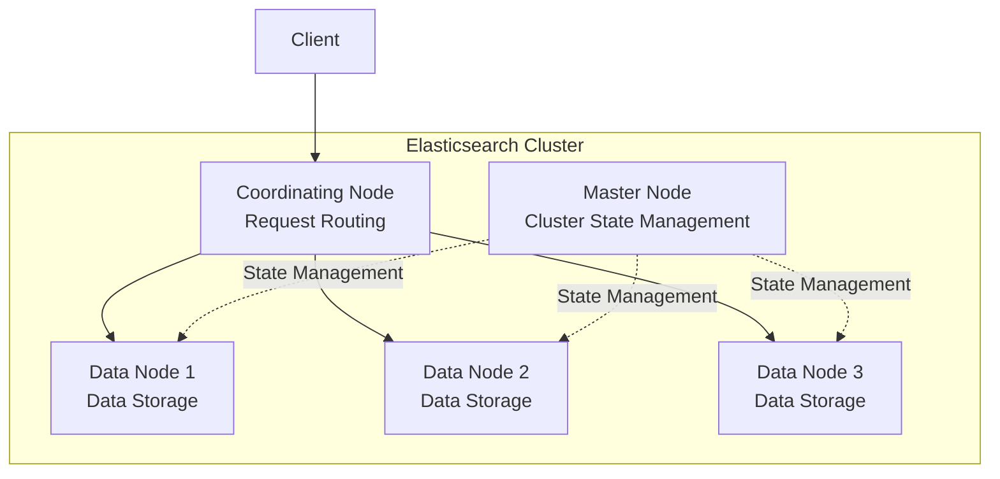

Learn how to configure nodes, allocate shards, and monitor status in an Elasticsearch cluster.

Elasticsearch was designed from the ground up as a **distributed system**. Even when starting with a single node, it operates internally as a cluster. Thanks to this distributed architecture, you can scale horizontally by simply adding nodes as data grows, and the service can continue even when some nodes experience failures.

However, distributed systems introduce different complexities than single servers. You need to understand role distribution among nodes, physical shard placement, master election processes, and behavior during network partitions to operate stably. In particular, **incorrect Master node configuration can bring down the entire cluster**, and **unbalanced shard placement can concentrate load on specific nodes**. This document covers core concepts and practical know-how for stable cluster operation.

## Cluster Architecture

### Basic Architecture



---

## Node Roles

### Role Types

| Role | Configuration | Function |
|------|---------------|----------|
| **master** | `node.roles: [master]` | Cluster state management, index creation/deletion |
| **data** | `node.roles: [data]` | Document storage, search/aggregation execution |
| **data_content** | `node.roles: [data_content]` | Hot data storage |
| **data_hot** | `node.roles: [data_hot]` | Active read/write data |
| **data_warm** | `node.roles: [data_warm]` | Read-heavy data |
| **data_cold** | `node.roles: [data_cold]` | Inactive data |
| **ingest** | `node.roles: [ingest]` | Pre-indexing pipeline processing |
| **ml** | `node.roles: [ml]` | Machine learning tasks |
| **coordinating** | `node.roles: []` | Request routing only (empty array) |

### Production Recommended Configuration

```yaml
# Master Node (3 recommended)
node.roles: [master]
node.name: master-1

# Data Node
node.roles: [data, ingest]
node.name: data-1

# Coordinating Node
node.roles: []
node.name: coord-1
```

### Minimum Configuration

| Cluster Size | Recommended Configuration |
|--------------|---------------------------|
| Development/Test | 1 node (all roles) |
| Small | 3 nodes (master + data combined) |
| Medium | 3 master + 3 data |
| Large | 3 master + N data + 2 coordinating |

---

## Cluster Status

### Status Check

```json
GET /_cluster/health
```

```json
{
  "cluster_name": "my-cluster",
  "status": "green",
  "number_of_nodes": 5,
  "number_of_data_nodes": 3,
  "active_primary_shards": 50,
  "active_shards": 100,
  "relocating_shards": 0,
  "initializing_shards": 0,
  "unassigned_shards": 0
}
```

### Status Meanings

| Status | Meaning | Action |
|--------|---------|--------|
| 🟢 **green** | All Primary/Replica assigned | Normal |
| 🟡 **yellow** | Primary OK, some Replica unassigned | Check/add nodes |
| 🔴 **red** | Some Primary unassigned | Immediate action required |

### Detailed Diagnosis

```json
GET /_cluster/health?level=indices
GET /_cluster/health?level=shards
GET /_cluster/allocation/explain
```

---

## Shard Allocation

### Shard Placement Rules

1. Primary and Replica are placed on **different nodes**
2. Shards of the same index are **evenly distributed**
3. No allocation to nodes with **over 80%** disk usage

### Allocation Settings

```json
PUT /_cluster/settings
{
  "persistent": {
    "cluster.routing.allocation.enable": "all",
    "cluster.routing.allocation.disk.threshold_enabled": true,
    "cluster.routing.allocation.disk.watermark.low": "85%",
    "cluster.routing.allocation.disk.watermark.high": "90%",
    "cluster.routing.allocation.disk.watermark.flood_stage": "95%"
  }
}
```

### Shard Rebalancing

```json
// Manual shard move
POST /_cluster/reroute
{
  "commands": [
    {
      "move": {
        "index": "products",
        "shard": 0,
        "from_node": "node-1",
        "to_node": "node-2"
      }
    }
  ]
}
```

### Unassigned Shard Diagnosis

```json
GET /_cluster/allocation/explain
{
  "index": "products",
  "shard": 0,
  "primary": true
}
```

---

## Node Management

### Node List

```bash
GET /_cat/nodes?v&h=name,ip,role,master,heap.percent,disk.used_percent
```

```
name    ip          role  master heap.percent disk.used_percent
data-1  10.0.0.1    d     -      45           60
data-2  10.0.0.2    d     -      52           55
master-1 10.0.0.3   m     *      30           20
```

### Adding a Node

1. Install Elasticsearch on new node
2. Configure `elasticsearch.yml`:
   ```yaml
   cluster.name: my-cluster
   node.name: data-4
   network.host: 10.0.0.4
   discovery.seed_hosts: ["10.0.0.1", "10.0.0.2", "10.0.0.3"]
   ```
3. Start Elasticsearch → Automatically joins cluster

### Safe Node Removal

```json
// 1. Exclude from shard allocation
PUT /_cluster/settings
{
  "transient": {
    "cluster.routing.allocation.exclude._name": "data-4"
  }
}

// 2. Wait for shard migration to complete
GET /_cat/shards?v&h=index,shard,prirep,node

// 3. Shut down node
// 4. Remove exclusion setting
PUT /_cluster/settings
{
  "transient": {
    "cluster.routing.allocation.exclude._name": null
  }
}
```

---

## Rolling Restart

Zero-downtime cluster restart:

### Procedure

```json
// 1. Disable shard reallocation
PUT /_cluster/settings
{
  "persistent": {
    "cluster.routing.allocation.enable": "primaries"
  }
}

// 2. Flush (optional)
POST /_flush/synced

// 3. Restart nodes one by one
// - Stop node
// - Change settings/upgrade
// - Start node
// - Verify cluster status is green before next node

// 4. Re-enable shard reallocation
PUT /_cluster/settings
{
  "persistent": {
    "cluster.routing.allocation.enable": "all"
  }
}
```

### During Version Upgrade

```bash
# 1. Create snapshot (backup)
PUT /_snapshot/my_backup/pre_upgrade

# 2. Perform rolling restart

# 3. Verify upgrade complete
GET /
```

---

## Monitoring

### Key APIs

```bash
# Cluster health
GET /_cluster/health

# Node statistics
GET /_nodes/stats

# Index statistics
GET /_stats

# Shard status
GET /_cat/shards?v

# Thread pool
GET /_cat/thread_pool?v

# Slow logs
GET /_cat/indices?v&h=index,health,pri,rep,docs.count,store.size
```

### Key Monitoring Metrics

| Metric | Normal Range | How to Check |
|--------|--------------|--------------|
| Cluster Status | green | `/_cluster/health` |
| JVM Heap Usage | < 75% | `/_nodes/stats/jvm` |
| Disk Usage | < 80% | `/_cat/allocation` |
| Search Latency | < 100ms | `/_nodes/stats/indices/search` |
| Indexing Latency | < 50ms | `/_nodes/stats/indices/indexing` |

### Kibana Stack Monitoring

1. Kibana → Stack Monitoring menu
2. View Cluster, Node, Index dashboards
3. Configure alert rules

---

## Cluster Settings

### Setting Types

| Type | Persistence | Use Case |
|------|-------------|----------|
| `transient` | Reset on restart | Temporary adjustments |
| `persistent` | Permanently stored | Operational settings |
| `elasticsearch.yml` | File-based | Per-node settings |

### View/Change Settings

```json
// View current settings
GET /_cluster/settings?include_defaults=true

// Change settings
PUT /_cluster/settings
{
  "persistent": {
    "cluster.routing.allocation.enable": "all"
  }
}
```

---

## Troubleshooting

### Yellow Status

**Cause:** Not enough nodes to allocate Replicas

**Solution:**
1. Add nodes
2. Or reduce Replica count:
   ```json
   PUT /products/_settings
   { "number_of_replicas": 0 }
   ```

### Red Status

**Cause:** Primary shard unassigned

**Solution:**
```json
// 1. Identify cause
GET /_cluster/allocation/explain

// 2. Force allocation (potential data loss)
POST /_cluster/reroute
{
  "commands": [
    {
      "allocate_stale_primary": {
        "index": "products",
        "shard": 0,
        "node": "data-1",
        "accept_data_loss": true
      }
    }
  ]
}
```

### Disk Full

```json
// Temporarily adjust watermark
PUT /_cluster/settings
{
  "transient": {
    "cluster.routing.allocation.disk.watermark.flood_stage": "98%"
  }
}

// Delete old indices or add disk
```

---

## Next Steps

| Goal | Recommended Document |
|------|---------------------|
| Search optimization | [Performance Tuning](performance-tuning/) |
| Failure response | [High Availability](high-availability/) |
| Practical implementation | [Product Search System](../examples/product-search/) |
