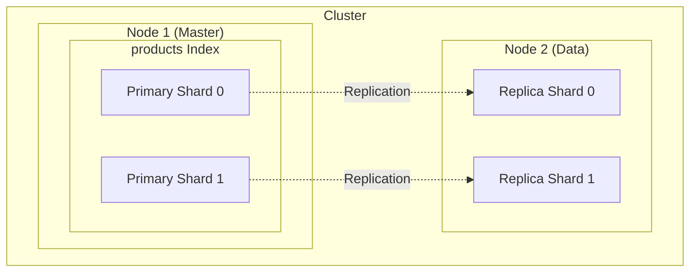
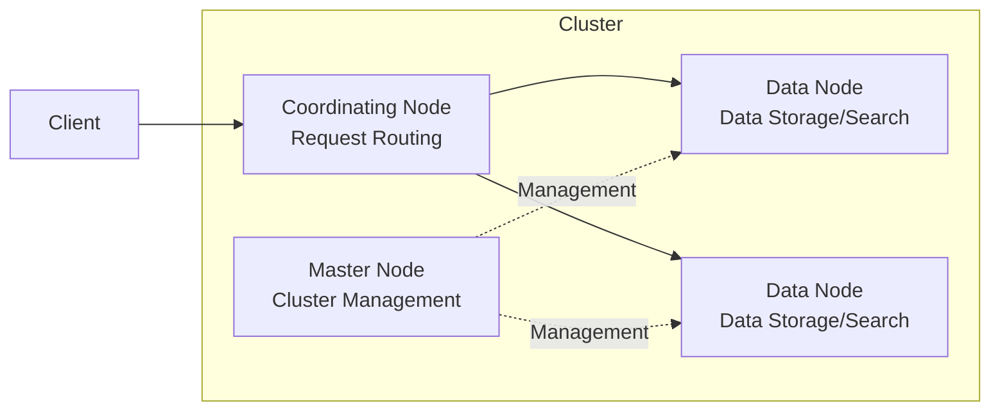
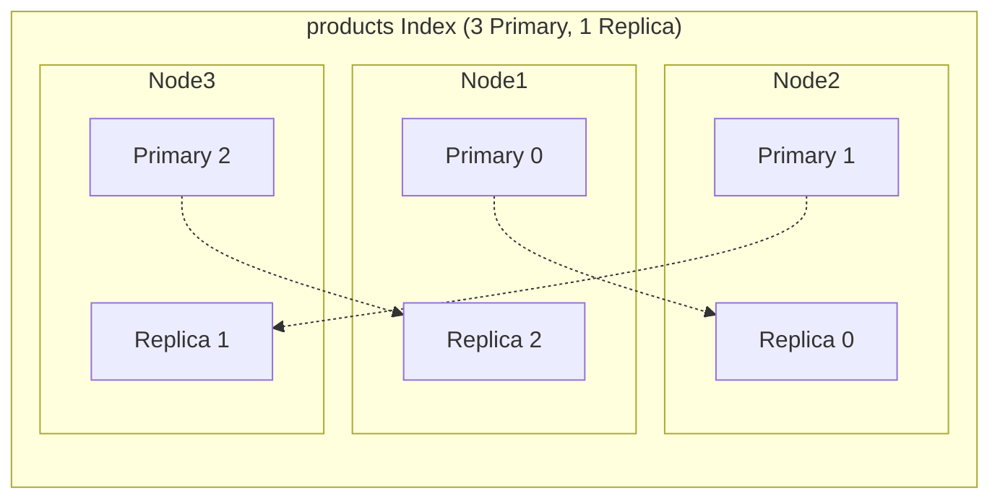
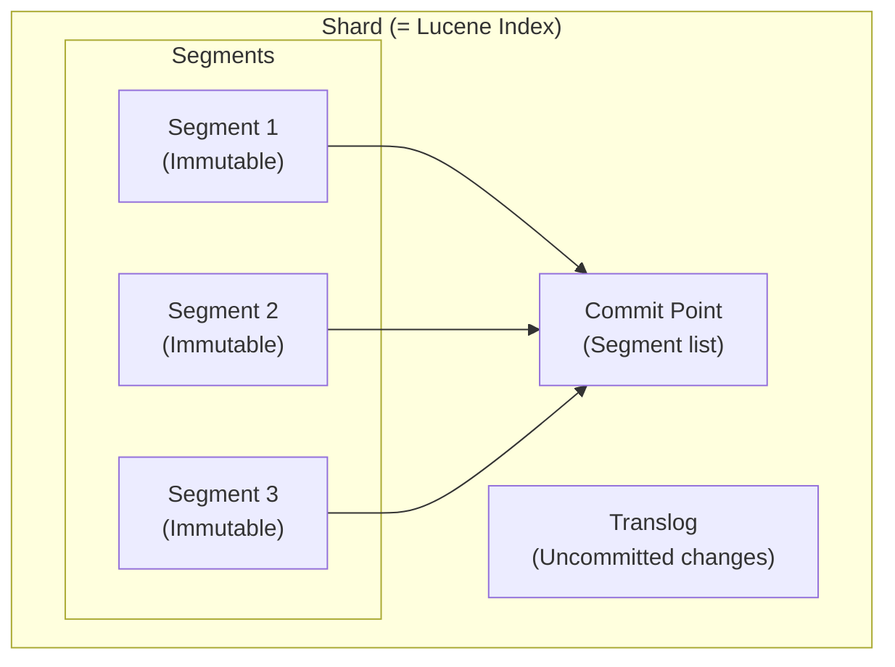
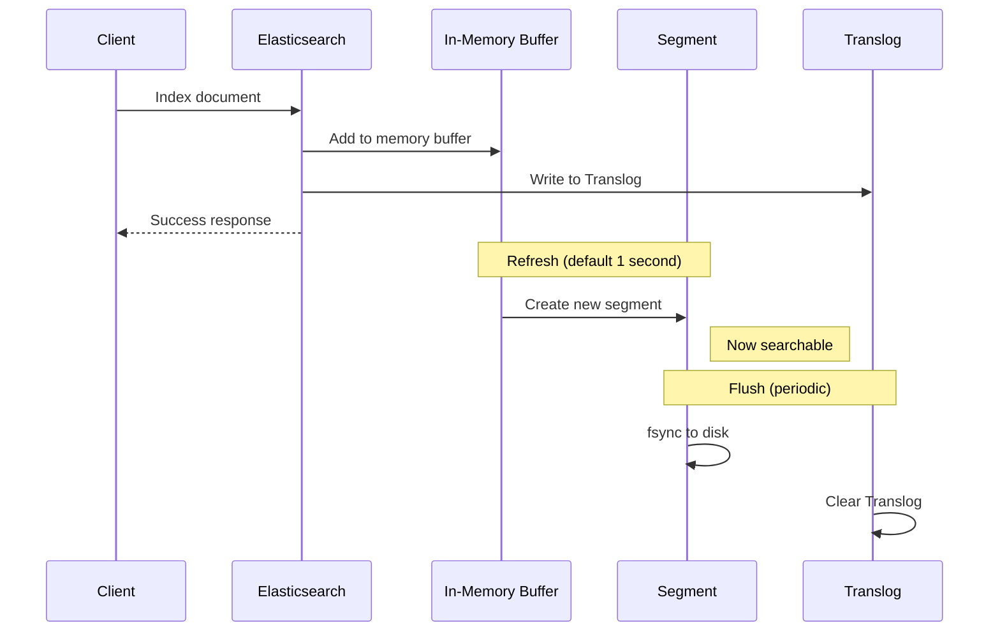
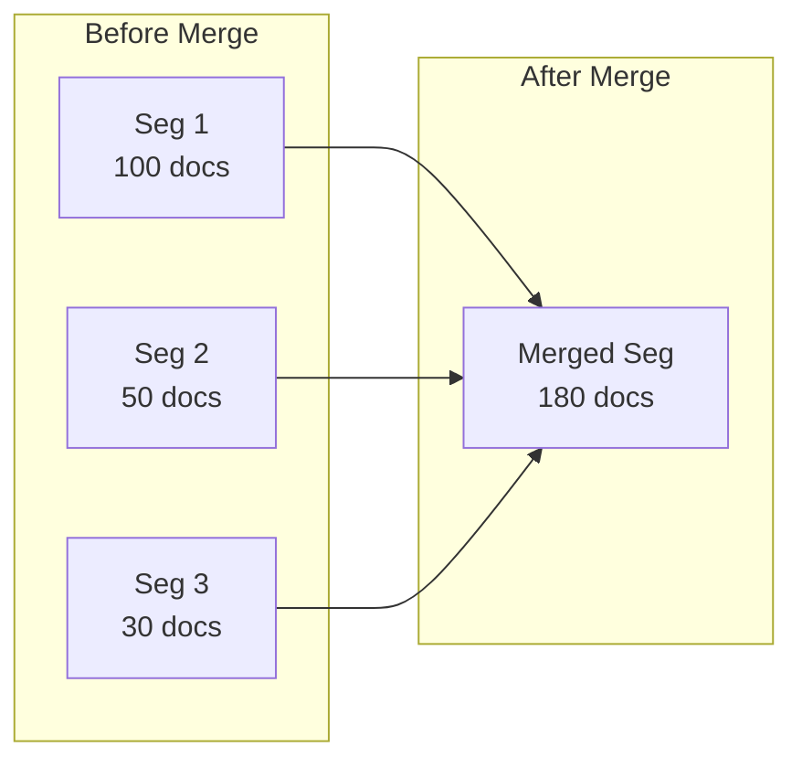
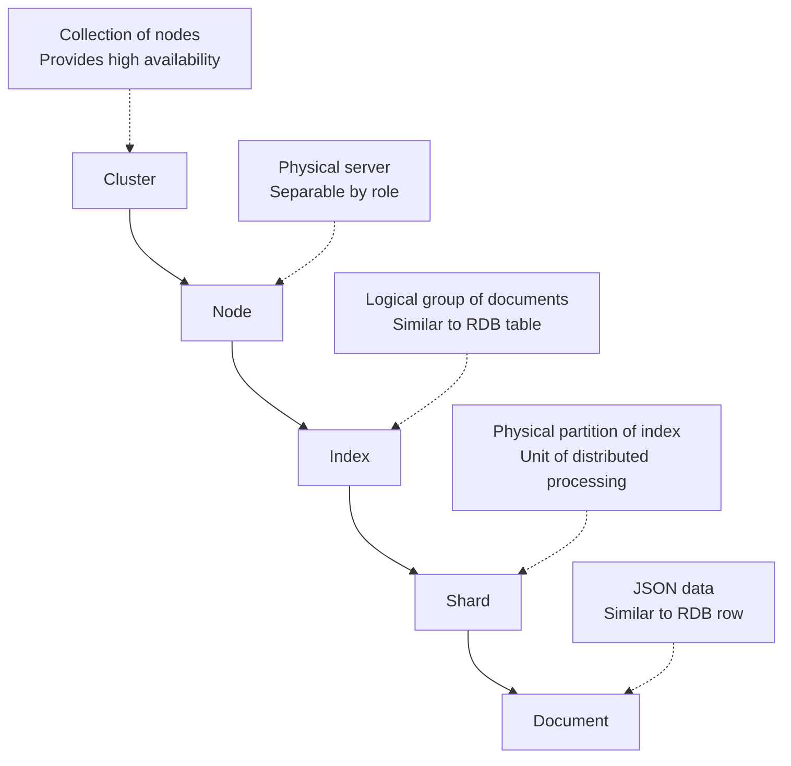


- **Cluster**: A group of servers providing high availability and distributed processing
- **Node**: A single Elasticsearch server in the cluster (Master, Data, Coordinating roles)
- **Index**: A logical collection of documents (similar to RDB table)
- **Document**: A JSON data unit (similar to RDB row)
- **Shard**: A horizontal partition of an index (consists of Primary/Replica)


**Target Audience**: Developers new to Elasticsearch
**Prerequisites**: JSON basics, REST API concepts

Understand the roles and relationships of Elasticsearch's core components: Cluster, Node, Index, Document, and Shard.

## Overall Architecture



*Diagram: Shows the structure where a Master node and Data node exist in the cluster, with Primary Shards of the products index being replicated to Replica Shards on a different node.*

## Cluster

A **cluster** is a group of Elasticsearch servers consisting of one or more nodes.

### Key Characteristics

- Identified by a unique name (default: `elasticsearch`)
- Nodes with the same cluster name automatically connect
- Distributes data and load across multiple nodes

### Cluster Status

| Status | Meaning | Action |
|--------|---------|--------|
| 🟢 Green | All shards healthy | Normal operation |
| 🟡 Yellow | Primary OK, some Replicas unassigned | Consider adding nodes |
| 🔴 Red | Some Primary shards unassigned | Immediate action required |

```bash
# Check cluster health
GET /_cluster/health
```

```json
{
  "cluster_name": "my-cluster",
  "status": "green",
  "number_of_nodes": 3,
  "active_primary_shards": 10,
  "active_shards": 20
}
```


- A cluster is identified by its unique name, and nodes with the same name automatically connect
- Cluster status (Green/Yellow/Red) allows you to grasp the overall system health at a glance
- Check current status with the `/_cluster/health` API


---

## Node

A **node** is a single Elasticsearch server that is part of a cluster.

### Node Roles



*Diagram: Shows the flow where client requests are routed through the Coordinating node to Data nodes, with the Master node managing everything.*

| Role | Description | Configuration |
|------|-------------|---------------|
| **Master** | Cluster state management, index creation/deletion | `node.roles: [master]` |
| **Data** | Data storage, search/aggregation execution | `node.roles: [data]` |
| **Coordinating** | Route search requests, merge results | `node.roles: []` |
| **Ingest** | Pre-process data before indexing | `node.roles: [ingest]` |

> In **small clusters**, a single node may perform multiple roles.

### Check Node Information

```bash
GET /_nodes
```


- Nodes can perform various roles such as Master, Data, Coordinating, and Ingest
- In small clusters, a single node performs multiple roles; in large clusters, roles are separated
- Check node information with the `/_nodes` API


---

## Index

An **index** is a collection of documents with similar characteristics. It's analogous to a table in RDB.

### RDB vs Elasticsearch

| RDB | Elasticsearch |
|-----|---------------|
| Database | Cluster |
| Table | Index |
| Row | Document |
| Column | Field |
| Schema | Mapping |

### Creating an Index

```json
PUT /products
{
  "settings": {
    "number_of_shards": 3,
    "number_of_replicas": 1
  },
  "mappings": {
    "properties": {
      "name": { "type": "text" },
      "price": { "type": "integer" },
      "category": { "type": "keyword" }
    }
  }
}
```

### Index Settings

| Setting | Default | Description |
|---------|---------|-------------|
| `number_of_shards` | 1 | Number of Primary shards (cannot change after creation) |
| `number_of_replicas` | 1 | Number of Replica shards (dynamically changeable) |
| `refresh_interval` | 1s | Interval until searchable |

### Index Management

```bash
# List indices
GET /_cat/indices?v

# Index information
GET /products

# Delete index
DELETE /products
```


- An index is similar to an RDB table and has a Mapping (schema)
- `number_of_shards` cannot be changed after creation, so choose carefully
- `number_of_replicas` can be changed dynamically


---

## Document

A **document** is a JSON data unit stored in an index. It's analogous to a Row in RDB.

### Document Structure

```json
{
  "_index": "products",      // Parent index
  "_id": "1",                // Unique document ID
  "_version": 1,             // Version (increments on update)
  "_source": {               // Actual data
    "name": "MacBook Pro",
    "price": 2390000,
    "category": "Laptop"
  }
}
```

### Document CRUD

```bash
# Create (with ID)
PUT /products/_doc/1
{
  "name": "MacBook Pro",
  "price": 2390000
}

# Create (auto-generate ID)
POST /products/_doc
{
  "name": "iPad"
}

# Read
GET /products/_doc/1

# Update
POST /products/_update/1
{
  "doc": {
    "price": 2290000
  }
}

# Delete
DELETE /products/_doc/1
```


- Documents are stored in JSON format and uniquely identified by `_id`
- Concurrency control is possible with `_version`
- CRUD operations are performed via RESTful API (PUT/POST/GET/DELETE)


---

## Shard

A **shard** is a horizontal partition of an index. It enables distributed storage and parallel processing.

### Primary Shard vs Replica Shard



*Diagram: Shows the structure where 3 Primary Shards are distributed across different nodes, with each Primary's Replica placed on a different node for fault tolerance.*

| Type | Role | Characteristic |
|------|------|----------------|
| **Primary** | Stores original data | Fixed count at index creation |
| **Replica** | Copy of Primary | Improves read performance, failover backup |

### How Shards Work

**Write:**
1. Calculate hash from document ID
2. Determine responsible Primary shard: `shard = hash(id) % number_of_shards`
3. Write to Primary, then replicate to Replica

**Read:**
1. Coordinating node receives request
2. Parallel requests to all relevant shards (Primary or Replica)
3. Merge and return results

### Shard Count Guidelines

| Data Scale | Recommended Primary Shards |
|------------|---------------------------|
| Few GB | 1 |
| Tens of GB | 2-5 |
| Hundreds of GB | 5-10 |
| TB or more | 10+ (consider node count) |

> **Rule of Thumb:** 20-40GB per shard is optimal.

### Check Shard Information

```bash
# Shard allocation status
GET /_cat/shards/products?v

# Example output
index    shard prirep state   docs store node
products 0     p      STARTED 100  50mb  node-1
products 0     r      STARTED 100  50mb  node-2
products 1     p      STARTED 120  55mb  node-2
products 1     r      STARTED 120  55mb  node-1
```


- Primary Shards cannot be changed after creation, Replicas can be changed dynamically
- The responsible shard is determined by the hash value of the document ID: `shard = hash(id) % number_of_shards`
- 20-40GB per shard is the optimal size


---

## Inverted Index

The core principle behind Elasticsearch's fast search.

### Forward Index vs Inverted Index

**Forward Index:**
```
doc1 → [MacBook, Pro, 14-inch]
doc2 → [MacBook, Air, 13-inch]
```

**Inverted Index:**
```
MacBook → [doc1, doc2]
Pro     → [doc1]
Air     → [doc2]
14-inch → [doc1]
13-inch → [doc2]
```

### Search Process

When searching "MacBook Pro":
1. "MacBook" → [doc1, doc2]
2. "Pro" → [doc1]
3. Intersection: doc1

> **Key Point:** Finds results directly from the inverted index without scanning all documents.


- The inverted index is structured as "term → document list"
- It's called "inverted" because it's the opposite direction of a forward index (document → terms)
- Fast search is possible through intersection/union operations on search terms


---

## Lucene Internals (Advanced)

Elasticsearch internally uses the **Apache Lucene** library. Each shard is a Lucene index.

### Segment Structure



*Diagram: Shows the structure where multiple immutable Segments exist inside a shard, with a Commit Point tracking the active segment list and Translog storing uncommitted changes.*

| Component | Role | Characteristic |
|-----------|------|----------------|
| **Segment** | File containing the actual inverted index | **Immutable** - once written, never modified |
| **Commit Point** | List of currently active segments | Tracks segments for search |
| **Translog** | Change log | For crash recovery, protects data before fsync |

### Document Indexing Process



*Diagram: Shows the process where document indexing writes to memory buffer and Translog, then Refresh creates a new segment making it searchable, and Flush permanently saves to disk.*

### Why are Segments Immutable?

1. **Concurrency Guarantee**: Read without locks
2. **Cache Efficiency**: Maximize OS file system cache
3. **Stability**: Reduced risk of data corruption

> **Downside**: Deletes/updates don't actually remove data, just mark as "deleted" → Merged later

### Segment Merge

Too many segments degrade performance. Elasticsearch merges segments in the background:



*Diagram: Shows the process where multiple small segments (Seg 1, 2, 3) are merged into one larger segment.*

**What happens during merge:**
- Documents marked as deleted are physically removed
- Multiple segments → One larger segment
- I/O load generated (monitor in production)

### Refresh vs Flush vs Merge

| Operation | Trigger | Result | Performance Impact |
|-----------|---------|--------|-------------------|
| **Refresh** | Every 1 second (default) | Buffer → New segment (searchable) | Low |
| **Flush** | Periodic / translog size | Segment fsync + translog clear | Medium |
| **Merge** | Background | Multiple segments → One | High (I/O intensive) |

### Near Real-Time (NRT) Search

Elasticsearch provides "**Near Real-Time (NRT)**" search, not true real-time:

```
Document indexed → (up to 1 second wait) → Refresh → Searchable
```

- **Default refresh_interval**: 1 second
- **For immediate search**: `?refresh=true` parameter (watch performance)
- **For bulk indexing**: Disable with `refresh_interval: -1`, then manual refresh when complete

```json
// Bulk indexing optimization
PUT /products/_settings
{ "refresh_interval": "-1" }

// After indexing complete
POST /products/_refresh

PUT /products/_settings
{ "refresh_interval": "1s" }
```


- Segments are immutable, so deletes/updates only "mark as deleted" and are merged later
- Refresh (1 second) makes searchable, Flush permanently saves to disk
- Elasticsearch provides "Near Real-Time (NRT)" search; use `?refresh=true` for immediate search (watch performance)


---

## Summary



*Diagram: Summarizes the hierarchical structure Cluster → Node → Index → Shard → Document and the role of each component.*

---

## Next Steps

| Goal | Recommended Document |
|------|---------------------|
| Schema design | [Data Modeling]() |
| Write search queries | [Query DSL]() |
| Hands-on practice | [Basic Examples]() |
