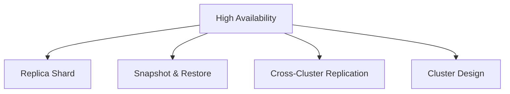
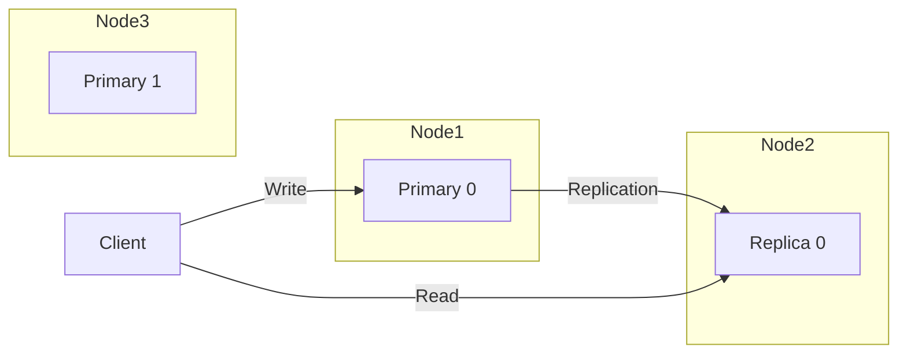
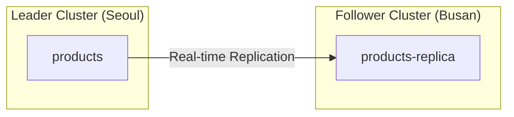
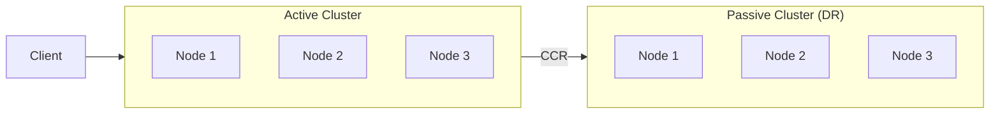
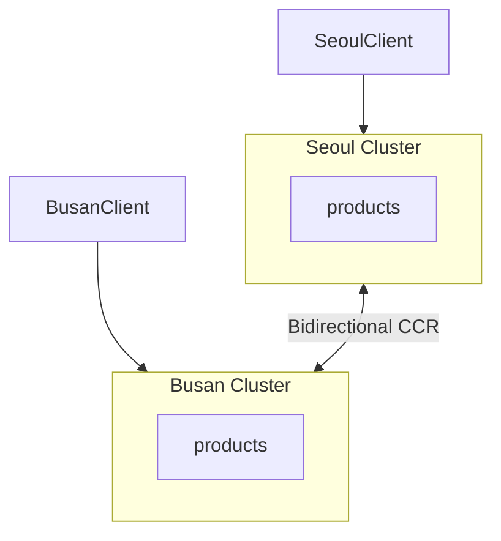

Learn about Elasticsearch cluster Replica, Snapshot, and failure response strategies.

## High Availability Concepts

### HA (High Availability) Goals

| Metric | Description | Target |
|--------|-------------|--------|
| **Availability** | Service uptime | 99.9% (8.76 hours downtime/year) |
| **Durability** | Data loss prevention | 99.999999% (9-nines) |
| **Recovery Time** | Failure to recovery | < 30 minutes |

### HA Components



---

## Replica Shard

### Role



1. **Data Redundancy**: Replica is promoted when Primary fails
2. **Read Performance**: Search requests distributed

### Replica Configuration

```json
PUT /products
{
  "settings": {
    "number_of_shards": 3,
    "number_of_replicas": 1
  }
}
```

### Dynamic Change

```json
PUT /products/_settings
{
  "number_of_replicas": 2
}
```

### Recommended Settings

| Environment | number_of_replicas |
|-------------|-------------------|
| Development | 0 |
| Small Production | 1 |
| Large/Critical Data | 2 |

### Auto-Expand Replicas

Automatically adjust based on node count:

```json
PUT /products/_settings
{
  "index.auto_expand_replicas": "0-2"  // min 0, max 2
}
```

---

## Snapshot & Restore

### What is a Snapshot?

A backup that saves the state of indices at a specific point in time.

### Repository Setup

**S3 Repository:**

```json
PUT /_snapshot/my_s3_backup
{
  "type": "s3",
  "settings": {
    "bucket": "my-elasticsearch-backups",
    "region": "ap-northeast-2",
    "base_path": "snapshots"
  }
}
```

**File System:**

```json
PUT /_snapshot/my_fs_backup
{
  "type": "fs",
  "settings": {
    "location": "/mount/backups",
    "compress": true
  }
}
```

> `path.repo` setting required in `elasticsearch.yml`

### Create Snapshot

```json
// Entire cluster
PUT /_snapshot/my_backup/snapshot_2024_01_15
{
  "indices": "*",
  "include_global_state": true
}

// Specific indices only
PUT /_snapshot/my_backup/products_backup
{
  "indices": "products,orders",
  "include_global_state": false
}
```

### Check Snapshot Status

```json
GET /_snapshot/my_backup/snapshot_2024_01_15/_status
```

### List Snapshots

```json
GET /_snapshot/my_backup/_all
```

### Restore

```json
// Full restore
POST /_snapshot/my_backup/snapshot_2024_01_15/_restore

// Specific indices with rename
POST /_snapshot/my_backup/snapshot_2024_01_15/_restore
{
  "indices": "products",
  "rename_pattern": "(.+)",
  "rename_replacement": "restored_$1"
}
```

### SLM (Snapshot Lifecycle Management)

Automated backup policy:

```json
PUT /_slm/policy/daily_backup
{
  "schedule": "0 30 2 * * ?",     // Daily at 02:30
  "name": "<daily-snap-{now/d}>",
  "repository": "my_backup",
  "config": {
    "indices": "*",
    "include_global_state": true
  },
  "retention": {
    "expire_after": "30d",
    "min_count": 5,
    "max_count": 50
  }
}
```

---

## Cross-Cluster Replication (CCR)

### Concept

Replicate data to a remote cluster in real-time.



### Use Cases

- **Disaster Recovery (DR)**: Maintain replica in different region
- **Regional Reads**: Reduce latency
- **Data Centralization**: Multiple clusters → Central aggregation

### Configuration

**1. Remote Cluster Connection:**

```json
PUT /_cluster/settings
{
  "persistent": {
    "cluster": {
      "remote": {
        "leader_cluster": {
          "seeds": ["leader-node:9300"]
        }
      }
    }
  }
}
```

**2. Create Follower Index:**

```json
PUT /products-replica/_ccr/follow
{
  "remote_cluster": "leader_cluster",
  "leader_index": "products"
}
```

---

## Failure Scenarios and Response

### Scenario 1: Single Node Failure

**Situation:** 1 Data Node down

**Automatic Response:**
1. Replica promoted to Primary (immediate)
2. New Replica allocated (on another node)
3. Cluster status: Remains Green (if Replica exists)

**Verification:**
```json
GET /_cluster/health
GET /_cat/shards?v
```

### Scenario 2: Master Node Failure

**Situation:** Master Node down

**Automatic Response:**
1. Master election (another Master-eligible node)
2. New Master manages cluster state

**Recommendation:** Minimum 3 Master-eligible nodes (maintain quorum)

### Scenario 3: Disk Failure

**Situation:** Data disk corrupted

**Response:**
```json
// 1. Exclude the node
PUT /_cluster/settings
{
  "transient": {
    "cluster.routing.allocation.exclude._name": "damaged-node"
  }
}

// 2. Replace disk and restart node

// 3. Remove exclusion
PUT /_cluster/settings
{
  "transient": {
    "cluster.routing.allocation.exclude._name": null
  }
}
```

### Scenario 4: Complete Cluster Failure

**Situation:** Datacenter failure

**Response:**
1. Activate DR cluster (if using CCR)
2. Or restore from snapshot

```json
POST /_snapshot/my_backup/latest/_restore
{
  "indices": "*",
  "include_global_state": true
}
```

---

## Cluster Design Patterns

### Pattern 1: Active-Passive



- Read/write on Active
- Passive is standby (activated on failure)

### Pattern 2: Active-Active



- Read/write in each region
- Bidirectional sync (conflict management required)

### Pattern 3: Multi-Datacenter

```json
// Zone Awareness setting
PUT /_cluster/settings
{
  "persistent": {
    "cluster.routing.allocation.awareness.attributes": "zone",
    "cluster.routing.allocation.awareness.force.zone.values": "zone1,zone2"
  }
}
```

```yaml
# elasticsearch.yml (per node)
node.attr.zone: zone1  # or zone2
```

→ Primary and Replica placed in different Zones

---

## Monitoring Alert Setup

### Key Alert Conditions

| Condition | Severity | Action |
|-----------|----------|--------|
| Cluster status Yellow | Warning | Check nodes |
| Cluster status Red | Critical | Immediate response |
| Node down | Critical | Recover node |
| Disk > 80% | Warning | Free up space |
| Disk > 90% | Critical | Emergency expansion |
| JVM Heap > 85% | Warning | Check memory |

### Watcher Alerts (Basic License+)

```json
PUT /_watcher/watch/cluster_health_watch
{
  "trigger": {
    "schedule": { "interval": "1m" }
  },
  "input": {
    "http": {
      "request": {
        "host": "localhost",
        "port": 9200,
        "path": "/_cluster/health"
      }
    }
  },
  "condition": {
    "compare": {
      "ctx.payload.status": { "eq": "red" }
    }
  },
  "actions": {
    "send_email": {
      "email": {
        "to": "admin@example.com",
        "subject": "Elasticsearch Cluster RED Status!",
        "body": "Cluster status is RED. Check immediately."
      }
    }
  }
}
```

---

## Real-World Failure Cases and Lessons

### Case 1: Cluster Paralysis from Disk Full

**Situation:**
- Log indices grew faster than expected
- Disk usage exceeded 95% → All indices switched to read-only
- New logs couldn't be ingested, service monitoring stopped

**Response:**
```bash
# 1. Emergency: Delete old indices
DELETE /logs-2024.01.*

# 2. Remove read-only block
PUT /_all/_settings
{ "index.blocks.read_only_allow_delete": null }

# 3. Prevention: Apply ILM policy
```

**Lessons:**
- Alert on 80% disk usage is essential
- ILM auto-delete policy is required
- Plan for 2x capacity headroom

---

### Case 2: Master Node Single Point of Failure

**Situation:**
- Only 1 Master-eligible node running (cost savings)
- Master node failure → Entire cluster down
- Adding new nodes didn't help (quorum not met)

**Response:**
```yaml
# elasticsearch.yml - Force master election (dangerous!)
cluster.initial_master_nodes: ["node-1"]
```

**Lessons:**
- **Minimum 3** Master-eligible nodes required
- Maintain odd numbers (3 is safer than 2)
- Configure `discovery.seed_hosts` correctly

---

### Case 3: OOM During Bulk Indexing

**Situation:**
- Bulk indexing 100 million documents during migration
- JVM Heap 100% → OOM → Node down
- Cascading overload on other nodes

**Response:**
```bash
# 1. Adjust bulk size (5-15MB recommended)
# 2. Disable refresh
PUT /products/_settings
{ "refresh_interval": "-1" }

# 3. Temporarily disable replicas
PUT /products/_settings
{ "number_of_replicas": 0 }

# 4. Restore after indexing complete
```

**Lessons:**
- Manage bulk size by **bytes**, not document count
- Disable refresh_interval during bulk operations
- Consider dedicated indexing nodes

---

### Case 4: Hot Spot from Shard Imbalance

**Situation:**
- Shards concentrated on specific node
- That node at 100% CPU, others at 10%
- Search response time increased 10x

**Response:**
```json
// Rebalance shards
POST /_cluster/reroute
{
  "commands": [{
    "move": {
      "index": "products",
      "shard": 0,
      "from_node": "hot-node",
      "to_node": "cold-node"
    }
  }]
}
```

**Lessons:**
- Monitor `/_cat/allocation` regularly
- Apply Hot-Warm architecture
- Use zone awareness for even distribution

---

### Case 5: Snapshot Restore Failure

**Situation:**
- Failure occurred → Attempted snapshot restore
- Snapshot was corrupted, restore failed
- Discovered late because backup verification wasn't done

**Response:**
```bash
# Automate weekly restore tests
# Verify restore on test cluster
POST /_snapshot/my_backup/weekly_snapshot/_restore?wait_for_completion=true
{
  "indices": "products",
  "rename_pattern": "(.+)",
  "rename_replacement": "test_$1"
}
```

**Lessons:**
- **Backup without restore testing is not backup**
- Monthly restore drills required
- Replicate snapshots to different regions

---

## Checklist

### Daily Check

- [ ] Cluster status check (`/_cluster/health`)
- [ ] Node status check (`/_cat/nodes`)
- [ ] Disk usage check (`/_cat/allocation`)

### Weekly Check

- [ ] Verify snapshot creation
- [ ] JVM memory trend review
- [ ] Slow query log review

### Quarterly Check

- [ ] Snapshot restore test
- [ ] DR failover drill
- [ ] Capacity planning review

---

## Next Steps

| Goal | Recommended Document |
|------|---------------------|
| Cluster configuration | [Cluster Management](../cluster-management/) |
| Performance optimization | [Performance Tuning](../performance-tuning/) |
| Practical implementation | [Product Search System](../../examples/product-search/) |
